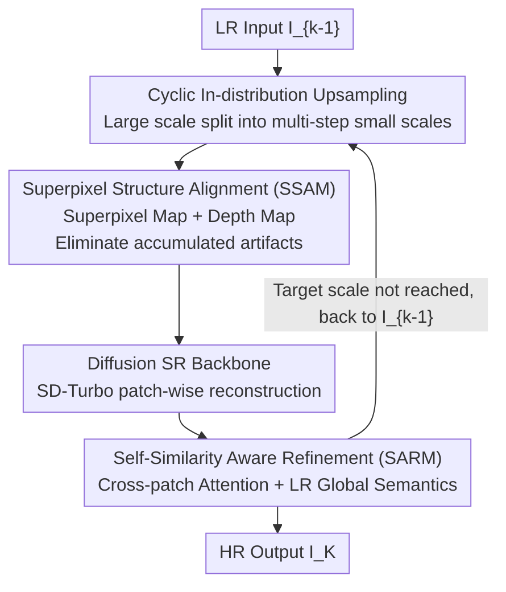

# CASR: A Robust Cyclic Framework for Arbitrary Large-Scale Super-Resolution with Distribution Alignment and Self-Similarity Awareness

**Conference**: CVPR 2026  
**Paper**: [CVF Open Access](https://openaccess.thecvf.com/content/CVPR2026/html/Guo_CASR_A_Robust_Cyclic_Framework_for_Arbitrary_Large-Scale_Super-Resolution_with_CVPR_2026_paper.html)  
**Code**: N/A (Not provided by the paper)  
**Area**: Image Restoration / Super-Resolution  
**Keywords**: Arbitrary-Scale SR, Cyclic Upsampling, Distribution Shift, Superpixel Alignment, Self-Similarity  

## TL;DR
CASR decomposes "arbitrarily large-scale super-resolution (SR)" into a sequence of small-scale upsampling cycles that "always fall within the training distribution." Using a single model iteratively with two specific modules—the Superpixel Structure Alignment Module (SSAM) to suppress distribution drift during cycles, and the Self-Similarity Aware Refinement Module (SARM) to ensure texture consistency in patch-based reconstruction—it significantly outperforms existing arbitrary-scale methods in perceptual metrics like LPIPS and MUSIQ under extreme $\times 8$ to $\times 30$ magnification.

## Background & Motivation

**Background**: Arbitrary-Scale Super-Resolution (ASISR) aims to reconstruct high-resolution (HR) images at any magnification factor from a single low-resolution (LR) image using a unified model. Dominant approaches include Implicit Neural Representations (e.g., LIIF using MLPs for coordinate-based RGB queries) or generative priors built upon them (Normalizing Flows like LINF, Diffusion like IDM), which perform well within the scale range covered during training.

**Limitations of Prior Work**: Once the inference scale exceeds the training range (e.g., training up to $\times 4$ but inferring at $\times 8$ or $\times 30$), these methods degrade sharply. The LR-to-HR mapping, texture statistics, and reconstruction priors become mismatched, leading to blurring, loss of detail, and severe artifacts. The authors quantify this "distribution drift during cascaded upsampling" using the SIFID metric.

**Key Challenge**: Directly predicting large scales pushes the model out of its training distribution, leading to unstable optimization and unreliable convergence due to the ill-posed nature of SR. Alternatively, "cascading multiple specialized SR networks" requires multiple models, suffers from parameter redundancy, and lacks flexibility for dynamic scales. Both paths have inherent flaws.

**Goal**: To achieve stable, high-quality reconstruction at arbitrary (especially extreme) scales using a single model, ensuring each step remains constrained within the model's training distribution.

**Key Insight**: The problem is revisited from the perspective of "cross-scale distribution transfer." Since the model is reliable only within $\le \times 4$, it should not "jump" too far at once. An extreme scale $s$ can be decomposed into a product of sub-scales $s = s_1 \times s_2 \times \cdots \times s_K$, where each $s_i \le s_{max}$, making every step an "in-distribution" small upsampling.

**Core Idea**: Replace "one-time large-scale extrapolation" with "cyclic reuse of the same SR model for gradual upsampling." This rewrites super-resolution as a series of distribution-consistent scale transfers. Two modules, SSAM and SARM, are designed to address the new challenges introduced by cycles: inter-iteration distribution drift and texture inconsistency across patches.

## Method

### Overall Architecture

Given an LR image $I_0$ and an arbitrary scale $s$, CASR first decomposes $s$ into $K$ sub-scales not exceeding the training upper bound $s_{max}$ (set to 4 in experiments). It then performs $K$ iterative upsamplings: step $k$ takes the previous output $I_{k-1}$ and enlarges it by $s_k$ to produce $I_k$, until $I_K$ is reached. The key is that the input distribution for each step is "pulled back" into the model's familiar range, avoiding instability.

Each single step consists of three serial stages: First, **SSAM** (Superpixel Structure Alignment) decomposes $I_{k-1}$ into a noise-robust "superpixel map + depth map" representation to erase accumulated artifacts. Second, the image is tiled into patches and fed into a diffusion-based SR backbone (SD-Turbo) for patch-wise reconstruction. Finally, **SARM** (Self-Similarity Aware Refinement) exchanges global information between patches to maintain cross-patch texture consistency before merging back into the full-resolution $I_k$. The entire cycle uses a single set of weights.

### Key Designs

**1. Cyclic In-distribution Amplification: Rewriting extrapolation as multi-step transfer**

Forcing a model to upscale by $\times 30$ in one jump forces it to operate far from its training distribution, causing blurring and artifacts. CASR decomposes the target scale $s$ into $s = s_1 \times s_2 \times \cdots \times s_K$, where each $s_k \le s_{max}$. Each step is a task the model handles well, with the output of the previous step refined in the next. This ensures reachability of any scale while maintaining stability and memory efficiency. The authors prove that "multi-step" alone is insufficient without solving distribution drift, as baselines do not improve under the same multi-step setup.

**2. SSAM: Truncating distribution drift via superpixel and depth dual representation**

Cyclic upsampling has a side effect: the SR network enhances edges and textures, but also amplifies residual noise and ringing in every round, causing feature statistics to drift. SSAM performs "structural purification" before each round. It partitions the image into $n \times n$ superpixels using a lightweight Superpixel Segmentation Network (SSN) to predict assignment probabilities. Each region $r$ is normalized by its mean:

$$C^{k-1}_r = \frac{1}{|r|}\sum_{i \in r} I^{k-1}_i$$

Superpixels aggregate perceptually similar pixels, acting as a sparse smoothing representation that erases accumulated artifacts while preserving content. To prevent the loss of edge continuity, a pre-trained DepthAnything model extracts a depth map as a geometric constraint. The combined "low-frequency superpixels + high-frequency depth" representation provides a stable, distribution-aligned input for the SR backbone.

**3. SARM: Enforcing cross-patch consistency via self-similarity awareness**

Due to memory constraints of diffusion backbones, large images are processed as independent patches. While overlapping reduces boundary artifacts, it fails to preserve "cross-patch self-similarity"—repeated structures (like windows) might be reconstructed differently across patches. SARM explicitly models this. Using a pre-trained SAM encoder, semantic embeddings $e_k$ and $e_{gt}$ are extracted to compute self-similarity matrices:

$$R_k = e_k(e_k)^\top, \qquad R_{gt} = e_{gt}(e_{gt})^\top$$

The mechanism caches bottleneck features $f$ from each patch and applies a global self-attention across these tokens, allowing patches to "see" the global pattern distribution. Global semantics $g$ from the original LR image $I_{k-1}$ are also injected via cross-attention. The model is trained with a correlation loss:

$$L_{corr} = \lVert R_k - R_{gt} \rVert^2$$

### Loss & Training

The backbone uses the SD-Turbo one-step diffusion model. All pre-trained parameters are frozen except for lightweight LoRA adapters in the VAE encoder (rank 16) and U-Net (rank 32). Structural control signals are injected via a ControlNet branch. Training occurs in two stages:

Stage 1 (SR stage): Freeze SARM, fine-tune the backbone with reconstruction and depth consistency losses:

$$L_{rec} = \lambda_1 L_2 + \lambda_2 L_{LPIPS} + \lambda_3 L_{GAN}, \qquad L_{depth} = \lVert \mathrm{Norm}(d_k) - \mathrm{Norm}(d_{gt})\rVert^2$$

Stage 2: Freeze the backbone and ControlNet, train the global fusion module (SARM) with the additional correlation term: $L_{total2} = L_{rec} + \lambda_4 L_{depth} + \lambda_5 L_{corr}$.

## Key Experimental Results

### Main Results

Comparison of perceptual quality across $\times 8$ to $\times 30$ on the DIV8K dataset. CASR is superior at all scales, with a widening gap at extreme scales. At $\times 30$, LPIPS is 16.9% better than LIIF+Diff.

| Scale | Metric | CASR | LIIF+Diff | IDM | LINF |
|------|------|------|-----------|-----|------|
| $\times 8$ | LPIPS↓ | **0.363** | 0.411 | 0.486 | 0.442 |
| $\times 8$ | MUSIQ↑ | **53.63** | 28.99 | 24.11 | 26.01 |
| $\times 18$ | LPIPS↓ | **0.450** | 0.550 | 0.656 | 0.578 |
| $\times 30$ | LPIPS↓ | **0.501** | 0.603 | 0.705 | 0.625 |
| $\times 30$ | MUSIQ↑ | **41.76** | 16.16 | 23.84 | 16.36 |

On real-world data (RealSR), CASR also leads significantly. At $\times 30$, its MUSIQ/NIQE/PI scores improve upon the second-best IDM by 34.1% / 6.5% / 9.5% respectively.

### Ablation Study

Component effectiveness at $\times 18$ magnification:

| Configuration | LPIPS↓ | MUSIQ↑ | Explanation |
|------|--------|--------|------|
| Base (Backbone only) | 0.585 | 31.73 | Distribution drift during iterations leads to artifacts. |
| + Superpixels | 0.471 | 42.23 | Sharpens boundaries, stabilizes features (Major gain). |
| + Depth | 0.467 | 45.18 | Enhances geometric fidelity. |
| + SARM (Full) | **0.450** | **51.44** | Achieves cross-patch texture consistency. |

### Key Findings
- **High impact of Superpixel module**: Adding superpixels drops LPIPS from 0.585 to 0.471, confirming that "cyclic failure" is primarily caused by distribution drift.
- **Multi-step requires drift correction**: Baselines do not improve simply by adopting a multi-step setup, validating the necessity of the proposed alignment modules.
- **Superiority at extreme scales**: While baselines fail at $\times 30$, CASR maintains a MUSIQ score above 40.

## Highlights & Insights
- **Paradigm Shift**: Instead of "larger models/more data," the approach focuses on "how representations evolve with scale." The core insight is that extreme SR quality depends on staying within the training distribution at every intermediate step.
- **Efficient Weight Reuse**: Handling arbitrary scales with a single set of weights is more parameter-efficient and flexible than cascaded specialized networks.
- **Distribution Purification**: Using superpixels and depth to "reset" the image to a stable manifold within a cycle is a clean trick applicable to other iterative generation tasks.
- **Global Consistency with Low Overhead**: Applying attention only to cached bottleneck tokens ensures global consistency without the quadratic cost of full HR self-attention.

## Limitations & Future Work
- **Static Partitioning**: The current fixed $4 \times 4$ superpixel size might not be optimal for all content. Future work could involve content-adaptive superpixels.
- **Scale Decomposition**: The paper does not provide a sensitivity analysis on how the choice of sub-scale decomposition ($s_k$) affects the final result in non-integer cases.
- **Heavy Pre-trained Dependency**: Reliance on multiple models (SD-Turbo, DepthAnything, SAM, ControlNet) may lead to high inference latency and memory peaks, which are not fully analyzed.
- **Perceptual vs. Fidelity**: Reliance on MUSIQ/NIQE might overlook "hallucinated" textures that deviate from the ground truth.

## Related Work & Insights
- **vs. Implicit Neural Representations (LIIF/CiaoSR)**: These fail beyond $\times 4$. CASR shows that the issue is distribution drift, not the representation's capacity.
- **vs. Generative ASISR (LINF/IDM)**: These suffer from blocky artifacts or over-smoothing at large scales, whereas CASR's SSAM and SARM provide better stability and consistency.
- **vs. Cascaded SR**: Unlike SR3's $1 \times \times 4 \times \times 4$ chain which requires multiple models, CASR uses one model with explicit distribution alignment, addressing the mismatch between steps fundamentally.

## Rating
- Novelty: ⭐⭐⭐⭐⭐ 
- Experimental Thoroughness: ⭐⭐⭐⭐ 
- Writing Quality: ⭐⭐⭐⭐ 
- Value: ⭐⭐⭐⭐⭐ 

<!-- RELATED:START -->

## Related Papers

- [\[CVPR 2026\] VoDaSuRe: A Large-Scale Dataset Revealing Domain Shift in Volumetric Super-Resolution](vodasure_a_large-scale_dataset_revealing_domain_shift_in_volumetric_super-resolu.md)
- [\[CVPR 2026\] Degradation-Robust Fusion: An Efficient Degradation-Aware Diffusion Framework for Multimodal Image Fusion in Arbitrary Degradation Scenarios](degradation-robust_fusion_an_efficient_degradation-aware_diffusion_framework_for.md)
- [\[CVPR 2026\] Next-Scale Prediction: A Self-Supervised Approach for Real-World Image Denoising](next-scale_prediction_a_self-supervised_approach_for_real-world_image_denoising.md)
- [\[CVPR 2026\] Toward Real-world Infrared Image Super-Resolution: A Unified Autoregressive Framework and Benchmark Dataset](real_iisr_infrared_image_super_resolution_autoregressive.md)
- [\[CVPR 2026\] SGDE: Self-supervised Geometry Degradation Estimation Framework for Coded Aperture Compressive Spectral Imaging](sgde_self-supervised_geometry_degradation_estimation_framework_for_coded_apertur.md)

<!-- RELATED:END -->
## Related Papers

- [\[CVPR 2026\] VoDaSuRe: A Large-Scale Dataset Revealing Domain Shift in Volumetric Super-Resolution](vodasure_a_large-scale_dataset_revealing_domain_shift_in_volumetric_super-resolu.md)
- [\[CVPR 2026\] Degradation-Robust Fusion: An Efficient Degradation-Aware Diffusion Framework for Multimodal Image Fusion in Arbitrary Degradation Scenarios](degradation-robust_fusion_an_efficient_degradation-aware_diffusion_framework_for.md)
- [\[CVPR 2026\] DRFusion: Degradation-Robust Fusion via Degradation-Aware Diffusion Framework](drfusion_degradation_robust_fusion_via_degradation_aware_diffusion_framework.md)
- [\[CVPR 2026\] Next-Scale Prediction: A Self-Supervised Approach for Real-World Image Denoising](next-scale_prediction_a_self-supervised_approach_for_real-world_image_denoising.md)
- [\[CVPR 2026\] Toward Real-world Infrared Image Super-Resolution: A Unified Autoregressive Framework and Benchmark Dataset](real_iisr_infrared_image_super_resolution_autoregressive.md)

<!-- RELATED:END -->
