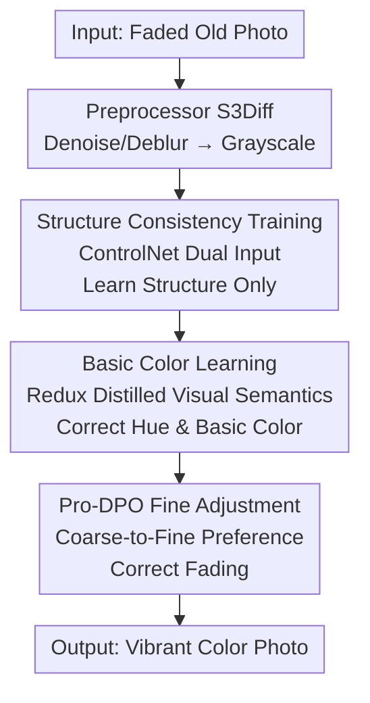

# ColorFLUX: A Structure-Color Decoupling Framework for Old Photo Colorization

**Conference**: CVPR 2026  
**Paper**: [CVF Open Access](https://openaccess.thecvf.com/content/CVPR2026/html/Li_ColorFLUX_A_Structure_Color_Decoupling_Framework_for_Old_Photo_Colorization_CVPR_2026_paper.html)  
**Code**: None (Not publicly available)  
**Area**: Image Restoration / Diffusion Models  
**Keywords**: Old photo colorization, structure-color decoupling, FLUX diffusion, progressive DPO, visual semantic prompt  

## TL;DR
ColorFLUX decouples "structure preservation" and "color completion" into two mutually frozen training stages. This allows the FLUX generative diffusion model to learn accurate semantic colorization without interference from structural tasks. Subsequently, a coarse-to-fine progressive DPO post-training corrects fading unique to old photos, surpassing existing open-source and closed-source commercial models on both synthetic and real old photos.

## Background & Motivation

**Background**: For colorizing black-and-white or faded photos, the mainstream approach involves using image restoration models for denoising and deblurring, followed by a specialized colorization model. Recent generative methods utilize Text-to-Image (T2I) diffusion models as color priors, using structural constraints to align the output with the grayscale input.

**Limitations of Prior Work**: This "restoration-then-colorization" pipeline performs poorly on old photos. First, grayscale images contain minimal color cues, forcing models to "guess" colors, which leads to semantic inconsistencies and **color bleeding** (where colors overflow into adjacent objects). Second, existing generative methods rely heavily on text prompts, but "a picture is worth a thousand words," and text often fails to describe fine-grained semantics.

**Key Challenge**: Old photos exhibit unique degradations not found in modern images—faded brightness and altered color hues—creating a significant **domain gap** with modern color distributions. Applying colorization priors trained on modern images directly to old photos often results in dim, grayish, or over-saturated outputs that do not align with modern aesthetics.

**Goal**: To provide rich and reasonable colors for faded old photos while maintaining structural consistency and correcting specific degradations like low saturation or over/under-exposure.

**Key Insight**: The authors observe that trying to learn "structure preservation" and "color learning" simultaneously causes task entanglement and mutual interference (manifesting as darkened subjects in joint training experiments). Consequently, these tasks should be **decoupled**: learn structure and color separately, freezing one module while training the other.

**Core Idea**: Using FLUX as the base, the framework decouples colorization into three serial training stages (Structure Consistency → Basic Colorization → Fine Color Adjustment). It replaces text prompts with visual semantic prompts distilled from grayscale images and uses progressive DPO instead of standard DPO to address old photo fading.

## Method

### Overall Architecture

ColorFLUX is built upon the Rectified Flow diffusion model, FLUX. The pipeline consists of "one preprocessing step + three decoupled training stages + inference." During inference, the old photo is first processed by a pre-trained low-level restorer (S3Diff) to remove noise and blur, resulting in a clean grayscale image $I_{gray}$. The colorization core then separates structure and color through three stages, with each stage freezing the capabilities learned in the previous one:

- **Stage I: Structure Consistency Training**: Injects structure into FLUX using ControlNet, making it responsible only for "structural alignment" without concerning color.
- **Stage II: Basic Color Learning**: Fine-tunes Redux to extract "de-biased" visual semantic prompts from grayscale images, leveraging FLUX's generative prior for basic colorization.
- **Stage III: Pro-DPO Fine Color Adjustment**: Employs LoRA and progressive preference optimization to push colors toward vibrant, modern aesthetics, correcting fading.

Decoupling is achieved through freezing: Stage I freezes FLUX/Redux, Stage II freezes ControlNet/FLUX, and Stage III only updates LoRA. This ensures color learning does not disrupt established structural alignment.

### Key Designs

**1. Structure Consistency Training: Focusing ControlNet on Structure**

This stage addresses "structure-color entanglement." Typically, ControlNet uses grayscale images as structural conditions. If the model also colorizes, structure and color compete within the same weights. ColorFLUX feeds **dual inputs** to ControlNet: the grayscale image and a "color visual prompt" $c_v$. Crucially, this prompt is extracted from the **Ground Truth (GT) color image $I_{gt}$** using a pre-trained Redux. Since the correct color is provided as a condition during training, the model is forced to focus solely on structural alignment. The loss is the Rectified Flow matching objective:

$$\mathcal{L}_{FM}=\mathbb{E}_{t,\,x_0\sim p(x_0),\,\epsilon\sim\mathcal{N}(0,I)}\big[\,\lVert v-v_\theta(x_t,t)\rVert^2\,\big],$$

where $x_t=(1-t)x_0+t\epsilon$ and target velocity $v=\epsilon-x_0$. Only ControlNet is updated. During inference, the GT color prompt is replaced by the version extracted from the grayscale image.

**2. Basic Color Learning: Distilling Redux into "Color-Neutral" Semantic Prompts**

Since GT colors are unavailable during inference, semantics must be extracted from grayscale photos. Challenges include existing color bias in grayscale photos and the ambiguity of text prompts. ColorFLUX fine-tunes the visual prompt extractor $\Phi$ (Redux) so that the embedding from $I_{gray}$ **approximates** the embedding extracted by a frozen copy $\Phi'$ from $I_{gt}$:

$$\mathcal{L}_{distill}=\lVert\Phi(I_{gray})-\Phi'(I_{gt})\rVert^2.$$

This ensures the grayscale semantics "look like" they come from a color image, neutralizing biases. To prevent Redux's output from drifting away from FLUX's prior space, a flow matching loss is added:

$$\mathcal{L}=\mathcal{L}_{FM}+\alpha\,\mathcal{L}_{distill}.$$

Only Redux is updated, ensuring complete decoupling from the structural training.

**3. Pro-DPO Fine Color Adjustment: Coarse-to-Fine Preference Optimization**

To correct residual fading (low saturation, exposure issues), DPO is used for post-training alignment. Preference triplets $(c,x_w,x_l)$ are constructed: the positive $x_w=I_{gt}$ is a natural color image, and the negative $x_l=I_{aug}$ is a version of $x_w$ with **randomized combinations** of brightness, contrast, and saturation (B/C/S) adjustments. DPO follows the Diffusion-DPO form for Rectified Flow:

$$-\mathbb{E}\Big[\log\sigma\Big(-\tfrac{\beta_t}{2}\big(\lVert v_w-v_\theta(x_t^w,t)\rVert^2-\lVert v_w-v_{ref}(x_t^w,t)\rVert^2-\lVert v_l-v_\theta(x_t^l,t)\rVert^2+\lVert v_l-v_{ref}(x_t^l,t)\rVert^2\big)\Big)\Big],$$

using a constant $\beta_t=\beta_c$. The **progressive (Pro-DPO)** innovation starts with **strong augmentation** to create obvious preference gaps (easy differentiation) and then gradually **reduces augmentation intensity** to teach the model fine-grained color adjustments. Training only applies rank=32 LoRA to the attention/FFN layers of all FLUX MM-DiT blocks.

### Loss & Training
- Stage I: $\mathcal{L}_{FM}$, training ControlNet only (FLUX/Redux frozen).
- Stage II: $\mathcal{L}=\mathcal{L}_{FM}+\alpha\,\mathcal{L}_{distill}$, training Redux only (ControlNet/FLUX frozen).
- Stage III: $\mathcal{L}_{Diff\text{-}DPO}$ (constant $\beta_t$), training LoRA (rank=32 on all MM-DiT blocks) with a two-stage coarse-to-fine strategy.
- Config: Base FLUX.1 + official Redux (SigLip image encoder + two-layer MLP); S3Diff preprocessor; 8×80GB GPUs for ~2 days; 1024×1024 resolution, Euler flow-matching scheduler, guidance=3.5, 8 sampling steps.

## Key Experimental Results

Evaluation uses Qwen2.5-VL-72B as an MLLM scorer (Qwen-score) across 6 dimensions: Color Richness (CRI), Color Reasonableness (CRA), Color Consistency (CCS), Structure Consistency (SCS), Aesthetics (AES), and Overall (OA). Three NR-IQA metrics (DeQA, Q-Insight, VQ-R1) are also used. Benchmarks include DIV2K-valid (synthesized), augmented DIV2K (simulated fading), and 50 RealOldPhotos.

### Main Results

ColorFLUX achieves the best performance in DeQA, VQ-R1, AES, and OA across three benchmarks. Results on RealOldPhotos (higher OA is better):

| Method | Type | DeQA | VQ-R1 | CRI | CRA | AES | OA |
|------|------|------|-------|------|------|------|------|
| DeOldify | GAN | 4.056 | 4.419 | 70.90 | 82.66 | 79.02 | 80.86 |
| DDColor | Enc-Dec | 4.090 | 4.500 | 76.20 | 82.36 | 82.42 | 82.70 |
| CtrlColor | Diffusion | 4.050 | 4.486 | 76.40 | 83.24 | 81.64 | 82.68 |
| FLUX-Kontext | FLUX Edit | 4.110 | 4.452 | 66.00 | 79.74 | 76.38 | 77.70 |
| Doubao | Comm. | 3.741 | 4.097 | **83.10** | 75.10 | 74.40 | 75.24 |
| **ColorFLUX** | **Ours** | **4.199** | **4.593** | 80.50 | **83.36** | **83.22** | **83.20** |

While Doubao has higher CRI (83.10), its results are **over-saturated and distorted**, leading to lower CRA (75.10). ColorFLUX balances richness and reasonableness with a faster inference time of 7.45s.

### Ablation Study

**(a) Losses for Basic Color Learning** (DIV2K-valid-synthesized):

| Config | DeQA | VQ-R1 | CRI | CRA | OA |
|------|------|-------|------|------|------|
| $\mathcal{L}_{FM}$ only | 3.889 | 4.432 | 46.35 | 68.45 | 69.91 |
| $\mathcal{L}_{distill}$ only | 4.044 | 4.552 | **58.55** | 70.65 | 75.12 |
| $\mathcal{L}_{FM}+\mathcal{L}_{distill}$ | **4.114** | **4.577** | 57.55 | **72.45** | **75.39** |

**(b) Strategy for Fine Color Adjustment** (DIV2K-valid-augmented):

| Config | DeQA | VQ-R1 | CRI | CRA | AES |
|------|------|-------|------|------|------|
| W/o DPO | 3.932 | 4.344 | 55.80 | 71.85 | 72.24 |
| SFT | 4.236 | 4.656 | 70.95 | 78.65 | 79.80 |
| One-stage DPO | **4.307** | 4.692 | 77.05 | 79.35 | 82.46 |
| **Pro-DPO** | 4.303 | **4.728** | **80.15** | **79.70** | **82.80** |

### Key Findings
- **Decoupling is Effective**: Joint training of Redux and ControlNet (no decoupling) leads to darkened subject colors, indicating interference. Sequential freezing ensures structure and color tasks remain distinct.
- **Complementary Losses**: Using only $\mathcal{L}_{distill}$ results in output drift (lower CRA), while only $\mathcal{L}_{FM}$ is inefficient for distillation; combining them yields the best results.
- **Progressive is Better**: Pro-DPO improves CRI and VQ-R1 compared to one-stage DPO. By training coarse-to-fine, the model learns subtle saturation adjustments rather than just avoiding extreme over-saturation. Note: CCS is slightly lower with Pro-DPO due to a trade-off between vibrancy and consistency.

## Highlights & Insights
- **Decoupling via Freezing**: Rather than simple branching, the model uses three training stages that freeze upstream capabilities, preventing the color task from degrading structural alignment.
- **GT Training / Distilled Inference**: Feeding GT colors to ControlNet during training forces focus on structure, while distilled prompts provide a seamless substitute during inference.
- **Explicit Fading Modeling**: Negative DPO samples are generated by applying B/C/S augmentations to simulate actual old photo fading, aligning the optimization directly with the problem.
- **MLLM Evaluation**: Utilizing Qwen2.5-VL-72B for 6-dimensional scoring addresses the lack of reliable metrics in colorization research.

## Limitations & Future Work
- **Reliance on External Preprocessor**: Performance is capped by the S3Diff restorer; an end-to-end framework could be more robust.
- **Training Cost**: High resource requirement (8 GPUs) and serial stages make reproduction difficult.
- **Custom Metrics**: MLLM scoring is subjective and prompt-dependent; more traditional reference-based metrics are missing.
- **Consistency vs. Vibrancy Trade-off**: Pro-DPO sacrifices some color consistency (CCS), which may be an issue for archival applications.

## Related Work & Insights
- **vs. CtrlColor**: Similar structural constraints but CtrlColor relies on text prompts, leading to color bleeding. ColorFLUX uses distilled visual prompts and Pro-DPO to handle fading.
- **vs. DDColor / DeOldify**: Traditional GAN/Enc-Dec routes lack color priors, causing bleeding. ColorFLUX balances richness and reasonableness through FLUX priors.
- **vs. Diffusion-DPO**: This work evolves DPO from one-time alignment to a two-stage progressive process tailored for artifact correction.

## Rating
- Novelty: ⭐⭐⭐⭐ The combination of structure-color decoupling, distilled prompts, and progressive DPO is a solid, well-motivated approach.
- Experimental Thoroughness: ⭐⭐⭐⭐ Compares against commercial models and uses MLLM scoring, though some code/reproducibility details are missing.
- Writing Quality: ⭐⭐⭐⭐ Clear narrative flow from motivation to the three-stage solution.
- Value: ⭐⭐⭐⭐ Highly practical for photo restoration; the decoupling paradigm is transferable to other generation tasks.

<!-- RELATED:START -->

## Related Papers

- [\[CVPR 2026\] CanonCGT: Reference-Based Color Grading via Canonical Pivot Representation](canoncgt_reference-based_color_grading_via_canonical_pivot_representation.md)
- [\[CVPR 2026\] Rethinking Knowledge Transfer in Image Quality Assessment: A Perceptual Preference Structure Alignment Perspective](rethinking_knowledge_transfer_in_image_quality_assessment_a_perceptual_preferenc.md)
- [\[CVPR 2026\] Polarization State Tracing for Reflection Removal and Color-Consistent Reconstruction](polarization_state_tracing_for_reflection_removal_and_color-consistent_reconstru.md)
- [\[CVPR 2026\] Life-IQA: Boosting Blind Image Quality Assessment through GCN-enhanced Layer Interaction and MoE-based Feature Decoupling](life-iqa_boosting_blind_image_quality_assessment_through_gcn-enhanced_layer_inte.md)
- [\[CVPR 2026\] From Events to Clarity: The Event-Guided Diffusion Framework for Dehazing](from_events_to_clarity_the_event-guided_diffusion_framework_for_dehazing.md)

<!-- RELATED:END -->
