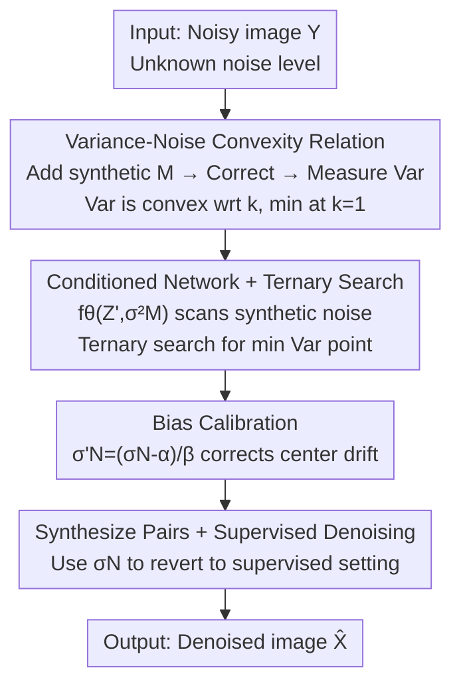

# Convexity-Aware Noise Calibration: A Self-Supervised Framework for Noise-Level-Unknown Image Denoising

**Conference**: CVPR 2026  
**Paper**: [CVF Open Access](https://openaccess.thecvf.com/content/CVPR2026/html/Wang_Convexity-Aware_Noise_Calibration_A_Self-Supervised_Framework_for_Noise-Level-Unknown_Image_Denoising_CVPR_2026_paper.html)  
**Code**: https://github.com/zhanzhanblue/CANC  
**Area**: Image Restoration / Self-Supervised Denoising  
**Keywords**: Self-supervised denoising, Noise estimation, Noisier2Noise, Ternary search, AWGN

## TL;DR
Ours (CANC) discovers that after adding synthetic noise to a noisy image and applying Noisier2Noise correction, the variance of the denoised output is a **convex curve** with respect to the ratio $k$ (synthetic noise/real noise variance), reaching its minimum at $k=1$ (where synthetic noise exactly matches real noise). By using a network conditioned on synthetic noise variance combined with a ternary search, the minimum point is identified to accurately estimate the noise level $\sigma_N$ without clean images or prior knowledge of noise levels. This estimate is then used to synthesize pairs for supervised training, enabling self-supervised denoising to match or even slightly exceed the performance of "noise-level-known" supervised models.

## Background & Motivation
**Background**: In Additive White Gaussian Noise (AWGN) denoising, supervised methods (DnCNN-S, Restormer, MambaIR) achieve peak performance when given paired clean-noisy images and a known noise level, but they require training separate models for each level. Unsupervised approaches are split between blind-spot networks (Noise2Void, Noise2Self, Neighbor2Neighbor) and traditional methods that directly estimate noise parameters (Foi, DWT, IVHC).

**Limitations of Prior Work**: Blind-spot methods rely on masking the center pixel to construct self-supervised signals, which causes **irreversible information loss**. Consequently, the networks fail to learn full image statistics, and their PSNR never reaches the level of supervised methods. Universal models (DnCNN-B) handle multiple noise levels in one network but lack specificity, performing worse than dedicated models. Traditional noise estimation methods suffer from instability, sensitivity to noise levels, and poor robustness, which limits the upper bound of subsequent denoising.

**Key Challenge**: Supervised denoising requires "known noise levels + paired data," but real-world noise levels are unknown, making it impossible to prepare paired images matching the real data—leaving the best-performing paradigm inapplicable.

**Goal**: Under the hard constraint of **having only noisy images with unknown noise distributions**, accurately estimate the real noise level $\sigma_N$ and then synthesize paired data to transform the problem back into a supervised denoising task.

**Key Insight**: The authors revisit Noisier2Noise, which adds synthetic noise $M$ to a noisy image $Y$ to obtain $Z'$ and then recovers the clean image via a correction formula, but it **requires $M$ to be known and $M=N$**. This work reverses the logic: if the level of $M$ is treated as an unknown variable to be scanned, how does the denoising result change? Intuition suggests that when $M$ exactly equals $N$, the denoising is most thorough and the output variance is minimized; any deviation results in residual noise and increased variance.

**Core Idea**: The relationship between "output variance vs. synthetic noise level" is rigorously derived as a **convex curve**. The synthetic noise variance at the minimum point equals the real noise variance. Thus, a ternary search can find this minimum to estimate $\sigma_N$ without requiring any clean images.

## Method

### Overall Architecture
CANC is a **two-stage self-supervised** framework. Stage 1 (Noise Estimation): A denoising network $f_\theta(Z', \sigma_M^2)$ is trained with the synthetic noise variance $\sigma_M^2$ as an explicit condition. For each noisy image $Y$, various levels of synthetic noise $M$ are added to obtain $Z'=Y+M$. The Noisier2Noise correction yields an estimate $\hat X$, and its variance $\mathrm{Var}(\hat X)$ is measured. Since this variance is convex with respect to $\sigma_M^2$, a ternary search quickly approximates the $\sigma_M^2$ that minimizes variance. A linear calibration is then applied to correct biases, resulting in the estimated real noise level $\sigma_N$. Stage 2 (Denoising): The estimated $\sigma_N$ is used to synthesize noisy-clean pairs (reverting to a standard supervised setting), which are used to train any standard supervised denoising network (DnCNN-S / BM3D / Restormer).

The following diagram illustrates the pipeline, with nodes mapping to "Key Designs":

### Key Designs

**1. Variance-Noise Convexity Relation: Converting unknown noise levels into an optimizable convex problem**

This is the theoretical core, addressing the limitation that Noisier2Noise cannot be used without knowing the noise level. Let $X$ be the clean image, $N\sim\mathcal N(0,\sigma_N^2)$ be the real noise, $M\sim\mathcal N(0,\sigma_M^2)$ be the additional synthetic noise, and the noisier image be $Z'=Y+M=X+N+M$. A network $f_\theta(Z',\sigma_M^2)$ is trained with L2 loss to predict $Y$ from $Z'$. The optimal solution satisfies $f_{\theta^*}(Z',\sigma_M^2)=\mathbb E[Y\mid Z']$. Using Tweedie's formula, $\mathbb E[N\mid Z']=\frac{\sigma_N^2}{\sigma_N^2+\sigma_M^2}(Z'-X)$. Substituting this into the Noisier2Noise correction $\hat X=2\mathbb E[Y\mid Z']-Z'$ yields the key residual expression:

$$\hat X = X + \frac{\sigma_N^2-\sigma_M^2}{\sigma_N^2+\sigma_M^2}(N+M)$$

The residual coefficient is 0 only when $\sigma_M^2=\sigma_N^2$, restoring the clean image $\hat X=X$. Further calculating the variance of the estimator, let $\sigma_M^2=k\sigma_N^2$ ($k>0$):

$$\mathrm{Var}(\hat X)=\mathrm{Var}(X)+\frac{(1-k)^2}{1+k}\,\sigma_N^2$$

Differentiating with respect to $k$ yields $\frac{d}{dk}\frac{(1-k)^2}{1+k}=\frac{-3+2k+k^2}{(1+k)^2}$, which has a zero at $k=1$ ($k=-3$ is irrelevant). For $0<k<1$, the variance decreases with $k$; for $k>1$, it increases. This forms a **convex** curve with a unique minimum at $k=1$. Thus, find the synthetic noise level that minimizes the output variance equals the real noise level. This converts an unsupervised estimation problem into a one-dimensional convex optimization problem.

**2. Conditioned Network + Ternary Search: Efficiently approximating the real noise level along the convex curve**

With convexity established, the identity of the minimum point must be found, requiring the network to perform correctly at **any** synthetic noise level. The authors feed $\sigma_M^2$ into the network $f_\theta(Z',\sigma_M^2)$ as an explicit condition. During training, $\sigma_M^2$ is randomly sampled for each image, forcing the network to implicitly learn $\sigma_M^2$ statistics and provide $\mathbb E[Y\mid Z']$ even when synthetic and original noise distributions differ. During inference, the network is fixed, and $\mathrm{Var}(\hat X)$ is measured while scanning $\sigma_M^2$. Using the convexity, a ternary search (Algorithm 1) is employed: in an interval $[L,R]$, two points $m_1=L+\frac{R-L}{3}$ and $m_2=R-\frac{R-L}{3}$ are compared. The side with the smaller variance is kept, discarding the other third. This repeats until $R-L<\epsilon$. The midpoint $(L+R)/2$ is taken as $\sigma_M^{2*}$, and $\sigma_N$ is set to $\sigma_M$. This reduces estimation cost from linear to logarithmic.

**3. Bias Calibration: Correcting systematic drift towards the interval center**

While $\sigma_M^2=\sigma_N^2$ is theoretically optimal, imperfect network training (finite PSNR) and random noise in variance measurements cause estimates to drift towards the geometric center of the search interval $[0,55]$. A simple linear calibration $\sigma'_N=(\sigma_N-\alpha)/\beta$ is used to adjust the estimates, with parameters fitted via least-squares regression across multiple datasets ($\alpha=1.2591,\ \beta=0.9622$). Although empirical (detailed derivations are in Supplementary Materials Sec. 9–10), this calibration is effective for practical deployment; at $\sigma=25/255$, the estimate is $25.21/255$ with a percentage error $\%E=0.84$.

### Loss & Training
The Stage 1 training objective is the conditioned reconstruction loss $L'(\theta)=\min_\theta \mathbb E\big[\|f_\theta(Z',\sigma_M^2)-Y\|_2^2\big]$, where $Z'=Y+M$ and the variance of $M\sim\mathcal N(0,\sigma_M^2)$ is randomly sampled. Noise estimation is evaluated using the percentage error $\%E=\frac{|\sigma_{est}-\sigma|}{\sigma}\times100$. Stage 2 follows a standard supervised denoising pipeline (DFWB dataset, fixed architecture, unified hyperparameters) with no specialized loss.

## Key Experimental Results

### Main Results
In the color RGB setting (trained on DFWB, $\sigma=25/255$, using DnCNN backbone), CANC estimates $\sigma=25.21/255$. It outperforms unsupervised methods across four datasets and remains nearly identical to—or slightly better than—the "noise-level-known" DnCNN-S:

| Dataset | Metric | Ours | DnCNN-B (Unknown) | DnCNN-S (Known) |
|--------|------|------|---------------|---------------|
| CBSD68 | PSNR/SSIM | **31.21**/**0.886** | 31.13/0.883 | 31.21/0.886 |
| Kodak24 | PSNR/SSIM | **32.11**/**0.879** | 32.03/0.876 | 32.11/0.878 |
| McMaster | PSNR/SSIM | **32.26**/**0.887** | 32.13/0.885 | 32.25/0.887 |
| Urban100 | PSNR/SSIM | **31.41**/**0.912** | 31.24/0.910 | 31.41/0.912 |

In grayscale multi-noise levels, the gap $\Delta$ between CANC (Proposed-DnCNN) and the true-level DnCNN-S is minimal. Applying the estimated values to BM3D / Noisier2Noise / Restormer shows almost no performance loss:

| Supervised Method (SET12 σ=25) | Original PSNR | Ours Applied | Δ |
|----------------------|-----------|-----------|----|
| BM3D | 30.00 | 29.99 | 0.01 |
| Noisier2Noise | 29.81 | 29.77 | 0.04 |
| DnCNN-S | 30.39 | 30.35 | 0.04 |
| Restormer | 30.62 | 30.62 | 0.00 |

### Ablation Study
Comparing noise estimation accuracy ($\%E$, lower is better), CANC consistently outperforms traditional methods across three noise levels, validating Designs 2 and 3:

| Method | SET12 σ=15 %E | σ=25 %E | σ=50 %E | BSD68 σ=25 %E |
|------|--------------|---------|---------|---------------|
| Foi et al. | 8.13 | 20.38 | 3.94 | 3.36 |
| Pimpalkhute et al. | 1.82 | 2.46 | 8.04 | 2.37 |
| IVHC | 3.06 | 6.06 | 7.19 | 4.27 |
| **Proposed** | **1.47** | **0.35** | **0.10** | **0.90** |

Variance trend validation (Sec. 5.3): When scanning $\sigma_M$ from 5/255 to 60/255 on SET12/BSD68, the measured $\mathrm{Var}(\hat X)$ curve closely matches the theoretical convex curve, with the minimum falling near the real $\sigma_N=25/255$, confirming the convexity derivation in Design 1.

### Key Findings
- **Convexity is the lifeblood of the method**: The convexity of the variance-noise relationship provides the basis for estimation (minimum point = real noise level) and enables ternary search. The alignment between measured and theoretical curves is the most significant validation.
- **Lossless information is the root of superiority**: Noise2Void/Noise2Self/Neighbor2Neighbor lose information due to masking or downsampling, capping their PSNR. CANC retains all pixel information, allowing it to match supervised performance.
- **Counter-intuitive explanation for exceeding supervised**: An estimate of 25.21 (slightly higher than the true 25) leads to more "aggressive" denoising and smoother outputs, which can align better with human perception of "cleanliness," resulting in slightly higher PSNR/SSIM.
- **Measured variance is lower than theory**: MSE training biases networks towards smoother outputs. This smoothing is more pronounced in larger datasets like BSD68, creating a larger gap between measured and theoretical variance. The gap narrows when synthetic noise approaches the true level and the network converges better.

## Highlights & Insights
- **Converting Unsupervised Estimation to 1D Convex Optimization**: Deriving that output variance is convex with respect to the noise ratio $k$ and minimized at $k=1$ is a clean mathematical insight that drives the entire estimation process.
- **Efficient Conditioned Network + Ternary Search**: The combo requires no gradients or clean images and uses convexity to achieve logarithmic-scale approximation, making it highly reproducible.
- **Decoupling Estimation from Denoising**: The $\sigma_N$ estimated in Stage 1 can be used plug-and-play with any denoiser like BM3D, DnCNN, or Restormer ($\Delta < 0.05$dB). This provides the missing noise-level module for high-performance supervised methods.

## Limitations & Future Work
- **Strong AWGN Assumption**: The derivation assumes zero-mean, pixel-independent, signal-independent Gaussian white noise. Mixed Poisson-Gaussian, spatially correlated, or JPEG compression noise remain unvalidated.
- **Empirical Calibration**: The parameters $\alpha=1.2591$ and $\beta=0.9622$ are fitted to specific datasets. Their robustness beyond the [0, 55] range or different data distributions is uncertain (refer to supplementary materials).
- **Dependence on Training Quality**: Measured variance deviates from theory due to smoothing biases. Weak backbones or insufficient data for convergence would affect the accuracy of the minimum point location.
- **Future Directions**: Extending convexity analysis to non-Gaussian/signal-dependent noise or replacing linear calibration with more principled correction methods would expand the applicability.

## Related Work & Insights
- **vs Noisier2Noise**: Both share the "add synthetic noise + correction" structure. However, Noisier2Noise requires $M=N$ and a known noise level. This work treats $M$ as an unknown and uses convexity to reverse-engineer the real level, upgrading "known only" to "unknown estimable."
- **vs Blind-spot Methods**: Methods like Noise2Void use masking/downsampling, which is lossy. This work retains all pixel information and reverts to a supervised setting once the noise is estimated, although it is more dependent on the AWGN assumption.
- **vs Traditional Estimation**: Traditional methods rely on manual statistics or frequency domain splitting, which are unstable across levels. This work uses deep fitting and convex search to achieve lower and more stable $\%E$ across levels 15/25/50.

## Rating
- Novelty: ⭐⭐⭐⭐⭐ Formulating noise estimation as a 1D convex search via Noisier2Noise variance analysis is elegant and theoretically sound.
- Experimental Thoroughness: ⭐⭐⭐⭐ Covers estimation accuracy, trends, multi-backbone applications, and baselines, though lacks validation on real raw noise.
- Writing Quality: ⭐⭐⭐⭐⭐ The transition from Noisier2Noise to convexity derivation is clear and logically consistent.
- Value: ⭐⭐⭐⭐ Provides a plug-and-play estimation module for noise-level-dependent denoisers, but is currently limited by the AWGN assumption.

<!-- RELATED:START -->

## Related Papers

- [\[ICCV 2025\] Blind2Sound: Self-Supervised Image Denoising without Residual Noise](../../ICCV2025/image_restoration/blind2sound_self-supervised_image_denoising_without_residual_noise.md)
- [\[CVPR 2026\] Next-Scale Prediction: A Self-Supervised Approach for Real-World Image Denoising](next-scale_prediction_a_self-supervised_approach_for_real-world_image_denoising.md)
- [\[CVPR 2026\] TM-BSN: Triangular-Masked Blind-Spot Network for Real-World Self-Supervised Image Denoising](tm-bsn_triangular-masked_blind-spot_network_for_real-world_self-supervised_image.md)
- [\[CVPR 2026\] PNG: Diffusion-Based sRGB Real Noise Generation via Prompt-Driven Noise Representation Learning](diffusion-based_srgb_real_noise_generation_via_prompt-driven_noise_representatio.md)
- [\[CVPR 2026\] LF-BVN: Blind-View Network for Self-Supervised Light Field Denoising](lf-bvn_blind-view_network_for_self-supervised_light_field_denoising.md)

<!-- RELATED:END -->
