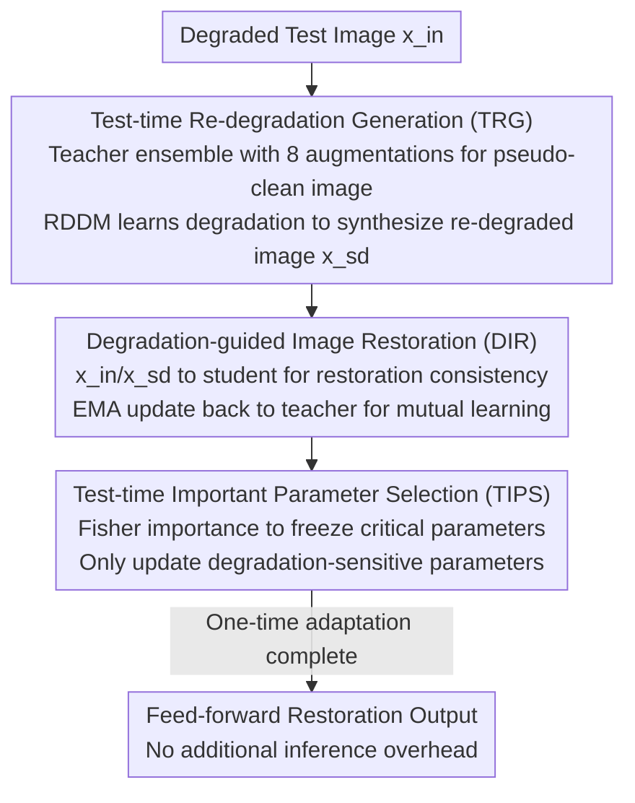

# Degradation-Consistent Test-Time Adaptation for All-in-One Image Restoration

**Conference**: CVPR 2026  
**Paper**: [CVF Open Access](https://openaccess.thecvf.com/content/CVPR2026/html/Tang_Degradation-Consistent_Test-Time_Adaptation_for_All-in-One_Image_Restoration_CVPR_2026_paper.html)  
**Code**: https://github.com/tonia86/DCTTA  
**Area**: Image Restoration  
**Keywords**: Test-Time Adaptation, All-in-One Image Restoration, Degradation Consistency, Diffusion Degradation Generation, Source-free Domain Adaptation

## TL;DR
To address the performance drop of All-in-One Image Restoration (AiOIR) models when test-time degradation distributions deviate from training data, this paper proposes DCTTA. It utilizes a diffusion degradation generator at test time to learn the mapping from "pseudo-clean images to degraded images," constructing "degradation–re-degradation" self-supervised pairs. The model is fine-tuned online based on restoration consistency, while updating only degradation-sensitive parameters to preserve pre-trained knowledge. This approach achieves a PSNR gain of up to +4.57 dB on the Rain100H dataset.

## Background & Motivation
**Background**: All-in-One Image Restoration (AiOIR) uses a single unified model to simultaneously handle multiple degradations such as denoising, dehazing, and deraining. Compared to the traditional approach of one network per degradation, it is more flexible and versatile, making it a popular research direction in low-level vision. It is categorized into non-blind (known degradation types, explicit prior injection) and blind (no priors, the model infers and restores degradations independently).

**Limitations of Prior Work**: Most AiOIR methods, whether blind or non-blind, implicitly assume a closed-set scenario where the training and testing degradation distributions are identical. Performance drops significantly when encountering unseen degradations or distribution shifts (e.g., training on light rain in Rain100L but testing on heavy rain in Rain100H). The paper uses t-SNE to confirm that although Rain100L, Rain100H, and Rainstreak are visually similar, their feature distributions differ noticeably, leading to severe performance degradation on the most shifted dataset, Rain100H.

**Key Challenge**: Adapting to the target domain during the test phase without access to source data or retraining presents two unavoidable challenges. First, the lack of reliable supervision—image restoration is a pixel-level regression task, making it difficult to create accurate self-supervised signals from unlabeled degraded images. Second, online parameter updates can damage pre-trained capabilities, potentially overwriting source domain knowledge and introducing artifacts, leading to instability or even performance degradation.

**Key Insight**: The authors leverage a simple but effective observation: multiple versions of the same scene with different degrees of degradation should ideally map to the same clean image (clean consistency). If "same scene, different degradation" image pairs can be artificially created at test time, the constraint that their restoration results should be consistent can be used to build self-supervised signals without ground truth labels.

**Core Idea**: A diffusion model is used as a degradation generator to learn the process of "pseudo-clean image → original degraded image" and then generate a re-degraded version, forming a "degradation–re-degradation" pair. A student network is forced to maintain consistent restoration outputs for both images during source-free domain adaptation. Simultaneously, only degradation-sensitive parameters are updated while freezing parameters critical to pre-trained knowledge to maintain stability. To the authors' knowledge, this is the first source-free test-time adaptation framework specifically designed for AiOIR.

## Method

### Overall Architecture
DCTTA is built on a teacher–student architecture: a pre-trained source model $f_\xi$ acts as the teacher, and the target model to be adapted $f_\theta$ acts as the student (initial weights copied from the teacher). Given a test degraded image $x_{in}$, the pipeline consists of three steps: ① **Test-time Re-degradation Generation (TRG)**, which first uses the teacher to produce pseudo-clean labels and then trains a diffusion degradation generator to learn the "clean → degraded" process to synthesize a re-degraded image $x_{sd}$, forming the pair $(x_{in}, x_{sd})$; ② **Degradation-guided Image Restoration (DIR)**, where both images are fed into the student model to perform online fine-tuning using self-supervised consistency loss + adaptation consistency loss, while updating the teacher via EMA for mutual learning; ③ **Test-time Important Parameter Selection (TIPS)**, which calculates the importance of each parameter once before adaptation, freezing the most critical ones and allowing only degradation-sensitive parameters to update to prevent catastrophic forgetting. The adaptation is a one-time update for the target test domain; after tuning, the model performs standard feed-forward inference without additional overhead.

### Key Designs

**1. Test-time Re-degradation Generation (TRG): Learning the process itself to create data without ground truth**

To perform self-supervision, "image pairs" are required. TRG's approach is to infer the degradation from an approximate clean image and then generate a new degraded image. This involves two steps: first, the pre-trained AiOIR teacher performs 8 geometric augmentations (random 90° rotations + flips) on $x_{in}$. Each is restored, transformed back, and averaged to obtain a robust pseudo-label $\bar y = \frac{1}{8}\sum_{i=1}^{8} R_i\big(f_\xi(A_i(x_{in}))\big)$, where $A_i$ is the $i$-th augmentation and $R_i$ is the corresponding inverse transformation—multi-view ensemble suppresses random errors of a single restoration. Then, a diffusion degradation generator is trained to model the "distribution gap from $\bar y$ to $x_{in}$." The authors utilize RDDM (Residual Diffusion) with the optimization objective $L_{res}(\theta)=\mathbb{E}\big[\lVert I_{res}-I^\theta_{res}(z_t,t,\bar y)\rVert_2^2\big]$, where the residual $I_{res} = \bar y - x_{in}$ represents the "clean minus degraded" difference, and $z_t$ is an intermediate variable synthesized from $\bar y$ and $x_{in}$. Thus, the generator learns the actual degradation distribution of the current test set rather than a fixed kernel. After training, it can sample $\bar y$ to synthesize the re-degraded image $x_{sd}$. Notably, the diffusion model acts only as a "degradation data factory" and is not needed during inference—this differs fundamentally from methods like TAO that rely on diffusion during inference.

**2. Degradation-guided Image Restoration (DIR): Using "same scene should restore to the same clean image" as unlabeled supervision**

With the $(x_{in}, x_{sd})$ pair representing different degradations of the same scene, DIR implements clean consistency as a loss. Both images pass through the student to obtain $y_{in}=f_\theta(x_{in})$ and $y_{sd}=f_\theta(x_{sd})$. Since they originate from the same scene, the restoration results should be consistent. Thus, the self-supervised loss consists of pixel consistency $L^s_{cons}=\lVert y_{in}-y_{sd}\rVert_1$ plus VGG perceptual consistency $L^s_{per}=\sum_l\lVert\phi_l(y_{in})-\phi_l(y_{sd})\rVert_2^2$, combined as $L_s=\lambda_{cons}L^s_{cons}+\lambda_{per}L^s_{per}$. To prevent the model from drifting, an adaptation consistency loss pulls the student's output on the re-degraded image $y_{sd}$ towards the teacher's pseudo-label $\bar y$: $L_a=\lambda_{cos}L^a_{cons}(\bar y,y_{sd})+\lambda_{per}L^a_{per}(\bar y,y_{sd})$. This uses the teacher's stable prediction as a soft constraint. The total loss is $L=L_s(y_{in},y_{sd})+\alpha\cdot L_a(\bar y,y_{sd})$.

$$\xi = \eta\cdot\xi + (1-\eta)\cdot\theta$$

Furthermore, the teacher is not static: at each step, the teacher's parameters $\xi$ are updated using an Exponential Moving Average (EMA, $\eta=0.95$) of the student's parameters $\theta$, allowing the pseudo-labels to improve synchronously with the adaptation.

**3. Test-time Important Parameter Selection (TIPS): Only updating degradation-sensitive parameters**

Online full-parameter updates are risky as they can wash away source domain knowledge. TIPS is based on the logic that while test degradations change, the restoration task remains the same. Therefore, parameters carrying "restoration capability" should be preserved, with only degradation-sensitive parts allowed to adapt. These are distinguished using a diagonal approximation of the Fisher Information Matrix. First, an augmentation consistency loss $L_c(x_{in})=\sqrt{(y-f_\xi(x_{in}))^2+\epsilon}$ is defined. The importance of parameter $\theta_i$ is then calculated as the squared gradient of this loss with respect to the parameter, averaged over the test set: $\omega(\theta_i)=\frac{1}{|D|}\sum_{x_{in}\in D}\big(\frac{\partial L_c(x_{in})}{\partial\theta_i}\big)^2$. The set of parameters in the top $\rho$ percentile of importance $S=\{\theta_i\mid\omega(\theta_i)>\tau_\rho\}$ (default $\rho=0.4$) is frozen, while the rest are updated. Crucially, this selection is calculated only once before TTA begins, avoiding repeated evaluation costs during the online phase. In ablation studies, removing TIPS caused the PSNR to drop from 20.21 directly to 14.24, showing that freezing critical parameters is essential for stability.

### Loss & Training
The total loss is $L=L_s+\alpha L_a$, with empirical hyperparameters $\lambda_{cons}=1$, $\lambda_{per}=0.01$, $\alpha=1$, and EMA decay $\eta=0.95$. RDDM sampling steps are set to 5. Optimization uses Adam (learning rate $2\times10^{-4}$, $(\beta_1,\beta_2)=(0.9,0.999)$) with a batch size of 1 on an RTX 3090. The framework is backbone-agnostic and validated as plug-and-play on AirNet, PromptIR, and DFPIR.

## Key Experimental Results

### Main Results
In a three-degradation setting (denoising/dehazing/deraining, PromptIR configuration), training and testing distributions were intentionally shifted (e.g., training on Rain100L, testing on Rain100H). DCTTA applied to three backbones achieved the best results for each dataset, with PromptIR+DCTTA achieving the highest average:

| Method | Kodak24(Denoise) PSNR | DenseHaze(Dehaze) PSNR | Rain100H(Derain) PSNR | Avg PSNR | Avg SSIM |
|------|------|------|------|------|------|
| AirNet | 25.57 | 10.90 | 14.62 | 16.95 | 0.606 |
| AirNet+DCTTA | 25.79 | 12.49 | 17.34 | **18.14** | **0.623** |
| PromptIR | 25.41 | 11.48 | 15.64 | 17.31 | 0.612 |
| PromptIR+DCTTA | 25.78 | 11.65 | **20.21** | **18.61** | **0.654** |
| DFPIR | 24.57 | 11.61 | 15.94 | 17.21 | 0.616 |
| DFPIR+DCTTA | 24.66 | 11.73 | 20.27 | **18.37** | **0.647** |

Deraining saw the most significant improvement (+4.57 dB on PromptIR, 15.64→20.21), as rain streaks are strong spatially structured degradations that benefit most from distribution alignment. Denoising/dehazing degradations are more spatially uniform and statistically homogeneous, resulting in more modest gains. The five-degradation setting (adding deblurring, low-light) yielded similar conclusions: AirNet+DCTTA achieved +4.47 dB on Rain100H and +2.79 dB on RealBlur-J. Under mixed degradations (rain streaks + raindrops), PromptIR+DCTTA also outperformed the original model by +0.21 dB / +0.020 SSIM.

### Ablation Study
Decomposition of PromptIR on Rain100H deraining (PSNR / SSIM):

| Configuration | PSNR | SSIM | Description |
|------|------|------|------|
| Full (Ours) | 20.21 | 0.663 | Complete model |
| w/o TIPS | 14.24 | 0.487 | No freezing of critical parameters; most severe collapse (-5.97 dB) |
| w/o DA | 19.57 | 0.606 | Removing 8-augmentation pseudo-labels |
| w/o EMA | 19.87 | 0.609 | No EMA updates to Teacher |
| baseline PromptIR | 15.64 | 0.498 | No adaptation |

Degradation generator comparison (deraining): A CNN generator yielded only 17.43 dB / 0.532, whereas the RDDM diffusion generator reached 20.21 dB / 0.663—diffusion captures real degradation patterns better. Loss ablation (Table 6) shows that self-supervised pixel consistency and perceptual losses are most critical for PSNR, while the adaptation consistency loss primarily maintains generalization and result consistency.

### Key Findings
- **TIPS is the key to stability**: Removing it leads to a PSNR drop of -5.97 dB, confirming that the biggest risk of online adaptation is overwriting source knowledge. Freezing parameters via Fisher importance is an effective solution.
- **Structural degradations yield higher gains**: Deraining (strong spatial texture) consistently saw +2.7~4.5 dB gains, whereas denoising/dehazing (uniform/homogeneous) saw smaller gains.
- **Diffusion as a data factory is worthwhile**: Compared to a CNN generator, RDDM provided +2.78 dB on deraining. Furthermore, diffusion is only used during adaptation, ensuring zero additional overhead during inference.
- **Efficiency-performance trade-off**: On Rain100H, one-time adaptation takes ~32.25s and increases VRAM usage to 23.5G, but yields +4.57 dB. Post-adaptation inference time remains 0.59s, identical to the original model.

## Highlights & Insights
- **Learning the "degradation process" rather than the "restoration result"**: By using diffusion to learn degradation in reverse and generate re-degraded images forward, the task is transformed from a missing-ground-truth restoration task into a consistency-based self-supervised learning task.
- **Diffusion as a data factory, not an inference engine**: Unlike methods like TAO that rely on diffusion during inference for gradient guidance, DCTTA uses it only for generating data during adaptation. This keeps the inference phase fully feed-forward and faster.
- **Fisher Importance + One-time Selection**: Quantifying which parameters to freeze as a computable importance score and performing it only once ensures source knowledge stability while controlling online overhead.
- **Backbone-agnostic and plug-and-play**: Improvements across AirNet/PromptIR/DFPIR prove it serves as a general test-time adaptation shell rather than being tied to a specific architecture.

## Limitations & Future Work
- **Adaptation Cost**: One-time adaptation takes 32.25s and memory spikes from 3.2G to 23.5G (due to diffusion generation + online backpropagation), which is heavy for VRAM-constrained or real-time scenarios.
- **Dependence on Teacher Pseudo-label Quality**: The self-supervision chain relies on the teacher's restoration quality in the target domain. If the teacher is already failing (e.g., PSNR of only 10~12 dB on DenseHaze), the room for improvement via DCTTA is limited. ⚠️ There is slight tension between "freezing important parameters" in TIPS and the phrasing "selectively updates degradation-sensitive parameters" in the abstract; Eq.(14) in the original text clarifies that important parameters are frozen.
- **Modeling of Complex Degradations**: The method assumes test-time degradations can be modeled by RDDM from the "pseudo-clean–degraded" residual. Whether this holds for extreme compound or unknown physical degradations remains to be tested beyond synthetic mixtures.

## Related Work & Insights
- **vs TAO**: Both use diffusion for unknown degradations, but TAO relies on diffusion for gradient-guided generation during inference (zero-shot restoration). DCTTA uses diffusion as a test-time degradation generator for domain adaptation; inference is diffusion-free and backbone-agnostic.
- **vs High-level Vision TTA (CoTTA, TSTTA)**: These focus on classification/segmentation using weighted pseudo-labels or entropy regularization. DCTTA addresses pixel-level restoration (a harder regression task) by using "re-degradation generation + restoration consistency" and Fisher selection to maintain stability.
- **vs Standard AiOIR (AirNet/PromptIR/DFPIR)**: These are trained on closed-set distributions and fail under distribution shift. DCTTA adds an adaptation layer at test time without changing their original training, significantly raising their OOD performance.

## Rating
- Novelty: ⭐⭐⭐⭐⭐ First source-free test-time adaptation framework for AiOIR; novel combination of "diffusion as degradation factory + restoration consistency."
- Experimental Thoroughness: ⭐⭐⭐⭐ 3/5/Mixed degradations x 3 backbones; thorough module/generator/loss ablations, though lacking large-scale real-world compound degradation validation.
- Writing Quality: ⭐⭐⭐⭐ Clear division of components and complete formulas; minor phrasing tension in TIPS requires cross-referencing.
- Value: ⭐⭐⭐⭐ Plug-and-play improvement for OOD robustness in existing AiOIR models; structural degradation gains are significant and industrially applicable.

<!-- RELATED:START -->

## Related Papers

- [\[CVPR 2026\] Retrieve-to-Restore: Efficient All-in-One Image Restoration with a Retrieval-Based Degradation Bank](retrieve-to-restore_efficient_all-in-one_image_restoration_with_a_retrieval-base.md)
- [\[CVPR 2026\] UniLDiff: Unlocking the Power of Diffusion Priors for All-in-One Image Restoration](unildiff_unlocking_the_power_of_diffusion_priors_for_all-in-one_image_restoratio.md)
- [\[CVPR 2026\] FAPE-IR: Frequency-Aware Planning and Execution Framework for All-in-One Image Restoration](fape-ir_frequency-aware_planning_and_execution_framework_for_all-in-one_image_re.md)
- [\[ICLR 2026\] Rethinking Expressivity and Degradation-Awareness in Attention for All-in-One Blind Image Restoration](../../ICLR2026/image_restoration/rethinking_expressivity_and_degradation-awareness_in_attention_for_all-in-one_bl.md)
- [\[CVPR 2025\] Degradation-Aware Feature Perturbation for All-in-One Image Restoration](../../CVPR2025/image_restoration/degradation-aware_feature_perturbation_for_all-in-one_image_restoration.md)

<!-- RELATED:END -->
