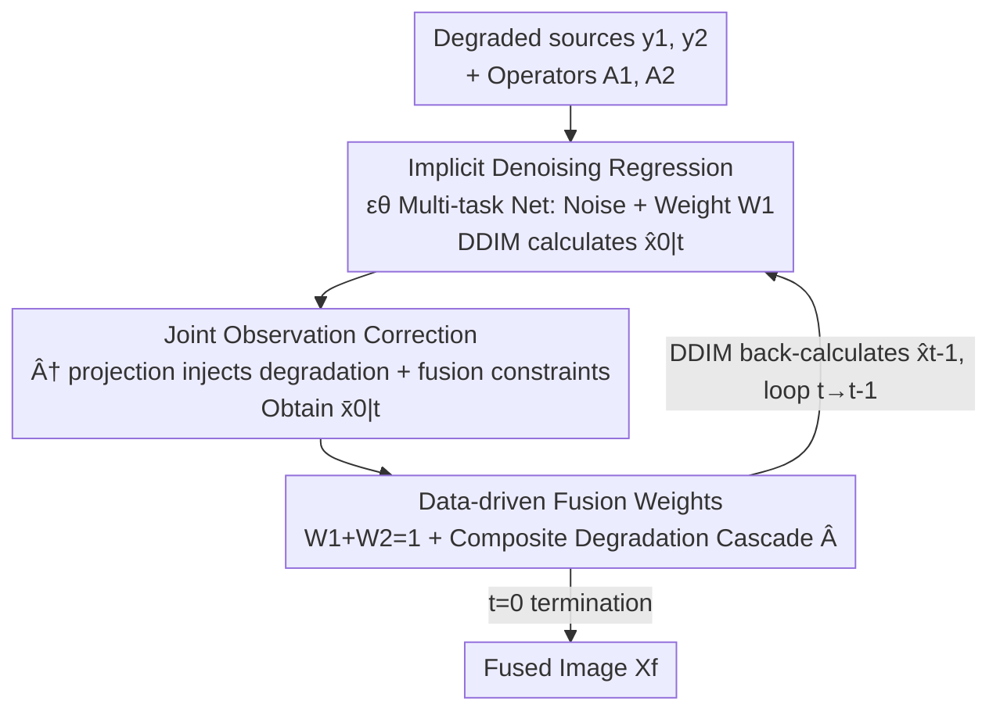

# Degradation-Robust Fusion: An Efficient Degradation-Aware Diffusion Framework for Multimodal Image Fusion in Arbitrary Degradation Scenarios

**Conference**: CVPR 2026  
**Paper**: [CVF Open Access](https://openaccess.thecvf.com/content/CVPR2026/html/Shi_Degradation-Robust_Fusion_An_Efficient_Degradation-Aware_Diffusion_Framework_for_Multimodal_Image_CVPR_2026_paper.html)  
**Code**: https://github.com/YShi-cool/DRFusion  
**Area**: Image Restoration / Diffusion Models / Multimodal Image Fusion  
**Keywords**: Degradation-aware diffusion, image fusion, joint observation constraint, implicit denoising, infrared-visible fusion

## TL;DR
Aiming at multimodal image fusion where source images are commonly degraded by noise, blur, or low resolution in real-world scenarios, this paper transforms the diffusion model from "explicit noise prediction" to "direct regression of the fused image." It incorporates a "Joint Observation Correction" step within DDIM sampling, which integrates dual degradation constraints and fusion constraints into a single matrix. This allows simultaneous restoration and fusion within a few sampling steps, significantly outperforming "restoration-then-fusion" cascaded schemes across various degradation scenarios on M3FD and Harvard datasets.

## Background & Motivation
**Background**: Current mainstream multimodal image fusion (Infrared + Visible, PET + MRI, etc.) follows two categories. One is end-to-end neural networks that directly learn a mapping from multi-source inputs to a fused image, offering simple design and fast inference. The other is diffusion models, which provide better interpretability and higher fusion precision through strong generative priors and iterative refinement.

**Limitations of Prior Work**: Most fusion methods assume high-quality source images, whereas noise, motion blur, and insufficient resolution are ubiquitous in real-world imaging. Traditional "restoration + fusion" two-stage paradigms make fusion results highly dependent on restoration quality, while decoupled designs lead to cross-stage error accumulation and deployment complexity. Although end-to-end networks can jointly optimize restoration and fusion via loss functions, they remain black boxes with poor interpretability and precision sensitive to loss design.

**Key Challenge**: Diffusion models are inherently suitable for fusion (stable, transparent iterative aggregation), but two obstacles hinder their application in degraded fusion: first, training requires fitting a target distribution, yet **image fusion lacks natural "ground truth" data**; second, standard diffusion models single-domain distributions, while fusion requires explicit modeling of complementary information from multiple sources, necessitating a new form linking cross-modal information, fusion goals, and probabilistic models. Existing diffusion fusion methods either handle specific degradations or rely on independently pre-trained restoration models, lacking a unified framework for arbitrary composite degradations.

**Goal**: Model "degradation restoration" and "multimodal fusion" simultaneously in a unified process efficiently within few diffusion steps, without relying on external restoration models or fusion ground truth.

**Key Insight**: The authors observe that the truly indispensable part of diffusion models is the **step-wise refinement of the reverse process**, while "explicit noise prediction" is merely a training constraint to fit the target distribution. Removing noise prediction and letting the network directly regress the fused image transforms diffusion into something that "looks like an end-to-end network but retains an iterative structure"—it allows self-supervised processing like end-to-end models without ground truth while retaining the interface to inject constraints during iterative sampling.

**Core Idea**: **Discard explicit noise prediction and directly regress the fused image (implicit denoising), then use a "Joint Observation Model" in each DDIM sampling step to project the dual source degradation and fusion constraints simultaneously**, achieving integrated degradation-aware restoration and fusion.

## Method

### Overall Architecture
The entire method is an **accelerated diffusion sampling loop with constraint injection**: inputs are two degraded source images $y_1, y_2$ and their degradation operators $A_1, A_2$; the output is a clean fused image $X_f$. It no longer trains a noise prediction network to approximate a target distribution like standard diffusion. Instead, it retains only the reverse process $F_\theta = f_\theta^T \to f_\theta^{T-1} \to \cdots \to f_\theta^0$, mapping the input directly to the fusion output within limited diffusion steps.

Each diffusion step $f_\theta^t$ performs three tasks: (1) Network $\varepsilon_\theta$ provides the current estimation, and the DDIM formula calculates the prediction for the clean image $\hat{x}_{0|t}$; (2) **Joint Observation Correction**: Projects $\hat{x}_{0|t}$ onto the solution set that "simultaneously satisfies dual degradation and fusion constraints" to obtain corrected $\bar{x}_{0|t}$; (3) DDIM back-calculates $\hat{x}_{t-1}$ for the next step. Thus, degradation constraints are enforced at every step, avoiding error accumulation from "restoration before fusion."

### Key Designs

**1. Implicit Denoising: Discarding Noise Prediction for Direct Fusion Regression**

This step addresses the fundamental obstacles that "diffusion lacks fusion labels and is single-domain." Standard diffusion pre-trains a network to estimate noise injected at step $t$, where forward diffusion satisfies $p(x_t|x_0) = \mathcal{N}(x_t; \sqrt{\bar{\alpha}_t}\,x_0, (1-\bar{\alpha}_t)I)$, with $\bar{\alpha}_t = \prod_{i=1}^{t}\alpha_i$ and $\alpha_t = 1-\beta_t$. Accurate noise estimation requires massive iterations and large $T$, plus a clean target distribution during training—exactly what fusion lacks.

Ours **retains the reverse process but abandons explicit noise prediction**: each step still uses the DDIM form:

$$\hat{x}_{0|t} = \hat{x}_t - \sqrt{1-\bar{\alpha}_t}\,\varepsilon_\theta(\hat{x}_t, t), \qquad \hat{x}_{t-1} = \sqrt{\bar{\alpha}_{t-1}}\,\hat{x}_{0|t} + \sqrt{1-\bar{\alpha}_{t-1}}\,\varepsilon_\theta(\hat{x}_t, t)$$

However, the network is no longer required to "calculate noise accurately" but instead regresses toward reconstructed source/fused images, with noise implicit in intermediate representations. This offers three benefits: the direct mapping enables **self-supervised** fusion like end-to-end networks, bypassing missing labels; multi-source fusion is jointly optimized by imposing reconstruction constraints; and without explicit noise prediction, it works with accelerated samplers like DDIM to yield high-quality results in **very few diffusion steps**, significantly boosting inference efficiency.

**2. Joint Observation Correction: Integrating Dual Degradation and Fusion Constraints**

Iterative sampling alone is insufficient—while DDIM trajectories are nearly deterministic, the underlying model learns a distribution rather than a fixed mapping, and intermediate results might not satisfy true degradation observations. Ours inserts a projection correction. Consider the classical degradation model $y = AX + n$ (ignoring noise $n$). Given the previous estimate $\hat{x}_{0|t}$ may not satisfy $y = AX$, we seek the closest solution satisfying the constraint:

$$x^\star = \arg\min_z \|z - x_{0|t}\|^2 \quad \text{s.t.}\quad Az = y$$

Geometrically, this projects $x_{0|t}$ onto the constraint subspace, resulting in $x^\star = x_{0|t} - A^\dagger(Ax_{0|t} - y)$, where $A^\dagger$ is the Moore–Penrose pseudoinverse and $A^\dagger(Ax-y)$ is the correction term. While straightforward for single-image restoration, fusion involves two sources and the fused image itself lacks a corresponding degradation observation.

Ours innovates by constructing a **Joint Observation Model**: source images and the fused image are treated as joint variables $[X_1, X_2, X_f]$, coexisting with dual degradation constraints $y_1 = A_1 X_1$, $y_2 = A_2 X_2$, and the fusion constraint $X_f = W_1 * X_1 + W_2 * X_2$. By moving $X_f$ in the fusion constraint to the left side, its original position is replaced by a zero matrix—**implying that prior observation of the fused image is unnecessary**:

$$\begin{bmatrix} y_1 \\ y_2 \\ 0 \end{bmatrix} = \begin{bmatrix} A_1 & 0 & 0 \\ 0 & A_2 & 0 \\ -W_1 & -W_2 & I \end{bmatrix} \begin{bmatrix} X_1 \\ X_2 \\ X_f \end{bmatrix}$$

Since the pseudoinverse of this block matrix $\hat{A}$ is computationally expensive, the authors use a clever trick: solving $X_1, X_2$ separately and substituting them into the fusion relation to **analytically assemble** the joint pseudoinverse satisfying Moore–Penrose conditions:

$$\hat{A}^\dagger = \begin{bmatrix} A_1^\dagger & 0 & 0 \\ 0 & A_2^\dagger & 0 \\ W_1 A_1^\dagger & W_2 A_2^\dagger & I \end{bmatrix}$$

Substituting this back into the projection formula and embedding it in DDIM yields the final three-stage iteration: DDIM estimates $\hat{x}_{0|t}$ (Eq. 16), joint observation correction $\bar{x}_{0|t} = \hat{x}_{0|t} - \hat{A}^\dagger(\hat{A}\hat{x}_{0|t} - y)$ (Eq. 17), and DDIM back-calculation of $\hat{x}_{t-1}$ (Eq. 18). Consequently, **restoration and fusion are constrained simultaneously**, bypassing error accumulation and requiring no fusion ground truth or external restoration models.

**3. Data-driven Fusion Weights + Composite Degradation Scalability**

To avoid fixed weights limiting performance, the fusion weights $W_1, W_2$ in the joint model are **data-driven**: the noise predictor uses a multi-task architecture that outputs an (implicit) noise estimate and an additional weight map $W_1$, then $W_2 = 1 - W_1$ ensures complementary weighting.

For complex real-world degradations, the framework scales elegantly. With noise, the correction term is multiplied by a scaling matrix $\Sigma_t$ to suppress noise: $\bar{x}_{0|t} = \hat{x}_{0|t} - \Sigma_t \hat{A}^\dagger(\hat{A}\hat{x}_{0|t} - y)$ (Eq. 19). For composite degradations (e.g., noise + blur + low res) where $A = A_1 A_2 \cdots A_n$, the pseudoinverse is expressed as a **cascade** $A^\dagger = A_n^\dagger A_{n-1}^\dagger \cdots A_1^\dagger$ and substituted directly. This ensures composite degradations do not require per-combination redesign.

### Loss & Training
Since the framework regresses reconstruction images rather than explicit noise, unsupervised losses common in fusion can be applied. Total loss $L_{total} = L_{rec} + \lambda L_f$. The reconstruction loss ensures restoration quality: $L_{rec} = \|X_1 - \bar{X}_1\|_1 + \|X_2 - \bar{X}_2\|_1$. The fusion loss is task-specific: For infrared-visible, $L_f = \|X_f - \max(\bar{X}_1, \bar{X}_2)\|_1 + \gamma\|\nabla X_f - \max(\nabla \bar{X}_1, \nabla \bar{X}_2)\|_1$; for medical fusion, $L_f = \sum_{i=1}^{2}\|X_f - \bar{X}_i\|_1 + \phi(1 - \text{SSIM}(X_f, \bar{X}_i))$. Training uses Adam, batch 8, 100 epochs, initial learning rate 0.0001 with multi-step decay, $\lambda{=}10, \gamma{=}20, \phi{=}10$, on dual RTX 4090s. This flexibility is a direct benefit of abandoning single noise prediction targets.

## Key Experimental Results

Datasets: M3FD (Infrared-Visible) and Harvard (PET-MRI). Three degradation scenarios: Noise, Blur, and Composite (IR/PET with noise+blur+low-res; Visible/MRI with noise+blur). Comparison methods include CNNs (IFCNN, U2Fusion, MURF) and Diffusion models (DDFM, Text-DiFuse, VDMUFusion, RFfusion, Mask-DiFuser), all using a "restore-then-fuse" strategy. Six objective metrics: $Q_{MI}, Q_{NCIE}, Q_{AB/F}, Q_P, Q_{CB}, Q_W$ (higher is better).

### Main Results (M3FD Infrared-Visible, select metrics)

| Degradation | Method | $Q_{MI}$ | $Q_{AB/F}$ | $Q_P$ | $Q_W$ |
|-------------|--------|----------|------------|-------|-------|
| Noise | Mask-DiFuser | 0.2343 | 0.3343 | 0.2161 | 0.7271 |
| Noise | RFfusion | 0.3021 | 0.2831 | 0.1217 | 0.6959 |
| Noise | **Ours** | **0.3505** | **0.4083** | 0.1825 | **0.7810** |
| Blur | Mask-DiFuser | 0.2572 | 0.2114 | 0.0860 | 0.5403 |
| Blur | RFfusion | 0.3771 | 0.0972 | 0.0564 | 0.3884 |
| Blur | **Ours** | **0.4477** | **0.3698** | **0.1671** | **0.7233** |
| Composite | Mask-DiFuser | 0.2492 | 0.1986 | 0.0611 | 0.5845 |
| Composite | **Ours** | **0.3732** | **0.2199** | **0.0755** | **0.6237** |

In the most challenging blur and composite scenarios, Ours leads significantly in $Q_{MI}/Q_{AB/F}/Q_P/Q_W$. Particularly in blur scenarios, $Q_{AB/F}$ jumps from the next best ~0.21 to 0.37.

### Main Results (Harvard PET-MRI, select metrics)

| Degradation | Method | $Q_{MI}$ | $Q_{AB/F}$ | $Q_P$ | $Q_W$ |
|-------------|--------|----------|------------|-------|-------|
| Noise | DDFM | 0.6025 | 0.3840 | 0.1908 | 0.7532 |
| Noise | **Ours** | **0.6171** | **0.4258** | **0.2436** | **0.7892** |
| Blur | Mask-DiFuser | 0.5998 | 0.2914 | 0.1621 | 0.6591 |
| Blur | **Ours** | 0.6469 | **0.3855** | **0.2016** | **0.7885** |
| Composite | DDFM | 0.6353 | 0.1971 | 0.0715 | 0.6032 |
| Composite | **Ours** | 0.6019 | **0.2956** | **0.1258** | **0.7344** |

In medical fusion, Ours achieves the highest scores in $Q_{AB/F}/Q_P/Q_W$ across all scenarios, showing robustness in preserving structure and details under composite degradation.

### Ablation Study
The authors compared configurations "with/without joint observation constraints" (results provided in Fig.6 visual charts):

| Configuration | Effect | Description |
|---------------|--------|-------------|
| Full Model (with Joint Constraint) | Best overall metrics | Degradation constraints enforced per step; unified restoration-fusion. |
| w/o Joint Constraint | Significant drop | Degradation not corrected; fused images retain blur/artifacts. |

Removing the joint constraint leads to a general decline in all metrics, particularly in reconstruction accuracy and detail retention, confirming it as the key component for injecting "degradation awareness" into sampling.

### Key Findings
- **Joint Observation Correction drives performance**: Ablations show a drop without it, especially under difficult (composite) degradations. Performance stems from the constraint mechanism, not just a stronger network.
- **Efficiency between two archetypes**: Ours is significantly faster than traditional diffusion (DDFM/Text-DiFuse) due to few-step sampling and implicit denoising. While still slower than pure CNNs, it offers a competitive quality-speed trade-off with reasonable parameters.
- **Superiority in Composite Degradation**: When sources suffer from combined noise, blur, and low-res, the cascaded pseudoinverse $A^\dagger$ performs global restoration whereas "restore-then-fuse" methods suffer from severe error accumulation and artifacts.

## Highlights & Insights
- **Recognizing noise prediction as a discardable constraint**: By identifying that the iterative reverse process is the core value of diffusion, the authors switched to direct fusion map regression, granting diffusion both "end-to-end self-supervision" and "iterative constraint injection."
- **Zero Matrix Trick for Ground-Truth-Free Fusion**: Moving $X_f$ to the left side and filling its original position with a zero matrix allows the joint model to function without pre-existing fusion observations.
- **Analytical Block Matrix Pseudoinverse**: Instead of brute-forcing $\hat{A}^\dagger$, the authors solve sub-problems and assemble a closed-form solution satisfying Moore–Penrose conditions—a trick transferable to other inverse problems with block-structured operators.
- **Cascaded Pseudoinverse for Composite Scenarios**: Real-world composite degradation is handled simply by multiplying pseudoinverses in order, avoiding the need for retraining for every degradation combination.

## Limitations & Future Work
- The method remains slower than pure CNN fusion, although much faster than traditional diffusion; it may not suffice for extremely high real-time requirements.
- Ablations only compared "with/without joint constraints" via bar charts; specific numerical tables and sub-component ablations (e.g., implicit vs. explicit, fixed vs. dynamic weights) were not detailed.
- Degradation operators $A$ must be known or modelable (linear operators). How well it handles **unknown or non-linear degradations** (real camera ISPs, compression artifacts) requires further discussion.
- The joint model assumes linear combination $X_f = W_1 X_1 + W_2 X_2$, which may limit tasks requiring non-linear fusion (e.g., certain cross-modal semantic fusions).

## Related Work & Insights
- **vs DDFM / RFfusion / Mask-DiFuser (Diffusion Fusion)**: These are limited by standard diffusion frameworks (dependence on target distributions or pseudo-labels). Ours unifies restoration and fusion into a single sampling process via direct regression and joint correction, showing clear advantages in composite scenarios.
- **vs DDNM (Restoration Diffusion)**: DDNM uses pseudoinverse consistency for single-image restoration. Ours extends this to **multi-source + fusion constraints** using a joint block matrix and an analytical joint pseudoinverse—a fundamental generalization for fusion.
- **vs End-to-End CNNs (IFCNN/U2Fusion/MURF)**: CNNs are fast but black-box and sensitive to loss design; Ours retains iterative interpretability and constraint injection while regaining self-supervision, yielding higher quality in degraded scenarios.

## Rating
- Novelty: ⭐⭐⭐⭐⭐ "Implicit denoising" and "Zero-matrix joint model" effectively reconstruct the diffusion fusion paradigm.
- Experimental Thoroughness: ⭐⭐⭐⭐ Extensive datasets, degradations, and metrics, but ablation details are relatively sparse.
- Writing Quality: ⭐⭐⭐⭐ Clear derivations and logic, despite minor formatting issues.
- Value: ⭐⭐⭐⭐ High practical value for real-world degraded multimodal fusion.

<!-- RELATED:START -->

## Related Papers

- [\[CVPR 2026\] DRFusion: Degradation-Robust Fusion via Degradation-Aware Diffusion Framework](drfusion_degradation_robust_fusion_via_degradation_aware_diffusion_framework.md)
- [\[CVPR 2026\] MMDIR: Multimodal Instruction-Driven Framework for Mixed-Degradation Document Image Restoration](mmdir_multimodal_instruction-driven_framework_for_mixed-degradation_document_ima.md)
- [\[CVPR 2026\] Customized Fusion: A Closed-Loop Dynamic Network for Adaptive Multi-Task-Aware Infrared-Visible Image Fusion](customized_fusion_a_closed-loop_dynamic_network_for_adaptive_multi-task-aware_in.md)
- [\[CVPR 2026\] EMR-Diff: Edge-aware Multimodal Residual Diffusion Model for Hyperspectral Image Super-resolution](emr-diff_edge-aware_multimodal_residual_diffusion_model_for_hyperspectral_image_.md)
- [\[CVPR 2026\] Bridging Human Evaluation to Infrared and Visible Image Fusion](bridging_human_evaluation_to_infrared_and_visible_image_fusion.md)

<!-- RELATED:END -->
