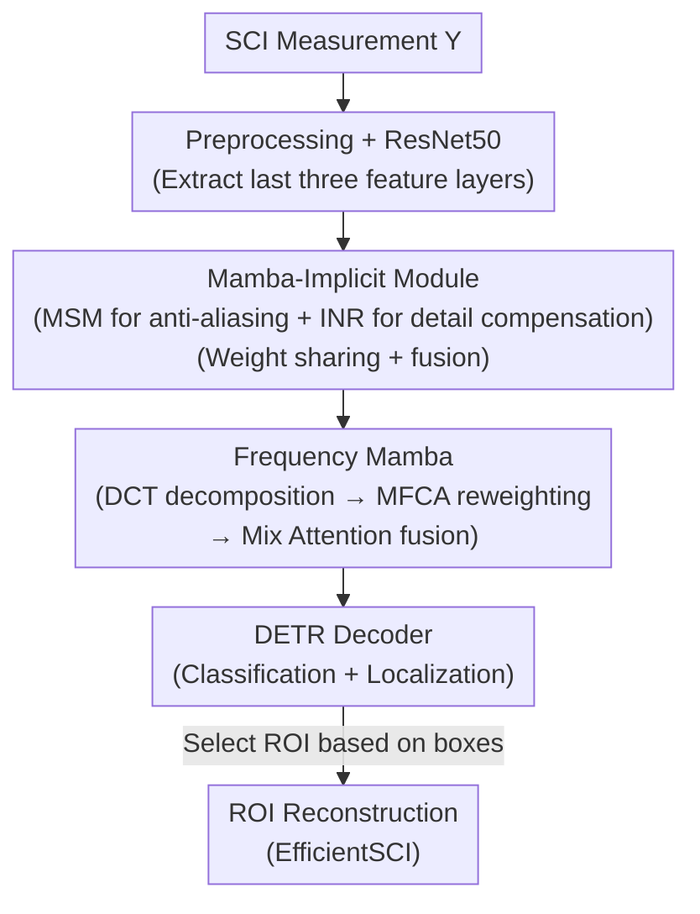

# DetectSCI: Toward Object-Guided ROI Reconstruction for High-Resolution Video Snapshot Compressive Imaging

**Conference**: CVPR 2026  
**Paper**: [CVF Open Access](https://openaccess.thecvf.com/content/CVPR2026/html/Jiang_DetectSCI_Toward_Object-Guided_ROI_Reconstruction_for_High-Resolution_Video_Snapshot_Compressive_CVPR_2026_paper.html)  
**Code**: Not yet open-sourced (Paper states: Code will be released)  
**Area**: Image Restoration / Video Snapshot Compressive Imaging  
**Keywords**: Snapshot Compressive Imaging, ROI Reconstruction, Object Detection, Mamba, Frequency Domain Attention

## TL;DR
Addressing the pain points of high-resolution video Snapshot Compressive Imaging (SCI), where "full-frame reconstruction consumes excessive memory while backgrounds dominate but lack information," DetectSCI proposes a workflow that performs **object detection directly on encoded measurements** and reconstructs only the Regions of Interest (ROI) based on detected boxes. Its detector utilizes weight-sharing Mamba-Implicit modules to counter spatio-temporal aliasing and Frequency Mamba to recover suppressed high-frequency details, achieving 80.9 AP on a modified SportsMOT SCI dataset, outperforming the best CNN detector by $\ge 2.8$ AP and the best Transformer detector by $\ge 4.1$ AP.

## Background & Motivation
**Background**: Video Snapshot Compressive Imaging (SCI) serves as a low-cost alternative to high-speed cameras. The CACTI system uses a set of random masks to perform optical modulation on $B$ consecutive frames, which are then integrated by a low-speed 2D camera into a **single** 2D measurement. To retrieve the high-speed video, a reconstruction algorithm must decode this measurement back into $B$ frames.

**Limitations of Prior Work**: As frame resolution increases, reconstructing the entire video becomes extremely expensive in terms of computation and VRAM. The authors note in Figure 1 that full-frame reconstruction can lead to OOM (Out Of Memory). Furthermore, significant computation is wasted on recovering **low-information backgrounds**: in sports scenarios, athletes are the primary subjects yet occupy only a small pixel area, while the remaining stands and fields represent redundant effort.

**Key Challenge**: Traditional reconstruction is "pixel-wise indiscriminate restoration," whereas the "information density" of a scene is highly non-uniform—computational budgets are distributed where they are least needed. A natural idea is to "reconstruct only important regions," but this requires knowing where those regions are, necessitating object detection directly on SCI measurements.

**Goal**: (1) Enable the detector to directly process SCI measurements and accurately locate targets; (2) Implement user-selectable ROI reconstruction based on detection boxes to focus computational power solely on the subjects.

**Key Insight**: The difficulty lies in the fact that "direct detection on measurements" is nearly infeasible. Conventional CNNs assume local stationarity of adjacent pixels, but mask modulation fuses pixels from **different time steps at the same spatial location** into a single measurement pixel. As objects move, a pixel belonging to a target in one frame may belong to the background in the next; these semantically distinct pixels are forced together by encoded exposure, leading to severe **spatio-temporal aliasing** and significantly reducing target-background contrast. The authors further point out that this degradation is **frequency-biased**: low-frequency components in static regions are mutually reinforced, while high-frequency details of moving targets are partially canceled due to temporal misalignment—encoded exposure acts as a **temporal low-pass filter** that suppresses high-frequency structures crucial for localization, such as contours and boundaries.

**Core Idea**: Instead of detecting after reconstruction, **perform detection on measurements first and then reconstruct ROIs on demand**. To make detection robust on aliased measurements, a Mamba-Implicit encoder is used to counter spatial degradation, and Frequency Mamba is employed to recover the high-frequency components lost to low-pass filtering.

## Method

### Overall Architecture
The DetectSCI detector is an end-to-end encoder–decoder (DETR-style). The input is a single SCI measurement $Y$, and the output is target boxes, followed by ROI reconstruction of selected boxes using an off-the-shelf reconstructor (EfficientSCI is used in the paper). The intermediate pipeline is: **preprocessing normalization $\rightarrow$ ResNet-50 multi-scale feature extraction $\rightarrow$ sequential feature refinement via an encoder composed of weight-sharing Mamba-Implicit Modules (MIM) + fusion blocks $\rightarrow$ frequency-aware query selection via Frequency Mamba (FM) $\rightarrow$ DETR decoder for classification and localization**. The two primary innovations are MIM (countering spatial feature degradation from spatio-temporal aliasing) and FM (countering high-frequency loss from frequency bias).

The imaging model of CACTI sets the foundation. The original grayscale video $\{X_t\}_{t=1}^B$ is modulated by masks $\{M_t\}_{t=1}^B$ and integrated into a measurement:

$$Y = \sum_{t=1}^{B} X_t \odot M_t + G$$

where $\odot$ denotes element-wise multiplication and $G$ is noise. Vectorized as $y=\mathrm{vec}(Y)$, each mask is written as a diagonal matrix $D_t=\mathrm{Diag}(\mathrm{vec}(M_t))$, forming the sensing matrix $H=[D_1,\dots,D_B]$, so $y = Hx + g$. This summation of "multiple frames into one image" is the root of spatio-temporal aliasing. Preprocessing performs mask normalization to obtain an enhanced image $\overline{Y} = Y \oslash \sum_{t=1}^{B} M_t$ (where $\oslash$ is element-wise division), mitigating intensity non-uniformity before feeding it into ResNet-50.

### Key Designs

**1. Mamba-Implicit Module (MIM): Countering Spatio-temporal Aliasing with Multi-Scale Mamba and Implicit Representation**

MIM is the core unit of the encoder, specifically addressing the pain point where aliased measurement pixels lead to spatial feature degradation and blurred target boundaries. It consists of two serial components. The first is **Multi-Scale Spatial Mamba (MSM)**: for each backbone feature $\hat{S}_i$, a PWConv-GeLU-PWConv (PGP) sequence is applied, followed by three parallel Depth-Wise Separable Dilated Convolutions ($\mathrm{DWD}_7/\mathrm{DWD}_{13}/\mathrm{DWD}_{19}$) which are concatenated as $Z_2 = \mathrm{Concat}[\mathrm{DWD}_7(Z_1),\mathrm{DWD}_{13}(Z_1),\mathrm{DWD}_{19}(Z_1)]$ and processed by another PGP. The motivation is that single-scale features cannot smooth out intra-layer degradation in SCI; progressively increasing receptive fields allows the network to perceive targets of different sizes at the same feature stage. Subsequently, **2D Selective Scan (SS2D)** performs bidirectional state scanning along four spatial directions to achieve global context propagation with linear complexity. Finally, a depth-wise FFN (dual DW convolutions + channel attention gating) reweights the channels: $Z_i = S_i + (Z_6 \odot Z_7)$, where $Z_7=\sigma(\mathrm{PWConv}(Z_6))$.

The second is the **Implicit Neural Representation (INR) block**: features after MSM are still discrete grids, struggling to express sub-pixel details lost to aliasing. INR treats features as a continuous "coordinate $\rightarrow$ value" field. It first performs a latent projection $Z_8 = \mathrm{SiLU}(\mathrm{BN}(\mathrm{PWConv}(Z_i)))$. For each 2D coordinate $(x,y)\in[-1,1]^2$, Fourier basis functions encode multi-frequency positional cues $\Phi(x,y) = [\sin(\omega_1 x),\dots,\cos(\omega_m y)]$, where frequencies $\omega_j = T^{-\frac{j-1}{m-1}}$ are controlled by temperature $T$ (implemented with $m=64, T=10000$). $\Phi$ is concatenated with flattened $Z_8$ to form $\hat{E}_i$, and a lightweight MLP learns the continuous mapping $f=\mathrm{MLP}(\hat{E}_i)$, reshaped back to $E_i$. This representation fills the feature gap between "compressed measurements" and the "underlying continuous scene." MIM uses **weight sharing** across layers for an accuracy/efficiency trade-off, and multiple $E_i$ are eventually merged into $E$ via a fusion block.

**2. Frequency Mamba (FM): Recovering High-Frequency Details via Frequency Domain Decomposition**

FM targets the frequency bias of SCI. It performs frequency "rectification" on encoded features before query selection in three steps. First, **Multi-Frequency Channel Attention (MFCA)** uses Discrete Cosine Transform (DCT) to project features into three frequency bands $\{F_1,F_2,F_3\}=\mathrm{DCT}(E)$ (low/mid/high). A **Tri-Pooling Unit (TPU)** then sums and aggregates the global average, maximum, and minimum pooling results of these bands: $F = F_\mathrm{avg}+F_\mathrm{max}+F_\mathrm{min}$, where each term sums across bands to aggregate complementary info. The result passes through PWConv+Sigmoid to generate channel reweighting coefficients: $O_1 = \sigma(\mathrm{PWConv}(F)) \otimes E$. This adaptive spectral filtering prioritizes suppressed high-frequency components while maintaining low-frequency structural stability.

Since MFCA operates independently within channels, the second step uses **SS2D** for global channel modeling $O_2=\mathrm{SS2D}(\mathrm{BN}(O_1))$, where a learnable transition matrix mixes activations along the channel dimension. The third step, **Mix Attention**, uses dual branches: a Spatial Attention (SA) branch generates position-dependent features $O_\mathrm{SA}$, and a Frequency-Gated Attention (FGA) branch suppresses noise while extracting frequency enhancement cues. Both branches are concatenated and fused. Scatter plots (Figure 3) verify that FM-trained features are **92.7%** denser in high-quality regions (IoU and classification scores $>0.5$) compared to models without FM.

### Loss & Training
The detection head follows DETR-style set prediction with 300 initial object queries. Detectors are trained on 4 RTX 4090 GPUs with per-epoch validation and early stopping (patience=20). Transformer models (including Ours) use AdamW, base lr=1e-4, backbone lr=1e-5, weight decay=5e-5, input resolution (720, 1280), and shared ImageNet-pretrained ResNet-50. CNN models (YOLO) take (720, 720). INR uses $m=64, T=10000$.

## Key Experimental Results

The dataset is a custom SCI detection set based on SportsMOT (240 videos, 720p, avg. 485 frames), simulated with a CACTI system at a compression ratio of 8. Bounding boxes for the same person ID over 8 frames are merged into an envelope box. Non-person instances or those with visibility $<0.25$ are filtered. The set is split 7:1.5:1.5 in COCO format.

### Main Results
All Transformer detectors use ResNet-50 backbone and identical training settings for a fair comparison:

| Category | Model | AP | AP50 | AP75 | GFLOPs | Params(M) |
|------|------|----|------|------|--------|-----------|
| CNN | YOLOv10-X (Best Trade-off) | 78.1 | 94.3 | 87.5 | 196.4 | 51.7 |
| CNN | YOLOv8-X | 77.9 | 94.9 | 87.3 | 296.4 | 68.2 |
| Transformer | DINO | 72.6 | 95.9 | 83.2 | 313.2 | 46.7 |
| Transformer | RT-DETR (Baseline) | 76.8 | 95.0 | 86.9 | 266.3 | 50.3 |
| Transformer | MS-DETR (Strongest Competitor) | 75.8 | 92.6 | 87.3 | 321.8 | 53.7 |
| **Ours** | **DetectSCI** | **80.9** | **98.5** | **93.1** | 268.1 | 53.1 |

DetectSCI leads with 80.9 AP, surpassing YOLOv10-X by $\sim 2.8$, MS-DETR by $+5.1$, and the RT-DETR baseline by $+4.1$. The advantage is more pronounced at stricter localization thresholds (AP75 reaches 93.1, $\sim 6.4\%$ higher than YOLOv10-X). Efficiency-wise, it uses 268.1 GFLOPs and 53.1M parameters, which is $10\%$ lighter than YOLOv12-X and $22\%$ fewer parameters than YOLOv8-X.

### Ablation Study
MIM components (Baseline: RT-DETR 76.8 AP):

| Variant | Setting | AP | GFLOPs | Params(M) | Description |
|------|------|----|--------|-----------|------|
| A1 | INR Only | 79.5 | 192.0 | 51.2 | INR alone gains $+2.7$ |
| A2 | MSM Only | 79.6 | 263.9 | 60.4 | MSM alone gains $+2.8$; main source of complexity |
| A3 | Single-scale MIM | 79.9 | 257.8 | 52.6 | INR + Single-scale MSM are complementary |
| A4 | Independent Multi-scale MIM | **82.5** | 268.1 | 61.2 | Highest accuracy but largest parameter count |
| A5 | Weight-sharing MIM (**Ours**) | 80.9 | 268.1 | 53.1 | 80.9 vs 82.5 but saves 8.1M parameters |

FM Frequency Bands (B1 is without FM):

| Variant | Setting | AP | Description |
|------|------|----|------|
| B1 | No FM | 78.4 | Baseline |
| B2 | Low Freq Only | 78.8 | $+0.4$, smallest contribution |
| B3 | Mid Freq Only | 79.6 | $+1.2$ |
| B4 | High Freq Only | 80.1 | $+1.7$, best single band |
| B5 | FM (TPU Fusion) | **80.9** | $+0.8$ over High Freq; bands are complementary |

### Key Findings
- **MSM and INR are independently effective and complementary**: A1/A2 show $\sim 3$ AP gains each. MSM accounts for most computational overhead, justifying the weight-sharing design.
- **Weight sharing is an engineering trade-off**: While independent multi-scale (A4) hits 82.5 AP, weight sharing (A5) only drops 1.6 AP while saving 8.1M parameters.
- **Frequency evidence supports the "low-pass high-frequency" judgment in SCI**: The high-frequency band (B4 $+1.7$) is far more useful than the low-frequency band (B2 $+0.4$), aligning with the analysis that encoded exposure suppresses high frequencies.
- **Detection quality translates into localization gain**: The lead in AP75 (93.1) is more prominent than in AP50, indicating that FM-selected queries primarily improve **precise localization**.

## Highlights & Insights
- **"Detection before Reconstruction" is a paradigm shift**: It transforms SCI from "indiscriminate full-frame reconstruction" to "task-driven ROI reconstruction," letting computational power follow information density. This detection $\rightarrow$ reconstruction decoupling is transferable to any task where reconstruction is expensive but interest is local.
- **Addressing two specific degradations**: Spatial aliasing is handled by MIM (multi-scale receptive fields + INR continuous fields), and frequency bias is handled by FM (DCT decomposition + adaptive reweighting), rather than using a generic large network.
- **Clever use of INR for "Feature De-gridding"**: Treating discrete features as continuous fields to resample sub-pixel details lost to aliasing is a reusable trick for feature enhancement.

## Limitations & Future Work
- **ROI Reconstructor is external, not end-to-end**: Detection and reconstruction are decoupled. Jointly optimizing detection and reconstruction end-to-end is left for future work; detection errors directly propagate to the reconstruction.
- **Single dataset and category**: Validated only on a custom SportsMOT-SCI dataset (CR=8, person class, 720p). Generalization to real hardware captures or other scenes/categories is unknown. 
- **Efficiency gains are theoretical on the reconstruction side**: The detector itself does not have significantly lower GFLOPs than competitors; the actual savings in VRAM/computation come from "reconstructing only ROIs," which is shown qualitatively but lacks end-to-end quantitative comparison.

## Related Work & Insights
- **vs. YOLO Series (YOLOv8–v12)**: YOLO models are pure convolutional first-stage detectors relying on high-quality spatial features. They suffer in SCI where pixel contrast is weakened. Ours uses Mamba’s global scanning and INR to outperform them significantly in AP75 (93.1 vs YOLOv10-X's 87.5).
- **vs. DETR Series (RT-DETR/MS-DETR/DINO)**: While sharing the DETR style, these models process backbone features directly without addressing SCI-specific aliasing. Ours inserts MIM and FM modules, gaining $+4.1$ to $+5.1$ AP under identical settings.

## Rating
- Novelty: ⭐⭐⭐⭐⭐ The first framework to perform detection on SCI measurements followed by ROI reconstruction; the paradigm shift is imaginative.
- Experimental Thoroughness: ⭐⭐⭐⭐ Extensive comparison with CNN/Transformer baselines. However, it lacks end-to-end quantitative timing/VRAM comparisons for ROI versus full-frame reconstruction.
- Writing Quality: ⭐⭐⭐⭐ Clear motivation and frequency analysis.
- Value: ⭐⭐⭐⭐ Coupling perception with reconstruction for resource-constrained intelligent imaging has practical significance for high-resolution SCI deployment.

<!-- RELATED:START -->

## Related Papers

- [\[ICML 2026\] Phy-CoSF: Physics-Guided Continuous Spectral Fields Reconstruction and Super-Resolution for Snapshot Compressive Imaging](../../ICML2026/image_restoration/phy-cosf_physics-guided_continuous_spectral_fields_reconstruction_and_super-reso.md)
- [\[CVPR 2026\] Statistical Characteristic-Guided Denoising for Rapid High-Resolution Transmission Electron Microscopy Imaging](statistical_characteristic-guided_denoising_for_rapid_high-resolution_transmissi.md)
- [\[CVPR 2026\] Multi-Scale Gradient-Guided Unrolling Architecture with Adaptive Mamba for Compressive Sensing](multi-scale_gradient-guided_unrolling_architecture_with_adaptive_mamba_for_compr.md)
- [\[CVPR 2026\] AE2VID: Event-based Video Reconstruction via Aperture Modulation](ae2vid_event-based_video_reconstruction_via_aperture_modulation.md)
- [\[CVPR 2026\] STCDiT: Spatio-Temporally Consistent Diffusion Transformer for High-Quality Video Super-Resolution](stcdit_spatio-temporally_consistent_diffusion_transformer_for_high-quality_video.md)

<!-- RELATED:END -->
