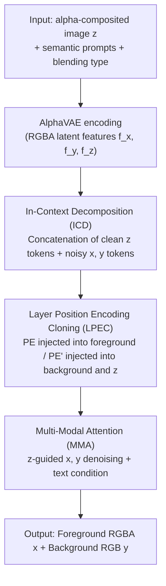

# DiffDecompose: Layer-Wise Decomposition of Alpha-Composited Images via Diffusion Transformers

**Conference**: CVPR 2026  
**Paper**: [CVF Open Access](https://openaccess.thecvf.com/content/CVPR2026/html/Wang_DiffDecompose_Layer-Wise_Decomposition_of_Alpha-Composited_Images_via_Diffusion_Transformers_CVPR_2026_paper.html)  
**Code**: https://github.com/Wangzt1121/DiffDecompose  
**Area**: Image Restoration / Diffusion Models  
**Keywords**: Layer-wise decomposition, alpha compositing, Diffusion Transformer, semi-transparent removal, in-context decomposition

## TL;DR
For semi-transparent/transparent occlusion scenarios such as glass, fog, watermarks, and X-rays, this paper reformulates the problem of "decomposing foreground and background layers from a single composite image" as a generative posterior inference task. Along with releasing the first large-scale AlphaBlend dataset, the authors propose a diffusion Transformer framework called DiffDecompose (anchored by "In-Context Decomposition (ICD)" and "Layer Position Encoding Cloning (LPEC)") to achieve mask-free multi-layer decomposition. This approach achieves an average RMSE approximately 36% lower than the second-best method across multiple layer removal and decomposition subtasks.

## Background & Motivation

**Background**: Layer-wise decomposition is a powerful tool for structured image decomposition—deconstructing an image into multiple layers containing foreground objects, corresponding alpha mattes, and potential depth orderings. This enables precise control of individual layers for downstream tasks like video generation, scene understanding, and image editing. In the era of diffusion models, such controllable generation and editing capabilities have been extensively studied.

**Limitations of Prior Work**: Existing methods suffer from two major flaws in semi-transparent/transparent scenarios. First, **limitations of layer-wise image inpainting**—mask-based methods can only handle "object-level" information. They fail entirely when encountering scenarios requiring "image-level masks" (e.g., rain, fog, lens flares, or watermarks spanning across the entire image), as it is impossible to box out a localized region to repair. Second, **limitations in handling non-linear layers**—most prior works (e.g., object removal) focus on opaque/solid objects, simplifying compositing into "pixel overwriting" while ignoring the **non-linear blending** present in transparent glass or semi-transparent cells. The pixels in occluded regions are not simply replaced but are complex non-linear mixtures of multiple layers; directly deleting "occluding pixels" and repainting using neighborhood information is physically incorrect.

**Key Challenge**: The authors term this new task **LDAC (Layer-Wise Decomposition of Alpha-Composited Images)**. The objective is to directly recover the background layer $y$ and the foreground layer with alpha $x$ from a single composite image $z$, without any prior mask. However, this inverse problem is **inherently ill-posed**: color and transparency are highly entangled across layers, and a single alpha-composited image typically corresponds to multiple decomposition possibilities that all "look reasonable." Two specific challenges are: (1) **layer ambiguity + color/transparency coupling**: the foreground and background occupy the same visual plane, lacking depth or edge contrast for separation; (2) **lack of large-scale datasets**: existing data is mostly synthetically generated by AI, which introduces pixel-level discrepancies between composite images and original foreground/background layers, causing the model to learn inaccurate decompositions from the start.

**Goal / Key Insight**: Since decomposition is naturally multi-solution, instead of "hard regressing" a single unique alpha matte, one should **acknowledge its multi-solution nature**—learning the posterior distribution of all reasonable decompositions given the observed composite image.

**Core Idea**: Summarized in one sentence—**rephrase layer decomposition from "deterministic alpha regression" to "posterior sampling under conditional diffusion"**, and use in-context token concatenation (ICD) to enable the model to predict one or multiple layers at once, combined with layer position encoding cloning (LPEC) to lock the pixel-level correspondence between layers.

## Method

### Overall Architecture

DiffDecompose aims to solve the following: given an alpha-composited RGBA image $z\in\mathbb{R}^{H\times W\times 4}$ as input, output a pair of reasonable decompositions—the foreground RGBA image $x$ with an alpha channel and the RGB background image $y$, such that their reconstructed version under some (possibly unknown) compositing function $\mathcal{G}$ satisfies $\mathcal{G}(x,y)\approx z$. Unlike traditional inpainting (which deletes and fills pixels based on masks), DiffDecompose does not require explicit masks, instead **jointly predicting** the foreground and background as a whole.

Formally, traditional mask-based inpainting models $p_\theta(\mathbf{y}\mid\mathbf{z},\mathbf{m})$ (where $\mathbf{m}$ is the mask to be inpainted), essentially degrading into "predicting pixels within the masked region." This paper trains a conditional diffusion model to learn the **joint posterior** of the foreground and background:

$$p_\theta(\mathbf{x},\mathbf{y}\mid\mathbf{z},\tau)=\int p(\mathbf{x},\mathbf{y}\mid\mathbf{z}_0)\,p_\theta(\mathbf{z}_0\mid\mathbf{z},\tau)\,d\mathbf{z}_0,$$

where $\tau$ represents the uncertain composite blending type. During training, triplets $(\mathbf{x},\mathbf{y},\mathbf{z})$ are assumed to be available, where $\mathbf{z}=\mathcal{G}(\mathbf{x},\mathbf{y})$, and the model learns to sample decomposition pairs that are both semantically plausible and consistent under $\mathcal{G}$.

The entire pipeline is a two-step process: **First**, fine-tune AlphaVAE using the AlphaBlend dataset to enable extracting latent features of RGBA (containing alpha channel). **Second**, use this AlphaVAE to encode the foreground $x$, background $y$, and composite $z$ into latent features $f_x, f_y, f_z$, while text prompts are encoded into text features $f_t$ via a frozen T5XXL model. The decomposition process is achieved through **ICD (In-Context Decomposition)**—concatenating the "clean condition tokens" of $z$ and "noise tokens" of $x$ and $y$ along the sequence dimension, followed by bidirectional attention for conditional generation. During this process, **LPEC (Layer Position Encoding Cloning)** ensures pixel-level consistency between specific layers and the original image, while **MMA (Multi-Modal Attention)** manages interaction between different modalities (images and text). During inference, the observed image $z$ is directly fed into the model to output the decomposed $x$ and $y$.

### Key Designs

**1. Posterior Decomposition Reconstruction: Shifting from "Regressing Alpha" to "Sampling Plausible Decompositions"**

This design targets the ill-posed nature of LDAC, where colors and transparency are heavily entangled, meaning a single composite image can yield multiple valid decompositions. Forcing a deterministic regression of a unique alpha-matte is inaccurate and physically unfaithful. The authors' approach abandons deterministic regression and instead trains a conditional diffusion model to approximate the joint posterior $p_\theta(\mathbf{x},\mathbf{y}\mid\mathbf{z},\tau)$ (as shown above). This allows the model to **sample** a foreground/background pair that is self-consistent under the compositing function $\mathcal{G}$, given the observed image, semantic prompts, and blending type. The advantage is that while $\mathcal{G}$ is often unknown and non-linear in practice (ranging from simple alpha blending to addition/screen modes), instead of trying to invert an unknown operator, the diffusion model learns "what decompositions are semantically plausible and can reconstruct the original image" directly from raw data. This sets the primary methodological tone, and the subsequent two designs serve as specific mechanisms supporting it.

**2. In-Context Decomposition (ICD): Extracting Multiple Layers at Once via Token Concatenation and Bidirectional Attention**

This design addresses the challenge of predicting single or multiple layers without masks, while avoiding the need for explicit supervision for each individual layer. ICD frames decomposition as a "context-aware spatial separation" problem: by concatenating the **clean conditional tokens** of the composite $z$ and the **noisy tokens** of foreground $x$ and background $y$ along the sequence dimension, bidirectional attention is used for conditional generation. This allows the clean $z$ tokens to guide the generation of the noisy $x$ and $y$ tokens, while the noisy tokens are iteratively refined based on the context. Specifically, MMA is used to perform joint attention on the concatenated sequence $[\tilde{c}_z;\tilde{c}_x;\tilde{c}_y;c_T]$:

$$\mathrm{MMA}\big([\tilde{c}_z;\tilde{c}_x;\tilde{c}_y;c_T]\big)=\mathrm{softmax}\!\Big(\frac{QK^\top}{\sqrt{d}}\Big)V,$$

where $Q, K, V$ are projections of the concatenated sequence, and $c_T$ represents the text tokens extracted from task prompt text (which explicitly describes "three sub-images: <image-1> transparent glass, <image-2> dining room scene, <image-3> superimposition of the former two" to guide the model's understanding of inter-layer relationships). A key design trick is keeping the background $y$ in a **noise-free state**, thereby preserving the high-frequency textures and details of the original image, avoiding degradation during iterative denoising. This mutual attention, where "each token observes both preceding and succeeding tokens," ensures that the decomposed layers remain semantically consistent with the input conditions without necessitating independent supervisory labels for each layer—this is precisely the essence of being "in-context": driven by contextual tokens rather than layer-wise ground truths.

**3. Layer Position Encoding Cloning (LPEC): Severing Inter-Layer Entanglement via Orthogonal Position Encodings**

This design solves the issue where the foreground and background are **spatially overlapping** in transparent/semi-transparent composition, yet possess distinct semantics and transparencies. Without constraints, attention operations tend to blend features of different layers (e.g., face colors bleeding into a car body, or glass layers color-bleeding in experiments). LPEC tackles this by generating two sets of position encodings, $\mathrm{PE}$ and $\mathrm{PE}'$, from the composite image $z$, which are injected into the tokens of different layers:

$$\tilde{c}_x=c_x+\mathrm{PE},\quad \tilde{c}_y=c_y+\mathrm{PE}',\quad \tilde{c}_z=c_z+\mathrm{PE}'.$$

Specifically, the foreground $x$ uses $\mathrm{PE}$, while the background $y$ and composite $z$ share $\mathrm{PE}'$. Consequently, the background and the composite share the same coordinate system, satisfying $\forall(i,j)$, $\tilde{c}^{(i,j)}_y-\tilde{c}^{(i,j)}_z=c^{(i,j)}_y-c^{(i,j)}_z$, which **maintains the relative positional structure of the background relative to the composite image** during attention calculation. Meanwhile, the foreground is assigned to an independent positional encoding space, enforcing orthogonality between the two sets: $\mathrm{PE}\perp\mathrm{PE}'$. "Cloning" represents copying the position encoding of $z$ to $y$, aligning the background with the pixel coordinates of the original observation, whereas the foreground is pushed into a different spatial subspace, encouraging it to preserve its own semantic and spatial independence. This mechanism directly alleviates inter-layer feature crosstalk, making it the module whose removal causes the steepest performance drop in ablation studies (removing it spikes the X-ray decomposition RMSE from 3.89 to 16.54).

### Loss & Training

Implementation-wise, training is conducted in two stages: first, using the pre-trained AlphaVAE as initialization, fine-tuning is performed on the foreground data from AlphaBlend for 30,000 steps to let the VAE learn to encode RGBA features with alpha; second, using the full AlphaBlend dataset, the Flux architecture is fine-tuned using LoRA (rank=128) for 30,000 steps with a batch size of 1, learning rate of $10^{-4}$, on a single H20 GPU. The T5XXL text encoder remains frozen throughout.

## Key Experimental Results

### Main Results

Evaluated against the self-constructed AlphaBlend dataset (comprising 500 test images for each LDAC subtask) and the public LOGO dataset (spanning three benchmarks: LOGO-H/L/G). The table below lists the main results of the three LOGO benchmarks (representative metrics):

| Dataset | Metric | Inpaint Anything | SDXL-inpainting | Ours (DiffDecompose) |
|--------|------|------------------|------------------|----------------------|
| LOGO-H | RMSE↓ | 4.8252 | 8.1936 | **3.2321** |
| LOGO-H | SSIM↑ | 0.9849 | 0.9781 | **0.9923** |
| LOGO-H | LPIPS↓ | 0.0143 | 0.0302 | **0.0092** |
| LOGO-L | RMSE↓ | 3.0461 | 4.9184 | **2.1655** |
| LOGO-G | RMSE↓ | 3.8823 | 6.3711 | **2.7940** |

AlphaBlend six real-world subtasks (foreground/background recovery, representative metrics RMSE↓ / FID↓):

| Subtask | Metric | Second Best (Inpaint Anything) | Ours |
|--------|------|--------------------------|------|
| Semi-transparent watermark removal | RMSE↓ | 11.5273 | **2.9976** |
| Semi-transparent watermark removal | FID↓ | 34.58 | **10.89** |
| Semi-transparent cell decomposition | RMSE↓ | 3.3028 | **2.4467** |
| X-ray contraband decomposition | RMSE↓ | 4.8260 | **3.8903** |
| Transparent flare removal | FID↓ | 462.58 | **23.15** |
| Semi-transparent occlusion removal | FID↓ | 477.38 | **43.12** |

Generally, compared to the second-best method, the proposed method reduces average RMSE by 36.3%, increases SSIM by 1.2%, and reduces LPIPS by 52.8%. On challenging scenarios like X-ray contrabands and image-level semi-transparent occlusions, the RMSE is reduced to nearly 1/4 of the baseline, and LPIPS to 1/3. The only index slightly inferior is the FID on LOGO-L (24.20 vs 23.71), which the authors explain is due to LOGO-L being highly structured and mask-friendly; however, our method is **mask-free** and still delivers strictly superior structural accuracy (RMSE/SSIM/LPIPS) across the board. Notably, on global occlusions that cover the entire image (such as rain or flare), mask-based inpainting methods completely fail, whereas our method successfully decomposes them without requiring any mask.

### Ablation Study

Two groups of ablation studies are performed on the two core modules (evaluating the foreground regarding AlphaBlend/AlphaVAE fine-tuning, and evaluating the background regarding LPEC):

| Configuration | Subtask | RMSE↓ | SSIM↑ | LPIPS↓ |
|------|--------|-------|-------|--------|
| w/o LPEC | X-ray contraband | 16.5379 | 0.7922 | 0.0489 |
| **Full** | X-ray contraband | **3.8903** | **0.9882** | **0.0049** |
| w/o LPEC | Transparent glass | 24.6044 | 0.7361 | 0.0694 |
| **Full** | Transparent glass | **7.9938** | **0.9759** | **0.0130** |
| w/o AlphaBlend Fine-tuning | Transparent flare | 46.2439 | 0.3464 | 0.5840 |
| **Full** | Transparent flare | **21.2585** | **0.6260** | **0.3988** |
| w/o AlphaBlend Fine-tuning | Transparent glass (Foreground) | 14.3666 | 0.9357 | 0.0579 |
| **Full** | Transparent glass (Foreground) | **13.5008** | **0.9495** | **0.0578** |

### Key Findings

- **LPEC contributes the most**: Without it, the RMSE of the highly challenging X-ray contraband decomposition surges from 3.89 to 16.54, and transparent glass from 7.99 to 24.60, accompanied by severe inter-layer color bleeding (e.g., facial colors bleeding into car bodies). This demonstrates that orthogonal position encodings are indeed key to breaking the entanglement between color and transparency.
- **ICD determines whether "decomposition" can occur**: Completely removing ICD degrades the framework into ordinary inpainting, which only reconstructs the background and cannot output multiple layers. For image-level rain/flare occlusions, mask-based methods fail to produce results regardless of strength adjustments or prompt modifications; ICD's joint decomposition represents a qualitative breakthrough.
- **AlphaVAE fine-tuning is particularly critical for “colored foregrounds”**: For object-level occlusions, RMSE improves by only about 0.39–0.87. However, when migrating to image-level occlusions, the improvement is 9.47 for monochromatic foregrounds (fog) and up to 24.99 for colored foregrounds (flare)—confirming that color entanglement within the alpha channel significantly increases decomposition difficulty. Without fine-tuning, the decomposed layers exhibit obvious color cast and saturation degradation (e.g., small transparent objects appearing greenish-blue, and flare regions turning grayish).

## Highlights & Insights

- **Addressing "ill-posed decomposition" directly as a generative problem**: Instead of fighting the inverse of an unknown non-linear compositing operator $\mathcal{G}$, learning the posterior and sampling reasonable solutions is the most elegant conceptual shift in this paper, which can be extended to other highly ill-posed inverse problems (e.g., reflection removal, shadow removal, intrinsic image decomposition).
- **Layer Position Encoding Cloning is a lightweight yet highly leveraged trick**: By simply allowing the background to "clone" the position encoding of $z$ and using orthogonal encodings for the foreground, the two layers are spatially decoupled within the attention mechanism. It introduces virtually zero extra parameters yet yields the largest performance drop in ablation, offering inspiration for any multi-layer generation task with spatially overlapping but semantically distinct layers.
- **Maintaining a noise-free background layer**: Keeping the conditional branch clean throughout the denoising process successfully locks in high-frequency details, which is highly practical for avoiding iterative degradation.
- **The dataset itself is a solid contribution**: AlphaBlend covers six categories of semi-transparent/transparent scenarios, providing ~5k–10k training and 300–500 test images per domain. Each subtask lists explicit physical compositing formulas (e.g., cumulative darkening for X-rays, refractive specular highlight for glass, additive superimposition for cells), filling an empty niche for real-world data in this area.

## Limitations & Future Work

- **Dependence on the physical fidelity of synthetic data**: Although AlphaBlend combines foreground alpha images and background images using physical formulas specific to each subtask (making it closer to real physics than general AI-generated data), domain gaps may still persist between synthetic and real-world captured transparent/semi-transparent scenes. The paper does not fully evaluate generalization on real captured images.
- **Highly-structured, mask-friendly scenarios are not its strength**: The slightly inferior FID on LOGO-L compared to mask-based methods suggests that in scenarios where foreground boundaries are sharp and easily masked, mask-free generative decomposition might not hold an advantage.
- **The blending type $\tau$ must be provided as a condition**: The method relies on the blending type as an input condition. Automatically inferring $\tau$ for real-world images with entirely unknown compositing modes remains an open problem.
- **Computational cost and sampling uncertainty**: Fine-tuning Flux using a diffusion Transformer + LoRA requires multi-step denoising during inference. Additionally, posterior sampling implies that a single input might yield different decompositions; further constraints are needed if deterministic outputs are required. ⚠️ Note: The paper does not report inference latency; please refer to the original text.

## Related Work & Insights

- **vs Mask-based Inpainting (SDXL-inpainting / Inpaint Anything / ClipAway)**: These methods rely on masks to delete and fill regions, making them highly effective for object-level, localized, opaque occlusions. However, they fail entirely facing image-level semi-transparent occlusions (rain, flare, watermarks) where masks cannot be defined. Our method is mask-free, jointly decomposing the foreground and background, which dramatically outperforms baselines in RMSE/LPIPS in image-level scenarios.
- **vs Layer-wise Decomposition of Opaque Objects (e.g., prior layer decomposition works)**: Prior works typically simplify compositing into simple pixel overwriting for solid objects, ignoring non-linear blending. This work explicitly models the posterior of non-linear alpha compositing, handling challenging cases where color and transparency are deeply entangled, such as transparent glass and semi-transparent cells.
- **vs Noise-free Conditional Methods like OminiControl**: Inspired by "noise-free conditional injection", this paper unifies object occlusion and layer-wise decomposition as a probabilistic generation problem of "layer posteriors given a composite image". This allows it to handle both object-level/channel-level occlusions as well as more challenging layer-wise semi-transparencies.
- **vs Visual In-Context Learning (object editing / regional operations)**: While prior in-context learning works target object insertion or style transfer, none have explored layer decomposition. This paper is the first to apply the in-context concept to "multi-layer inference without layer-wise supervision" while employing LPEC to guarantee spatial alignment across layers.

## Rating
- Novelty: ⭐⭐⭐⭐⭐ Proposing a brand-new LDAC task + posterior decomposition perspective + first large-scale AlphaBlend dataset, all representing 0-to-1 breakthroughs.
- Experimental Thoroughness: ⭐⭐⭐⭐ Six subtasks + three LOGO benchmarks + three groups of ablations (LPEC/ICD/AlphaVAE) are quite comprehensive, but lack evaluations on real-captured generalization and efficiency analysis.
- Writing Quality: ⭐⭐⭐⭐ clear task motivation and methodological structure, well-aligned formulas and figures; minor layout issues and potential OCR noise in some composite equations require cross-referencing with the original text.
- Value: ⭐⭐⭐⭐⭐ Simultaneously providing a new task, new data, and a new methodology, serving as a solid cornerstone for transparent/semi-transparent editing and layer-wise decomposition.

<!-- RELATED:START -->

## Related Papers

- [\[ICLR 2026\] Analyzing the Training Dynamics of Image Restoration Transformers: A Revisit to Layer Normalization](../../ICLR2026/image_restoration/analyzing_the_training_dynamics_of_image_restoration_transformers_a_revisit_to_l.md)
- [\[CVPR 2025\] DPIR: Dual Prompting Image Restoration with Diffusion Transformers](../../CVPR2025/image_restoration/dpir_dual_prompting_restoration_dit.md)
- [\[ICLR 2026\] Efficient Degradation-agnostic Image Restoration via Channel-Wise Functional Decomposition and Manifold Regularization](../../ICLR2026/image_restoration/efficient_degradation-agnostic_image_restoration_via_channel-wise_functional_dec.md)
- [\[CVPR 2026\] ReflexSplit: Single Image Reflection Separation via Layer Fusion-Separation](reflexsplit_single_image_reflection_separation_via_layer_fusion-separation.md)
- [\[CVPR 2026\] HDW-SR: High-Frequency Guided Diffusion Model based on Wavelet Decomposition for Image Super-Resolution](hdw-sr_high-frequency_guided_diffusion_model_based_on_wavelet_decomposition_for_.md)

<!-- RELATED:END -->
