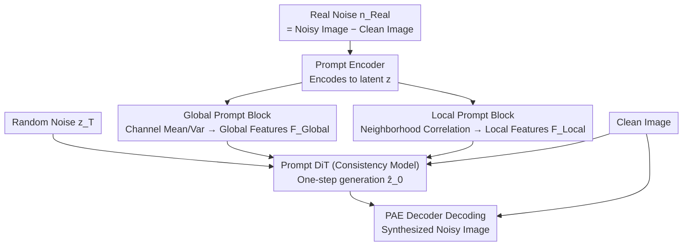

# PNG: Diffusion-Based sRGB Real Noise Generation via Prompt-Driven Noise Representation Learning

**Conference**: CVPR 2026  
**arXiv**: [2603.04870](https://arxiv.org/abs/2603.04870)  
**Code**: None  
**Area**: Image Denoising / Noise Generation  
**Keywords**: sRGB noise generation, prompt learning, consistency models, denoising, metadata-free

## TL;DR

PNG proposes using learnable Global/Local Prompt components to automatically extract noise features from real noise (replacing metadata like ISO/camera model). By encoding noise into a latent space via a Prompt AutoEncoder and using Prompt DiT (based on consistency models) for single-step latent code generation, it achieves metadata-free real sRGB noise synthesis. Downstream DnCNN denoising on SIDD lags behind real data by only 0.08dB.

## Background & Motivation

**Background**: sRGB domain denoising is a core problem in low-level vision. Mainstream supervised learning methods rely on large amounts of noisy-clean image pairs for training, but collecting real paired data is extremely expensive (requiring multi-frame averaging or special hardware), limiting practical applications. Therefore, **noise synthesis** methods have emerged—using generative models to synthesize realistic noisy images to augment training data.

**Limitations of Prior Work**: Current noise generation methods (NoiseFlow, Flow-sRGB, NeCA-W, etc.) rely on camera metadata (such as ISO value, sensor model, shutter speed, etc.) as conditions during both training and testing. However, in real-world scenarios: (a) publicly available sRGB images on the web are usually post-processed and EXIF tags are lost; (b) metadata formats in scientific imaging are inconsistent or missing; (c) metadata semantics are inconsistent across different devices. This limits the generalizability of these methods.

**Key Challenge**: Metadata is essentially a compact description of noise distribution (ISO $\rightarrow$ gain $\rightarrow$ noise intensity, camera model $\rightarrow$ ISP pipeline $\rightarrow$ noise spatial correlation). The question is: Can such descriptors be learned directly from the noisy image themselves without relying on external metadata?

**Goal**: (a) Eliminate reliance on metadata during training and testing stages; (b) Learn high-dimensional feature representations that substitute for metadata from limited noise samples; (c) Generate noise that is realistic enough so that the downstream denoiser performance approaches or exceeds that of models trained on real data.

**Key Insight**: Borrowing from prompt learning ideas in NLP/Vision—using learnable prompt components as "implicit encoders for noise features." These automatically extract prompt features from input noise statistics (channel mean/variance corresponding to ISO, local correlation coefficients corresponding to sensor characteristics) to replace explicit metadata.

**Core Idea**: Use learned Global Prompt (capturing ISO-related global noise statistics) and Local Prompt (capturing local spatial correlation introduced by ISP pipelines) to replace metadata, driving a diffusion-based noise generation framework based on consistency models.

## Method

### Overall Architecture

PNG consists of two core components, trained in two stages:

**Stage 1: Prompt AutoEncoder (PAE)**. Input real noise $\mathbf{n}_{Real} = \mathcal{I}_{Noisy} - \mathcal{I}_{Clean}$. The Prompt Encoder $\mathcal{E}$ encodes noise into a latent code $\mathbf{z}$, while simultaneously generating prompt features $\mathbf{F}_{Global}$ and $\mathbf{F}_{Local}$ via Global Prompt Blocks and Local Prompt Blocks. The Decoder $\mathcal{D}$ reconstructs the noisy image $\hat{\mathcal{I}}_{Noisy}$ conditioned on $\mathbf{z}$ and the clean image $\mathcal{I}_{Clean}$ (learning signal-dependent characteristics). Training uses $\mathcal{L}_1$ reconstruction loss + $\mathcal{L}_2$ latent regularization.

**Stage 2: Prompt DiT (P-DiT)**. A consistency model (CM) is trained in the latent space of the PAE. P-DiT, conditioned on prompt features and the clean image, maps random noise $\mathbf{z}_T$ to a latent code $\hat{\mathbf{z}}_0$ in a single step, which is then decoded by the PAE Decoder into a noisy image.

**Inference**: Given a small amount of real noise $\mathbf{n}_{Real}$ $\rightarrow$ Prompt Encoder extracts prompt features $\rightarrow$ P-DiT generates a new latent code in one step $\rightarrow$ Decoder + clean image $\rightarrow$ synthesized noisy image.

### Key Designs

**1. Global Prompt Block: Implicitly Encoding ISO Gain via Channel Statistics**

Metadata-based ISO is useful because it determines sensor gain and thus the overall noise intensity—which is reflected in the channel mean and standard deviation. GPB follows this clue: instead of reading ISO values, it directly calculates the channel mean $\mu$ and standard deviation $\Sigma$ from input features $\mathbf{F}_{In}^\ell$. These are passed through $1\times1$ convolutions and softmax to generate modulation weights $\mathbf{w}_{Global}^\ell = \text{Softmax}(\text{Conv}_{1\times1}[\mu(\mathbf{F}_{In}^\ell), \Sigma(\mathbf{F}_{In}^\ell)])$, which are used to weight a learnable prompt component $\mathbf{P}_{Global}^{\ell} \in \mathbb{R}^{\frac{H}{2^\ell} \times \frac{W}{2^\ell} \times C_{Global}^\ell}$. Finally, $\mathbf{F}_{Global}^\ell = \text{Conv}_{3\times3}(\mathbf{w}_{Global}^\ell \odot \mathbf{P}_{Global}^\ell)$. Thus, learnable parameters capture the prior of "gross noise appearance," while sample statistics capture "specific intensity," yielding a global noise descriptor equivalent to ISO without relying on numerical values.

**2. Local Prompt Block: Capturing Camera Fingerprints via Neighborhood Correlation Coefficients**

Real sRGB noise is not pixel-independent—demosaicing, non-linear mapping, and spatially adaptive processing in the ISP pipeline correlate adjacent pixels. This local correlation pattern is the "fingerprint" of different camera models, which global statistics cannot capture. LPB takes a $\rho\times\rho$ neighborhood at each pixel and calculates the Pearson correlation coefficient between the center pixel and its neighbors, forming a correlation map $\mathbf{F}_\rho \in \mathbb{R}^{H \times W \rho^2}$. It then takes the mean along rows and columns (ISP non-linearities often have directionality), passes them through CoMB ($1\times1$ Conv $\rightarrow$ Bilinear Upsampling $\rightarrow$ $3\times3$ Conv) and softmax to obtain local modulation weights:

$$\mathbf{w}_{Local} = \text{Softmax}(\text{CoMB}([\text{Avg}_{row}(\mathbf{F}_\rho), \text{Avg}_{col}(\mathbf{F}_\rho)]))$$

This modulates local prompt components to output $\mathbf{F}_{Local} = \text{Conv}_{3\times3}(\mathbf{w}_{Local} \odot \mathbf{P}_{Local})$. While GPB handles "noise intensity," LPB handles "spatial entanglement," together replacing ISO + camera model metadata.

**3. Prompt DiT: Consistency Models Compress Noise Generation to a Single Step**

A generator is needed that is both realistic and fast. P-DiT does not diffuse in pixel space; instead, it trains a consistency model (CM) in the latent space of the PAE, mapping random noise $\mathbf{z}_T$ to a latent code $\hat{\mathbf{z}}_0$ in one step—achieving a throughput of 57 FPS at 256×256 resolution. The backbone is DiT-S ($B=8$ blocks, patch size = 1 to preserve fine noise textures). Conditions come from three paths: timestep embedding, clean image, and the two prompts. Clean images and prompts are pixel-downsampled, passed through $3\times3$ convolutions for shallow features, and concatenated into $\mathbf{F}_{Cond}$, then added to the timestep embedding via global average pooling. To preserve spatial information, Prompt Attention is added to P-DiT blocks—injecting condition features into attention layers as Q/K/V. Ablations show this step alone reduces KLD from 0.0287 to 0.0261, proving AdaLN-style global condition injection is insufficient.

### Loss & Training

**PAE Training**: $\mathcal{L}_1$ loss (noisy image reconstruction) + $\mathcal{L}_2$ latent regularization. Adam optimizer, lr cosine annealed from $10^{-4}$ to $10^{-6}$, 400k iterations, 256×256 patch, batch size 64.

**P-DiT Training**: Consistency training loss (pseudo-Huber loss), $d(\mathbf{x},\mathbf{y}) = \sqrt{\|\mathbf{x}-\mathbf{y}\|_2^2 + c^2} - c$. RAdam optimizer, fixed lr $2 \times 10^{-4}$, 250k iterations, 256×256 patch encoded to 32×32 latent, batch size 512. EMA (decay 0.9999) is used. Discretization curriculum increases from $s_0=10$ to $s_1=160$ with lognormal noise sampling.

## Key Experimental Results

### Main Results: Noise Quality on SIDD Validation Set (KLD↓ / AKLD↓)

| Camera | C2N KLD | NeCA-W KLD | NAFlow KLD | **PNG KLD** |
|------|---------|-----------|------------|------------|
| G4 | 0.1660 | 0.0242 | 0.0254 | **0.0174** |
| GP | 0.1315 | 0.0432 | 0.0352 | **0.0143** |
| IP | 0.0581 | 0.0410 | 0.0339 | **0.0291** |
| N6 | 0.3524 | 0.0206 | 0.0309 | **0.0167** |
| S6 | 0.4517 | 0.0302 | 0.0272 | **0.0193** |
| **Mean** | 0.2129 | 0.0342 | 0.0305 | **0.0194** |

PNG achieves optimal KLD and AKLD across all 5 smartphone cameras.

### Downstream Denoising Performance (DnCNN on SIDD Benchmark)

| Training Data | PSNR (dB) | SSIM |
|----------|----------|------|
| C2N (Synthetic) | 33.76 | 0.901 |
| NeCA-W (Synthetic) | 34.74 | 0.912 |
| NAFlow (Synthetic) | 37.22 | 0.935 |
| **PNG (Ours)** | **37.55** | **0.937** |
| Real (Ground Truth) | 37.63 | 0.936 |

The denoiser trained on PNG synthetic data is only 0.08dB behind the oracle trained on real data; SSIM even exceeds the oracle by 0.001.

### Cross-domain Generalization (Mixed Training: 50% Real + 50% Synthetic)

| Method | PolyU PSNR | Nam PSNR | SIDD Val PSNR | SIDD+ PSNR | Mean |
|------|-----------|---------|--------------|-----------|------|
| Real (100%) | 36.34 | 35.35 | 37.72 | 35.68 | 36.27 |
| NAFlow-Mixed | 37.29 | 37.47 | 37.66 | 36.27 | 37.17 |
| **PNG-Mixed** | **37.98** | **38.09** | **37.96** | **36.57** | **37.65** |

In mixed training, PNG outperforms pure real data training on all 4 datasets, with an average PSNR Gain of +1.38dB.

### Ablation Study

| GPB | LPB | KLD↓ | AKLD↓ | Description |
|-----|-----|------|-------|------|
| ✗ | ✗ | 0.6182 | 0.4387 | No prompt, failed |
| ✓ | ✗ | 0.0287 | 0.1112 | Global only, significant improvement |
| ✓ | ✓ | **0.0261** | **0.1108** | Global + Local, optimal |

Metadata classification experiment: Camera sensor classification accuracy using prompt features reached 94.47% (baseline 75.80%); Top-1 for the joint 16-class ISO+sensor was 75.48%, and Top-3 was 98.64%, proving prompts encode equivalent metadata information.

### Key Findings

- GPB contributes the most—adding GPB drops KLD from 0.6182 to 0.0287. LPB further reduces it to 0.0261; its improvement is smaller but essential for spatial correlation modeling.
- Prompt Attention is vital in P-DiT—injecting conditions into both timestep embedding and attention reduces KLD from 0.0287 to 0.0261 compared to only embedding.
- Inference Speed: At 256×256 resolution, PNG achieves 57 FPS, 4.4× faster than NAFlow (13 FPS); at 512×512, 21 FPS vs 8 FPS.
- Scaling up synthetic data continuously improves generalization (×1 $\rightarrow$ ×4, average PSNR on external datasets rises from 36.74 to 37.23).

## Highlights & Insights

- **The concept of replacing Metadata with prompts is elegant**: It doesn't simply discard metadata conditions but proposes a structured approach (channel statistics $\rightarrow$ global prompt, local correlation $\rightarrow$ local prompt) to extract equivalent information from the noise itself. Classification experiments provide interpretability.
- **Two-stage training + CM single-step generation**: PAE learns compact latent representations and prompt extraction in image space, while P-DiT uses consistency models for single-step generation in latent space, balancing quality and efficiency. This "learn compact space first, then generate" paradigm is applicable to other conditional generation tasks.
- **Cross-domain capability is a major highlight**: After training on SIDD (smartphones), noise samples from PolyU/Nam (DSLRs) can be used directly to generate corresponding noise, whereas metadata-dependent methods fail in this scenario.

## Limitations & Future Work

- A small amount of real noise samples is still required (to extract prompt features); it is not entirely zero-shot noise generation.
- PAE total parameters are approximately 44M (medium scale), but the two-stage training (400k + 250k) remains time-consuming.
- Experiments are based on DnCNN as the downstream denoiser; validation on stronger denoisers (e.g., Restormer, NAFNet) is pending.
- Pearson correlation coefficient calculation for Local Prompt requires real noise patches, which might be restricted in completely unpaired data scenarios.
- RAW domain noise generation has not been explored (currently limited to sRGB domain); RAW noise is more regular with clearer metadata, representing another valuable direction.

## Related Work & Insights

- **vs NAFlow**: NAFlow uses normalizing flows and does not require metadata during inference, but still needs it for training. PNG requires no metadata for either and achieves 0.0111 better average KLD, 0.33dB higher denoising PSNR, and 4.4× faster inference.
- **vs NeCA-W**: NeCA-W requires training independent models for each camera model (5 × 40.5M parameters). PNG handles all devices with a single model (44M total parameters) and is significantly superior in cross-domain scenarios.
- **vs C2N/Flow-sRGB**: These early methods produce significantly lower noise quality than PNG, with a large gap in downstream denoising (33-34dB vs 37.55dB).
- This paper demonstrates the strong potential of prompt learning in low-level vision tasks; using prompts as "implicit condition encoders" is a paradigm worth exploring in other degradation modeling tasks (e.g., blur, compression artifacts).

## Rating

- Novelty: ⭐⭐⭐⭐ The framework using prompts to replace metadata is creative; GPB/LPB method for extracting features from noise statistics is clever.
- Experimental Thoroughness: ⭐⭐⭐⭐⭐ Evaluated on SIDD/PolyU/Nam/SIDD+/MAI2021; dual evaluation of noise quality and denoising; both paired and unpaired settings; comprehensive ablations.
- Writing Quality: ⭐⭐⭐⭐ Clear method description, intuitive diagrams, and detailed experimental analysis. The supplementary material is very substantial.
- Value: ⭐⭐⭐⭐ Eliminating metadata dependency is a genuine requirement in practical applications; its cross-domain generalization makes it highly valuable for data augmentation.

<!-- RELATED:START -->

## Related Papers

- [\[CVPR 2026\] The Surprising Effectiveness of Noise Pretraining for Implicit Neural Representations](the_surprising_effectiveness_of_noise_pretraining_for_implicit_neural_representa.md)
- [\[CVPR 2026\] Convexity-Aware Noise Calibration: A Self-Supervised Framework for Noise-Level-Unknown Image Denoising](convexity-aware_noise_calibration_a_self-supervised_framework_for_noise-level-un.md)
- [\[CVPR 2026\] NEC-Diff: Noise-Robust Event–RAW Complementary Diffusion for Seeing Motion in Extreme Darkness](nec-diff_noise-robust_event-raw_complementary_diffusion_for_seeing_motion_in_ext.md)
- [\[CVPR 2026\] Self-Attention Driven Tensor Representation for High-Order Data Recovery](self-attention_driven_tensor_representation_for_high-order_data_recovery.md)
- [\[CVPR 2026\] BiProLoRA: Bilevel Prompt LoRA for Real Scene Recovery](biprolora_bilevel_prompt_lora_for_real_scene_recovery.md)

<!-- RELATED:END -->
