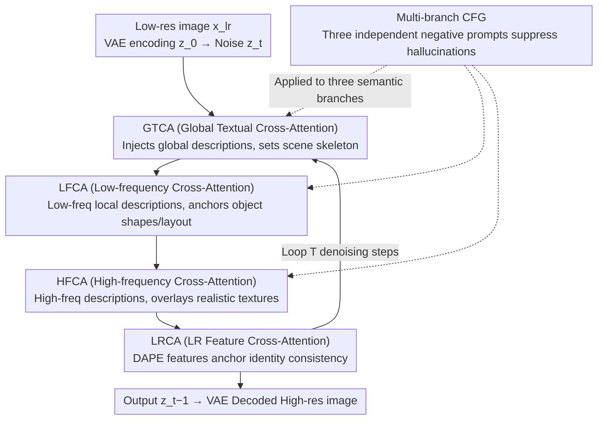

# Disentangled Textual Priors for Diffusion-based Image Super-Resolution

**Conference**: CVPR 2026  
**arXiv**: [2603.07430](https://arxiv.org/abs/2603.07430)  
**Code**: [GitHub](https://github.com/JL6666JL/DTPSR)  
**Area**: Image Super-Resolution  
**Keywords**: Diffusion-based SR, Text-guided, Disentangled Priors, Frequency-aware, Semantic Control

## TL;DR

DTPSR is proposed to achieve superior perceptual quality in diffusion-based super-resolution by disentangling textual priors across two dimensions: spatial hierarchy (global/local) and frequency semantics (low/high), integrated through a decoupled cross-attention pipeline and a multi-branch CFG strategy.

## Background & Motivation

Diffusion models (e.g., Stable Diffusion) demonstrate powerful generative capabilities in image super-resolution (SR), but their performance heavily relies on how semantic priors are constructed and injected. Existing methods face two categories of limitations:

**Insufficient Semantic Granularity**: Local-label methods (e.g., SeeSR) focus on details but lack global consistency; global description methods (e.g., SUPIR, PASD) capture the overall scene but ignore fine-grained details.

**Entangled Frequency Information**: Current approaches mix structural information (low-frequency: shape, layout) and textural information (high-frequency: edges, materials) within the same embeddings, leading to insufficient semantic controllability and interpretability.

**Hallucination under Severe Degradation**: Without disentangled semantic guidance, diffusion models are prone to hallucinations, such as misinterpreting wall textures as ocean waves.

**Key Insight**: Disentangle textual priors along two orthogonal dimensions—**spatial hierarchy** and **frequency semantics**—to enable the model to simultaneously capture scene-level structures and object-level details.

## Method

### Overall Architecture

DTPSR addresses the core problem: "How should textual priors be fed into diffusion-based SR models?" Instead of injecting a vague global description into cross-attention, it decomposes textual priors into four streams: "Global Structure / Local Low-Freq / Local High-Freq / Input Anchoring," which are injected into the denoising process sequentially according to semantic levels.

Specifically, the low-resolution image $x_{lr}$ is encoded by a VAE into the latent space as $z_0$ and forward-noised to $z_t$. In each reverse denoising step, latent variables pass through four specialized cross-attention modules like a pipeline: first, GTCA injects global structure; next, LFCA adds object-level low-frequency shapes; then, HFCA overlays high-frequency textures; finally, LRCA uses original image features to anchor identity consistency:

$$z_t \xrightarrow{\text{GTCA}} z_t^g \xrightarrow{\text{LFCA}} z_t^{lf} \xrightarrow{\text{HFCA}} z_t^{hf} \xrightarrow{\text{LRCA}} z_{t-1}$$

This "coarse-to-fine, structure-to-texture" injection sequence is intentional: establishing the global skeleton first before adding layers of detail avoids conflicts between different semantic sources.

### Key Designs

**1. GTCA (Global Textual Cross-Attention): Establishing the Scene Skeleton**

Methods relying solely on global descriptions capture the big picture but fail at details, while local methods lack global consistency. GTCA serves as the foundation. It encodes a global description $c_g$ (e.g., "Indoor scene with 3 objects") via CLIP into $e_g$ and injects it into latent $z_t$ through cross-attention to establish scene-level structure and layout. Subsequent modules perform incremental refinement on this global skeleton.

**2. LFCA (Low-frequency Cross-Attention): Anchoring Object Shapes and Layout**

Low-frequency information (shape, size, spatial arrangement) determines structural fidelity. When mixed with high-frequency textures in the same embedding, interference occurs. DTPSR assigns a dedicated path for this. LFCA encodes a set of low-frequency local descriptions $\{c_{lf}^{(i)}\}$ via CLIP and concatenates them into a matrix:

$$E_{lf} = [\text{CLIP\_TextEnc}(c_{lf}^{(1)}), \dots, \text{CLIP\_TextEnc}(c_{lf}^{(n)})]$$

This is injected into the GTCA output $z_t^g$ for object-level structural enhancement. By focusing only on low frequencies, it anchors layouts (e.g., "L-shaped sofa against the wall") without being distracted by texture details.

**3. HFCA (High-frequency Cross-Attention): Overlaying Realistic Textures on Structure**

High-frequency information (texture, edges, surface material) controls visual realism. DTPSR isolates this as the third injection path to refine textures without altering the established structure. HFCA encodes high-frequency descriptions $\{c_{hf}^{(j)}\}$ and injects them onto the LFCA output:

$$z_t^{hf} = \text{HFCA}(z_t^{lf}, E_{hf})$$

This division of labor ensures that "correctness of shape" and "realism of texture" are handled independently, which is key to preventing hallucinations like misinterpreting walls as waves.

**4. LRCA (Low-resolution Feature Cross-Attention): Anchoring Results to the Input**

Even rich textual priors can lead to generation drift away from the input content. LRCA uses a frozen DAPE encoder to extract visual features $f_{lr}$ from $x_{lr}$, injecting them via cross-attention as identity anchors to constrain the denoising output from drifting. Placed at the end of the chain, it serves as an "alignment correction."

**5. Multi-branch Classifier-Free Guidance (CFG): Individual "Brakes" for Each Semantic Source**

Standard CFG utilizes a single negative prompt, which is insufficient for DTPSR's multiple semantic sources (global, low-freq, high-freq). Thus, independent negative prompts $c_g^{\text{neg}}, c_{lf}^{\text{neg}}, c_{hf}^{\text{neg}}$ are assigned to the three branches for semantic suppression following:

$$\tilde{\epsilon} = \hat{\epsilon} + \lambda_s(\hat{\epsilon} - \hat{\epsilon}_{\text{neg}})$$

This allows for frequency-aware precision control over hallucinations without requiring additional training.

### A Complete Example

For a heavily degraded indoor photo:
- **GTCA**: Receives "Living room with sofa, table, wall." It defines general positions and skeleton in latent space (blurred blocks).
- **LFCA**: Receives "L-shaped sofa on the left, rectangular table in center." It anchors the shape and layout of each object (clear outlines).
- **HFCA**: Receives "Linen sofa texture, wooden table grain, matte wall paint." It overlays textures onto established shapes (wall texture is preserved correctly).
- **LRCA**: Uses original features to ensure the room remains the specific one from the input.
- **Multi-branch CFG**: Suppresses potential hallucinations at each frequency level independently during denoising.

### Loss & Training

- **Training Loss**: Standard noise prediction MSE loss.
$$\mathcal{L} = \mathbb{E}[\|\epsilon - \epsilon_\theta(z_t, z_{lr}, t, c_g, c_{lf}, c_{hf})\|_2^2]$$
- **DisText-SR Dataset**: ~95K image-text pairs based on LSDIR + first 10K FFHQ images. Decoupled descriptions generated via Mask2Former segmentation + LLaVA.
- **Base Model**: SD-2-base; DAPE encoder for LR embeddings.
- **Training Config**: AdamW, lr $5 \times 10^{-5}$, batch 32, 110K iterations, 4× A800.
- **Inference**: DDPM 50 steps, guidance scale $\lambda_s = 7.0$.

## Key Experimental Results

### Main Results

| Dataset | Metric | DTPSR | FaithDiff | SUPIR | Gain |
|--------|------|-------|-----------|-------|------|
| DIV2K-Val | MUSIQ↑ | **71.24** | 69.18 | 62.59 | +2.06 |
| DIV2K-Val | MANIQA↑ | **0.5866** | 0.4309 | 0.5224 | +0.0642 |
| DIV2K-Val | CLIPIQA↑ | **0.7549** | 0.6463 | 0.7040 | +0.0509 |
| RealSR | MUSIQ↑ | **71.84** | 68.86 | 58.51 | +2.98 |
| RealSR | MANIQA↑ | **0.6021** | 0.4644 | 0.4429 | +0.0432 |
| DRealSR | CLIPIQA↑ | **0.7640** | 0.6335 | 0.6307 | +0.0729 |

Note: DTPSR achieves SOTA on all no-reference perceptual metrics, though PSNR/SSIM are lower than GAN-based methods (perception-distortion trade-off).

### Ablation Study

| Config | MANIQA↑ | CLIPIQA↑ | MUSIQ↑ | Note |
|------|---------|----------|--------|------|
| w/o Prior | 0.5271 | 0.7064 | 67.48 | Baseline |
| Local Only | 0.5851 | 0.7471 | 68.86 | Local prior contributes more |
| Global Only | 0.5394 | 0.7211 | 67.80 | Global gain is moderate |
| Global + Local | **0.6011** | **0.7640** | **69.24** | Best complementarity |
| Freq Mixed | 0.5947 | 0.7527 | 69.05 | Disentangled > Mixed |
| Freq Disentangled | **0.6011** | **0.7640** | **69.24** | Separated injection is effective |

### Key Findings

- Local prior contribution significantly outweighs global prior (MANIQA gain 0.0580 vs. 0.0123).
- Frequency disentanglement consistently outperforms frequency mixing across all metrics.
- Multi-branch CFG significantly improves perceptual quality over single/no CFG (MUSIQ 66.73→69.24).
- DTPSR exhibits robustness, outperforming other methods even when text descriptions are corrupted (replaced with "None").
- 10.5B parameters, inference at 14.94s/image, showing better efficiency compared to SUPIR (17.8B) and FaithDiff (15.6B).

## Highlights & Insights

1.  **Elegant Disentangled Design**: Disentangling textual priors across spatial hierarchy × frequency semantics is conceptually clear and effective.
2.  **DisText-SR Dataset**: The first large-scale SR dataset combining global-local + low-high frequency text annotations, providing a foundation for controllable SR.
3.  **Multi-branch CFG Strategy**: Suppresses hallucinations without extra training, enabling fine-grained control via frequency-aware negative prompts.
4.  **Robustness**: The system functions effectively even if upstream modules (segmentation, captioning) produce imperfect outputs.

## Limitations & Future Work

1.  Full-reference metrics like PSNR/SSIM are inferior to GAN methods, indicating a perception-distortion trade-off.
2.  Performance depends on the quality of upstream segmentation (Mask2Former) and captioning (LLaVA) models.
3.  Inference requires running segmentation and captioning pipelines, increasing end-to-end latency.
4.  Only the top-3 largest segments are processed, potentially missing small but important detail regions.
5.  Future directions: Adaptive prompt correction, closer integration with upstream modules, and more efficient diffusion backbones.

## Related Work & Insights

- **SeeSR**: Uses local semantic labels but lacks global consistency.
- **SUPIR/PASD/FaithDiff**: Uses global descriptions but ignores frequency separation.
- **StableSR/DiffBIR**: Does not utilize textual semantics, missing the full potential of diffusion priors.
- Insight: The concept of disentangled textual priors can be generalized to other conditional generation tasks (e.g., editing, inpainting).

## Rating

- Novelty: ⭐⭐⭐⭐ Innovative spatial-frequency dual-disentangled prior and multi-branch CFG.
- Experimental Thoroughness: ⭐⭐⭐⭐ Multiple datasets, wide metrics, and extensive ablations (global/local, frequency, CFG, robustness).
- Writing Quality: ⭐⭐⭐⭐ Clear motivation, framework diagrams, and logical experimental organization.
- Value: ⭐⭐⭐⭐ Provides a new paradigm for text-guided diffusion SR; DisText-SR dataset is highly practical.

<!-- RELATED:START -->

## Related Papers

- [\[CVPR 2026\] UniLDiff: Unlocking the Power of Diffusion Priors for All-in-One Image Restoration](unildiff_unlocking_the_power_of_diffusion_priors_for_all-in-one_image_restoratio.md)
- [\[CVPR 2026\] DreamSR: Towards Ultra-High-Resolution Image Super-Resolution via a Receptive-Field Enhanced Diffusion Transformer](dreamsr_towards_ultra-high-resolution_image_super-resolution_via_a_receptive-fie.md)
- [\[CVPR 2026\] TUDSR: Twice Upsampling-Diffusion for Higher Super-Resolution](tudsr_twice_upsampling-diffusion_for_higher_super-resolution.md)
- [\[CVPR 2026\] One-Step Diffusion Transformer for Controllable Real-World Image Super-Resolution](one-step_diffusion_transformer_for_controllable_real-world_image_super-resolutio.md)
- [\[CVPR 2026\] Time-Aware One Step Diffusion Network for Real-World Image Super-Resolution](time-aware_one_step_diffusion_network_for_real-world_image_super-resolution.md)

<!-- RELATED:END -->
