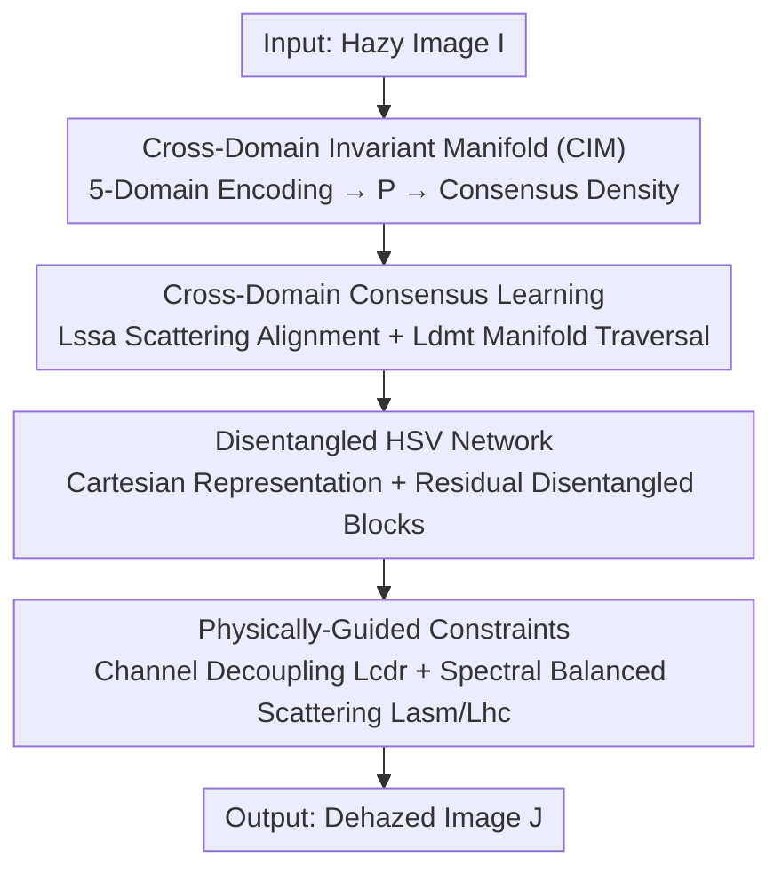

# Disentanglement-wise Image Dehazing through Cross-Domain Manifold Consensus

**Conference**: CVPR 2026  
**Paper**: [CVF Open Access](https://openaccess.thecvf.com/content/CVPR2026/html/Lyu_Disentanglement-wise_Image_Dehazing_through_Cross-Domain_Manifold_Consensus_CVPR_2026_paper.html)  
**Code**: Not open-sourced (no link provided in the paper)  
**Area**: Image Restoration  
**Keywords**: Image Dehazing, Cross-domain Manifold, Contrastive Learning, HSV Disentanglement, Physical Constraints  

## TL;DR
This paper operationalizes the hypothesis that "hazy image features across different perceptual domains (spatial, frequency, non-local, diffusion, compressive sensing) share the same scattering semantic core" into a **Cross-domain Invariant Manifold (CIM)**. Using contrastive learning driven by consensus density, multi-domain features are aligned into a unified latent space. Additionally, a **physically-guided HSV disentanglement network** is integrated to specifically decouple color channel interference caused by haze. This approach simultaneously addresses "haze feature misjudgment" and "color distortion," achieving SOTA performance on multiple real/synthetic benchmarks with the fastest inference speed (0.062s).

## Background & Motivation
**Background**: The mainstream approach for image dehazing involves deep networks, categorized by the representation domains they utilize: spatial, frequency, non-local, diffusion, and compressive sensing. Recently, "multi-domain fusion" methods have attempted to combine complementary cues from these domains.

**Limitations of Prior Work**: The authors highlight two entangled challenges. First is **haze feature misjudgment**—single-domain methods often confuse "haze-induced low contrast" with "native scene low contrast" (e.g., sky, low-reflectance surfaces). While multi-domain methods attempt to exploit inter-domain correlations, they rely on **hand-crafted feature transfer** or domain-specific heads, failing to capture the essence that scattering is the same physical process across all domains. This often results in treating domain-specific features as haze attributes, leading to suboptimal restoration and color shifts. Second is **color distortion**—in scenarios like sandstorms or thick fog, haze destroys the natural independence of H/S/V channels in clear images, introducing strong non-linear coupling that hinders faithful color recovery.

**Key Challenge**: Existing dehazing either views haze within a "single representation domain" (limited perspective, prone to misjudgment) or "empirically aggregates multiple domains" (lacking physically consistent alignment, introducing domain conflicts). Furthermore, color restoration is often treated as a peripheral issue without explicit H/S/V decoupling.

**Key Insight**: The authors draw an analogy from the "shared semantic hypothesis" in multilingual NLP—sentences with the same meaning are mapped to proximal points in a common semantic space despite different syntax. Analogously: **Do different representations of the same hazy scene across perceptual domains contain a domain-invariant "scattering semantic core"?** Since all degradations stem from the same atmospheric scattering model $I = J\cdot t + A\cdot(1-t)$, scattering features across domains should reside on a shared manifold.

**Core Idea**: A **Cross-domain Invariant Manifold (CIM)** replaces "independent domains + manual transfer," allowing multi-domain features to self-organize and align under physical scattering constraints. A dedicated disentanglement network is appended to decouple HSV color interference, where "manifold convergence" and "color disentanglement" reinforce each other in a unified physically consistent paradigm, CIM-D.

## Method

### Overall Architecture
CIM-D is a **dual-perspective unified framework**: it takes a hazy image $I$ as input and outputs a dehazed image $J$. The first branch, **CIM**, focuses on "accurate haze identification"—it extracts features using five domain-specific encoders (Spatial SFE, Frequency FFE, Non-local NFE, Diffusion DFE, Compressive Sensing CFE), projects them into a unified latent space $M$ via a translation network $P$, and uses **consensus density** to distinguish "cross-domain consistent scattering" from "domain-specific noise." Contrastive learning clusters hazy/clear features into high-density regions, modeling dehazing as a "traversal from a hazy prototype to a clear prototype on the manifold." The second branch, the **Disentangled HSV Network**, focuses on "accurate color correction"—it converts RGB to a stable Cartesian HSV representation and uses a U-Net with Residual Disentanglement Blocks to explicitly estimate and suppress haze-induced coupling between H/S/V channels. These branches are not serial but **mutually regularized**: the manifold provides domain-invariant physical consensus for disentanglement, while the HSV network's physical constraints pull manifold learning toward "photometrically valid" geometry.

### Key Designs

**1. Cross-Domain Invariant Manifold (CIM): Distinguishing "True Scattering" from "Domain Noise"**

To address "single-domain misjudgment and manual multi-domain transfer," the authors construct a unified latent space $M$. For the $i$-th image in state $s\in\{h,c\}$ (hazy/clear), five encoders $\{\Phi_k\}_{k=1}^5$ extract features, which are projected to the manifold: $z_s^{i,k} = P(\Phi_k(I_s^i))$. The key innovation is defining **consensus density** to characterize how many domains "agree" on a specific point. First, the feature density for each domain at point $z$ is calculated (via Gaussian kernel estimation):

$$\rho_s^k(z) = \frac{1}{N_k}\sum_{i=1}^{N_k} e^{-\frac{\|z - P(\Phi_k(I_s^i))\|^2}{2\sigma^2}}$$

The **geometric mean** of these densities is then taken as the total consensus density:

$$\rho_s(z) = \Big(\prod_{k=1}^{K}\rho_s^k(z)\Big)^{1/K}$$

The advantage of the geometric mean is its "veto power"—if any domain has very low density at a point (indicating it is domain-specific rather than a cross-domain consensus), the product is pulled down. This **suppresses domain-specific bias and preserves scattering structures recognized across all domains**. The peaks of $\rho_h$ and $\rho_c$ correspond to hazy and clear prototypes. Unlike traditional semantic clustering, this manifold geometry emerges from "cross-domain physical consensus," forming a continuous scattering semantic field that allows restoration to be interpreted as traversal along the manifold.

**2. Cross-Domain Consensus Learning: Optimizing Alignment and Dehazing Targets**

Two contrastive losses driven by consensus density are designed. **Scattering Semantic Alignment ($L_{ssa}$)** pulls same-state positive pairs together while pushing away low-density negative samples:

$$L_{ssa} = -\mathbb{E}_{(m_s^i,m_s^j)\sim p_{pos}}\Big[\log\frac{D(m_s^i,m_s^j)}{D(m_s^i,m_s^j)+R(m_s^i)}\Big]$$

where $D(u,v)=e^{\mathrm{Sim}(u,v)/\tau}$ and $R(m_s^i)=\sum_n D(m_s^i,m_-^n)$ aggregates similarity from low-density negative samples. The sampling probability $p_{pos}$ embeds the manifold geometry: $p_{pos}(m_s^i,m_s^j)\propto \rho_s(m_s^i)\rho_s(m_s^j)\,e^{-\|m_s^i-m_s^j\|^2/2\sigma_g^2}$, meaning **high-density, proximal** points in the same state are more likely to be paired. **Manifold Traversal Dehazing ($L_{dmt}$)** pushes the manifold position $m_d$ of the dehazed result $J$ toward the clear prototype $\mu_c$ and away from the hazy prototype $\mu_h$:

$$L_{dmt} = -\log\frac{w\cdot D(m_d,\mu_c)}{w\cdot[D(m_d,\mu_c)+D(m_d,\mu_h)]+(1-w)\cdot R(m_d)}$$

where $\mu_c, \mu_h$ are obtained via density peak clustering, and weight $w = 1-e^{-(\rho_h(m_d)+\rho_c(m_d))/2}$ increases trust in prototype guidance when the result falls into high-density regions. This transforms dehazing from a "black-box regression" into a **directed traversal on an interpretable manifold**.

**3. Disentangled HSV Network: Explicitly Decoupling Haze-induced Color Interference**

To address color distortion, input stability is first resolved: the raw H channel is a **circular variable** and unstable in low-saturation areas. Thus, it is converted into a continuous Cartesian representation $D_x=(S_I\cos(2\pi H_I)+1)/2$, $D_y=(S_I\sin(2\pi H_I)+1)/2$, and $D_z=V_I$. The network is a U-Net featuring **Residual Disentanglement Blocks**. These blocks calculate gradients $\nabla H,\nabla S,\nabla V$ using Sobel operators and quantify inter-channel coupling using absolute cosine similarity $S_\nabla(\cdot,\cdot)$, followed by adaptive correction:

$$H_{dec} = H - F\big(\mathrm{cat}[S_\nabla(S,H),S_\nabla(H,V)]\big)\cdot W$$

where $W=\mathrm{Sigmoid}(F(\mathrm{cat}[\|\nabla H\|,\|\nabla S\|,\|\nabla V\|]))$ is an adaptive weight. This **automatically disables disentanglement in low-gradient uninformative regions (e.g., sky)** to avoid damaging naturally independent areas. The "explicit quantification + explicit subtraction" of coupling is the fundamental reason this outperforms implicit learning in standard residual blocks (verified in Ablation V7).

**4. Physically-Guided Constraints: Aligning Color Recovery with Atmospheric Scattering**

Two sets of constraints ensure physical validity. **Channel Disentanglement Regularization ($L_{cdr}$)**: Statistical analysis of 10,000 clear images shows that mutual information between HSV channel pairs follows a Gaussian distribution. The differentiable mutual information estimate $\widehat{MI}_{i,j}(J)$ of the dehazed image is constrained to this Gaussian. **Spectral-balanced Scattering Constraint**: A learnable spectral balance matrix $W$ rewrites the ASM as $I_w=J_w t+A_w(1-t)$. Mapping this to HSV (and using $S_{A_w}\approx0$ to eliminate the unknown transmission $t$) yields an invariant ratio constraint $L_{asm}=\mathbb E[\|T(I_w,V_A)-T(J,V_A)\|_2^2]$ between input and output, where $T(u,V_A)=S_uV_u/(V_A-V_u)$. A **hue consistency loss** $L_{hc}$ is also added to penalize hue shifts in reliable regions.

### Loss & Training
The total loss integrates the four components:

$$L_{total} = \lambda_1 L_{ssa} + \lambda_2 L_{dmt} + \lambda_3 L_{cdr} + \lambda_4(L_{asm}+L_{hc})$$

Weights are set as $\lambda_{1..4}=0.1, 0.5, 0.05, 1$. Training uses AdamW on 2500 real hazy images (RTTS/URHI) and 1800 clear images (OTS). Significantly, the training is **unpaired**; the model relies on manifold consensus and physical constraints for restoration without pixel-level correspondence.

## Key Experimental Results

### Main Results
Full-reference metrics (PSNR/SSIM) were used for synthetic sets, and no-reference metrics (FADE/NIQE) for the real RTTS set. CIM-D achieved the best performance on Raw2ah and RTTS, with the fastest inference speed.

| Dataset | Metric | CIM-D | Best Rival | Note |
|--------|------|-------|----------|------|
| Raw2ah | PSNR↑ / SSIM↑ | **17.89 / 0.585** | C2P 17.26 / 0.553 | 1st in both metrics |
| SOTS | PSNR↑ / SSIM↑ | 25.51 / 0.935 | C2P 27.22 / 0.955 | 2nd, behind C2P |
| RTTS | FADE↓ / NIQE↓ | **0.795 / 3.844** | UCL 0.824 / PTTD 3.887 | Best perceptual quality |
| Overall | Runtime↓ | **0.062s** | KA-Net 0.088s | Fastest inference |
| Overall | Params↓(M) | 2.38 | PTTD 2.02 | 2nd most lightweight |

### Ablation Study (SOTS)
Components were removed or replaced to verify their contributions:

| Variant | Change | PSNR↑ | SSIM↑ | Observation |
|------|------|-------|-------|------|
| V1 | w/o $L_{dmt}$ | 21.15 | 0.875 | Structural coherence collapses |
| V2 | w/o $L_{ssa}$ | 22.89 | 0.891 | Discriminative power drops |
| V3 | w/o $L_{cdr}$ | 23.26 | 0.910 | Residual color distortion |
| V4 | w/o $L_{asm}$ | 20.57 | 0.804 | Massive loss of detail (largest drop) |
| V5 | w/o $L_{hc}$ | 23.82 | 0.906 | Obvious hue shift in sky |
| V6 | Raw HSV | 18.95 | 0.878 | Severe instability due to hue circularity |
| V7 | Std Residual | 24.18 | 0.919 | Confirms necessity of explicit decoupling |
| CIM-D | Full | **25.51** | **0.935** | — |

### Key Findings
- **$L_{asm}$ is the most critical**: Removing it caused PSNR to plummet from 25.51 to 20.57, proving that tying restoration to atmospheric scattering photometry is the pillar of structural fidelity.
- **Cartesian HSV representation is vital**: The drop to 18.95 in V6 underscores that input stability issues regarding hue circularity are significantly underestimated.
- **Explicit gradient decoupling > Implicit residual learning**: V7 results show that "quantifying and subtracting coupling" is more effective than standard implicit learning.
- **Efficiency**: Achieving best-in-class real-world perceptual quality with an inference time of only 0.062s makes it highly suitable for real-time applications like autonomous driving.

## Highlights & Insights
- **Analogy across domains**: Transferring the "shared semantic hypothesis" from NLP to dehazing to propose a "scattering semantic core" is a brilliant cross-disciplinary analogy. Same physical processes across domains should fall on a shared manifold.
- **Geometric mean for "Veto Power"**: Using the geometric mean of densities rather than the arithmetic mean to define consensus naturally suppresses domain-specific noise.
- **Dehazing as "Manifold Traversal"**: $L_{dmt}$ interprets restoration as a directed movement toward a high-density clear prototype, making it more interpretable than standard end-to-end regression.
- **Adaptive Weight $W$**: Using gradient magnitude to disable disentanglement in the sky avoids over-correction in low-information regions.

## Limitations & Future Work
- The authors acknowledge occasional **halo artifacts near depth edges** and potential **over-smoothing** in complex multi-layered haze scenes.
- ⚠️ Much of the critical theory (theoretical basis for CIM, choice of five domains, HSV derivation) is in the Supplementary material. Evaluation of the rigor of these derivations should remain cautious until reviewed.
- PSNR on SOTS is still significantly behind C2P (25.51 vs 27.22), suggesting the method's strength lies in "real-world hazy + color fidelity" rather than "synthetic PSNR."
- Unpaired training on real data offers generalization but lacks pixel-level supervision; complex structural recovery remains a challenge.

## Related Work & Insights
- **vs. Single-domain methods (IDE, C2P, etc.)**: These often confuse haze with scene content (e.g., sky); CIM-D uses cross-domain consensus to cross-verify "what is haze," reducing misjudgment at the source.
- **vs. Multi-domain fusion (FSDGN, etc.)**: Others rely on empirical transfer or domain-specific heads; CIM-D establishes "physically grounded" alignment via consensus density.
- **vs. Perceptual color space methods**: While others use HSV as an auxiliary guide, CIM-D treats it as the primary representation and explicitly decouples H/S/V for better performance on colored haze (e.g., sandstorms).

## Rating
- Novelty: ⭐⭐⭐⭐⭐ Cross-domain invariant manifold + consensus density + manifold traversal; a highly novel and self-consistent perspective.
- Experimental Thoroughness: ⭐⭐⭐⭐ Extensive benchmarks and ablations, though key proofs are pushed to the supplement.
- Writing Quality: ⭐⭐⭐⭐ Clear logic but dense notation and heavy reliance on the supplementary material for details.
- Value: ⭐⭐⭐⭐ Excellent for real-world colored haze and real-time inference (0.062s).

<!-- RELATED:START -->

## Related Papers

- [\[CVPR 2026\] From Events to Clarity: The Event-Guided Diffusion Framework for Dehazing](from_events_to_clarity_the_event-guided_diffusion_framework_for_dehazing.md)
- [\[CVPR 2026\] Thermal Diffusion Matters: Infrared Spatial-Temporal Video Super-Resolution through Heat Conduction Priors](thermal_diffusion_matters_infrared_spatial-temporal_video_super-resolution_throu.md)
- [\[ICLR 2026\] Learning Domain-Aware Task Prompt Representations for Multi-Domain All-in-One Image Restoration](../../ICLR2026/image_restoration/learning_domain-aware_task_prompt_representations_for_multi-domain_all-in-one_im.md)
- [\[CVPR 2026\] RAW-Domain Degradation Models for Realistic Smartphone Super-Resolution](rawdomain_degradation_models_smartphone_sr.md)
- [\[CVPR 2026\] White-Balance First, Adjust Later: Cross-Camera Color Constancy via Vision-Language Evaluation](white-balance_first_adjust_later_cross-camera_color_constancy_via_vision-languag.md)

<!-- RELATED:END -->
