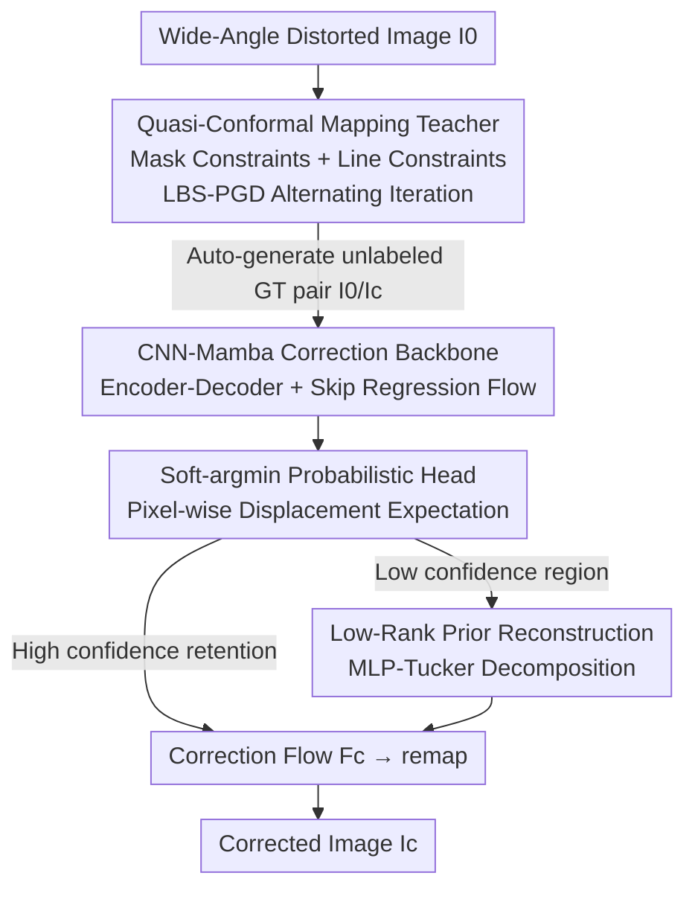

# Distilling Quasi-Conformal Mapping: A Generalizable and Efficient Solution for Wide-Angle Correction

**Conference**: CVPR 2026  
**Paper**: [CVF Open Access](https://openaccess.thecvf.com/content/CVPR2026/html/Liu_Distilling_Quasi-Conformal_Mapping_A_Generalizable_and_Efficient_Solution_for_Wide-Angle_CVPR_2026_paper.html)  
**Code**: None  
**Area**: Image Restoration / Low-Level Vision  
**Keywords**: Wide-angle distortion correction, quasi-conformal mapping, geometric knowledge distillation, human body distortion, Mamba  

## TL;DR
Using quasi-conformal mapping (QC mapping) as a "teacher" to automatically generate unlabeled wide-angle correction flow ground-truth, which is then distilled to a CNN-Mamba student network (QDWC-Net) to directly predict the correction flow. This both departs from manual annotation and compresses single-image inference time from 26.33s to 0.81s (32× acceleration), achieving SOTA performance in human body distortion correction.

## Background & Motivation
**Background**: Wide-angle lenses on smartphones can capture larger scenes, but they bend straight lines and unnaturally stretch people at the edges of the image. Existing correction methods are categorized into two types: geometric transformation methods (radial function fitting, stereographic projection, perspective projection, least-squares conformal mapping LSCM) and deep learning methods (the first supervised CNN by Tan et al., semi-supervised Transformer by Zhu et al.).

**Limitations of Prior Work**: Geometric methods are **interpretable and mathematically rigorous, but their distortion models are rigid and computationally extremely slow**—for instance, conformal mapping (LSCM) is too rigid and performs poorly on complex images. Deep learning methods are **fast, but are severely limited by the scarcity of high-quality annotations**—manually correcting straight lines and human figures image-by-image is "expensive, tedious, and prone to inaccuracies," and imprecise ground-truth directly degrades correction performance. Crucially, **most methods only focus on facial distortion, while human body (body proportion) distortion is largely untouched**.

**Key Challenge**: The "high-fidelity but slow" nature of geometric methods and the "fast but annotation-starved" nature of deep learning methods represent a natural trade-off. Meanwhile, compared to rigid conformal mapping, quasi-conformal mapping provides a flexible geometric tool that serves as a "homeomorphism covering all bounded local distortions." It is interpretable and flexible, but using it standalone is too slow.

**Goal**: (1) Obtain high-quality correction ground-truth without manual annotation; (2) "Pack" the high fidelity of geometric methods into a fast network; (3) Properly correct human body distortion, which has not been well addressed.

**Key Insight**: The authors propose that **combining** traditional geometric transformations with deep networks can yield the best of both worlds. Specifically, let the slow but precise QC mapping act as a "teacher" to automatically generate data, and then "distill" its geometric knowledge into a fast network acting as the "student."

**Core Idea**: For the first time, wide-angle correction is formulated as "solving the optimal quasi-conformal mapping under straight-line constraints and human body mask constraints," using Beltrami coefficients to measure the geometric distortion field. This unlabeled teacher is used to batch-generate ground-truth image pairs, distilling an end-to-end QDWC-Net to directly regress the correction flow from distorted images.

## Method

### Overall Architecture
The entire method is a clear two-stage teacher-student distillation pipeline. **Stage 1 (Teacher, slow but precise)**: Models correction as quasi-conformal mapping under constrained optimization, alternately solved using Linear Beltrami Solver (LBS) and Proximal Gradient Descent (PGD) to minimize the Beltrami smooth energy under line and human body mask constraints, automatically obtaining "original-corrected" image pairs as unlabeled ground-truth. **Stage 2 (Student, fast)**: Uses these ground-truth pairs to supervise and train QDWC-Net—a CNN-Mamba encoder-decoder backbone + soft-argmin probabilistic regression head + low-rank prior reconstruction module, which directly predicts the correction flow from distorted images. The corrected result is obtained by remapping the original image with this flow. During inference, the student network is over 32× faster than the teacher's geometric computation and possesses stronger robustness.

### Key Designs

**1. Quasi-Conformal Mapping Teacher: Formulating Correction as Constrained Beltrami Energy Minimization to Automatically Generate GT without Annotations**

This step directly addresses the "annotation scarcity" pain point—instead of hiring people to manually correct images one by one, use an interpretable geometric solver to automatically produce high-quality ground-truth. The authors model the correction as finding a quasi-conformal mapping $f:\mathbf{D}_1\to\mathbf{D}_2$ governed by the Beltrami equation: $\frac{\partial f}{\partial \bar z}(z)=\mu(z)\frac{\partial f}{\partial z}(z)$, where the complex-valued function $\mu(z)$ is the **Beltrami coefficient** that measures the local geometric distortion at that point ($|\mu|<1$ ensures the mapping does not fold). The optimization goal is to minimize the Beltrami smooth energy, which is the Dirichlet energy of the coefficient magnitude:

$$E_s(\mu)=\int_{\mathbf{D}_1}\big\|\nabla|\mu(z)|\big\|^2\,\mathrm{d}z$$

This keeps the distortion field spatially smooth, near-conformal, and free of folds. On top of this, two types of constraints are applied: **Human body constraints**—using Mask-NN (YOLOv13 box fed into SAM 2) to segment human regions $\mathbf{O}_i$ and requiring the mapping within these regions to follow a pre-calculated stereographic projection $f_{st}$ plus an unknown translation $\mathbf{t}_i$, i.e., $f(\mathbf{v})=f_{st}(\mathbf{v})+\mathbf{t}_i$, thereby correcting human proportions naturally; **Line constraints**—using Line-NN (L-CNN) to detect background straight lines and forcing each point $\mathbf{v}^k_j$ on a segment to be mapped onto the straight line connecting the mapped endpoints (projection constraint, Eq. (4)), pulling curved lines straight.

**2. LBS-PGD Alternating Iteration: Splitting "Finding Mapping" and "Updating Coefficients" into Two Solvable Subproblems to Run Alternately**

Directly solving the constrained optimization in Eq. (5) is extremely difficult, so the authors employ alternating optimization for $K$ iterations. **Mapping Estimation (LBS)**: Fix the coefficient $\mu^{i-1}$ from the previous step, and solve for the mapping $f^i$ satisfying the geometric constraints under mask/line constraints using the Linear Beltrami Solver. **Coefficient Update (PGD)**: Fix $f^i$, and use proximal gradient descent to minimize the smooth energy to update the coefficients—updating only the magnitude while preserving the phase:

$$\big|\mu^i\big|=\operatorname{prox}^{\mu}_{E_s,\sigma}(f^i),\qquad \arg(\mu^i)=\arg(\mu(f^i))$$

where the proximal operator is $\arg\min_{0\le x<1}\frac{1}{2\sigma}\big\||\mu|-x\big\|^2+E_s(x)$. Starting from $\mu^0=0$, the process iteratively runs until convergence to obtain the final mapping $f^K$ (i.e., the "correction flow"), and the corrected image is obtained by remapping. This pair of slow yet precise solvers (taking ~26.33s per image) is the exact "teacher" to be distilled into the student network.

**3. CNN-Mamba Encoder-Decoder Backbone + Soft-argmin Probabilistic Head: Regression of Correction Flow via Distribution Expectation instead of Single-Point Estimation**

The student network needs to learn this geometric knowledge into a fast network. The backbone is a symmetric CNN-Mamba encoder-decoder: the input image is downsampled, features are extracted via convolution, flattened into a token sequence with learnable positional encoding, and then passed through stacked Mamba layers with decreasing depths (encoder ×16→×8→×4→×2, and symmetric decoder). Intermediate layers integrate high-level semantics with low-level details via skip connections, and a final convolution outputs dense logits $\mathcal{P}_{Logit}\in\mathbb{R}^{H_0\times W_0\times 2D}$. Crucially, **the output head does not directly regress a displacement value; instead, it predicts a probability distribution for horizontal and vertical displacements for each pixel** (softmax along the displacement dimension yields $\mathcal{P}_x,\mathcal{P}_y$), and the flow components are obtained by computing the expectation over predefined displacement coordinates:

$$\hat{\mathbf{F}}_x=\mathbb{E}_{X\sim\mathcal{P}_x}[X]=\mathcal{P}_x\times_3\mathbf{x}_0,\qquad \hat{\mathbf{F}}_y=\mathcal{P}_y\times_3\mathbf{y}_0$$

This soft-argmin design, which "estimates probabilities from sample displacement frequencies," allows the network to explicitly model the intrinsic uncertainty of correction flow estimation—especially useful for regions with ambiguous geometric correspondences and insufficient visual cues, and also provides a confidence basis for the subsequent low-rank reconstruction.

**4. Low-Rank Prior Reconstruction: Safeguarding Low-Confidence Regions with Tucker Decomposition during Inference for Better Generalization**

Only incorporated during the inference phase. First, the confidence map $\mathbf{C}=[c_x,c_y]$ ($c_x=\max_i\mathcal{P}_x[:,:,i]$) is computed using the distribution peak values. For high-confidence regions, the raw estimation of $\hat{\mathbf{F}}$ is directly retained; for low-confidence regions, the authors leverage a key observation—**the ground-truth correction flow itself is low-rank** (the top 4 singular values account for 99.24% of the total energy, indicating strong correlation of adjacent displacements). Therefore, they reconstruct the low-confidence regions using MLP-based Tucker Decomposition, with the optimization goal:

$$\min_{\theta_h,\theta_w,\mathcal{G}}\big\|\mathbf{C}\odot\big(\mathbf{F}_{\text{lowr}}(\theta_h,\theta_w,\mathcal{G})-\hat{\mathbf{F}}\big)\big\|_1$$

This maintains consistency with the original estimates in high-confidence areas while allowing flexible adjustments in low-confidence areas, overall maintaining the low-rank structure of the flow field. This step is the source where the student "surpasses the teacher in robustness": it pulls the network's wild guesses in difficult areas back to smooth and reasonable solutions using the global low-rank prior.

### Loss & Training
Using multi-level hybrid supervision, the total loss (Eq. 15) consists of three parts:

$$L_{\text{total}}=\underbrace{\gamma_1\mathcal{L}_{\text{flow},\mathcal{S}}+\gamma_2\mathcal{L}_{\text{flow},2}}_{L_{\text{flow}}}+\underbrace{\gamma_3\mathcal{L}_{\text{img},\mathcal{S}}+\gamma_4\mathcal{L}_{\text{img},2}}_{L_{\text{img}}}+\underbrace{\gamma_5\big(1-\operatorname{SSIM}(\hat I_c,I_c^*)\big)}_{L_{\text{ssim}}}$$

- **Flow loss**: Directly supervises the correction flow, including Sobel gradient L1 loss ($\mathcal{L}_{\text{flow},\mathcal{S}}$) and pixel-wise L2 loss ($\mathcal{L}_{\text{flow},2}$).
- **Image loss**: Supervises the remapped corrected image, using Sobel L1 and pixel L2 as well.
- **SSIM loss**: Supervises structural similarity of the corrected results.

Weights are set to $\{\gamma_1..\gamma_5\}=\{0.3,0.45,0.6,4.0,0.3\}$. Training discretizes with 5000 triangular vertices on a grid, utilizing $K=5$ LBS-PGD iterations with $\sigma=0.16$ to generate ground-truth. The network is trained on 4×RTX 3090 for 15 epochs (first 10 epochs lr=2e-4, last 5 epochs linearly decaying to 0), optimized with Adam, with $H_0=W_0=488$, $D=50$, Mamba state dimension of 16, and expansion factor of 2.

## Key Experimental Results

### Main Results
Compared with existing methods on Tan's test set (129 images, 5 phone models) (LineAcc measures straight line flatness ↑, FaceAcc measures facial shape consistency ↑, BodyAcc is the newly proposed human body consistency ↑, Latency is single-image delay ↓):

| Method | LineAcc ↑ | FaceAcc ↑ | BodyAcc ↑ | Latency ↓ |
|------|-----------|-----------|-----------|-----------|
| Original (Uncorrected) | 67.092 | 97.455 | 97.434 | – |
| Carroll [3] (TOG'09, User-guided optimization) | 69.197 | 96.944 | 95.933 | 48.84 s |
| Shih [27] (TOG'19, Stereographic+Perspective) | 68.316 | 97.935 | 97.637 | 11.56 s |
| Yao [35] (ECCV'24, Generative+Geometric prior, requires extra FFHQ/CelebA-HQ training) | **70.721** | 98.536 | 97.081 | 22.30 s |
| **QDWC-Net (Ours, Unlabeled)** | 70.299 | **98.619** | **97.843** | **0.81 s** |

First place in both FaceAcc and BodyAcc, second in LineAcc (only behind Yao, which uses an extra face dataset), and latency is only 1/27 of Yao's. From a distillation perspective, the student reduces the inference latency by 96.92% compared to the teacher's geometric computation (0.81s vs 26.33s).

Validation of generalization on the Zhu dataset (5000 unlabeled, 4 different phone models, with 204 manually labeled by the authors for testing):

| Method | LineAcc ↑ | FaceAcc ↑ | BodyAcc ↑ |
|------|-----------|-----------|-----------|
| Shih [27] | 88.127 | **99.428** | 92.239 |
| Yao [35] | 88.563 | 98.794 | 92.009 |
| **QDWC-Net (Ours)** | **88.627** | 98.972 | **92.499** |

Achieves first place in both LineAcc and BodyAcc on the completely unseen dataset, showing that the real distortion patterns captured by applying the solver on the Tan dataset can transfer to unseen domains. Qualitatively, ours results in more natural human proportions, whereas other methods often encounter inconsistencies such as "one leg thicker than the other."

### Ablation Study
The authors present the quantitative ablation in Supplementary Material C, summarizing the conclusions in the main paper:

| Configuration | Key Findings | Description |
|------|----------|------|
| Full model | Optimal precision + generalization, no extra computational overhead | 16-layer Mamba + three losses + hybrid output head |
| Modify Mamba layer count | 16 layers is the best trade-off | Too few layers lead to insufficient representation |
| w/o one of the three losses ($L_{\text{flow}}/L_{\text{img}}/L_{\text{ssim}}$) | The three targeted losses each make unique contributions | Multi-level supervision improves precision and robustness |
| w/o output head design (soft-argmin + low-rank reconstruction) | Generalization capability drops | Hybrid head is key to generalization |
| w/o straight-line/human constraints (on teacher's side) | Qualitatively worse (Supp. C1) | Verifies necessity of QC prior + two constraints |

### Key Findings
- **Student surpasses teacher**: The distilled network possesses stronger robustness than the slow geometric teacher, thanks to the low-rank prior reconstruction safeguarding difficult areas—this is an unexpected benefit beyond being "fast."
- **Low-rankness of correction flow** is a core experimental observation: the top 4 singular values account for 99.24% of the energy, directly supporting the rationale of Tucker low-rank reconstruction.
- **Human body distortion is the main battlefield of this paper**: BodyAcc ranks first on both datasets, filling the blank of existing methods that only care about faces.

## Highlights & Insights
- **Using classical geometric algorithms as a "free labeling machine"**: Replacing expensive manual ground-truths with automated outputs from an interpretable quasi-conformal solver. This idea generalizes to any low-level vision task that has precise but slow traditional solutions yet lacks annotations for deep learning.
- **Clever combination of soft-argmin probabilistic head + confidence-driven low-rank reconstruction**: The former explicitly outputs uncertainty, and the latter acts on difficult regions accordingly using low-rank prior constraints, avoiding damage to already correct regions.
- **Beltrami coefficients transform "local distortion" into an optimizable complex-valued field**, allowing "straight-line constraints + human stereographic projection constraints" to be unified under the same energy minimization framework, which is an elegant aspect of geometric modeling.
- The new metric **BodyAcc** measures the consistency of the corrected human body contour with the ground-truth contour using Fréchet distance (Eq. 16), filling the gap of lacking quantitative metrics for human body distortion.

## Limitations & Future Work
- The authors concede that the correction quality is affected by the **detection accuracy of straight lines and human masks**; errors in detection propagate to the results. In the future, they want to mitigate detection errors with more robust learning strategies.
- Aiming for deployment on mobile devices, they plan to explore pruning, quantization, and MobileMamba-style architectures to accelerate under extreme resource constraints.
- Limitations found by themselves: The "upper bound" of the teacher's ground-truth depends on the stereographic projection template and geometric assumptions of LBS-PGD. For extreme compositions where stereographic projection itself is mismatched, the student only learns an approximation of the teacher. A large amount of ablation is placed in the supplementary material, and the main text only gives qualitative conclusions, making quantitative gains less transparent.

## Related Work & Insights
- **vs LSCM / Conformal Mapping (Lévy, Zhang)**: They use rigid conformal mapping, which preserves angles but has rigid distortion patterns and is slow; this paper uses a more flexible quasi-conformal mapping + distillation, achieving both flexibility and speed.
- **vs Tan [30] (First supervised CNN)**: Tan requires manual image-by-image correction to build datasets, which is expensive and hard to scale; this paper uses a QC teacher to automatically generate data without annotations.
- **vs Zhu [39] (Semi-supervised Transformer)**: Zhu still requires labeled data for initialization, and has limited generalization over diverse distortion types; this paper requires zero manual annotations throughout and generalizes to unseen phone datasets.
- **vs Yao [35] (ECCV'24, Generative + Geometric prior)**: Yao additionally trains on FFHQ/CelebA-HQ for face correction; this paper surpasses it in FaceAcc/BodyAcc without any extra annotation, while running 27× faster.

## Rating
- Novelty: ⭐⭐⭐⭐⭐ Formulating wide-angle correction as optimal quasi-conformal mapping under line/human constraints for the first time, implementing it via a "geometric teacher distilling a deep student" paradigm.
- Experimental Thoroughness: ⭐⭐⭐⭐ Two datasets + multiple baselines + new metric, but core quantitative ablations are mostly placed in supplementary materials, making the main text slightly thin.
- Writing Quality: ⭐⭐⭐⭐ Clear transitions across the two-stage motivation-method-experiment, and formulas use standardized notations.
- Value: ⭐⭐⭐⭐⭐ Unlabeled + 32× acceleration + human bodily distortion SOTA, highly appealing for phone wide-angle correction deployment.

<!-- RELATED:START -->

## Related Papers

- [\[CVPR 2026\] FastGaMer: Efficient GainMap Learning for Practical Inverse Tone Mapping](fastgamer_efficient_gainmap_learning_for_practical_inverse_tone_mapping.md)
- [\[CVPR 2026\] Towards Universal Computational Aberration Correction in Photographic Cameras: A Comprehensive Benchmark Analysis](unicac_universal_computational_aberration_correction_benchmark.md)
- [\[CVPR 2026\] VEMamba: Efficient Isotropic Reconstruction of Volume Electron Microscopy with Axial-Lateral Consistent Mamba](vemamba_efficient_isotropic_reconstruction_of_volume_electron_microscopy_with_ax.md)
- [\[ICLR 2026\] SoFlow: Solution Flow Models for One-Step Generative Modeling](../../ICLR2026/image_restoration/soflow_solution_flow_models_for_one-step_generative_modeling.md)
- [\[ICML 2026\] UOTIP: Unbalanced Optimal Transport Mapping for Unpaired Inversion Problems](../../ICML2026/image_restoration/uotip_unbalanced_optimal_transport_map_for_unpaired_inverse_problems.md)

<!-- RELATED:END -->
