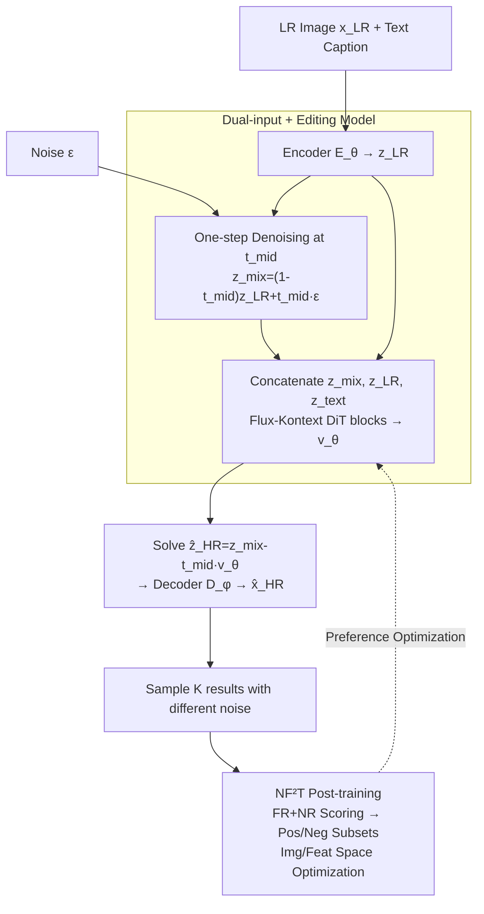

# DNF-SR: Dual-Input and Negative-Aware Feature Fine-Tuning for Real-World Image Super-Resolution

**Conference**: CVPR 2026  
**Paper**: [CVF Open Access](https://openaccess.thecvf.com/content/CVPR2026/html/Han_DNF-SR_Dual-Input_and_Negative-Aware_Feature_Fine-Tuning_for_Real-World_Image_Super-Resolution_CVPR_2026_paper.html)  
**Code**: https://github.com/SHH-Han/DNF-SR  
**Area**: Image Restoration / Real-World Image Super-Resolution / Diffusion Models  
**Keywords**: One-step Diffusion SR, Dual-input, Image Editing Model, Preference Alignment, Negative-aware Fine-tuning  

## TL;DR
DNF-SR feeds "noisy LR + original LR" dual-paths into an image editing diffusion model (Flux-Kontext) for one-step super-resolution at an intermediate timestep. It further employs Negative-aware Feature Fine-Tuning (NF²T), which moves preference optimization from the latent space to the image/feature space, achieving state-of-the-art results in no-reference metrics across four real-world SR benchmarks.

## Background & Motivation
**Background**: Diffusion priors have brought significant perceptual quality improvements to Real-World Image Super-Resolution (Real-ISR), but multi-step denoising is slow. To increase speed, recent works have shifted toward "one-step" diffusion SR, primarily following two routes: (a) injecting LR into a text-to-image model via ControlNet and distilling the multi-step network into a "noise → HR" one-step mapping (e.g., SinSR, AddSR-1s); (b) directly using LR latent as input at a specific diffusion timestep and fine-tuning with LoRA for one-step SR (e.g., OSEDiff, TSDSR, FluxSR, OMGSR).

**Limitations of Prior Work**: Route (a) increases parameter counts due to ControlNet, and the ceiling of "one-step reconstruction from pure noise" is limited. Route (b) replaces the original diffusion input with LR latent, leading to a significant distribution gap that hinders performance. OMGSR and TADSR attempt to mitigate this by injecting LR at an "intermediate timestep," but regardless of the chosen $t$, the LR latent remains inconsistent with the original $z_t$ in high-frequency components.

**Key Challenge**: The most direct way to reduce the distribution gap is adding noise to the LR, but noise destroys the original LR content (details are masked). This creates a dilemma between "reducing input distribution gap" and "preserving LR content fidelity."

**Key Insight**: From a frequency perspective, the LR latent most closely resembles the natural image latent $z_0$ at $t=0$ (since LR has fewer high frequencies than HR), rather than an arbitrary intermediate step; however, at $t=0$, the solution $\hat z_{HR}=z_{LR}-t v_\theta$ degrades and becomes unoptimizable. Therefore, one must both add noise to the LR to approximate the original input distribution and retain the "clean original LR" as an additional condition—a task at which image editing models (using a reference image as a condition) excel.

**Core Idea**: Feed "noisy LR + original LR" dual-inputs into an image editing diffusion model for one-step SR. Subsequently, use Negative-aware Feature Fine-Tuning (NF²T), which leverages multiple sampling results and moves optimization to the image/feature space, to further enhance quality.

## Method

### Overall Architecture
DNF-SR comprises two stages: **(1) Model Architecture (SFT Stage)**—Using Flux-Kontext as the pretrained backbone, noisy LR and original LR are concatenated dual-paths to perform one-step denoising at a fixed intermediate timestep $t_{mid}$ to obtain HR. **(2) Post-training (NF²T)**—Multiple results are sampled for the same LR using different noise, scores from FR+NR metrics are aggregated into a reward to partition positive/negative subsets, and positive/negative optimization directions are constructed in image and feature spaces to push the model toward higher quality.

SFT Forward: LR image $x_{LR}$ is encoded by fine-tuned Encoder $E_\theta$ to get $z_{LR}$; it is weighted with noise $\epsilon$ at $t_{mid}$ to get $z_{mix}=(1-t_{mid})z_{LR}+t_{mid}\epsilon$; $z_{mix}$, $z_{LR}$ are patched and concatenated with text tokens $z_{text}$ along the token dimension, then passed through MM-DiT and Single-DiT blocks; the output at the $z_{mix}$ position is taken as the predicted velocity $v_\theta$, and the HR latent is solved via $\hat z_{HR}=z_{mix}-t_{mid}v_\theta$, then decoded by fixed Decoder $D_\phi$ to get $\hat x_{HR}$.

### Key Designs

**1. Dual-input + Image Editing Backbone: Closing Distribution Gap While Preserving Content**

To address the dilemma where adding noise reduces the distribution gap but destroys LR content, DNF-SR no longer uses LR latent to replace the diffusion input in a single path. Instead, it uses dual-paths: one for noisy $z_{mix}$ to pull the input distribution back to what the diffusion model is familiar with (activating generative priors), and another for clean $z_{LR}$ as a condition to ensure fidelity. Both paths, along with text tokens, are concatenated along the token dimension and fed into DiT blocks, allowing self-attention to fuse "which line to trust." Crucially, the **image editing model Flux-Kontext** is used as the backbone instead of text-to-image Flux; editing models are inherently designed to "modify an image based on a reference," thus utilizing the original LR condition more effectively. Ablation shows that $(z_{mix},z_{LR})$ dual-input reduces LPIPS from 0.3349/0.3040 to 0.2925 compared to single-input, and switching the backbone to Flux-Kontext increases MANIQA from 0.6718 to 0.6903.

**2. One-step Denoising at Intermediate Timestep: Balancing Structure and Texture**

Diffusion models focus on different frequency bands at different timesteps: large $t$ favors low-frequency generation (overall structure), while small $t$ favors high-frequency generation (detailed texture). If starting from pure noise $\epsilon$ ($t=1$) like traditional one-step methods, the model must reconstruct structure from scratch, leading to poor fidelity. If $t=0$, the formulation $\hat z_{HR}=z_{LR}-t v_\theta$ degrades as $t \to 0$. DNF-SR chooses a fixed intermediate step $t_{mid}$ as the timestep for input latent $z_{mix}$, allowing the model to recover both structure and details. Ablations show $t=0.5$ provides the best balance between fidelity (LPIPS 0.2925) and quality (MANIQA 0.6903, QALIGN 3.9162), outperforming $t=1$ (pure noise) and $t=0.25/0.75$.

**3. NF²T: Moving Negative-aware Optimization from Latent to Image/Feature Space**

Since noisy inputs allow the one-step model to sample diverse results, the authors adopt the preference alignment paradigm from DiffusionNFT for post-training: $K$ images are sampled for the same LR using different noise, and rewards $r$ implicitly divide them into positive/negative directions. Defining the implicit positive policy $v_\theta^+=v_\theta$ and negative policy $v_\theta^-=2v^{old}-v_\theta$, the standard NFT objective for one-step SR is:

$$\mathcal{L}_{NFT}=\mathbb{E}\big[\,r\,\|v_\theta^+(z_{mix},z_{LR})-v\|^2+(1-r)\,\|v_\theta^-(z_{mix},z_{LR})-v\|^2\,\big].$$

The authors discovered that direct implicit optimization in **latent/velocity space** introduces noticeable grid artifacts in the reconstructed images. The key correction in NF²T is mapping the optimization back to **image space**: using $f(v)=D_\phi(z_{mix}-t_{mid}v)$ to decode $v_\theta^+,v_\theta^-,v$ into $\hat x_\theta^+,\hat x_\theta^-,\hat x_{HR}$, and reusing the reconstruction loss $\mathcal{L}_{Rec}$ from the SFT stage to construct positive/negative targets. The final objective is:

$$\mathcal{L}_{NF^2T}=\mathbb{E}\big[\,r\,\mathcal{L}_{Rec}(\hat x_\theta^+,\hat x_{HR})+(1-r)\,\mathcal{L}_{Rec}(\hat x_\theta^-,\hat x_{HR})\,\big].$$

Rewards $r$ are aggregated from multiple IQA metrics: LPIPS, DISTS (FR) and CLIPIQA, MUSIQ, MANIQA (NR). Each indicator's raw score $r_i^{raw}$ is standardized within the batch to $r_i^{std}$, mapped to $[0,1]$ via a standard Gaussian CDF $r_i=\Phi(r_i^{std})$, and then averaged. Unlike PPO/GRPO-style reinforcement learning requiring explicit probability modeling, NF²T directly optimizes the predicted velocity of flow matching, naturally fitting one-step SR. Compared to Diffusion-DPO which only uses pairwise data, it utilizes ranking information from multiple samples, increasing data efficiency.

### Loss & Training
The SFT stage uses three loss categories: $\mathcal{L}_z=\mathcal{L}_{MSE}(z_{LR},z_{HR})$ to align encoded LR latent with HR latent; $\mathcal{L}_{Rec}=\mathcal{L}_{MSE}(\hat x_{HR},x_{HR})+\mathcal{L}_{DISTS}(\hat x_{HR},x_{HR})$ for pixel and perceptual reconstruction; $\mathcal{L}_{GAN}$ using DINOv3 as the discriminator. Total loss $\mathcal{L}_{sft}=\lambda_1\mathcal{L}_z+\lambda_2\mathcal{L}_{MSE}+\lambda_3\mathcal{L}_{DISTS}+\lambda_4\mathcal{L}_{GAN}$, with weights $\lambda_1=5,\lambda_2=2,\lambda_3=5, \lambda_4=0.5$ following OMGSR. The backbone is FLUX.1-Kontext-dev. In the SFT stage, VAE Encoder and DiT blocks are fine-tuned with LoRA (rank 64) while the Decoder is fixed. In post-training, only DiT blocks are fine-tuned with 8 samples per step. Optimization uses AdamW, lr 2e-5, batch size 1, 5000 steps on 8×H20 GPUs; captions are generated by Qwen3-VL(8B).

## Key Experimental Results

### Main Results
DNF-SR is compared against multi-step methods (DiffBIR/SeeSR/DiT4SR) and one-step methods (S3Diff/PisaSR/SinSR-1s/OSEDiff/TSDSR/HYPIR/OMGSR) across RealSR, DrealSR, DIV2K-Val, and RealLQ250. The table below compares against the Prev. SOTA (OMGSR) on RealSR; DNF-SR(sft) is SFT-only, and DNF-SR is the full model:

| Method | PSNR↑ | LPIPS↓ | CLIPIQA↑ | MUSIQ↑ | MANIQA↑ | QALIGN↑ |
|------|-------|--------|----------|--------|---------|---------|
| TSDSR | 23.404 | 0.2805 | 0.7196 | 70.766 | 0.6312 | 3.7754 |
| HYPIR | 22.785 | 0.3107 | 0.6491 | 66.559 | 0.6558 | 3.6931 |
| OMGSR (Prev. SOTA) | **25.882** | **0.2779** | 0.6682 | 69.527 | 0.6695 | 3.8507 |
| DNF-SR(sft) | 25.628 | 0.2925 | 0.6903 | 70.672 | 0.6856 | 3.9162 |
| **DNF-SR (Ours)** | 24.970 | 0.3239 | **0.7257** | **72.040** | **0.6930** | **4.0718** |

DNF-SR leads across all no-reference metrics. Notably, QALIGN and VQ-R1—**metrics not included in reward calculation**—also achieved the highest scores, suggesting the improvements are genuine rather than "reward hacking."

### Ablation Study

**Model Architecture Ablation (RealSR, Input × Timestep):**

| Input | Timestep | LPIPS↓ | MUSIQ↑ | MANIQA↑ | QALIGN↑ | Description |
|------|--------|--------|--------|---------|---------|------|
| $z_{mix}^*$ only | 0.5 | 0.3349 | 69.838 | 0.6729 | 3.9363 | Noisy LR, Flux backbone |
| $z_{LR}^*$ only | 0.5 | 0.3040 | 70.441 | 0.6808 | 3.8771 | Original LR, Flux backbone |
| $(z_{mix},z_{LR})^*$ | 0.5 | 0.2995 | 71.116 | 0.6718 | 3.9057 | Dual-input, Flux backbone |
| $(z_{mix},z_{LR})$ | 0.5 | **0.2925** | 70.672 | **0.6903** | 3.9162 | Dual-input + Flux-Kontext |
| $(\epsilon,z_{LR})$ | 1.0 | 0.3025 | 70.333 | 0.6853 | 3.8574 | Pure noise input |
| $(z_{mix},z_{LR})$ | 0.25 | 0.2945 | 70.493 | 0.6870 | 3.8688 | High-freq bias |
| $(z_{mix},z_{LR})$ | 0.75 | 0.2960 | 70.526 | 0.6790 | 3.9304 | Low-freq bias |

($^*$ denotes text-to-image Flux backbone, others use Flux-Kontext.)

**NF²T Post-training Ablation (RealSR):**

| Setting | Reward | LPIPS↓ | MUSIQ↑ | MANIQA↑ | QALIGN↑ |
|------|--------|--------|--------|---------|---------|
| SFT only | — | 0.2925 | 70.672 | 0.6903 | 3.9162 |
| NFT (latent space) | NR+FR | 0.3250 | 71.168 | 0.6413 | 3.943 |
| NF²T | FR | 0.3255 | 71.091 | 0.6925 | 3.9979 |
| **NF²T** | NR+FR | 0.3239 | **72.040** | **0.6930** | **4.0718** |

### Key Findings
- **Dual-input is the structural contributor**: Removing either path or reverting to a text-to-image backbone causes LPIPS and perceptual metrics to regress, proving that "noisy LR for distribution matching + original LR for content preservation" is an essential pair.
- **Optimization space matters more than target**: Negative-aware optimization in the latent space (NFT) causes grid artifacts and decreases MANIQA to 0.6413. Moving it to image/feature space (NF²T) raises both MANIQA and QALIGN.
- **LPIPS increase requires nuanced interpretation**: LPIPS rose from 0.2925 to 0.3239 after NF²T. The authors explain that the HR ground truth is somewhat blurry; a clearer output naturally lowers reference-based LPIPS. The simultaneous rise in no-reference metrics confirms actual quality improvement.
- **Adding FR metrics to reward stabilizes fidelity**: Comparing NF²T with NR-only vs. NR+FR, the latter further raises NR metrics without sacrificing FR, leading to more natural results.

## Highlights & Insights
- **Dual-input splits the noise dilemma**: By using two paths—one for distribution matching via noise and one for fidelity via original LR—the model's self-attention fuses them elegantly. This "activation of priors via noise vs. preservation of content via condition" split is transferable to other restoration tasks.
- **Diagnosis and cure for latent-space preference artifacts**: Applying DiffusionNFT directly to SR results in grid artifacts. Mapping optimization back to the image space via $f(v)$ is a specific, reproducible engineering insight.
- **Validation via non-reward metrics**: Using strong metrics like QALIGN/VQ-R1 that were not part of the reward set to demonstrate superiority is a robust way to avoid "reward hacking" concerns.

## Limitations & Future Work
- **Dependency on external captions and multiple IQA rewards**: Each image requires Qwen3-VL captions, and post-training runs 5 IQA models per step, incurring high overhead. Optimization is susceptible to biases in the IQA metrics themselves.
- **LPIPS regression remains unresolved**: The full model is inferior to OMGSR/TSDSR in reference-based fidelity. While the authors attribute this to blurry GT, it suggests the method may not be optimal for scenarios requiring strict pixel-wise fidelity to a high-quality GT.
- **Fixed $t_{mid}=0.5$**: The timestep is a manually tuned global constant. It does not adapt to different LR degradation levels, representing a direct opportunity for improvement.

## Related Work & Insights
- **vs. OMGSR / TADSR (Route b, intermediate injection)**: These methods still use a single LR latent path to replace input at intermediate steps, reducing but not eliminating the distribution gap. DNF-SR's dual-path + editing backbone closes the gap while preserving fidelity.
- **vs. OSEDiff / TSDSR (One-step + Distillation/LoRA)**: These rely on score distillation to align one-step outputs. DNF-SR adds preference post-training (NF²T) using multi-sampling ranking signals to further enhance quality.
- **vs. DiffusionNFT (Paradigm Source)**: DNF-SR adopts the positive/negative implicit strategy framework but corrects the latent-space artifact issue by moving to the image/feature space.
- **vs. Diffusion-DPO (Pairwise Preference)**: DPO uses pairwise data, which is expensive and discards ranking information. NF²T utilizes all results from a single multi-sampling step, making it more efficient and compatible with one-step settings.

## Rating
- Novelty: ⭐⭐⭐⭐ The combination of dual-input + editing backbone and the move out of latent space for optimization are targeted innovations, though components are clever assemblies of existing paradigms.
- Experimental Thoroughness: ⭐⭐⭐⭐⭐ Comprehensive evaluation across four benchmarks with both structural and post-training ablations, plus validation via non-reward metrics.
- Writing Quality: ⭐⭐⭐⭐ Clear motivation (frequency-perspective explanation for timestep selection) and well-coordinated formulas/figures.
- Value: ⭐⭐⭐⭐ A strong practical baseline for one-step Real-ISR; the "optimization space shift" insight is valuable for the preference alignment community.

<!-- RELATED:START -->

## Related Papers

- [\[CVPR 2026\] Time-Aware One Step Diffusion Network for Real-World Image Super-Resolution](time-aware_one_step_diffusion_network_for_real-world_image_super-resolution.md)
- [\[CVPR 2026\] FinPercep-RM: A Fine-grained Reward Model and Co-evolutionary Curriculum for RL-based Real-world Super-Resolution](finpercep_rm_a_fine_grained_reward_model_and_co_evolutionary_curriculum_for_rl_ba.md)
- [\[CVPR 2026\] IAFMNet: Information-Aware Feature Modulation for Efficient Super-Resolution](iafmnet_information-aware_feature_modulation_for_efficient_super-resolution.md)
- [\[CVPR 2026\] One-Step Diffusion Transformer for Controllable Real-World Image Super-Resolution](one-step_diffusion_transformer_for_controllable_real-world_image_super-resolutio.md)
- [\[CVPR 2026\] Toward Real-world Infrared Image Super-Resolution: A Unified Autoregressive Framework and Benchmark Dataset](real_iisr_infrared_image_super_resolution_autoregressive.md)

<!-- RELATED:END -->
