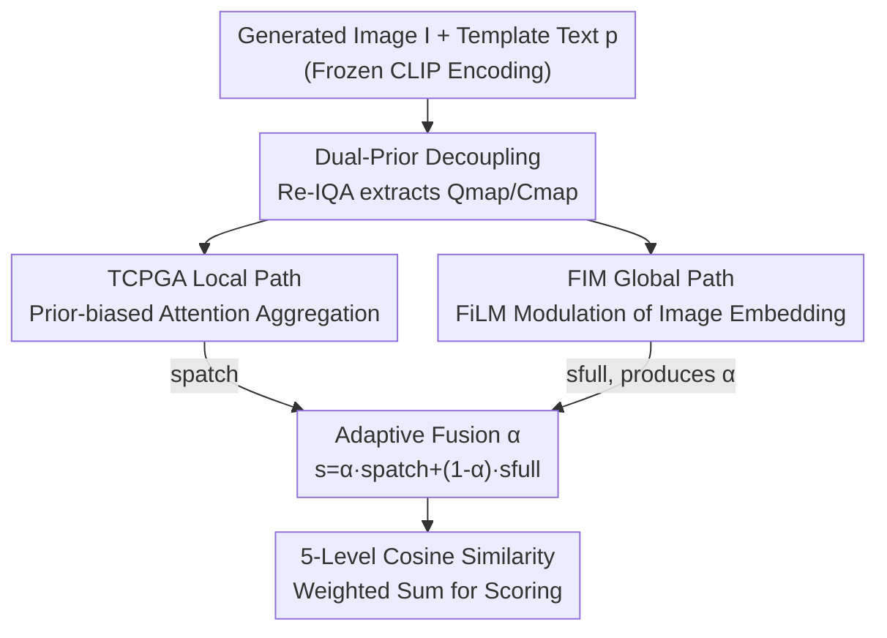

# DPGF-Net: Dual-Prior Guided Fusion Network for Joint Assessment of Perceptual Quality and Semantic Consistency in AI-Generated Images

**Conference**: CVPR 2026  
**Paper**: [CVF Open Access](https://openaccess.thecvf.com/content/CVPR2026/html/Li_DPGF-Net_Dual-Prior_Guided_Fusion_Network_for_Joint_Assessment_of_Perceptual_CVPR_2026_paper.html)  
**Code**: https://github.com/leeto221/AGIQA (Available)  
**Area**: Image Quality Assessment / Multimodal VLM  
**Keywords**: AI-Generated Image Quality Assessment, AGIQA, Dual-prior Decoupling, Cross-modal Fusion, CLIP  

## TL;DR
DPGF-Net utilizes the dual encoders of Re-IQA to extract a "distortion prior Qmap" and a "content prior Cmap" to decouple rendering distortions from semantic content. Combined with a single text template and a dual-path adaptive fusion of "local TCPGA + global FIM," the model assesses both "perceptual quality" and "text-image alignment" within a unified CLIP framework, achieving 11 first-place results across 12 metrics on three AGIQA datasets and cross-dataset benchmarks.

## Background & Motivation
**Background**: As text-to-image generation becomes increasingly prevalent, generated images may suffer from poor perceptual quality (e.g., blurriness or unnatural rendering) and weak semantic alignment (e.g., failure to follow the prompt). AI-generated image quality assessment (AGIQA) aims to automatically score these two dimensions to provide feedback for generative models. Current mainstream approaches are CLIP-based (e.g., IP-IQA, IPCE), utilizing text prompts to align image representations.

**Limitations of Prior Work**: The authors identify two primary limitations in existing methods. First, traditional natural image IQA (e.g., DBCNN, HyperIQA, TReS) focuses solely on common distortions like compression or noise and ignores text, often underperforming compared to simple CLIP-based methods on AGI-specific distortions. Second, existing CLIP-based methods exhibit poor cross-dataset generalization due to: (a) evaluating quality and alignment **separately** using raw or fine-grained text without modeling their **interaction**; and (b) inability of template-based methods to **distinguish task-specific objectives** for the two dimensions—empirically, high-quality images may have poor alignment (Figure 1(b)), causing objective conflicts.

**Key Challenge**: Perceptual quality stems from "distortion cues," while semantic alignment stems from "content cues." In AI-generated images, these cues are **tightly coupled yet target-opposing**. Existing methods either ignore image-side information or conflate the two dimensions, failing to distinguish whether a low score is due to rendering failures or misalignment with the prompt.

**Goal**: To build a unified framework that models both perceptual quality and semantic alignment while characterizing their interaction. Specific objectives include: (1) decoupling distortion and content on the image side; (2) incorporating both local and global representations in cross-modal scoring; and (3) adaptively balancing their contributions based on task and content.

**Key Insight**: Since distortion and content are distinct types of cues, the framework introduces two complementary image-side priors (distortion prior and content prior) to explicitly separate them. A text template is then employed to simulate the influence of one dimension on the other during assessment.

**Core Idea**: Replacing single-branch text scoring with a "dual image prior decoupling + text template interaction + local-global dual-path adaptive fusion" approach allows a single CLIP-based framework to jointly predict both scores.

## Method

### Overall Architecture
DPGF-Net learns a task-conditional scoring function $f_\theta(I,p,\tau)$: given a generated image $I$, a text prompt $p$, and an assessment dimension $\tau\in\{\text{qual},\text{align}\}$, it outputs a score consistent with human subjective ratings. The pipeline follows a **dual-path fusion** design: images are encoded into patch-level local features and global features, while text templates are encoded into multi-level semantic embeddings. Simultaneously, a frozen Re-IQA dual encoder extracts a distortion prior (Qmap) and a content prior (Cmap). In the local path, TCPGA performs weighted patch aggregation guided by both text and priors. In the global path, FIM modulates the image embedding using the priors. Both paths are adaptively fused via a learnable coefficient $\alpha$. Finally, the fused visual representation and text embeddings are used to compute cosine similarity, followed by a weighted sum over five quality levels via softmax to obtain a continuous score. CLIP remains frozen throughout, with Qmap used for quality and Cmap for alignment.

### Key Designs

**1. Dual-Prior Decoupling: Separating Rendering Distortion and Content**

To address the limitation where methods ignore image-side information and confuse distortion with content, DPGF-Net introduces two complementary priors. It leverages the dual-encoder structure of Re-IQA to extract distortion-aware and content-aware features: $Q_{map}=f_q(I)$ and $C_{map}=f_c(I)$, where $f_q$ is the quality-aware encoder and $f_c$ is the content-aware encoder. These **partially decoupled** features serve as priors providing complementary perceptual and semantic cues. Crucially, the model switches priors based on the task: Qmap for perceptual quality (focusing on distortion-sensitive areas) and Cmap for alignment (focusing on semantic-relevant areas). This enables the network to serve two goals while enhancing sensitivity to visual degradation and suppressing irrelevant semantics.

**2. Single-Template Text Guidance: Modeling Interaction via Quality Adverbs**

To address the failure to model the interaction between quality and alignment, the authors adopt a single prompt template (following Peng et al., IPCE) that binds content descriptions with quality grades: `"A photo where {adv} matches 'prompt.'"` where `{adv}` ranges across badly, poorly, fairly, well, and perfectly. This single sentence encodes both "whether the content matches" and "how well it matches," naturally incorporating the influence of one dimension on the other. The frozen vision-language model produces multi-level text embeddings $T(p)\in\mathbb{R}^{K\times d}$ across five quality grades, serving as shared anchors for both local and global paths.

**3. TCPGA Local Path: Injecting Spatial Priors into Attention Logits**

To prevent attention dispersion in local perception, the Text-Conditional Prior-Guided Aggregation (TCPGA) performs anchor-to-patch attention between patch embeddings $E_p\in\mathbb{R}^{N_p\times d}$ and text anchors $T(p)\in\mathbb{R}^{K\times d}$. A learnable gate converts spatial prior maps into saliency priors: $P_i=\sigma(\lambda_q q_i+\lambda_0)$ (where $q_i$ is derived from Qmap for quality tasks and Cmap for alignment). The log-prior $\log P_i$ is then **directly added as a bias to the attention logits**:

$$A_{k,i}=\frac{\exp\!\big(Q_k^\top K_i/\sqrt{d'}+\log P_i\big)}{\sum_{j=1}^{N_p}\exp\!\big(Q_k^\top K_j/\sqrt{d'}+\log P_j\big)}$$

The aggregated features $F_k=\sum_i A_{k,i}V_i$ form $F_{loc}\in\mathbb{R}^{K\times d'}$, which are projected back to the CLIP embedding space. Injecting priors at the **feature matching stage** rather than the readout stage allows "bottom-up distortion sensitivity" and "top-down semantic guidance" to fuse during attention calculation, making patch importance interpretable.

**4. FIM Global Modulation + Adaptive Fusion: Dynamic Balancing via FiLM**

To address the instability of single-path local predictions, the Full-image Modulation (FIM) path applies FiLM modulation to the frozen CLIP global embedding $z_{full}$. It uses task-specific global priors $S_\tau(I)\in\mathbb{R}^{2048}$ through lightweight MLPs to generate modulation parameters $\gamma, \beta$ and the fusion coefficient $\alpha$: $\tilde z_{full}=\dfrac{z_{full}\odot\gamma+\beta}{\|z_{full}\odot\gamma+\beta\|_2+\varepsilon}$. The final score is an adaptive fusion: $s=\alpha\,s_{patch}+(1-\alpha)\,s_{full}$. The model dynamically decides the reliance on local distortion versus global semantics via $\alpha$, balancing perceptual sensitivity and semantic consistency while suppressing extreme prediction errors.

### Loss & Training
The training objective is the Mean Absolute Error (MAE) between the predicted score and the ground truth. The backbone uses a frozen CLIP ViT-B/32, trained for 25 epochs using AdamW. Learning rates are $5\times10^{-5}$ for TCPGA/FIM and $1\times10^{-5}$ for PriorGate, with a global gradient clip of 0.5. Inputs are 224×224 normalized per CLIP standards, sampling 12 patches per image with a batch size of 64 on an RTX 4090.

## Key Experimental Results

### Main Results
Evaluated on three AGIQA datasets (AGIQA-3K, AIGCIQA2023, PKU-I2IQA) using PLCC and SRCC. DPGF-Net achieved the best performance in 11 out of 12 metrics. Selected results (SRCC/PLCC):

| Dataset · Dimension | Metric | DPGF-Net | IPCE | QMI-Net | MANIQA |
|------|------|------|------|------|------|
| AGIQA-3K · Quality | SRCC | **0.9010** | 0.8810 | 0.8703 | 0.8723 |
| AGIQA-3K · Quality | PLCC | **0.9292** | 0.9214 | 0.9128 | 0.9098 |
| AGIQA-3K · Align | SRCC | **0.8013** | 0.7697 | 0.7821 | 0.7603 |
| AIGCIQA2023 · Quality | SRCC | **0.8806** | 0.8640 | 0.8561 | 0.8566 |
| AIGCIQA2023 · Align | SRCC | **0.8278** | 0.7979 | 0.8082 | 0.7647 |
| PKU-I2IQA · Align | SRCC | **0.8119** | 0.7700 | 0.7939 | 0.7024 |

Cross-dataset generalization (Table 2, average over pairwise migrations):

| Setup | Dimension | Metric | DPGF-Net | IPCE | MANIQA |
|------|------|------|------|------|------|
| Average | Quality | PLCC | **0.8038** | 0.7583 | 0.7440 |
| Average | Quality | SRCC | **0.7694** | 0.7415 | 0.7234 |
| Average | Align | PLCC | **0.6736** | 0.6641 | 0.5758 |
| Average | Align | SRCC | 0.6387 | **0.6317** | 0.5639 |

> ⚠️ For cross-dataset "Alignment SRCC," DPGF-Net (0.6387) slightly outperformed IPCE (0.6317), though other metrics show a more significant lead.

### Ablation Study
Ablation on AIGCIQA2023 (PLCC/SRCC):

| Config | Quality SRCC | Align SRCC | Description |
|------|---------|---------|------|
| w/o TCPGA, FIM | 0.8647 | 0.7964 | Base template only |
| w/o TCPGA | 0.8773 | 0.8015 | Remove local path |
| w/o FIM | 0.8744 | 0.8067 | Remove global path |
| Full Model | **0.8806** | **0.8278** | TCPGA + FIM |

Patch number analysis: Average scores for Patch=4/6/8/10/12/14 were 0.8490/0.8511/0.8523/0.8503/**0.8544**/0.8510. 12 patches proved optimal; too few lose global semantics, while too many introduce noise.

### Key Findings
- **Synergistic Modules**: Individually removing TCPGA or FIM leads to minor degradation, but removing both significantly impacts alignment (SRCC 0.8278→0.7964), confirming that decoupling and dual-path fusion are interdependent.
- **Alignment Gains**: The alignment dimension benefits more from the interaction modeling than the quality dimension.
- **$\alpha$ for Stability**: Visualizations show that the adaptive coefficient $\alpha$ suppresses prediction errors by balancing local distortion sensitivity with global semantic consistency.

## Highlights & Insights
- **Matching-Phase Prior Injection**: TCPGA injects $\log P_i$ into the attention logits, allowing the prior to influence feature matching directly. This is more interpretable and effective than late-stage weighting.
- **Efficient Prior Decoupling**: Instead of training from scratch, the model reuses Re-IQA encoders as frozen priors to explicitly separate "rendering distortion" from "semantic content."
- **Dual-Task Versatility**: The network serves two objectives by simply switching priors (Qmap vs. Cmap) while sharing weights.
- **Interaction via Templates**: Using a single template with quality adverbs effectively captures the "content-distortion interaction" within the text semantics.

## Limitations & Future Work
- The current method is a quasi-unified framework that switches priors per task; future work aims for true **joint prediction** to better capture inherent coupling.
- ⚠️ The decoupling depends on pre-trained Re-IQA encoders; if Re-IQA fails on specific AGI distortions, the prior quality and subsequent performance may suffer.
- Cross-dataset "alignment" improvements are relatively modest, suggesting room for better generalization in semantic consistency.
- Evaluation was limited to three datasets and a CLIP ViT-B/32 backbone; performance on newer generative model distributions remains to be verified.

## Related Work & Insights
- **vs. NR-IQA (DBCNN, HyperIQA, TReS, MANIQA)**: These models lack text awareness and perform poorly on AGI. DPGF-Net outperforms them by incorporating text templates and image-side priors for alignment.
- **vs. IPCE (Template Method)**: While IPCE uses templates, it does not decouple image-side features or distinguish task roles. DPGF-Net significantly improves upon IPCE by introducing Qmap/Cmap decoupling and the TCPGA/FIM dual-path design.
- **vs. Re-IQA**: While DPGF-Net reuses Re-IQA encoders, Re-IQA itself performs poorly on AGIQA benchmarks (e.g., cross-set Quality PLCC 0.5030), highlighting the value of the "prior-guided cross-modal fusion" architecture.

## Rating
- Novelty: ⭐⭐⭐⭐ The combination of dual-prior decoupling and attention-logit bias is innovative, though components like Re-IQA and FiLM are established.
- Experimental Thoroughness: ⭐⭐⭐⭐ Extensive testing across datasets with cross-dataset and ablation analyses, though backbone scaling is missing.
- Writing Quality: ⭐⭐⭐⭐ Clear motivation and complete formulations; however, some module diagrams are quite dense.
- Value: ⭐⭐⭐⭐ Highly practical for the text-to-image feedback loop with open-source potential.

<!-- RELATED:START -->

## Related Papers

- [\[CVPR 2026\] A Difference-in-Difference Approach to Detecting AI-Generated Images](a_difference-in-difference_approach_to_detecting_ai-generated_images.md)
- [\[CVPR 2026\] Rethinking Knowledge Transfer in Image Quality Assessment: A Perceptual Preference Structure Alignment Perspective](rethinking_knowledge_transfer_in_image_quality_assessment_a_perceptual_preferenc.md)
- [\[CVPR 2026\] A Debiased Reconstruction-based Framework for Training-Free Detection of AI-Generated Images](a_debiased_reconstruction-based_framework_for_training-free_detection_of_ai-gene.md)
- [\[CVPR 2026\] ArtiMuse: Fine-Grained Image Aesthetics Assessment with Joint Scoring and Expert-Level Understanding](artimuse_fine-grained_image_aesthetics_assessment_with_joint_scoring_and_expert-.md)
- [\[CVPR 2026\] DF²-VB: Dual-level Fuzzy Fusion with View-specific Boosting for Multi-view Multi-label Classification](df2-vb_dual-level_fuzzy_fusion_with_view-specific_boosting_for_multi-view_multi-.md)

<!-- RELATED:END -->
