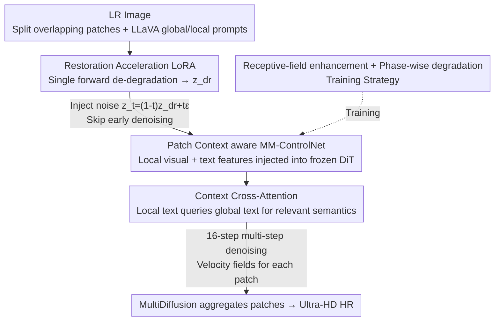

# DreamSR: Towards Ultra-High-Resolution Image Super-Resolution via a Receptive-Field Enhanced Diffusion Transformer

**Conference**: CVPR 2026  
**Paper**: [CVF Open Access](https://openaccess.thecvf.com/content/CVPR2026/html/Dong_DreamSR_Towards_Ultra-High-Resolution_Image_Super-Resolution_via_a_Receptive-Field_Enhanced_Diffusion_CVPR_2026_paper.html)  
**Code**: https://github.com/jerrydong0219/DreamSR  
**Area**: Image Restoration / Diffusion Models  
**Keywords**: Real-world Super-Resolution, Ultra-High-Definition (4K), Diffusion Transformer, ControlNet, Patch-wise Inference  

## TL;DR
DreamSR utilizes a dual-branch "global + local" MM-ControlNet to inject patch-level text prompts into a FLUX-based (DiT) super-resolution model. Combined with a one-step restoration LoRA and receptive-field enhanced training, it specifically addresses the "over-generation caused by local patch and global prompt semantic mismatch" during patch-wise inference for ultra-high-definition ($\ge$ 4K) images, achieving SOTA on no-reference metrics across multiple real-world datasets.

## Background & Motivation
**Background**: Real-world Image Super-Resolution (Real-ISR) has shifted from GANs to leveraging large-scale pre-trained T2I diffusion priors to generate realistic details through text guidance. For ultra-high-definition ($\ge$ 4K) images, **patch-wise inference** is mandatory due to memory constraints—splitting large images into patches for individual SR and aggregating results using methods like MultiDiffusion.

**Limitations of Prior Work**: Patch-wise inference faces two primary issues. First, **over-generation**: each patch contains only local, incomplete semantics, yet models often use a **global prompt** derived from the whole LR image. This mismatch leads the model to "hallucinate" incorrect objects/textures (e.g., distorted horns or buildings in Fig. 1) and creates inconsistencies between adjacent patches. Second, **under-generation**: using only local prompts results in thin semantic information that fails to activate the full generative capability of the pre-trained model, leading to blurry or smoothed textures.

**Key Challenge**: Global prompts activate generative priors but cause semantic mismatch; local prompts align semantically but fail to activate generative power—**it is difficult to achieve both simultaneously**. Furthermore, most methods over-emphasize global generation in network design and training, sacrificing fine-grained texture restoration within patches.

**Goal**: To **suppress over-generation** while **enhancing local detail synthesis** in patch-wise inference frameworks, ultimately achieving faithful and detailed results for ultra-HD scenarios.

**Key Insight**: The authors select FLUX.1-dev as the backbone (a unified MM-DiT architecture that avoids the split between base/refiner in SDXL). They observe that since both global and local prompts have strengths, **both should be used simultaneously**, allowing local text to "filter" the global semantics most relevant to the current patch via cross-attention.

**Core Idea**: A dual-branch MM-ControlNet is used to concurrently inject "local patch visual+text features" and "global text features." This allows global and local semantics to fuse and align within cross-attention layers, fundamentally eliminating semantic mismatches in patch-wise inference.

## Method

### Overall Architecture
DreamSR is built upon a frozen FLUX.1-dev DiT with two trainable components: the **Patch Context aware MM-ControlNet** (dual-branch, for local info injection) and the **Restoration Acceleration LoRA** (one-step degradation removal). The reconstruction is split into two sequential stages: the **degradation removal stage**, which uses the LoRA in a single forward pass to remove LR degradation and pull the latent distribution closer to natural images; and the **texture generation stage**, which performs multi-step denoising refinement of high-frequency textures starting from the de-degraded intermediate state. During inference, the image is split into overlapping patches. LLaVA generates a global prompt for the whole image and local prompts for each patch. Each patch is denoised in parallel and aggregated via MultiDiffusion. The total inference follows a **1+16** step scheme (1 step for restoration + 16 steps for texture generation).

### Key Designs

**1. Patch Context aware MM-ControlNet: Aligning semantics with local text querying global text to suppress over-generation**

This is the core of the paper, directly addressing the "global prompt vs. local patch" mismatch. Its ControlNet $F_\theta$ is a **partial copy** of the FLUX DiT $\epsilon_\phi$ layers—retaining only MM-DiT blocks (text processing) and removing Single-DiT blocks. To balance performance and efficiency, only **half** of the MM-DiT blocks are copied, with intermediate features injected into corresponding layers of the main network. Unlike previous ControlNets that **only inject visual features**, DreamSR injects both visual and text features.

Specifically, for patch latent $z_{lq}^{ij}$, the ControlNet outputs image features $f_{c,img}^l$ and text features $f_{c,txt}^l$ ($l=1,...,9$). Image features are added back to the main network via a zero-initialized MLP:

$$f_{img}'^l = f_{img}^l + M^l(f_{c,img}^l)$$

Text features are fused via a **Context Cross-Attention module**: the main network's global text features act as the query $Q^l_{txt}=P_Q(f^l_{txt})$, while the ControlNet's local text features act as the key/value $K^l_{c,txt}=P_K(f^l_{c,txt})$ and $V^l_{c,txt}=P_V(f^l_{c,txt})$:

$$f_{txt}'^l = M^l_{txt}\big(\mathrm{CrossAttention}(Q^l_{txt}, K^l_{c,txt}, V^l_{c,txt})\big)$$

The key is that cross-attention allows each local patch to **dynamically select the most relevant semantic clues from the global prompt while suppressing irrelevant or redundant signals**. Consequently, the model retains the power of the global prompt to activate priors while "calibrating" generation with local semantics.

**2. Restoration Acceleration LoRA + Two-stage Inference: One-step degradation removal as a diffusion starting point**

To address the high computational cost of ultra-HD reconstruction, DreamSR integrates degradation removal. Most diffusion SR methods perform "de-degradation" and then **restart from pure noise**, wasting early steps. DreamSR uses a rank-256 LoRA in the first inference step. The LQ latent $z_{lq}$ is fed into the main network and ControlNet once to produce a de-degraded latent $z_{dr}$.

$z_{dr}$ is treated as an **intermediate state** of the diffusion process. By injecting controlled Gaussian noise:

$$z_t = (1-t)\,z_{dr} + t\cdot\epsilon$$

where $t=0.8$ is a preset interpolation step. Starting from this state, the model **skips redundant early denoising and focuses on high-frequency texture refinement**. This reduces inference to 1+16 steps while providing a cleaner, more semantically consistent starting point.

**3. Phase-wise Degradation + Receptive-Field Enhanced Training: Enabling local prompt comprehension**

To solve "under-generation of local details," two strategies are used:

First, **Phase-wise Degradation Pipeline**: The de-degradation stage uses standard pixel-level degradation (Real-ESRGAN). The texture generation stage uses an **image-to-image (i2i) degradation**—using a FLUX model to actively "erase" high-quality textures (downsampling HQ, VAE encoding to $z_{hq}$, adding noise with strength 0.3–0.5, and partially denoising with $P_{img}+P_{neg}$). Unlike Real-ESRGAN, i2i **selectively removes texture while preserving structure**, forcing the network to learn to generate high-frequency details based on text guidance under correct structures.

Second, **Receptive-Field Enhancement Training**: Prior methods often downsample 1K datasets or crop 768/1024 patches, making **local and global prompts too similar**. DreamSR crops **512×512 patches from native high-resolution (~2K) images**. This ensures the content of the small crop differs significantly from the whole image, making the local prompt truly "local," thereby aligning training/inference receptive fields.

### Loss & Training
Joint optimization of MM-ControlNet and LoRA. MM-ControlNet uses velocity field loss $L_v=\|v_p-v_{gt}\|_2^2$ ($v_{gt}=z_1-z_0$). For $t\in[0,0.2]$, a pixel-level loss $L_p$ and LPIPS are added for fidelity. LoRA (one-step) uses image-level supervision $L_{lora}$ including GAN loss. Training uses 16×H20, batch 64, AdamW (lr=5e-6): 20k steps for MM-ControlNet, followed by 100k steps of alternating multi-step texture and single-step de-degradation training.

## Key Experimental Results

### Main Results
×4 SR on 5 real-world datasets (RealSR, DRealSR, etc.). DreamSR leads in no-reference metrics (MUSIQ/MANIQA/CLIPIQA+), which are critical for diffusion SR quality. Reference metrics (PSNR/SSIM) are lower, which is expected for high-generative models.

| Dataset | Metric | DreamSR | DiT4SR | SeeSR | SUPIR |
|--------|------|---------|--------|-------|-------|
| RealSR | MUSIQ ↑ | **70.56** | 67.56 | 69.82 | 63.41 |
| RealSR | MANIQA ↑ | **0.5731** | 0.4540 | 0.5437 | 0.4472 |
| RealSR | CLIPIQA+ ↑ | **0.7318** | 0.6609 | 0.6912 | 0.5989 |
| RealLR200 | MANIQA ↑ | **0.5488** | 0.4650 | 0.4698 | 0.3979 |
| RealDeg(HD) | MANIQA ↑ | **0.4574** | 0.4437 | 0.4535 | 0.3613 |

**Inference Efficiency**: On 2560×1440 images (single H20), DreamSR (1+16 steps) takes **86s**, significantly faster than most SD/SDXL UNet-based or other DiT-SR methods.

### Ablation Study
Validated on the high-resolution RealDeg dataset.

| Configuration | MUSIQ ↑ | MANIQA ↑ | CLIPIQA+ ↑ | Note |
|------|---------|----------|-----------|------|
| Single-branch (Global prompt) | 41.68 | 0.3891 | 0.6251 | Over-generation |
| Single-branch (Local prompt) | 41.55 | 0.3932 | 0.6177 | Inconsistent textures |
| **Dual-branch (Full)** | **45.62** | **0.4574** | **0.6647** | Optimal interaction |
| w/o i2i degradation | 43.77 | 0.3917 | 0.6355 | Smoothed output |
| w/o LoRA (20/30 steps) | 38.34 | 0.3865 | 0.6042 | Worse quality despite more steps |

### Key Findings
- **Dual-branch is essential**: Global-only leads to over-generation; local-only leads to inconsistency. Cross-attention fusion boosts MUSIQ from 41.6 to 45.6.
- **i2i and RF training are complementary**: i2i forces texture generation, while RF training ensures the model actually follows local prompts.
- **LoRA improves quality, not just speed**: Without the one-step de-degradation, even adding more steps results in inferior quality, proving $z_{dr}$ provides a superior starting point.

## Highlights & Insights
- **Cross-attention fusion for Global/Local Prompts**: Instead of choosing one, using local text to query global text allows for adaptive semantic selection—a technique applicable to any patch-wise large image generation task.
- **De-degradation as intermediate state**: The $z_t$ construction is a clever engineering move to bridge "restoration" and "generation" seamlessly on the same trajectory.
- **Native HD cropping**: Recognizes that medium-res training causes models to ignore local prompts due to lack of diversity between patch and whole.

## Limitations & Future Work
- **Low fidelity (reference metrics)**: The model targets high generative quality, leading to lower PSNR/SSIM, which implies a risk of content deviation from reality. ⚠️
- **Prompt Dependency**: Heavily relies on LLaVA quality; prompt hallucinations could propagate to the output.
- **High Training Cost**: Based on FLUX DiT, requiring substantial GPU resources (16×H20).

## Related Work & Insights
- **vs DreamClear / DiT4SR**: These typically ignore text/patch alignment in ultra-HD. DreamSR's dual-branch text injection specially targets patch-wise semantic mismatch.
- **vs SUPIR / SeeSR**: While they use semantic cues, being based on SD/SDXL UNet often leads to over-generation during patch inference. DreamSR's DiT backbone and local-alignment fusion are more robust.
- **vs MultiDiffusion**: DreamSR adopts its aggregation approach but solves the internal patch semantic mismatch problem first.

## Rating
- Novelty: ⭐⭐⭐⭐ 
- Experimental Thoroughness: ⭐⭐⭐⭐ 
- Writing Quality: ⭐⭐⭐⭐ 
- Value: ⭐⭐⭐⭐ 

<!-- RELATED:START -->

## Related Papers

- [\[CVPR 2026\] One-Step Diffusion Transformer for Controllable Real-World Image Super-Resolution](one-step_diffusion_transformer_for_controllable_real-world_image_super-resolutio.md)
- [\[CVPR 2026\] HDW-SR: High-Frequency Guided Diffusion Model based on Wavelet Decomposition for Image Super-Resolution](hdw-sr_high-frequency_guided_diffusion_model_based_on_wavelet_decomposition_for_.md)
- [\[CVPR 2026\] UCAN: Unified Convolutional Attention Network for Expansive Receptive Fields in Lightweight Super-Resolution](ucan_unified_convolutional_attention_lightweight_sr.md)
- [\[CVPR 2026\] Disentangled Textual Priors for Diffusion-based Image Super-Resolution](disentangled_textual_priors_for_diffusion-based_image_super-resolution.md)
- [\[CVPR 2026\] TUDSR: Twice Upsampling-Diffusion for Higher Super-Resolution](tudsr_twice_upsampling-diffusion_for_higher_super-resolution.md)

<!-- RELATED:END -->
## Related Papers

- [\[CVPR 2026\] One-Step Diffusion Transformer for Controllable Real-World Image Super-Resolution](one-step_diffusion_transformer_for_controllable_real-world_image_super-resolutio.md)
- [\[CVPR 2026\] SAT: Selective Aggregation Transformer for Image Super-Resolution](sat_selective_aggregation_transformer_for_image_super_resolution.md)
- [\[CVPR 2026\] STCDiT: Spatio-Temporally Consistent Diffusion Transformer for High-Quality Video Super-Resolution](stcdit_spatio-temporally_consistent_diffusion_transformer_for_high-quality_video.md)
- [\[CVPR 2026\] FiDeSR: High-Fidelity and Detail-Preserving One-Step Diffusion Super-Resolution](fidesr_high-fidelity_and_detail-preserving_one-step_diffusion_super-resolution.md)
- [\[CVPR 2026\] UCAN: Unified Convolutional Attention Network for Expansive Receptive Fields in Lightweight Super-Resolution](ucan_unified_convolutional_attention_lightweight_sr.md)

<!-- RELATED:END -->
