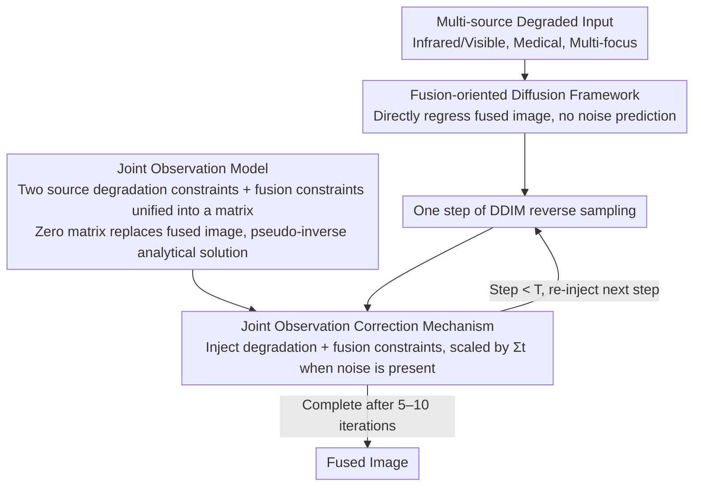

# DRFusion: Degradation-Robust Fusion via Degradation-Aware Diffusion Framework

**Conference**: CVPR 2026  
**arXiv**: [2604.08922](https://arxiv.org/abs/2604.08922)  
**Code**: [https://github.com/YShi-cool/DRFusion](https://github.com/YShi-cool/DRFusion)  
**Area**: Image Fusion / Image Restoration  
**Keywords**: multimodal image fusion, diffusion model, degradation-aware, joint observation model, image restoration

## TL;DR

Proposes the degradation-aware diffusion framework DRFusion, which achieves multimodal image fusion under arbitrary degradation scenarios within a few diffusion steps through direct regression of the fused image (rather than explicit noise prediction) and a joint observation model correction mechanism.

## Background & Motivation

Real-world image fusion faces degradation challenges such as noise, blur, and low resolution. Traditional "restoration-then-fusion" pipelines suffer from error accumulation and deployment complexity. End-to-end neural network methods are simple and efficient but lack interpretability. Diffusion models have a strong theoretical basis but suffer from three inherent limitations: (1) they require training data of the target distribution, whereas fusion lacks natural ground truth fused images; (2) standard diffusion models process single-domain distributions, while fusion requires modeling complementary multi-source information; (3) iterative sampling is computationally expensive.

Existing diffusion fusion methods either handle specific degradations only or rely on independently pretrained restoration models, lacking a flexible and unified framework.

## Method

### Overall Architecture

DRFusion performs multimodal image fusion in real-world scenarios with degradations like noise, blur, and low resolution, while avoiding error accumulation from "restoration-then-fusion" pipelines. The approach modifies the diffusion model: it discards the explicit noise prediction step of standard diffusion, maintains only the reverse process, uses a finite number of diffusion iterations to directly map multi-source degraded inputs to fusion outputs, and inserts a joint observation correction at each iteration to simultaneously align degradation and fusion constraints.

### Key Designs

**1. Fusion-oriented Diffusion Framework: Direct regression of fused images instead of noise prediction**

Standard diffusion requires training data of the target distribution, but fusion tasks lack "natural fused images" for supervision. DRFusion avoids predicting noise altogether, directly regressing the fused image and embedding denoising within the intermediate representations. This grants the framework flexibility similar to end-to-end networks, allowing self-supervised fusion (without ground truth labels) while requiring only a few diffusion steps to achieve high-quality results.

**2. Joint Observation Model: Unifying dual-source degradation and fusion constraints into a single matrix**

Degradation restoration and multimodal fusion are traditionally separate, leading to error accumulation. DRFusion formulates the degradation constraints of both source images and the fusion constraint into a unified matrix form. A key technique involves substituting the position of the fused image with a zero matrix (obviating the need for a prior fused image) and deriving an analytical solution for the pseudo-inverse of the joint degradation matrix. By solving sub-equations separately, the direct calculation of high-dimensional pseudo-inverses is avoided.

**3. Joint Observation Correction Mechanism: Simultaneous injection of dual constraints after each sampling step**

Formulating constraints in a matrix is insufficient; they must be utilized during sampling. DRFusion injects the joint observation correction after each DDIM sampling step, forcing intermediate samples to align with the degradation model while preserving complementary cross-modal information. When noise is present, a scaling factor $\Sigma_t$ is added to control the correction intensity. Ablation studies show this step is critical for maintaining restoration accuracy.

### Loss & Training

Fusion weights are learned through a data-driven approach (a multi-task architecture simultaneously predicts noise and weight maps), with the constraint $W_1 + W_2 = 1$. The framework thus uniformly handles various degradation scenarios including noise, blur, low resolution, and their arbitrary combinations.

## Key Experimental Results

### Main Results

| Fusion Task | Degradation Type | Ours | Comparison Methods | Note |
|---------|---------|------|---------|------|
| IV Fusion | Noise + Blur | Best | DeFusion, DDFM, etc. | Strong degradation robustness |
| Medical Fusion | Low Resolution | Best | Various methods | Integrated restoration + fusion |
| Multi-focus Fusion | Defocus Blur | Competitive | Various methods | Flexible adaptation |

### Key Findings

- Significantly outperforms existing methods in complex degradation scenarios.
- Achieves competitive results with a small number of diffusion steps (e.g., 5-10 steps).
- The joint observation correction is essential for maintaining restoration accuracy.
- Data-driven fusion weight learning is superior to fixed weights.

## Highlights & Insights

- The joint observation model unifies degradation restoration and multimodal fusion into a single constrained optimization problem.
- The analytical solution for the pseudo-inverse elegantly avoids high-dimensional matrix operations.
- Removing explicit noise prediction ensures efficiency even with few sampling steps.
- Unified processing of noise, blur, low resolution, and their arbitrary combinations.

## Limitations & Future Work

- The degradation model must be known or estimable (the degradation operator $A$ must be explicitly provided).
- Reduction in diffusion steps might affect quality under certain extreme degradations.
- Learning of fusion weights depends on the representativeness of the training data.

## Related Work & Insights

- Shares a similar concept of pseudo-inverse constraints with DDNM but extends it to multi-input fusion scenarios.
- Provides a general paradigm of degradation-aware diffusion for other multi-input image processing tasks.

## Rating

- Novelty: ⭐⭐⭐⭐ — Degradation-aware diffusion fusion via a joint observation model.
- Technical Depth: ⭐⭐⭐⭐⭐ — Rigorous mathematical derivation and elegant pseudo-inverse solution.
- Experimental Thoroughness: ⭐⭐⭐⭐ — Validation across multiple tasks and degradation types.
- Value: ⭐⭐⭐⭐ — Unified framework for handling arbitrary degradations.

<!-- RELATED:START -->

## Related Papers

- [\[CVPR 2026\] Degradation-Robust Fusion: An Efficient Degradation-Aware Diffusion Framework for Multimodal Image Fusion in Arbitrary Degradation Scenarios](degradation-robust_fusion_an_efficient_degradation-aware_diffusion_framework_for.md)
- [\[CVPR 2026\] From Events to Clarity: The Event-Guided Diffusion Framework for Dehazing](from_events_to_clarity_the_event-guided_diffusion_framework_for_dehazing.md)
- [\[CVPR 2026\] FAPE-IR: Frequency-Aware Planning and Execution Framework for All-in-One Image Restoration](fape-ir_frequency-aware_planning_and_execution_framework_for_all-in-one_image_re.md)
- [\[CVPR 2026\] MMDIR: Multimodal Instruction-Driven Framework for Mixed-Degradation Document Image Restoration](mmdir_multimodal_instruction-driven_framework_for_mixed-degradation_document_ima.md)
- [\[CVPR 2026\] NEC-Diff: Noise-Robust Event–RAW Complementary Diffusion for Seeing Motion in Extreme Darkness](nec-diff_noise-robust_event-raw_complementary_diffusion_for_seeing_motion_in_ext.md)

<!-- RELATED:END -->
