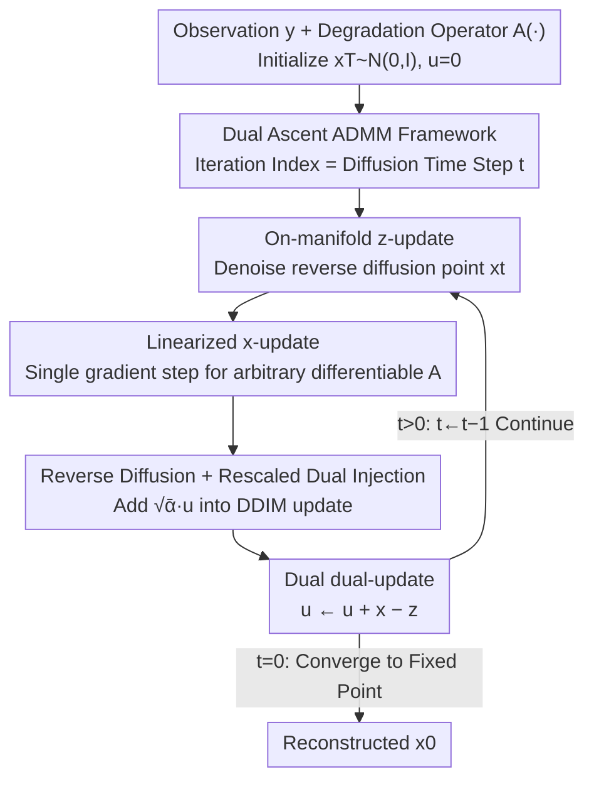

# Dual Ascent Diffusion for Inverse Problems

**Conference**: CVPR 2026  
**Paper**: [CVF Open Access](https://openaccess.thecvf.com/content/CVPR2026/html/Kim_Dual_Ascent_Diffusion_for_Inverse_Problems_CVPR_2026_paper.html)  
**Code**: None  
**Area**: Image Restoration / Diffusion Models  
**Keywords**: Inverse Problems, Diffusion Priors, MAP, ADMM, Dual Ascent

## TL;DR
DDiff reformulates MAP optimization for solving inverse problems into an ADMM-style dual ascent framework. It replaces naive plug-and-play off-manifold denoising with a denoising step that "stays on the diffusion manifold." This allows the pre-trained diffusion prior to preserve data consistency without introducing hallucinations, making it more accurate, more noise-robust, and faster than SOTA approaches across 8 tasks including super-resolution, deblurring, and phase retrieval.

## Background & Motivation

**Background**: Inverse problems (reconstructing clean signals $x$ from noisy, degraded observations $y$) are ubiquitous in astronomy, medical imaging, and phase retrieval. Given a degradation operator $A(\cdot)$ and a noise model, solvers either seek the maximum a posteriori (MAP) solution or sample from the posterior $p(x|y)\propto p(y|x)p(x)$. Since these problems are severely ill-posed, the prior $p(x)$ is crucial for success. Pre-trained diffusion models, acting as powerful priors, have been the mainstream choice in recent years.

**Limitations of Prior Work**: The two mainstream paradigms both suffer from major drawbacks. ① **Posterior sampling** (e.g., DPS, DAPS) must approximate the conditional score $\nabla_x\log p(y|x_t)$. Since computing the conditional expectation $p(y|x_t)=\mathbb{E}_{x_0\sim p(x_0|x_t)}[p(y|x_0)]$ via Monte Carlo estimation is computationally intractable, they rely on crude approximations like Dirac delta, leading to error accumulation along the sampling trajectory. Although DAPS mitigates this with MCMC equilibration steps, it remains limited by the approximation of $p(x_0|x_t)$ and the finite number of MCMC steps. ② **MAP optimization** (e.g., DiffPIR, DCDP, PnP-DM) is mostly built on Half-Quadratic Splitting (HQS), which **lacks dual variables**. Consequently, they cannot accumulate constraint violations across iterations, resulting in large residuals and severe hallucinations on difficult tasks with tight measurement consistency constraints.

**Key Challenge**: The diffusion prior is only accurate **on the corresponding diffusion manifold** at a given time step. The score network $s_\theta(x,t)$ is trained exclusively on points sampled from $p_t$. Once the input departs from the manifold ($p_t(x)\approx 0$), it yields poor score estimates. However, the standard z-update in classical ADMM requires denoising $x+u$, a point that is almost certainly off-manifold. Thus, there is a fundamental conflict between using ADMM's dual variables to improve data consistency and ensuring that the diffusion denoiser operates only on its reliable manifold.

**Goal**: (1) Introduce dual variables into the MAP framework to enhance measurement consistency and reduce hallucinations; (2) Ensure that every input fed to the diffusion denoiser falls on the manifold; (3) Make the x-update generalizable to any differentiable forward model (both linear and non-linear).

**Core Idea**: Reformulate the MAP solver as ADMM dual ascent, but modify the z-update: instead of denoising the off-manifold $x+u$, denoise a manifold point $x_t$ obtained via standard reverse diffusion, and inject the rescaled dual variable $u$ back into the reverse diffusion update. This preserves the constraint information carried by the dual variable, while keeping the denoiser operating within its reliable manifold. The authors name this method DDiff.

## Method

### Overall Architecture
DDiff solves $x_{\text{MAP}}=\arg\min_x \frac{1}{2\sigma^2}\|y-A(x)\|_2^2 - \log p(x)$. Following the variable splitting of ADMM, it introduces a slack variable $z$ and a constraint $x=z$ to separate the data fidelity term $-\log p(y|x)$ and the log-prior term $-\log p(z)$. A dual variable $u$ is then introduced to construct the Augmented Lagrangian. The algorithm alternates among **three steps** in each iteration: x-update (data fitting), z-update (diffusion denoising), and dual-update (updating the dual variable). Crucially, the **ADMM iteration index is coupled with the diffusion time step $t$**, which goes down from $T$ to $0$. Once the iteration ends, the reconstructed $x_0$ is obtained. As iterations progress, the primal variables $x$ and $z$ gradually align, and the dual variable $u$ decays to zero, converging to a fixed point $(x^*,z^*,u^*)$. The authors provide the **first fixed-point convergence proof** among diffusion posterior optimization methods (Theorem 1, without requiring a convex prior).

### Key Designs

**1. Dual Ascent Replaces Half-Quadratic Splitting: Accumulating Constraint Violations Across Iterations**

Existing diffusion MAP methods (e.g., DiffPIR, DCDP, PnP-DM) are built on HQS, which only involves the primal variables $x$ and $z$ without a dual variable. Consequently, key information regarding how much the measurement constraint $x=z$ is violated in each iteration is discarded and not propagated forward. DDiff employs ADMM instead. Starting from the Augmented Lagrangian:
$$\mathcal{L}_\rho(x,z,u)=\tfrac{1}{2\sigma^2}\|y-A(x)\|_2^2 - \log p(z) + \tfrac{\rho}{2}\|x-z+u\|_2^2 - \tfrac{\rho}{2}\|u\|_2^2$$
it alternatingly optimizes over $x$, $z$, and $u$. The dual variable $u\leftarrow u + x - z$ acts as the Lagrange multiplier, accumulating historical constraint violations $(x-z)$ to continuously exert pressure. The authors explicitly point out: **removing the dual update in DDiff degenerates it to DiffPIR** (under appropriate choices of $\sigma_t,\zeta_t$, see Appendix E of the original paper). This step is the root cause of why the method excels on challenging tasks with tight measurement consistency constraints: the dual variable forces the solution to faithfully account for the observation, yielding residuals $\|y-A(x)\|_2^2$ closer to zero and fewer hallucinations.

**2. On-Manifold z-update: Retaining Dual Information while Keeping the Denoiser on the Manifold**

This is the core methodological contribution of the paper. A naive approach (termed Diff-PnP-ADMM by the authors) would treat the diffusion model as a single-step denoiser and directly denoise $x+u$ via Tweedie's formula: $z\leftarrow \frac{1}{\sqrt{\bar\alpha_t}}(x+u+(1-\bar\alpha_t)s_\theta(x+u,t))$. The issue is that $x+u$ is almost certainly **off the diffusion manifold at time step $t$**. Since the score network is only trained on manifold points, $s_\theta$ yields poor estimates when off-manifold, injecting high-frequency artifacts. DDiff resolves this by changing the denoising target to $x_t$, which is **explicitly constructed to lie on the manifold**:
$$z\leftarrow \tfrac{1}{\sqrt{\bar\alpha_t}}\big(x_t+(1-\bar\alpha_t)s_\theta(x_t,t)\big)$$
Here, $x_t$ is recursively defined. It performs a DDIM update with the assumption that "the predicted $x_0$ is the current $x$," **supplemented by adding the rescaled dual variable $u$**:
$$x_{t-1}\leftarrow \underbrace{\sqrt{\bar\alpha_{t-1}}\,x+\sqrt{1-\bar\alpha_{t-1}-\sigma_t^2}\,\hat\epsilon+\sigma_t\epsilon}_{\text{DDIM Update}}+\underbrace{\sqrt{\bar\alpha_{t-1}}\,u}_{\text{Rescaled }u}$$
where $\hat\epsilon=(x_t-\sqrt{\bar\alpha_t}x)/\sqrt{1-\bar\alpha_t}$. Consequently, the constraint information brought by the dual variable is successfully injected into the system, yet the point $x_t$ fed to the denoiser always remains on the diffusion manifold, allowing $s_\theta$ to work in its reliable domain. Multiplying $u$ by $\sqrt{\bar\alpha_{t-1}}$ aligns its signal magnitude with $x_{t-1}$.

**3. Linearized x-update: Universally Applicable to Any Differentiable Forward Model**

The x-update in standard ADMM is a least-squares subproblem $\arg\min_x \frac{1}{2\sigma^2}\|y-A(x)\|_2^2+\frac{\rho}{2}\|x-z+u\|_2^2$, which has a closed-form solution only when $A$ is linear. To make the method directly applicable to **non-linear** $A$ (such as phase retrieval and non-linear deblurring), DDiff replaces it with a **single-step gradient descent** on the data fidelity term (i.e., linearized ADMM):
$$x\leftarrow v-\zeta\nabla_v\|y-A(v)\|_2^2,\quad v=z-u$$
where $\zeta$ is an adjustable step-size at each step. As long as $A$ is differentiable, gradients can be computed. Thus, the same algorithm seamlessly covers linear tasks like super-resolution, inpainting, and Gaussian/motion deblurring, as well as non-linear tasks like phase retrieval, non-linear deblurring, and HDR—which cannot be handled by methods like DiffPIR/DDRM.

**4. Paired Occurrence of Noise Steps and Dual Variables**

This is not an independent module but a critical constraint for (1) and (2) to hold, and also a key takeaway from the ablation study. Adding dual variables in isolation (Diff-PnP-ADMM, which has $u$ but no noise steps) actually performs worse than the dual-free baseline (Diff-PnP-HQS). Without pulling the denoising target back onto the manifold, the high-frequency artifacts introduced by $u$ degrade the diffusion denoiser. Only when the dual variables are **used in tandem** with the reverse diffusion noise steps in the z-update (Eq. 12 constructing $x_t$ on the manifold) does $u$ provide positive gains. In other words, "dual ascent" and "on-manifold denoising" are an inseparable pair—which is the essence of how DDiff differs from simply wrapping a diffusion denoiser around PnP-ADMM.

### Loss & Training
DDiff **does not train any network**. Seeking test-time optimization, it directly reuses pre-trained diffusion models (using pre-trained weights of DPS/EDM for pixel space, and LDM-VQ4 for latent space). The step-by-step sequence of the algorithm (Algorithm 1) is: z-update (denoising) $\rightarrow$ x-update (measurement gradient step) $\rightarrow$ recalculating $\hat\epsilon$ $\rightarrow$ reverse diffusion to obtain $x_{t-1}$ (adding noise when $t>t_0$, and none otherwise) $\rightarrow$ dual-update. The key hyperparameters are the step-size at each step $\{\zeta_t\}$, noise schedule $\{\sigma_t\}$, and the step to stop adding noise $t_0$. The authors also extend the framework to latent diffusion, resulting in **LatentDDiff**, which alternates between data fidelity and denoising in the compressed latent space while preserving the dual ascent structure to further save GPU memory and computation.

## Key Experimental Results

### Main Results
100 validation images each from FFHQ 256×256 and ImageNet 256×256, with noise level $\sigma=0.05$, are evaluated against DAPS, DMPlug, DCDP, RED-diff, DDRM, DPS, and DiffPIR. Evaluation metrics include PSNR↑, SSIM↑, LPIPS↓, and Residual↓ (residual $\|y-A(x)\|_2^2-\sigma^2$, measuring data consistency). The table below excerpts several representative tasks on FFHQ (Ours vs. the strongest baseline, DAPS):

| Task (FFHQ) | Metric | DDiff (Ours) | DAPS | DPS |
|:---|:---|:---|:---|:---|
| Super-resolution 4× | PSNR / Residual | **30.07** / **0.0028** | 29.34 / 0.0029 | 24.42 / 0.0050 |
| Random inpainting | PSNR / LPIPS | **33.08** / **0.050** | 30.76 / 0.156 | 30.79 / 0.083 |
| Phase retrieval | PSNR / LPIPS | **29.94** / **0.120** | 29.60 / 0.182 | 22.24 / 0.307 |
| Non-linear deblurring | PSNR / LPIPS | **31.48** / **0.120** | 28.45 / 0.188 | 25.39 / 0.258 |

DDiff leads in the vast majority of tasks, showing a particularly distinct advantage in **perceptual similarity (LPIPS) and residual**—demonstrating that it is both visually appealing and faithful to the observation. For a few tasks (such as Gaussian/motion deblurring on FFHQ, and HDR), its PSNR is slightly lower than DAPS, but its Residual is consistently lower.

### Ablation Study
Disentangling the dual variable $u$ and the noise step (Eq. 12), evaluated on 10 FFHQ images under a unified DDIM schedule for a fair comparison:

| Configuration | Has Noise Steps | Has Dual u | SR 4× PSNR | Random Inpaint PSNR | Note |
|:---|:---:|:---:|:---:|:---:|:---|
| **DDiff (Full)** | ✓ | ✓ | **30.10** | **33.21** | Both present, optimal |
| DDiff-HQS | ✓ | ✗ | 25.45 | 15.37 | Manifold denoising but no dual variable |
| Diff-PnP-ADMM | ✗ | ✓ | 13.79 | 16.79 | Dual variable but off-manifold denoising |
| Diff-PnP-HQS | ✗ | ✗ | 14.04 | 15.85 | Naive baseline |

**Key Findings**:
- **Adding dual variables alone is harmful**: Diff-PnP-ADMM (13.79) is even worse than the dual-free Diff-PnP-HQS (14.04)—when there is no manifold constraint, $u$ injects high-frequency artifacts, poisoning the denoiser.
- **The two components must be used in tandem**: There is a qualitative leap only when jumping from Diff-PnP-HQS (14.04) to the full DDiff (30.10), proving that "dual ascent + manifold denoising" constitutes an inseparable whole.
- **Noise robustness is a highlight**: As physical measurement noise $\sigma$ increases, DDiff's PSNR decays much slower than DAPS. Under extreme noise in phase retrieval ($\sigma=0.3$), DDiff compresses LPIPS to 1/3 of DAPS's value, still reconstructing coherent global structures and facial semantics.
- **Faster speed**: At equivalent NFEs (Number of Function Evaluations), DDiff achieves better perceptual quality with much faster speed—eliminating the MCMC equilibration steps in DAPS and reducing the demand for gradient backpropagation.

## Highlights & Insights
- **The diagnosis of "off-manifold" hits the mark**: Pinpointing the failure of PnP-ADMM precisely to "denoiser input $x+u$ is off-manifold" and solving it via "explicitly constructing manifold point $x_t$ + rescaled dual injection of $u$" is a very elegant causal analysis. This is far more explanatory than mere parameter tuning.
- **Honest presentation of degradation relationships**: Safely positioning itself in the lineage of prior works by explicitly noting that "removing the dual update degenerates to DiffPIR" and "DDiff-HQS is another ablation" makes the boundary of its contributions crystal clear.
- **Using residual as a hallucination metric**: Using $\log p(y|x)$ / residuals to quantify the level of hallucinations introduced by generative priors is a generalizable perspective—any task leveraging generative models as priors for reconstruction can employ residuals to diagnose structural fidelity.
- **First fixed-point convergence proof**: Proving that the three iterative sequences are all Cauchy sequences without assuming a convex prior successfully bridges the theoretical gap in diffusion posterior optimization.

## Limitations & Future Work
- **Still MAP optimization instead of true sampling**: The authors explicitly state that they do not aim for provable sampling from the posterior, solving only for the MAP single-point estimate. Accordingly, environments requiring posterior diversity or uncertainty quantification cannot directly adopt this method.
- **Coupled ADMM iterations and diffusion time steps**: Setting the iteration index equal to the diffusion time step is a strong design assumption. The iteration budget is locked to the diffusion schedule length, and how to decouple the optimal number of steps for different tasks is left unaddressed.
- **Phase retrieval remains unstable**: For this task, the paper reports the "best of 5 runs," implying that stability on highly non-linear tasks remains a major pain point.
- **Abundant hyperparameters**: $\{\zeta_t\}$, $\{\sigma_t\}$, and $t_0$ all need tuning. The details are relegated to the appendix, which implies a non-trivial reproduction cost.
- **Future Work**: The authors specifically mention extending to 3D or video data, where forward models are more complex and GPU memory is tight—serving as an ideal testbed for LatentDDiff.

## Related Work & Insights
- **vs DAPS**: DAPS takes a posterior sampling path, using MCMC equilibration steps to alleviate trajectory error accumulation, but is bound by the approximation of $p(x_0|x_t)$ and finite MCMC steps. DDiff adopts MAP optimization without MCMC or approximated conditional expectations, yielding faster speeds at equivalent NFEs, stronger noise robustness, and lower residuals—with the trade-off of not providing posterior sampling.
- **vs DiffPIR / DCDP / PnP-DM**: These are HQS-style MAP formulations lacking dual variables; DDiff elevates them to ADMM/dual ascent, where removing the dual update degenerates exactly to DiffPIR, representing a "natural superset" expansion.
- **vs DPS**: DPS approximates the conditional distribution with Dirac delta and proceeds in a single pass along the trajectory, suffering from conspicuous error accumulation (PSNR generally lags by 5+ dB in the table). DDiff's iterative dual correction dramatically improves fidelity.
- **vs DDRM / DiffPIR (Linear Only)**: These methods are not proven to handle non-linear tasks, whereas DDiff's linearized x-update is universally applicable as long as $A$ is differentiable, naturally covering phase retrieval and non-linear deblurring.

## Rating
- Novelty: ⭐⭐⭐⭐⭐ Elevates diffusion MAP optimization from HQS to dual ascent, resolving the off-manifold bottleneck via "on-manifold denoising + rescaled dual injection." The approach is clean and accompanied by the first fixed-point convergence proof.
- Experimental Thoroughness: ⭐⭐⭐⭐ Covers 8 tasks × 2 datasets × 7 baselines, dual pixel/latent configurations, and robust studies on noise and latency; however, only 100 images are used per task, and phase retrieval requires selecting the best run.
- Writing Quality: ⭐⭐⭐⭐⭐ Flows systematically from ADMM derivation to failure diagnosis and structural remedies, carefully unpacking degradation relationships and ablation results.
- Value: ⭐⭐⭐⭐ Training-free and plug-and-play, generalization to non-linear tasks, and high noise robustness make it highly practical for noisy inverse problems in medical imaging and astronomy.

<!-- RELATED:START -->

## Related Papers

- [\[CVPR 2026\] PnP-CM: Consistency Models as Plug-and-Play Priors for Inverse Problems](pnp-cm_consistency_models_as_plug-and-play_priors_for_inverse_problems.md)
- [\[CVPR 2026\] Outlier-Robust Diffusion Solvers for Inverse Problems](outlier-robust_diffusion_solvers_for_inverse_problems.md)
- [\[CVPR 2026\] GSNR: Graph Smooth Null-Space Representation for Inverse Problems](gsnr_graph_smooth_null_space_representation_for_inverse_problems.md)
- [\[ICLR 2026\] FAST-DIPS: Adjoint-Free Analytic Steps and Hard-Constrained Likelihood Correction for Diffusion-Prior Inverse Problems](../../ICLR2026/image_restoration/fastdips_adjointfree_analytic_steps_and_hardconstrained_likelihood_correction_fo.md)
- [\[ICLR 2026\] Flower: A Flow-Matching Solver for Inverse Problems](../../ICLR2026/image_restoration/flower_a_flow-matching_solver_for_inverse_problems.md)

<!-- RELATED:END -->
