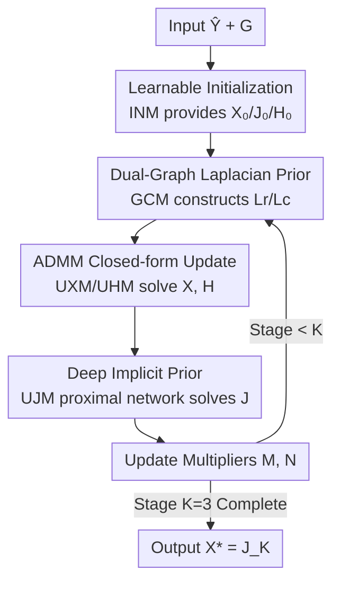

# Dual Graph Regularized Deep Unfolding Network for Guided Depth Map Super-resolution

**Conference**: CVPR 2026  
**Paper**: [CVF Open Access](https://openaccess.thecvf.com/content/CVPR2026/html/Zhong_Dual_Graph_Regularized_Deep_Unfolding_Network_for_Guided_Depth_Map_CVPR_2026_paper.html)  
**Code**: None  
**Area**: Image Restoration / Guided Depth Map Super-resolution / Deep Unfolding Network  
**Keywords**: Guided Depth Super-resolution, Dual Graph Laplacian Prior, Deep Unfolding, ADMM, Interpretable Network

## TL;DR
This paper proposes LapNet, which integrates a "row/column dual-graph Laplacian prior + deep implicit prior" into a unified variational model. Through ADMM, closed-form updates are derived and unfolded into an interpretable multi-stage network. It reduces graph construction complexity from $O(H^3W^3)$ to $O(H^3+W^3)$ while achieving SOTA performance in Guided Depth Super-Resolution (GDSR) with only 3.84M parameters.

## Background & Motivation
**Background**: Guided Depth Map Super-resolution (GDSR) aims to restore high-resolution (HR) depth maps from low-resolution (LR) inputs guided by aligned HR color images. Traditional methods formulate this as optimization problems with priors (e.g., Graph Laplacian, Total Variation), which are interpretable and controllable but suffer from limited representation power and slow iteration. Recent deep learning methods offer high precision and flexibility but operate as "black boxes," relying on stacked modules without clear component explanations.

**Limitations of Prior Work**: To bridge interpretability and high performance, existing hybrid methods embed graph optimization into deep networks. However, graph construction remains a bottleneck: fully connected graphs capture global dependencies but require multiplication and inversion of dense $HW \times HW$ Laplacian matrices, leading to $O(H^3W^3)$ complexity. Sparse local neighborhood graphs are faster but only model short-range structures with limited receptive fields and are restricted to fixed resolutions. Furthermore, many methods flatten 2D images into 1D vectors for graph construction, destroying the natural row-column topology and geometric details of depth maps.

**Key Challenge**: The quintessential property of depth maps is being piecewise smooth (PWS)—smooth regions separated by sharp boundaries. While Graph Laplacians are naturally suited to characterize this, there is a hard conflict between "global 2D graph construction" and "computational efficiency/arbitrary resolution support."

**Goal**: To design a graph regularization approach that preserves 2D topology, remains computationally efficient, supports arbitrary input resolutions, and integrates with data-driven priors in an interpretable framework.

**Key Insight**: Instead of learning pixel-wise similarities across the entire image, structural dependencies can be modeled independently along the row and column directions. The similarity graphs in row and column subspaces are significantly smaller than the global graph, and their dimensions grow linearly rather than quadratically with resolution.

**Core Idea**: Replace the single global graph with a "row graph + column graph" dual-graph Laplacian prior. This is combined with a deep implicit prior in a unified variational model and unfolded via ADMM into a multi-stage network to achieve interpretability, efficiency, and high precision.

## Method

### Overall Architecture
LapNet takes the LR depth map $\hat{Y}\in\mathbb{R}^{H\times W}$ (bicubically upsampled to target size) and the HR color guidance $G\in\mathbb{R}^{H\times W\times C}$ as inputs to output the reconstructed HR depth map $X$. The pipeline is driven by a unified variational objective:

$$\min_X \|Y-DX\|_F^2 + \lambda\,\mathrm{tr}(X^\top L_r X) + \alpha\,\mathrm{tr}(X L_c X^\top) + \beta f(X,G)$$

where the first term is data fidelity ($D$ is the downsampling operator), the middle terms are the row/column dual-graph Laplacian regulars, and the final term $f(X,G)$ is the deep implicit prior extracting high-frequency structures from the guidance. Auxiliary variables $J=X$ and $H=X$ are introduced to decouple terms. Each ADMM iteration is unfolded into a network stage, with $K=3$ stages in total. Each stage consists of five sequential modules: the **Initialization Module (INM)** provides $X_0, J_0, H_0$; the **Graph Construction Module (GCM)** dynamically constructs $L_r, L_c$ from the current $X_t$; the **Update X/H Modules (UXM/UHM)** inject graph regularization via closed-form solutions; and the **Update J Module (UJM)** utilizes a lightweight U-Net to inject guidance priors. Finally, Lagrange multipliers are updated for the next stage, with the output being $X^*=J_K$.

### Key Designs

**1. Dual-Graph Laplacian Prior: Decomposing Global Graphs into Row and Column Graphs**

This address the trade-off between complexity and topology preservation. Traditional graph regularization uses $S(x)=\tfrac12\sum_{i,j}w_{ij}(x_i-x_j)^2=x^\top L x$, requiring an $HW \times HW$ Laplacian $L$. The authors instead construct similarity graphs $S_r\in\mathbb{R}^{H\times H}$ and $S_c\in\mathbb{R}^{W\times W}$ in row and column subspaces:

$$\tfrac12\sum_{i,j}\|X_i-X_j\|_2^2 (S_r)_{ij} + \tfrac12\sum_{i,j}\|(X^\top)_i-(X^\top)_j\|_2^2 (S_c)_{ij}$$

Per Lemma 1, this is equivalent to the compact trace form $\mathrm{tr}(X^\top L_r X)+\mathrm{tr}(X L_c X^\top)$, where $L_r=U_r-S_r$ and $L_c=U_c-S_c$. Since $X$ remains a 2D matrix, $L_r$ constrains rows via left-multiplication and $L_c$ constrains columns via right-multiplication. Complexity drops from $O(H^3W^3)$ to $O(H^3+W^3)$. The model naturally supports arbitrary resolutions and preserves 2D topology better than 1D vectorization.

**2. Deep Implicit Prior: Capturing High-Frequency Structures via Proximal Networks**

While Dual-Graph Laplacians excel at smoothing, they may struggle with fine high-frequency structures (thin objects, texture edges) from guidance images. A data-driven implicit prior $\beta\cdot f(X,G)$ is added. With $J=X$, the $J$-subproblem $\min_J \tfrac{\mu}{2}\|X_{t+1}-J+\tfrac{M_t}{\mu}\|_F^2+\beta f(J,G)$ is solved via a proximal operator $J_{t+1}=\mathrm{Prox}(X_{t+1}+\tfrac{M_t}{\mu},G)$. This is implemented as a lightweight U-Net (UJM). To reduce information loss, fine-grained feature propagation is included, feeding previous decoder features $F_{k-1}$ and reconstruction $X_k$ into the current stage encoder.

**3. Unified Variational + ADMM Closed-form: Interpretable and Efficient Analytical Solutions**

By introducing $J=X$ and $H=X$ with multipliers $M, N$, the augmented Lagrangian $\Phi_\mu$ is solved alternately. The $X$ subproblem combines data fidelity, row graph regularization $\lambda L_r$, and quadratic penalty terms, yielding the closed-form:

$$X_{t+1}=(D^\top D+\lambda L_{r,t}+\mu I_r)^{-1}\Big(D^\top Y+\tfrac{\mu_t}{2}(J_t+H_t-\tfrac{M_t+N_t}{\mu_t})\Big)$$

The $H$ subproblem addresses the column graph regularization $\alpha L_c$ with the closed-form $H_{t+1}=(\mu X_{t+1}+N_t)(\mu I_c+2\alpha L_{c,t+1})^{-1}$. The split of row and column regularizations into different subproblems ensures inversions occur only on $H\times H$ or $W\times W$ matrices.

**4. Deep Unfolding with Learnable Initialization: End-to-End Weight Optimization**

The $K$ ADMM steps are unfolded into $K=3$ stages. To improve performance, three components are made learnable: ① **INM** learns $X_0, J_0, H_0$ by fusing $\hat{Y}$ and $G$ instead of simple bicubic initialization; ② **Penalty parameters** $\alpha, \lambda, \beta$ are back-propagated (observation shows $\beta$ decreases while $\lambda/\alpha$ increases to balance fidelity and structure); ③ **GCM** similarities are dynamic, re-constructing graphs in each stage using the current $X_t$.

### Loss & Training
The model is supervised using L1 loss. It uses $K=3$ stages. The proximal network has 24 feature channels (8 for LapNet-T). Training is performed in PyTorch on 2 RTX 5090 GPUs. RMSE is used as the primary evaluation metric.

## Key Experimental Results

### Main Results
Evaluated across 6 datasets and 3 scaling factors (4×/8×/16×), LapNet consistently achieves the lowest RMSE:

| Method | NYU v2 16× | DIDOE 16× | RGB-D-D 16× | Avg 4× | Avg 8× | Avg 16× |
|------|-----------|-----------|-------------|---------|---------|----------|
| SGNet (Runner-up) | 4.77 | 8.31 | 2.55 | 1.70 | 2.92 | 4.52 |
| DCNAS | 5.06 | 8.36 | 2.61 | 1.72 | 2.99 | 4.60 |
| DORNet | 5.60 | 9.18 | 3.35 | 1.87 | 3.26 | 5.29 |
| **LapNet** | **4.55** | **8.24** | **2.45** | **1.64** | **2.82** | **4.39** |

Notably, LapNet uses only **3.84M** parameters compared to SGNet's **25.33M**. On the real-world RGB-D-D dataset:

| Method | DCNAS | SFG | DORNet | **LapNet** |
|------|-------|-----|--------|-----------|
| RMSE↓ | 4.87 | 3.88 | 3.42 | **3.25** |

Qualitatively, LapNet sharper edges on fine structures (chair backs, table legs) and exhibits fewer "texture copying" artifacts from RGB guidance.

### Ablation Study
Ablation results on NYU v2 8× (lower RMSE is better):

| Configuration | NYU v2 | Sintel | DIDOE | Notes |
|------|--------|--------|-------|------|
| **LapNet (Full)** | **2.33** | **5.05** | **5.51** | Learnable init + penalty + L2 dynamic dual-graph + deep prior |
| Model3 | 2.52 | 5.26 | 5.78 | Replace L2 with dot-product similarity |
| Model4 | 2.60 | 5.24 | 5.73 | Static graph (constructed only at $X_0$) |
| Model5 | 2.63 | 5.31 | 5.87 | Remove row graph |
| Model6 | 2.57 | 5.28 | 5.81 | Remove column graph |
| Model7 | 3.01 | 5.87 | 6.34 | Replace proximal network with fixed guided filter |

### Key Findings
- **Deep Implicit Prior is crucial**: Replacing the learnable proximal network with a fixed guided filter (Model 7) caused the most significant performance drop.
- **Row and Column graphs are complementary**: Removing either direction (Model 5/6) degrades performance, proving both are necessary for structural modeling.
- **Dynamic > Static, L2 > Dot-Product**: Re-constructing graphs in each stage and using L2 distance for similarity consistently perform better.
- **Adaptive penalty evolution**: During training, $\beta$ decreases while $\lambda/\alpha$ increases, automatically balancing the proximal term and graph regularization.

## Highlights & Insights
- **Row-Column Decomposition**: Decoupling the global graph into row and column graphs effectively resolves the cubic complexity bottleneck $O(H^3W^3) \to O(H^3+W^3)$ while maintaining 2D geometric awareness.
- **ADMM as Network Blueprint**: The interpretability stems from mapping every ADMM step to a specific network module, ensuring the optimization process is transparent and theoretically grounded.
- **Hybrid Functional Design**: Allocating structural smoothing to explicit graph priors and high-frequency refinement to implicit deep priors provides a robust paradigm for image restoration tasks.

## Limitations & Future Work
- **Matrix Inversion Bottleneck**: While complexity is reduced, inverting $H\times H$ or $W\times W$ matrices may still be expensive for ultra-high-resolution images.
- **Axis-aligned Bias**: Modeling purely along rows and columns might under-perform on complex curved or diagonal boundaries.
- **Parameter Efficiency**: Non-shared parameters across stages improve accuracy but increase model size; adaptive iteration counts could be explored.

## Related Work & Insights
- **Comparison with Graph Optimization**: Unlike LGR [34], which uses expensive fully connected graphs or 1D-flattened sparse graphs, LapNet preserves 2D topology with linear complexity growth.
- **Comparison with Black-box Models**: LapNet achieves higher accuracy than architectures like SGNet with 1/6th the parameter count by leveraging the inductive bias of optimization algorithms.

## Rating
- Novelty: ⭐⭐⭐⭐⭐ 
- Experimental Thoroughness: ⭐⭐⭐⭐ 
- Writing Quality: ⭐⭐⭐⭐⭐ 
- Value: ⭐⭐⭐⭐⭐ 

<!-- RELATED:START -->

## Related Papers

- [\[CVPR 2026\] LRDUN: A Low-Rank Deep Unfolding Network for Efficient Spectral Compressive Imaging](lrdun_a_low-rank_deep_unfolding_network_for_efficient_spectral_compressive_imagi.md)
- [\[CVPR 2026\] Spectral Super-Resolution via Adversarial Unfolding and Data-Driven Spectrum Regularization](spectral_super-resolution_via_adversarial_unfolding_and_data-driven_spectrum_reg.md)
- [\[AAAI 2026\] SpatioTemporal Difference Network for Video Depth Super-Resolution](../../AAAI2026/image_restoration/spatiotemporal_difference_network_for_video_depth_super-resolution.md)
- [\[CVPR 2026\] DPGF-Net: Dual-Prior Guided Fusion Network for Joint Assessment of Perceptual Quality and Semantic Consistency in AI-Generated Images](dpgf-net_dual-prior_guided_fusion_network_for_joint_assessment_of_perceptual_qua.md)
- [\[CVPR 2026\] Dual Ascent Diffusion for Inverse Problems](dual_ascent_diffusion_for_inverse_problems.md)

<!-- RELATED:END -->
