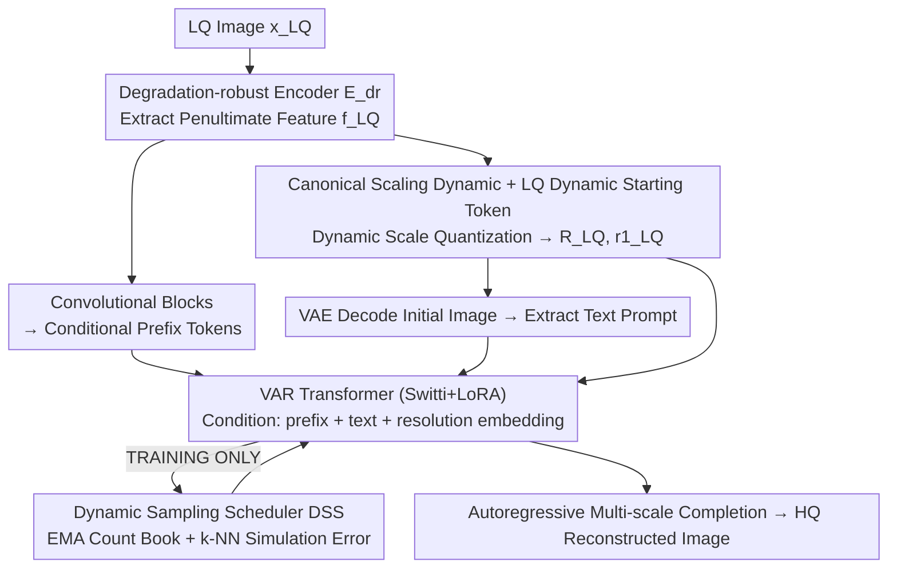

# DVAR: Dynamic Visual Autoregressive Modeling for Image Super-Resolution

**Conference**: CVPR 2026  
**Paper**: [CVF Open Access](https://openaccess.thecvf.com/content/CVPR2026/html/Zheng_DVAR_Dynamic_Visual_Autoregressive_Modeling_for_Image_Super-Resolution_CVPR_2026_paper.html)  
**Code**: https://github.com/YuZheng9/DVAR  
**Area**: Image Restoration / Super-Resolution / Visual Autoregressive  
**Keywords**: Visual Autoregressive (VAR), Real-World Image Super-Resolution (Real-ISR), Resolution-Agnostic, next-scale prediction, exposure bias

## TL;DR
DVAR liberates visual autoregressive (VAR) super-resolution models from the rigid design of "one resolution, one set of weights." It replaces the fixed 1×1 starting point and absolute scale tables with a **canonical scaling dynamic of relative proportions + a dynamic starting token derived from the LQ image**. Additionally, it incorporates a nearly zero-overhead **dynamic sampling scheduler** to alleviate the training-inference mismatch. This allows a single model to process inputs of arbitrary resolutions and achieve state-of-the-art (SOTA) perceptual quality on real-world super-resolution.

## Background & Motivation
**Background**: Real-world image super-resolution (Real-ISR) is currently dominated by two generative paradigms: GANs (e.g., Real-ESRGAN, BSRGAN), which synthesize sharp textures but suffer from unstable training and artifacts; and diffusion models (e.g., StableSR, SeeSR, SUPIR), which generate realistic textures leveraging powerful generative priors, but suffer from high computational costs due to multi-step iterative sampling at full resolution, while accelerated sampling often sacrifices texture diversity. Recently, VAR (Visual Autoregression, next-scale prediction) has emerged as a promising third path. It generates low-frequency global structures before filling in high-frequency details, inherently preserving structure. Since most generation steps occur at low resolutions, it is much more efficient than diffusion models. VARSR was the first to apply VAR to ISR and achieved SOTA results.

**Limitations of Prior Work**: VARSR inherits two fundamental limitations from vanilla VAR. First, **resolution dependency**: the generation process of VAR always starts from a fixed 1×1 starting token. When target resolutions differ (e.g., 256² vs. 512²), the model is forced to learn **incompatible** scale tables for each size (e.g., one intermediate scale goes to 8² and another to 13²). Consequently, a single set of weights cannot generalize to different scales, requiring a separate trained model for each resolution. Second, **exposure bias**: training utilizes teacher forcing (feeding ground-truth prefixes), whereas inference must rely on its own (potentially erroneous) predictions, leading to error accumulation due to distribution mismatch.

**Key Challenge**: The authors point out that the root cause of resolution dependency does not lie in the VQ-VAE tokenizer (whose fully convolutional encoder-decoder + nearest-neighbor quantization is inherently resolution-adaptive, as evidenced by the fact that different VAR models can share the same VQ-VAE weights), but rather in the **forced 1×1 starting point** of the autoregressive generation process. This 1×1 starting point is a legacy of "synthesis tasks" inherited from general image generation (text-to-image), where creating an image "from scratch" based on abstract signals requires carefully building content from the minimal representation. However, ISR is a **refinement task** that aims to reconstruct degraded yet information-rich images. The LQ input already provides rich structure and content priors; thus, forcing an information-sparse 1×1 starting point is not only redundant but also suboptimal.

**Goal**: (1) Remove the resolution constraints of VAR to enable a single model to handle arbitrary input resolutions; (2) alleviate exposure bias with virtually no additional computational overhead.

**Core Idea**: Replace "memorising multiple absolute scale tables" with "learning a single relative scaling rule", and start from dynamic tokens derived from the LQ image (rather than 1×1). This allows early scales to quickly lock in the global structure, while later scales focus on refining textures. Meanwhile, by leveraging the characteristic that visual tokens are geometrically close in the codebook mapping to semantic similarity, prediction errors can be simulated at zero cost to bridge the training-inference gap.

## Method

### Overall Architecture
The input to DVAR is a low-quality (LQ) image $x_{\text{LQ}}$, and the output is a high-quality (HQ) reconstructed image. The workflow is as follows: first, $x_{\text{LQ}}$ is processed through a **degradation-robust encoder** $E_{dr}$ to extract latent features $f_{\text{LQ}}$. On one hand, $f_{\text{LQ}}$ is passed through convolutional blocks to generate **conditional prefix tokens** for the VAR Transformer. On the other hand, it undergoes **dynamic scale quantization** to yield a sequence of multi-scale token maps $R^{\text{LQ}}=\{r_1^{\text{LQ}},\dots,r_K^{\text{LQ}}\}$, where the first map $r_1^{\text{LQ}}$ serves as the **dynamic starting token** for generation (instead of the 1×1 static starting point in vanilla VAR). Subsequently, $R^{\text{LQ}}$ is decoded by the VAE to produce an initial reconstruction, from which a **text prompt** is extracted as an additional semantic conditional signal. Finally, conditioned on the combination of "prefix + text prompt + target resolution embedding", the VAR Transformer **autoregressively completes the remaining scales** starting from $r_1^{\text{LQ}}$. During training, a **dynamic sampling scheduler** is integrated into this pipeline to inject simulation errors and mitigate exposure bias.

### Key Designs

**1. Canonical Scaling Dynamic + LQ-Derived Dynamic Starting Token: Replacing Absolute Scale Tables with a Single Relative Scaling Rule**

This is the core design for resolving resolution dependency. The key limitation of vanilla VAR is that it maintains a set of absolute, incompatible scale tables for each target resolution and always starts from 1×1. DVAR reverses this: it defines a **canonical scale sequence** $\{(h_k,w_k)\}_{k=1}^K$ (where $(1,2,3,4,5,6,8,10,13,16)$ is chosen in the paper) on a baseline resolution $(H_{\text{base}}, W_{\text{base}})=256\times256$. For any arbitrary target size $(H,W)$, it dynamically scales the schedule proportionally:

$$\tilde{h}_k = \operatorname{round}\!\Big(\frac{H}{H_{\text{base}}}\cdot h_k\Big),\quad \tilde{w}_k = \operatorname{round}\!\Big(\frac{W}{W_{\text{base}}}\cdot w_k\Big).$$

Consequently, **the relative scaling ratios between adjacent scales remain consistent across all resolutions**, allowing a single model to generalize to variable or even unseen sizes and aspect ratios. Meanwhile, generator initialization no longer starts from a static 1×1 point, but from $r_1^{\text{LQ}}$ obtained by quantizing LQ features, which already encodes the global structure. Together, these elements reshape the role of each scale: early scales rapidly stabilize the global layout, while later scales focus on refining texture edges (as verified by the multi-scale visualization in Fig. 4). Essentially, the problem of "learning independent fixed schedules for each resolution" is reformulated as "learning a single, proportionally adaptable relative scaling rule".

**2. Dynamic Sampling Scheduler (DSS): Zero-Overhead Simulation of Prediction Errors via Codebook Geometric Proximity**

This design addresses exposure bias. The classic Scheduled Sampling method requires a full forward pass to obtain model predictions to replace ground-truth (GT) tokens, which is computationally expensive. DSS leverages a key observation: unlike discrete tokens in NLP which lack intrinsic semantic topology, **visual tokens in VQ-VAE are embedded in a continuous feature space, where geometric proximity implies semantic/visual similarity** (nearest-neighbor quantization ensures that visually similar features are close in the codebook). Thus, the "errors the model is most likely to make" can be approximated using the k-nearest neighbors (k-NN) of the GT token, which is a nearly zero-cost lookup table operation.

Specifically, for each generation scale $k$, a statistical "count book" $C_k\in\mathbb{R}^V$ ($V$ is the codebook size) is maintained to record the historical probability distribution of the model selecting the $v$-th nearest neighbor of the GT token. At each training step, the frequency of "selecting the $v$-th nearest neighbor" is counted using the `RankCount` operator, normalized, and updated using an Exponential Moving Average (EMA): $C_k \leftarrow \beta\cdot C_k + (1-\beta)\cdot c_k$. During the forward pass, instead of always feeding the GT, a "plausible model error" token is sampled from the neighbor set of the GT according to the current probability in $C_k$, which then replaces the GT as the next-step input with a probability determined by a mixture ratio $p$. This injects realistic noise that closely resembles the inference distribution into training, closing the training-inference gap without requiring extra forward steps.

**3. Degradation-Robust Encoder + Switti/LoRA Backbone + Resolution Embedding: Enabling Non-Intrusive, Degradation-Robust Conditioning and Resolution Awareness**

To make the conditional signals robust against diverse real-world degradations, DVAR adopts the encoder adaptation strategy of SUPIR to fine-tune the VAE encoder to obtain $E_{dr}$. Crucially, **the penultimate feature layer is extracted** instead of the last layer, because the latter is over-compressed and discards crucial content and degradation-related info. $E_{dr}$ is optimized using a combined loss of L1 reconstruction, feature L2 consistency, LPIPS, and GAN losses:

$$\|\mathcal{D}(\mathcal{E}_{dr}(x_{\text{LQ}})) - x_{\text{HQ}}\|_1 + \|f_{\text{LQ}}-\hat{f}_{\text{LQ}}\|_2 + \alpha\mathcal{L}_{\text{lpips}} + \beta\mathcal{L}_{\text{GAN}}.$$

The backbone utilizes Switti, a SOTA VAR model, fine-tuned parameter-efficiently using LoRA (rank=16). Each contribution is implemented in a **non-intrusive manner**: $f_{\text{LQ}}$ is injected as prefix conditional tokens, the dynamic scaling schedule is enforced by generating a **resolution-specific attention mask**, and an additional **resolution embedding** (adapted from SDXL) encoding the target output size is integrated into the Transformer cross-attention mechanism to make the model explicitly aware of the target scale.

### Loss & Training
Two-stage training: first, only the degradation-robust encoder is fine-tuned using the same loss as VQGAN (AdamW, lr $1\times10^{-5}$); second, the main DVAR model is fine-tuned using LoRA on top of the pre-trained Switti, with DSS active throughout. To bolster resolution-agnostic capabilities, **random crop augmentation** is applied: HQ images are randomly cropped to $256\times256 \sim 512\times512$, with corresponding LQ images cropped to $64\times64 \sim 128\times128$. The total batch size is 192 on 4 RTX 5880 GPUs using AdamW (lr $5\times10^{-5}$, weight decay $5\times10^{-2}$). Training pairs are synthesized using the Real-ESRGAN degradation pipeline, and the training datasets consist of LSDIR and the first 10,000 images of FFHQ.

## Key Experimental Results

### Main Results
Evaluated against SOTA methods across GAN, diffusion, and AR domains on one synthetic benchmark (DIV2K-Val) and two real-world benchmarks (RealSR, DRealSR). Non-reference perceptual metrics (CLIPIQA, MANIQA, MUSIQ) are highly emphasized.

| Dataset | Metric | DVAR (Ours) | VARSR (AR) | SeeSR (Diffusion) | Description |
|--------|------|-----------|-----------|------------|------|
| DIV2K-Val | CLIPIQA↑ | **0.7405** | 0.7347 | 0.6959 | Best overall |
| DIV2K-Val | MANIQA↑ | **0.5641** | 0.5340 | 0.5046 | Best overall |
| DIV2K-Val | MUSIQ↑ | 70.58 | 71.27 | 68.35 | Second |
| RealSR | CLIPIQA↑ | **0.7050** | 0.7006 | 0.6638 | Best overall |
| RealSR | MANIQA↑ | **0.5756** | 0.5570 | 0.5370 | Best overall |
| DRealSR | MANIQA↑ | **0.5653** | 0.5362 | 0.5077 | Best overall |
| DRealSR | CLIPIQA↑ | **0.7351** | 0.7240 | 0.6893 | Best overall |

DVAR ranks first in both CLIPIQA and MANIQA across all three benchmarks, and consistently ranks second in MUSIQ, demonstrating strong perceptual realism. Reference-based metrics (PSNR/SSIM) are generally higher for diffusion methods and the hybrid AR-diffusion VARSR, as they leverage continuous VAEs that naturally favor reconstruction fidelity. Since DVAR is structured purely as a discrete AR using VQ templates, it inevitably introduces slight tokenization errors, resulting in slightly lower PSNR/SSIM. However, this aligns with the well-known perception-distortion trade-off, and DVAR still significantly outperforms VARSR on LPIPS/DISTS/FID.

### Ablation Study

Canonical scaling dynamic + resolution conditioning (on RealLR200, containing real-world images of various resolutions):

| Configuration | CLIPIQA↑ | MUSIQ↑ | MANIQA↑ | Description |
|------|---------|--------|---------|------|
| VARSR (vanilla baseline) | 0.7477 | 71.68 | 0.5758 | resize/resize-back inference |
| w/o size + trained only on 512 | 0.7531 | 71.89 | 0.5816 | Still outperforms VARSR even when trained only on 512² |
| w/o size + trained on multi-resolution | 0.7621 | 72.59 | 0.5907 | Further improvement with multi-resolution training |
| w/ size (full DVAR) | **0.7767** | **73.17** | **0.6278** | Explicit resolution conditioning yields best results |

Dynamic Sampling Scheduler (DSS):

| Metric | DIV2K w/o DSS | DIV2K Ours | RealSR w/o DSS | RealSR Ours |
|------|--------------|-----------|----------------|-------------|
| PSNR↑ | 22.34 | 22.49 | 23.65 | 23.72 |
| LPIPS↓ | 0.3295 | 0.3192 | 0.3305 | 0.3291 |
| MANIQA↑ | 0.5444 | 0.5641 | 0.5417 | 0.5756 |
| CLIPIQA↑ | 0.7152 | 0.7405 | 0.6756 | 0.7050 |

### Key Findings
- **The canonical scaling dynamic inherently possesses zero-shot generalization capabilities**: Even when trained exclusively on 512² without seeing other resolutions or aspect ratios, this variant already outperforms VARSR. This indicates that "learning a relative scaling rule" rather than "memorizing absolute scale tables" is the true driver of generalization.
- **Explicit resolution conditioning > resize/resize-back**: Processing features directly at native resolution with explicit resolution cues in the full DVAR model proves more effective than the resize/resize-back inference pipeline in VARSR.
- **DSS benefits all metrics positively**, with particularly substantial improvements in perceptual indexes (MANIQA, CLIPIQA). This confirms that "injecting simulated errors via geometric neighbors during training" successfully reduces the training-inference mismatch of teacher forcing, preventing error propagation during inference.
- **Multi-scale visualizations (Fig. 4) reveal that DVAR establishes correct object layouts at earlier scales**, allowing subsequent scales to focus on refining texture edges. Consequently, the pure-AR DVAR synthesizes sharper and safer textures compared to the hybrid VARSR with a diffusion MLP.

## Highlights & Insights
- **The deconstruction of "why we must start from 1×1" is exceptionally insightful**: attributing resolution dependency to legacy architectures designed for image synthesis rather than the tokenizer, and proving this by highlighting that different VAR models share VQ-VAE weights, is highly precise. The distinction between generation (creating content "from scratch") and restoration (refinement from low quality) serves as the conceptual anchor of this methodology.
- **Simulating prediction errors at zero cost via codebook geometric proximity is a highly transferable trick**: Any vision autoregressive model employing a VQ codebook can leverage the k-NN of GT tokens and an EMA count book to simulate likely model errors. This avoids the extra forward passes of Scheduled Sampling and can easily generalize to VQ-based video or 3D autoregressive generation.
- **The non-intrusive adaptation** (comprising prefix conditional tokens, resolution-specific attention masks, resolution embeddings, and LoRA) facilitates seamless integration with existing SOTA VAR backbones like Switti, making it highly practical for engineering deployments.

## Limitations & Future Work
- **Slightly lower PSNR/SSIM**: The tokenization error of discrete visual quantizers in pure AR models causes fidelity-oriented metrics to be lower than those of continuous VAE-based diffusion or hybrid models. This is a drawback in scenarios that demand exact pixel fidelity (attributed by the authors to the perception-distortion trade-off).
- **Heavy reliance on external components**: The pipeline depends on LLM-extracted text prompts, a SUPIR-style encoder adaptation, and a Switti backbone. The overall pipeline is complex, and the error propagation across components along with reproducibility costs are not thoroughly addressed.
- **Manually defined canonical scale sequence**: The baseline resolution of 256² and scale sequence $(1,2,3,4,5,6,8,10,13,16)$ are heuristically configured. The paper lacks an ablation study on different canonical sequences; exploring automatic or adaptive scale learning presents a valuable future direction.
- **Insufficient stress-testing on extreme aspect ratios or ultra-large scales**: The extrapolation limit has not been fully evaluated; the RealLR200 benchmark still downsizes the longer edge to within a controlled limit of 512 pixels.

## Related Work & Insights
- **vs VARSR**: Both apply VAR to ISR. However, VARSR utilizes a hybrid AR + diffusion MLP framework that is resolution-bounded and sensitive to exposure bias, while relying on a resize/resize-back inference pipeline. DVAR is **purely AR**, resolution-agnostic, and leverages explicit DSS to combat exposure bias. It outperforms VARSR across LPIPS/DISTS/FID and perceptual metrics, validating the feasibility of a pure autoregressive path.
- **vs Diffusion-based Models (StableSR/SeeSR/SUPIR/OSEDiff/PiSA-SR)**: Diffusion models perform multi-step iterative sampling starting from Gaussian noise at full resolution, offering high fidelity but with slow speeds, while accelerated sampling degrades quality. DVAR performs most generation steps at lower scales in a coarse-to-fine manner. It is more efficient and rivals diffusion models in perceptual quality, although its PSNR/SSIM scores lag behind due to the lack of a continuous VAE.
- **vs vanilla VAR / Switti**: It inherits the spectral inductive bias and efficiency of next-scale prediction, but replaces the "fixed 1×1 starting point + absolute scale tables" with an "LQ dynamic starting token + relative scaling rule", introducing resolution agility to visual autoregression for the first time.

## Rating
- Novelty: ⭐⭐⭐⭐⭐ The first framework to liberate VAR from fixed resolution constraints with deep conceptual exploration into the 1×1 starting point.
- Experimental Thoroughness: ⭐⭐⭐⭐ Three benchmarks + two sets of ablation studies + resolution generalization evaluation. However, ablations for canonical sequences and individual component robustness are lacking.
- Writing Quality: ⭐⭐⭐⭐⭐ Exceptionally clear motivation derivation (generation vs. restoration), with well-structured figure-text correspondences.
- Value: ⭐⭐⭐⭐ Restores practicality to pure AR super-resolution regarding resolution variations; the codebook proximity error simulation trick is highly transferable.

<!-- RELATED:START -->

## Related Papers

- [\[CVPR 2026\] Self-supervised Dynamic Heterogeneous Degradation Modeling for Unified Zero-Shot Image Restoration](self-supervised_dynamic_heterogeneous_degradation_modeling_for_unified_zero-shot.md)
- [\[CVPR 2026\] Toward Real-world Infrared Image Super-Resolution: A Unified Autoregressive Framework and Benchmark Dataset](real_iisr_infrared_image_super_resolution_autoregressive.md)
- [\[ICLR 2026\] RestoreVAR: Visual Autoregressive Generation for All-in-One Image Restoration](../../ICLR2026/image_restoration/restorevar_visual_autoregressive_generation_for_all-in-one_image_restoration.md)
- [\[CVPR 2026\] Dynamic Exposure Burst Image Restoration](dynamic_exposure_burst_image_restoration.md)
- [\[CVPR 2026\] Task-Aware Image Signal Processor for Advanced Visual Perception](task-aware_image_signal_processor_for_advanced_visual_perception.md)

<!-- RELATED:END -->
