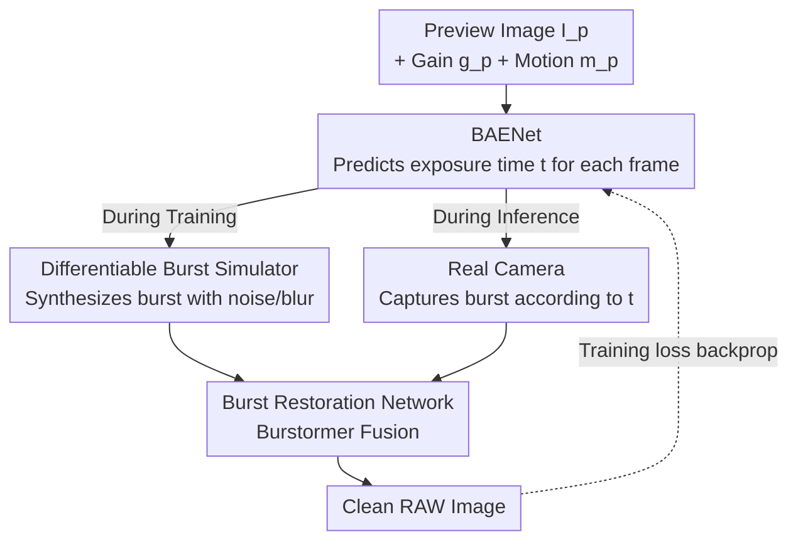

# Dynamic Exposure Burst Image Restoration

**Conference**: CVPR 2026  
**Paper**: [CVF Open Access](https://openaccess.thecvf.com/content/CVPR2026/html/Kim_Dynamic_Exposure_Burst_Image_Restoration_CVPR_2026_paper.html)  
**Code**: None (Only reuses [Burstormer](https://github.com/akshaydudhane16/Burstormer) as the restoration backbone)  
**Area**: Image Restoration / Computational Photography  
**Keywords**: Burst Image Restoration, Auto-exposure, Differentiable Simulation, Low-light Imaging, Non-uniform Exposure

## TL;DR
DEBIR integrates "predicting optimal exposure time for each burst frame" as a learnable module into the burst restoration pipeline for the first time. BAENet predicts the exposure time for each frame based on preview images, gain, and motion magnitude. A burst simulator differentiable with respect to exposure time connects it with the restoration network for end-to-end training. In low-light scenarios, the restoration PSNR is 0.28 dB higher than that of fixed exposure settings, and the effectiveness is validated on a real dual-camera system.

## Background & Motivation
**Background**: Burst imaging is a mainstream method for smartphones and cameras to obtain high-quality images in low-light and high-noise scenarios—taking multiple shots and leveraging the randomness of noise to fuse them into a clean image. Recent works (DBSR, BIPNet, Burstormer, Mehta, etc.) focuses primarily on "alignment + fusion" algorithms, with increasingly powerful networks.

**Limitations of Prior Work**: All these methods assume that burst frames use the **same exposure settings** (same exposure time + gain). Consequently, the noise level and degree of blur are similar across frames, providing little "complementary information," which limits the gain from fusion. Some methods using non-uniform exposure (e.g., exposure bracketing) use **predefined fixed levels** (e.g., {8, 24, 40, 56}/1920 seconds), which may not be suitable for different scenes.

**Key Challenge**: There is a trade-off between exposure time $t$ and gain $g$—long exposure increases the signal-to-noise ratio (SNR) but causes motion blur; short exposure avoids blur but relies on high gain to reduce time, which amplifies noise. Static scenes should favor long exposure to suppress noise, while dynamic scenes should favor short exposure to prevent blur. **The optimal exposure depends on the specific shooting environment, which fixed levels naturally cannot adapt to.**

**Goal**: (1) Adaptively predict an optimal exposure time for each burst frame; (2) directly optimize the "exposure prediction" with "final restoration quality" as the objective, rather than using empirical levels.

**Key Insight**: The authors notice that modern cameras already have a real-time **preview stream** before the shutter is pressed. The preview image itself carries information about the noise distribution, content, and inter-frame motion of the scene. Therefore, the preview information can be used to predict the exposure times for the sequence of shots at the moment the shutter is pressed.

**Core Idea**: A lightweight network, BAENet, is used to map "preview image + gain + motion magnitude" to "exposure time per frame." A **differentiability-with-respect-to-exposure-time** burst simulator is created, allowing the gradient of the restoration loss to propagate back to the exposure prediction network—realizing "direct supervision of exposure prediction using restoration loss" for the first time.

## Method

### Overall Architecture
The input to DEBIR is a preview RAW image (along with its gain $g_p$ and motion magnitude $m_p$ relative to the previous preview frame) taken before the shutter is pressed, and the output is a clean RAW image. It assumes a typical imaging scenario for modern cameras where a real-time preview stream exists and auto-exposure (AE) has been performed for the scene to estimate a target exposure value $e$. The process is:

1. The user presses the shutter → **BAENet** predicts the exposure times $\mathbf{t}=\{t_1, \dots, t_n\}$ for $n$ frames from preview information; the gain for each frame is calculated as $g_i = ke/t_i$ to ensure **consistent brightness but different noise/blur levels** across all frames (enabling complementarity).
2. The imaging system captures $n$ RAW burst frames according to the predicted $(t_i, g_i)$.
3. The **restoration network** fuses these $n$ RAW frames into a clean RAW image.

The key challenge lies in training: to supervise BAENet, a ground-truth exposure sequence (i.e., which sequence of exposure times yields the best restoration result for a given scene) is theoretically needed. This would require capturing all exposure combinations and comparing them with a clean image, which is practically infeasible. The authors' solution is to use a **differentiable burst simulator** to **replace the real camera** during training: BAENet provides exposure times → the simulator synthesizes bursts with realistic noise/blur → the restoration network restores the image → loss is calculated against the clean image → gradients pass through the simulator back to BAENet. During inference, the simulator is removed and replaced by a real camera.

### Key Designs

**1. BAENet: Predicting per-frame exposure using preview information and constrained budget via bounded softmax**

This is the core of DEBIR that distinguishes it from all fixed-level methods. BAENet takes three inputs: preview RAW image $I_p$, its gain $g_p$, and motion magnitude $m_p$ (defined as the average magnitude of optical flow vectors between $I_p$ and the previous preview frame $I_p'$, calculated in the sRGB domain using an off-the-shelf estimator). Each serves a purpose—$g_p$ reflects the current noise level (higher gain means more noise), $m_p$ reflects camera/object motion (determining blur risk), and $I_p$ provides detailed noise/blur distributions and scene content that the other two cannot characterize. The network backbone uses a lightweight MobileNetV2, where $g_p$ and $m_p$ are concatenated along the channel dimension with $I_p$ (both are shift+scale normalized to $[0, 1]$ due to their different scales).

Directly predicting arbitrary long exposure times would lead to unstable training due to an unbounded search space. The authors' approach is to constrain the total exposure budget $\sum_i t_i \le t_u$: the last layer of MobileNetV2 is modified to output $n+1$ dimensions, which passes through a bounded softmax to ensure each element is positive and their sum is 1. The first $n$ elements are multiplied by the upper bound $t_u$ to obtain the exposure times for each frame, while the $(n+1)$-th element absorbs the remainder of the "unused budget":

$$t_i = t_u \cdot \mathrm{softmax}_{\mathrm{bounded}}(f_i, \epsilon)$$

where $f_i$ denotes the feature values before the bounded softmax, and the output is clamped between $[\epsilon, 1-n\epsilon]$, with $\epsilon = t_{\min}/t_u$ ($t_{\min}=1/240$ seconds is the minimum system exposure time). This ensures that each frame's exposure is positive, fixes the exposure budget, maintains training stability, and naturally supports an arbitrary number of frames $n$.

**2. Differentiable Burst Simulator: Allowing restoration loss gradients to propagate through "exposure time"**

This is the key engineering effort that enables "supervising exposure prediction with restoration loss." The simulator is a module with **no learnable parameters**. Given exposure times $\mathbf{t}$, gains $\mathbf{g}$, and a sequence of scene irradiances $\mathbf{S}$ (represented by high-frame-rate RAW video frames, with each frame corresponding to an exposure duration $e_S=1/1920$ seconds), it synthesizes burst frames with realistic blur and noise. It first calculates the start and end times for each frame $t_i^s, t_i^e$ (first frame starts from constant $t^0$, subsequent frames $t_i^s = t_{i-1}^e + \delta$, frame interval $\delta=7/1920$ seconds, $t_i^e = t_i^s + t_i$), then synthesizes the $i$-th frame following:

$$\mathrm{syn}(\mathbf{S}, t^s, t^e, g) = \mathrm{clip}\circ \mathrm{cfa}\left(S_{s,e} + gN\right)$$

Blur results from integrating the irradiance $S_{s,e}$ over the exposure period (longer exposure accumulates more motion → more blur). The endpoints of the integration use linear interpolation weights $\alpha_s = \lceil\bar t^s\rceil - \bar t^s$ and $\alpha_e = \bar t^e - \lfloor\bar t^e\rfloor$ for soft blending, making $S_{s,e}$ differentiable with respect to **continuous** exposure time ($\bar t = t/e_S$). Noise $N$ is modeled as shot/read noise using a heteroscedastic Gaussian $\mathcal{N}(0, \lambda_{\mathrm{read}} + \lambda_{\mathrm{shot}}S_{s,e})$. Since sampling is not differentiable, the reparameterization trick is used to rewrite it as $N = \sqrt{\lambda_{\mathrm{read}} + \lambda_{\mathrm{shot}}S_{s,e}}\cdot Z,\ Z\sim\mathcal{N}(0,1)$, making $N$ differentiable with respect to $S_{s,e}$ (and thus $\mathbf{t}$).

Compared to the real degradation model (Eq. 2), the simulator has two intentional simplifications: ① Quantization is removed to ensure non-zero gradients; ② Scene irradiance is not amplified, only noise $N$ is amplified by the gain—as the framework assumes the gain of each frame is inversely proportional to the exposure time, resulting in identical brightness but different noise levels, which is the source of "complementary information." Preview images and ground-truth (taken from the sharp irradiance of the first frame $I_{gt}=\mathrm{cfa}(S_{\bar t^0})$) are also synthesized by the same simulator.

**3. Three-stage Alternating Training: Resolving training collapse caused by mutual dependency between BAENet and restoration network**

Although the differentiable simulator allows end-to-end training, joint training of BAENet and the restoration network from scratch is extremely unstable and prone to local minima: in the early stages, BAENet provides random exposures, and the restoration network prematurely adapts to these poor exposures. This bias in turn "locks" BAENet into catering to the restoration network's current capabilities rather than seeking the true optimum. The authors decompose this into three stages:

- **S1 Pre-train restoration network**: Synthesize bursts with randomly sampled exposure times and gains so the restoration network first learns to handle various exposure inputs. The loss is $\mathcal{L}_{\mathrm{restore}} = \|\mathrm{res}_\phi(\mathbf{I}) - I_{gt}\|_1$.
- **S2 Train BAENet** (fixed restoration network), divided into two sub-steps: **warm-up** (S2-1) first uses a set of predefined exposure combinations $E$ to perform simulation + restoration one by one, selecting the combination with the best restoration as the pseudo ground-truth $\mathbf{t}_{\mathrm{pseudo\text{-}gt}}$, then pulls BAENet to reasonable initial values with $\mathcal{L}_{\mathrm{warm\text{-}up}} = \|\mathrm{bae}_\theta(I_p,g_p,m_p) - \mathbf{t}_{\mathrm{pseudo\text{-}gt}}\|_1$; **main training** (S2-2) then fine-tunes exposure prediction using the actual restoration loss $\mathcal{L}_{\mathrm{DEBIR}} = \|\mathrm{res}_\phi(\mathrm{sim}(\mathrm{bae}_\theta(I_p,g_p,m_p))) - I_{gt}\|_1$.
- **S3 Fine-tune restoration network** (fixed BAENet): Re-use $\mathcal{L}_{\mathrm{DEBIR}}$ to adapt the restoration network to the optimal exposure distribution provided by BAENet.

To prevent over-fitting across stages, the dataset $D$ is split into non-overlapping $D_{\mathrm{restore}}$ (4,092 segments) and $D_{\mathrm{BAENet}}$ (1,127 segments), preventing the restoration network from developing a preference for "exposure-burst" combinations seen in S1, which would contaminate BAENet in S2.

### Loss & Training
The three stages correspond to three L1 losses (see above: $\mathcal{L}_{\mathrm{restore}}$ / $\mathcal{L}_{\mathrm{warm\text{-}up}}$ / $\mathcal{L}_{\mathrm{DEBIR}}$). The restoration network is pre-trained for 500 epochs (lr 3e−4), BAENet is trained for 100 epochs (lr 1e−7, including 35 epochs of warm-up), and the restoration network is fine-tuned for 50 epochs (lr 1e−5), all using cosine annealing + AdamW. Default exposure upper bound $t_u=128/1920$ seconds, burst frames $n=4$, trained on 4×RTX 3090 with batch=4 and 256×256 size. Training data are synthesized from GoPro (with motion) and RealBlur (static scenes) videos via gamma expansion + random inverse CCM/WB to RAW, followed by 8× frame interpolation to 1920 FPS. Totaling 5,219 segments for training and 532 segments for evaluation.

## Key Experimental Results

### Main Results
Comparison with various auto-exposure/predefined exposure methods on the test set (all followed by Burstormer restoration and the same pre-training + fine-tuning pipeline for fairness):

| Method | PSNR↑ | SSIM↑ | LPIPS↓ |
|------|-------|-------|--------|
| Digital-Gimbal | 33.87 | 0.9309 | 0.187 |
| Active S-L | 33.89 | 0.9379 | 0.176 |
| Average AE | 34.69 | 0.9484 | 0.157 |
| Gradient AE | 34.86 | 0.9494 | 0.156 |
| Exposure Bracket (Fixed) | 35.04 | 0.9481 | 0.164 |
| **DEBIR (Ours)** | **35.32** | **0.9519** | **0.154** |

Single-exposure Average/Gradient AE have consistent noise and blur across frames, lacking complementary information; fixed exposure bracketing is non-uniform but cannot adapt to scenes; Digital-Gimbal exposure parameters are frozen after training; Active S-L can only handle two frames and is not scalable. DEBIR predicts exposure per scene per frame, yielding superior restoration quality.

On a real dual-camera system (one camera using BAENet, one using exposure bracketing, simultaneously capturing 142 low-light bursts, evaluated with no-reference metrics):

| Method | NIQE↓ | BRISQUE↓ | TOPIQ↑ |
|------|-------|----------|--------|
| Exposure Bracket | 6.57 | 50.66 | 0.339 |
| **DEBIR (Ours)** | **6.34** | **46.90** | **0.363** |

BAENet inference including optical flow estimation takes only 0.023 seconds, proving practicality.

### Ablation Study

| Configuration | PSNR↑ | Description |
|------|-------|------|
| Full (preview+gain+motion) | 35.32 | Full input |
| w/o Preview Image | 34.80 | Removing preview causes largest drop (-0.52) |
| w/o Motion Info. | 35.13 | Removing motion information (-0.19) |
| w/o Gain | 35.21 | Removing gain (-0.11) |

Ablation of training strategies (S1 Restore pre-train / S2-1 warm-up / S2-2 BAENet main / S3 Restore fine-tune / E2E end-to-end):

| Training Strategy | PSNR↑ | SSIM↑ | LPIPS↓ |
|----------|-------|-------|--------|
| S1, S2-2 | 34.93 | 0.9482 | 0.162 |
| S1, S2-1, S2-2 | 35.01 | 0.9489 | 0.160 |
| S1, S2-2, S3 | 35.16 | 0.9502 | 0.157 |
| **S1, S2-1, S2-2, S3 (Full)** | **35.32** | **0.9519** | **0.154** |
| E2E (Pure end-to-end) | 33.60 | 0.9279 | 0.196 |

### Key Findings
- **Preview image is the most critical input**: Removing it leads to a 0.52 dB drop, as it covers noise distribution, blur, and content. Motion information is more important than gain (-0.19 vs -0.11).
- **Training strategy is vital**: Pure end-to-end training yields only 33.60 dB, nearly 1.7 dB lower than the full three-stage strategy, confirming the analysis that "mutual dependency between BAENet and restoration network leads to collapse"; warm-up (S2-1) and restoration network fine-tuning (S3) each bring considerable gains.
- **Non-uniform exposure is valuable**: Modifying BAENet to predict a single uniform exposure across frames drops PSNR from 35.32 to 35.01 (-0.31 dB).
- **BAENet predictions align with physical intuition**: Larger motion $m_p$ leads to shorter $t_1$ to prevent blur; larger gain $g_p$ (more noise) leads to longer $t_1$ to suppress noise; BAENet adjusts adjacent frames in opposite directions (e.g., $t_1$ short for anti-blur, $t_2$ long for color/denoising), actively creating complementary information.
- **Scalable to any number of frames**: DEBIR consistently outperforms fixed exposure bracketing for $n=2, 4, 6, 8$ (e.g., 36.11 vs 35.89 at $n=8$), with larger gains as frame count increases.

## Highlights & Insights
- **Turning "exposure setting" from manual hyperparameter to learnable module**: Previous burst restoration works focused on network structures while treating exposure as a fixed prerequisite. This work is the first to use restoration loss to directly supervise exposure prediction, shifting the perspective to "decide how to shoot before deciding how to fix."
- **Differentiable burst simulator is the technical pivot**: Linear interpolation for endpoint differentiability and the reparameterization trick for noise sampling differentiability combine to let gradients propagate through "exposure time"—a discrete/physical quantity. This approach is transferable to any imaging task wanting to learn physical acquisition parameters (e.g., shutter, ISO, focus).
- **Bounded softmax for exposure budget constraint is elegant**: It solves "fixed total budget + positive per-frame exposure + remaining allowance" using a single $n+1$ dimensional softmax and naturally supports arbitrary frame counts.
- **Insight on actively creating complementary information**: BAENet learns not to make "every frame best," but to make adjacent frames complementary (one anti-blur, one denoising), which aligns better with the essence of burst fusion than single-frame optimality.

## Limitations & Future Work
- The authors acknowledge that BAENet does not guarantee a global optimal exposure—it predicts based on limited information before the shot is taken and risks falling into local minima; exhaustive search could theoretically find better combinations.
- Designed and validated only for **low-light RAW** scenarios; applicability to bright light, HDR, or non-Bayer sensors remains unverified. ⚠️ Real system evaluation involves only 142 shots and uses no-reference metrics, which is limited in sample size and rigor.
- The simulator relies on converting video to RAW via inverse ISP to create training data; the sim-to-real gap might affect real-world performance (partially mitigated by the dual-camera system).
- Future Work: The authors suggest further **joint prediction of exposure time and burst frame count**, while incorporating practical constraints like power consumption into the optimization objective.

## Related Work & Insights
- **vs Uniform Exposure Burst Restoration (DBSR / BIPNet / Burstormer)**: These assume identical exposure across frames and focus on alignment/fusion; this work reuses Burstormer as a backbone but adds adaptive exposure prediction, moving the performance bottleneck from "fusion algorithm" to "acquisition strategy."
- **vs Fixed-level Non-uniform Exposure (Exposure Bracketing / Zhang et al.)**: Both use non-uniform exposure, but this work predicts dynamically per scene rather than using fixed levels, showing a 0.28 dB improvement (35.32 vs 35.04).
- **vs Learning-based Exposure Prediction (Digital-Gimbal / Active S-L / Liba motion metering)**: Digital-Gimbal exposure parameters are frozen after training; Active S-L treats exposure as classification with a predefined set that grows exponentially with frame count and only supports two frames; Liba uses motion metering but assumes uniform exposure. This work predicts continuous exposure per frame, adapts to scenes, and scales to any frame count, offering a more thorough solution.

## Rating
- Novelty: ⭐⭐⭐⭐⭐ First to use restoration loss to directly supervise per-frame exposure prediction; differentiable burst simulator is a genuine new tool.
- Experimental Thoroughness: ⭐⭐⭐⭐ Comprehensive baseline comparisons and solid ablation studies; however, real-world evaluation sample is small and lacks horizontal comparison on mainstream burst benchmarks.
- Writing Quality: ⭐⭐⭐⭐⭐ Clear logic from motivation to difficulty and solution; complete description of formulas and training strategies.
- Value: ⭐⭐⭐⭐ Provides a differentiable paradigm for "learned acquisition parameters" in computational photography; clear industrial potential, though gain magnitude (approx. 0.3 dB) is relatively moderate.

## Related Papers

- [\[CVPR 2026\] Self-supervised Dynamic Heterogeneous Degradation Modeling for Unified Zero-Shot Image Restoration](self-supervised_dynamic_heterogeneous_degradation_modeling_for_unified_zero-shot.md)
- [\[CVPR 2026\] ExpoCM: Exposure-Aware One-Step Generative Single-Image HDR Reconstruction](expocm_exposure-aware_one-step_generative_single-image_hdr_reconstruction.md)
- [\[CVPR 2026\] Flickerformer: A Duet of Periodicity and Directionality for Burst Flicker Removal](it_takes_two_a_duet_of_periodicity_and_directionality_for_burst_flicker_removal.md)
- [\[CVPR 2026\] RawMetaDiff: Unlocking Extreme Darkness from Dual-Exposure RAW with Meta-Guided Diffusion](rawmetadiff_unlocking_extreme_darkness_from_dual-exposure_raw_with_meta-guided_d.md)
- [\[CVPR 2026\] Human-Centric Multi-Exposure Fusion: Benchmark and Bi-level Cognition Distillation Framework](human-centric_multi-exposure_fusion_benchmark_and_bi-level_cognition_distillatio.md)

<!-- RELATED:END -->

<!-- RELATED:START -->

## Related Papers

- [\[CVPR 2026\] Self-supervised Dynamic Heterogeneous Degradation Modeling for Unified Zero-Shot Image Restoration](self-supervised_dynamic_heterogeneous_degradation_modeling_for_unified_zero-shot.md)
- [\[CVPR 2026\] Blink: Dynamic Visual Token Resolution for Enhanced Multimodal Understanding](blink_dynamic_visual_token_resolution_for_enhanced_multimodal_understanding.md)
- [\[CVPR 2026\] Customized Fusion: A Closed-Loop Dynamic Network for Adaptive Multi-Task-Aware Infrared-Visible Image Fusion](customized_fusion_a_closed-loop_dynamic_network_for_adaptive_multi-task-aware_in.md)
- [\[CVPR 2026\] Residual Diffusion Bridge Model for Image Restoration](residual_diffusion_bridge_model_for_image_restoration.md)
- [\[CVPR 2026\] Beyond the Ground Truth: Enhanced Supervision for Image Restoration](beyond_the_ground_truth_enhanced_supervision_for_image_restoration.md)

<!-- RELATED:END -->
