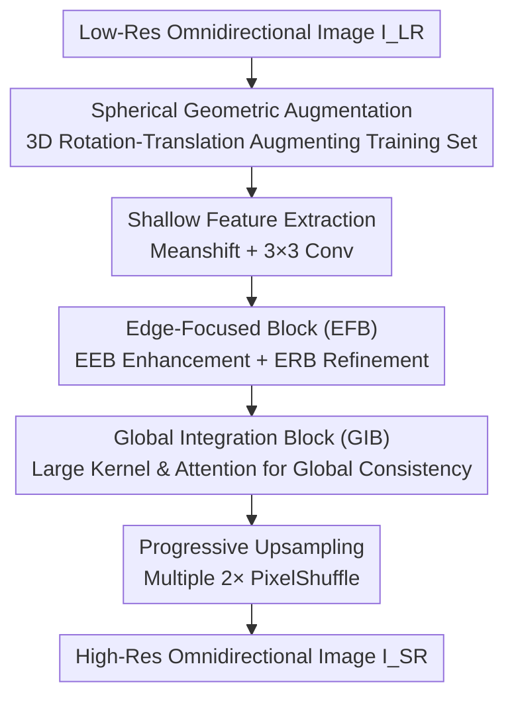

# Edge-Focused Super-Resolution for Omnidirectional Images with Spherical Geometric Augmentation

**Conference**: CVPR 2026  
**Paper**: [CVF Open Access](https://openaccess.thecvf.com/content/CVPR2026/html/Wang_Edge-Focused_Super-Resolution_for_Omnidirectional_Images_with_Spherical_Geometric_Augmentation_CVPR_2026_paper.html)  
**Code**: To be confirmed  
**Area**: Image Restoration / Omnidirectional Image Super-Resolution  
**Keywords**: Omnidirectional Image Super-Resolution, Edge Preservation, Spherical Geometric Augmentation, Multi-Scale Attention, ERP

## TL;DR
To address the two major pain points of "scarce public data + edge collapse" in omnidirectional images under extreme 8×/16× magnification, this paper proposes an end-to-end lightweight network, EAM. EAM enhances edge capture and global consistency using an Edge-Focused Block (EFB = Edge Enhancement Block (EEB) + Edge Refinement Block (ERB)) and a Global Integration Block (GIB), coupled with a rotation-translation data augmentation framework based on spherical projection. On ODI-SR / SUN360, EAM achieves WS-PSNR performance that surpasses existing SOTA methods (outperforming FATO by 1.15dB/1.13dB on ODI-SR) with only approximately 2.0M parameters and 38G FLOPs.

## Background & Motivation
**Background**: Omnidirectional images (ODIs, usually stored in Equirectangular Projection, ERP) are often of low resolution due to storage, transmission, and bandwidth limitations, while Head-Mounted Display (HMD) users require high-definition details, making Omnidirectional Image Super-Resolution (ODISR) a critical demand. Single Image Super-Resolution (SISR) has advanced significantly over the years through CNNs (SRCNN/EDSR/RCAN), GANs (SRGAN/ESRGAN), ViTs (IPT/SwinIR), and Diffusion Models (ResShift). ODISR builds on this by handling projection distortions, with two mainstream approaches: multi-projection fusion (stitching spherical/planar projections to increase information) and region adaptation (using deformable convolutions or latitude-based partitioning to adapt to the non-uniform distortion of ERP).

**Limitations of Prior Work**: The authors point out two specific shortcomings. First, **data scarcity**: public datasets relied upon by ODISR contain only about 1200 samples, and there is a lack of augmentation techniques that preserve spherical geometry. Directly applying 2D rotation/translation destroys the spherical topology, causing unnatural stretching near the equator and compression at the poles, which leads to edge distortion. Second, **poor edge preservation**: existing methods lack dedicated edge-focused designs and, due to complex network architectures, commonly use patch- or region-level inputs followed by output stitching, resulting in visible seams and broken edges between patches (e.g., the non-overlapping partitioning in LAU-Net causes inter-block 'faults').

**Key Challenge**: Under extreme magnifications like 8×/16×, super-resolution fundamentally boils down to recovering boundaries and contours from very sparse high-frequency information. However, patch-stitching architectures and 2D-style augmentations systematically damage edge continuity and geometric consistency. The higher the magnification factor, the more fatal this damage becomes.

**Goal**: (1) To expand the diversity of training data without breaking the spherical geometry; (2) To design an end-to-end (non-overlapping, non-stitching) lightweight network that unifies local edge restoration and global contour consistency.

**Key Insight**: An omnidirectional image is essentially a 2D projection of a 3D spherical scene, where pixels adhere to spherical geometry. Therefore, data augmentation should be performed via rotation and translation within 3D spherical coordinates rather than on a 2D plane. Since edges are the core of visual semantics, network design should focus heavily on boundary preservation and refinement.

**Core Idea**: Constructing data using 'spherical 3D rotation-translation augmentation' + performing end-to-end reconstruction with an 'Edge-Aware Multi-Scale network (EAM)', avoiding patch-stitching and focusing on edge restoration.

## Method

### Overall Architecture
The proposed method consists of two parts: spherical geometric augmentation on the **data side** (offline expansion of the ODI-SR training set), and the Edge-Aware Multi-Scale (EAM) network on the **model side**. EAM is an end-to-end, non-downsampling pipeline. Given an input low-resolution image $I_{LR}\in\mathbb{R}^{3\times H\times W}$, shallow feature extraction (brightness bias removal + 3×3 convolution to retain original spatial structures and fundamental edges) is first performed to obtain $F_p$. Then, it passes through cascaded Edge-Focused Blocks (EFB, consisting of an Edge Enhancement Block/EEB and an Edge Refinement Block/ERB) to obtain $F_r$, advancing the edges under the same scale from 'local restoration' to 'detail refinement'. Next, the Global Integration Block (GIB) is utilized to expand the receptive field and capture long-range dependencies to obtain $F_l$, correcting the issue where cascaded EFBs overly focus on local areas and lack global correlation. Finally, progressive upsampling (decomposing the target factor into multiple 2× PixelShuffle layers + 3×3 convolutions to compensate for high frequencies) gradually enlarges and reconstructs $I_{SR}\in\mathbb{R}^{3\times\alpha H\times\alpha W}$ ($\alpha=8$ or $16$). Feature downsampling is avoided throughout the process, preventing the loss of spatial and edge information crucial for boundary restoration.

### Key Designs

**1. Spherical Geometric Rotation-Translation Augmentation: Constructing Data in 3D Spherical Space without Restricting Panoramic Topology**

To address the pain point of 'data scarcity + 2D augmentation destroying spherical geometry,' the authors avoid performing rotation/translation on the 2D plane. Instead, they map the ERP image back to the 3D sphere before applying geometric transformations. Given an input image $I_i(u,v)$, the 2D coordinates are converted into azimuth and polar angles according to ERP properties: $\varphi_i=2\pi\frac{u}{W},\ \theta_i=\pi\frac{v}{H}$, and then transformed into 3D spherical coordinates $x_p=\cos\varphi_i\sin\theta_i,\ y_p=\sin\varphi_i\sin\theta_i,\ z_p=\cos\theta_i$. Subsequently, rotation matrices around the X/Y/Z axes $R_x(\alpha), R_y(\beta), R_z(\gamma)$ are applied to perform the 3D transformation on the entire scene:

$$\begin{bmatrix}x_p'\\ y_p'\\ z_p'\end{bmatrix}=R\begin{bmatrix}x_p\\ y_p\\ z_p\end{bmatrix},\quad \varphi_i'=\operatorname{arctan2}(y_p',x_p'),\ \theta_i'=\arccos(z_p')$$

Finally, they are mapped back to the 2D image space: $u_p'=\frac{W}{2\pi}\varphi_i',\ v_p'=\frac{H}{\pi}\theta_i'$. A distinction is made in the design: **translation** is implemented as rotation around the Z-axis by $\gamma\in[0,2\pi]$, while **rotation** is restricted to small-angle rotations around the X-axis $\alpha$ or Y-axis $\beta$ within a narrow range of $[-\frac{\pi}{12}, \frac{\pi}{12}]$. This design is effective because spherical translation preserves the 360° toroidal structure without edge truncation or padding, and spherical rotation conforms to spherical geometry, preventing distortion of key features. In contrast, traditional 2D translations/rotations introduce truncation, padding, edge distortion, and destruction of the toroidal topology. Ablation studies show that this method improves WS-PSNR for 8× magnification from 24.70 to 25.69.

**2. Edge-Focused Block (EFB) (EEB Enhancement + ERB Refinement): First 'Extracting' then 'Cleaning Up' Blurry Edges**

To address the lack of edge-focused designs in existing methods, EFB splits edge processing into a cascaded two-step approach consisting of enhancement (EEB) and refinement (ERB), maintaining features at the same scale throughout. **EEB (Edge Enhanced Block)** addresses the issue where low-resolution image edges are blurry and standard convolutions fail to distinguish true edges. It utilizes three branches: the multi-scale feature extraction branch uses a 3×3 convolution followed by GELU to obtain basic features, and then employs dilated convolutions with dilation rates of 1/2/3 to capture local fine edges, object contours, and global structures, concatenating them into $X_{multi}$; the edge-aware channel attention branch pools the spatial dimensions to 1×1 to focus on channel dimensions, computing $A_c=\sigma(\text{Conv}_{1\times1}(\text{Conv}_{1\times1}(\text{Pool}(\text{Conv}_{3\times3}(X)))))$ to reinforce edge-related channels; the edge-aware spatial attention branch uses a 3×3 convolution followed by a 7×7 large kernel to compress the channels to 1 and focus on spatial dimensions, yielding $A_s=\sigma(\text{Conv}_{7\times7}(\text{Conv}_{3\times3}(X)))$ to model wide-range edge continuity. These three are fused via gated residual fusion: $X_1=X+\text{BN}(\text{Conv}_{3\times3}(X_{multi})\otimes A_c\otimes A_s)$. **ERB (Edge Refined Block)** then refines $X_1$: one branch uses a 7×7 depthwise convolution (groups=C) to expand the receptive field to obtain $X_d$; another branch uses a 1×1/3×3/5×5 multi-path convolution covering pixel-level, local texture, and large structures to obtain $X_f$; and a third branch generates a single-channel edge reliability map $M_e\in[0,1]^{1\times H\times W}$. Finally, a learnable weight $\alpha$ is used to adaptively balance the original and refined features: $X_2=(1-\alpha)\cdot X_1+\alpha\cdot(X_r\otimes M_e)$. This 'enhancement $\rightarrow$ refinement + edge reliability weighting' combination allows the network to enhance only the actual edge regions while preserving non-edge features.

**3. Global Integration Block (GIB): Compensating for Neglected Long-Range Consistency in Cascaded EFBs**

To address the issue where 'multiple cascaded EFBs easily overfocus on local details and lack global correlation,' the GIB uses multi-scale large-kernel convolutions coupled with attention fusion to expand the receptive field and recover global structures. It first uses a 1×1 convolution + GELU to obtain $X_{init}$, followed by a dual-branch context extraction: Branch 1 uses a 7×7 depthwise convolution to capture medium-range context yielding $X_{scale1}$, and Branch 2 uses a 9×9 depthwise convolution with a dilation rate of 2 to build a larger receptive field yielding $X_{scale2}$ (combining depthwise and pointwise convolutions keeps the computational cost manageable while expanding the receptive field). It then performs channel-adaptive attention fusion: $A=\sigma(\text{Conv}_{1\times1}(\text{Concat}(X_{scale1},X_{scale2})))$, and element-wise multiplies the weights with the input $Y$, followed by 1×1 convolution refinement, outputting $X_{out}=\text{Conv}_{1\times1}(Y\otimes A)$. This is effective because global semantics and local details are strongly correlated in super-resolution, which traditional convolutions with fixed receptive fields struggle to balance. GIB ensures coordination between local edges and overall contours, avoiding local distortion and global structural inconsistency. In the ablation studies, removing the GIB causes the most significant performance drop (WS-PSNR 25.69 $\rightarrow$ 24.95), indicating that global consistency is particularly critical under extreme magnification.

### Loss & Training
EAM uses a multi-objective joint loss to optimize collaboratively across pixel, feature, and structural levels:

$$L_{Total}=L_{L1}+0.01\times L_{Perceptual}+0.1\times(1-L_{SSIM})$$

Specifically, $L_{L1}$ ensures the baseline pixel-to-pixel mapping and speeds up convergence; the perceptual loss (weighted at 0.01, based on pretrained VGG extracting multi-scale high-level features) optimizes visual perception quality; and the SSIM loss (weighted at 0.1, converted from the SSIM metric) drives structural consistency and reduces misalignment. The weights of these three losses are set to standard values. Training is conducted on the ODI-SR dataset (1024×2048) with spherical augmentation applied, where low-resolution inputs are generated by directly resizing the high-resolution images (8×/16×). The Adam optimizer is utilized with an initial learning rate of 0.001 and a batch size of 4.

## Key Experimental Results

### Main Results
Evaluations on 8×/16× super-resolution are conducted on ODI-SR and SUN360 datasets, evaluated using WS-PSNR / WS-SSIM (utilizing the official ODI-SR metric code, consistent with LAU-Net and OSRT). EAM achieves the best results across all WS-PSNR scenarios, outperforming the representative FATO method by 1.15dB (8×: 24.54 $\rightarrow$ 25.69) and 1.13dB (16×: 22.73 $\rightarrow$ 23.86) on ODI-SR.

| Method | ODI-SR ×8 PSNR | ODI-SR ×16 PSNR | SUN360 ×8 PSNR | SUN360 ×16 PSNR |
|------|------|------|------|------|
| Bicubic | 19.64 | 17.12 | 19.72 | 17.56 |
| EDSR[14] | 23.97 | 22.24 | 23.79 | 21.83 |
| RCAN[37] | 24.26 | 22.49 | 23.88 | 21.86 |
| LAU-Net[7] | 24.36 | 22.52 | 24.24 | 22.05 |
| SphereSR[31] | 24.37 | 22.51 | 24.17 | 21.95 |
| OSRT[32] | 24.53 | 22.69 | 24.38 | 22.13 |
| BPOSR[22] | 24.61 | 22.72 | 24.47 | 22.16 |
| FATO[1] | 24.54 | 22.73 | 24.42 | 22.18 |
| LAPR[2] | 24.72 | 22.90 | 24.53 | 22.37 |
| GDGT-OSR[29] | 24.60 | 22.78 | **25.00** | **22.60** |
| MambaOSR[26] | 24.62 | 22.66 | 24.49 | 22.12 |
| **EAM (Ours)** | **25.69** | **23.86** | **25.81** | **23.49** |

In terms of efficiency, EAM is highly lightweight: requiring only 38G FLOPs, 2.0M parameters, and 0.022s inference time on ODI-SR 16×, which is significantly lower than SwinIR, LAU-Net, SphereSR, and LAPR.

| Model | FLOPs | Parameters | Inference Time |
|------|-------|--------|----------|
| SwinIR[13] | 900 G | 11.5 M | 0.982 s |
| 360-SS[16] | 15 G | 1.6 M | 0.025 s |
| LAU-Net[7] | 685 G | 9.4 M | 0.443 s |
| SphereSR[31] | 587 G | 8.7 M | 0.401 s |
| LAPR[2] | 372 G | 7.8 M | 0.312 s |
| **EAM (Ours)** | **38 G** | **2.0 M** | **0.022 s** |

### Ablation Study
Three groups of ablation studies are conducted on ODI-SR, changing only one component at a time.

| Ablation Target | Configuration | WS-PSNR (×8) | WS-SSIM (×8) |
|----------|------|------|------|
| Data Augmentation | Original Data | 24.70 | 0.6529 |
| Data Augmentation | Spherical Augmentation | **25.69** | **0.6839** |
| Component | w/o EEB | 25.17 | 0.6691 |
| Component | w/o ERB | 25.17 | 0.6699 |
| Component | w/o GIB | 24.95 | 0.6539 |
| Component | Full EAM | **25.69** | **0.6839** |
| Loss | w/o SSIM (L1+Perc) | 25.29 | 0.6665 |
| Loss | w/o Perceptual (L1+SSIM) | 25.27 | 0.6690 |
| Loss | Full Three Losses | **25.69** | **0.6839** |

### Key Findings
- **Data augmentation contributes the most significantly**: Spherical augmentation improves 8× WS-PSNR by approximately 1.0dB (24.70 $\rightarrow$ 25.69) and WS-SSIM from 0.6529 to 0.6839, with a similar gain observed at 16×. This is the single largest performance gain, validating that 'constructing data within the 3D sphere' is the correct approach.
- **GIB is the module whose omission causes the largest performance drop**: Removing the GIB drops the WS-PSNR to 24.95 (a decrease of about 0.74dB), which is more severe than removing EEB/ERB (both dropping to 25.17), indicating that global consistency integration is highly critical under extreme magnification. The authors also emphasize that removing a single module in ODISR usually only brings about a subtle drop at the 'first decimal place' level, but all three modules are essential and mutually indispensable.
- **The three losses are complementary**: The perceptual loss provides relatively weak constraints on geometric details and requires SSIM to refine structures. $L_1$ falls short in structural coherence and requires the perceptual loss to compensate. Removing any single loss drops the WS-PSNR from 25.69 to approximately 25.3.
- A noteworthy horizontal comparison caveat: On SUN360, GDGT-OSR's WS-SSIM (such as 0.7068 for 8×) still maintains an advantage in some scenarios. The advantage of EAM lies mainly in WS-PSNR and edge continuity. Different metrics emphasize different aspects, and conclusions should not be drawn solely based on a single metric.

## Highlights & Insights
- **'Returning augmentation to the 3D sphere' is the most direct insight**: Performing rotation/translation in spherical coordinates, where translation translates to Z-axis rotation and rotation is limited to small angles around the X/Y axes, expands the data size without destroying the 360° toroidal topology. This concept can be transferred to data augmentation for any ERP panoramic tasks (segmentation, detection, depth estimation).
- **End-to-end processing without partitioning or downsampling**: This directly addresses the legacy issue of seams and joint fractures caused by patch stitching. By processing at the same scale throughout, the model maintains a simple structure while keeping parameters at 2.0M and FLOPs at 38G, representing a rare combination of 'lightweight and high-quality'.
- **Weighting with the edge reliability map $M_e$**: ERB uses a single-channel $M_e\in[0,1]$ to indicate edge reliability, combined with a learnable $\alpha$ for adaptive fusion. This allows the network to 'only restore where necessary', providing a reusable edge-aware mechanism.

## Limitations & Future Work
- **Imbalanced metric improvements**: EAM primarily excels in WS-PSNR, but its WS-SSIM performance on SUN360 is not universally leading (partially surpassed by GDGT-OSR), indicating remaining scope for improvement in structural similarity. The authors also acknowledge that module gains in ODISR often constitute subtle enhancements at the level of the first decimal place.
- **Restricted augmentation angles**: Rotation is only allowed within a tight range of $[-\pi/12, \pi/12]$ (around X/Y-axes), excluding large angles, which may limit the further expansion of viewpoint diversity.
- **Overly idealized low-resolution image generation**: Low-resolution samples are obtained by directly resizing high-resolution images, without simulating real-world degradations like fisheye downsampling (as in OSRT). Robustness in real-world scenes remains to be validated.
- **Lack of systematic comparison with diffusion-based methods**: Although diffusion models (e.g., ResShift) are mentioned in the related work, they are not included in the main comparison table, leaving the differences with generative methods under extreme magnification undiscussed.

## Related Work & Insights
- **vs LAU-Net[7]**: LAU-Net partitions ERP images into blocks by latitude to learn distortions at different latitudes, but non-overlapping partition blocks lead to discontinuous information and visible seams between blocks. Ours adopts an end-to-end non-partitioning approach, fundamentally avoiding stitching cracks.
- **vs SphereSR[31]**: SphereSR constructs continuous spherical representations + a Spherical Local Implicit Function (SLIF) to support arbitrary projection super-resolution, but suffers from high computational complexity (587G FLOPs). EAM uses a lightweight CNN (38G) to exchange for higher WS-PSNR.
- **vs OSRT[32]**: OSRT utilizes fisheye downsampling to generate more realistic low-resolution samples and uses distortion-aware Transformer to conditionally learn offsets by latitude, yet still falls short on complex edge details and edge continuity in polar regions. Ours specifically uses EFB+GIB to reinforce edge continuity to fill this gap.
- **vs FATO[1] / LAPR[2] / MambaOSR[26]**: These are recent SOTA methods. Ours comprehensively outperforms them in WS-PSNR on ODI-SR with significantly lower parameters/FLOPs, demonstrating the excellent trade-off of 'edge-focused structure + spherical augmentation'.

## Rating
- Novelty: ⭐⭐⭐⭐ The combination of spherical 3D rotation-translation augmentation, Edge-Focused Block (EEB/ERB), and GIB is relatively novel, though individual innovations lean towards engineering designs.
- Experimental Thoroughness: ⭐⭐⭐⭐ Complete evaluations across two datasets, two scales, efficiency comparisons, and three groups of ablation studies; however, it lacks comparisons with real-world degradations and diffusion-based methods.
- Writing Quality: ⭐⭐⭐⭐ The mathematical formulations are clear, the motivations are transparent, and the figures map well with the text. The disclosure of certain scenarios where SSIM is not dominant is slightly brief.
- Value: ⭐⭐⭐⭐ Lightweight (2.0M/38G) and surpassing SOTA, providing direct value for practical omnidirectional super-resolution scenarios like HMDs.

<!-- RELATED:START -->

## Related Papers

- [\[NeurIPS 2025\] Implicit Augmentation from Distributional Symmetry in Turbulence Super-Resolution](../../NeurIPS2025/image_restoration/implicit_augmentation_from_distributional_symmetry_in_turbulence_super-resolutio.md)
- [\[CVPR 2025\] Progressive Focused Transformer for Single Image Super-Resolution](../../CVPR2025/image_restoration/progressive_focused_transformer_for_single_image_super-resolution.md)
- [\[CVPR 2026\] DiffDecompose: Layer-Wise Decomposition of Alpha-Composited Images via Diffusion Transformers](diffdecompose_layer-wise_decomposition_of_alpha-composited_images_via_diffusion_.md)
- [\[CVPR 2026\] Bridging the Perception Gap in Image Super-Resolution Evaluation](bridging_the_perception_gap_in_image_super-resolution_evaluation.md)
- [\[CVPR 2026\] TUDSR: Twice Upsampling-Diffusion for Higher Super-Resolution](tudsr_twice_upsampling-diffusion_for_higher_super-resolution.md)

<!-- RELATED:END -->
