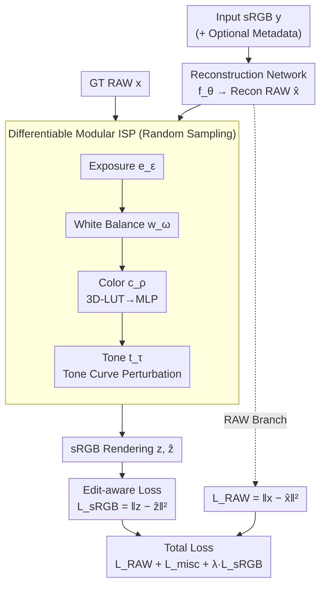

# Edit-aware RAW Reconstruction

**Conference**: CVPR2026  
**arXiv**: [2512.05859](https://arxiv.org/abs/2512.05859)  
**Code**: To be confirmed  
**Area**: Image Restoration / ISP / RAW Reconstruction  
**Keywords**: RAW reconstruction, differentiable ISP, edit-aware loss, photo post-processing, plug-and-play loss

## TL;DR
Addressing the mismatch where the true objective of RAW reconstruction is downstream post-editing while existing methods only optimize pixel-wise RAW fidelity, this paper proposes a plug-and-play **edit-aware loss**. By utilizing a differentiable, modular, and randomly parameterized simplified ISP to render both ground truth and reconstructed RAW to sRGB for error calculation, the reconstruction results become more robust under various rendering styles and edits, achieving an sRGB PSNR gain of up to 1.5–2 dB under multiple editing conditions.

## Background & Motivation

**Background**: In consumer photography, users frequently perform post-processing in their photo galleries to achieve their preferred aesthetic. Gallery images are the final results rendered from RAW by the camera's onboard ISP. Editing in the RAW domain is more accurate and flexible than modifying JPEGs (due to linear response, high bit depth, and high dynamic range). however, RAW files are rarely saved due to their large size and compatibility issues, with cameras typically outputting only 8-bit sRGB JPEGs. Consequently, the **RAW reconstruction** task has emerged: inferring RAW sensor measurements from rendered sRGB images, categorized into metadata-assisted (storing small RAW samples/latents) and blind reconstruction (relying solely on sRGB).

**Limitations of Prior Work**: The vast majority of RAW reconstruction methods optimize only **pixel-wise RAW reconstruction accuracy** ($\mathcal{L}_{\mathrm{RAW}}=\|\mathbf{x}-\hat{\mathbf{x}}\|_2^2$), completely disregarding downstream utility. A few methods incorporate a cyclic loss, but this only requires the reconstructed RAW to match the **original unedited sRGB** when re-rendered, providing no robustness to different photographic styles or post-processing edits. As a result, reconstructed RAW may appear acceptable in the original view but exhibit banding or color/tone collapse when subjected to heavy edits (e.g., changing white balance, adjusting curves, or applying presets).

**Key Challenge**: The pixel-wise error of RAW reconstruction in RAW space is not aligned with its true objective—staying close to the ground truth after various edits in the sRGB space. Small errors in the RAW domain are magnified into visible color shifts by the ISP's non-linear rendering (exposure, white balance, color LUTs, tone curves), especially under heavy editing.

**Goal**: To provide RAW reconstruction with a training objective directly aligned with the downstream goal of "robust editability," while satisfying two practical constraints: (1) not assuming access to the camera's proprietary ISP (which is a proprietary black box); and (2) being a plug-and-play component for any existing reconstruction framework.

**Key Insight**: Since the rendered sRGB is what truly matters, the supervision signal should be moved to the sRGB space. However, instead of replicating a specific camera ISP, a **simplified differentiable ISP with randomly sampled parameters** should be used during training to approximate "all possible edits/renderings."

**Core Idea**: Shift the loss from RAW space to sRGB space. Use a differentiable, modular ISP $g_\phi$, with parameters randomly sampled from a realistic distribution, to render both the ground truth RAW and reconstructed RAW to sRGB. The $\ell_2$ error is then calculated to encourage the network to produce RAW results that are "easy to render" under diverse edits.

## Method

### Overall Architecture
The method itself is minimalist: an **edit-aware loss branch** is added to the training loss of any existing RAW reconstruction network $\hat{\mathbf{x}}=f_\theta(\mathbf{y})$. The original branch (green path) continues to calculate RAW-space error $\mathcal{L}_{\mathrm{RAW}}$; the new branch (yellow path) passes the ground truth RAW $\mathbf{x}$ and reconstructed RAW $\hat{\mathbf{x}}$ through the **same** differentiable ISP $g_\phi$ (with identical randomly sampled parameters) to obtain $\mathbf{z}=g_\phi(\mathbf{x})$ and $\hat{\mathbf{z}}=g_\phi(\hat{\mathbf{x}})$. The $\mathcal{L}_{\mathrm{sRGB}}=\|\mathbf{z}-\hat{\mathbf{z}}\|_2^2$ is then computed in sRGB space.

This differentiable ISP consists of four sequential modules: $g_\phi = t_\tau \circ c_\rho \circ w_{\boldsymbol\omega} \circ e_\varepsilon$, simulating exposure, white balance, color, and tone, respectively. For each mini-batch, a set of parameters $\phi=(\varepsilon,\boldsymbol\omega,\rho,\tau)$ is randomly sampled from carefully designed distributions, covering a vast range of "possible edits" during training. By minimizing this loss, the reconstruction network is forced to output RAW data that renders faithfully under various conditions. At inference, the reconstructed RAW is saved as a DNG and evaluated using actual edits in Adobe Photoshop—decoupling the ISP used in training from the one used in inference.

### Key Designs

**1. Edit-aware loss in sRGB space: Moving supervision to the target domain**
Existing methods supervise in RAW space, where small errors are amplified by ISP non-linearities, and high RAW fidelity does not guarantee aesthetic quality after editing. This paper adds a loss $\mathcal{L}_{\mathrm{sRGB}}(\mathbf{z},\hat{\mathbf{z}})=\|\mathbf{z}-\hat{\mathbf{z}}\|_2^2$, where $\mathbf{z}=g_\phi(\mathbf{x})$ and $\hat{\mathbf{z}}=g_\phi(\hat{\mathbf{x}})$ are sRGB images rendered via the same differentiable ISP. Crucially, the parameters $\phi$ of $g_\phi$ are **not learned but randomly sampled per batch**, with distributions designed such that the output of $g_\phi$ remains within the distribution of real camera sRGB images ($\mathbf{z},\hat{\mathbf{z}},\mathbf{y}\in\mathcal{Y}$). This fundamentally differs from the cyclic loss in InvISP/CycleISP, which uses a single fixed rendering and supervises against the original unedited sRGB. By changing the "random edit" each time, the network is forced to learn RAW data robust to the **entire editing space**.

**2. Differentiable modular ISP with random sampling: Covering real editing space without camera ISP access**
Since real camera ISPs are black boxes and non-differentiable, they cannot be used directly for loss calculation. The authors construct a "good enough" ISP $g_\phi = t_\tau \circ c_\rho \circ w_{\boldsymbol\omega} \circ e_\varepsilon$ using four differentiable modules with parameters sampled from realistic distributions: ① **Exposure**: $e_\varepsilon(\mathbf{p})=\mathbf{p}\cdot 2^\varepsilon$, where $\varepsilon\sim\mathcal{N}(0,\sigma^2)$; ② **White Balance**: $w_{\boldsymbol\omega}(\mathbf{p})=C_{\boldsymbol\omega}W_{\boldsymbol\omega}\mathbf{p}$, where the light source $\boldsymbol\omega$ is sampled from a 2D chromaticity Gaussian fitted from real DNG labels; ③ **Color**: Implemented as 3D-LUTs for stylized mapping. Since LUTs are non-differentiable, an MLP $c_\rho$ is trained to approximate $K{=}15$ LUTs, and one is randomly selected during training ($\rho\sim\mathcal{U}\{1,\dots,K\}$); ④ **Tone**: An MLP approximates Adobe tone curves, superposed with a monotonic low-order random polynomial $S_\tau$ for perturbation ($\tau\sim\mathcal{U}\{1,\dots,d\}$). Using the same sampled parameters for both ground truth and reconstruction ensures the loss measures "rendering differences" rather than the "randomness of rendering."

**3. Target-aware inference-time fine-tuning: Tuning for specific images and edits**
Metadata-assisted methods can fine-tune weights for a single image using stored RAW samples. With a differentiable ISP, fine-tuning can target not just the **image** but also the **target edit**. For a UNet model, this involves minimizing $\mathcal{L}_{\mathrm{sRGB\text{-}FT}}=\|\mathbf{z_d}-\hat{\mathbf{z}_d}\|_2^2$ using downsampled RAW $\mathbf{x_d}$. During fine-tuning, $\phi$ can be **fixed to the target edit** (e.g., setting $\varepsilon=0.5$ for a +0.5 exposure adjustment). Locking $\phi$ to the target edit allows the reconstruction to further align with the desired post-processing style—a capability RAW-space losses cannot provide as they are unaware of the "target edit."

### Loss & Training
The total loss is $\mathcal{L}_{\mathrm{total}}=\mathcal{L}_{\mathrm{RAW}}(\mathbf{x},\hat{\mathbf{x}})+\mathcal{L}_{\mathrm{misc}}+\lambda\mathcal{L}_{\mathrm{sRGB}}(\mathbf{z},\hat{\mathbf{z}})$, where $\mathcal{L}_{\mathrm{misc}}$ represents other non-pixel-wise losses from the host method (e.g., super-pixel loss in CAM). Sampling distribution parameters are fixed: $\sigma{=}0.75$, $M{=}2619$ (light sources from all training images), $K{=}15$ LUTs, and tone polynomial degree $d{=}5$. Weights are set to $\lambda{=}2$ for CAM and $\lambda{=}4$ for RAW Diffusion. An extreme test was also conducted on UNet by **using only $\mathcal{L}_{\mathrm{sRGB}}$ and removing $\mathcal{L}_{\mathrm{RAW}}$** to see if this loss alone could guide edit-robust reconstruction.

## Key Experimental Results

The dataset is a smartphone RAW dataset [3] (Samsung S24 Ultra, 3224 images at 3000×4000, split 2619/205/400). At inference, reconstructed RAW is saved as DNG and processed through Adobe Camera RAW with 5 edits (Default / Bright / Flat-green / Warm-contrast / Cool-matte). Metrics include RAW PSNR and sRGB PSNR, SSIM, and $\Delta E$ (lower is better) after editing.

### Main Results

Three host frameworks (CAM metadata-assisted, RAW Diffusion blind reconstruction, and custom UNet metadata-assisted) showed universal improvements in edited sRGB quality after adding the edit-aware loss. Gains increased with edit intensity, reaching up to ~2 dB for Edit 5:

| Method | RAW PSNR | Edit1 sRGB PSNR | Edit5 sRGB PSNR | Edit5 $\Delta E$ |
|------|----------|-----------------|-----------------|------------------|
| CAM | 37.17 | 27.27 | 25.43 | 8.00 |
| CAM + Edit-aware | **37.57** | **29.24** | **27.43** | **5.98** |
| RAWDiff | **34.18** | 24.27 | 23.29 | 9.91 |
| RAWDiff + Edit-aware | 33.37 | **25.44** | **25.03** | **8.60** |
| UNet | **38.82** | 28.52 | 26.44 | 6.88 |
| UNet + Edit-aware | 35.62 | **29.26** | **28.02** | **5.75** |

Notably, CAM showed a slight increase even in **RAW PSNR** (37.17→37.57). In contrast, blind reconstruction (RAWDiff) and the "sRGB-loss-only" UNet sacrificed some RAW fidelity for significant sRGB gains (UNet RAW 38.82→35.62, but Edit5 sRGB 26.44→28.02).

### Ablation Study

Based on the UNet model across 50 difficult images under Edit 5, the contributions of the four modules and "random sampling" were analyzed:

| Configuration | sRGB PSNR | Description |
|------|-----------|------|
| Exposure Only | 23.22 | Only exposure module retained |
| WB Only | 22.35 | Only white balance module retained |
| Color Only | 20.54 | Only color module retained (lowest single module) |
| Tone Only | 23.77 | Only tone module retained (highest single module) |
| Fixed Pipeline | 24.20 | All modules but parameters fixed (≈ traditional cyclic loss) |
| Ours (Full) | **25.15** | Full configuration with random sampling |

### Key Findings
- **Random parameter sampling is the key driver**: A full module set with a fixed pipeline yielded only 24.20 PSNR, whereas random sampling pushed it to 25.15, proving that "covering the entire editing space" rather than "aligning with a single rendering" is the source of performance.
- **Module importance**: Tone (23.77) and exposure (23.22) were the most effective individual modules, while color was the weakest (20.54). Their combination performed best, indicating complementarity.
- **Target-edit fine-tuning**: Fixing $\phi$ to the target edit (EV+2 & CCT 3000K) during fine-tuning (Table 3) outperformed random sampling (PSNR 31.09→31.26, $\Delta E$ 3.23→3.18) and significantly outperformed the baseline image-specific fine-tuning.
- **Human Study**: In a blind test with 25 participants across 20 images, the proposed results were preferred **83%** of the time.
- **Generalization**: Table 5 shows consistent improvements under manual image-specific edits (rather than fixed sets), suggesting the model does not overfit to specific presets.

## Highlights & Insights
- **Redefining the loss objective for RAW reconstruction**: Shifting from "pixel-wise RAW fidelity" to "post-render robustness in editing space" is a profound insight into objective alignment—the "client" of RAW reconstruction is post-editing, so the loss belongs in that domain.
- **Randomized differentiable ISP as a tool**: This cleverly bypasses the non-differentiable black-box nature of camera ISPs. The ISP is merely a tool for training and does not need to perfectly match Photoshop; its randomness ensures generalization to unknown ISPs.
- **Plug-and-play, zero architecture changes**: The method requires no changes to network architecture or inference overhead. It is a simple loss branch compatible with diverse frameworks like CAM, RAW Diffusion, and UNet.
- **LUT-to-MLP approximation**: The trick of using an MLP to approximate non-differentiable LUTs is highly transferable to other tasks requiring differentiable stylized transformations.
- **Dual-role parameters**: Parameters $\phi$ provide generalization through random distribution during training and accuracy through fixed values during inference-time fine-tuning.

## Limitations & Future Work
- **Global tone mapping only**: For simplicity, the ISP lacks local operators. Local tone mapping is indirectly covered via patch-level random sampling, which might be insufficient for intense local edits.
- **RAW fidelity trade-off**: Under blind reconstruction or sRGB-only loss settings, RAW PSNR decreases (e.g., ~3 dB for UNet). This may not be ideal for downstream machine vision tasks, though the paper explicitly targets consumer photography.
- **Dataset dependence**: The light source dictionary, LUT set, and tone curves are fitted to specific data/Adobe styles. Adapting to significantly different camera ecosystems might require re-fitting these distributions.
- **Improved directions**: Future work could include local operators (local tone/HDR), larger LUT libraries, and adaptive $\lambda$ weights to better balance RAW and sRGB objectives.

## Related Work & Insights
- **vs. Metadata-assisted methods (CAM, Punnappurath&Brown, Li et al., Wang)**: These focus on sampling strategies or model architectures but optimize pixel-wise RAW fidelity. This work is orthogonal, acting as a loss plugin to improve their editing robustness.
- **vs. Forward-inverse methods with cyclic loss (CycleISP, InvISP, ParamISP)**: These use fixed rendering for sRGB supervision against the *unedited* original. The "fixed pipeline" ablation (24.20) represents these methods, while the proposed random sampling improves this to 25.15.
- **vs. Blind/Diffusion methods (UPI, RAW Diffusion)**: These optimize in RAW space without metadata. This work shows that RAW Diffusion can achieve significant sRGB gains by sacrificing a small amount of RAW fidelity.

## Rating
- Novelty: ⭐⭐⭐⭐ Shifting the objective and using a randomized differentiable ISP is a clear and persuasive alignment insight.
- Experimental Thoroughness: ⭐⭐⭐⭐ Comprehensive coverage across frameworks, edits, and user studies, though mainly focused on a single camera model.
- Writing Quality: ⭐⭐⭐⭐⭐ Excellent logical flow from motivation to method, with clear module-to-formula mapping.
- Value: ⭐⭐⭐⭐ Highly practical for consumer photo reconstruction due to its plug-and-play and zero-inference-overhead nature.

<!-- RELATED:START -->

## Related Papers

- [\[CVPR 2026\] ExpoCM: Exposure-Aware One-Step Generative Single-Image HDR Reconstruction](expocm_exposure-aware_one-step_generative_single-image_hdr_reconstruction.md)
- [\[CVPR 2026\] Efficient Real-Time Raw-to-Raw Denoising for Extreme Low-Light Ultra HD Video on Mobile Devices](efficient_real-time_raw-to-raw_denoising_for_extreme_low-light_ultra_hd_video_on.md)
- [\[CVPR 2026\] RAW-Domain Degradation Models for Realistic Smartphone Super-Resolution](rawdomain_degradation_models_smartphone_sr.md)
- [\[CVPR 2026\] RawMetaDiff: Unlocking Extreme Darkness from Dual-Exposure RAW with Meta-Guided Diffusion](rawmetadiff_unlocking_extreme_darkness_from_dual-exposure_raw_with_meta-guided_d.md)
- [\[CVPR 2026\] AE2VID: Event-based Video Reconstruction via Aperture Modulation](ae2vid_event-based_video_reconstruction_via_aperture_modulation.md)

<!-- RELATED:END -->
