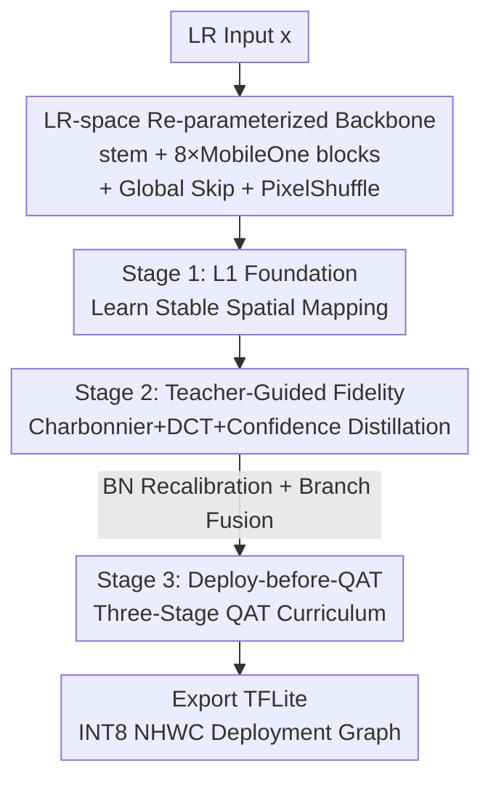

# Efficient INT8 Single-Image Super-Resolution via Deployment-Aware Quantization and Teacher-Guided Training

**Conference**: CVPR 2026  
**arXiv**: [2604.20291](https://arxiv.org/abs/2604.20291)  
**Code**: None  
**Area**: Image Restoration / Super-Resolution / Model Quantization  
**Keywords**: INT8 Quantization, Single-Image Super-Resolution, Structural Re-parameterization, Knowledge Distillation, Edge Deployment  

## TL;DR
For $\times 3$ single-image super-resolution (SISR) on mobile NPUs, this paper utilizes a deployment-oriented pipeline featuring a "LR-space MobileOne re-parameterized backbone + three-stage teacher-guided training + fusion-before-QAT," achieving INT8 29.79 dB / 0.8634 SSIM with 82K parameters and a final score of 1.8 in the MAI 2026 Quantized SR Challenge.

## Background & Motivation

**Background**: SISR has recently improved accuracy by increasing capacity—EDSR deepens residual backbones, RCAN use residuals-in-residuals + channel attention, and SwinIR/HAT introduce window attention for long-range dependencies. These models manifest strong fidelity but are increasingly large and difficult to compress.

**Limitations of Prior Work**: Deploying SR models on mobile NPUs for INT8 execution faces three major obstacles. First, **quantization sensitivity**: SR quality is measured at the pixel level; activation ranges, rounding errors, and training-deployment inconsistencies directly manifest as visible blurring and artifacts, making it much harder to quantize than high-level vision tasks. Second, **insufficient capacity**: compact models inherently lack the ability to restore complex textures and long-range structures. Third, **structural mismatch**: re-parameterized backbones are multi-branch during training and fused into single-branch for inference; performing Quantization-Aware Training (QAT) directly on the multi-branch structure leads to unpredictable accumulation of quantization errors and accuracy collapse after branch fusion.

**Key Challenge**: There is a trade-off between reconstruction fidelity, model compactness, and low-bit robustness. Most works optimize only one aspect, treating quantization as a post-processing "conversion" rather than a primary design goal.

**Goal**: To develop a compact $\times 3$ SR pipeline capable of real-world INT8 execution on mobile NPUs, ensuring strict alignment between the training optimization graph and the deployment integer graph.

**Key Insight**: Rather than inventing new SR operators, "architectural design + supervisory signals + deployment consistency" are treated as a joint optimization problem. Computation is kept in low-resolution (LR) space to save power, a Mamba teacher compensates for capacity shortfalls, and QAT is applied directly to the fused deployment graph to eliminate mismatches.

**Core Idea**: Utilize a "LR-space re-parameterized backbone + teacher-guided multi-stage fidelity training + deploy-before-QAT" triplet to enable an 82K parameter model to approach FP32 quality under INT8.

## Method

### Overall Architecture

The input is a low-resolution RGB image $x\in\mathbb{R}^{H\times W\times 3}$, and the output is a $\times 3$ magnified $\hat{y}\in\mathbb{R}^{3H\times 3W\times 3}$. The method follows two paths: the **Student Network** performs compact inference (extract–refine–upsample) in LR space, while the **Three-stage Training Pipeline** progressively aligns floating-point fidelity with INT8 deployment constraints. The student uses a stem to project LR images into feature space, processes them through 8 MobileOne-style blocks in the LR domain, employs global skip connections for structural preservation, and finally reconstructs via a PixelShuffle head. Training proceeds from Stage 1 (L1 initialization) to Stage 2 (Charbonnier + DCT + Teacher Distillation) and finally Stage 3 (QAT on the fused deployment graph), eventually exporting as TFLite INT8.

### Key Designs

**1. LR-space Re-parameterized Backbone: Multi-branch for training, single-branch for inference**

The challenge is for compact SR to save power while maintaining expressivity. This paper restricts most computation to LR space—the stem uses a $3\times 3$ convolution to project input to $C=32$ channels, and $N=8$ MobileOne blocks refine features. Upscaling happens at the end via PixelShuffle; thus, the computational load scales with $H\times W$ rather than $3H\times 3W$, making it mobile-friendly. Training uses multi-branch structures ($4 \times 3\times 3$ convs, $1\times 1$ conv, identity) with BN and ReLU:

$$B(f)=\sigma\Big(\sum_{i=1}^{5}\mathrm{BN}_i(\mathrm{Conv}^{(i)}_{3\times 3}(f))+\mathrm{BN}_{1\times 1}(\mathrm{Conv}_{1\times 1}(f))+\mathrm{BN}_{\mathrm{id}}(f)\Big)$$

After training, branches are folded using the BN folding formula $\widetilde{W}=\frac{\gamma}{\sqrt{\sigma^2+\epsilon}}W,\ \widetilde{b}=\beta+\frac{\gamma}{\sqrt{\sigma^2+\epsilon}}(b-\mu)$ into a single $3\times 3$ convolution. A global skip connection $f=f_N+f_0$ is added before the PixelShuffle head. Ablations show MobileOne blocks are more robust to quantization than RepConv or RepDW.

**2. Teacher-Guided Three-stage Training: Compensating for texture shortfalls via Mamba Teacher**

Compact models struggle with fine textures and long-range structures; hence, a pre-trained MambaIRv2Light $\times 3$ teacher is used for output-level distillation. Training proceeds progressively: Stage 1 uses L1 loss; Stage 2/3 switch to Charbonnier loss $\mathcal{L}_{\mathrm{char}}=\frac{1}{N}\sum_i\sqrt{(\hat{y}^i_{01}-y^i_{01})^2+\epsilon^2}$ ($\epsilon=10^{-3}$) and add DCT frequency supervision $\mathcal{L}_{\mathrm{DCT}}=\|D(\hat{y}_{01})-D(y_{01})\|_1$. Distillation uses **confidence weighting**: pixel-wise weights $w(p)=\mathrm{clip}(\exp(-\gamma e(p)),w_{\min},w_{\max})$ are calculated based on teacher error $e(p)=\frac{1}{3}\sum_c|t_c(p)-y_{01,c}(p)|$. The distillation loss is $\mathcal{L}_{\mathrm{KD}}=\frac{1}{N}\sum_p w(p)|\hat{y}_{01}(p)-t(p)|$. Stage 3 with the teacher improves INT8 from 29.91 dB to 30.00 dB.

**3. Deploy-before-QAT: Ensuring alignment between fake-quant and real INT8 graphs**

This is the core solution for re-parameterization/quantization mismatch. QAT directly on multi-branch graphs cause unpredictable errors after fusion. This paper reverses the process: **the network is collapsed into deployment form before QAT initialization**. After forward-only BN recalibration (64 batches), branches are fused into single $3\times 3$ convs. QAT operators are then inserted into this fused graph using PyTorch FX graph-mode. QAT follows a **three-stage curriculum**: Epoch 0–30 activates observers to calibrate scale/zero-point; Epoch 30–90 freezes grids and fine-tunes weights via STE; Epoch 90–150 freezes fake-quant nodes for final convergence. Weights are clipped $W\leftarrow\mathrm{clip}(W,W_{\min},W_{\max})$ to suppress outliers.

## Key Experimental Results

### Main Results

Dataset: DIV2K (800 train / 100 val / 100 test), task $\times 3$ SR, RGB PSNR/SSIM evaluation.

MAI 2026 Challenge Leaderboard (Quantized 4K SR, Selected):

| Team | FP32 PSNR/SSIM | INT8 PSNR/SSIM | NPU Latency(ms) | Final Score |
|------|------|------|------|------|
| AntYSP | 30.04 / 0.8757 | 29.96 / 0.8729 | 4.33 | 21.8 |
| AntSR | 30.08 / 0.8764 | 29.98 / 0.8731 | 4.52 | 21.5 |
| z6 | N.A. | 29.93 / 0.8699 | 5.49 | 16.5 |
| IN2GM | 29.88 / 0.8708 | 29.85 / 0.8701 | 46.5 | 1.7 |
| **AIO_MAI (Ours)** | 29.98 / 0.8730 | **29.79 / 0.8634** | 41.1 | **1.8** |

Comparison with baselines (Ours uses fixed-shape deployable INT8 TFLite, only 82K parameters):

| Method | Type | PSNR (dB) | SSIM |
|------|------|------|------|
| Bicubic | FP32 | 28.26 | 0.828 |
| FSRCNN | FP32 | 29.45 | 0.838 |
| ABPN | INT8 | 30.15 | 0.852 |
| Ours (Stage 2) | FP32 | **30.28** | **0.863** |
| Ours (Deploy) | INT8 | 30.13 | **0.858** |

### Ablation Study

Backbone Comparison (FP32 to Dynamic INT8 TFLite drop):

| Block | FP32 PSNR/SSIM | INT8 PSNR/SSIM | ΔPSNR↓ | ΔSSIM↓ |
|------|------|------|------|------|
| RepConv | 30.0897 / 0.855 | 29.8492 / 0.847 | 0.2405 | 0.008 |
| RepDW | 29.3583 / 0.838 | 28.7031 / 0.814 | 0.6552 | 0.024 |
| **MobileOne** | 30.1350 / 0.859 | **30.0003 / 0.856** | **0.1347** | **0.003** |

Stage 3 Teacher Supervision Ablation:

| Config | Teacher | Precision | PSNR (dB) | SSIM |
|------|------|------|------|------|
| Stage 3 (Direct QAT) | ✗ | INT8 | 29.9114 | 0.853 |
| Stage 3 (Ours Full) | ✓ | INT8 | **30.0003** | **0.856** |

### Key Findings
- **MobileOne is the optimal anti-quantization solution**: It achieves the highest INT8 PSNR (30.0003 dB) and the smallest FP32→INT8 drop (0.1347 dB). RepDW suffers significant drops (0.6552 dB), indicating that aggressive factorization is detrimental to low-bit SR.
- **Teacher supervision remains effective during final quantization**: Adding the teacher during Stage 3 pulls the INT8 result above 30 dB, proving that strong supervision bridges the optimization gap.
- **Quantization must be a primary design goal**: Even minor drops during export can disqualify a model; "deploy-before-QAT" ensures near-lossless export.

## Highlights & Insights
- **"Deploy-before-QAT" directly addresses the fundamental mismatch**: This work resolves the issue where "training graph $\neq$ deployment graph" causes accumulated quantization errors. This train-deploy consistency is applicable to any re-parameterized low-bit scenario.
- **Practical Confidence-Weighted Distillation**: By weighting pixels according to teacher error, the student avoids learning blurred artifacts.
- **DCT Supervision compensates for CNN high-frequency weaknesses**: Explicitly constraining DCT coefficients targets SR-critical details more effectively than L1 loss alone.
- **82K Parameters matching ABPN**: Approaching larger model quality within minimal parameter budgets validates that "careful coordination > scaling up."

## Limitations & Future Work
- **Absolute accuracy trails top-tier teams**: The Final Score of 1.8 is significantly lower than the leader (21.8), primarily due to NPU latency (41.1ms vs 4.33ms).
- **Validated on a single target platform**: Evaluation was limited to the MAI 2026 NPU; generalization to MediaTek or Apple Neural Engine is unverified.
- **Minor gains from teacher distillation**: The 0.09 dB improvement may not justify the training cost of a Mamba teacher in non-challenge scenarios.
- **Systematic integration over operator novelty**: Innovation lies in the pipeline rather than new SR primitives.

## Related Work & Insights
- **vs QuantSR**: While QuantSR focuses on quantization-aware calibration and clipping, this work emphasizes "deploy-before-QAT" consistency.
- **vs MobileOne / RepVGG**: Uses re-parameterization but specifically fills the gap where these methods clash with INT8 quantization.
- **vs DVMSR**: Both use Mamba teachers, but this work pushes distillation into real INT8 edge deployment with confidence weighting.

## Rating
- Novelty: ⭐⭐⭐☆☆ No new operators; novelty lies in consistency insights + distillation combinations.
- Experimental Thoroughness: ⭐⭐⭐⭐☆ Includes challenge results, baselines, and dual ablations, though platform-limited.
- Writing Quality: ⭐⭐⭐⭐☆ Clear logic, well-documented formulas, and flow.
- Value: ⭐⭐⭐⭐☆ Practical deployment-aware ideas for INT8 SR; highly transferable for re-parameterized quantization.

<!-- RELATED:START -->

## Related Papers

- [\[CVPR 2026\] IAFMNet: Information-Aware Feature Modulation for Efficient Super-Resolution](iafmnet_information-aware_feature_modulation_for_efficient_super-resolution.md)
- [\[ICCV 2025\] Outlier-Aware Post-Training Quantization for Image Super-Resolution](../../ICCV2025/image_restoration/outlier-aware_post-training_quantization_for_image_super-resolution.md)
- [\[CVPR 2026\] LightRR: A Lightweight Network for Single Image Reflection Removal](lightrr_a_lightweight_network_for_single_image_reflection_removal.md)
- [\[CVPR 2026\] ExpoCM: Exposure-Aware One-Step Generative Single-Image HDR Reconstruction](expocm_exposure-aware_one-step_generative_single-image_hdr_reconstruction.md)
- [\[CVPR 2026\] PS-SR: Pseudo-Single-Step Video Super-Resolution via Speculative Diffusion](ps-sr_pseudo-single-step_video_super-resolution_via_speculative_diffusion.md)

<!-- RELATED:END -->
