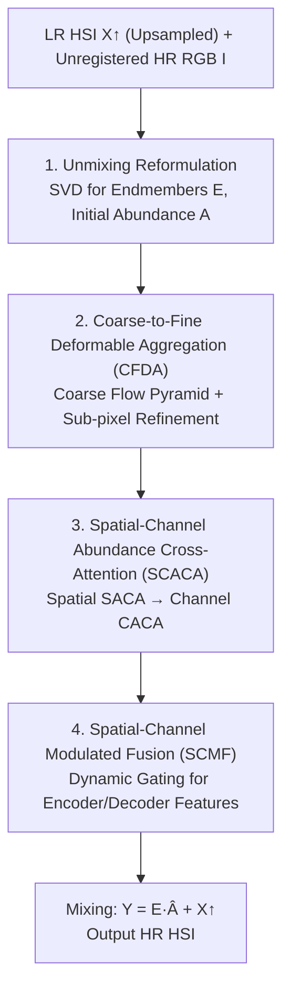

# Enhancing Unregistered Hyperspectral Image Super-Resolution via Unmixing-based Abundance Fusion Learning

**Conference**: CVPR 2026  
**Paper**: [CVF Open Access](https://openaccess.thecvf.com/content/CVPR2026/html/Zhang_Enhancing_Unregistered_Hyperspectral_Image_Super-Resolution_via_Unmixing-based_Abundance_Fusion_Learning_CVPR_2026_paper.html)  
**Code**: https://github.com/yingkai-zhang/UAFL (Committed to open source, pending release)  
**Area**: Image Restoration / Hyperspectral Super-Resolution  
**Keywords**: Hyperspectral Super-Resolution, Unregistered Fusion, Spectral Unmixing, Deformable Aggregation, Cross-Attention

## TL;DR
For the super-resolution task involving "low-resolution hyperspectral image (LR HSI) + one unregistered high-resolution reference image," this paper utilizes spectral unmixing to decouple spatial and spectral information. This allows the network to focus solely on enhancing the unmixed abundance maps (rather than performing direct spatial-spectral coupled fusion, which is susceptible to misalignment interference). Combined with coarse-to-fine deformable aggregation, spatial-channel abundance cross-attention, and modulated fusion modules, the method achieves SOTA performance on ICVL/REAL datasets with approximately half the parameters (PSNR 41.84/42.05 dB at $\times 4$).

## Background & Motivation

**Background**: Hyperspectral sensors face an inherent trade-off between spatial and spectral resolution—spectral accuracy is high, but spatial detail is poor. Consequently, Hyperspectral Image Super-Resolution (HSI SR) has become a necessity. Single-image SR is limited by the information content of a single input; reference-based SR uses a high-resolution reference image (RGB) to supplement spatial details for better results, but it strictly assumes that the LR HSI and the reference image are **perfectly aligned**.

**Limitations of Prior Work**: In reality, platform vibration, viewpoint changes, and sensor acquisition time differences almost inevitably lead to misalignment, giving rise to "unregistered HSI SR." The mainstream approach is two-stage: first using a pre-trained optical flow model (e.g., RAFT) to explicitly warp and align the reference image, then passing it to a spatial-spectral coupled network for fusion. However, this has two major drawbacks: ① **Explicit alignment** introduces texture distortions and artifacts in the warped image (Fig.2(c) shows the reference RGB dropping from 41.59 dB to 14.79 dB after warping); ② **Spatial-spectral coupled fusion** forces the network to learn space and spectrum simultaneously, severely constraining the learning capacity (Fig.1 shows these methods have large parameter counts but lower PSNR).

**Key Challenge**: Misalignment is unavoidable, yet the path of "explicit alignment in the pixel domain + fusion in the coupled spatial-spectral domain" introduces artifacts and is difficult to learn. The root of the problem is that directly fusing an unaligned reference in the original spatial-spectral domain entangles "alignment error" and "spatial-spectral reconstruction."

**Key Insight**: HSI exhibits low-rank properties due to strong spectral correlation, allowing for spectral unmixing. Unmixing itself is **robust** to geometric misalignment (endmembers reflect material spectra, independent of pixel alignment). The authors perform a key validation in Fig.2(d): remixed (mixing) using **LR HSI endmembers $E_{lrhsi}$ + HR HSI abundance $A_{hrhsi}$** enables high-quality reconstruction of HR HSI (41.46 dB); conversely, mixing endmembers with an unregistered reference RGB yields poor quantitative results (14.79 dB). This indicates that as long as "well-structured, accurately aligned" abundance maps are obtained, reconstruction can be achieved with almost no modification to the endmembers.

**Core Idea**: Reformulate "unregistered spatial-spectral fusion" as "**learning residual abundance maps**"—first use SVD unmixing to fix endmembers and obtain initial abundance, then let the network focus on enhancing these abundance maps using the unregistered reference. This step decomposes the difficult problem into a more specific, optimization-friendly learning objective.

## Method

### Overall Architecture
The input consists of an LR HSI $X\in\mathbb{R}^{h\times w\times B}$ and an unregistered HR RGB reference $I\in\mathbb{R}^{H\times W\times b}$, aiming to output an HR HSI $Y\in\mathbb{R}^{H\times W\times B}$. The entire pipeline consists of three stages: **Unmixing → Multi-scale encoder-decoder abundance enhancement → Mixing**.

First, the LR HSI is upsampled to the target size $X_\uparrow$, followed by Singular Value Decomposition $X_\uparrow = USV^T$. The first $K$ left singular vectors of $U$ form the endmember matrix $E\in\mathbb{R}^{B\times K}$ (the paper sets $K=3$), and initial abundance is obtained by $A=E^T X_\uparrow$. The network $f(\cdot|\theta)$ no longer predicts the entire HSI but takes $A$ and $I$ as inputs to learn an enhanced residual abundance $\hat{A}=f(A,I|\theta)$. Three core modules are integrated into the encoder-decoder backbone: **CFDA** implicitly aggregates and aligns reference features to abundance features; **SCACA** refines abundance using spatial-channel cross-attention; **SCMF** uses dynamic gating to fuse encoder-decoder features. Finally, mixing is performed $Y_{res}=E\hat{A}$ and added to the upsampled base $Y=Y_{res}+X_\uparrow$ for the final HR HSI. The essence of the scheme is: endmembers are fixed and not learned; all learning capacity is spent on "aligning and enhancing abundance."

### Key Designs

**1. Unmixing Reformulation: Rewriting Coupled Fusion as Residual Abundance Learning**

Addressing the pain point where fusing unaligned references in the coupled domain is difficult, this paper uses spectral unmixing for problem decomposition. Leveraging HSI low-rankness, SVD is applied to $X_\uparrow$, with the first $K$ left singular vectors as endmembers $E$ and $A=E^T X_\uparrow$ as initial abundance. Crucially: **endmembers represent material spectra and are naturally robust to misalignment, thus kept fixed**; the network only learns the enhanced residual abundance $\hat{A}=f(A,I|\theta)$, and finally $Y=E\hat{A}+X_\uparrow$.

$$Y = E\hat{A} + X_\uparrow,\qquad \hat{A}=f(A,I|\theta)$$

This is effective because the analysis in Fig.2(d) proves that "$E_{lrhsi}$ + good $A_{hrhsi}$" results in high-quality reconstruction—spectral accuracy is guaranteed by the LR HSI itself, while spatial structure issues converge into the single sub-task of "abundance enhancement." Compared to two-stage methods using explicit pixel-domain alignment, this transforms a complex coupled problem into a single, optimizable residual learning objective. ⚠️ Endmembers are fixed as direct SVD results and do not participate in training; the paper does not extensively discuss the boundaries of this assumption (e.g., propagation of endmember estimation errors).

**2. Coarse-to-Fine Deformable Aggregation (CFDA): Implicit Alignment in Feature Domain**

Since explicit pixel alignment burns distortions into the image, CFDA performs implicit aggregation in the **deep feature domain**. It consists of two stages. **Coarse Pyramid Flow Predictor (CPFP)**: Abundance features $F$ and reference features $F_{ref}$ are downsampled, and a low-resolution flow is predicted via convolution and upsampled as a coarse motion prior $C_{flow}=\mathrm{Up}(\mathrm{Conv}_{3\times3}(F_\downarrow,F_{ref\downarrow}))$; this warps the reference to be concatenated with $F$ for predicting residual flow $\Delta C_{flow}$ and a similarity map, yielding final prior flow $F_{flow}=C_{flow}+\Delta C_{flow}$ and confidence $F_{sim}=\mathrm{Sigmoid}(F'_{sim})$. **Sub-pixel Refinement (FSPR)**: The fractional part of the flow $d_f$ is used for frequency positional encoding $\gamma(d_f)=[\omega d_f,\omega^2 d_f,\dots]$, concatenated as $F_{pe}=\mathrm{Concat}[\sin(\gamma(d_f)),\cos(\gamma(d_f))]$ for sub-pixel priors; the refinement network takes $[F,\mathrm{Warp}(F_{ref},F_{flow}),F_{pe}]$ to predict residual offsets and a mask $\Delta P=(\Delta P_o,\Delta P_m)$, with final offset $O=F_{flow}+\mathrm{Tanh}(\Delta P_o)$ and modulation mask $M=\mathrm{Sigmoid}(F_{sim}\odot\Delta P_m)$ for modulated deformable convolution to aggregate reference features into $\hat{F}_{ref}$.

Effectiveness: The prior flow provides a stable starting point for deformable convolution, and sub-pixel encoding compensates for accuracy; alignment occurs at the feature level, avoiding the texture artifacts of pixel warping. Ablations (Tab.4) show CFDA improves PSNR to 41.95 dB compared to DCNv2 (41.80 dB), with feature visualization showing significant elimination of artifacts/blurred text.

**3. Spatial-Channel Abundance Cross-Attention (SCACA): Refining Abundance Structure and Spectral Response**

Aggregated reference features require further guidance for abundance refinement. SCACA first uses lightweight self-modulation $\hat{F}_{refm}=\hat{F}_{ref}+\hat{F}_{ref}\odot\mathrm{Sigmoid}(\mathrm{Conv}_{5\times5}(\hat{F}_{ref}))$ to strengthen reference features, then applies **hierarchical cross-attention**: spatial then channel. The **Spatial Branch (SACA)** uses window cross-attention where $Q,K,V$ are from abundance feature $Z_w$, but modulated by reference features before aggregation: $V_{mod}=V\odot\mathrm{Reshape}(\hat{F}_{refw})$, $\hat{Z}=\mathrm{Softmax}(QK^T/\sqrt{d_k}+B)V_{mod}$, using reference structural info to guide abundance spatial correspondence. The **Channel Branch (CACA)** complementarily refines spectral signatures, similarly modulating Value $V_{mod}=V\odot\hat{F}_{refm}$ to adaptively amplify salient spectra and suppress irrelevant responses.

The "Value modulation" trick ensures the abundance refinement process explicitly absorbs the reference's spatial structure and channel characteristics rather than simply concatenating features. The dual spatial-channel path allows multi-modal information to supplement spatial details while aligning spectra. Ablations show SCACA raises the baseline from 41.41 to 41.66 dB.

**4. Spatial-Channel Modulated Fusion (SCMF): Dynamic Gating for Encoder-Decoder Feature Merging**

Directly adding/concatenating encoder-decoder features ignores adaptive trade-offs at different scales. SCMF concatenates encoder $F_{enc}$ and decoder $F_{dec}$ into $F_{cat}$ along the channel dimension, followed by two parallel modulations. **Spatial Modulation**: The value branch uses depth-wise convolution + LeakyReLU for $V_{spa}$, and the gating branch $M_{spa}=\mathrm{Sigmoid}(\mathrm{Conv}_{3\times3}(F_{cat}))$ assigns a per-pixel importance weight, $F_{spa}=V_{spa}\odot M_{spa}$. **Channel Modulation**: The value branch uses $1\times1$ convolution for $V_{spe}$, and the gating branch uses Global Average Pooling to form a channel descriptor followed by $1\times1$ convolution $M_{spe}=\mathrm{Sigmoid}(\mathrm{Conv}_{1\times1}(\mathrm{GAP}(F_{cat})))$, $F_{spe}=V_{spe}\odot M_{spe}$. Both are added and residually connected back:

$$\hat{F}_{dec}=(F_{spa}+F_{spe})+F_{dec}$$

The gating weights are **dynamic and content-generated**, emphasizing details via local context (spatial) and recalibrating spectral response via global descriptors (channel). Tab.5 shows that gains increase for more difficult large-scale factors—at $\times 16$, SCMF provides a 0.38 dB boost, indicating its criticality for high-frequency detail recovery in multi-scale fusion.

### Loss & Training
Trained end-to-end using L1 loss. Configuration: $C=64$ feature dims, $K=3$ endmembers; AdamW optimizer, weight decay $5\times10^{-5}$, learning rate $1\times10^{-5}$, batch size 1, single RTX 4090; 150 epochs for ICVL, 300 epochs for REAL. LR HSI generated via Gaussian kernel ($\mu=8, \sigma=3$) blurring followed by $\times4/\times8/\times16$ downsampling.

## Key Experimental Results

### Main Results

ICVL Simulated Dataset, $\times 4$ scale (PSNR↑/SSIM↑/SAM↓):

| Method | Source | PSNR | SSIM | SAM |
|------|------|------|------|-----|
| SSPSR | TCI'20 | 40.19 | 0.982 | 0.033 |
| HSIFN | TNNLS'24 | 41.14 | 0.983 | 0.041 |
| SRLF | CVPR'25 | 38.75 | 0.977 | 0.041 |
| SSCH-S | IJCV'25 | 41.38 | **0.987** | 0.031 |
| **Ours** | - | **41.84** | 0.986 | **0.025** |

REAL Dataset, Multi-scale comparison (PSNR↑ / Parameters / FLOPs):

| Method | $\times 4$ PSNR | $\times 8$ PSNR | $\times 16$ PSNR | Params(M) | FLOPs(G) |
|------|---------|---------|----------|-----------|----------|
| HSIFN | 40.15 | 34.39 | 30.07 | 21.01 | 594.10 |
| SSCH-S | 41.16 | 36.19 | 31.91 | 11.01 | 165.68 |
| **Ours** | **42.05** | **37.23** | **32.28** | **5.94** | **96.17** |

Ours leads across all three scales: $\times 4/\times 8/\times 16$ are higher than second-best by 0.89/1.04/0.37 dB respectively, with approximately half the parameters of SSCH-S and 42% fewer FLOPs, achieving a win-win in accuracy and efficiency.

### Ablation Study

Incremental Module Accumulation (REAL, $\times 4$):

| Unmix | SCACA | CFDA | SCMF | PSNR | SAM | Params |
|-------|-------|------|------|------|-----|--------|
| ✗ | ✗ | ✗ | ✗ | 41.26 | 0.036 | 5.08M |
| ✓ | ✗ | ✗ | ✗ | 41.41 | 0.034 | 5.05M |
| ✓ | ✓ | ✗ | ✗ | 41.66 | 0.034 | 4.85M |
| ✓ | ✓ | ✓ | ✗ | 41.95 | 0.033 | 5.85M |
| ✓ | ✓ | ✓ | ✓ | **42.05** | **0.033** | 5.94M |

CFDA Comparison (REAL, $\times 4$):

| Aggregation | PSNR | SAM | Params |
|----------|------|-----|--------|
| w/o Aggregation | 41.66 | 0.034 | 4.85M |
| w/ DCNv2 | 41.80 | 0.033 | 5.78M |
| w/ CFDA | **41.95** | **0.033** | 5.85M |

### Key Findings
- **Unmixing Strategy is the Foundation**: Simply adding Unmix raises the baseline from 41.26 to 41.41 dB with slightly fewer parameters—validating that "fixing endmembers and learning residual abundance" simplifies the optimization.
- **CFDA Provides Most Significant Improvement**: Adding CFDA jumps PSNR from 41.66 to 41.95 (+0.29 dB), outperforming DCNv2 (41.80). Feature visualization shows significantly reduced artifacts and blur.
- **SCMF Benefits Larger Scales**: The +0.38 dB gain at $\times 16$ far outweighs the +0.10 dB at $\times 4$, indicating that multi-scale dynamic gating is vital as task difficulty increases.
- **$K=3$ Endmembers Suffice**: High spectral correlation allows reconstruction with just 3 endmembers, supporting the HSI low-rank assumption.

## Highlights & Insights
- **Converting "Alignment Difficulty" to "Abundance Enhancement Ease"**: The most notable insight is the empirical evidence in Fig.2(d)—endmembers are robust to misalignment; thus, the artifact-prone explicit alignment step can be bypassed. This "problem-structure-driven decomposition" (low-rank/unmix) can be transferred to other misaligned fusion tasks (e.g., pan-sharpening, cross-modal restoration).
- **Value-modulated Cross-Attention**: Modulating attention Values via reference features instead of simple concatenation is a lightweight yet effective multi-modal injection trick.
- **Efficiency-Friendly**: Achieving SOTA with half the parameters proves that "saving capacity from coupled fusion to focus on abundance" is both effective and efficient, which has clear practical significance for deployment.

## Limitations & Future Work
- **Endmembers are fixed by SVD and not trained**: If LR HSI spectral quality is poor or scene endmember counts far exceed $K=3$, fixed endmembers may limit the reconstruction ceiling.
- **Reliance on HR RGB Reference**: It is reference-based. Performance when the reference is missing or significantly different from the target scene remains unverified. RGB provides only 3 channels, limiting contributions to spectral details beyond the reference.
- **⚠️ Limited Real-World Data**: The REAL dataset contains only 60 pairs (10 for test), so generalization conclusions require caution. Robustness across different sensors and high-light outdoor scenes needs larger-scale validation.

## Related Work & Insights
- **vs. Two-stage Explicit Alignment (e.g., SSCH/HSIFN)**: These warp the reference via pre-trained flow before coupled fusion. Ours uses implicit CFDA aggregation in the feature domain, avoiding warp artifacts and providing more efficient, accurate fusion in the abundance domain.
- **vs. Optimization-based Unmixing SR**: Traditional optimization methods are somewhat robust to misalignment but rely on handcrafted priors and struggle with complex real scenes (Optimized is only 25.35 dB in Tab.1). Ours retains the robustness of unmixing while leveraging networks for residual abundance learning and deformable aggregation.
- **vs. General DCNv2**: Direct DCNv2 aggregation leaves artifacts (41.80 dB). CFDA uses "Coarse Pyramid Flow + Sub-pixel Frequency Refinement" to provide more stable priors, reaching 41.95 dB with cleaner features.

## Rating
- Novelty: ⭐⭐⭐⭐⭐ Reformulates unregistered fusion as "fixed endmembers + residual abundance learning," resolving artifact issues via problem structure with empirical support.
- Experimental Thoroughness: ⭐⭐⭐⭐ Simulated and real datasets, three scales, module-wise and specific-module ablations are complete; real-world data scale is a bit small.
- Writing Quality: ⭐⭐⭐⭐⭐ Motivation explained thoroughly via Fig.2(d); formulas and framework diagrams are clear.
- Value: ⭐⭐⭐⭐ SOTA with half the parameters advances practical HSI SR; the approach is transferable to other misaligned fusion-restoration tasks.

## Related Papers

- [\[CVPR 2026\] EMR-Diff: Edge-aware Multimodal Residual Diffusion Model for Hyperspectral Image Super-resolution](emr-diff_edge-aware_multimodal_residual_diffusion_model_for_hyperspectral_image_.md)
- [\[CVPR 2026\] RegionFuse: Region-Adaptive Pixel Distribution Learning for Infrared and Visible Image Fusion](regionfuse_region-adaptive_pixel_distribution_learning_for_infrared_and_visible_.md)
- [\[NeurIPS 2025\] Enhancing Infrared Vision: Progressive Prompt Fusion Network and Benchmark](../../NeurIPS2025/image_restoration/enhancing_infrared_vision_progressive_prompt_fusion_network_and_benchmark.md)
- [\[CVPR 2026\] Bridging the Perception Gap in Image Super-Resolution Evaluation](bridging_the_perception_gap_in_image_super-resolution_evaluation.md)
- [\[CVPR 2026\] SAT: Selective Aggregation Transformer for Image Super-Resolution](sat_selective_aggregation_transformer_for_image_super_resolution.md)

<!-- RELATED:END -->

<!-- RELATED:START -->

## Related Papers

- [\[CVPR 2026\] RegionFuse: Region-Adaptive Pixel Distribution Learning for Infrared and Visible Image Fusion](regionfuse_region-adaptive_pixel_distribution_learning_for_infrared_and_visible_.md)
- [\[NeurIPS 2025\] Enhancing Infrared Vision: Progressive Prompt Fusion Network and Benchmark](../../NeurIPS2025/image_restoration/enhancing_infrared_vision_progressive_prompt_fusion_network_and_benchmark.md)
- [\[CVPR 2026\] Degradation-Robust Fusion: An Efficient Degradation-Aware Diffusion Framework for Multimodal Image Fusion in Arbitrary Degradation Scenarios](degradation-robust_fusion_an_efficient_degradation-aware_diffusion_framework_for.md)
- [\[CVPR 2026\] Bridging the Perception Gap in Image Super-Resolution Evaluation](bridging_the_perception_gap_in_image_super-resolution_evaluation.md)
- [\[CVPR 2026\] Disentangled Textual Priors for Diffusion-based Image Super-Resolution](disentangled_textual_priors_for_diffusion-based_image_super-resolution.md)

<!-- RELATED:END -->
