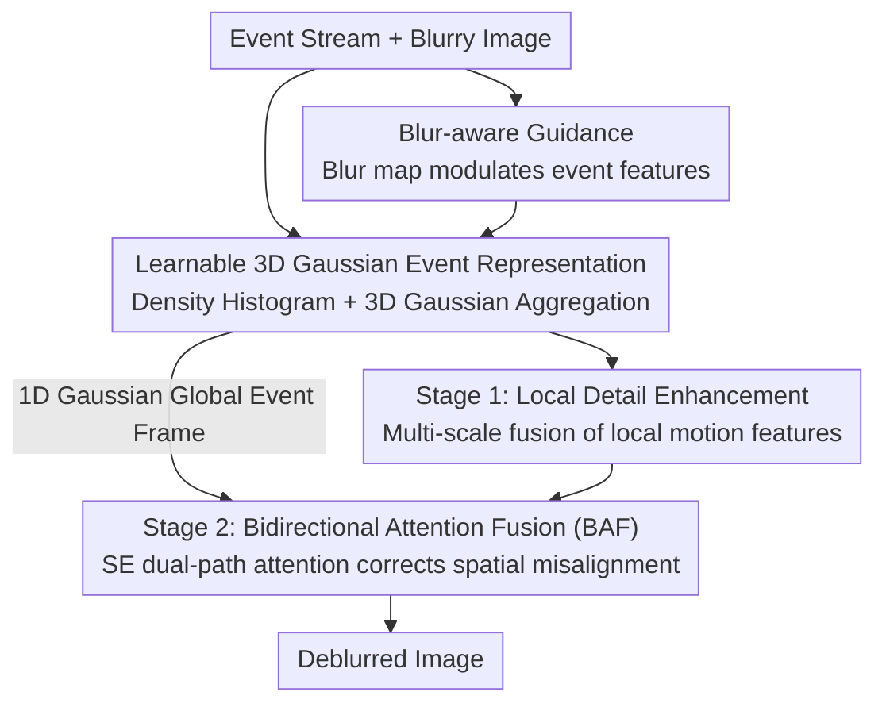

# Event-Based Motion Deblurring Using Task-Oriented 3D Gaussian Event Representations

**Conference**: CVPR 2026  
**Paper**: [CVF Open Access](https://openaccess.thecvf.com/content/CVPR2026/html/Xue_Event-Based_Motion_Deblurring_Using_Task-Oriented_3D_Gaussian_Event_Representations_CVPR_2026_paper.html)  
**Code**: Not disclosed  
**Area**: Image Restoration / Event-based Deblurring  
**Keywords**: Event camera, motion deblurring, learnable event representation, 3D Gaussian kernel, bidirectional attention fusion  

## TL;DR
To address the pervasive issue in existing event-based deblurring where "fixed-weight kernels" are used to aggregate sparse events into event frames, failing to adapt to local motion variations, this paper proposes a **learnable 3D Gaussian event representation**. It adaptively samples spatiotemporal coordinates based on blurry image content and event density, aggregates events using 3D Gaussian kernels, and employs a two-stage fusion network (local detail enhancement + 1D Gaussian global alignment). The method consistently outperforms SOTA on GoPro, HS-ERGB, and REBlur datasets in terms of PSNR.

## Background & Motivation
**Background**: Event cameras provide microsecond-level temporal resolution and capture motion information between RGB frames, making them natural auxiliary sensors for motion deblurring. However,เนื่องจาก event streams are sparse and irregularly structured, they cannot be directly fused with RGB data. The mainstream approach is to first use a **hand-crafted fixed-weight kernel** to aggregate sparse event points along the temporal axis into "event frames" before feeding them into a restoration network. A representative method is the Voxel Grid, which bins events chronologically using fixed bilinear interpolation weights.

**Limitations of Prior Work**: In real-world scenarios, motion is highly **nonlinear and spatially heterogeneous**, with different image regions exhibiting varying speeds and directions. Slow motion produces sparse events requiring a longer integration window $T$ to accumulate sufficient edge information, while fast motion generates dense events requiring a shorter $T$ to avoid blurring the edges. Fixed-weight kernels lack sample-adaptive capabilities, leading to indistinct weights in dense areas and low-quality representations in sparse areas, resulting in inconsistent event frame quality and underutilized motion information. Even "learnable" representations like EST or LETC still utilize kernels that are **uniformly distributed** along the temporal axis, failing to match the specific temporal density curves of individual samples.

**Key Challenge**: The quality of event frames depends on "integration windows $T$ and weight kernel shapes that dynamically change with local motion speed," yet hand-crafted or uniform kernels hard-code these parameters, preventing region-wise and sample-wise adaptation.

**Goal**: To make the event aggregation step itself "task-oriented and learnable" for deblurring. This involves allocating sampling points based on event density (more for dense, fewer for sparse) and allowing each kernel's center and coverage (coupling the $x, y, t$ axes) to adaptively adjust based on the degree of image degradation.

**Core Idea**: A set of **learnable 3D Gaussian kernels** replaces fixed-weight kernels for event aggregation. Kernel centers are predicted using "blurry image guidance + event density histograms," while the covariance matrices determine their spatiotemporal attention range. A two-stage fusion network follows, first refining details with local motion features and then correcting structural misalignments using 1D Gaussian global event frames.

## Method

### Overall Architecture
The input consists of an **event stream** and a **blurry image**, and the output is the deblurred sharp image. The pipeline is divided into two main parts: converting the event stream into a **task-adaptive event frame representation** (3D-GSER module), and feeding this representation along with image features into a **two-stage fusion network** to restore the sharp image.

Specifically, the event stream is first voxelized into a 3D spatiotemporal histogram and concatenated with explicit 3D positional encodings. The blurry image passes through a lightweight convolutional block to generate a "blur map," which modulates the event features to inform the module about severely blurred regions. The modulated voxel features are processed by a sequence of depthwise separable 3D convolutions to extract high-level spatiotemporal features, followed by a multi-head MLP sampler that predicts $K$ 3D Gaussian kernels (each defined by a mean $\mu$ and covariance $\Sigma$). These kernels serve as adaptive local attention weights to aggregate events into event frames. During the two-stage fusion: the first stage aligns and enhances local motion features with image textures; the second stage utilizes an additional **1D Gaussian (temporal-only) event frame** to provide global edge cues, using a Bidirectional Attention Fusion (BAF) module to correct spatial misalignments.

### Key Designs

**1. Learnable 3D Gaussian Event Representation (3D-GSER): Replacing Fixed Kernels with Sample-Adaptive 3D Gaussian Kernels**

This is the core of the paper, directly addressing the pain point that fixed kernels cannot adapt to local motion heterogeneity. The authors aggregate events using $K$ 3D Gaussian kernels. The $k$-th kernel is parameterized by a mean $\mu_k = (x_k, y_k, t_k)$ (focus center) and a covariance matrix $\Sigma_k$ (focus range). The diagonal elements $\sigma_{xx}, \sigma_{yy}, \sigma_{tt}$ of $\Sigma_k$ determine the coverage width of the three axes, while off-diagonal elements $\rho_{xy}, \rho_{xt}, \rho_{yt}$ characterize the coupling between dimensions in a local non-linear motion field (e.g., diagonal motion involves $x-t$ coupling). The weight of event $(x_i, y_i, t_i)$ under the $k$-th kernel is:

$$w_i^k = \exp\!\left(-\tfrac12 \Delta_i^\top \Sigma_k^{-1} \Delta_i\right), \quad \Delta_i = (x_i - x_k, y_i - y_k, t_i - t_k)^\top$$

Events are then projected onto a 2D grid based on these weights: $E_k(u,v) = \sum_i w_i^k \delta(x_i - u)\delta(y_i - v)$. Positive and negative polarities each generate $K$ frames, totaling $2K$ frames stacked along the channel dimension as the final event frame tensor.

Crucially, kernel parameters are **predicted rather than hand-crafted**: the event stream is voxelized into a 3D count histogram $V(x,y,t) = \sum \delta_{x,x_i}\delta_{y,y_i}\delta_{t,t_i}$, log-compressed, and concatenated with continuous positional encodings $E(x,y,t) = 2(t/D, x/W, y/H) - 1$. After extracting features via $L$ depthwise separable 3D convolutions $Y = \sigma(\mathrm{BN}(\mathrm{PW}(\sigma(\mathrm{BN}(\mathrm{DW}(X))))))$ and global pooling to obtain $F_{\text{global}}$, multiple MLP heads (inspired by SampleNet) predict $\mu_k, \Sigma_k$ for each kernel. Consequently, kernel centers naturally cluster in event-dense (fast motion) areas with narrowed temporal windows, while sparse areas expand $T$ to accumulate edges.

**2. Blur-aware Guidance (Blur Map): Informing Event Aggregation of Degradation Severity**

Event density alone is insufficient, as it reflects speed but not necessarily restoration priority. The authors introduce task-oriented priors from the blurry image itself. A lightweight convolutional block processes the blurry image $I_b$ to generate a blur map $S_b = \sigma(\mathrm{Conv}(I_b)) \in [0,1]^{H \times W}$, highlighting regions with severe blur. This map is broadcast to the voxel domain to modulate event features using a learnable scalar $\alpha$:

$$\tilde V_{\text{guided}}(x, y, t) = \tilde V(x, y, t) + \alpha S_b(x, y)$$

This guides the sampler to allocate more attention to heavily degraded regions during kernel prediction, effectively injecting the "deblurring task" signal into the representation construction phase. Ablation studies show this contributes approximately +0.10 dB on GoPro.

**3. Two-Stage Fusion Network + Bidirectional Attention Fusion (BAF): Local Details and Global Alignment**

Since 3D Gaussian kernels focus on local spatiotemporal regions, they capture local motion fields. Different kernels, due to their varying temporal coordinates, may generate event frames that are **spatially misaligned** with each other. The authors designed a two-stage fusion based on EFNet: the first stage performs multi-scale fusion using attention to align local motion features with image textures; the second stage utilizes an additional **1D Gaussian kernel (temporal-only)** to generate an event frame providing global edge cues, which is fed into the BAF module to correct global misalignments.

BAF uses symmetric bidirectional attention: image features $I$ and event features $E$ are normalized, processed via $1 \times 1$ convolutions and GELU, and then passed through SE (Squeeze-and-Excitation) blocks to compute channel attention weights $A_I = \mathrm{SE}(I)$ and $A_E = \mathrm{SE}(E)$. Features are element-wise weighted $F_I = I \odot A_I, F_E = E \odot A_E$, concatenated, processed by a $1 \times 1$ convolution and FFN, and finally added residually. The two branches modulate each other using global responses, pulling misaligned edges from local kernels back to a consistent structural position. Adding BAF (Variant C) pushed GoPro PSNR from 36.61 to 36.76 dB.

### Loss & Training
The model was trained on an RTX 3090 using PyTorch, directly on GoPro-ESIM without pre-training. Inputs were cropped to $256 \times 256$ patches with synchronized event segments. The configuration used a batch size of 4, AdamW ($\beta_1 = 0.9, \beta_2 = 0.99$), an initial learning rate of $2 \times 10^{-4}$, and a cosine annealing schedule for $400\text{K}$ iterations. Data augmentation included random rotation and flipping. For HS-ERGB and REBlur, the GoPro pre-trained model was fine-tuned for 4K iterations with a learning rate reduced to $2 \times 10^{-5}$.

## Key Experimental Results

### Main Results
The method achieved SOTA PSNR across three datasets (synthetic GoPro, semi-synthetic HS-ERGB, and real-world REBlur), outperforming previous best methods by 0.16 / 0.62 / 0.15 dB respectively:

| Method | Source | GoPro PSNR/SSIM | HS-ERGB PSNR/SSIM | REBlur PSNR/SSIM | Params(M) | FLOPs(G) |
|--------|--------|-----------------|--------------------|-------------------|-----------|----------|
| NAFNet (Image Only) | ECCV2022 | 33.71 / 0.967 | 27.64 / 0.811 | 36.15 / 0.969 | 67.8 | 96.8 |
| EFNet | ECCV2022 | 35.46 / 0.972 | 26.68 / 0.800 | 38.12 / 0.975 | 8.5 | 153.9 |
| MAENet | ECCV2024 | 36.07 / 0.976 | 27.93 / 0.812 | 38.47 / 0.978 | 13.9 | 149.7 |
| SepNet | ICCV2025 | 36.70 / 0.977 | – | 38.53 / 0.977 | – | – |
| **Ours** | – | **36.86 / 0.977** | **28.55 / 0.813** | **38.68 / 0.977** | 16.7 | 172.6 |

The improvement on HS-ERGB (+0.62 dB) is most significant, suggesting that adaptive representation offers a greater advantage on semi-synthetic data with high motion diversity. The cost is a slightly higher parameter count (16.7M) and FLOPs (172.6G) compared to EFNet/MAENet.

### Ablation Study

Module ablation (GoPro / REBlur, using Voxel Grid as baseline):

| Config | Blur Map | BAF | 3D-GSER | GoPro PSNR | REBlur PSNR |
|--------|:--------:|:---:|:-------:|------------|-------------|
| Baseline | × | × | × | 36.13 | 38.01 |
| A | × | × | ✓ | 36.51 | 38.37 |
| B | ✓ | × | ✓ | 36.61 | 38.41 |
| C | × | ✓ | ✓ | 36.76 | 38.53 |
| D (Full) | ✓ | ✓ | ✓ | **36.86** | **38.68** |

Event representation comparison (GoPro, unified bins/kernels):

| Representation | Type | PSNR | SSIM |
|----------------|------|------|------|
| Voxel Grid | Hand-crafted | 36.13 | 0.9719 |
| SCER | Hand-crafted | 35.95 | 0.9711 |
| DA | Hand-crafted | 36.09 | 0.9713 |
| EST | Learnable | 35.86 | 0.9704 |
| LETC | Learnable | 35.84 | 0.9710 |
| **3D-GSER** | **Learnable** | **36.51** | **0.9751** |

### Key Findings
- **3D-GSER provides the largest contribution**: Moving from the Baseline to Variant A (changing only the representation) yields a direct gain of +0.38 dB on GoPro and +0.36 dB on REBlur. BAF is the second largest contributor (+0.25 dB from A to C), while Blur Map is the smallest (+0.10 dB from A to B).
- **Learnable $\neq$ Adaptive**: EST and LETC, despite being "learnable," performed worse than the hand-crafted Voxel Grid because their kernels remain uniformly distributed in time. 3D-GSER outperforms the best alternative by 0.38 dB by sampling 3D coordinates by density and dynamically adjusting attention via the covariance matrix.
- **BAF targets structural misalignment**: Visualization shows ghosting in Variant A and edge offsets in Variant B; only Variant C (with BAF) corrects the edge positions, confirming that local kernels introduce temporal misalignment requiring global 1D Gaussian alignment.

## Highlights & Insights
- **Transforming "Event Aggregation" into a task-oriented learnable step**: Previously, event frames were just pre-processed with fixed kernels. This paper predicts kernel centers and covariances using "blur + density," injecting deblurring goals into representation construction. This "task-oriented representation" can generalize to event super-resolution, SLAM, etc.
- **Modeling motion coupling via off-diagonal covariance elements**: Using $\rho_{xt}, \rho_{yt}$ to explicitly characterize $xy-t$ coupling allows a single kernel to represent diagonal or rotational motion, something fixed bilinear kernels cannot do.
- **Adapting point cloud sampling to event spatiotemporal domains**: Borrowing SampleNet's approach to predict a set of 3D coordinates elegantly adapts learnable sampling to event density.

## Limitations & Future Work
- Computational complexity (16.7M params, 172.6G FLOPs) is higher than EFNet (8.5M/153.9G). The overhead of adaptive kernel prediction might be a bottleneck for real-time or embedded deployment; inference latency was not provided.
- Sensitivity analysis for key hyperparameters like the number of kernels $K$ and depthwise convolution layers $L$ was not fully explored.
- Training data relies on ESIM/V2E simulations. Real-world event noise and hot pixel distributions differ from simulations; while validated on REBlur, cross-sensor generalization (different event camera models) remains untested.

## Related Work & Insights
- **vs. Voxel Grid / SBT (Hand-crafted fixed kernels)**: These methods uniformly slice exposure time and accumulate with fixed weights, failing to model spatially varying blur. Ours aggregates adaptively by density, showing a +0.38 dB gain on GoPro.
- **vs. SCER (EFNet's multi-scale representation)**: SCER uses three fixed integration windows ($T/6, T/3, T/2$). Ours dynamically adjusts $T$ (temporal covariance component) per sample, avoiding thick edges and polarity annihilation in fast-motion datasets like REBlur.
- **vs. EST / LETC (Learnable event representations)**: While also learnable, their kernels are uniform in time. Ours learns kernel centers to match the temporal density of each sample, outperforming them by ~0.65 dB on GoPro.
- **vs. EFNet / MAENet (Event deblurring fusion networks)**: Ours adopts the EFNet backbone but replaces the front-end with 3D-GSER and adds a 1D Gaussian global frame + BAF for global alignment, achieving superior PSNR across three datasets.

## Rating
- Novelty: ⭐⭐⭐⭐ Learnable 3D Gaussian kernels guided by density and blur are novel and physically intuitive.
- Experimental Thoroughness: ⭐⭐⭐⭐ Sufficient data types and ablation studies, though lacking hyperparameter sensitivity and latency analysis.
- Writing Quality: ⭐⭐⭐⭐ Clear logic from motivation (heterogeneity) to method (adaptive kernels).
- Value: ⭐⭐⭐⭐ SOTA across three datasets; "task-oriented representation" has high transferability.

<!-- RELATED:START -->

## Related Papers

- [\[CVPR 2026\] MAD-Avatar: Motion-Aware Animatable Gaussian Avatars Deblurring](motionaware_animatable_gaussian_avatars_deblurring.md)
- [\[CVPR 2026\] NEC-Diff: Noise-Robust Event–RAW Complementary Diffusion for Seeing Motion in Extreme Darkness](nec-diff_noise-robust_event-raw_complementary_diffusion_for_seeing_motion_in_ext.md)
- [\[CVPR 2026\] BiEvLight: Bi-level Learning of Task-Aware Event Refinement for Low-Light Image Enhancement](bievlight_bi-level_learning_of_task-aware_event_refinement_for_low-light_image_e.md)
- [\[CVPR 2026\] AE2VID: Event-based Video Reconstruction via Aperture Modulation](ae2vid_event-based_video_reconstruction_via_aperture_modulation.md)
- [\[CVPR 2026\] Spatio-Temporal Difference Guided Motion Deblurring with the Complementary Vision Sensor](spatio-temporal_difference_guided_motion_deblurring_with_the_complementary_visio.md)

<!-- RELATED:END -->
