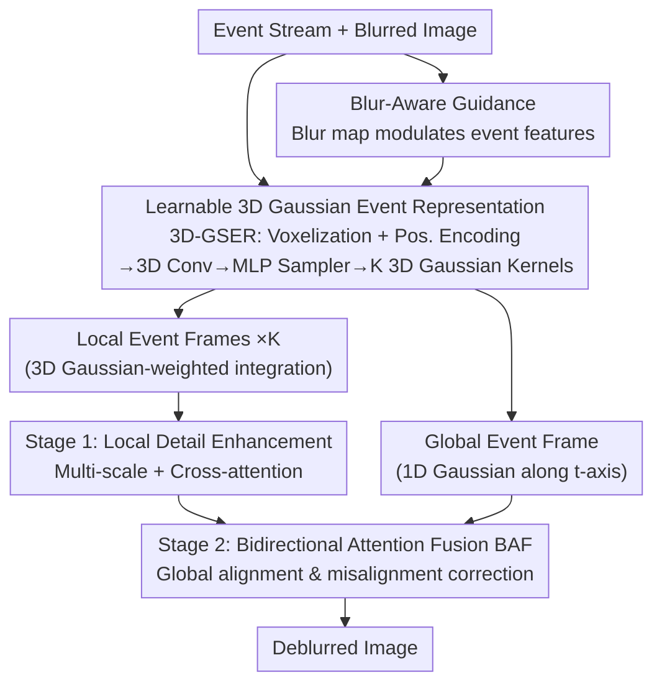

# Event-Based Motion Deblurring Using Task-Oriented 3D Gaussian Event Representations

**Conference**: CVPR 2026  
**Paper**: [CVF Open Access](https://openaccess.thecvf.com/content/CVPR2026/html/Cho_Event-based_Motion_Deblurring_with_Unpaired_Data_CVPR_2026_paper.html)  
**Code**: None  
**Area**: Image Restoration / Event-based Camera Deblurring  
**Keywords**: Motion Deblurring, Event Camera, 3D Gaussian Event Representation, Adaptive Sampling, Bidirectional Attention Fusion

> ⚠️ This note is drafted based on the cached full text. The cached main title is *"Event-Based Motion Deblurring Using Task-Oriented 3D Gaussian Event Representations"* (authors from Beijing University of Technology / Southeast University / Nankai University), which does not match "with Unpaired Data" in the stub filename/CVF link, and the full text does not involve the theme of "unpaired data". **The actual content of the main text shall prevail**; if the CVF link corresponds to another paper, it needs to be verified separately.

## TL;DR
Addressing the pain point in event-based camera deblurring where hand-crafted fixed-weight kernels struggle to adapt to spatially-varying motion velocities and directions, this paper proposes a **learnable 3D Gaussian Event Representation (3D-GSER) module**. Based on the blurred image content and event density, this module adaptively samples key spatiotemporal coordinates and aggregates events into frames using 3D Gaussian kernels. Combined with a **two-stage fusion** scheme (local detail enhancement + bidirectional attention for global alignment), it consistently outperforms state-of-the-art methods across GoPro, HS-ERGB, and REBlur datasets.

## Background & Motivation

**Background**: With microsecond-level temporal resolution, event cameras capture rich motion information between normal RGB frames, primarily triggering events along object edges. This makes them naturally suited for assisting in motion deblurring. However, due to the sparse and irregular structure of event streams, they cannot be directly fused with RGB images. The mainstream approach is to first aggregate sparse event points into continuous "event frames" using a **fixed-weight kernel** before feeding them to the restoration network. A representative scheme is the Event Voxel Grid: dividing events into $N$ bins along the temporal axis and aggregating them with fixed bilinear interpolation.

**Limitations of Prior Work**: In real-world scenes, event distributions are highly uneven, and variations in motion velocity and direction are massive. Slow motion generates sparse events, requiring a **longer temporal integration window $T$** to accumulate sharp edges. Fast motion generates dense events, requiring a **shorter $T$**; otherwise, edges become overly thick due to integration. Fixed-weight kernels fail to assign appropriate weights to dense event regions while generating low-quality representations in sparse areas, leading to quality fragmentation across different areas within the same frame and wasting valuable motion information.

**Key Challenge**: The integration kernel shape and integration window of the event representation should adaptively change according to the **sample (different scenes) and spatial location (different regions within the same frame)**. However, hand-crafted kernels rely on a single set of parameters across all inputs, lacking sample adaptivity.

**Key Insight & Core Idea**: Reimagining the integration of events into frames from a hand-crafted design to a **learnable and task-oriented** process: 3D Gaussian kernels are employed to adaptively select local spatiotemporal regions. The kernel center $\mu$ determines which spatiotemporal segment to focus on, while the covariance $\Sigma$ determines the range of focus and the coupling of each dimension, thereby enabling precise modeling of non-linear motion fields with varying directions and velocities. In short: **replace the fixed-weight kernel with a learnable 3D Gaussian-weighted kernel, allowing the event representation to learn autonomously "where and with what window width" to perform integration**.

## Method

### Overall Architecture
The input consists of an event stream and a blurred image (acting as prior guidance), and the output is the deblurred sharp image. The overall pipeline consists of three stages: ① Voxelizing the events and adding 3D positional encoding, modulating the event features using a blur map generated from the blurred image, and encoding global spatiotemporal features through a depthwise separable 3D convolution; ② Utilizing a multi-branch MLP sampler (inspired by the point cloud method SampleNet) to predict $K$ 3D Gaussian kernels (each parameterized by a set of $\mu, \Sigma$) from the global features, adaptively aggregating the events into $K$ local event frames using these kernels, while simultaneously using a 1D Gaussian kernel along the temporal axis to generate a global event frame; ③ Two-stage fusion: the first stage enhances details using the local event frames via cross-attention, and the second stage uses the 1D Gaussian global frame through Bidirectional Attention Fusion (BAF) to correct spatial misalignment and align structures.

### Key Designs

**1. Learnable 3D Gaussian Event Representation Module (3D-GSER): Letting the representation learn where to integrate and how wide to integrate**

This is the core of the paper, directly resolving the pain point that fixed kernels cannot adapt to spatially varying motion. The event stream is first represented as a discrete set of events $\{(x_i,y_i,t_i,p_i)\}_{i=1}^N$ (coordinates normalized to $[0,255]^3$, and polarities $p_i\in\{0,1\}$ are processed separately for positive and negative values). The module defines $K$ integration kernels based on 3D Gaussian distributions, where the $k$-th kernel is parameterized by its mean $\mu_k=(x_k,y_k,t_k)$ (focus center) and covariance matrix $\Sigma_k$ (focus range and multi-dimensional coupling): the diagonal elements $\sigma_{xx},\sigma_{yy},\sigma_{tt}$ determine the focus width of each dimension, while the off-diagonal elements $\rho_{xy},\rho_{xt},\rho_{yt}$ depict the coupling of the x, y, and t dimensions in the local non-linear motion field. For each event, its weight under the $k$-th kernel is given by

$$w_i^k=\exp\left(-\tfrac{1}{2}\,\Delta_i^\top \Sigma_k^{-1}\Delta_i\right),\quad \Delta_i=(x_i-x_k,\;y_i-y_k,\;t_i-t_k)^\top.$$

Subsequently, the weighted events are projected onto a 2D spatial grid to form event frames $E_k(u,v)=\sum_i w_i^k\,\delta(x_i-u)\delta(y_i-v)$; positive and negative polarities each generate $K$ frames, resulting in $2K$ frames stacked along the channel dimension. **The key lies in the fact that $\mu_k,\Sigma_k$ are predicted rather than hand-crafted**: the event stream is first converted into a 3D count histogram $V(x,y,t)$. After log compression, it is concatenated with continuous 3D positional encodings $E(x,y,t)=2(t/D,x/W,y/H)-1$, and features are extracted through $L$ layers of depthwise separable 3D convolutions (DW $\rightarrow$ PW $\rightarrow$ BN $\rightarrow$ GELU). Global average pooling then yields $F_{global}$, and finally, a multi-head MLP sampler $(\mu_k,\Sigma_k)=\text{Sampler}(F_{global})$ predicts the center and covariance for each kernel. Consequently, the kernels can be "as wide, narrow, or skewed as needed", automatically adjusting the equivalent integration window for slow or fast motion. This avoids under-integration in sparse areas and overly thick edges in dense areas caused by a fixed $T$.

**2. Blur-Aware Guidance: Informing the representation module where deblurring is needed most**

If event aggregation treats the entire image uniformly, it lacks targeted focus on heavily degraded areas. This paper employs a lightweight convolutional block to generate a blur score map $S_b=\sigma(\text{Conv}(I_b))\in[0,1]^{H\times W}$ from the blurred image $I_b$, highlighting severely blurred regions. After broadcasting to the voxel domain, the event features are modulated using a learnable scalar $\alpha$ as $\tilde V_{guided}=\tilde V+\alpha S_b$. This guides the sampling of 3D Gaussian kernels toward "degraded regions that truly require restoration", illustrating the "task-oriented" nature of the module. Ablation results show that introducing the blur map improves GoPro PSNR by +0.10 dB.

**3. Two-Stage Fusion + Bidirectional Attention Fusion (BAF) Module: Restoring details first, then correcting global misalignment**

Since the 3D Gaussian kernels only focus on local spatiotemporal regions, they capture local motion fields. Because different kernels have different coordinates along the temporal axis, the generated local event frames may suffer from **spatial misalignment**. Directly fusing them would cause ghosting. This paper proposes a two-stage fusion scheme (based on EFNet): **Stage 1** uses multi-scale cross-attention to fuse the fine-grained motion cues of $K$ local event frames with image textures, focusing on detail recovery. **Stage 2** additionally uses a 1D Gaussian global event frame (along the t-axis only) to provide global edge position cues, which is fed to the BAF for global alignment. The mechanism of BAF is: image features $I$ and event features $E$ are normalized, passed through $1\times1$ convolutions and GELU, and fed to SE blocks to calculate channel attention $A_I=\text{SE}(I), A_E=\text{SE}(E)$. Features are then element-wise modulated via $F_I=I\odot A_I,\; F_E=E\odot A_E$, concatenated, dimensionality-reduced with $1\times1$ convolution, passed through an FFN, and combined with residual addition. This bidirectional weighting (image $\leftrightarrow$ event) aligns global structures and suppresses ghosting. Ablation results show that incorporating BAF improves GoPro PSNR from 36.61 to 36.76 dB.

> Additionally, there is an easily overlooked detail—**polarity annihilation**: when positive and negative events are accumulated into frames, they can cancel each other out, leading to edge ghosting and degraded quality. This work processes positive and negative event streams separately (producing $K$ frames each) to bypass this issue from the source.

### Loss & Training
Using a single RTX 3090 GPU and PyTorch, training is performed from scratch on GoPro-ESIM (with ESIM simulated events) without pre-training. Inputs are cropped into $256\times256$ patches with synchronized event streams, batch size is 4, using AdamW ($\beta_1=0.9, \beta_2=0.99$), with an initial learning rate of $2\times10^{-4}$ and cosine annealing ($T_{max}=400\text{K}$ iterations). Data augmentation includes random rotation and flipping. Finetuning on HS-ERGB and REBlur uses the GoPro pre-trained model for 4K iterations with a learning rate of $2\times10^{-5}$.

## Key Experimental Results

### Main Results
Across three datasets (synthetic GoPro / semi-synthetic HS-ERGB / real REBlur), with FLOPs calculated based on $224\times224$ inputs, the proposed method ranks first in PSNR on all three, surpassing the previous state-of-the-art by **0.16 / 0.62 / 0.15 dB**, respectively.

| Method | Modality | GoPro PSNR/SSIM | HS-ERGB PSNR/SSIM | REBlur PSNR/SSIM | Params(M) | FLOPs(G) |
|------|------|------|------|------|------|------|
| NAFNet (ECCV22) | RGB | 33.71 / 0.967 | 27.64 / 0.811 | 36.15 / 0.969 | 67.8 | 96.8 |
| EFNet (ECCV22) | RGB+Event | 35.46 / 0.972 | 26.68 / 0.800 | 38.12 / 0.975 | 8.5 | 153.9 |
| MAENet (ECCV24) | RGB+Event | 36.07 / 0.976 | 27.93 / 0.812 | 38.47 / 0.978 | 13.9 | 149.7 |
| SepNet (ICCV25) | RGB+Event | 36.70 / 0.977 | – | 38.53 / 0.977 | – | – |
| **Ours** | RGB+Event | **36.86 / 0.977** | **28.55 / 0.813** | **38.68 / 0.977** | 16.7 | 172.6 |

### Ablation Study

Module effectiveness (baseline uses Voxel Grid representation):

| Configuration | Blur Map | BAF | 3D-GSER | GoPro PSNR | REBlur PSNR |
|------|:---:|:---:|:---:|------|------|
| Baseline | × | × | × | 36.13 | 38.01 |
| A | × | × | ✓ | 36.51 | 38.37 |
| B | ✓ | × | ✓ | 36.61 | 38.41 |
| C | × | ✓ | ✓ | 36.76 | 38.53 |
| D (Full) | ✓ | ✓ | ✓ | **36.86** | **38.68** |

Comparison of different event representations (GoPro, matching bin/kernel counts):

| Representation | Type | PSNR | SSIM |
|------|------|------|------|
| Voxel Grid | Hand-crafted | 36.13 | 0.9719 |
| SCER | Hand-crafted | 35.95 | 0.9711 |
| DA | Hand-crafted | 36.09 | 0.9713 |
| EST | Learnable | 35.86 | 0.9704 |
| LETC | Learnable | 35.84 | 0.9710 |
| **Ours** | Learnable | **36.51** | **0.9751** |

### Key Findings
- **3D-GSER is the primary driver of performance gains**: Simply replacing the representation (Baseline $\rightarrow$ A) improves GoPro PSNR by +0.38 dB and REBlur by +0.36 dB. Compared to the best alternative representation (hand-crafted Voxel Grid at 36.13 dB), it is 0.38 dB higher, demonstrating that "learnable + spatiotemporal adaptive sampling + adaptive covariance" is superior to fixed kernels and existing learnable kernels (the kernel positions in EST/LETC are still uniformly distributed over time, failing to match the temporal distribution of individual samples).
- **BAF is more crucial than the blur map**: In terms of incremental gains, configuration C (+BAF) improves PSNR by 0.25 dB over A, whereas B (+blur map) only improves it by 0.10 dB. Visualizations reveal that removing BAF leads to obvious structural edge shifts and ghosting; BAF primarily corrects the global misalignment among different 3D Gaussian kernels.
- **Excellent generalization**: The method consistently leads across synthetic, semi-synthetic, and real datasets, with the largest improvement of +0.62 dB achieved on HS-ERGB, demonstrating robustness towards diverse real-world motions.

## Highlights & Insights
- **Reformulating "how events form frames" as a learnable, task-oriented sampling problem**: Drawing from the multi-MLP coordinate prediction concept of Point Cloud's SampleNet, the MLP sampler directly predicts the center and covariance of 3D Gaussian kernels. This essentially allows the network to learn "where and how wide to frame" in the spatiotemporal space. This "adaptive integration kernel" concept can be transferred to any task requiring the aggregation of sparse events/point clouds into dense representations.
- **Off-diagonal elements of the covariance matrix model motion direction**: $\rho_{xt}$ and $\rho_{yt}$ couple spatial displacement with time, allowing the kernel to tilt along the motion trajectory. This is something fixed bilinear kernels cannot achieve and is key to modeling non-linear motion fields with varying directions.
- **Clear division of labor between local and global components**: The 3D Gaussian kernels handle local details, while the 1D Gaussian kernel + BAF handle global alignment. Decoupling "detail restoration" from "ghosting prevention/structural alignment" presents a clean, reusable design paradigm.

## Limitations & Future Work
- **Increased computational cost and parameters**: With 16.7M parameters and 172.6 GFLOPs, it is heavier than EFNet (8.5M/153.9G) and MAENet (13.9M/149.7G). The improvement margin (+0.16 dB on GoPro) may not be fully cost-effective for mobile or real-time scenarios, where trade-offs must be evaluated.
- **Reliance on simulated event training**: Primary training is completed on GoPro-ESIM synthetic events, while real-world data relies on finetuning. The impact of the simulation-to-reality domain gap on extreme motions has not been fully analyzed.
- Sensitivity to hyperparameters and constraints such as the number of kernels $K$ and the positive definiteness of the covariance matrix is not discussed in depth. Since $\Sigma_k$ needs to be invertible (as $\Sigma_k^{-1}$ is used in the equation), how numerical stability is guaranteed in practice is worth examining.
- **Future Directions**: Exploring adaptively determining the number of kernels $K$ based on the scene, or designing the two-stage fusion into an end-to-end framework capable of jointly optimizing the temporal integration window $T$.

## Related Work & Insights
- **vs Event Voxel Grid / SBT (Hand-crafted Fixed Kernels)**: These methods split events uniformly into bins along the temporal axis and aggregate them using fixed bilinear weights, which fail to adapt to spatially-varying motion velocities. The proposed method utilizes learnable 3D Gaussian kernels to adaptively sample spatiotemporal regions, achieving 36.51 dB vs 36.13 dB on GoPro.
- **vs SCER (Multi-scale Hand-crafted Representation in EFNet)**: SCER employs multiple fixed temporal windows ($T/6, T/3, T/2$). However, fixed windows are still not versatile enough for different motion velocities, often leaving residual motion blur in real-world scenarios. In contrast, the integration window of this method is adaptively determined by covariance.
- **vs EST / LETC (Existing Learnable Event Representations)**: Although they can learn integration weight kernels, the locations of their kernels along the temporal axis are still uniformly distributed and do not vary with sample temporal distributions. The proposed sampler simultaneously learns the kernel centers and focus ranges, thus fitting the event temporal distribution of each sample much better (36.51 dB vs 35.86/35.84 dB).
- **vs MAENet (Per-event Processing)**: MAENet provides richer encoding but at a high per-event computational cost. The proposed method uses histograms, 3D convolutions, and a sampler to avoid per-event processing.

## Rating
- Novelty: ⭐⭐⭐⭐ Replacing fixed-weight kernels with learnable sample-adaptive 3D Gaussian kernels + covariance-driven motion direction modeling is logical and highly focused.
- Experimental Thoroughness: ⭐⭐⭐⭐ Three datasets + two sets of ablation studies (modules and representation comparisons) + comprehensive realizations leave a very solid proof chain.
- Writing Quality: ⭐⭐⭐⭐ Motivation $\rightarrow$ Method $\rightarrow$ Experiment flow is exceptionally smooth, accompanied by rich diagrams, though some mathematical notations are slightly heavy.
- Value: ⭐⭐⭐⭐ Consistently setting new state-of-the-art heights in event deblurring; the "learnable adaptive event representation" paradigm holds strong transfer potential for other event-based vision tasks.

<!-- RELATED:START -->

## Related Papers

- [\[CVPR 2026\] NEC-Diff: Noise-Robust Event–RAW Complementary Diffusion for Seeing Motion in Extreme Darkness](nec-diff_noise-robust_event-raw_complementary_diffusion_for_seeing_motion_in_ext.md)
- [\[CVPR 2026\] BiEvLight: Bi-level Learning of Task-Aware Event Refinement for Low-Light Image Enhancement](bievlight_bi-level_learning_of_task-aware_event_refinement_for_low-light_image_e.md)
- [\[CVPR 2026\] From Events to Clarity: The Event-Guided Diffusion Framework for Dehazing](from_events_to_clarity_the_event-guided_diffusion_framework_for_dehazing.md)
- [\[CVPR 2026\] Spatio-Temporal Difference Guided Motion Deblurring with the Complementary Vision Sensor](spatio-temporal_difference_guided_motion_deblurring_with_the_complementary_visio.md)
- [\[CVPR 2026\] Time-Specialized Event-Image Alignment for Blur-to-Video Decomposition](time-specialized_event-image_alignment_for_blur-to-video_decomposition.md)

<!-- RELATED:END -->
