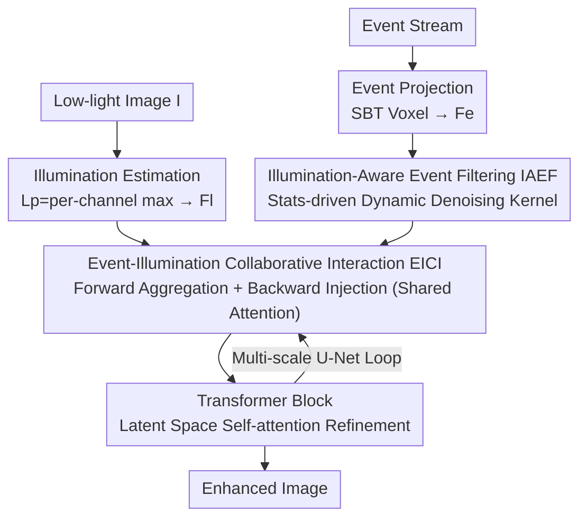

# Event-Illumination Collaborative Low-light Image Enhancement with a High-resolution Real-world Dataset

**Conference**: CVPR 2026  
**Paper**: [CVF Open Access](https://openaccess.thecvf.com/content/CVPR2026/html/Xu_Event-Illumination_Collaborative_Low-light_Image_Enhancement_with_a_High-resolution_Real-world_Dataset_CVPR_2026_paper.html)  
**Code**: https://github.com/QUEAHREN/EIC-LIE  
**Area**: Image Restoration / Low-light Image Enhancement  
**Keywords**: Event Camera, Low-light Enhancement, Retinex, Bidirectional Interaction, Event Denoising  

## TL;DR
EIC-LIE enables event signals (providing HDR details) and image illumination priors (providing global brightness) to synergistically enhance through a bidirectional interaction module featuring "forward aggregation + backward injection with reused attention matrices." It employs image illumination statistics to drive a dynamic event filter for noise suppression and introduces RLE, the first $1024 \times 768$ high-resolution real-world event low-light dataset. It outperforms SOTA by over 1.24dB PSNR across five datasets.

## Background & Motivation
**Background**: Low-light image enhancement (LIE) mostly follows the Retinex route—decomposing a low-light image into reflectance $R$ and illumination map $L$ ($I = R \odot L$), using the estimated illumination prior to guide the network. Event cameras, characterized by high dynamic range (HDR) and high temporal resolution, have been introduced for event-based LIE to recover details lost by traditional sensors.

**Limitations of Prior Work**: Existing event-based LIE methods face three specific issues. First, they generally rely on "direct feature fusion"—stacking complex fusion modules to concatenate event and image features—while **discarding the global illumination information emphasized by Retinex**, focusing on details while neglecting overall brightness. Second, under low light where photon counts are extremely low and event thresholds $c$ are low, event streams are corrupted by significant random noise; methods like EvLight use SNR maps estimated from images for "selective fusion," but such fixed guidance is unreliable, leaving visible noise in the results. Third, there is a lack of high-resolution real-world datasets—the prior best dataset, SDE, uses a robotic arm along the same trajectory for GT, which is restricted to **static slow-motion scenes**, suffers from $<10\text{ms}$ temporal misalignment, and uses the DAVIS346 sensor with low resolution ($346 \times 260$) and color distortion.

**Key Challenge**: Events provide HDR edges/textures (local, high-frequency), while images provide global illumination (low-frequency, stable). These two should be complementary, but previous methods only perform **unidirectional injection** (stuffing one modality into another), lacking a backward pathway for mutual refinement. Consequently, the two modalities cannot be continuously updated by each other's complementary information within the network. Simultaneously, the spatio-temporal statistical distribution of event noise differs vastly from effective events, making it difficult for traditional denoising filters to balance "noise suppression" and "detail preservation."

**Goal & Core Idea**: To establish true **bidirectional collaboration** between events and illumination and use image illumination statistics to **dynamically filter** event noise. In short—replacing unidirectional fusion with a "forward aggregation + backward injection" bidirectional interaction, and replacing fixed SNR guidance with an "illumination-aware dynamic filtering kernel," validated by a new high-resolution real-world dataset, RLE.

## Method

### Overall Architecture
The input to EIC-LIE is a low-light RGB image $I$ and a time-synchronized event stream; the output is the enhanced normal-light image. The process begins with two preparations: extracting the **illumination prior** $L_p$ from the image (pixel-wise maximum across all image channels) to estimate illumination features $F_l$; and representing the event stream using SBT (Stacking Based on Time) to form event voxels $V$ (dividing time into $B$ bins, with $V(i)=\sum_{k\in T_i} p_k$ cumulative polarity) to extract initial event features $F_e$. The backbone is a multi-scale U-Net, where two core modules are alternately stacked at each scale: **EICI (Event-Illumination Collaborative Interaction)** handles the bidirectional fusion of event, illumination, and image features, while **IAEF (Illumination-Aware Event Filtering)** denoises event features. Transformer blocks are inserted between them for self-attention refinement in the latent space before decoding the enhanced image.

### Key Designs

**1. EICI: True Bidirectional Fusion via "Forward Aggregation + Backward Injection"**

To address the "unidirectional injection" limitation, EICI splits interaction into two reversible processes. **Forward Aggregation** $G(\cdot,\cdot)$ uses auxiliary features $X$ to update main features $T$: $(T', A) = G(X, T)$. Using covariance-based cross-attention, $T$ selectively absorbs the context of $X$, and the **intermediate attention matrix $A \in \mathbb{R}^{C\times C}$ is stored**. **Backward Injection** $I(\cdot,\cdot)$ then reuses $A$ to send information back to the auxiliary space: $X' = I(T', A) + X$, maintaining modality independence while sharing information.

Specifically, with image features $F_i$ as the primary and event $F_e$ and illumination $F_l$ as auxiliary: first, forward aggregation is performed—$(F_i', A_e)=G_e(F_e, F_i)$ compensates for HDR details, and $(F_i'', A_l)=G_l(F_l, F_i)$ compensates for global illumination. The three are added and passed through a Transformer block for latent space fusion $\hat{F}_i = T(F_i + F_i' + F_i'')$. Finally, backward injection uses the fused features to refine the original modalities: $\hat{F}_l = I_l(\hat{F}_i, A_l)+F_l$ and $\hat{F}_e = I_e(\hat{F}_i, A_e)+F_e$. **The key innovation is reusing $A_l$ and $A_e$ as implicit alignment constraints**—ablations show that using standard cross-attention for the backward step (without reusing $A$) results in a large domain gap between fused and modality features (entangled features in t-SNE), whereas reusing $A$ yields strong modality independence with complementary HDR textures and static brightness.

**2. IAEF: Deformable Filtering Kernel Driven by Image Illumination Statistics**

To address the unreliability of fixed SNR guidance under substantial event noise, IAEF introduces stable global illumination statistics from the image to dynamically weight the filter. It extracts three sets of parameters from the two features: from **illumination features** $F_l$, it extracts separable 1D kernels $K_v, K_h = \mathcal{K}(F_l)$ (vertical/horizontal, forming an $n\times n$ kernel $K$, encoding illumination priors to distinguish noise from valid responses); from **event features** $F_e$, it extracts weights $W=\mathcal{W}(F_e)$ (quantizing event reliability per pixel) and spatial offsets $P_x, P_y = \mathcal{P}(F_e)$ (dynamically referencing coordinates of available events in the neighborhood to handle noise and misalignment).

The final filtering for pixel $(m,n)$ is a deformable sampling weighted aggregation:
$$\hat{F}_e(m,n) = \sum_{(P_x,P_y)} W(m,n)\cdot K(m,n)\cdot S\big(F_e,\,(m+P_x(m,n),\,n+P_y(m,n))\big)$$
where $S(\cdot)$ is spatial sampling and $K(m,n)$ is approximated by $K_v(n)\cdot K_h(m)$ for efficiency. Effectiveness comes from encoding the **global illumination prior** into the kernel—balancing noise suppression and event preservation (Post-IAEF t-SNE shows significantly less noise than Pre-IAEF).

**3. RLE Dataset: High-Resolution Real-world Event Low-light Benchmark**

To overcome the "static scene, temporal misalignment, low resolution, color distortion" limitations of prior datasets, the authors designed a **dual-beam splitter coaxial alignment** optical system. The first 10R/90T splitter directs 90% of light to a normal-light RGB camera (Sony IMX273, $1440 \times 1080$); the remaining 10% enters a second 50R/50T splitter, providing $10\% \times 50\%$ light to both a low-light RGB camera and an event camera (Sony & Prophesee IMX636, $1280 \times 720$), satisfying $L_1 + L_2 = L$ conservation. External synchronization ensures precise triggers across cameras, with spatial alignment via homography. This produces RLE, the first $1024 \times 768$ real-world event low-light dataset, covering indoor/outdoor scenes, broad illumination ranges, and complex dynamic motion with synchronized GT.

## Key Experimental Results

### Main Results
On SDE (real), SDSD (synthetic), and RLE (ours, real) datasets, EIC-LIE outperforms SOTA comprehensively with only ~9.4% of EvLight's parameters.

| Dataset | Metric | EIC-LIE | EvLight (CVPR'24) | Gain |
|--------|------|---------|-------------------|------|
| SDE-indoor | PSNR / SSIM | 23.33 / 0.7573 | 22.44 / 0.7697 | +0.89dB |
| SDE-outdoor | PSNR / SSIM | 24.22 / 0.8200 | 23.21 / 0.7505 | +1.01dB / +0.0695 |
| SDSD-indoor | PSNR / SSIM | 29.76 / 0.9193 | 28.52 / 0.9125 | +1.24dB |
| SDSD-outdoor | PSNR / SSIM | 27.45 / 0.8668 | 26.67 / 0.8356 | +0.78dB / +0.0312 |
| RLE | PSNR / SSIM | 23.63 / 0.7670 | 22.68 / 0.7201 | +0.95dB / +0.0469 |

EIC-LIE has only 2.13M parameters (compared to EvLight's 22.73M). Inference on $1024 \times 768$ in RLE takes 298ms, faster than EvLight (323ms).

### Ablation Study
Ablations were conducted on RLE components (different baselines).

| Configuration | PSNR | SSIM | Description |
|------|------|------|------|
| Baseline only (no I, no E) | 19.53 | 0.6623 | Case 0 |
| w. E (Event guidance only) | 21.40 | 0.7287 | +1.87dB |
| w. I (Illumination guidance only) | 21.08 | 0.7194 | +1.55dB |
| **w. I&E (Full)** | **23.63** | **0.7670** | +2.23/+2.55dB vs single guidance |
| No Event Filtering (Case 3) | 20.92 | 0.7064 | IAEF baseline |
| w. Conv. Filtering (Case 4) | 21.92 | 0.7481 | Std. conv cannot suppress noise |
| w. Transformer Filtering (Case 5) | 21.86 | 0.7430 | TB also fails to suppress |
| **w. IAEF** | **23.63** | **0.7670** | +2.71dB vs no filtering |
| No Backward Injection (Case 6) | 20.24 | 0.6920 | BI baseline |
| w. Gating (Case 7) | 20.92 | 0.7237 | Gating alternative |
| w. Cross-Attn (Case 8) | 21.05 | 0.7128 | Cross-attention alternative |
| **w. BI (Backward Injection)** | **23.63** | **0.7670** | +3.39dB vs no BI |

### Key Findings
- **Reusing the attention matrix in BI is critical for modality separation**: Replacing it with cross-attention (Case 8, 21.05dB) or gating (Case 7) causes drops; without reusing $A$, fused and modality features remain entangled.
- **IAEF requires illumination priors; standard Conv/Transformer are insufficient**: Cases 4/5 only improve ~1dB, while IAEF improves 2.71dB—indicating that denoising requires global illumination statistics to distinguish signals.
- **Event and illumination guidance are roughly equivalent and complementary**: Individual additions yield +1.5~1.9dB, while together they yield +4.1dB, verifying that HDR details and global illumination are complementary rather than redundant.

## Highlights & Insights
- **"Attention storage for aggregation, attention reuse for injection" is a transferable bidirectional paradigm**: Reusing $A$ creates a natural implicit alignment constraint, preventing the issue where modalities cannot be cleanly separated after fusion—this is applicable to any multi-modal task requiring post-fusion decomposition.
- **Transforming denoising from "feature-level hard fusion" to "dynamic deformable sampling kernels"**: IAEF uses illumination for kernels and events for weights/offsets, essentially creating a content-adaptive deformable filter far more flexible than fixed SNR maps.
- **Robust Dataset Engineering**: Coaxial dual-beam splitting + external triggering bypasses the limitations of mechanical arm schemes (static scenes/misalignment), serving as a foundation for real-world dynamic event-based LIE.

## Limitations & Future Work
- The method relies on the quality of global illumination priors from the image side—in extreme low light where the image is nearly black, the stability of IAEF guidance is not deeply discussed. (Researcher's inference).
- Implementation details for EICI/IAEF are primarily in the supplemental materials; the main text formulas are abstract, making supplement review necessary for replication.
- RLE leads in resolution and dynamics but remains captured by a single hardware system; cross-sensor/cross-domain generalization (different event cameras) remains to be verified.
- The ablation text mentions BI gains of ">2.58dB," while Table 6 shows $23.63 - 20.24 = 3.39\text{dB}$; there is a slight discrepancy between the text and table; the table is used as the reference.

## Related Work & Insights
- **vs. EvLight (CVPR'24)**: EvLight uses fixed SNR-based selective fusion; this paper argues such guidance is unreliable in low light. EIC-LIE uses illumination-aware dynamic filtering and bidirectional interaction, leading by 0.78~1.24dB PSNR with ~9.4% of the parameters.
- **vs. MambaLLIE / Retinexformer (Pure image Retinex)**: These lack HDR detail compensation and yield smoother edges; EIC-LIE restores sharper textures via EICI-injected HDR information.
- **vs. SDE Dataset**: SDE uses mechanical arms for GT (static/slow, misaligned, low res); RLE uses coaxial splitters for high-res real-world dynamic scenes.

## Rating
- Novelty: ⭐⭐⭐⭐ Bidirectional interaction with attention reuse + illumination-aware dynamic filtering are unique mechanisms.
- Experimental Thoroughness: ⭐⭐⭐⭐⭐ Five datasets + three targeted ablation groups + self-built benchmark.
- Writing Quality: ⭐⭐⭐⭐ Motivation and ablations are clear, though module implementation details rely on the supplement.
- Value: ⭐⭐⭐⭐ Effective method + high-res dataset provides significant infrastructure for this sub-field.

<!-- RELATED:START -->

<!-- RELATED:END -->

## Related Papers

- [\[CVPR 2026\] BiEvLight: Bi-level Learning of Task-Aware Event Refinement for Low-Light Image Enhancement](bievlight_bi-level_learning_of_task-aware_event_refinement_for_low-light_image_e.md)
- [\[CVPR 2026\] Multinex: Lightweight Low-light Image Enhancement via Multi-prior Retinex](multinex_lightweight_low-light_image_enhancement_via_multi-prior_retinex.md)
- [\[ECCV 2024\] Towards Real-world Event-guided Low-light Video Enhancement and Deblurring](../../ECCV2024/image_restoration/towards_real-world_event-guided_low-light_video_enhancement_and_deblurring.md)
- [\[ICCV 2025\] Low-Light Image Enhancement using Event-Based Illumination Estimation (RetinEV)](../../ICCV2025/image_restoration/low-light_image_enhancement_using_event-based_illumination_estimation.md)
- [\[CVPR 2026\] Bi-Bridge: Bidirectional Diffusion Bridges for Low-Light Image Enhancement](bi-bridge_bidirectional_diffusion_bridges_for_low-light_image_enhancement.md)

<!-- RELATED:END -->
