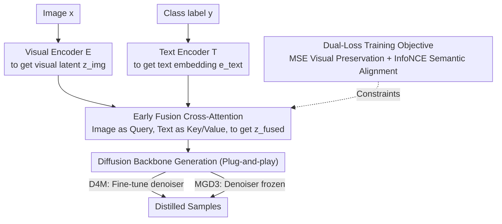

# EVLF: Early Vision-Language Fusion for Generative Dataset Distillation

**Conference**: CVPR 2026  
**arXiv**: [2603.07476](https://arxiv.org/abs/2603.07476)  
**Code**: [GitHub](https://github.com/wenqi-cai297/earlyfusion-for-dd/)  
**Area**: Image Restoration  
**Keywords**: Dataset Distillation, Diffusion Models, Vision-Language Fusion, Early Fusion, Plug-and-play

## TL;DR

Ours proposes EVLF, a plug-and-play method for early vision-language fusion at the encoder-backbone interface, addressing text over-dominance and visual fidelity degradation caused by late semantic injection in diffusion model dataset distillation.

## Background & Motivation

Dataset Distillation (DD) aims to synthesize compact training sets to allow models to achieve high accuracy with few samples. Diffusion-based DD methods (e.g., D4M, MGD3) have become mainstream but suffer from a core structural issue:

**Semantic dominance in late fusion**: In standard diffusion pipelines, text semantics are injected via cross-attention during the denoising stage (late fusion), which often causes the text signal to excessively dominate the generation trajectory.

**Visual fidelity degradation**: Since encoder-derived visual latents contain only visual information, late-injected semantics function as "corrections" rather than "co-evolutions." This leads to generated samples that match labels but exhibit visual distortions.

**Manifestations**: Generated samples often display unnatural shapes, text-like textures, and over-simplified outlines.

**Key Insight**: Move semantic fusion from the denoising stage forward to the encoder output stage (encoder-backbone interface), allowing visual and semantic signals to co-evolve from the beginning of the diffusion process.

## Method

### Overall Architecture

EVLF addresses the "late semantic injection" flaw in diffusion dataset distillation. Standard pipelines withhold text conditions until the denoising stage via cross-attention, effectively allowing visual latents to take shape before being "corrected" by text. Stronger correction often leads to text-like textures and unnatural contours. EVLF moves this fusion step entirely to the interface between the VAE encoder and the diffusion backbone.

Specifically, the image is passed through an encoder to obtain the visual latent $z_{\text{img}} = \mathcal{E}(x)$, and the category label is passed through a text encoder to obtain the embedding $e_{\text{text}} = \mathcal{T}(y)$. A lightweight cross-attention module fuses the two at this interface into $z_{\text{fused}} = \text{CA}(z_{\text{img}}, e_{\text{text}})$, which is then used as the initial condition for diffusion generation. When integrated with D4M, the denoiser is fine-tuned to adapt to the fused latent distribution; when integrated with MGD3, the denoiser can remain frozen.

### Key Designs

**1. Early Fusion Cross-Attention: Anchoring semantics to visual structures to prevent text dominance.**

This component directly targets the issue of text over-dominance in late injection. The module uses image tokens as the Query and text tokens as the Key/Value. Since the Query defines the "subject" being queried and determines the output structure, using the image as the Query forces the semantics to supplement existing visual structures rather than redrawing them:

$$Q = \tilde{z}W_Q, \quad K = \tilde{e}W_K, \quad V = \tilde{e}W_V$$

$$z_{\text{fused}} = \psi(\text{LN}(\tilde{z} + \text{softmax}(\frac{QK^\top}{\sqrt{d}})V))$$

The attention result is added back to the original visual latent $\tilde{z}$ via a residual connection, followed by LayerNorm and a projection $\psi$. Thus, fusion "overlays" semantics onto the visual base. This is the key difference from late injection: while late injection struggles to correct a fixed denoising trajectory, early fusion allows both signals to co-evolve while the latent is still malleable.

**2. Dual-Loss Training Objective: Balancing visual structure and category semantics.**

To prevent fusion from ignoring semantics or deviating from visual structures, two losses are used. The visual preservation loss $\mathcal{L}_{\text{MSE}} = \|z_{\text{fused}} - z_{\text{img}}\|_2^2$ anchors the fused latent to the original visual latent to maintain real image structures. The semantic alignment loss $\mathcal{L}_{\text{InfoNCE}}$ uses a learnable projector to map $z_{\text{fused}}$ into the text embedding space for contrastive learning, pulling similar classes together and pushing dissimilar ones apart. The weighted sum is:

$$\mathcal{L}_{\text{CA}} = \lambda_1 \mathcal{L}_{\text{InfoNCE}} + \lambda_2 \mathcal{L}_{\text{MSE}}$$

During training, $\lambda_2$ (visual term) increases progressively from small to large, allowing the model to learn semantic injection first before tightening the visual fidelity constraints.

**3. Plug-and-play: Interface-level module without specialized training schedules.**

The entire EVLF mechanism is encapsulated at the encoder-backbone interface, independent of specific samplers, diffusion losses, or training schedules. This allows it to be integrated into any encoder-based diffusion DD pipeline such as D4M or MGD3.

### Loss & Training

- The cross-attention module is trained for 4 epochs with a batch size of 16 using AdamW.
- $\lambda_1 = 0.1$ (fixed), and $\lambda_2$ increases linearly from 0.05 to 1.0 during the first 2 epochs.
- Optional denoiser fine-tuning: Standard diffusion loss is applied on $z_{\text{fused}}$.
- D4M integration requires denoiser fine-tuning, while MGD3 integration keeps it frozen.
- Training can be performed on a single NVIDIA A5000 GPU.

## Key Experimental Results

### Main Results

| Dataset | IPC | Metric | D4M | D4M+EVLF | MGD3 | MGD3+EVLF |
|--------|-----|------|-----|----------|------|-----------|
| ImageWoof | 10 | ResNetAP-10 | 33.2 | 37.3 | 36.6 | **39.3** |
| ImageWoof | 50 | ResNetAP-10 | 51.7 | 55.8 | 55.6 | **59.0** |
| ImageNette | 20 | ResNetAP-10 | 66.3 | 71.7 | 69.2 | **72.5** |
| CIFAR-10 | 10 | Accuracy | 37.6 | **45.7** | - | - |
| Tiny-ImageNet | 10 | Accuracy | 42.5 | **49.2** | - | - |
| ImageNet-1K | 50 | Accuracy | 60.1 | 60.6 | 60.3 | **61.9** |

### Ablation Study

| Configuration | IPC=10 | IPC=20 | IPC=50 | Background |
|------|--------|--------|--------|------|
| D4M Baseline | 47.7 | 56.3 | 67.8 | ResNetAP-10 on ImageIDC |
| +Denoiser FT | 54.1 | 61.1 | 70.3 | Fine-tuning is effective |
| +Cross-Attention | 51.1 | 57.5 | 69.1 | CA is effective |
| +Both | **57.3** | **62.0** | **72.1** | Optimal complementary effect |

### Key Findings

- EVLF consistently improves performance across all IPC settings and datasets, with larger gains in low IPC scenarios (e.g., +8.1% on CIFAR-10 IPC=10).
- t-SNE visualizations show that samples generated by EVLF have a wider distribution and better diversity.
- When $\lambda_1 > 0$ (EVLF enabled), both accuracy and coverage improve significantly, and the model is robust to different values of $\lambda_1$.
- Transfer learning experiments indicate that datasets distilled with EVLF possess better feature transferability.

## Highlights & Insights

1. **Precise Diagnosis**: ACCurately identified that late semantic injection in diffusion DD leads to text over-correction, supported by intuitive visualizations.
2. **Elegant Design**: A lightweight cross-attention module provides plug-and-play improvements without extensive pipeline modifications.
3. **Thorough Evaluation**: Covered CIFAR-10/100, Tiny-ImageNet, ImageNet-1K, multiple IPC settings, and various architectures.
4. **Conceptual Insight**: The comparison between early and late fusion highlights the importance of semantic injection timing in conditional generation.

## Limitations & Future Work

1. Currently supports only class-level conditions; does not support instance-level or multi-label scenarios.
2. The improvement of EVLF on large-scale ImageNet-1K settings is relatively small (~0.5-1.6%).
3. More complex fusion mechanisms (e.g., multi-layer fusion, adaptive weights) were not explored.
4. Future direction: Instance-aware and compositional prompts, extending to finer-grained control.

## Related Work & Insights

- **D4M**: An LDM DD method using prototype-driven sampling; EVLF provides a plug-and-play enhancement.
- **MGD3**: Multi-modal guided DD; EVLF can be seamlessly integrated.
- **MinimaxDiffusion**: DiT DD with minimax optimization, focusing on discriminability and representativeness.
- Insight: The early fusion philosophy of EVLF can be extended to optimize semantic injection timing in other conditional generation tasks.

## Rating

- Novelty: ⭐⭐⭐⭐ Simple but insightful idea of replacing late injection with early fusion.
- Experimental Thoroughness: ⭐⭐⭐⭐ 7 datasets, multiple IPCs/architectures, plus ablation/visualization/transfer studies.
- Writing Quality: ⭐⭐⭐⭐ Clear diagnosis, excellent framework diagrams, and logical flow.
- Value: ⭐⭐⭐⭐ A general-purpose plug-and-play method with practical value for the DD community.

<!-- RELATED:START -->

## Related Papers

- [\[CVPR 2026\] HiDRA: Hierarchical Degradation Representation and Adaptation with Generative Priors for Enhancing Infrared Vision](hidra_hierarchical_degradation_representation_and_adaptation_with_generative_pri.md)
- [\[CVPR 2026\] UniRain: Unified Image Deraining with RAG-based Dataset Distillation and Multi-objective Reweighted Optimization](unirain_unified_image_deraining_rag_dataset_distillation.md)
- [\[CVPR 2026\] Human-Centric Multi-Exposure Fusion: Benchmark and Bi-level Cognition Distillation Framework](human-centric_multi-exposure_fusion_benchmark_and_bi-level_cognition_distillatio.md)
- [\[CVPR 2026\] White-Balance First, Adjust Later: Cross-Camera Color Constancy via Vision-Language Evaluation](white-balance_first_adjust_later_cross-camera_color_constancy_via_vision-languag.md)
- [\[ICML 2026\] Early Decisions Matter: Proximity Bias and Initial Trajectory Shaping in Non-Autoregressive Diffusion Language Models](../../ICML2026/image_restoration/early_decisions_matter_proximity_bias_and_initial_trajectory_shaping_in_non-auto.md)

<!-- RELATED:END -->
