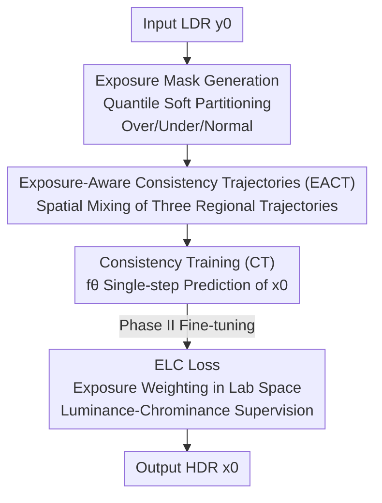

# ExpoCM: Exposure-Aware One-Step Generative Single-Image HDR Reconstruction

**Conference**: CVPR 2026  
**Paper**: [CVF Open Access](https://openaccess.thecvf.com/content/CVPR2026/html/Liu_ExpoCM_Exposure-Aware_One-Step_Generative_Single-Image_HDR_Reconstruction_CVPR_2026_paper.html)  
**Code**: https://github.com/AoyuLiu01/ExpoCM  
**Area**: Image Restoration / HDR Reconstruction / Consistency Models  
**Keywords**: Single-image HDR Reconstruction, Consistency Models, Exposure-Aware, PF-ODE, One-step Generation

## TL;DR
ExpoCM models single-image HDR reconstruction as an exposure-aware consistency model trajectory. By using soft exposure masks to categorize LDR regions into overexposed, underexposed, and normal, distinct PF-ODE consistency trajectories are designed for each (hallucinating details from pure noise for overexposed regions, injecting low-frequency priors for underexposed regions, and using the input directly for normal regions). Combined with an exposure-weighted luminance-chrominance loss in the CIE L\*a\*b\* space, it achieves SOTA fidelity via **distillation-free, single-step inference**, operating over 400x faster than DDPM.

## Background & Motivation
**Background**: Single-image HDR reconstruction aims to recover wide dynamic range irradiance from a single LDR image. Traditional methods rely on handcrafted priors (illumination estimation, camera response modeling). In the deep learning era, the mainstream approach involves using CNNs (HDRCNN, ExpandNet, SingleHDR, HDRUNet) to learn a direct regression mapping from LDR to HDR. Recently, some researchers have introduced the strong generative priors of diffusion models.

**Limitations of Prior Work**: Pure regression methods struggle with this highly ill-posed problem—pixels in overexposed regions are saturated and information is completely lost, leading regression models to provide blurry "average answers" without realistic details. In underexposed regions, noise is amplified, and regression tends to either amplify noise or produce over-smoothed results. While diffusion methods possess strong generative capabilities, they have two major drawbacks: first, they require dozens to thousands of iterative sampling steps (e.g., DDPM takes 174 seconds for a 512×512 image, which is impractical); second, standard diffusion processes are **spatially uniform**, treating all pixels identically during noise addition and removal.

**Key Challenge**: Degradation in HDR reconstruction is **spatially heterogeneous**—information loss in overexposed, underexposed, and normal regions occurs in entirely different ways (hallucination for saturation, denoising/structure preservation for underexposure, and fidelity for normal regions). However, existing consistency/diffusion trajectories use a unified path ($x_t = (1-\alpha)x_0 + \alpha y_0 + \sigma\epsilon$), treating degradation as uniform, which contradicts the heterogeneous nature of the task.

**Goal**: To achieve (1) hallucination of saturated details in overexposed areas, (2) noise suppression and structural recovery in underexposed areas, and (3) preservation of reliable content in normal areas within a **single step**, while ensuring training does not rely on distillation from pre-trained diffusion models.

**Key Insight**: The authors observe that Consistency Models (CM) learn a mapping from any point on a PF-ODE trajectory directly to the clean image $x_0$, naturally supporting one-step generation. Since trajectories are designable, the unified trajectory can be **decomposed into three region-specific trajectories based on exposure conditions** and then spatially mixed, allowing the generation process to be tailored to specific degradations.

**Core Idea**: Replace the unified trajectory with "Exposure-Aware Consistency Trajectories (EACT)." By injecting different perturbations and guidance into overexposed, underexposed, and normal regions according to soft exposure masks, spatially heterogeneous degradation is embedded directly into the PF-ODE flow. Combined with an exposure-weighted L\*a\*b\* loss, this achieves distillation-free, one-step high-fidelity HDR reconstruction.

## Method

### Overall Architecture
Given an LDR image $y_0$, ExpoCM aims to reconstruct the HDR image $x_0$ in one step. The pipeline consists of three parts: **First**, the exposure mask generation module softly partitions $y_0$ into overexposed, underexposed, and normal regions. **Second**, based on these three masks, Exposure-Aware Consistency Trajectories (EACT) are constructed, where a dedicated PF-ODE trajectory is used for each region and mixed spatially; the network $f_\theta$ is optimized using Consistency Training (CT) loss on this mixed trajectory. **Finally**, a second phase utilizes an exposure-weighted luminance-chrominance loss (ELC loss) for fine-tuning to suppress luminance bias and color shifts. During inference, noise $x_T$ (which can be pure noise or $y_0$ + noise) is fed into $f_\theta$ once to obtain the result, taking only 0.33s for 512×512.

The backbone is a U-Net with three downsampling and three upsampling stages. The input is the concatenated noise state $x_t$ and LDR image $y_0$ along the channel dimension, with timestep $t$ injected into each residual block as positional encoding.

### Key Designs

**1. Exposure Mask Generation: Identifying "where and how" via Quantile Soft Partitioning**

To apply targeted treatments, the model must identify the type of degradation for each pixel. Fixed brightness thresholds are fragile as their meaning varies across scenes. The authors use a **quantile** strategy: first calculate luminance $Y = 0.2126 I_R + 0.7152 I_G + 0.0722 I_B$, find the 2nd and 98th percentiles $(q_{lo}, q_{hi})$, and define a core interval with margin $\tau=0.02$: $l_{core} = q_{lo} + \tau(q_{hi}-q_{lo})$ and $h_{core} = q_{hi} - \tau(q_{hi}-q_{lo})$. Pixels darker than $l_{core}$ tend to be underexposed, while those brighter than $h_{core}$ tend to be saturated. Normalizing the distance to the core interval and clipping to $[0,1]$ yields confidence maps $m_{low}, m_{high}$, which combine into three **soft** weight maps:

$$w_{over} = m_{high}(1 - m_{low}), \quad w_{under} = m_{low}(1 - m_{high}), \quad w_{good} = 1 - \max(w_{over}, w_{under}).$$

Soft partitioning (rather than hard thresholding) ensures smooth boundaries without seams when mixing trajectories. This step serves as the "map" for the entire exposure-aware framework.

**2. Exposure-Aware Consistency Trajectories (EACT): Region-specific PF-ODE Mixed Spatially**

This is the core contribution. The uniform trajectory $x_t = (1-\alpha(t))x_0 + \alpha(t)y_0 + \sigma(t)\epsilon$ is problematic because it treats LDR observation $y_0$ as reliable guidance regardless of pixel quality. However, $y_0$ is saturated junk in overexposed areas and amplified noise in underexposed areas. The authors set specific trajectories for the three categories. For **overexposed regions**, structural information is completely lost in $y_0$; thus, **$y_0$ is not used at all**, forcing the model to hallucinate details from pure noise: $x_t^o = (1-\alpha(t))x_0 + \sigma_o(t)\epsilon$. For **underexposed regions**, signals are buried in noise; using $y_0$ directly introduces artifacts, so a low-frequency operator $\mathrm{Flow}(\cdot)$ (e.g., Gaussian blur) extracts coarse structural priors from $y_0$ to provide reliable guidance without high-frequency noise: $x_t^u = (1-\alpha(t))x_0 + \alpha(t)\lambda_u \mathrm{Flow}(y_0) + \sigma_u(t)\epsilon$. For **normal regions**, $y_0$ is reliable, following a baseline-like trajectory: $x_t^g = (1-\alpha(t))x_0 + \alpha(t)y_0 + \sigma_g(t)\epsilon$.

The full trajectory is mixed pixel-wise:

$$x_t = w_{over} \odot x_t^o + w_{under} \odot x_t^u + w_{good} \odot x_t^g,$$

where $\odot$ denotes element-wise multiplication. Unlike existing two-stage decoupled pipelines, ExpoCM is a **unified one-step** framework that solves restoration (denoising/structure preservation) and generation (hallucination) simultaneously by mathematically mixing ODE trajectories. The network $f_\theta$ is optimized via Consistency Training loss $\mathcal{L}_{CT}(\theta,\theta^-)=\mathbb{E}\big[\|f_\theta(x_t,t,y_0)-f_{\theta^-}(x_{t'},t',y_0)\|_2^2\big]$, learning a single-step mapping **without distilling from pre-trained diffusion models**.

**3. Exposure-Weighted Luminance-Chrominance Loss (ELC): Optimizing Brightness and Color in Perceptually Uniform Space**

Even with a strong generative prior, reconstructed images may suffer from luminance imbalance or color shifts. Supervision is moved to the **perceptually uniform** CIE L\*a\*b\* space, which decouples luminance L\* and chrominance (a\*, b\*). Brightness residuals $\Delta L^* = \hat{L}^* - L^*$ and chrominance residuals $\Delta C^* = \sqrt{(\hat{a}^*-a^*)^2 + (\hat{b}^*-b^*)^2}$ are calculated.

The key insight is that **different regions have different reliability for luminance/chrominance**: underexposed chrominance is noise-contaminated, but luminance still contains structural cues; thus, **luminance should be strictly constrained while relaxing chrominance**. Overexposed areas lose color due to saturation, so **chrominance (color recovery) should be strictly constrained while tolerating luminance drift**. Normal regions are reliable for both. Continuous differentiable weights $w_L, w_C$ are designed accordingly:

$$w_L = \lambda_L^{(0)}\big(1 + \kappa_L^{lo} s_Y w_{under}^\alpha + \kappa_L^{hi} A_{spec} w_{over}^\alpha\big),$$
$$w_C = \lambda_C^{(0)}\big(\kappa_C^{hi} w_{over}^\alpha (1-A_{spec}) h_Y + \kappa_C^{lo} w_{under}^\alpha (1-s_Y)\big).$$

The final loss is $\mathcal{L}_{ELC} = \mathbb{E}[w_L \cdot \rho(\Delta L^*)] + \mathbb{E}[w_C \cdot \rho(\Delta C^*)]$, where $\rho$ is the Charbonnier penalty.

### Loss & Training
Two-stage training: **Phase I** uses consistency training loss $\mathcal{L}_{CT}$ to learn exposure-aware trajectories for stable one-step inference. **Phase II** uses ELC loss for fine-tuning to eliminate luminance imbalance and color shifts. Implementation: PyTorch + NVIDIA 3090, 500K iterations, batch size 4, 256×256 random crops, AdamW, learning rate $5\times10^{-5}$ with cosine annealing to $1\times10^{-7}$.

## Key Experimental Results

### Main Results
Comparison with 8 methods on HDR-REAL, HDR-EYE, and AIM2025. Table shows PSNR-µ, HDR-VDP-2/-3, and color difference ∆E2000 (lower is better):

| Dataset | Method | PSNR-µ ↑ | SSIM-µ ↑ | HDR-VDP-2/-3 ↑ | LPIPS ↓ | ∆E2000 ↓ |
|--------|------|----------|----------|----------------|---------|----------|
| HDR-REAL | DDPM (1000 steps) | 25.45 | 0.8173 | 43.52 / 7.45 | 0.1921 | 10.40 |
| HDR-REAL | Reti-Diff | 27.64 | 0.8354 | 42.08 / 7.31 | 0.2645 | 4.83 |
| HDR-REAL | **Ours** | **28.66** | **0.8684** | **44.27 / 7.72** | **0.1919** | **4.02** |
| HDR-EYE | **Ours** | **20.75** | **0.8017** | 44.09 / 7.94 | 0.2353 | **9.68** |
| AIM2025 | HDRUNet | 25.88 | 0.8709 | 57.83 / 7.06 | 0.2218 | 4.46 |
| AIM2025 | **Ours** | **29.02** | **0.8922** | 74.01 / 8.68 | 0.1511 | **3.90** |

ExpoCM leads in PSNR-µ, SSIM-µ, and ∆E2000 across datasets. The lowest ∆E2000 confirms the effectiveness of the ELC loss in suppressing color shifts.

**Efficiency**: Inference for 512×512 takes 0.33s, over **400× faster** than DDPM (174.10s) and **>20× faster** than 50-step DDIM (7.85s).

### Ablation Study
**EACT Trajectories (Number of Masks)**:

| Configuration | PSNR-µ (REAL) | SSIM-µ (REAL) | PSNR-µ (AIM) | Explanation |
|------|---------------|---------------|--------------|------|
| Baseline (Unified) | 21.09 | 0.6917 | 27.90 | Spatially uniform, worst |
| Two-Mask (Normal vs. Pathological) | 25.75 | 0.8076 | 28.48 | Distinguishing reliability helps |
| Three-Mask (Over/Under/Normal) | **25.84** | **0.8282** | **28.89** | Full model, best performance |

### Key Findings
- **Differentiating over/under-exposure is vital**: Moving from a unified baseline to Two-Mask yields a +4.66 PSNR increase. Further refinement to Three-Mask improves SSIM and LPIPS, proving that overexposure (hallucination) and underexposure (denoising) require distinct handling.
- **EACT and ELC are complementary**: EACT handles the bulk of fidelity gains, while ELC specifically minimizes color difference.
- **Efficiency without Distillation**: ExpoCM achieves high-quality results in one step without needing pre-trained diffusion models for distillation.

## Highlights & Insights
- **Embedding spatial heterogeneity into trajectories**: Unlike two-stage methods that are slow and prone to artifacts, ExpoCM mixes ODE trajectories mathematically to solve restoration and generation in one pass.
- **Distillation-free consistency training**: This provides a practical paradigm for applying CM to low-level vision tasks without the cost of pre-training diffusion models for distillation.
- **Exposure-decoupled luminance/chrominance supervision**: The philosophy of "trusting luminance but not chrominance in dark areas" aligns with imaging physics and is transferable to tasks like denoising or low-light enhancement.

## Limitations & Future Work
- **Dependence on Soft Mask Quality**: Masks rely on luminance statistics; extreme scenes (e.g., large monochromatic areas) might lead to biased quantile estimations.
- **Perceptual metrics on small datasets**: On HDR-EYE, certain perceptual metrics like HDR-VDP-2 were lower than DDPM, suggesting that one-step generation still faces challenges in very small sample scenarios compared to multi-step diffusion.
- **Hyperparameter Sensitivity**: The ELC loss contains several coefficients; although reported as robust, their generalization across vastly different datasets requires further validation.

## Related Work & Insights
- **vs. CNNs (HDRCNN/SingleHDR)**: Regression models produce blurry results in overexposed areas. ExpoCM uses generative trajectories to hallucinate sharp details.
- **vs. Diffusion (DDPM/DDIM)**: ExpoCM is over 400x faster than DDPM and maintains higher fidelity (PSNR/∆E2000) than reduced-step DDIM by embedding exposure priors.
- **vs. Two-stage Exposure-aware methods**: ExpoCM avoids artifacts at regional boundaries by using a unified mathematical mixture of ODE trajectories in a single step.

## Rating
- Novelty: ⭐⭐⭐⭐⭐ 
- Experimental Thoroughness: ⭐⭐⭐⭐ 
- Writing Quality: ⭐⭐⭐⭐ 
- Value: ⭐⭐⭐⭐⭐ 

<!-- RELATED:START -->

## Related Papers

- [\[CVPR 2026\] GDPO-SR: Group Direct Preference Optimization for One-Step Generative Image Super-Resolution](gdpo-sr_group_direct_preference_optimization_for_one-step_generative_image_super.md)
- [\[CVPR 2026\] Time-Aware One Step Diffusion Network for Real-World Image Super-Resolution](time-aware_one_step_diffusion_network_for_real-world_image_super-resolution.md)
- [\[CVPR 2026\] Rectifying Latent Space for Generative Single-Image Reflection Removal](rectifying_latent_space_for_generative_single-image_reflection_removal.md)
- [\[ICLR 2026\] SoFlow: Solution Flow Models for One-Step Generative Modeling](../../ICLR2026/image_restoration/soflow_solution_flow_models_for_one-step_generative_modeling.md)
- [\[ECCV 2024\] Intrinsic Single-Image HDR Reconstruction](../../ECCV2024/image_restoration/intrinsic_single-image_hdr_reconstruction.md)

<!-- RELATED:END -->
## Related Papers

- [\[CVPR 2026\] GDPO-SR: Group Direct Preference Optimization for One-Step Generative Image Super-Resolution](gdpo-sr_group_direct_preference_optimization_for_one-step_generative_image_super.md)
- [\[CVPR 2026\] Time-Aware One Step Diffusion Network for Real-World Image Super-Resolution](time-aware_one_step_diffusion_network_for_real-world_image_super-resolution.md)
- [\[CVPR 2026\] F²HDR: Two-Stage HDR Video Reconstruction via Flow Adapter and Physical Motion Modeling](f2hdr_two-stage_hdr_video_reconstruction_via_flow_adapter_and_physical_motion_mo.md)
- [\[ECCV 2024\] Intrinsic Single-Image HDR Reconstruction](../../ECCV2024/image_restoration/intrinsic_single-image_hdr_reconstruction.md)
- [\[CVPR 2026\] LRHDR: Learning Representation-enhanced HDR Video Reconstruction](lrhdr_learning_representation-enhanced_hdr_video_reconstruction.md)

<!-- RELATED:END -->
