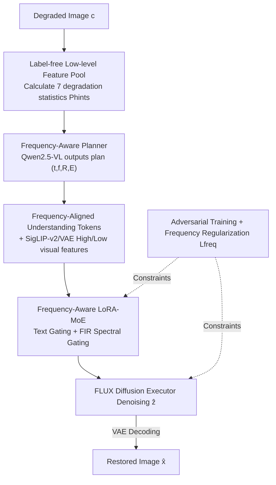

# FAPE-IR: Frequency-Aware Planning and Execution Framework for All-in-One Image Restoration

**Conference**: CVPR 2026  
**Paper**: [CVF Open Access](https://openaccess.thecvf.com/content/CVPR2026/html/Liu_FAPE-IR_Frequency-Aware_Planning_and_Execution_Framework_for_All-in-One_Image_Restoration_CVPR_2026_paper.html)  
**Code**: https://github.com/Programmergg/FAPE-IR  
**Area**: Image Restoration / All-in-One Image Restoration  
**Keywords**: All-in-One Image Restoration, Frequency-Aware, MLLM Planner, LoRA-MoE, Diffusion Model  

## TL;DR
FAPE-IR utilizes a frozen multimodal large language model (Qwen2.5-VL) as a "planner" to interpret degraded images and generate frequency-aware restoration plans. An execution stage utilizing a LoRA-MoE within a diffusion framework dynamically schedules high- and low-frequency experts based on these plans. Combined with adversarial training and frequency regularization, the method achieves SOTA performance across seven restoration tasks and exhibits strong zero-shot generalization to unseen composite degradations.

## Background & Motivation

**Background**: All-in-One Image Restoration (AIO-IR) aims to handle various degradations—such as deraining, desnowing, dehazing, deblurring, low-light enhancement, denoising, and super-resolution—within a unified model. Current mainstream approaches follow two paths: **multi-branch mapping**, which injects task-level priors (prompts, embeddings, or dedicated encoders) into a shared backbone to learn specific restoration paths; and **clustering/routing**, which clusters features or routes them to experts within a latent space.

**Limitations of Prior Work**: The multi-branch path faces gradient conflicts among different degradations under shared parameters, making it difficult to achieve optimality for all tasks simultaneously. Moreover, both training and inference rely on task labels or manual prompts, incurring high annotation costs. The clustering/routing path suffers from "gradient isolation," where tasks are strictly separated in latent space, preventing the model from learning shared structural knowledge and reducing robustness to composite degradations. Critically, both lack semantic understanding and content adaptivity, often relying on opaque restoration pipelines.

**Key Challenge**: The fundamental conflict lies in whether to **share** or **isolate** knowledge across tasks. Existing methods use fixed, task-level designs that either cause conflict through total sharing or fragmentation through total isolation, lacking the ability to make per-image adaptive decisions.

**Key Insight**: Degradations naturally possess frequency attributes. Tasks like deraining, desnowing, deblurring, and denoising primarily address **high-frequency** components (textures, edges, fine structures), while dehazing and low-light enhancement focused on **low-frequency** components (illumination, color, global brightness). By grouping tasks by frequency, the model can allow "intra-frequency sharing and inter-frequency isolation," resolving the tension between gradient conflict and isolation from a frequency perspective.

**Core Idea**: The framework treats diffusion as an "execution engine" preceded by an MLLM-based "planner." The planner parses degradation semantics and outputs a frequency-aware restoration plan. A Frequency-Aware LoRA-MoE then dynamically selects high/low-frequency experts according to the plan, coupling semantic planning with frequency-domain restoration through a unified **understand-to-generate** paradigm.

## Method

### Overall Architecture
FAPE-IR follows a "Planning and Execution" paradigm. Given a degraded image $c$: In the **Planning Phase**, a frozen Qwen2.5-VL acts as a frequency-aware planner. It calculates a set of label-free low-level statistics from pixels to serve as visual hints. Combined with general restoration instructions and expert rules, the MLLM outputs a parsable restoration plan (degradation type, primary frequency focus, restoration steps, and reasoning), encoded as "understanding tokens." In the **Execution Phase**, a diffusion executor based on the FLUX transformer denoises VAE latents. During this process, the Frequency-Aware LoRA-MoE module uses a **dual-end gating** mechanism (textual tokens + spectral energy of intermediate features) to perform top-1 selection between high- and low-frequency experts. The system is optimized via adversarial training and frequency regularization.

### Key Designs

**1. Frequency-Aware Planner: Explicit Frequency Restoration Plans via Frozen MLLM**

To address the lack of semantic understanding in existing methods, FAPE-IR discards task labels in favor of frequency-based planning by Qwen2.5-VL. A **label-free low-level feature pool** is constructed by calculating a vector $P_{hints}$ directly from pixels, where each component represents a statistical measure of typical degradations: directional stripe intensity for rain, bright spot density for snow, variance in flat areas for noise, Laplacian/gradient response for blur, dark channel/saturation for haze, global brightness for low-light, and spatial dimensions $H\times W$ for SR. These statistics require no supervision. The planner receives three inputs: general instructions $r$, expert rules $P_{expert}$ (mapping degradations to frequency bands), and visual hints $P_{hints}$. It outputs a parsable quadruple $FP=(\hat{t},\hat{f},R,E)$, where $\hat{t}$ is the task, $\hat{f}$ is the targeted frequency, $R$ is the natural language workflow, and $E$ is the rationale. This human-readable plan serves as the **routing signal** for downstream experts. The plan is encoded into tokens $h$, merged with vision features (SigLIP-v2 and VAE) to form condition tokens $h_{cond}$, while text tokens $h_{text}$ are reserved for MoE gating.

**2. Frequency-Aware LoRA-MoE: Interpretable Routing with Dual-end Gating**

To resolve the sharing vs. isolation conflict, the executor employs only two LoRA experts—specializing in high and low frequencies. This parameter-efficient approach allows tasks within the same frequency band to share experts. **Dual-end gating** is implemented: **Frequency-aware textual routing** uses $h_{text}$ from the planner. Since $h_{text}\in\mathbb{R}^{B\times K\times D}$ while gating operates per-token in $\mathbb{R}^{B\times L\times D}$, $h_{text}$ is zero-padded and passed through a per-token FC layer with softmax to get $w_{text}=\text{Softmax}(W_t\cdot\text{Padding}(h_{text}))$. In parallel, **FIR spectral routing** compensates for the limitations of high-level semantic tokens. A depthwise separable FIR low-pass filter (fixed 1D Gaussian kernel $g$) decomposes intermediate tokens $h_{gen}$ into $h_{low}=L_g(h_{gen})$ and $h_{high}=h_{gen}-h_{low}$. Gating weights $w_{visual}$ are calculated based on relative energy $e_{low}/e_{high}$. The two paths are fused via a learnable scalar $\lambda_s$: $\tilde{\alpha}=\lambda_s w_{text}+(1-\lambda_s)w_{visual}$, and a top-1 selection $\alpha=\text{Top1}(\tilde{\alpha})$ is applied. The FLUX projection matrix is updated as:

$$W' = W + \sum_{i=1}^{N}\alpha_i\,A_iB_i,$$

where $(A_i,B_i)$ are the LoRA adapters for frequency expert $i$. This ensures expert assignment is determined by both semantic intent and spectral evidence.

**3. Adversarial Training + Multi-level Discriminator: Enhancing Fidelity on Diffusion Weights**

To mitigate artifacts common in flow-matching fine-tuning for unified models, FAPE-IR switches to adversarial training (justified by Theorem 6 in the appendix). The discriminator uses a frozen SigLIP-v2 $F_{sig}$ to extract multi-layer feature maps reorganized into spatial features $\{f^{(l)}\}$ and a pooled representation $p$. A **multi-level discriminator head** $H_\psi$ processes these maps using spectral-normalized convolutions with BlurPool downsampling. The scores are aggregated as $D(x)=\frac{1}{L+1}\big(\sum_{l=1}^{L}\bar{s}^{(l)}+s^{pool}\big)$ to align local structures and global semantics. The generator objective $\mathcal{L}_{adv}$ combines MSE, LPIPS, and adversarial loss to balance pixel fidelity, perceptual similarity, and realism.

**4. Frequency Regularization Loss: Enforcing Expert Specialization**

To ensure the LoRA-MoE experts truly specialize in their respective bands, an energy-based frequency regularization loss is added. Let $L_g$ be the low-pass filter and $H_g\triangleq I-L_g$ be the high-pass filter. For high- and low-frequency adapter outputs $y_{high}$ and $y_{low}$, "out-of-band" energy is penalized:

$$\mathcal{L}_{freq}=\text{mean}\big(\|H_g(y_{low})\|_2^2+\|L_g(y_{high})\|_2^2\big),$$

meaning the low-frequency expert should not generate high-frequency content and vice versa. The total objective is $\mathcal{L}_{Total}=\mathcal{L}_{adv}+\gamma\,\mathcal{L}_{freq}$.

### Training Strategy
The main model utilizes the Prodigy optimizer, while the discriminator head uses AdamW ($LR=1\times10^{-4}$ with cosine annealing). The model is trained for 200K steps with a batch size of 1 on $512\times512$ inputs using 8× H200 GPUs. In the one-step setting, parameters are set to $\alpha=50.0$, $\beta=5.0$, $\lambda=0.5$, $\gamma=1\times10^{-3}$, and diffusion timestep $t=300$.

## Key Experimental Results

### Main Results
Seven restoration tasks were evaluated using a **single** trained model. Selected PSNR/SSIM results for the AIO-IR sequence are shown below (see Table 1 in the paper for LPIPS/FID/DISTS).

| Task | Metric | FAPE-IR | Best Baseline | Gain |
|------|------|---------|----------|------|
| Deraining | PSNR | **28.30** | 21.94 (PromptIR) | +6.36 dB |
| Deraining | FID↓ | **21.55** | 100.07 (AdaIR) | ↓ ~4.6× |
| Desnowing | PSNR | **30.29** | 24.19 (AdaIR) | +6.10 dB |
| Dehazing | PSNR | **33.85** | 21.94 (PromptIR) | +11.91 dB |
| Deblurring | PSNR | **30.91** | 30.82 (DFPIR) | +0.09 dB |
| Low-light | SSIM | **0.90** | 0.90 (DFPIR) | Best/Tie |
| Denoising | SSIM | **0.87** | 0.84 (PromptIR) | +0.03 |

Super-resolution (SR) comparison against diffusion-based methods:

| Method | PSNR↑ | SSIM↑ | LPIPS↓ | FID↓ | DISTS↓ |
|------|-------|-------|--------|------|--------|
| OSEDiff | 26.49 | 0.76 | 0.28 | 117.55 | 0.21 |
| PASD | 26.87 | 0.75 | 0.29 | 120.46 | 0.21 |
| **FAPE-IR** | **28.53** | **0.85** | **0.19** | **85.82** | **0.15** |

Weather-related tasks (rain/snow/haze) see PSNR gains of 6–11 dB, as these degradations match the frequency-aware planning paradigm well.

### Ablation Study
Mini-ablation on URHI (low-frequency/haze dominant) at 10K steps:

| Configuration | PSNR↑ | SSIM↑ | Description |
|------|-------|-------|------|
| Baseline (w/o Qwen/Freq-U/G) | 25.03 | 0.92 | Pure baseline |
| + Qwen2.5-VL (no routing) | 27.95 | 0.94 | Semantic planning helps but insufficient |
| + Freq-U (Textual Routing) | 28.92 | 0.94 | Plan coupled with MoE gating |
| + Freq-G (FIR Spectral Routing) | **29.71** | **0.95** | Best; uses spectral priors |

### Key Findings
- **Coupling Frequency and Semantics**: Adding MLLM alone only reaches 27.95 dB. Only the combination of spectral priors (Freq-G) and semantic planning (Freq-U) stabilizes performance at 29.71 dB.
- **Planner Effectiveness**: t-SNE analysis of decision tokens shows clean, frequency-aligned task manifolds. Textual task classification accuracy is 79.4%.
- **Zero-shot Composite Generalization**: Despite training on single degradations, the model effectively removes low-frequency artifacts and preserves details in composite scenarios (e.g., haze + rain).

## Highlights & Insights
- **Unifying "Sharing vs. Isolation" via Frequency**: Rather than task labels, the model groups by high/low frequency, allowing intra-frequency sharing and inter-frequency isolation. This resolves gradient conflict and isolation simultaneously.
- **Interpretable Planning**: The frozen MLLM generates human-readable $(\hat{t},\hat{f},R,E)$ quadruples, providing transparency in the decision-making process for complex degradations.
- **Dual-end Gating Robustness**: The fusion of high-level semantic intent and low-level spectral evidence makes the MoE routing more robust to "spectral drift" during optimization.
- **Simple Frequency Regularization**: A single scalar term explicitly enforces expert specialization, harmonizing interpretability and fidelity.

## Limitations & Future Work
- **Planner Accuracy**: Task classification is 79.4%, with some confusion on grayscale images (triggering low-light flags).
- **Computational Overhead**: At 38.92G VRAM, the model is significantly heavier than lightweight AIO-IR competitors like MoCE-IR, despite being faster than PURE.
- **Expert Granularity**: Two experts (high/low) might be too coarse for "mid-frequency dominant" or highly mixed degradations.
- **Future Directions**: Extending to multi-band experts, weight adaptation for MLLM planners, and quantitative evaluation of composite degradation generalization.

## Related Work & Insights
- **vs. Multi-branch (PromptIR / InstructIR)**: These rely on task labels and suffer from gradient conflicts. FAPE-IR is label-free and mitigates conflicts via frequency grouping.
- **vs. Clustering/Routing (AdaIR / DFPIR)**: These isolate tasks strictly, losing shared structural knowledge. FAPE-IR enables sharing within frequency bands, improving robustness.
- **vs. MLLM+Diffusion (BAGEL / Janus)**: While general models focus on high-level creativity, FAPE-IR specializes in low-level restoration, emphasizing artifact suppression and fine-grained control.

## Rating
- Novelty: ⭐⭐⭐⭐⭐ Resolves sharing vs. isolation via frequency; novel MLLM-planning + frequency LoRA-MoE integration.
- Experimental Thoroughness: ⭐⭐⭐⭐ Extensive tasks and ablations, though quantitative composite results are missing.
- Writing Quality: ⭐⭐⭐⭐ Clear logic and motivation.
- Value: ⭐⭐⭐⭐⭐ Provides a transferable paradigm for MLLM+Diffusion in low-level vision.

<!-- RELATED:START -->

## Related Papers

- [\[CVPR 2026\] UniLDiff: Unlocking the Power of Diffusion Priors for All-in-One Image Restoration](unildiff_unlocking_the_power_of_diffusion_priors_for_all-in-one_image_restoratio.md)
- [\[CVPR 2026\] Degradation-Consistent Test-Time Adaptation for All-in-One Image Restoration](degradation-consistent_test-time_adaptation_for_all-in-one_image_restoration.md)
- [\[CVPR 2026\] Retrieve-to-Restore: Efficient All-in-One Image Restoration with a Retrieval-Based Degradation Bank](retrieve-to-restore_efficient_all-in-one_image_restoration_with_a_retrieval-base.md)
- [\[CVPR 2026\] DRFusion: Degradation-Robust Fusion via Degradation-Aware Diffusion Framework](drfusion_degradation_robust_fusion_via_degradation_aware_diffusion_framework.md)
- [\[CVPR 2025\] Degradation-Aware Feature Perturbation for All-in-One Image Restoration](../../CVPR2025/image_restoration/degradation-aware_feature_perturbation_for_all-in-one_image_restoration.md)

<!-- RELATED:END -->
