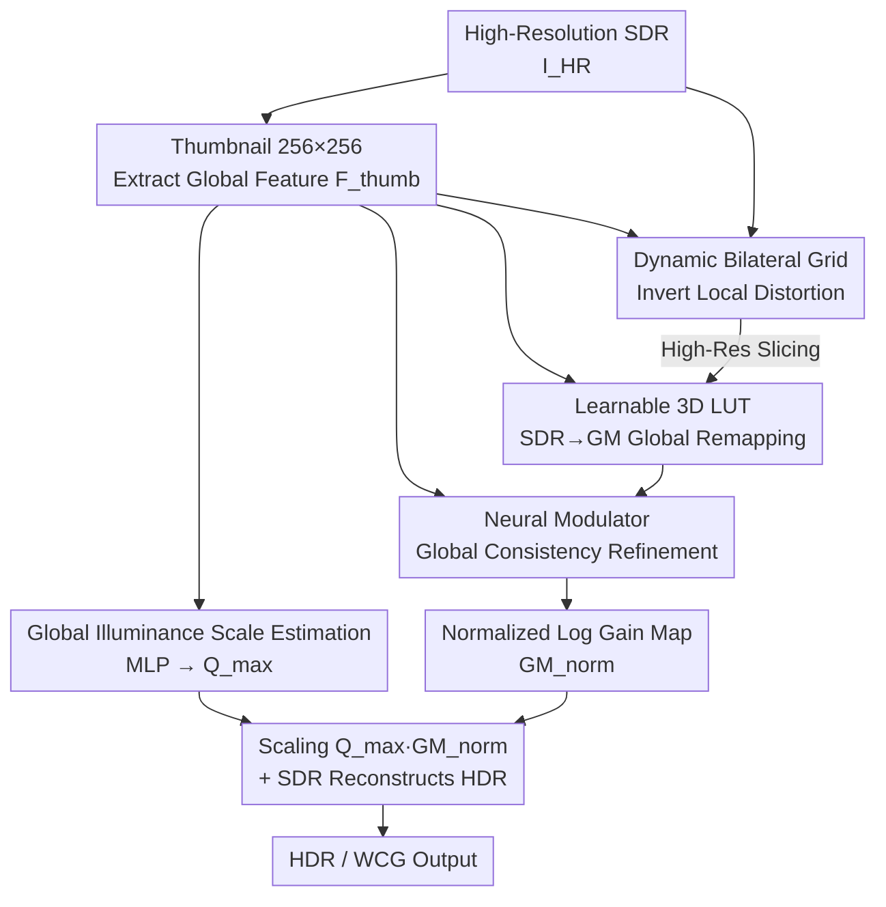

# FastGaMer: Efficient GainMap Learning for Practical Inverse Tone Mapping

**Conference**: CVPR 2026  
**Paper**: [CVF Open Access](https://openaccess.thecvf.com/content/CVPR2026/html/Guan_FastGaMer_Efficient_GainMap_Learning_for_Practical_Inverse_Tone_Mapping_CVPR_2026_paper.html)  
**Code**: None  
**Area**: Image Restoration / Inverse Tone Mapping / HDR Reconstruction  
**Keywords**: Inverse Tone Mapping, Color Gain Map, Bilateral Grid, Learnable 3D LUT, Real-time 4K

## TL;DR
FastGaMer reformulates inverse tone mapping (SDR $\rightarrow$ HDR/WCG) as predicting a three-channel color gain map. Following the degradation structure of local tone mapping, it decouples the inversion of global compression and local adaptation: using a dynamic bilateral grid to invert local distortions, a learnable 3D LUT for global remapping, and a lightweight neural modulator to ensure global consistency. Because all high-resolution operators are "network-free", the method processes a 4K image in 6.2 ms on a V100 GPU, achieving a 1.4 dB higher PQ-PSNR than the previous state-of-the-art lightweight method while reducing runtime by 70%.

## Background & Motivation
**Background**: Consumer displays are rapidly transitioning to HDR and Wide Color Gamut (WCG), yet most content still exists in SDR format, necessitating Inverse Tone Mapping (ITM) to reconstruct HDR/WCG from SDR. Unlike offline remastering, practical ITM must perform real-time processing on 4K or higher resolutions on resource-constrained hardware such as smart TVs and set-top boxes.

**Limitations of Prior Work**: In real-world pipelines, SDR is rarely compressed via a single global curve. Camera ISPs and local tone mapping operators (local TMOs, e.g., Adobe Camera Raw) apply spatially varying local adaptation—such as region-by-region contrast adjustment, exposure tuning, and gamut compression—on top of global radiometric compression. This renders the inverse problem highly structured: SDR images contain both global radiometric compression and content-dependent local adjustments. Existing learning-based ITM methods completely ignore this degradation structure. They either directly regress HDR pixel values (which GMNet has proven to be computationally expensive and inefficient for learning high-bit dynamic ranges at full resolution) or only learn a single-channel gain map like GMNet. A single-channel map can only scale luminance, failing to recover the compressed wide color gamut and inter-channel color ratio distortions.

**Key Challenge**: There is a strict trade-off between reconstruction accuracy and real-time efficiency. Pure network-based methods (e.g., HDRUNet, FMNet, GMNet) achieve high accuracy but fail to meet 4K real-time constraints due to excessive FLOPs, memory usage, and latency. Pure LUT-based methods (e.g., LUTwithGrid, SVDLUT) are fast but are 8-bit and context-agnostic, making them vulnerable to the spatially-varying degradation of local tone mapping. Hybrid methods like ITMLUT improve global adaptation but remain computationally heavy and fragile under aggressive local TMO.

**Goal**: To achieve network-level accuracy and LUT-level efficiency simultaneously in a unified framework, while truly restoring the WCG color gamut rather than just luminance.

**Key Insight**: Since SDR is generated by cascading "global compression $\oplus$ local adaptation", the model should explicitly mirror this forward degradation process and decouple the inversion of both degradations. Meanwhile, the prediction target should be shifted from absolute HDR values to a more learning-friendly color gain map.

**Core Idea**: Replacing direct HDR regression with "three-channel color gain map + decoupled global/local inversion + network-free high-resolution processing" to achieve both accurate and extremely fast reconstruction.

## Method

### Overall Architecture
FastGaMer takes a high-resolution SDR image $I_{HR}$ as input and outputs a log-domain color gain map $GM^{log}_{pred}$ for HDR reconstruction. Its key efficiency trick is "operating on the thumbnail, executing on the full resolution": the high-resolution input $I_{HR}$ is downsampled to a $256\times256$ thumbnail $I_{thumb}$. A lightweight encoder extracts the global feature $F_{thumb}$, which is used to parallelly predict a global scalar $\hat{Q}_{max}$ (absolute dynamic range) and three image-adaptive operators. These three operators are then sequentially applied to the original high-resolution $I_{HR}$. The entire high-resolution pipeline consists of network-free operations (look-up, slicing, and affine operations). Thus, heavy computation is restricted to the low-resolution thumbnail, leaving almost zero network overhead at the high-resolution stage, which naturally ensures resolution-agnosticism.

The target of the prediction is a normalized, log-encoded three-channel gain map $GM^{log}_{norm} \in [-1, 1]$. The final absolute log gain map is scaled by the global scale:

$$GM^{log}_{pred} = \hat{Q}_{max}\cdot GM^{log}_{norm}$$

This step explicitly decouples "global luminance scale prediction" ($\hat{Q}_{max}$) and "relative dynamic range and gamut modeling" ($GM^{log}_{norm}$). Once the gain map is obtained, HDR is reconstructed using industrial standard (Adobe/Google) log-domain gain map formulas: first, the gamma-compressed SDR is converted to the log domain and added to the predicted gain, then exponentiated back to the linear domain:

$$I^{log}_{HDR} = \log_2\big((I_{HR})\gamma+\text{offset}\big) + GM^{log}_{pred},\quad I^{lin}_{HDR} = 2^{\,I^{log}_{HDR}}-\text{offset}$$

where $\gamma=2.2$ and $\text{offset}=1/64$. The entire pipeline consists of four contributing modules: scale estimation, grid generation and slicing, LUT generation and transformation, and neural modulation. The diagram below illustrates how they branch from the thumbnail and concatenate at high resolution:

### Key Designs

**1. Color Gain Map as Prediction Target: Shifting from "Learning HDR Values" to "Learning Channel-wise Residual Gains"**

The most straightforward approach to ITM is to directly regress HDR pixels. However, fitting a wide dynamic range and fine-grained color mapping at full resolution causes computation and GPU memory consumption to skyrocket. GMNet mitigates this by learning a single-channel gain map, but it only scales luminance and cannot recover the wide color gamut compressed by local tone mapping, nor can it correct chromaticity-related distortions. FastGaMer instead predicts a **three-channel** color gain map $GM^{log}_{norm}$: each color channel has an independent gain, enabling channel-wise scaling that reconstructs both HDR and WCG while correcting color ratio distortions. The paper employs log-domain and normalized encoding (valued in $[-1,1]$) to balance the gain distribution, making it easier to learn than direct regression of high-bit HDR. Ablation studies show that removing gain map learning (degrading to direct HDR regression) drops PQ-PSNR by over 3 dB and increases $\Delta E_{ITP}$ from 24.61 to 31.89, which is the most severe performance drop among all modules, proving it is the foundation of the framework.

**2. Decoupled Global/Local Inversion: Addressing Local Adaptation and Global Compression via "Dynamic Bilateral Grid + Learnable 3D LUT"**

The core observation of this paper is that local TMO degradation equals global radiometric compression $\oplus$ spatially-varying local adaptation, so the inversion is split into two corresponding paths. The **local path** uses a dynamic bilateral grid generated from global features $F_{thumb}$ to handle spatially-varying distortions: a lightweight MLP produces $K$ grids of size $N_b\times N_b\times N_b$ (the implementation uses $K=3$, $N_b=8$). Multiple grids mitigate over-smoothing and provide rich scene-adaptive bases. To save computation, the input RGB channels are directly reused as range guidance. Grid features are fused with input RGB via a $1\times1$ projection, yielding the spatially modulated base $I_{grid}$. The **global path** runs parallel to the grid, generating a 3D LUT from $F_{thumb}$ (a two-layer MLP predicts parameters of size $3\times N_t\times N_t\times N_t$, with $N_t=17$). It performs trilinear sampling on the high-resolution $I_{grid}$ to complete the global intensity and color remapping from the SDR domain to the log gain map domain. Unlike conventional pixel-wise and context-agnostic LUTs, the LUT here is conditioned on the global thumbnail features and is scene-aware. Consequently, it works synergistically with the bilateral grid without collapsing under strong local degradations. Ablation studies display that removing grid slicing leads to flat contrast and weakened edges, while removing the LUT severely damages color fidelity—the two are complementary, with one handling spatial structure and the other managing channel-wise color.

**3. Global Illuminance Scale Estimation: Predicting Absolute Dynamic Range $\hat{Q}_{max}$ Only from the Whole Image to Avoid Patch Dependency**

Estimating absolute luminance from cropped patches is an ill-posed problem, which degrades both training and restoration accuracy. FastGaMer decouples absolute illuminance scale prediction from relative dynamic range and gamut modeling. A small encoder with strided convolutional blocks extracts $F_{thumb}$ from the whole thumbnail $I_{thumb}$, and a two-layer MLP maps it to the scalar $\hat{Q}_{max}$. During training, although supervision is calculated on cropped patches, the whole-image thumbnail is still fed to estimate the scale. This keeps the scale globally consistent instead of drifting with the patch, thereby eliminating training-testing inconsistency. The final gain map is $\hat{Q}_{max}\cdot GM^{log}_{norm}$ (Eq. 1), allowing "absolute illuminance" and "relative gain" to handle their respective responsibilities.

**4. Neural Modulator: Injecting Global Context Back into the Gain Map via Cost-effective Channel-wise Affine Operations**

The gain map $GM^{log}_{LUT}$ after LUT transformation may lack global consistency over large-scale structures (e.g., sky, indoor lighting). To complement global context without expensive spatial alignment, the authors employ a small MLP to predict channel-wise parameters $(\alpha, \beta)$ from $F_{thumb}$. These are broadcast to full resolution to perform an affine operation + tanh:

$$GM^{log}_{norm} = \tanh\big(GM^{log}_{LUT}\odot(1+\alpha)+\beta\big)$$

This step introduces negligible computation yet improves consistency across large-scale structures. In ablation studies, omitting it only causes a minor performance drop (PQ-PSNR 30.01 $\rightarrow$ 29.79), indicating it is an "icing on the cake" global coherence patch rather than the main backbone, offering exceptional cost-performance.

### Loss & Training
The objective function contains two data fidelity terms and two LUT regularization terms. Gain map learning utilizes pixel-wise $\ell_1$ loss: one term constrains the normalized log gain map $GM^{log}_{norm}$ to align with its normalized reference (supervising relative intensity), and the other constrains the scaled $GM^{log}_{pred}$ to match the unnormalized reference (stabilizing global scale). For the LUT, smoothness penalty $L_s$ and monotonicity penalty $L_m$ are added:

$$L = \|GM_{norm}-GM^{gt}_{norm}\|_1 + \lambda_1\|GM_{pred}-GM^{gt}_{orig}\|_1 + \lambda_2(L_s+L_m)$$

where $\lambda_1=3$ (simultaneously emphasizing absolute scale estimation and relative dynamic range prediction) and $\lambda_2=0.1$ (ensuring smooth and monotonic LUTs). Training is optimized using Adam ($\beta_1=0.9, \beta_2=0.99$) with an initial learning rate of $2\times10^{-4}$, decayed by 0.5 at 200k/400k/600k/800k iterations, with no warm-up. The model is trained on random $256\times256$ crops (with random flipping/rotation) with a batch size of 16, fully conducted on a V100 GPU.

## Key Experimental Results

To support color gain map supervision, the authors constructed a custom dataset: starting from RAW data in RAISE, SDR and corresponding three-channel gain maps were generated using adaptive local tone mapping in Adobe Camera Raw, yielding **8,150 synthetic 4K SDR-GM pairs**. Additionally, using Adobe Indigo on an iPhone 12 Pro Max, they captured multi-exposure RAWs and exported aligned SDR-GM layers, yielding **82 real-world captured pairs** (covering indoor/outdoor, day/night). The synthetic subset was used for training, with 200 synthetic pairs reserved for testing, and all real-world pairs used for robustness evaluation. Evaluation is performed across three domains: the linear domain (PSNR/SSIM/SRSIM calculated after normalizing by GT peak-value), the PQ domain (same three indexes after PQ encoding, which better matches perceptual contrast), and the HDR domain (color difference $\Delta E_{ITP}$ and perceptual quality HDR-VDP-3).

### Main Results
On the 200 synthetic test pairs, FastGaMer achieves state-of-the-art among lightweight methods, with a PQ-PSNR approximately 1.4 dB higher than the strongest LUT-based method, ITMLUT. Even compared with the heavy network GMNet, the PQ-PSNR is still +0.27 dB higher (32.06 vs 31.79) with the lowest $\Delta E_{ITP}$, demonstrating that LUT-level efficiency does not compromise accuracy.

| Method | Type | PQ-PSNR↑ | PQ-SSIM↑ | $\Delta E_{ITP}$↓ | HDRVDP3↑ |
|------|------|----------|----------|-------------------|----------|
| HDRUNet | Network | 25.94 | 0.9182 | 20.08 | 8.691 |
| GMNet | Network | 31.79 | 0.9465 | 14.08 | **9.385** |
| ITMLUT | LUT | 30.66 | 0.9481 | 15.13 | 9.171 |
| SVDLUT | LUT | 25.65 | 0.9203 | 21.42 | 9.031 |
| **FastGaMer** | LUT | **32.06** | **0.9516** | **13.89** | 9.263 |

The method also leads on the real-world captured test set: FastGaMer yields the highest PQ-PSNR (30.02) and the lowest $\Delta E_{ITP}$ (24.61), presenting more pronounced advantages over LUT-based methods, which validates that "conditioned global features + predicting gain maps" is a giant leap for LUT-based ITM.

| Method | Type | PQ-PSNR↑ | PQ-SSIM↑ | $\Delta E_{ITP}$↓ | HDRVDP3↑ |
|------|------|----------|----------|-------------------|----------|
| FMNet | Network | 29.56 | 0.9274 | 25.42 | **8.936** |
| GMNet | Network | 29.93 | 0.9280 | 24.73 | 8.898 |
| ITMLUT | LUT | 29.59 | 0.9229 | 25.84 | 8.793 |
| **FastGaMer**| LUT | **30.02** | **0.9404** | **24.61** | 8.859 |

The efficiency boasts a dimension-reduction strike: at 4K resolution, FastGaMer takes only 6.20 ms, 0.48 GFLOPs, with 0.64 M parameters, which is over 70% faster than ITMLUT and nearly two orders of magnitude faster than network baselines. Downsampling the 4K input to 2K can further cut latency to 3.07 ms (about a 51% speed up) with negligible accuracy loss, providing a flexible efficiency-accuracy trade-off for deployment.

| Method | Parameters (M) | Runtime 4K (ms) | FLOPs 4K (G) | PQ-PSNR (Synthetic) |
|------|---------|----------------|-------------|---------------|
| GMNet | 1.92 | 455 | 3155 | 31.79 |
| ITMLUT | 0.60 | 18.5 | 41.9 | 30.66 |
| **FastGaMer (4K)** | 0.64 | **6.20** | **0.48** | **32.06** |
| FastGaMer (Reduced to 2K) | 0.64 | 3.07 | 0.26 | 32.21 |

### Ablation Study
Removing modules one by one on the real-world test set (PQ domain + HDR metrics):

| Configuration | PQ-PSNR↑ | PQ-SSIM↑ | $\Delta E_{ITP}$↓ | Description |
|------|----------|----------|-------------------|------|
| w/o Gain Map Learning | 26.59 | 0.8823 | 31.89 | Degrades to direct HDR regression, drops 3 dB+ |
| w/o Grid Slicing | 29.68 | 0.9382 | 25.35 | Loses spatial adaptation, contrast becomes flat |
| w/o LUT Transformation | 29.75 | 0.9373 | 25.14 | Color fidelity is severely damaged |
| w/o Neural Modulation | 29.79 | 0.9372 | 25.33 | Only minor drop, primarily affects global consistency |
| **Full Model** | **30.01** | **0.9404** | **24.61** | — |

### Key Findings
- **Gain map learning contributes the most**: Removing it (degrading to direct HDR regression) drops PQ-PSNR by more than 3 dB and increases $\Delta E_{ITP}$ from 24.61 to 31.89. This is the most severe performance drop, demonstrating that "learning log gain maps" instead of "learning HDR values" is the prerequisite for the proposed framework.
- **Bilateral grid and LUT are complementary**: The grid manages spatial structures (removing it results in flat contrast and weak edges), while the LUT manages channel-wise colors (removing it collapses color fidelity). Both are indispensable.
- **Neural modulation is a low-cost global coherence patch**: Removing it only drops performance by about 0.2 dB, but it enhances consistency over large-scale structures such as the sky or indoor lighting with almost zero extra computation.
- **Gain maps are insensitive to resolution**: HDR can be reconstructed from a downsampled gain map. Scaling from 4K to 2K only slightly degrades accuracy while saving half the latency, which is highly practical for edge device deployment.

## Highlights & Insights
- **"Operating on the thumbnail, executing on the full resolution" is the core efficiency secret**: All neural network computations are locked into the $256\times256$ thumbnail. At high resolution, only network-free operators remain, such as bilateral grid slicing, trilinear LUT sampling, and channel-wise affine transforms. This naturally guarantees resolution-agnosticism and processes 4K in only 6.2 ms. This paradigm of "calculating parameters at low resolution, operating pure lookup at high resolution" is easily transferable to any task requiring real-time high-resolution image processing (e.g., enhancement, color grading, super-resolution).
- **Deriving network architecture from degradation structures**: Instead of stacking modules arbitrarily, the method explicitly mirrors the forward process of local TMO (global compression + local adaptation) and splits the inversion into two corresponding paths. The architecture corresponds one-to-one with the physical process, ensuring strong interpretability.
- **Color gain map expands a dimension of freedom**: The simple modification from single-channel to three-channel upgrades the model from "only restoring luminance" to "capable of expanding the WCG color gamut + correcting color ratio distortions", representing a simple yet key selection of representation.

## Limitations & Future Work
- **Reliance on custom datasets**: Supervision of the color gain map entirely relies on the authors' self-built dataset of 8K+ synthetic and 82 real-world pairs. The real-world set is small in scale (and collected using only a single device, the iPhone 12 Pro Max), leaving cross-device/cross-ISP generalization insufficiently validated. ⚠️ Subject to the original text.
- **HDR-VDP-3 is not leading in all cases**: In the two main tables, the perceptual metric HDR-VDP-3 is not the best (synthetic: 9.263 vs. GMNet's 9.385, real-world: 8.859 vs. FMNet's 8.936). This indicates that pure network-based methods still maintain advantages in certain perceptual dimensions. The primary selling point of this paper is the "optimal trade-off between accuracy and efficiency" rather than top-tier performance in a single perceptual category.
- **Strong dependence on synthetic degradation priors**: The method explicitly models local TMOs similar to Adobe Camera Raw. If the practical SDR originates from a tone-mapping pipeline with significantly different structures, the premise of decoupled inversion might not hold.
- **Future Directions**: Expanding real-world multi-device datasets, making $\hat{Q}_{max}$ scale estimation more robust, and exploring ways to scale neural modulation into stronger spatial adaptation without destroying real-time performance.

## Related Work & Insights
- **vs. GMNet**: GMNet first shifted the prediction target from HDR pixels to a single-channel gain map, proving that learning residuals is more effective than direct HDR regression. However, it only scales luminance, fails to expand WCG, and employs a heavy network backbone that prevents real-time 4K processing. FastGaMer upgrades the target to a three-channel color gain map and adopts network-free high-resolution operators. It expands the color gamut, runs approximately 70 times faster (455 ms vs. 6.2 ms), and achieves slightly higher PQ-PSNR.
- **vs. ITMLUT**: ITMLUT generates multiple LUTs (partitioned for dark/mid/highlight regions) from global features to improve global adaptation, but it remains computationally heavy and fragile under aggressive local tone mapping. FastGaMer processes spatially-varying degradation through "globally-conditioned dynamic bilateral grid + a single scene-aware LUT + neural modulation," which is much lighter (18.5 ms vs. 6.2 ms) and more accurate (+1.4 dB PQ-PSNR).
- **vs. LUTwithGrid / SVDLUT**: Both apply LUTs to real-time color grading or enhancement, which is highly efficient but context-agnostic and constrained to 8-bit, failing to handle local TMO (achieving a PQ-PSNR of only ~25). This work retains the efficiency of LUTs while introducing context-awareness via global feature conditioning, pulling LUT-based ITM up to network-level accuracy.

## Rating
- Novelty: ⭐⭐⭐⭐ Color gain map + decoupled inversion based on degradation structure + network-free full-resolution pipeline. A self-consistent and physically-motivated new framework.
- Experimental Thoroughness: ⭐⭐⭐⭐ Evaluation across three domains + synthetic/real-world test sets + complete ablation studies + comprehensive efficiency analysis. The only minor drawback is the small size of the real-world dataset.
- Writing Quality: ⭐⭐⭐⭐ The motivation is clearly derived from the degradation structures, and the method maps cleanly to the diagrams.
- Value: ⭐⭐⭐⭐⭐ Real-time ITM at 4K in 6.2 ms possesses immediate deployment and landing value on edge devices such as smart TVs and set-top boxes.

<!-- RELATED:START -->

## Related Papers

- [\[CVPR 2026\] Distilling Quasi-Conformal Mapping: A Generalizable and Efficient Solution for Wide-Angle Correction](distilling_quasi-conformal_mapping_a_generalizable_and_efficient_solution_for_wi.md)
- [\[ICML 2026\] Learning Normalized Energy Models for Linear Inverse Problems](../../ICML2026/image_restoration/learning_normalized_energy_models_for_linear_inverse_problems.md)
- [\[CVPR 2026\] Dual Ascent Diffusion for Inverse Problems](dual_ascent_diffusion_for_inverse_problems.md)
- [\[CVPR 2026\] Outlier-Robust Diffusion Solvers for Inverse Problems](outlier-robust_diffusion_solvers_for_inverse_problems.md)
- [\[CVPR 2026\] GSNR: Graph Smooth Null-Space Representation for Inverse Problems](gsnr_graph_smooth_null_space_representation_for_inverse_problems.md)

<!-- RELATED:END -->
