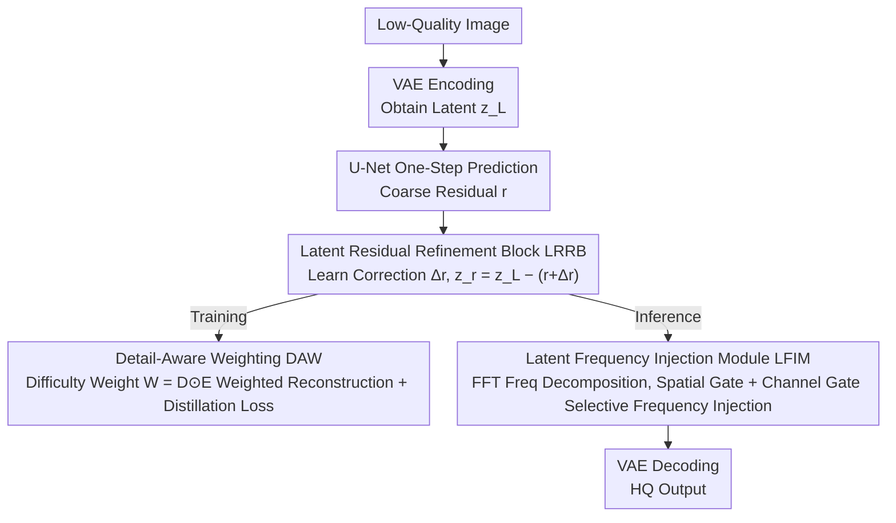

# FiDeSR: High-Fidelity and Detail-Preserving One-Step Diffusion Super-Resolution

**Conference**: CVPR 2026  
**arXiv**: [2603.02692](https://arxiv.org/abs/2603.02692)  
**Code**: [GitHub](https://github.com/Ar0Kim/FiDeSR)  
**Area**: Image Super-Resolution  
**Keywords**: One-Step Diffusion Super-Resolution, Frequency-Aware, Residual Refinement, Detail Weighting, High Fidelity

## TL;DR

FiDeSR is proposed, a high-fidelity and detail-preserving one-step diffusion super-resolution framework. By introducing three complementary components—Detail-Aware Weighting (DAW), Latent Residual Refinement Block (LRRB), and Latent Frequency Injection Module (LFIM)—it simultaneously addresses the degradation of structural fidelity and the insufficient restoration of high-frequency details in one-step diffusion super-resolution.

## Background & Motivation

Diffusion models perform exceptionally well in real-world image super-resolution (Real-ISR), but the inference cost of multi-step diffusion is high. One-step diffusion methods (SinSR, OSEDiff) compress the iterative process through distillation, but face two core issues:

**Difficulty in maintaining high fidelity**: VAE encoding conditioning leads to structural distortion and low-frequency inconsistency (e.g., structural warping in AddSR).

**Insufficient recovery of high-frequency details**:
   - Multi-step diffusion gradually generates high-frequency details through iterative denoising. One-step diffusion compresses this into a single step, resulting in inadequate high-frequency recovery (e.g., over-smoothing in OSEDiff).
   - Recent residual learning methods (such as PiSA-SR) predict only a single global residual, leading to unstable high-frequency reconstruction and residual artifacts (e.g., excessive details generated by PiSA-SR).

Rather than adjusting the number of denoising steps, FiDeSR addresses the issues of fidelity and details across three stages: training, model architecture, and inference, and targetedly remedies them with three components: DAW, LRRB, and LFIM.

## Method

### Overall Architecture

FiDeSR aims to solve a common dilemma in one-step diffusion super-resolution: structural distortion and insufficient high-frequency detail recovery after compressing multi-step denoising into a single step. Its strategy avoids modifying the denoising process itself, instead offering enhancements across three phases: training, the network, and inference. The entire pipeline is based on SD 2.1-base, finetuned using only LoRA. During training, a low-quality image is first encoded into a latent code $z_L$ by the VAE. The U-Net predicts a coarse residual $r$ in one step, which is refined into a more accurate $z_r$ by the Latent Residual Refinement Block (LRRB). Meanwhile, Detail-Aware Weighting (DAW) assigns different weights to different spatial positions during loss computation. During inference, the pipeline follows "one-step prediction $\to$ LRRB refinement $\to$ frequency injection (LFIM) $\to$ VAE decoding," where LFIM acts as a knob to adjust frequency intensity on-the-fly without retraining. The three components handle different stages: DAW controls "where to focus when learning," LRRB ensures "the accuracy of residual prediction," and LFIM determines "how much detail to inject at the end."

### Key Designs

**1. Detail-Aware Weighting DAW: Directing the loss to focus on prone-to-fail detail areas**

A potential drawback in one-step diffusion is that the model can easily reduce the loss on large flat regions while blurring challenging edge textures. DAW resolves this by multiplying the loss with a spatial weight map, shifting emphasis to areas that are both "important and poorly reconstructed". It first computes a detail map $D$ by averaging three complementary operators: Sobel for edge sharpness, Laplacian for local contrast, and Variance for texture variance:

$$D = \frac{Sobel(x_H) + Laplacian(x_H) + Variance(x_H)}{3}$$

It then computes an error map $E$ by blending pixel error and perceptual error with a ratio $p$: $E = (1-p)E_{pix} + pE_{perc}$. Element-wise multiplication of the two yields the difficulty weight $W_{DAW} = D \odot E$, which is applied simultaneously to the reconstruction loss and the CSD distillation loss. A spatial location receives a high weight only if it is both "detail-rich" and "currently poorly reconstructed". This is a smarter approach than simple frequency-based weighting, as it avoids repeatedly forcing updates on high-frequency regions that are already well-restored.

**2. Latent Residual Refinement Block LRRB: Refining the coarse residual predicted in one step**

Residual learning methods like PiSA-SR predict only a single global residual, which is often unstable during single-step inference and prone to high-frequency artifacts. Instead of discarding the U-Net's prediction, LRRB treats it as a solid initial estimate and applies calibration. It leverages the RRDB structure from ESRGAN but operates inside the latent space of the diffusion model. Specifically, it concatenates $z_L$ with the initial residual $r$ predicted by the U-Net as input, learns a correction term $\Delta r$, computes the refined residual $r' = r + \Delta r$, and obtains the final latent variable $z_r = z_L - r'$. Unlike the pixel-domain ESRGAN, the LRRB is specifically designed to address residual instability in the latent space, effectively inserting a dedicated error-correction layer between the "one-step prediction" and the "final output."

**3. Latent Frequency Injection Module LFIM: Area-wise and channel-wise selective frequency injection during inference**

While the first two components are fixed during training, LFIM provides an inference-stage knob that allows users to adjust the amount of high- or low-frequency injection without retraining. It applies FFT to the refined latent variable $z_r$ and decomposes it into a low-frequency component $\Delta_{LP}$ and a high-frequency component $\Delta_{HP}$ using a Butterworth filter. Two gates then control the injection: a spatial gate $M_{sp}$ reuse the detail map (using the same Sobel/Laplacian/Variance operators) to differentiate detail areas from flat areas, and a channel gate $M_{ch}$ determines the frequency energy ratio of each channel. The injection is selective: low-frequencies are injected into structural areas, and high-frequencies into textured areas. Consequently, low-frequency enhancement biases towards fidelity improvement, while high-frequency enhancement improves perceptual quality, offering a flexible trade-off during inference.

### Loss & Training

The total loss is $\mathcal{L}_{total} = \mathcal{L}_{rec} + \mathcal{L}_{reg}$:
- **Reconstruction Loss**: $\mathcal{L}_{rec} = \lambda_{mse} \cdot W_{DAW} \cdot \text{MSE} + \lambda_{lpips} \cdot W'_{DAW} \cdot \text{LPIPS}$
- **Regularization Loss**: DAW-weighted CSD loss (distilling the semantic prior of the pretrained diffusion model)
- $\lambda_{mse} = 1$, $\lambda_{lpips} = 2$
- Base Model: SD 2.1-base, with VAE and U-Net frozen, LoRA rank=8
- Training: 2× H100, batch size 8, AdamW, lr $5 \times 10^{-5}$, 200K steps
- Text prompts are extracted by RAM

## Key Experimental Results

### Main Results

| Dataset | Metric | FiDeSR (1s) | PiSA-SR (1s) | OSEDiff (1s) | SeeSR (50s) |
|--------|------|-------------|--------------|--------------|-------------|
| DRealSR | PSNR↑ | **28.90** | 28.32 | 27.92 | 28.14 |
| DRealSR | LPIPS↓ | **0.2836** | 0.2960 | 0.2967 | 0.3141 |
| DRealSR | MANIQA↑ | **0.6239** | 0.6161 | 0.5898 | 0.6016 |
| DRealSR | FID↓ | **127.97** | 130.48 | 135.45 | 146.98 |
| RealSR | LPIPS↓ | **0.2626** | 0.2672 | 0.3194 | 0.3004 |
| RealSR | FID↓ | **109.68** | 124.18 | 123.49 | 125.09 |
| DIV2K | DISTS↓ | **0.1845** | 0.1934 | 0.1975 | 0.1966 |

Note: With only **1-step** inference, FiDeSR outperforms most one-step and some multi-step methods on both full-reference and no-reference metrics, achieving the lowest FID among all methods.

### Ablation Study

| Configuration | CLIPIQA↑ | NIQE↓ | MUSIQ↑ | MANIQA↑ | Description |
|------|----------|-------|--------|---------|------|
| w/o LRRB + w/o DAW | 0.6611 | 4.7381 | 67.60 | 0.6237 | Baseline |
| DAW only | 0.6641 | 4.7129 | 67.63 | 0.6236 | Slight improvement from DAW |
| LRRB only | 0.6626 | 4.7340 | 67.95 | 0.6278 | More significant improvement from LRRB |
| DAW + LRRB | **0.6699** | **4.6300** | **68.29** | **0.6285** | Best complementary effect |

### Key Findings

- FiDeSR is the first one-step diffusion SR method to reach an optimal balance in both full-reference and no-reference metrics simultaneously.
- LRRB reduces the prediction error of high-frequency noise by an average of 1.62% (1.24% on DIV2K, 1.99% on DRealSR, and 1.62% on RealSR).
- LFIM's low-frequency injection improves PSNR/SSIM (structural fidelity), while its high-frequency injection improves MUSIQ/MANIQA (perceptual quality), allowing a flexible trade-off.
- It achieves the lowest FID across all datasets, indicating that its generative distribution is closest to the real image distribution.

## Highlights & Insights

1. **Accurate Problem Analysis**: The work clearly identifies the two core bottlenecks of one-step diffusion SR (fidelity vs. details) and designs targeted components for the training, architecture, and inference phases.
2. **Dual Guidance of DAW**: By concurrently utilizing the detail map ("where is important") and the error map ("where is poorly reconstructed"), DAW is smarter than simple frequency-based weighting.
3. **Rationality of LRRB Design**: Introducing the residual refinement concept of RRDB into the diffusion latent space specifically addresses the instability of diffusion residuals.
4. **Flexibility of LFIM**: The enhancement intensity can be adjusted during inference without requiring retraining, offering high practicality.
5. **Breakthrough in Perception-Distortion Trade-off**: FiDeSR achieves a better balance between perception and distortion compared to existing methods.

## Limitations & Future Work

1. Based on SD 2.1-base, the performance might be limited by the generative capacity of the foundation model.
2. The frequency separation in LFIM relies on manual setting of the Butterworth filter parameters.
3. Computing the error map in DAW introduces additional computation overhead during training.
4. More efficient one-step distillation strategies (e.g., Consistency Models) have not been explored.
5. The approach can be extended to video super-resolution or multimodal restoration tasks.

## Related Work & Insights

- **PiSA-SR**: One-step diffusion SR via residual learning; LRRB in FiDeSR directly improves its coarse residual prediction.
- **OSEDiff**: One-step SR based on VSD + LoRA, which suffers from inadequate high-frequency recovery.
- **GuideSR**: Improves fidelity through full-resolution guidance, but suffers from limited perceptual quality.
- **TFDSR**: Integrates frequency information into multi-step diffusion; FiDeSR compresses a similar concept into a single step.
- Insights: The bottleneck of one-step diffusion lies not in the number of steps, but in the accuracy of residual prediction and the control over frequency components.

## Rating

- Novelty: ⭐⭐⭐⭐ The three components each possess novelty; the dual guidance of DAW and the latent residual refinement design of LRRB are unique.
- Experimental Thoroughness: ⭐⭐⭐⭐ 3 datasets, 9 evaluation metrics, comparison with 8 baseline methods, and comprehensive ablation studies.
- Writing Quality: ⭐⭐⭐⭐ Clearly defined problems, with smooth explanations of the motivations and interactions among the three components.
- Value: ⭐⭐⭐⭐ Strong practicality of one-step diffusion SR; successfully addressing both fidelity and detail recovery represents a major contribution.

<!-- RELATED:START -->

## Related Papers

- [\[CVPR 2026\] IFCSR: Inference-Free Fidelity-Realism Control for One-Step Diffusion-based Real-World Image Super-Resolution](ifcsr_inference-free_fidelity-realism_control_for_one-step_diffusion-based_real-.md)
- [\[CVPR 2026\] One-Step Diffusion Transformer for Controllable Real-World Image Super-Resolution](one-step_diffusion_transformer_for_controllable_real-world_image_super-resolutio.md)
- [\[CVPR 2026\] Time-Aware One Step Diffusion Network for Real-World Image Super-Resolution](time-aware_one_step_diffusion_network_for_real-world_image_super-resolution.md)
- [\[CVPR 2026\] GDPO-SR: Group Direct Preference Optimization for One-Step Generative Image Super-Resolution](gdpo-sr_group_direct_preference_optimization_for_one-step_generative_image_super.md)
- [\[CVPR 2026\] Language-Guided One-Step Diffusion Model for Nighttime Flare Removal](language-guided_one-step_diffusion_model_for_nighttime_flare_removal.md)

<!-- RELATED:END -->
