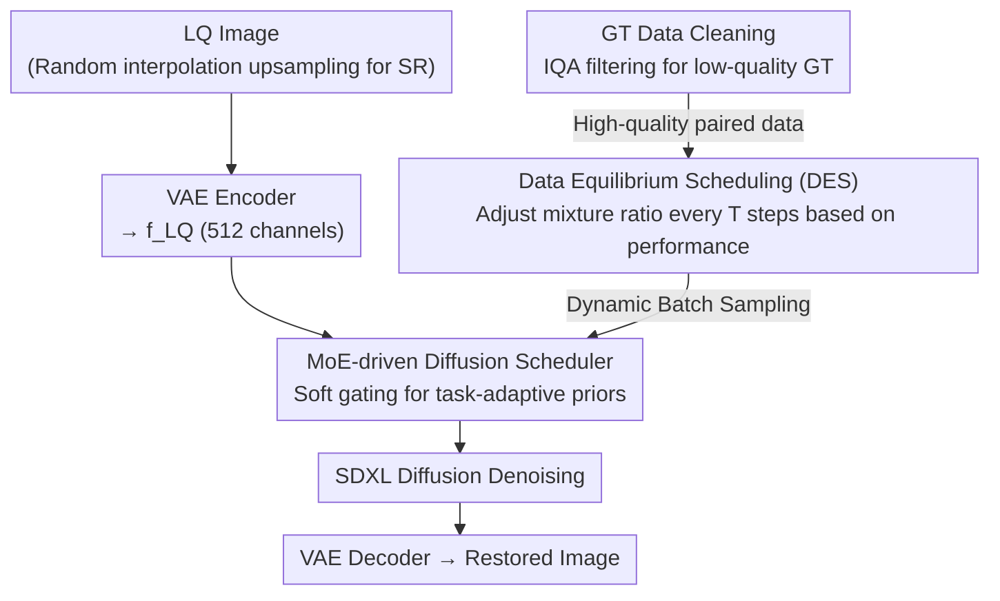

# FoundIR-v2: Optimizing Pre-Training Data Mixtures for Image Restoration Foundation Model

**Conference**: CVPR 2026  
**Paper**: [CVF Open Access](https://openaccess.thecvf.com/content/CVPR2026/html/Chen_FoundIR-v2_Optimizing_Pre-Training_Data_Mixtures_for_Image_Restoration_Foundation_Model_CVPR_2026_paper.html)  
**Code**: https://github.com/cschenxiang/FoundIR-v2  
**Area**: Image Restoration / Diffusion Models  
**Keywords**: Image Restoration Foundation Model, Data Mixture Ratios, Dynamic Data Scheduling, MoE Diffusion Prior, all-in-one  

## TL;DR
FoundIR-v2 discovers that the "training data mixture ratio of different restoration tasks" is a key variable determining all-in-one image restoration performance. Consequently, it employs a dual-scheduling scheme—Dynamic Equilibrium Scheduling (dynamic ratio adjustment) and an MoE-driven Diffusion Scheduler (task-adaptive generative prior allocation)—for generative pre-training on SDXL. A single model covers 50+ sub-tasks and outperforms existing SOTA on multiple benchmarks.

## Background & Motivation
**Background**: Image restoration is moving toward the "Foundation Model" paradigm—pre-training a unified model on large-scale paired data to simultaneously handle dozens of degradations such as deblurring, dehazing, denoising, low-light enhancement, and super-resolution. Current mainstream improvements focus on two aspects: scaling up data (data synthesis/real-world collection, e.g., FoundIR collecting millions of paired data) and utilizing stronger backbones (diffusion models providing generative priors).

**Limitations of Prior Work**: Almost all works focus on data scale and quality but overlook a hidden knob—the **mixture ratio between different task data** (i.e., the relative data volume allocated to deblurring vs. dehazing vs. super-resolution). Authors' statistical experiments (Figure 1, limited to four tasks: deblurring/dehazing/low-light/super-resolution) show that using identical or random sampling ratios for these tasks leads to severe performance instability in all-in-one models—simple tasks overfit while complex tasks underfit. In other words, inappropriate mixture ratios directly cause "training inefficiency / insufficient learning."

**Key Challenge**: Data interaction between tasks is complex—they may promote, be independent of, or even conflict with each other. Furthermore, different tasks require different data volumes due to inherent difficulty variations. Static fixed ratios (existing practice) cannot handle this heterogeneity, inevitably leading to trade-offs. A second overlooked conflict lies in the backbone: existing methods either directly use diffusion models or fine-tune them uniformly for all tasks, **failing to differentiate the role of diffusion priors by task**. For instance, when processing "low-resolution + hazy" images, existing all-in-one models might only dehaze and forget to perform super-resolution simultaneously, wasting the reconstruction potential of the diffusion prior.

**Goal**: (1) Systematically optimize data composition to balance performance across tasks while mining inter-task synergies; (2) adaptively allocate appropriate diffusion priors to each task.

**Core Idea**: Transfer the "Data Mixing Law" from the LLM era to image restoration—adjusting the sampling ratios of each task in the training pool **dynamically** rather than statically (adding data to tasks with declining performance). This is combined with an MoE scheduler to **dynamically allocate generative priors by task** during generative pre-training, jointly optimizing data scheduling and model scheduling.

## Method

### Overall Architecture
FoundIR-v2 uses SDXL as the diffusion backbone within a latent-space generative restoration framework. The core is "**Dual-Scheduling**": Dynamic Equilibrium Scheduling on the data side to optimize what is fed, and an MoE scheduler on the model side to optimize how priors are used. The pipeline: Low-quality (LQ) images are encoded into the latent space as $f^{LQ}$ (using the second-to-last layer, 512 channels) via a pre-trained VAE encoder. For LQ inputs from super-resolution datasets, since their resolutions differ from HQ, a randomly selected interpolation (nearest/bilinear/bicubic) is used for upsampling to align with the output resolution, enabling unified training. $f^{LQ}$ is concatenated with the noisy latent $x_t^{HQ}$ produced by the diffusion model at timestep $t$ and sent to the MoE scheduler to produce task-adaptive scheduling features that guide the diffusion process. Simultaneously, LLaVA generates image descriptions for all training data, which are injected into the latent features as auxiliary text-to-image information via cross-attention. The multi-task training process is wrapped in a data equilibrium scheduling loop: evaluating task performance on a small reference set every $T$ iterations and re-calculating mixture ratios. Finally, the VAE decoder restores the output.

### Key Designs

**1. Dynamic Equilibrium Scheduling (DES): Adding data to declining tasks**

Addressing the "static ratio trade-offs" pain point, DES treats the mixture ratio as a dynamically adjustable variable during training. The large-scale training data $\mathcal{D}_{tr}$ is partitioned into $k$ categories based on task attributes. The mixture ratio (weight) $\lambda$ is defined as the sampling probability across $k$ domains, determining the training data distribution $P_\lambda = \sum_{i=1}^{k}\lambda_i\,\mathrm{unif}(\mathcal{D}_i)$. The training objective is to minimize the L1 reconstruction loss $\theta_\lambda^* = \arg\min_\theta \lVert I^{HQ} - M_0(I^{LQ})\rVert_1$ under a fixed model size. The key is that ratios are no longer fixed: starting with uniform sampling, the model is evaluated every $T$ iterations on an **independent small reference set** $\mathcal{D}_{ref}$ (equal samples from each task, disjoint from $\mathcal{D}_{tr}$) to obtain scores $s_j^{(t)}$ for each task, compared against the previous checkpoint $s_j^{(t-T)}$. If task $j$ performance drops ($s_j^{(t)} < s_j^{(t-T)}$), its sampling probability for the next round is increased; otherwise, it is slightly de-weighted. The update rule uses softmax normalized re-weighting:

$$\lambda_j^{(t+1)} = \frac{\lambda_j^{(t)}\exp\!\big(-\alpha\,\Delta s_j^{(t)}\big)}{\sum_{i=1}^{k}\lambda_i^{(t)}\exp\!\big(-\alpha\,\Delta s_i^{(t)}\big)}$$

Where $\Delta s_j^{(t)} = s_j^{(t)} - s_j^{(t-T)}$ is the performance change of task $j$, $\alpha>0$ controls adjustment sensitivity, and normalization ensures $\sum_j\lambda_j^{(t+1)}=1$. This creates a closed-loop self-adjustment—"supplementing data for under-learned tasks and preventing overfitting for well-learned tasks"—rather than relying on manual ratios. The authors emphasize that **no absolute optimal ratio exists**—ratios should drift dynamically during training (Table 2 shows an example: SR increases from 25% to 45%, while Low-light decreases from 25% to 10%). Compared to static sampling, dynamic mixing allows the model to gain comprehensive restoration capabilities **early** in training.

**2. MoE-driven Diffusion Scheduler: Soft allocation of generative priors by task**

To address the "indiscriminate use of diffusion priors," this scheduler allows different degradation tasks to take what they need. Given LQ features $f_k^{LQ}$ and the noisy latent $x_{t,k}^{HQ}$ of the $k$-th task at timestep $t$, they are concatenated into a fused representation $z_t^{(k)} = \phi(f_k^{LQ}, x_{t,k}^{HQ})$ and fed into an MoE composed of $n$ shared experts. Each expert $E_i(\cdot)$ is **an attention mechanism** (e.g., spatial attention, channel attention, sparse attention) used to activate cues required by different tasks. A router scores the fused representation and converts it into non-negative weights summing to 1 via softmax:

$$w_i^{(k)} = \frac{\exp\!\big(g_i^{(k)\top} z_t^{(k)}\big)}{\sum_{j=1}^{n}\exp\!\big(g_j^{(k)\top} z_t^{(k)}\big)}, \qquad F^{(k)}(z_t) = \sum_{i=1}^{n} w_i^{(k)}\,E_i\!\big(z_t^{(k)}\big)$$

Where $g_i^{(k)}$ represents the learnable gating parameters for each expert. This utilizes **soft MoE** (weighted fusion of all experts) instead of hard MoE (top-k), as ablations show soft gating allows experts to collaborate adaptively, making all tasks more stable (Figure 7a). Training is two-stage: first pre-training only the scheduler, then joint fine-tuning of the VAE encoder, scheduler, and diffusion model to enhance feature utilization consistency. This design is optimized jointly with Design 1 to align "dynamic data mixing" with "adaptive model capacity."

**3. High-quality GT Data Cleaning: Preventing dirty GT from polluting multi-task targets**

Addressing an overlooked data issue: existing datasets focus on LQ degradation diversity but ignore GT quality. For example, GTs in dehazing tasks, while haze-free, often contain blur or noise (Figure 3). During mixed data training, these "unclean GTs" cause conflicting learning objectives across tasks. The authors use multi-modal IQA models (e.g., DA-CLIP, DepictQA) to perform degradation identification and quality assessment on training GTs, filtering out low-quality GTs and retaining only high-quality paired data. Ablation (Figure 7b) shows further performance gains after filtering, indicating GT quality is equally critical for foundation models.

### Loss & Training
Reconstruction uses L1 loss (Eq. 2). Training is conducted on an NVIDIA H20 (96 GB) with AdamW, images randomly cropped to $512\times512$, batch size 16. A two-stage strategy is followed: in the second stage, the initial learning rate of the VAE encoder is $5\times10^{-6}$ and $5\times10^{-5}$ for other components, using a cosine annealing scheduler. Total iterations are 150,000, with a scheduling interval $T=30{,}000$. Ratio adjustment per round is limited to $[5\%, 10\%]$. For engineering efficiency, ratio trends are recorded on a **small model** and then transferred to guide the large model's training. During small model validation, MUSIQ is used for SR and PSNR for other tasks, with $\mathcal{D}_{ref}$ containing 10 samples per category. Inference uses the Euler scheduler, 20 steps, and a constant CFG scale of 5. AdaIN is used for color-fixing in SR, while other tasks do not use it.

## Key Experimental Results

### Main Results
FoundIR-v2 (Ours) is compared against general restoration, all-in-one, restoration agents, and real-world SR methods across multi-task public benchmarks (PSNR/SSIM/LPIPS and various perceptual metrics). Representative results against the strongest all-in-one baseline, FoundIR, are selected below:

| Benchmark (Task) | Metric | Ours | FoundIR | Notes |
|------|------|------|---------|------|
| 4KRD (Motion Deblur) | PSNR ↑ | 26.64 | 26.59 | LPIPS 0.145 vs 0.235, significant perceptual lead |
| LSD (Defocus Deblur) | PSNR ↑ | 20.78 | 19.18 | MUSIQ 50.74 vs 15.92 |
| Dense-HAZE (Dehaze) | PSNR ↑ | **15.29** | 9.29 | +6.0 dB |
| NH-HAZE (Non-homogeneous Dehaze) | PSNR ↑ | **17.00** | 11.43 | +5.6 dB |
| RS-Cloud (Decloud) | PSNR ↑ | **22.06** | 11.71 | +10.4 dB, SSIM 0.828 |

The PSNR gain of FoundIR-v2 is most significant (+10 dB max) on "complex and data-scarce" tasks like dehazing and declouding, validating the value of "supplementing data for under-learned tasks." On tasks like deblurring, PSNR is comparable to FoundIR, but perceptual metrics (LPIPS/MUSIQ/CLIPIQA+) are significantly better.

### Ablation Study
The core ablation averages results across four representative tasks (deblurring/dehazing/low-light/SR):

| Configuration | Avg. PSNR ↑ | Avg. SSIM ↑ | Description |
|------|------|------|------|
| Mixing | 18.91 | 0.6759 | Static Mixture |
| Sequence | 18.69 | 0.6476 | Sequential Multi-task |
| Incremental | 19.93 | 0.6725 | FoundIR-style Incremental |
| **DES (Ours)** | **20.41** | **0.6977** | Dynamic Equilibrium Scheduling (Best) |

DES is not only optimal for FoundIR-v2 but also brings gains when migrated to PromptIR and FoundIR over their respective fixed-ratio schemes. Sensitivity to $\mathcal{D}_{ref}$ size and interval $T$ is shown below:

| $\mathcal{D}_{ref}$ size | 10 | 10 | 10 | 20 | 30 |
|------|------|------|------|------|------|
| $T$ interval | 10000 | 25000 | 30000 | 30000 | 30000 |
| Avg. PSNR | 20.17 | 20.53 | 20.41 (Ours) | 20.48 | 20.36 |

### Key Findings
- **Data ratio is a first-class citizen**: Identical/random ratios lead to simple task overfitting and complex task underfitting; **no absolute optimal ratio exists**, as it should drift throughout training (SR 25%→45%, Low-light 25%→10%).
- **DES is the performance driver**: Under a fixed model, DES outperforms mixing/sequential/incremental strategies and can be plugged into other all-in-one models.
- **Soft MoE > Hard MoE > No Scheduler**: Soft gating allows adaptive expert collaboration, resulting in more stable performance across tasks in radar charts (Figure 7a).
- **GT quality matters**: Filtering low-quality GT (removing a portion of the original data) further improves performance (Figure 7b).
- **Hyperparameter insensitivity**: Setting $\mathcal{D}_{ref}=10$ and $T=30{,}000$ provides the best trade-off between time cost and performance, with minimal PSNR fluctuation.

## Highlights & Insights
- **Applying the "Data Mixing Law" from LLMs to low-level vision**: While previous works competed on data scale, this paper is the first to treat "mixture ratio" as an optimizable target, providing the closed-loop DES formula (softmax re-weighting based on performance drops). The approach is clean and transferable.
- **Clever "add data if performance drops" feedback control**: Periodically checking model health on a small independent reference set and using the score difference $\Delta s$ between intervals to drive ratio adjustments treats training as a multi-task system requiring negative feedback stability.
- **Experts as different attention mechanisms**: Each MoE expert is a spatial/channel/sparse attention block. Soft gating activates different cues by task, specifically mapping "task-adaptive diffusion prior allocation" to learnable attention combinations.
- **Small model exploration for large model application**: Recording ratio trends on small models to guide large models is a practical engineering trick to reduce generative pre-training costs.

## Limitations & Future Work
- The ablation analysis focuses on four representative tasks due to cost; detailed analysis for 50+ sub-tasks is in the supplement. ⚠️ Refer to the original paper/supplement for specific sub-task performance.
- DES relies on periodic evaluation on $\mathcal{D}_{ref}$. The choice of metrics (MUSIQ for SR, PSNR for others) affects the adjustment direction. Using different metrics for the same weight update system may introduce heterogeneity or bias.
- PSNR values for tasks like dehazing/declouding remain low (e.g., Dense-HAZE 15.29), indicating that these complex degradations are far from saturated even with dynamic data; the bottleneck may lie in the data themselves rather than the ratios.
- Ratio adjustment magnitudes are manually capped ($[5\%, 10\%]$), and $\alpha$ is hand-tuned. Making the sensitivity adaptive is a potential research direction.

## Related Work & Insights
- **vs. FoundIR (Previous Work)**: FoundIR studied the **Data Scaling Law** (more data is better) using static fixed ratios. This work reveals the **Data Mixing Law**—showing ratios are equally critical—and evolves from static to dynamic scheduling while moving from image-space to latent-space (SDXL) diffusion.
- **vs. SUPIR / FaithDiff (Real-world SR)**: These focus on single-task SR/perceptual quality, while this work is a unified foundation model for 50+ tasks. For composite degradations like "low-res + hazy," cascading FoundIR (restoration) + SUPIR (SR) is disjoint; FoundIR-v2 performs restoration and detail generation simultaneously in one model.
- **vs. PromptIR / DiffUIR / InstructIR (All-in-one)**: These use static mixing or prompts to differentiate tasks. The difference here is treating "what data to feed" as a dynamic closed-loop and "how to use priors" as a soft MoE, optimizing both jointly.

## Rating
- Novelty: ⭐⭐⭐⭐⭐ First to establish "data mixture ratio" as a primary optimization target for image restoration foundation models with a dynamic closed-loop scheduler.
- Experimental Thoroughness: ⭐⭐⭐⭐ Wide task coverage and extensive SOTA comparisons; however, granular 50+ task analysis is mostly in the supplement.
- Writing Quality: ⭐⭐⭐⭐ Clear logic from motivation to method to ablation; complete with formulas and pseudo-code.
- Value: ⭐⭐⭐⭐⭐ DES is plug-and-play and transferable, providing a practical methodology for the often-ignored dimension of data ratios.

<!-- RELATED:START -->

## Related Papers

- [\[ICCV 2025\] FoundIR: Unleashing Million-scale Training Data to Advance Foundation Models for Image Restoration](../../ICCV2025/image_restoration/foundir_unleashing_million-scale_training_data_to_advance_foundation_models_for_.md)
- [\[CVPR 2026\] UniSER: A Foundation Model for Unified Soft Effects Removal](uniser_a_foundation_model_for_unified_soft_effects_removal.md)
- [\[CVPR 2026\] 2-Shots in the Dark: Low-Light Denoising with Minimal Data Acquisition](2-shots_in_the_dark_low-light_denoising_with_minimal_data_acquisition.md)
- [\[CVPR 2026\] Self-Attention Driven Tensor Representation for High-Order Data Recovery](self-attention_driven_tensor_representation_for_high-order_data_recovery.md)
- [\[CVPR 2026\] Hybrid Agents for Image Restoration](hybrid_agents_for_image_restoration.md)

<!-- RELATED:END -->
