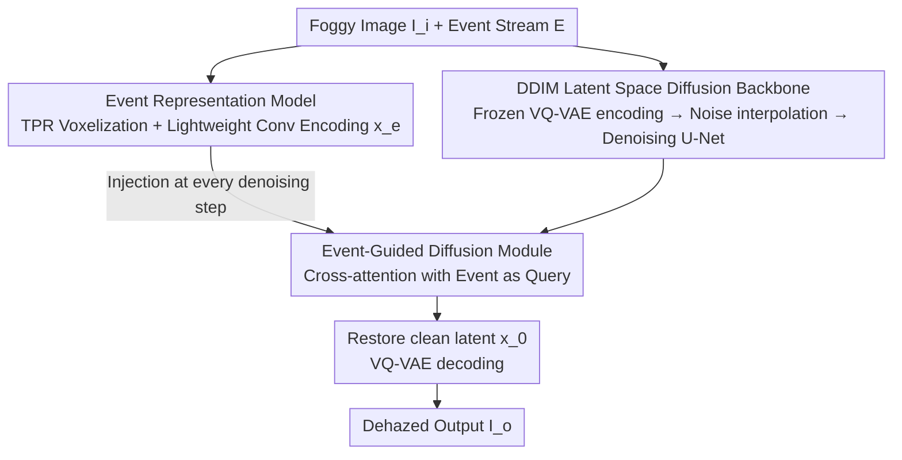

# From Events to Clarity: The Event-Guided Diffusion Framework for Dehazing

**Conference**: CVPR 2026  
**Paper**: [CVF Open Access](https://openaccess.thecvf.com/content/CVPR2026/html/Wang_From_Events_to_Clarity_The_Event-Guided_Diffusion_Framework_for_Dehazing_CVPR_2026_paper.html)  
**Code**: TBD (Dataset promised to be open-sourced, no repository link provided)  
**Area**: Image Restoration / Diffusion Models  
**Keywords**: Event Camera, Image Dehazing, Diffusion Models, High Dynamic Range, Cross-Attention

## TL;DR
EvDehaze introduces event cameras to the dehazing task for the first time, remodeling dehazing as "event-conditioned image generation." By injecting high dynamic range (HDR) edge/contrast cues from events into latent space DDIM diffusion via cross-attention, it generates more realistic and clear dehazed images without requiring real-world paired supervision. It includes the first real-world RGB-Event drone dataset for foggy conditions.

## Background & Motivation

**Background**: Dehazing has evolved through three generations: manual priors based on the Atmospheric Scattering Model (ASM) and Dark Channel Prior (DCP), end-to-end supervised regression via deep networks (Restormer, FFA-Net), and recent diffusion models (IR-SDE, ResShift) leveraging strong generative priors for restoration.

**Limitations of Prior Work**: Regardless of the generation, **inputs consist solely of RGB frames**. RGB data captured by Active Pixel Sensors (APS) has limited dynamic range (~60dB). In Sec. 3, the paper provides quantitative proof using the ASM that heavy fog **compresses the observed dynamic range**: let transmittance be a constant $t$, $a=J_{\min}t$, and $b=A(1-t)$; the observed contrast $DR_{\text{obs}}=\frac{ka+b}{a+b}<k=DR_{\text{true}}$. As $t$ approaches 0 (thicker fog), $a$ decreases, worsening the dynamic range loss. This information loss is irreversible, making dehazing an ill-posed problem where forced recovery often destroys structures and artifacts.

**Key Challenge**: The goal is to recover HDR information suppressed by fog, but the RGB sensor itself fails to record this data. Relying on RGB to recover lost RGB information is "making bricks without straw." Furthermore, since fog density and lighting vary constantly, it is nearly impossible to collect aligned real-world "foggy-clear" paired data, rendering supervised learning impractical.

**Goal**: (1) Identify an information source that preserves HDR in foggy conditions; (2) effectively inject this information into a dehazing model without real-world paired supervision.

**Key Insight**: Event cameras trigger asynchronously, possess microsecond latency, and feature a dynamic range of up to 120dB (twice that of APS). They are sensitive to local brightness changes and naturally capture structural cues like edges and corners in fog. The authors propose that **event streams can compensate for the HDR structural information missing in RGB**. The strong generative priors and robustness of diffusion models are ideal for converting these sparse cues into realistic images in unsupervised scenarios.

**Core Idea**: Rewrite event-guided dehazing as "**diffusion generation conditioned on sparse events**"—not by explicitly translating events to RGB, but by injecting event features directly into every step of latent space denoising, guiding the sampling trajectory with physically consistent edge/contrast priors.

## Method

### Overall Architecture

EvDehaze ($f_{edh}$) takes a foggy frame $I_i$ and the corresponding event stream $E$ as input, outputting a dehazed frame $I_o=f_{edh}(I_i, E)$. The pipeline operates within a **frozen VQ-VAE latent space** using DDIM diffusion, consisting of three synergistic components: ① A VQ-VAE encodes the foggy image into the latent space; after adding noise, a denoising U-Net iteratively restores clean latents, which are decoded back to an image, providing a strong generative backbone. ② An event representation model encodes the raw event stream into multi-scale HDR features $x_e$. ③ The Event-Guided Diffusion Module injects $x_e$ into intermediate layers of the U-Net at each denoising step via cross-attention, ensuring the generation trajectory is guided by event-based edge/contrast cues. Crucially, events are treated as "implicit conditions" throughout the denoising process rather than being translated to pixels.

### Key Designs

**1. Latent Space DDIM Diffusion Backbone: Denoising in VQ-VAE space to save compute and leverage generative priors**

To address the ill-posed nature of dehazing and the artifacts caused by forced RGB recovery, the authors utilize diffusion generation instead of pixel-level regression. The foggy image $I_i$ is encoded by a frozen VQ-VAE encoder into compact latents $x_{hz}=f_E(I_i)$, and Gaussian noise is added to obtain $x_T = x_{hz} + N$. A DDIM sampler then runs for $T$ steps, where the denoising U-Net predicts $x_{t-1}$ conditioned on the noisy latent $x_t$, the original latent $x_{hz}$, and event features $x_e$, i.e., $p_\theta(x_{t-1}\mid x_t, x_{hz}, x_e)$. $x_{hz}$ serves as a constant condition to ensure the trajectory stays anchored to the original content. Operating in a low-dimensional latent space significantly reduces VRAM and inference costs. DDIM is chosen over DDPM for its deterministic non-Markovian sampling, allowing for massive acceleration—the experiments achieve a balance of speed and quality in just **15 steps**.

**2. Event Representation Model: Compressing sparse events into multi-scale HDR features using Temporal Pyramids**

Events naturally respond to local brightness changes, offering robustness against fog and precise edge/motion information. However, directly modeling fine-grained temporal structures is computationally expensive. The authors adopt a Temporal Pyramid Representation (TPR): the event stream $E$ is sliced into $L=3$ levels covering progressively smaller time windows. Each level is divided into $M=2$ temporal bins to form voxel grids $V_l\in\mathbb{R}^{M\times H\times W}$, which are concatenated into a 4D tensor $E_{\text{TPR}}=\{V_l\}_{l=1}^{L}\in\mathbb{R}^{L\times M\times H\times W}$, encoding both coarse and fine temporal structures. A lightweight encoder $f_e$ with three convolutional layers and pooling then compresses this into a feature map $x_e=f_e(E_{\text{TPR}})\in\mathbb{R}^{C\times H'\times W'}$.

**3. Event-Guided Diffusion Module: Using events as Query for cross-attention to inject HDR cues**

To effectively feed event features into the diffusion process, the authors designed a cross-attention-based guidance module $f_{eg}$ instead of simple concatenation. At time step $t$, intermediate U-Net features are used as Key and Value, while event features $x_e$ serve as the Query: $Q=W_q x_e$, $K=W_k x_t$, $V=W_v x_t$. The result is $\text{Attention}(Q,K,V)=\text{Softmax}\!\big((QK^\top)/\sqrt{d}\big)V$. This allows the spatial edges and contrast regions captured by events to "query" and modulate the U-Net's denoising behavior, aligning generation with physically consistent priors. This module is embedded in selected U-Net layers and applied across **all DDIM steps**, reinforcing structural consistency and reducing semantic drift.

### Loss & Training

The training objective combines pixel and perceptual components: $L_{\text{total}}=\lambda_{\text{pix}}L_{\text{pix}}+\lambda_{\text{perc}}L_{\text{perc}}$, where $L_{\text{pix}}$ is the $\ell_1$ loss between generated and clean images, and $L_{\text{perc}}$ is calculated using pretrained VGG features. The weights are set to $\lambda_{\text{pix}}=1.0$ and $\lambda_{\text{perc}}=0.2$. The AdamW optimizer is used with a static learning rate of $5\times10^{-5}$ on four A800 GPUs.

## Key Experimental Results

### Main Results

Evaluations on the synthetic SOTS and real NH-HAZE datasets (using simulated events) show that EvDehaze achieves superior performance among **diffusion-based methods** with significantly fewer parameters than IR-SDE. The authors clarify that the goal is perceptual realism rather than surpassing RGB supervised regressors in PSNR/SSIM.

| Category | Method | SOTS PSNR↑ | SOTS SSIM↑ | SOTS LPIPS↓ | NH-HAZE PSNR↑ | NH-HAZE LPIPS↓ | Params |
|------|------|-----------|-----------|------------|---------------|----------------|------|
| Supervised Regression | Restormer | 38.43 | 0.989 | 0.009 | 18.32 | 0.355 | 26.13M |
| Supervised Regression | Dehamer | 36.63 | 0.988 | 0.005 | 20.66 | 0.230 | 132.50M |
| Supervised Regression | **Restormer+EGDM (Ours)** | **39.12** | **0.990** | 0.009 | 19.23 | 0.331 | 32.86M |
| Diffusion | IR-SDE | 33.82 | 0.984 | 0.014 | 12.59 | 0.361 | 537.21M |
| Diffusion | ResShift | 29.06 | 0.950 | 0.017 | 16.26 | 0.327 | 114.65M |
| Diffusion | **EvDehaze (Ours)** | **34.12** | **0.986** | **0.012** | **18.43** | **0.313** | 122.68M |

Notably, integrating the EGDM into the supervised Restormer backbone (Restormer+EGDM) improved SOTS PSNR from 38.43 to 39.12. Additionally, EvDehaze achieved the lowest LPIPS (0.313) on NH-HAZE with roughly 1/4 the parameters of IR-SDE.

### Ablation Study

| Configuration | SOTS PSNR↑ | SOTS SSIM↑ | Description |
|------|-----------|-----------|------|
| (1) Baseline (ResShift) | 29.06 | 0.950 | No events, no guidance |
| (2) w/o event data | 30.15 | 0.957 | Remove event data only |
| (3) w/o cross attention | 33.65 | 0.981 | Events injected via concatenation |
| (4) Full Model (EvDehaze) | 34.12 | 0.986 | Complete model |

### Key Findings
- **Event data is the primary gain source**: A total gain of 5.06 dB was observed from the baseline to the full model, with the inclusion of events and the use of cross-attention both being critical.
- **Injection method is vital**: The performance of "w/o cross attention" (33.65) was lower than the full model (34.12), proving that using events as a Query is necessary to correctly modulate denoising behavior.
- **Real-world generalization**: On self-collected drone data, output histograms showed a wider intensity range compared to inputs, qualitatively proving that EvDehaze extends the dynamic range and restores distant structural textures in real foggy scenes.

## Highlights & Insights
- **Problem solving at the sensor level**: By using the 120dB HDR of event cameras, the framework provides missing structural cues that RGB cannot recover, breaking the dehazing bottleneck at the information source.
- **Translating unsupervised challenges to conditional generation**: The decision to use diffusion generative priors with event conditioning avoids the need for paired real-world data, which is difficult to collect for foggy scenes.
- **EGDM as a plug-and-play module**: The module can be ported to non-diffusion backbones (like Restormer), meaning event-based HDR cues can benefit various restoration networks.
- **First real-world RGB-Event foggy dataset**: Synchronized data collected using a DJI drone and Prophesee sensors fills a critical gap in the community.

## Limitations & Future Work
- The model aims for perceptual realism, so its pixel fidelity (PSNR/SSIM) on synthetic datasets like SOTS remains lower than supervised specialized regressors (34.12 vs 38+).
- ⚠️ Training and most tests relied on **Vid2E simulated events**. Real-world events were used primarily for qualitative evaluation; the quantitative sim-to-real gap remains unquantified.
- Event cameras depend on motion; in static scenes or textureless areas, cues may be sparse.
- Future Work: Quantitative evaluation on real-world events and exploration of robustness in complex scenarios (e.g., dynamic objects or low light combined with fog).

## Related Work & Insights
- **vs RGB Supervised Regression**: While supervised methods have high PSNR, they often produce artifacts in real-world heavy fog due to information loss. Ours utilizes events to supply missing HDR information.
- **vs Diffusion Dehazing**: Comparative diffusion models like ResShift lack structural constraints in ill-posed settings; EvDehaze adds physical anchors via event-based edge/contrast priors.
- **vs Other Event-Guided Tasks**: Unlike previous tasks that rely on large paired datasets, this is the first application of events in an unsupervised scenario (dehazing) by leveraging diffusion priors.

## Rating
- Novelty: ⭐⭐⭐⭐⭐ 
- Experimental Thoroughness: ⭐⭐⭐⭐ 
- Writing Quality: ⭐⭐⭐⭐ 
- Value: ⭐⭐⭐⭐

<!-- RELATED:START -->

## Related Papers

- [\[CVPR 2026\] NEC-Diff: Noise-Robust Event–RAW Complementary Diffusion for Seeing Motion in Extreme Darkness](nec-diff_noise-robust_event-raw_complementary_diffusion_for_seeing_motion_in_ext.md)
- [\[CVPR 2026\] One-Shot Flow, Any-Time Frame: A Bidirectional Warping Framework for Event-Based Video Frame Interpolation](one-shot_flow_any-time_frame_a_bidirectional_warping_framework_for_event-based_v.md)
- [\[CVPR 2026\] DRFusion: Degradation-Robust Fusion via Degradation-Aware Diffusion Framework](drfusion_degradation_robust_fusion_via_degradation_aware_diffusion_framework.md)
- [\[CVPR 2026\] AE2VID: Event-based Video Reconstruction via Aperture Modulation](ae2vid_event-based_video_reconstruction_via_aperture_modulation.md)
- [\[CVPR 2026\] Disentanglement-wise Image Dehazing through Cross-Domain Manifold Consensus](disentanglement-wise_image_dehazing_through_cross-domain_manifold_consensus.md)

<!-- RELATED:END -->
