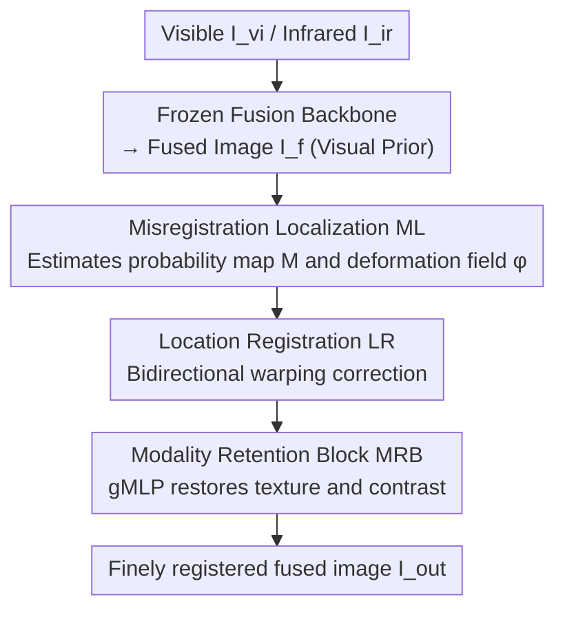

# FusionRegister: Every Infrared and Visible Image Fusion Deserves Registration

**Conference**: CVPR 2026  
**Paper**: [CVF Open Access](https://openaccess.thecvf.com/content/CVPR2026/html/Bian_FusionRegister_Every_Infrared_and_Visible_Image_Fusion_Deserves_Registration_CVPR_2026_paper.html)  
**Code**: https://github.com/bociic/FusionRegister  
**Area**: Image Restoration / Low-Level Vision (Infrared and Visible Image Fusion + Registration)  
**Keywords**: Infrared and Visible Image Fusion, Cross-Modal Registration, Visual Prior, Post-Registration, gMLP

## TL;DR
Addressing the pain points of "register-then-fuse" in infrared-visible image fusion (IVIF)—such as high computational cost, reliance on synthetic deformations, and poor adaptation to real-world scenarios—FusionRegister reverses this paradigm to "fuse first, then perform post-registration solely on misaligned regions." Grafted onto any frozen fusion backbone, it leverages the fusion results as visual priors to locate misaligned areas, performs bidirectional warping for correction, and restores textures using a gMLP module. With only 2.94M parameters and a 19ms inference time, it improves the registration accuracy (SAM IoU) of five mainstream fusion methods by an average of approximately 5%, while completely preserving the original fusion quality.

## Background & Motivation
**Background**: Infrared and visible image fusion (IVIF) aims to combine thermal radiation information (unique to infrared) and texture details (unique to visible) into a more comprehensive single image. It has evolved from CNNs, GANs, and Transformers to diffusion models and state space models. However, due to differences in physical imaging sensors, real-world multi-modal cameras often produce spatial misalignment between infrared and visible images. Direct fusion of misaligned inputs leads to severe "information displacement" and ghosting artifacts, heavily degrading fusion quality.

**Limitations of Prior Work**: To address misalignment, the prevailing approach treats registration as a preprocessing step prior to fusion, following the "register-then-fuse" paradigm. The authors identify three critical flaws in this line of work (Fig.1 in the paper): ① **Reliance on synthetic deformations**: Many SOTA methods rely on artificially generated affine perturbations as supervision signals to force the network to learn registration parameters. Consequently, they fail catastrophically when encountering authentic, non-deformed real-world inputs. ② **Lack of interaction with fusion methods**: The registration and fusion modules are decoupled, requiring tedious retraining whenever the fusion backbone changes. ③ **Heavy preprocessing operations**: Steps like style transfer (to eliminate modal differences) and global optical flow estimation are computationally expensive and inevitably cause information loss.

**Key Challenge**: These methods attempt to align **all** information across both modalities, ignoring a crucial characteristic of image fusion—**not all features enter the fused image**. A key observation in Fig.2 reveals that after applying spatial deformation to a perfectly registered image pair and fusing them with the same backbone, patch-level similarity analysis indicates that spatial misalignment of infrared mainly affects only "modality-shared regions," while "modality-unique regions" remain largely unaffected. Since only shared regions suffer from misalignment, **global registration or heavy preprocessing is unnecessary**; performing post-registration solely on the misaligned regions is sufficient.

**Goal**: To correct cross-modal misalignment with minimal cost, maximum generalization, and highest robustness, while preserving the original fusion quality of any fusion backbone.

**Key Insight**: Multi-modal sensors are typically placed close to each other, naturally providing coarse registration. Therefore, the method should directly accept raw sensor inputs without relying on synthetic deformations for supervision. Based on this, the authors propose to "learn and locate misregistration representations, applying targeted corrections only to affected areas."

**Core Idea**: Flip the paradigm from "register-then-fuse" to "fuse-then-register." By using the fusion backbone as a **visual prior provider**, the registration process is guided to focus exclusively on misaligned regions, thereby simultaneously achieving robustness, versatility, and efficiency.

## Method

### Overall Architecture
FusionRegister (FR) is a general post-registration framework **grafted onto a fusion backbone**. The inputs are the visible image $I_{vi}$, the infrared image $I_{ir}$, and the fused result $I_f$ obtained from any (frozen) fusion backbone. The goal is to produce a finely registered fused image $I_{out}$ that approximates the "fused image obtained under perfect registration" $I_{gt}$. The entire pipeline adopts a **hierarchical (multi-scale)** processing approach, inspired by MIMO-UNet: at scale $i \in \{0, \cdots, N-1\}$, $I_f / I_{vi} / I_{ir}$ are downsampled, and three feature extractors with identical architectures but different parameters extract multi-scale features $F_{in}^i$ ($in \in \{f, vi, ir\}$, see Eq. (1)).

At each scale, FR is chained by three collaborative stages: **Misregistration Localization (ML)** first leverages visual priors from the fused result and source images to estimate a misregistration probability map $M^i$ and a deformation field $\phi^i$, indicating "where the errors are and how large they are"; **Location Registration (LR)** applies **bidirectional warping** to the fused features/image using $\phi^i$, pulling the misaligned regions back without altering already aligned areas; and the **Modality Retention Block (MRB)** recovers textures and contrast lost during spatial transformations, predicting a residual bias map $I_{bias}^i$ to overlay onto the warped results. The multi-scale deformation fields are refined progressively from coarse to fine to ensure spatial consistency. Note that the fusion backbone is **frozen** during training—FR does not modify the fusion process itself but only corrects misalignments, which is why it can be plugged seamlessly into any fusion method.

### Key Designs

**1. Visual prior-driven "fuse-then-register" paradigm: Correcting only misaligned regions without global alignment**

This represents the most critical paradigm shift of this study. The old "register-then-fuse" paradigm attempts to align all information from both modalities, which is costly and relies on synthetic deformation supervision. Based on the observation in Fig.2—that misalignment only affects modality-shared regions—FR reverses the order: it first generates $I_f$ via an arbitrary fusion backbone, and then uses $I_f$ as a visual prior to **explicitly represent and locate misregistrations**, correcting only the misaligned regions. This yields three benefits: the fusion backbone remains frozen, preserving the original fusion quality entirely (**Versatility**); registration focuses only on mismatch regions, omitting global optical flow and style transfer preprocessing (**Efficiency**); it no longer relies on synthetic deformations for supervision, but instead "learns misalignment representations," making it highly robust against clean, real-world inputs without large deformations (**Robustness**). The authors refer to this as a "field-free supervised paradigm"—instead of relying on a globally supervised deformation field, it adaptively infers local deformations using visual prior cues.

**2. Misregistration Localization ML: Answering "where and how much" using a probability map and hierarchically refined deformation fields**

The pain point ML addresses is the need to know both the location and the magnitude of the misalignment without being distracted by noise that leads to isolated, chaotic deformations. At each scale, it simultaneously estimates a misregistration probability map $M^i \in \mathbb{R}^{B \times 1 \times (H/2^i) \times (W/2^i)}$ and a deformation field $\phi^i \in \mathbb{R}^{B \times 2 \times \cdots}$. The former represents "where the misaligned regions are," and the latter represents "which direction and how much to shift." The deformation field is refined hierarchically from coarse to fine:

$$\phi^i = \phi^i \otimes \big(1 \oplus 2 \otimes Up(\phi^{i+1})\big)$$

where $\oplus$ and $\otimes$ denote element-wise addition and multiplication, $Up(\cdot)$ represents bilinear upsampling, and the coefficient "2" compensates for scale differences introduced by upsampling to maintain physical scale consistency. This hierarchical propagation ensures spatial coherence and suppresses isolated deformations. Compared to prior methods that rely on globally supervised deformation fields, ML requires no global supervision but adaptively captures misalignments and infers local deformations using visual prior cues, leading to stronger robustness and generalization.

**3. Location Registration LR: Bidirectional warping for simultaneous correction and tear prevention**

LR applies the deformation field $\phi^i$ predicted by ML onto the fused features/images. The bottleneck is that traditional unidirectional backward warping is prone to **overcompensation**—pulling in only one direction can over-correct suspected misaligned regions and distort distant, valid structures, causing edge tearing. FR instead utilizes **bidirectional warping**, gated by the probability map $M^i$, to warp and write back in both directions:

$$I_{warp}^i = M^i \otimes BW(I_f^i, \phi^i) \oplus (1 - M^i) \otimes BW(I_f^i, -\phi^i)$$

The feature domain is processed analogously to obtain $F_{warp}^i$ (Eq. (4)), where $BW(\cdot)$ represents backward warping. The intuition is: use $M^i$ to assign "forward correction" to truly misaligned regions and "reverse correction" to remaining regions. The opposing directions constrain each other, preventing over-correction on a single side, stabilizing the deformation, and preventing edge tearing. Ablation studies show that unidirectional warping tends to "overemphasize suspected mismatch regions and warp distant structures," whereas the bidirectional version is superior in both registration accuracy and fusion quality.

**4. Modality Retention Block MRB: gMLP + Correlation Layer + Bi-Modal Attention to recover textures lost during warping**

Spatial warping inevitably attenuates textures and lowers contrast. MRB is a lightweight module designed to restore these details (Fig.4/5 in the paper). It first utilizes a **Correlation Layer** to measure local correspondences between the warped fused features $F_{warp}^i$ and the source features $F_{src}^i$ ($src \in \{vi, ir\}$): $F_{src}^i$ is zero-padded and pixel-shifted within the range $m,n \in \{0, \dots, 2 p\}$, and then element-wise multiplied with $F_{warp}^i$ and averaged across channels. This produces the correlation descriptor $F_{cor}^{i,m,n} = CA(\tilde F_{src}^{i,m,n} \otimes F_{warp}^i)$ (Eq. (5)), which is concatenated into $F_{cor}^i \in \mathbb{R}^{B \times 4p^2 \times \cdots}$, recording local geometric relationships under various offsets. Subsequently, $F_{warp}^i, F_{src}^i, F_{cor}^i$ are compressed, sliced into multi-scale patches, and fed into **gMLP** for spatial interaction. Leveraging channel projections with a Spatial Gating Unit (SGU):

$$F_{cor}^{i(s)} = (F_{cor}^{i(s)}W_1) \otimes \sigma((F_{cor}^{i(s)}W_2)\mathbf{G})$$

(Eq. (6), where $\mathbf{G}$ is a learnable gating matrix and $\sigma$ is ReLU), it models long-range dependencies without self-attention. Multi-scale results are aggregated into $F_{gMLP}^i$ using softmax weights $w_s$ (Eq. (7)).

To emphasize modality-unique information, MRB incorporates **bi-modal attention**: the visible branch employs spatial average pooling and channel weighting to enhance semantic consistency (Eq. (8)), while the infrared branch utilizes channel max/mean concatenated spatial attention to emphasize high-frequency details (Eq. (9)). Both are added to $F_{gMLP}^i$ to form $F_{ff}^i$ (Eq. (10)). Finally, a convolutional block predicts the residual bias map $I_{bias}^i$ to refine the output: $I_{out}^i = I_{warp}^i \oplus I_{bias}^i$ (Eq. (11)). In the ablation study, the gMLP version achieves the best balance among registration accuracy, detail retention, and efficiency compared to Deformable Transformer (DT) and Deformable Convolution (DC)—DT struggles with long-range dependencies, while DC has a limited receptive field and offers marginal improvement.

### Loss & Training
The total loss jointly optimizes registration errors and structural/texture fidelity across both spatial and frequency domains (Eq. (12)): $\mathcal{L}_{all}=\lambda_1\mathcal{L}_e+\lambda_2\mathcal{L}_g+\lambda_3\mathcal{L}_f+\lambda_4\mathcal{L}_d$. The four terms are defined as follows: **Edge Loss** $\mathcal{L}_e$ utilizes the Difference of Gaussians (DoG) operator to align structural boundaries of the warped/output images with the GT; **Global Spatial Loss** $\mathcal{L}_g$ constrains overall structural consistency in pixel space using L2 loss; **Frequency Loss** $\mathcal{L}_f$ preserves high-frequency textures in the Fourier domain via L1 loss; **Detail Loss** $\mathcal{L}_d$ utilizes the Sobel operator to constrain texture consistency specifically within the misaligned region identified by map $M^i$. Training is conducted using Adam ($\beta_1=0.9, \beta_2=0.999$) with cosine annealing (lr $2\times10^{-4}$ to $1\times10^{-6}$), a batch size of 20, patch size of $256\times256$, for 5000 epochs, with hyperparameters $p=1, s\in\{1,3\}, \lambda_1=10, \lambda_2=1, \lambda_3=0.1, \lambda_4=10$, on a single RTX 4090 GPU.

⚠️ *Note: The formula numbering, coefficients, and hyperparameters mentioned above are curated from the original paper. For specific formulas reconstructed via OCR (such as bidirectional warping and the correlation layer), referring to the original paper is recommended.*

## Key Experimental Results

### Experimental Setup
Training data is compiled from the authors' self-constructed multi-modal registration dataset: 1,333 perfectly registered $260\times260$ patches were manually cropped from public fusion datasets MSRS (426) and M3FD (907). Testing is performed on **naturally misaligned** samples (27 from MSRS, 21 from M3FD, and 20 from LLVIP) at **full resolution without synthetic deformations**. During training, random affine transformations (rotations within $[-2°, 2°]$, translations within $[-2, 2]$ pixels, and scaling within $[0.95, 1.08]$) are applied to $I_{ir}$ to simulate realistic misalignments. Evaluation is split into two parts: fusion quality is measured using four no-reference metrics (EN/SF/AG/SD), and registration accuracy is evaluated by using **SAM** for panoptic segmentation to extract object masks, then computing the IoU and PR (harmonic mean of precision and recall) to measure cross-modal alignment. The masks are manually annotated to ensure fairness.

### Main Results: Versatility (SAM Registration Accuracy, IoU/PR)
FR is plugged into five categories of fusion backbones: CNN (MMDR), GAN (FreqGAN), Transformer (TDFusion), Diffusion (HCLFuse), and Mamba (S4Fusion). It comprehensively improves registration accuracy across three datasets (Table 1 in the paper, average of approximately +5% IoU) while preserving fusion quality:

| Fusion Backbone | MSRS IoU | M3FD IoU | LLVIP IoU |
|---|---|---|---|
| MMDR | 83.6 | 76.9 | 83.7 |
| MMDR + FR | **86.5** | **81.6** | **86.0** |
| FreqGAN | 80.7 | 74.4 | 82.5 |
| FreqGAN + FR | **84.1** | **80.6** | **83.2** |
| TDFusion | 85.2 | 76.5 | 81.1 |
| TDFusion + FR | **86.7** | **81.0** | **82.9**|
| HCLFuse | 79.2 | 66.2 | 76.9 |
| HCLFuse + FR | **83.7** | **80.4** | **84.7** |
| S4Fusion | 79.9 | 72.5 | 82.8 |
| S4Fusion + FR | **85.9** | **75.7** | **85.3** |

As a reference, pure registration-fusion methods exhibit low IoU on MSRS and generalize poorly: MURF (58.3), CAP (59.1), IVFWSR (64.6), C2RF (70.5), and SemLA/IMF (both 78.7). Specifically, MulFS-CAP performs well only on its own training set (LLVIP) but degrades significantly when transferred to MSRS/M3FD. The +14.2 jump (66.2 to 80.4) for HCLFuse on M3FD represents the largest single-item improvement, indicating that FR is particularly beneficial for backbones with poor initial registration.

### Ablation Study (MSRS)
Table 2 in the paper reports registration metrics (IoU/PR), image quality metrics (EN/SF/AG/SD), and computational costs (Inference Time T / Parameters P):

| Configuration | IoU | PR | SF | SD | T(s) | P(M) | Description |
|---|---|---|---|---|---|---|---|
| w/o MRB | 85.6 | 91.9 | 11.46 | 42.71 | 0.012 | 2.83 | Removing MRB leads to a noticeable drop in texture/contrast |
| 1-d Warping | 85.5 | 92.4 | 11.58 | 43.57 | 0.019 | 2.94 | Unidirectional warping; overcompensation distorts distant structures |
| MRB w/ DT | 86.0 | 92.3 | 11.53 | 44.15 | 0.025 | 3.21 | Deformable Transformer; struggles with long-range dependencies and is slower |
| MRB w/ DC | 84.8 | 92.1 | 11.41 | 42.52 | 0.014 | 3.25 | Deformable Convolution; limited receptive field with minor improvement |
| More Layers | 86.3 | 92.9 | 11.65 | 43.79 | 0.021 | 7.32 | 2 → 3 layers; minimal gain while doubling parameters |
| **Ours (2 layers)** | **86.5** | **92.9**| **11.71**| **43.84**| 0.019 | **2.94** | Full model |

### Complexity Comparison (Table 3 in the paper)

| Method | Params(M) | MSRS Time (s) | M3FD Time (s) |
|---|---|---|---|
| SemLA | 28.03 | 0.75 | 2.39 |
| MURF | 13.4 | 2.23 | 4.85 |
| IVFWSR | 53.8 | **0.008** | **0.013** |
| IMF | 52.6 | 0.188 | 0.465 |
| MulFS-CAP | **1.5** | 4.5 | 10.57 |
| C2RF | 10.53 | 0.139 | 0.349 |
| **Ours** | 2.94 | 0.019 | 0.057 |

### Key Findings
- **MRB contributes the most**: Without it, SD drops from 43.84 to 42.71 and SF from 11.71 to 11.46, proving that warping degrades texture/contrast and that MRB is key to reclaiming details.
- **Bidirectional warping outperforms unidirectional**: The unidirectional version (IoU 85.5, SF 11.58) underperforms the bidirectional version (86.5 / 11.71), validating the hypothesis that "unidirectional correction overcompensates and distorts distant structures."
- **2 layers are sufficient**: Scaling from 2 to 3 layers (More Layers) only yields an IoU of 86.3 (still lower than the 86.5 of Ours), while parameters jump from 2.94M to 7.32M. Thus, 2 layers are selected for lightweight, real-time deployment.
- **Best efficiency-quality trade-off**: FR achieves secondary optimal ranking in parameters and speed with only 2.94M parameters and a 19ms inference time. While IVFWSR is the fastest, it has 53.8M parameters and poor adaptability. MulFS-CAP has the fewest parameters but suffers from the slowest inference and poor generalization.

## Highlights & Insights
- **Ingenious paradigm shift**: Shifting from "register-then-fuse" to "fuse-then-register" is supported by an overlooked physical truth—misalignment only degrades modality-shared regions. This observation eliminates global registration and heavy preprocessing, representing a prime example of "doing less to achieve more."
- **Frozen backbone & plug-and-play**: FR does not alter the fusion network and acts solely as an external error corrector. This enables seamless integration with CNN, GAN, Transformer, Diffusion, and Mamba backbones, carrying high practical engineering value.
- **Registration evaluation via SAM**: Recognizing that IVIF lacks perfectly aligned reference images, the authors quantify alignment using IoU/PR of SAM segmentation masks. This bypasses the traditional issue of "synthetic-deformation evaluations being detached from reality" and can be transferred to other cross-modal alignment tasks.
- **Tear-prevention via bidirectional warping**: Gating forward and reverse deformations using a probability map is a simple yet effective technique for stabilizing deformations, which could be extended to other optical flow or deformation registration tasks.

## Limitations & Future Work
- **Limitations acknowledged by the authors**: FR assumes that inputs are already coarsely registered (provided by adjacent sensor placement). When the viewpoint discrepancy between modalities is excessively large, this premise fails, and FR struggles to produce satisfactory results—representing a key issue for future research.
- **Dependency on the fusion backbone's quality**: Since FR is a post-processing method, if the fusion backbone itself yields a poorly fused image, the visual prior will also be inaccurate. It corrects misalignment rather than inherent deficiencies of the fusion itself.
- **Self-constructed data + manual masks**: The training patches and evaluation masks rely on manual cropping/annotation, which is limited in scale (1,333 patches) and poses potential issues with scalability and annotation consistency.
- **Future directions**: Relaxing the "coarse registration" assumption to accommodate large viewpoint discrepancies and generalizing the paradigm to more cross-modal fusion tasks (such as multi-modal medical or remote sensing imaging) are explicit next steps for the authors.

## Related Work & Insights
- **vs. Register-then-fuse (SemLA / MURF / IMF / MulFS-CAP / C2RF / IVFWSR)**: These methods follow the "register-then-fuse" route, relying on style transfer, global optical flow, or modality dictionaries to align before fusing. They suffer from heavy preprocessing, rely on synthetic deformations, and collapse on new datasets. In contrast, FR adopts the "fuse-then-register" scheme, correcting only misaligned regions via visual priors while freezing the backbone, thus achieving superior efficiency and generalization.
- **vs. Feature-level single-stage registration-fusion (IVFWSR / RFVIF)**: These methods predict offsets directly in intermediate feature domains to perform single-stage aligned feature fusion, yet they still require holistic alignment of both modalities. FR, on the other hand, keeps the fusion process untouched and applies bidirectional corrections to misaligned regions in both pixel and feature domains, operating with far fewer parameters (2.94M) than IVFWSR (53.8M).
- **Inspiration**: "Not all information enters the fused image, so only local registration is required"—this concept of "on-demand error correction rather than global alignment" can be transferred to any task suffering from "heavy processing + local defects" (e.g., video stabilization correcting only shaky frames, or super-resolution supplementing only high-frequency regions).

## Rating
- Novelty: ⭐⭐⭐⭐⭐ Reversing the IVIF registration paradigm from "register-then-fuse" to "fuse-then-register" is backed by solid observations and a clear concept.
- Experimental Thoroughness: ⭐⭐⭐⭐ Demonstrates versatility across five backbones and three datasets, backed by multi-dimensional ablation studies and complexity comparisons, though it lacks a direct quantitative comparison of fusion quality against other SOTAs.
- Writing Quality: ⭐⭐⭐⭐ Motivations and observations are clearly articulated. Formulas are abundant but some OCR reconstructions are slightly rough; some details require referring to the supplementary materials.
- Value: ⭐⭐⭐⭐⭐ Plug-and-play, lightweight, and compatible with arbitrary fusion backbones, holding high engineering value for deployment.

<!-- RELATED:START -->

## Related Papers

- [\[CVPR 2026\] RegionFuse: Region-Adaptive Pixel Distribution Learning for Infrared and Visible Image Fusion](regionfuse_region-adaptive_pixel_distribution_learning_for_infrared_and_visible_.md)
- [\[CVPR 2026\] Beyond Strict Pairing: Arbitrarily Paired Training for High-Performance Infrared and Visible Image Fusion](beyond_strict_pairing_arbitrarily_paired_training_for_high-performance_infrared_.md)
- [\[CVPR 2026\] Degradation-Robust Fusion: An Efficient Degradation-Aware Diffusion Framework for Multimodal Image Fusion in Arbitrary Degradation Scenarios](degradation-robust_fusion_an_efficient_degradation-aware_diffusion_framework_for.md)
- [\[CVPR 2026\] ReflexSplit: Single Image Reflection Separation via Layer Fusion-Separation](reflexsplit_single_image_reflection_separation_via_layer_fusion-separation.md)
- [\[CVPR 2026\] Toward Real-world Infrared Image Super-Resolution: A Unified Autoregressive Framework and Benchmark Dataset](real_iisr_infrared_image_super_resolution_autoregressive.md)

<!-- RELATED:END -->
