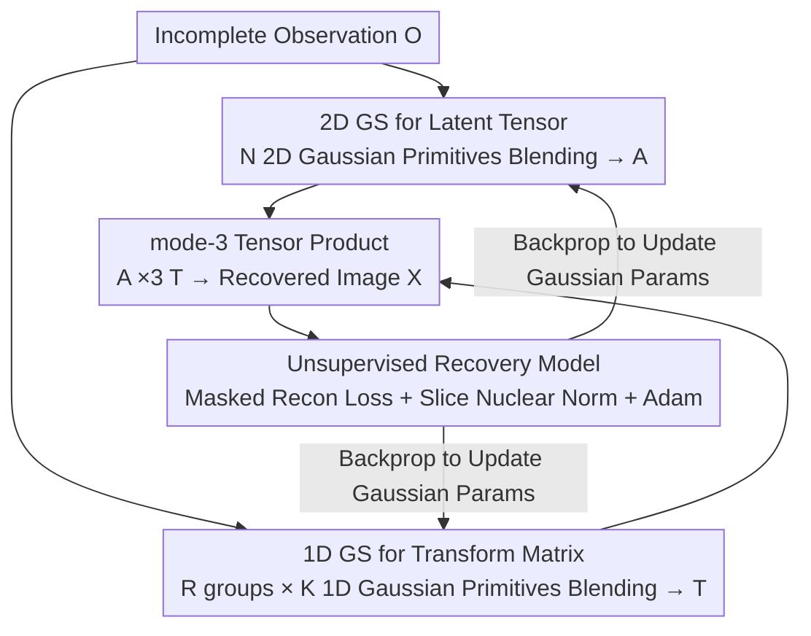

# Gaussian Splatting-based Low-Rank Tensor Representation for Multi-Dimensional Image Recovery

**Conference**: CVPR 2026  
**Paper**: [CVF Open Access](https://openaccess.thecvf.com/content/CVPR2026/html/Zeng_Gaussian_Splatting-based_Low-Rank_Tensor_Representation_for_Multi-Dimensional_Image_Recovery_CVPR_2026_paper.html)  
**Code**: None (Not provided by the authors)  
**Area**: Image Recovery / Low-Rank Tensor Representation  
**Keywords**: Gaussian Splatting, Low-Rank Tensor, t-SVD, Multi-dimensional Image Recovery, High-frequency Information  

## TL;DR
This work integrates Gaussian Splatting from 3D reconstruction into the t-SVD framework: 2D Gaussian Splatting is used to generate the latent tensor, while 1D Gaussian Splatting generates the transform matrix. This results in GSLR, a continuous, compact representation capable of capturing local high-frequency details. Based on this, an unsupervised multi-dimensional image recovery model is established, comprehensively outperforming SOTAs in PSNR/SSIM across random, tubal, and slice-wise missing patterns.

## Background & Motivation
**Background**: Multi-dimensional images (RGB, Multi-Spectral Images (MSI), etc.) naturally possess strong global correlations characterized by low-rankness. Specifically, tensor tubal-rank based on the tensor Singular Value Decomposition (t-SVD) has gained attention due to its elegant algebraic properties. t-SVD decomposes a third-order tensor into a **latent tensor** $\mathcal{A}$ and a **transform matrix** $\mathbf{T}$, where the former captures spatial structures and the latter captures information along mode-3 (spectral/channel) fibers.

**Limitations of Prior Work**: Both core components of t-SVD have significant drawbacks. First, the latent tensor was previously approximated via **tensor decomposition** (SVD, NMF, QR decomposition, etc.), which has limited representation capacity and only provides a coarse global approximation, failing to capture spatial local high-frequency information (sharp edges, fine textures). Second, the transform matrix is typically restricted to **fixed basis atoms** such as DFT or DCT (complex exponentials, cosines), which cannot accurately characterize local high frequencies along mode-3 fibers, commonly resulting in an inability to recover broken spectral curves in MSI.

**Key Challenge**: Later approaches used neural networks to implicitly learn these basis atoms, but neural networks suffer from **spectral bias**—inherently preferring low frequencies and struggling with high frequencies. Thus, "replacing fixed bases with networks" did not truly resolve the high-frequency issue. The fundamental problem is that both t-SVD components lack a parametrization method that is **continuous, compact, and capable of precisely expressing high frequencies**.

**Key Insight**: The authors noted that **Gaussian Splatting (GS)** from 3D reconstruction possesses exactly these capabilities—modeling data as a weighted mixture of continuous Gaussian primitives. It is a "non-neural" continuous modeling tool that is both compact and preserves fine geometric details without the spectral bias of neural networks. However, directly modeling multi-dimensional images with GS is insufficient, as original GS completely ignores the low-rank structure of multi-dimensional images.

**Core Idea**: "Tailor" Gaussian Splatting into the t-SVD framework—using **2D Gaussian Splatting to generate the latent tensor** and **1D Gaussian Splatting to generate the transform matrix**. These two are indispensable and complementary, forming GSLR. This is combined with a slice nuclear norm low-rank prior to ensure the representation is both continuous/high-frequency and preserves low-rank structures.

## Method

### Overall Architecture
GSLR follows the t-SVD decomposition skeleton: a multi-dimensional image $\mathcal{X}\in\mathbb{R}^{H\times W\times B}$ is expressed as the mode-3 tensor product of a latent tensor $\mathcal{A}\in\mathbb{R}^{H\times W\times R}$ and a transform matrix $\mathbf{T}\in\mathbb{R}^{B\times R}$:

$$\mathcal{X}=\mathcal{A}\times_3\mathbf{T}$$

In GSLR, $\mathcal{A}$ and $\mathbf{T}$ are no longer derived from tensor decomposition or fixed transforms, but are "rendered" by **tailored 2D Gaussian Splatting** and **1D Gaussian Splatting**, respectively. The entire recovery pipeline is unsupervised: given an observed image $\mathcal{O}$ with missing values, the parameters of all Gaussian primitives are treated as learnable variables. Adam is used to directly minimize the "reconstruction error of observed pixels + latent tensor slice nuclear norm." Once optimization converges, the complete image is reconstructed via $\mathcal{A}\times_3\mathbf{T}$. The entire blending (rendering) process is fully differentiable with respect to parameters, allowing for self-supervised fitting on a single image without training data.

### Key Designs

**1. 2D Gaussian Splatting for Latent Tensor (2DGS-LT): Embedding Spatial Local HF into a Continuous Gaussian Field**

To address the limitation where tensor decomposition only provides coarse approximations, the authors parameterize the latent tensor as a **continuous 2D Gaussian field**. The field contains $N$ 2D Gaussian primitives, each defined by three sets of learnable parameters: position $\mu\in\mathbb{R}^2$, covariance $\Sigma\in\mathbb{R}^{2\times2}$, and feature $c\in\mathbb{R}^R$ (where feature vector dimension $R$ equals the mode-3 dimension of the latent tensor). The latent tensor value at any spatial coordinate $(x,y)$ is obtained by the blending of all overlapping Gaussian primitives:

$$\mathcal{A}(x,y)=\sum_{j=1}^{N}c_j\cdot\exp\!\left(-\tfrac{1}{2}\big((x,y)^\top-\mu_j\big)^\top\Sigma_j^{-1}\big((x,y)^\top-\mu_j\big)\right)$$

Each 2D primitive has $5+R$ parameters. It captures HF details because the covariance of Gaussian primitives can be learned to be very "sharp," resulting in acute responses at edges and textures—a continuous, adaptive expression that fixed bases cannot provide. Simultaneously, it remains a compact representation of finite primitives, avoiding the overfitting associated with per-pixel free parameters.

**2. 1D Gaussian Splatting for Transform Matrix (1DGS-TM): Enabling Continuous Representation for mode-3 HF**

To address the inability of fixed bases like DFT/DCT to capture HF along mode-3 fibers (e.g., fractured spectral curves), the authors tailor GS to 1D to generate each column of the transform matrix. Specifically, $R$ columns of the transform matrix $\mathbf{T}$ are generated by $R$ independent **1D Gaussian fields**, each containing $K$ 1D Gaussian primitives. Each primitive is defined by position $\mu\in\mathbb{R}$, variance $\sigma\in\mathbb{R}^+$, and feature $c\in\mathbb{R}$. The value of the $r$-th column at spectral coordinate $z$ is:

$$\mathbf{T}(z,r)=\sum_{k=1}^{K}c_k^r\cdot\exp\!\left(-\frac{(z-\mu_k^r)^2}{2(\sigma_k^r)^2}\right)$$

The total parameters are $3KR$. Unlike DFT/DCT, these "bases" are not predefined analytical functions but continuous Gaussian mixtures optimized per data. Compared to implicit learning via neural networks, this method lacks spectral bias, accurately restoring HF along mode-3 (e.g., sharp peaks in spectral curves). The 2D and 1D paths are **indispensable and complementary**: the former manages spatial HF, while the latter manages mode-3 HF.

**3. Unsupervised Recovery with Slice Nuclear Norm: Integrating HF into Low-Rank Structures**

Continuous HF expression alone is insufficient, as native GS ignores inherent low-rank structures. The authors build an unsupervised recovery model with an objective function consisting of the "masked reconstruction error of observed pixels + nuclear norm of latent tensor slices":

$$\min_{\theta_\mathcal{A},\theta_\mathbf{T}}\ \big\lVert\mathcal{M}\odot(\mathcal{O}-\mathcal{A}\times_3\mathbf{T})\big\rVert_F^2+\lambda\sum_{i=1}^{R}\big\lVert\mathbf{A}_{[i]}\big\rVert_*$$

Where $\mathcal{M}$ is a binary mask (1 for observed, 0 for missing), $\odot$ denotes element-wise multiplication, and $\lambda$ is a balancing coefficient. The constraint part involves the rendering formulas of 2DGS-LT and 1DGS-TM. The first term ensures fidelity to observations, while the second term imposes matrix nuclear norms on each frontal slice of the latent tensor, explicitly injecting spatial low-rank priors. Since blending is differentiable, the authors use Adam to optimize all Gaussian parameters $\theta_\mathcal{A},\theta_\mathbf{T}$.

> ⚠️ The authors provide Lemma 1 + Theorem 1: When the number of primitives $N=HW$ and $K=B$, with covariance/variance approaching 0, latent slices satisfying SVD form, and $\mathbf{T}$ being invertible, GSLR degrades into the classic t-SVD. This indicates GSLR is a strict generalization of t-SVD with stronger representation capability.

## Key Experimental Results

Datasets include RGB images (512×512×3 / 256×256×3) and MSI (256×256×31 / ×80). Three missing patterns are evaluated: random missing (SR 0.02/0.05/0.10), tubal missing (SR 0.10/0.15/0.20), and slice missing (only 5 bands preserved at start and end). 6 SOTAs are compared: TNN, TRLRF, TCTV, HLRTF, LRTFR, FLRTF. Metrics: PSNR / SSIM.

### Main Results
Under random missing (SR=0.10) and slice missing, GSLR achieves the highest PSNR/SSIM on both RGB and MSI (selected data):

| Missing Pattern / Data | Metric | GSLR | Prev. SOTA | Gain |
|------|------|------|------|------|
| Random SR=0.10 / RGB | PSNR / SSIM | **25.423 / 0.747** | 24.416 / 0.705 (TCTV) | +1.01 dB |
| Random SR=0.10 / MSI | PSNR / SSIM | **41.466 / 0.988** | 38.839 / 0.970 (HLRTF) | +2.63 dB |
| Tubal SR=0.20 / MSI | PSNR / SSIM | **30.435 / 0.898** | 29.554 / 0.858 (TCTV) | +0.88 dB |
| Slice / Painting | PSNR / SSIM | **36.815 / 0.958** | 35.833 / 0.949 (FLRTF) | +0.98 dB |
| Slice / Hairs | PSNR / SSIM | **43.276 / 0.989** | 42.563 / 0.973 (FLRTF) | +0.71 dB |

Even at an extremely low SR=0.02, GSLR remains lead (e.g., RGB 21.684 dB vs. next-best LRTFR 19.195 dB). Slice missing highlights the mode-3 HF capability, where fixed-base methods (TNN/TRLRF) nearly collapse, while GSLR excels, validating the power of 1DGS-TM.

### Ablation Study
The authors replaced the Gaussian Splatting paths with alternatives on Toy data:

| Ablation Component | Replacement | Random SR=0.10 | Slice Missing | Description |
|------|------|------|------|------|
| Latent Tensor (Tab.4) | Unconstrained | 36.875 / 0.963 | 28.123 / 0.823 | Free params, no low-rank constraint |
| Latent Tensor (Tab.4) | Low-Rank Decomp. | 37.955 / 0.963 | 30.323 / 0.853 | HLRTF-style decomposition |
| Latent Tensor (Tab.4) | **2DGS-LT (Ours)** | **43.630 / 0.995** | **34.201 / 0.943** | Best with 2D GS |
| Transform Matrix (Tab.5) | Unconstrained | 38.692 / 0.985 | 11.067 / 0.224 | Discrete, collapses on slice missing |
| Transform Matrix (Tab.5) | INR | 39.330 / 0.973 | 26.637 / 0.786 | Continuous but has spectral bias |
| Transform Matrix (Tab.5) | **1DGS-TM (Ours)** | **43.630 / 0.995** | **34.201 / 0.943** | Best with 1D GS |

Additionally, comparing GSLR with **native 2D GS** (Tab.6): GSLR achieves 43.630 dB vs. 28.770 dB for 2D GS on Toy random SR=0.10. Native 2D GS fails entirely on slice missing due to discrete feature attributes, whereas GSLR succeeds via 1DGS-TM.

### Key Findings
- **Dual GS Paths are Indispensable**: Removing 2DGS-LT (replacing with low-rank decomp) results in a ~5.7 dB drop at SR=0.10. Removing 1DGS-TM causes PSNR to drop from 34.2 dB to 11.07 dB (unconstrained) or 26.6 dB (INR) on slice missing.
- **Continuity is Critical**: Discrete/unconstrained schemes collapse on slice-wise missing data (total mode-3 loss). Only continuous representations (INR, 1DGS-TM) recover it, with 1DGS-TM being superior due to lack of spectral bias.
- **Low-Rank Prior is Essential**: GSLR outperforms native 2DGS because it incorporates the low-rank structure via the slice nuclear norm, which 2DGS ignores.

## Highlights & Insights
- **"Downscaling" 3D Tools for Low-Rank Decomposition**: Using 2D GS for spatial latent tensors and 1D GS for spectral transform matrices is a clean separation that avoids spectral bias while maintaining continuity.
- **Theoretical Security via Degradation**: Proving GSLR degrades to classic t-SVD under limit parameters ensures it is a strict superset rather than a heuristic modification.
- **Non-Neural, Single-Image Unsupervised**: The method requires no training set, fitting via differentiable blending + Adam, making it practical for RSI/medical/spectral scenarios where data is scarce.

## Limitations & Future Work
- **Parameters and Computational Overhead**: Primitive count $N$ can reach $9\times10^4$. Optimization is per-image, and the costs for speed/memory are primarily discussed in the supplementary material (⚠️).
- **Hyperparameter Sensitivity**: $N, K, R, \lambda$ and learning rates require per-data searching. For example, $R$ ranges from 15–60 for random missing but 100–300 for slice missing.
- **Scope**: Currently restricted to third-order tensor recovery tasks. Extension to higher-order tensors or tasks like denoising/super-resolution is yet to be validated.

## Related Work & Insights
- **vs. Classic t-SVD (TNN/DFT, DCT)**: These use fixed bases and coarse approximations. GSLR degrades to them at limits but provides stronger local HF expression normally.
- **vs. Neural-based t-SVD (HLRTF / LRTFR / FLRTF)**: These use networks for implicit bases but suffer from spectral bias. GSLR's non-neural 1DGS-TM is superior for capturing spectral HF.
- **vs. Native 2D Gaussian Splatting (2DGS, Zhang et al.)**: Native 2DGS is for 2D representation and ignores low-rankness. GSLR extends this into a framework for multi-dimensional images with robustness to mode-3 missing data.

## Rating
- Novelty: ⭐⭐⭐⭐⭐ First introduction of GS into t-SVD with theoretical proof of degradation.
- Experimental Thoroughness: ⭐⭐⭐⭐ 3 missing patterns + 6 SOTAs + ablation, though efficiency analysis is in supplementary material.
- Writing Quality: ⭐⭐⭐⭐ Clear progression from pain points to mechanism and formulas.
- Value: ⭐⭐⭐⭐ Provides a continuous, non-neural parametrization for high-frequency-aware tensor representation.

<!-- RELATED:START -->

## Related Papers

- [\[CVPR 2026\] Self-Attention Driven Tensor Representation for High-Order Data Recovery](self-attention_driven_tensor_representation_for_high-order_data_recovery.md)
- [\[CVPR 2026\] LRDUN: A Low-Rank Deep Unfolding Network for Efficient Spectral Compressive Imaging](lrdun_a_low-rank_deep_unfolding_network_for_efficient_spectral_compressive_imagi.md)
- [\[CVPR 2026\] Multinex: Lightweight Low-light Image Enhancement via Multi-prior Retinex](multinex_lightweight_low-light_image_enhancement_via_multi-prior_retinex.md)
- [\[CVPR 2026\] BiProLoRA: Bilevel Prompt LoRA for Real Scene Recovery](biprolora_bilevel_prompt_lora_for_real_scene_recovery.md)
- [\[CVPR 2026\] Event-Based Motion Deblurring Using Task-Oriented 3D Gaussian Event Representations](event-based_motion_deblurring_with_unpaired_data.md)

<!-- RELATED:END -->
