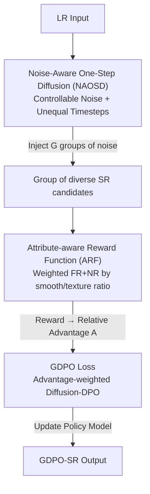

# GDPO-SR: Group Direct Preference Optimization for One-Step Generative Image Super-Resolution

**Conference**: CVPR 2026  
**Paper**: [CVF Open Access](https://openaccess.thecvf.com/content/CVPR2026/html/Yi_GDPO-SR_Group_Direct_Preference_Optimization_for_One-Step_Generative_Image_Super-Resolution_CVPR_2026_paper.html)  
**Code**: https://github.com/Joyies/GDPO  
**Area**: Image Restoration / Real-world Super-Resolution  
**Keywords**: One-step diffusion SR, preference optimization, DPO, GRPO, reward function  

## TL;DR
To address the issue where the deterministic output of one-step Real-ISR prevents preference optimization, this paper first employs "controllable noise injection + unequal timesteps" to enable one-step models to generate diverse candidates. It then merges DPO's pixel-level constraints with GRPO's intra-group relative advantage into GDPO, integrated with an attribute-aware reward function dynamically weighted by image smoothness/texture proportions. This approach enhances both fidelity and perceptual quality without increasing any inference overhead.

## Background & Motivation
**Background**: Real-world image super-resolution (Real-ISR) is currently dominated by leveraging pre-trained T2I diffusion priors (SD/FLUX). Early multi-step denoising methods like StableSR, SeeSR, and PASD achieve high image quality but suffer from slow inference and hallucination. To improve speed, one-step diffusion methods like OSEDiff and InvSR have emerged, treating LR images as inputs to produce results in a single step.

**Limitations of Prior Work**: One-step methods treat LR-to-HR as a **deterministic mapping**—a single input can only produce a unique output, which limits generative capacity and sacrifices details. Meanwhile, the strategy of aligning human preferences using reinforcement learning (RL) (e.g., DPO, GRPO) has been validated in multi-step ISR by DP2O-SR. A natural question arises: can RL be applied to one-step generative super-resolution?

**Key Challenge**: Applying DPO/GRPO directly to one-step models faces two hurdles. First, preference optimization requires the policy model to produce **diverse** outputs for the same input, whereas one-step models are deterministic and cannot generate comparable positive/negative samples. Second, both RL algorithms have weaknesses: DPO uses only a pair of offline samples, limiting data diversity; GRPO, while generating a group of online samples to calculate relative advantage, only computes **image-level** likelihood, neglecting local details crucial for ISR.

**Goal**: (1) Enable one-step SR models to regain controllable output diversity; (2) Design a preference optimization algorithm that possesses both DPO's pixel-level precision and GRPO's online multi-sample efficiency; (3) Ensure the reward signal can distinguish subtle quality differences among candidates.

**Core Idea**: Introduce stochasticity into one-step models via "controllable noise injection" (different noise → candidates of varying quality), and then rewrite the DPO pixel-level loss as a form weighted by GRPO-style intra-group relative advantages (**GDPO**) — essentially "reweighting the Diffusion-DPO loss with intra-group relative advantages."

## Method

### Overall Architecture
The training of GDPO consists of two core stages. First, a base model NAOSD (noise-aware one-step diffusion) is developed: given an LR input, injecting different random noises yields a group of SR candidates with varying quality. Then, in the GDPO preference optimization phase, the **Advantage Calculation Stage** uses ARF (attribute-aware reward function) to score each candidate and convert scores into intra-group relative advantages $A_i$. The **Policy Optimization Stage** feeds these candidates and noises into the policy model and a frozen reference model, using the GDPO loss to push the policy toward high-reward candidates. Both models are initialized with the pre-trained NAOSD.

### Key Designs

**1. NAOSD + Unequal Timesteps: Injecting Controllable Diversity into Deterministic Models**

One-step SR is originally deterministic, lacking the "multiple outputs for one input" required for RL. NAOSD injects controllable Gaussian noise into the latent space: $z_{LR}=E(I_{LR})$ is perturbed to obtain $\tilde{z}=\sqrt{\alpha_{t_{add}}}\,z_{LR}+\sqrt{\beta_{t_{add}}}\,\epsilon$ ($\epsilon\sim\mathcal{N}(0,I)$, $\alpha_{t_{add}}+\beta_{t_{add}}=1$). The UNet then denoises at diffusion timestep $t_{diff}$ to get $z_{SR}=(\tilde{z}-\sqrt{\beta_{t_{diff}}}\,\text{UNet}(\tilde{z},c_t,t_{diff}))/\sqrt{\alpha_{t_{diff}}}$. Semantic guidance $c_t$ is extracted via DAPE and CLIP, while the VAE encoder and UNet are fine-tuned with LoRA.

The key is **decoupling the noise injection timestep $t_{add}$ and the denoising timestep $t_{diff}$**. The authors found that if $t_{add}=t_{diff}$ and both are increased, generative capacity improves but fidelity collapses. Using a larger $t_{add}$ expands the sampling space while a conservative $t_{diff}$ stabilizes fidelity. Approximate analysis shows:

$$z_{SR}\approx\frac{\sqrt{\alpha_{t_{add}}}}{\sqrt{\alpha_{t_{diff}}}}z_{LR}+\frac{\sqrt{\beta_{t_{add}}}-\sqrt{\beta_{t_{diff}}}}{\sqrt{\beta_{t_{diff}}}}\epsilon$$

This indicates that as long as $t_{add}\ne t_{diff}$, a random term $\epsilon$ remains, creating the diversity needed for subsequent RL optimization.

**2. Attribute-Aware Reward Function (ARF): Dynamically Balancing Fidelity and Perception**

ARF uses both full-reference (FR) and no-reference (NR) metrics. FR uses PSNR (strong fidelity measurement), and NR uses MANIQA and MUSIQ (perceptual quality). Since different images have different preferences (architectural scenes prefer fidelity, while flora prefers perceptual aesthetics), ARF **dynamically weights them based on smooth vs. detailed pixel proportions**. Images are divided into $10\times10$ patches, and complexity is measured by the Shannon entropy of Sobel gradient histograms. The reward for the $i$-th candidate is:

$$R_i=\rho_s\sum_{f\in G_{FR}}\frac{s_i^f}{|G_{FR}|}+\rho_d\sum_{f\in G_{NR}}\frac{s_i^f}{|G_{NR}|}$$

where $s_i^f$ are min-max normalized scores, and $\rho_s, \rho_d$ are the proportions of smooth and detailed regions. This ensures fidelity is prioritized in smooth areas and perception in detailed areas.

**3. GDPO Loss: Reweighting Diffusion-DPO with Intra-group Relative Advantage**

This is the core hybrid of DPO and GRPO. Absolute rewards $R_i$ are converted to intra-group relative advantages: $A_i=(R_i-\text{mean}(\{R_j\}))/\text{std}(\{R_j\})$. Unlike DPO, which uses only a pair of samples, GDPO uses the entire group of generated samples to rewrite the Diffusion-DPO loss:

$$L_{GDPO}=-\mathbb{E}_{x_0\sim D,\,x_t\sim q(x_t|x_0)}\log\sigma\Big(-\omega\sum_{i=1}^{G}A_i\big(\|\epsilon-\pi_\theta(x_t,t)\|_2^2-\|\epsilon-\pi_{ref}(x_t,t)\|_2^2\big)\Big)$$

When a candidate has a high reward, $A_i$ increases, and its weight in $\sum_i A_i(\cdot)$ grows, pushing the policy towards these high-reward candidates. **DPO is a special case of GDPO when $G=2$**. Compared to GRPO's global likelihood, GDPO inherits pixel-level constraints, better capturing local details.

### Loss & Training
NAOSD pre-training uses a combination of $L_1$, LPIPS, and VSD: $L_{onestep}=L_1(I_{SR},I_{HR})+\lambda_1 L_{LPIPS}+\lambda_2 L_{VSD}$. The GDPO fine-tuning phase uses $L_{GDPO}$ with group size $G=6$, preference weight $\omega=5000$, and LoRA rank 4.

## Key Experimental Results

### Main Results
Benchmarks include multi-step (StableSR, SeeSR) and one-step (OSEDiff, InvSR) methods. GDPO-SR achieves optimal results across three datasets:

| Dataset | Method | PSNR↑ | LPIPS↓ | DISTS↓ | MANIQA↑ | MUSIQ↑ |
|--------|------|-------|--------|--------|---------|--------|
| DRealSR | OSEDiff | 27.92 | 0.2968 | 0.2165 | 0.5899 | 64.65 |
| DRealSR | **GDPO-SR** | **28.18** | **0.2851** | **0.2112** | **0.6180** | **65.63** |
| RealSR | InvSR | 24.30 | 0.2775 | 0.2060 | 0.6561 | 67.31 |
| RealSR | **GDPO-SR** | **25.48** | **0.2675** | **0.1980** | **0.6615** | **69.42** |

GDPO-SR outperforms others in PSNR and perceptual metrics. Compared to the base NAOSD, GDPO-SR improves PSNR from 25.25 to 25.48 on RealSR. Efficiency-wise, it matches OSEDiff (0.11s for 512x512), as **noise injection and GDPO bring no inference overhead**.

### Ablation Study

Policy Ablation (RealSR):

| Method | PSNR↑ | FID↓ | DISTS↓ | MUSIQ↑ | Note |
|------|-------|------|--------|--------|------|
| NAOSD | 25.25 | 114.91 | 0.2001 | 69.06 | Base |
| Diffusion-DPO | 25.41 | 112.87 | 0.2010 | 69.16 | Offline pairs |
| DanceGRPO | 25.10 | 113.74 | 0.2049 | 69.95 | Image-level likelihood |
| **GDPO (Ours)** | **25.48** | **112.13** | **0.1980** | 69.42 | Best balance |

### Key Findings
- **GDPO Value lies in "Local + Balance"**: DanceGRPO improves NR but crashes fidelity, indicating global likelihood misses local distributions. GDPO’s pixel-level constraints ensure improvements in both FR and NR.
- **Single Metric Rewards are Insufficient**: Using only FR drops NR, and only NR drops fidelity—joint optimization is essential.
- **Adaptive Weighting Works**: Fixing $\rho_s, \rho_d$ results in sub-optimal metrics, proving that uniform weighting cannot capture spatial variations.

## Highlights & Insights
- **Turning Determinism into a Controllable Knob**: Decoupling $t_{add} \ne t_{diff}$ creates diversity without sacrificing fidelity, supported by theoretical noise residual analysis.
- **GDPO as a Generalized DPO/GRPO Hybrid**: Incorporating GRPO's relative advantage into Diffusion-DPO's pixel loss is elegant and transferable to other diffusion preference tasks.
- **Content-Adaptive Reward**: Using gradient entropy to partition smooth/texture regions for dynamic FR/NR weighting is a practical and intuitive reward design trick.

## Limitations & Future Work
- Higher training overhead compared to DPO due to generating $G=6$ candidates online.
- ARF is a **handcrafted heuristic reward**; designing rewards that better align with human perception remains an open challenge.
- Risk of metric overfitting: Since ARF uses PSNR/MANIQA/MUSIQ, the model is inherently optimized for these specific metrics.

## Related Work & Insights
- **vs. DPO**: GDPO uses online samples and group relative advantages, with DPO being its $G=2$ special case.
- **vs. GRPO**: GRPO uses global likelihood which hurts fidelity; GDPO uses pixel-level constraints.
- **vs. DP2O-SR**: DP2O-SR is multi-step and sacrifices fidelity for perception; GDPO-SR is one-step, more balanced, and much faster.

## Rating
- Novelty: ⭐⭐⭐⭐ (First RL preference optimization for one-step SR)
- Experimental Thoroughness: ⭐⭐⭐⭐ (Comprehensive ablation and efficiency analysis)
- Writing Quality: ⭐⭐⭐⭐ (Clear motivation and formal derivations)
- Value: ⭐⭐⭐⭐ (Improves one-step SR quality with zero inference overhead)

<!-- RELATED:START -->

## Related Papers

- [\[NeurIPS 2025\] DP²O-SR: Direct Perceptual Preference Optimization for Real-World Image Super-Resolution](../../NeurIPS2025/image_restoration/dp2o-sr_direct_perceptual_preference_optimization_for_real-world_image_super-res.md)
- [\[CVPR 2026\] ExpoCM: Exposure-Aware One-Step Generative Single-Image HDR Reconstruction](expocm_exposure-aware_one-step_generative_single-image_hdr_reconstruction.md)
- [\[CVPR 2026\] PS-SR: Pseudo-Single-Step Video Super-Resolution via Speculative Diffusion](ps-sr_pseudo-single-step_video_super-resolution_via_speculative_diffusion.md)
- [\[CVPR 2026\] Bridging Fidelity-Reality with Controllable One-Step Diffusion for Image Super-Resolution](bridging_fidelity-reality_with_controllable_one-step_diffusion_for_image_super-r.md)
- [\[CVPR 2026\] One-Step Diffusion Transformer for Controllable Real-World Image Super-Resolution](one-step_diffusion_transformer_for_controllable_real-world_image_super-resolutio.md)

<!-- RELATED:END -->
