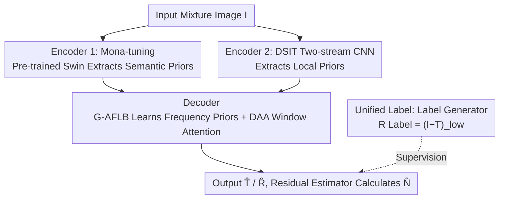

# GFRRN: Explore the Gaps in Single Image Reflection Removal

**Conference**: CVPR 2026  
**Section**: [CVF Open Access](https://openaccess.thecvf.com/content/CVPR2026/html/Chen_GFRRN_Explore_the_Gaps_in_Single_Image_Reflection_Removal_CVPR_2026_paper.html)  
**Code**: [Project Page](http://tabe-i.github.io/GFRRN-project/)  
**Area**: Image Restoration / Reflection Removal  
**Keywords**: Single Image Reflection Removal, Parameter-Efficient Fine-Tuning, Semantic Gap, Unified Label, Frequency Prior

## TL;DR
GFRRN bridges two long-neglected "gaps" in single image reflection removal (SIRR)—the semantic gap between pre-trained models and reflection removal models, and the reflection label inconsistency between synthetic and real-world data—by leveraging Mona parameter-efficient fine-tuning and unified low-frequency labels, respectively. Combined with a Gaussian Adaptive Frequency Block and Dynamic Agent Attention, GFRRN pushes the average PSNR to 27.33 dB across five real-world test sets (+0.7 dB compared to prior SOTA).

## Background & Motivation

**Background**: Single image reflection removal (SIRR) aims to decompose a mixture image $\mathbf{I}$ captured through glass into a transmission layer $\mathbf{T}$ (the desired real-world scene) and a reflection layer $\mathbf{R}$ (the reflection on the glass). The current mainstream approach is the **two-stream method**: one stream estimates the transmission while the other estimates the reflection, and feature interaction mechanisms are utilized to exchange information between the two streams (YTMT, DSRNet, DSIT). Additionally, a pre-trained model (VGG or Swin-Transformer) is often introduced to provide high-level semantics, which usually yields promising results.

**Limitations of Prior Work**: The authors point out that these two-stream interaction methods overlook two "gaps". The first is the **semantic gap**—the pre-trained models used to provide semantics are trained for classification tasks and emphasize high-level semantics, and they are usually frozen without participating in backpropagation. Therefore, they "aim to provide" original classification semantics, whereas the reflection removal models "require" restoration semantics oriented toward low-level textures, creating a conflict of objectives. The second is the **training data gap**—SIRR training utilizes both synthetic and real-world data, but their reflection layer labels are defined inconsistently: synthetic data directly has $\mathbf{R}$, whereas real-world data lacks reflection ground truth and must use the residual $\mathbf{I}-\mathbf{T}$ as the reflection label. This split in supervision signals hurts generalization.

**Key Challenge**: Existing works either leave these two gaps unaddressed or, like RDNet, use full fine-tuning (FFT) to align the pre-trained model. However, FFT has a massive parameter size. On small datasets like those in SIRR (which are far smaller than ImageNet), it struggles with optimization and causes performance drops instead (in experiments, FFT dragged the PSNR down from the frozen baseline's 26.70 dB to 25.35 dB).

**Goal**: To align the pre-trained model with the reflection removal model (bridging the semantic gap) without introducing the optimization burden of FFT, to unify reflection labels for synthetic and real data at the data level (bridging the data gap), and to explicitly utilize the inherent frequency priors and inter-window reflection discrepancies in SIRR.

**Core Idea**: To utilize **parameter-efficient fine-tuning (Mona-tuning)** to gently shift the semantics of the pre-trained Swin toward the reflection removal task, and use the **low-frequency part** $(\mathbf{I}-\mathbf{T})_{low}$ of $\mathbf{I}-\mathbf{T}$ as the unified reflection label. Combined with a Gaussian-based Adaptive Frequency Block and Dynamic Agent Attention, this forms the "gap-free" GFRRN.

## Method

### Overall Architecture
GFRRN generally follows the dual-encoder + single-decoder two-stream architecture of DSIT, but modifies four components to bridge the gaps. The input is the mixture image $\mathbf{I}$, and the outputs are the estimated transmission layer $\hat{\mathbf{T}}$, the reflection layer $\hat{\mathbf{R}}$, and the residual term $\hat{\mathbf{N}}$. The two parallel encoders are: Encoder 1, which is a pre-trained Swin-Transformer inserted with several learnable Mona layers to extract global semantic priors; and Encoder 2, a two-stream CNN borrowed from DSIT to extract local priors. After merging, the features from both streams enter a single decoder, where a G-AFLB is used to learn frequency priors and DAA replaces the original window-supervised attention. $\hat{\mathbf{R}}$ and $\hat{\mathbf{T}}$ are also fed into a residual estimator (mainly composed of NAFBlocks) to calculate $\hat{\mathbf{N}}$. The key modification on the training side is that the supervision label for the reflection layer no longer uses the raw $\mathbf{I}-\mathbf{T}$ but rather the $(\mathbf{I}-\mathbf{T})_{low}$ obtained by filtering out high-frequency edges using a "label generator" (a simple 2D low-pass filter). The filtered high-frequency part is then captured by the residual term $\hat{\mathbf{N}}$.

### Key Designs

**1. Mona-tuning: Bridging the Semantic Gap Between Pre-trained and Reflection Removal Models with Parameter-Efficient Fine-Tuning**

Pre-trained Swin is optimized for classification and focuses on high-level semantics, whereas reflection removal is a dense prediction task that favors low-level texture details. There is a conflict of interest between the frozen Swin "providing raw semantics" and the reflection removal model "needing SIRR-oriented semantics". While full fine-tuning (FFT) seems capable of alignment, Swin has too many parameters and the SIRR dataset is too small, leading to optimization difficulties and performance drops. The authors adopt the cognitively inspired Mona (Multi-cognitive visual adapter)—freezing all pre-trained weights of Swin, inserting Mona layers only after the MSA and MLP of each SwinBlock, and training only these layers. This utilizes vision-oriented convolutional filters to "transfer" pre-trained knowledge to the reflection removal task from multiple cognitive perspectives. This bypasses the optimization challenges of FFT while gently aligning the semantic direction for SIRR. This is the first work to apply PEFT to the SIRR task. In ablation studies, Mona (27.33 dB) significantly outperforms the frozen baseline (26.70 dB), FFT (25.35 dB), and LoRA (26.51 dB)—LoRA is mostly optimized for multi-head attention weights in NLP and is less friendly to vision tasks.

**2. Unified Label: Eliminating Reflection Label Inconsistency Between Synthetic and Real Data via $(\mathbf{I}-\mathbf{T})_{low}$**

Synthetic data has reflection ground truth $\mathbf{R}$ for supervision while real-world data does not, relying instead on $\mathbf{I}-\mathbf{T}$. This label split directly impairs generalization. A naive approach is to use $\mathbf{I}-\mathbf{T}$ for synthetic data as well, but experiments show this actually degrades performance (27.33 $\to$ 26.61 dB). The reason is that $\mathbf{I}-\mathbf{T}$ contains strong high-frequency information (such as edges) from the transmission layer—according to the formulations of $\mathbf{I}=\mathbf{T}+\mathbf{R}+\Phi(\mathbf{T},\mathbf{R})$, $\mathbf{I}-\mathbf{T}$ is mixed with the residual term $\Phi$—and these high frequencies mislead the network into learning transmission-related information as part of the reflection. The authors argue that reasonable reflection labels should exclude transmission layer information as much as possible. Thus, they employ a label generator (a simple 2D low-pass filter) to filter out the high-frequency edges originating from the transmission layer in $\mathbf{I}-\mathbf{T}$, obtaining the unified reflection label $\mathbf{R}=(\mathbf{I}-\mathbf{T})_{low}$. The filtered high-frequency portion is explicitly supervised using the residual label $\mathbf{N}=\mathbf{I}-\mathbf{T}-(\mathbf{I}-\mathbf{T})_{low}$ to estimate $\hat{\mathbf{N}}$, preserving all information while regularizing transmission/reflection estimation. This is a generic, data-level solution—integrating it into DSIT and DSRNet consistently improves performance (e.g., DSRNet: 25.72 $\to$ 26.17 dB).

**3. G-AFLB: Adaptively Matching Reflection Blur with Gaussian Soft Frequency Boundaries**

During photography, the reflection layer exhibits varying degrees of blur due to relative depth-of-field locations. The SIRR task inherently carries frequency priors, but reflection removal models rarely exploit frequency information explicitly. Prompted by related work, the authors design the Gaussian-based Adaptive Frequency Learning Block (G-AFLB) in the decoder with two considerations: first, using smooth Gaussian coefficients instead of "black-and-white" binary frequency boundaries to suppress Gibbs ringing effects caused by hard truncation; second, allowing this soft boundary to adaptively match the blur level of the reflection layer. In the ablation study, G-AFLB (using a Gaussian mask) outperforms AFLB (using a hard mask) by 0.25 dB in PSNR, validating the utility of the Gaussian soft mask.

**4. DAA: Enabling Window Attention to Explicitly Distinguish the Severity of Reflection Contamination Across Windows**

Window attention (W-MSA) is the core of two-stream feature interaction but is computationally expensive. The authors first replace W-MSA with agent attention to improve efficiency. However, agent attention ignores the fact that different windows are contaminated by reflections to vastly different degrees (one window might be completely covered by reflection while another is completely clean, and others are partially corrupted). In response, they add a Window Importance Estimator (WIE) in the query branch to learn an adaptive importance weight for each window, and combine it with agent attention to construct Dynamic Agent Attention (DAA). This simultaneously models inter-window and intra-window saliency. Visualizations show that the learned weight map of WIE roughly identifies the reflection areas in the image. In the ablation study, DAA (27.33 dB) outperforms W-MSA (26.91 dB) and pure agent attention (27.04 dB).

### Loss & Training
The training objective is the sum of four losses. The content loss $\mathcal{L}_{con}$ supervises $\hat{\mathbf{T}}$ and $\hat{\mathbf{R}}$ in both spatial and gradient domains, incorporating the residual term $\hat{\mathbf{N}}$ for regularization ($\alpha=0.3$, $\beta=0.6$):

$$\mathcal{L}_{con} := \|\hat{\mathbf{T}}-\mathbf{T}\|_2^2 + \|\hat{\mathbf{R}}-\mathbf{R}\|_2^2 + \alpha\|\hat{\mathbf{N}}-\mathbf{N}\|_2^2 + \beta(\|\nabla\hat{\mathbf{T}}-\nabla\mathbf{T}\|_1 + \|\nabla\hat{\mathbf{R}}-\nabla\mathbf{R}\|_1 + \alpha\|\nabla\hat{\mathbf{N}}-\nabla\mathbf{N}\|_1)$$

Additionally, the exclusion loss $\mathcal{L}_{exc}$ (ensuring structural independence between $\hat{\mathbf{T}}$ and $\hat{\mathbf{R}}$ using a $\tanh$ gradient product across three scales), the perceptual loss $\mathcal{L}_{per}$ based on VGG-19 intermediate features (layer IDs $i\in\{2,7,12,21,30\}$), and the reconstruction loss $\mathcal{L}_{rec}=\|\mathbf{I}-\hat{\mathbf{T}}-\hat{\mathbf{R}}-\hat{\mathbf{N}}\|_1$ are employed. The total loss is defined as $\mathcal{L}_{total}=\mathcal{L}_{con}+\mathcal{L}_{exc}+\lambda_1\mathcal{L}_{per}+\lambda_2\mathcal{L}_{rec}$ with $\lambda_1=0.01$ and $\lambda_2=0.2$. The network is trained using Adam for 60 epochs with a fixed learning rate of 1e−4 and a batch size of 1 on a single RTX A6000 GPU. The training set is constructed by randomly sampling 5K synthetic pairs from PASCAL VOC + Real(90) + Nature(200) per epoch, with images uniformly resized to $384\times384$.

## Key Experimental Results

### Main Results
Comparing 11 SOTA SIRR methods across 5 commonly used real-world test sets (Real20, Object200, Postcard199, Wild55, Nature20), GFRRN ranks first in all performance comparisons, gaining an average PSNR/SSIM improvement of 0.7 dB / 0.01.

| Method | Source | Average PSNR | Average SSIM |
|------|------|------|------|
| DSRNet | ICCV'23 | 25.72 | 0.907 |
| RRW | CVPR'24 | 25.40 | 0.908 |
| DSIT | NeurIPS'24 | 26.50 | 0.919 |
| RDNet | CVPR'25 | 26.63 | 0.915 |
| **GFRRN (Ours)** | CVPR'26 | **27.33** | **0.929** |

### Ablation Study
Averaged over the five test sets, removing the key components individually yields:

| Configuration | PSNR | SSIM | Explanation |
|------|------|------|------|
| Full model | 27.33 | 0.929 | Full model |
| w/o DAA | 26.91 | 0.919 | Replacing DAA with W-MSA, drops 0.42 dB |
| w/o Mona-tuning | 26.70 | 0.920 | Freezing the pre-trained model, drops 0.63 dB (largest drop) |
| w/o unified label | 26.96 | 0.920 | Using legacy reflection labels, drops 0.37 dB |
| w/o G-AFLB | 27.02 | 0.923 | Removing the frequency block, drops 0.31 dB |

Supplementary ablations: Among fine-tuning techniques, Mona (27.33 dB) > AdaptFormer (27.32 dB) > Bitfit (26.86 dB) > Frozen (26.70 dB) > LoRA (26.51 dB) > FFT (25.35 dB). If the original $\mathbf{I}-\mathbf{T}$ is used as the unified label, the performance drops from 27.33 dB to 26.61 dB. Additionally, transferring this unified label to DSIT and DSRNet consistently improves their performance as well.

### Key Findings
- **Removing Mona-tuning causes the largest degradation (−0.63 dB)**, indicating that bridging the semantic gap contributes the most among the four components. Furthermore, FFT performs worse than the frozen baseline (25.35 vs 26.70 dB), confirming that PEFT is superior to full fine-tuning on small datasets.
- **The unified label must be the low-frequency version**: Directly using $\mathbf{I}-\mathbf{T}$ degrades performance; the key lies in filtering out high-frequency edges leaking from the transmission layer and leaving the high-frequency components to be absorbed by the residual term.
- **The unified label is a generalizable trick**: Integrating it into DSIT and DSRNet consistently improves performance, demonstrating that the data gap is a common issue in the SIRR domain rather than a specific issue of the proposed architecture.

## Highlights & Insights
- **Treating "gaps" as the research object**: The most clever aspect of this paper is that it does not simply stack modules. Instead, it diagnoses two neglected systemic gaps (semantic and data) in two-stream SIRR first, and then prescribes targeted solutions. This "diagnose before prescribing" narrative ensures each of the four components has a clear target.
- **The insight behind the unified label is highly counter-intuitive**: The correct way to unify labels is not a simple formulation alignment, but rather recognizing that $\mathbf{I}-\mathbf{T}$ is contaminated by transmission high frequencies. This necessitates low-pass filtering backed by residual estimation—a finding that can be directly transferred to other reflection/shadow/denoising tasks trained on mixed synthetic/real data.
- **Bringing PEFT into low-level vision**: It represents the first attempt to transfer adapters like Mona into SIRR. Under small-dataset scenarios, demonstrating that FFT is actually harmful provides a clean case study for "how to utilize large pre-trained models with tiny datasets."

## Limitations & Future Work
- The authors acknowledge that the unified reflection label $(\mathbf{I}-\mathbf{T})_{low}$ is not strictly accurate. In certain scenarios, some real reflection information might be incorrectly removed by the low-pass filter (ending up in the residual term), rendering it an approximate solution.
- The exact architectures of G-AFLB and WIE are placed in the supplementary materials, leaving the main paper without their complete formulations, which makes replication dependent on the supplementary files.
- An average improvement of 0.7 dB is considerable in SIRR, but as the paper points out, the five real-world datasets vary heavily in scene, lighting, and glass thickness, making simultaneous optimization across all metrics difficult. Robustness to extreme cases (e.g., highly intense specular reflections) still has room for improvement.

## Related Work & Insights
- **vs. RDNet (CVPR'25)**: RDNet also notes the semantic alignment problem but employs full fine-tuning (FFT) to align the pre-trained model. GFRRN replaces this with PEFT (Mona), bypassing the optimization struggle of FFT on small datasets; the PEFT route is shown to be significantly more stable in practice.
- **vs. DSIT (NeurIPS'24)**: GFRRN basically follows the dual-encoder two-stream backbone of DSIT, with three key differences—inserting Mona adapters into Swin, using low-frequency unified labels for reflection supervision, and replacing frequency processing and window attention in the decoder with G-AFLB and DAA.
- **vs. DSRNet (ICCV'23) / YTMT (NeurIPS'21)**: These also fall under two-stream interaction methods but fail to address the dual semantic/data gaps. The unified label proposed in this work, acting as a data-level plug-and-play solution, can be directly integrated into them to boost performance.

## Rating
- Novelty: ⭐⭐⭐⭐ Explicitly problematizes the two systemic gaps in SIRR and provides customized solutions. While bringing PEFT to SIRR is a first, individual components are mostly adaptations/combinations of existing techniques.
- Experimental Thoroughness: ⭐⭐⭐⭐⭐ 5 real-world datasets + 11 SOTA baselines + ablation studies on four components + multi-angle validations on fine-tuning techniques, labels, and cross-architecture generalization.
- Writing Quality: ⭐⭐⭐⭐ Clear "problem diagnosis to solution" narrative, with excellent diagrams. However, hiding key components (G-AFLB/WIE) in the supplementary materials slightly undermines self-consistency.
- Value: ⭐⭐⭐⭐ The unified label serves as a highly practical, general-purpose trick that is easily transferable to other SIRR models and related mixed-data tasks.

<!-- RELATED:START -->

## Related Papers

- [\[CVPR 2026\] LightRR: A Lightweight Network for Single Image Reflection Removal](lightrr_a_lightweight_network_for_single_image_reflection_removal.md)
- [\[CVPR 2026\] Rectifying Latent Space for Generative Single-Image Reflection Removal](rectifying_latent_space_for_generative_single-image_reflection_removal.md)
- [\[CVPR 2026\] Reflection Separation from a Single Image via Joint Latent Diffusion](reflection_separation_from_a_single_image_via_joint_latent_diffusion.md)
- [\[CVPR 2026\] ReflexSplit: Single Image Reflection Separation via Layer Fusion-Separation](reflexsplit_single_image_reflection_separation_via_layer_fusion-separation.md)
- [\[CVPR 2026\] Polarization State Tracing for Reflection Removal and Color-Consistent Reconstruction](polarization_state_tracing_for_reflection_removal_and_color-consistent_reconstru.md)

<!-- RELATED:END -->
