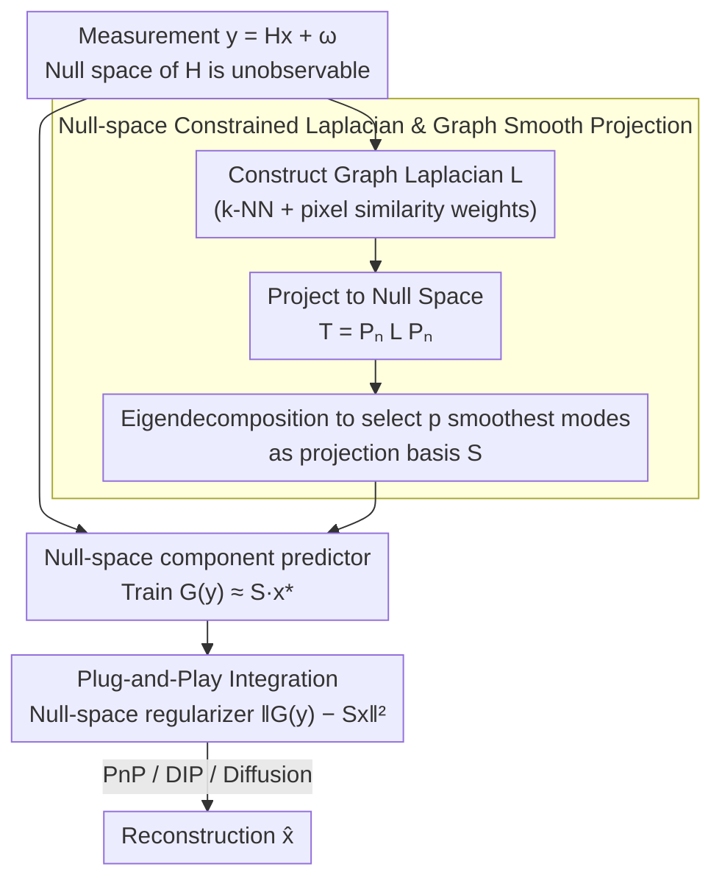

# GSNR: Graph Smooth Null-Space Representation for Inverse Problems

**Conference**: CVPR 2026  
**arXiv**: [2602.20328](https://arxiv.org/abs/2602.20328)  
**Code**: None  
**Area**: Image Restoration / Inverse Problems  
**Keywords**: Inverse problems, null-space representation, graph smoothing, spectral graph theory, plug-and-play

## TL;DR

The authors propose Graph Smooth Null-Space Representation (GSNR), which utilizes spectral graph theory to construct a null-space constrained Laplacian and selects the $p$ smoothest spectral modes as projection bases. This provides structured null-space constraints for inverse problem solvers such as PnP, DIP, and diffusion models, achieving improvements of up to 4.3dB PSNR in deblurring, compressed sensing, demosaicing, and super-resolution.

## Background & Motivation

The core challenge of imaging inverse problems lies in the **ill-posedness of the null space**: for an underdetermined system $y = Hx^* + \omega$, infinitely many solutions consistent with the measurements exist within the null space of the sensing matrix $H$. Any signal $x$ can be decomposed into a range component $x_r = P_r x$ (observable) and a null-space component $x_n = P_n x$ (unobservable).

Existing methods suffer from two types of issues: (1) General priors (e.g., PnP denoisers, score functions in diffusion models) operate across the entire image space without distinguishing between observable and unobservable components—denoisers may freely modify null-space components, leading to bias and hallucinations; (2) Existing null-space methods (e.g., NSN, NPN) attempt to learn low-dimensional projections within the null space, but **blindly learning an arbitrary null-space subspace** may waste capacity and introduce bias—they do not know which null-space directions are "meaningful."

Key Insight: **Natural images are not uniformly distributed in the null space—they occupy a low-dimensional, structured subset.** Inspired by graph smooth representations of images, spectral graph theory can be leveraged to select the **smoothest null-space directions** as projection bases. These directions are both easier to predict from measurements and efficiently cover the natural image variations within the null space.

## Method

### Overall Architecture

GSNR addresses the following: in the inverse problem $y = Hx + \omega$, the null space of the sensing matrix $H$ is unobservable. General priors can cause bias and hallucinations by incorrectly modifying this space, while blindly learning null-space subspaces wastes model capacity. The proposed approach first identifies "worthwhile" directions in the null space using spectral graph theory, then trains a small predictor to estimate the values of these directions from the measurements, and finally integrates this as a regularization term into any solver. Specifically: given a graph Laplacian $L$, it is projected into the null space to obtain the constrained Laplacian $T = P_n L P_n$. Eigendecomposition is performed on $T$, and the eigenvectors corresponding to the $p$ smallest eigenvalues are concatenated to form the projection matrix $S \in \mathbb{R}^{p \times n}$. A predictor $G(y) \approx Sx^*$ is trained to estimate the low-dimensional null-space representation. During reconstruction, $\|G(y) - Sx\|^2$ is added as a regularization term to the objective function of PnP, DIP, or diffusion models. In this pipeline, only $G$ requires training, while $S$ is directly computed from the problem structure.

### Key Designs

**1. Null-Space Constrained Laplacian and Graph Smooth Projection: Principled Selection of Informative Null-Space Directions**

Previous null-space methods (NSN, NPN) learn arbitrary subspaces blindly, unaware of which directions are truly significant, leading to wasted capacity and bias. GSNR selects directions based on the frequency structure of the graph: first, a graph Laplacian $L$ is constructed on the pixel grid (4 or 8 nearest neighbors, with edges encoding local pixel similarity), then projected to the null space to get $T = P_n L P_n$. Eigendecomposition of $T$ naturally provides a frequency ordering within the null space—smaller eigenvalues correspond to smoother (low-frequency) null-space modes. Selecting the top $p$ smoothest modes constitutes the projection basis $S$.

The choice of "smoothest" directions is rooted in the fact that natural images are inherently smooth; thus, their null-space components should predominantly occupy smooth modes. Theorems 1 and 2 in the paper prove that these graph-smooth modes achieve high coverage with a very small $p$, meaning a few modes can explain most of the natural image variance in the null space.

**2. Null-Space Component Predictor: Estimating Selected Directions from Measurements**

Having a good set of directions is insufficient; one must also know the values in each direction. This is handled by network $G$, which optimizes an L2 loss to fit the $p$-dimensional null-space coefficients $G(y) \approx Sx^*$. Here, the choice of graph smoothing plays a second critical role: Proposition 1 proves that graph-smooth null-space components are easier to predict from measurements than general bases because smooth modes correlate more strongly with the range space. Consequently, GSNR excels in two key metrics of null-space representation—coverage (high variance coverage with small $p$) and predictability.

**3. Plug-and-Play Integration: Constraining Only the Sensor Blind Spots**

General priors like PnP, DIP, or diffusion models act on the entire image and can conflict with data fidelity terms. GSNR applies the penalty $\|G(y) - Sx\|^2$ exclusively to the null-space components, effectively imposing structural constraints only where the sensor is "blind." This makes GSNR complementary rather than conflicting with existing priors. Integration varies by solver: for PnP, this term is added to the data fidelity step of proximal gradient descent; for DIP, it acts as an implicit regularizer; and for diffusion models, it serves as null-space guidance during posterior sampling.

### Loss & Training

The predictor $G$ is trained using an L2 loss: $\min_G \mathbb{E}\|G(y) - Sx^*\|^2$. The projection matrix $S$ is obtained directly via eigendecomposition of the constrained Laplacian $T$ and requires no learning. During the reconstruction phase, the weight $\eta$ of the null-space regularization term requires tuning.

## Key Experimental Results

### Main Results

**Image Deblurring**

| Method | PSNR↑ | Gain | Description |
|------|-------|------|------|
| PnP Baseline | X dB | - | No null-space constraint |
| PnP + GSNR | X+Y dB | **+Up to 4.3dB** | Significant improvement |
| End-to-end Supervised | Z dB | - | Supervised training |
| PnP + GSNR | Z+1 dB | **+Up to 1dB** | Outperforms end-to-end models |

**Consistency Across Tasks**

| Task | PnP Gain | DIP Gain | Diffusion Gain |
|------|---------|---------|--------------|
| Deblurring | Significant | Significant | Significant |
| Compressed Sensing | Significant | Significant | Significant |
| Demosaicing | Significant | Significant | Significant |
| Super-resolution | Significant | Significant | Significant |

### Ablation Study

| Configuration | PSNR | Description |
|------|------|------|
| No null-space constraint | Baseline | Standard PnP/DIP/Diffusion |
| Random Null-space Basis (NPN) | +Small | Low coverage |
| **GSNR (Graph Smooth Basis)** | **+Max** | High coverage + High predictability |

### Key Findings

- GSNR consistently delivers improvements across four tasks and three solvers, proving the universal value of structured null-space constraints.
- Graph-smooth bases achieve higher coverage than randomly learned bases at low $p$ values; 30% of modes can capture over 80% of null-space variance.
- Coverage/predictability curves serve as an operational diagnostic tool for selecting $p$.
- Null-space regularization reduces hallucinations—denoisers no longer freely modify unobservable components.

## Highlights & Insights

- **"Constrain only the unseen"** is an elegant design philosophy: while existing priors may conflict with data fidelity by constraining the whole image, GSNR only applies structure to the sensor's blind spots.
- **Spectral graph theory provides a principled selection of directions**: The projection matrix is derived from the problem structure rather than being learned, providing clear theoretical grounding.
- **Coverage/Predictability diagnostic curves** are practical tools: They transform the choice of regularization strength from "parameter tuning" into an "objective assessment."

## Limitations & Future Work

- Construction of the graph Laplacian requires estimating neighborhood pixel similarity, which may be inaccurate for severely degraded images.
- The computational overhead of null-space eigendecomposition may be high for high-resolution images.
- The generalization of predictor $G$ depends on the diversity of the training data.
- Theoretical analysis assumes a linear sensing matrix; applicability to non-linear forward models needs verification.

## Related Work & Insights

- **vs NPN**: Both learn null-space projections, but NPN learns arbitrary directions blindly; GSNR uses graph smoothing for principled direction selection.
- **vs PnP/RED**: These operate in the full image space without distinguishing between range and null-space components.
- **vs Total Variation (TV)**: TV imposes smoothness on the entire image, which can lead to over-smoothing; GSNR only imposes smoothness on the null space.

## Rating

- Novelty: ⭐⭐⭐⭐⭐ First to introduce graph smoothing to null-space representation with solid theoretical contributions (three theorems/propositions).
- Experimental Thoroughness: ⭐⭐⭐⭐⭐ Comprehensive validation across four tasks and three solvers, with tight alignment between theory and experiments.
- Writing Quality: ⭐⭐⭐⭐⭐ Rigorous mathematical derivation with clear explanations of motivation and intuition.
- Value: ⭐⭐⭐⭐⭐ Provides a universal, plug-and-play null-space regularization framework for inverse problems.

<!-- RELATED:START -->

## Related Papers

- [\[CVPR 2026\] Variational Garrote for Sparse Inverse Problems](variational_garrote_for_sparse_inverse_problems.md)
- [\[CVPR 2026\] PnP-CM: Consistency Models as Plug-and-Play Priors for Inverse Problems](pnp-cm_consistency_models_as_plug-and-play_priors_for_inverse_problems.md)
- [\[CVPR 2026\] Outlier-Robust Diffusion Solvers for Inverse Problems](outlier-robust_diffusion_solvers_for_inverse_problems.md)
- [\[CVPR 2026\] Time Without Time: Pseudo-Temporal Representation for Space-Time Super-Resolution](time_without_time_pseudo-temporal_representation_for_space-time_super-resolution.md)
- [\[ICML 2026\] Learning Normalized Energy Models for Linear Inverse Problems](../../ICML2026/image_restoration/learning_normalized_energy_models_for_linear_inverse_problems.md)

<!-- RELATED:END -->
