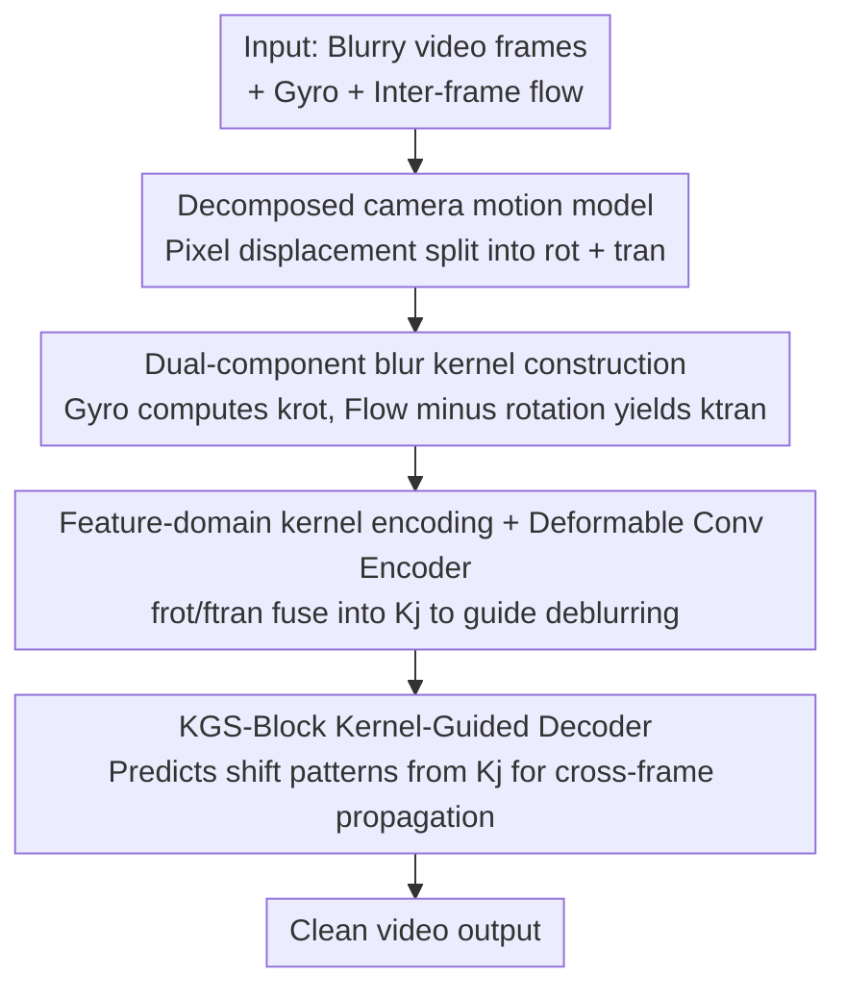

# Gyro-based Deep Video Deblurring

**Conference**: CVPR 2026  
**Paper**: [CVF Open Access](https://openaccess.thecvf.com/content/CVPR2026/html/Rim_Gyro-based_Deep_Video_Deblurring_CVPR_2026_paper.html)  
**Code**: http://cg.postech.ac.kr/research/GyroDVD (Project page, code pending)  
**Area**: Video Restoration / Video Deblurring  
**Keywords**: Gyro-based Deblurring, Video Deblurring, Blur Kernel Construction, Translational Motion, Deformable Convolution

## TL;DR
GyroDVD is the first learning-based framework for "gyro-assisted video deblurring." It utilizes a decomposed camera motion model to split per-pixel movement into rotational (measured by gyro) and translational (estimated via optical flow) components to construct per-pixel blur kernels. These kernels guide an image encoder and video decoder to restore clean video. It significantly outperforms all prior gyro-based image/video deblurring methods on the large-scale real-world dataset, GyroVD.

## Background & Motivation
**Background**: Smartphones and DSLRs integrated with gyroscopes can record camera rotation at high frame rates (e.g., 400 FPS) with nearly zero cost, providing a valuable prior for motion deblurring. Existing gyro-based deblurring works largely focus on **single-image deblurring**, where a blur kernel is estimated from gyro data and fed into a network (via concatenation, deformable convolution, or attention) to restore the sharp image.

**Limitations of Prior Work**: Gyro-based approaches suffer from two deep-seated flaws. First, **gyroscopes only measure rotation and cannot detect translation**. During video capture, handheld motion like walking or panning contributes significantly to blur; ignoring translation causes the blur kernel to mismatch the actual blur. Second, the few existing methods for gyro-based **video** deblurring rely on **simplified blur models + precise alignment + deconvolution**, which suffer from restrictive assumptions, limited performance, and the same neglect of translation. Others attempting to compensate for translation using accelerometers require scene depth/gravity direction and assume the camera is stationary at the start of exposure, which is rarely true in reality.

**Key Challenge**: To recover translation, the most direct signal is inter-frame optical flow—but optical flow **entangles** rotation and translation. Directly using it would count rotation twice. How to **cleanly disentangle the translational component from optical flow** is the key bottleneck in advancing gyro-deblurring from "rotation-only" to "rotation + translation." Furthermore, there is a lack of large-scale, real-world training datasets for gyro-based video deblurring.

**Goal**: (1) Establish a per-pixel motion/blur kernel model characterizing both rotation and translation; (2) Design a video deblurring network that effectively utilizes blur kernels; (3) Construct a real-world, large-scale video deblurring dataset with gyro data.

**Key Insight**: A **decomposed motion model** is used to approximate pixel displacement as "Rotation term (direct from gyro) + Translation term (residual from flow after removing rotation)." This constructs a per-pixel blur kernel that guides both **deblurring** and **cross-frame feature propagation**.

## Method

### Overall Architecture
The input to GyroDVD consists of blurry video frames $\{I_j\}$ and synchronized gyro data, and the output is the corresponding sharp video. The pipeline consists of two main parts: **Blur Kernel Construction** (converting gyro + flow into per-pixel kernels) and the **GyroDVD Network** (an encoder-decoder guided by these kernels). A decomposed motion model splits per-pixel displacement into rotation and translation. The rotation component $\mathbf{k}^{\text{rot}}$ is accumulated from gyro angular velocity, and the translation component $\mathbf{k}^{\text{tran}}$ is estimated by subtracting rotation from optical flow. Instead of merging these in the pixel domain, the network encodes them separately and fuses them into kernel features $\mathbf{K}_j$ in the **feature domain**. An image encoder uses deformable convolutions guided by $\mathbf{K}_j$ for per-frame deblurring, while a video decoder uses displacement patterns predicted from $\mathbf{K}_j$ for cross-frame propagation.

### Key Designs

**1. Decomposed Camera Motion Model: Splitting pixel displacement into measurable and estimable terms**

Rigid camera motion is described by a rotation matrix $R$ and translation vector $t$. Under the projection model, a pixel $p$ is warped to $p' = \pi\!\left(C\left(R C^{-1}p_H + \frac{1}{d}t\right)\right)$ (Eq. 1), where $C$ is the intrinsic matrix and $d$ is depth. The problem is that calculating the blur trajectory requires both translation $t$ and depth $d$, the latter being difficult to obtain.

The authors apply a first-order Taylor expansion to the projection function $\pi$ to **decouple** rotation and translation into additive terms: $p'_i \approx \pi(C R_i C^{-1} p_H) + \tau_i$, where the translation term $\tau_i = \frac{1}{d} J C t_i$ ($J$ is the Jacobian of $\pi$). Assuming constant translational velocity and depth during a short exposure, the final decomposed model is:

$$p'_i \approx \pi\!\left(C R_i C^{-1} p_H\right) + \frac{t_i - t_s}{t_e - t_s}\,\tau$$

Here, $\tau$ is the accumulated translation vector over the exposure interval $(t_s, t_e)$. The beauty of this decomposition is that the rotation term depends only on $R_i$ (available from gyro), while the translation term is compressed into a **depth-independent vector $\tau$ to be estimated**. This transforms an underdetermined problem into a solvable one.

**2. Dual-component Per-pixel Blur Kernel Construction: Gyro for rotation, Flow minus rotation for translation**

The rotation component comes directly from the gyro: angular velocity measurements $\{\omega_k\}$ are accumulated into rotation $R_i = \prod_{k:\tilde t_k \le t_i} \exp([\omega_k]_\times \Delta\tilde t_k)$ (Eq. 4). By setting $\tau=0$, the rotation-induced displacement trajectory $\mathbf{k}^{\text{rot}} = \{d^{\text{rot}}_i\}$ is calculated for each pixel (Eq. 5).

The translation component is estimated by calculating optical flow $f$ from frame $I$ to $I'$. The authors calculate the inter-frame rotation $R$ and **subtract the rotational part from the flow** to obtain the pure translation vector:

$$\tau = \frac{t_e - t_s}{\delta}\left(p'_f - \pi(C R C^{-1} p_H)\right)$$

(Eq. 6). Distributing $\tau$ over time yields $\mathbf{k}^{\text{tran}}$ (Eq. 7). The final blur kernel is $\mathbf{k} = \mathbf{k}^{\text{rot}} + \mathbf{k}^{\text{tran}}$ (Eq. 8). Visualizations demonstrate that neither rotation nor translation alone matches the real blur; their sum is required for accuracy. A consistency mask is used to discard unreliable $\mathbf{k}^{\text{tran}}$ in areas where flow estimation fails.

**3. Feature-domain Kernel Encoding + Deformable Convolution Encoder**

Rethinking the pixel-domain addition in Eq. 8, the authors note that rotation kernels (accurate) and translation kernels (noisy) have **entirely different error characteristics**. Adding them in the pixel domain allows flow noise to contaminate the entire kernel. Instead, they are **encoded separately and fused in the feature domain**: $\mathbf{K}_j = f_{\text{rot}}(\mathbf{k}^{\text{rot}}_j) + f_{\text{tran}}(\mathbf{k}^{\text{tran}}_j)$ (Eq. 9). This allows the network to learn modality-specific representations and retain complementary information.

Given kernel features $\mathbf{K}_j$, the image encoder performs per-frame deblurring using **modulated deformable convolutions**, where offsets and masks are calculated from $\mathbf{K}_j$. This "directs" sampling points along the blur trajectory to align features precisely.

**4. KGS-Block: Kernel-Guided Shift for Learnable Propagation**

The video decoder leverages spatial/temporal shifts for efficient feature propagation between frames. Standard shifts use static spatial patterns. The authors propose the **KGS-Block (Kernel-Guided Shift Block)**, replacing fixed patterns with **learnable patterns predicted from blur kernel features**. Specifically, feature $F_j$ is split into groups, and each group is warped by a displacement predicted from $\mathbf{K}_j$: $F^{\text{shift}}_{j,l} = \text{Warp}(F^a_{j,l}, [s^x_{j,l}, s^y_{j,l}])$ (Eq. 10). This ensures propagation "follows" the blur trajectory with minimal computational overhead.

### Loss & Training
The model is trained using AdamW with an $\ell_1$ loss. The initial learning rate is 4e−4, decaying to 1e−7 via cosine annealing over 600K iterations. Batch size is 4, each containing 13 consecutive frames. Training patches are 256×256 with standard augmentations. The blur kernel temporal sampling factor is $N=8$.

## Key Experimental Results

### Main Results
Performance on the GyroVD-Syn dataset (PSNR/SSIM, ↑ is better):

| Method | Type | Small PSNR | Large PSNR | Avg PSNR/SSIM | Param(M) |
|------|------|-----------|-----------|---------------|----------|
| GyroDeblur [60] | Gyro Image | 34.22 | 30.48 | 32.34 / 0.8458 | 16.31 |
| DSTNet [39] | Video | 35.77 | 31.75 | 33.86 / 0.8810 | 7.45 |
| ShiftNet [25] | Video | 36.16 | 32.46 | 34.37 / 0.8865 | 4.70 |
| RVRT [28] | Video | 36.52 | 32.85 | 34.82 / 0.8957 | 13.57 |
| ShiftNet+ [25] | Video (Large) | 36.97 | 33.51 | 35.31 / 0.9023 | 12.99 |
| ShiftNet with $\mathbf{k}^{\text{rot}}$ | Gyro Video | 36.21 | 32.77 | 34.55 / 0.8898 | 4.72 |
| **GyroDVD-64** | Gyro Video | 36.81 | 33.84 | **35.39 / 0.9047** | 5.04 |
| **GyroDVD-128** | Gyro Video | 37.35 | 34.38 | **35.93 / 0.9113** | 17.15 |

GyroDVD-64 outperforms ShiftNet+ despite having significantly fewer parameters (5.04M vs 12.99M). Gyro-based image deblurring methods generally underperform video-based ones, as single-image restoration remains highly underdetermined even with motion priors.

### Ablation Study

Ablation of blur kernel sources (GyroDVD-64, 150K iter):

| Configuration | PSNR / SSIM | Note |
|------|-------------|------|
| Baseline (No Kernel) | 33.51 / 0.8736 | No motion info |
| w/ Video Frames | 33.51 / 0.8732 | Using frames as kernel info (no gain) |
| w/ Optical Flow | 34.11 / 0.8846 | Bi-directional flow |
| w/ $\mathbf{k}^{\text{rot}}$ only | 34.30 / 0.8869 | Gyro-only |
| w/ $\mathbf{k}^{\text{rot}},\mathbf{k}^{\text{tran}}$ | **34.65 / 0.8928** | Full dual-component kernel |

Network architecture ablation:

| Encoder | Decoder | PSNR / SSIM | Note |
|---------|---------|-------------|------|
| w/o K | Shift | 33.51 / 0.8736 | Baseline |
| Def-Conv. | Shift | 33.95 / 0.8800 | Kernel in encoder only |
| Def-Conv. | Shift + Cat K | 33.42 / 0.8733 | Native concat in decoder harms performance |
| Def-Conv. | **KGS-Block** | **34.65 / 0.8928** | Full model |

### Key Findings
- **Translation is vital, but rotation is the foundation**: Using only the rotation kernel (34.30) already outperforms using flow (34.11), but adding the translation kernel provides an additional 0.35 dB boost.
- **Kernel utilization requires careful design**: Naively concatenating kernels in the decoder drops PSNR (33.42 vs 33.95). Only the KGS-Block effectively exploits kernel information.
- **Feature-domain fusion > Pixel-domain fusion**: Separate encoding of rotation and translation kernels yields a 0.1 dB gain over manual pixel-domain addition, likely due to better handling of differing noise profiles.
- **Robustness to flow error**: There is only a small gap (34.65 vs 34.78) between using flow from blurry frames versus ground truth frames, indicating the consistency mask and separate encoding effectively suppress flow errors.

## Highlights & Insights
- **First-order Taylor decoupling renders "unmeasurable translation" into an "estimable low-dimensional vector"**: By removing pixel-wise depth dependency, the problem becomes solvable—a mathematical insight applicable to other "Inertial + Vision" tasks.
- **"Flow minus Rotation" for clean translation**: Leveraging high-quality gyro data to "purify" entangled optical flow is a prime example of sensor complementarity.
- **Consistent kernel guidance**: The same blur kernel guides both deblurring (offsets) and temporal fusion (KGS-Block), ensuring motion priors are utilized across the entire pipeline.
- **Dataset as a significant contribution**: Synchronized 240 FPS video + 400 FPS gyro with precise exposure timestamps provides the necessary realism for academic and industrial research.

## Limitations & Future Work
- **Reliance on flow quality**: While suppressed by consistency masks, the translational component $\mathbf{k}^{\text{tran}}$ still suffers if optical flow fails catastrophically in extreme blur.
- **Inference speed**: Deformable convolutions and multi-frame propagation result in relatively long inference times (0.202s per frame for GyroDVD-128), making real-time mobile deployment challenging.
- **Dynamic objects**: The blur kernel is derived from a camera motion model. While the paper suggests the translation component implicitly captures some object motion, it is not explicitly modeled.
- **Assumptions of constant depth/velocity**: The first-order approximation may fail during violent back-and-forth movement or in scenes with extreme depth variations.

## Related Work & Insights
- **vs. Gyro Image Deblurring (GyroDeblur [60])**: These focus only on rotation and single images; GyroDVD's jump from 32.34 to 35.39 PSNR proves that single-image deblurring is suboptimal compared to video-based fusion.
- **vs. Classic Gyro Video Deblurring**: Prior works use deconvolution and ignore translation; GyroDVD is the first learning-based framework to explicitly model translation.
- **vs. Accelerometer-based Approaches**: Previous attempts using accelerometers for translation required gravity directions and scene depth; GyroDVD replaces these unrealistic requirements with optical flow estimation.

## Rating
- Novelty: ⭐⭐⭐⭐⭐ 
- Experimental Thoroughness: ⭐⭐⭐⭐⭐ 
- Writing Quality: ⭐⭐⭐⭐ 
- Value: ⭐⭐⭐⭐⭐ 

<!-- RELATED:START -->

## Related Papers

- [\[CVPR 2026\] SelfHVD: Self-Supervised Handheld Video Deblurring](selfhvd_self-supervised_handheld_video_deblurring.md)
- [\[CVPR 2025\] Gyro-based Neural Single Image Deblurring](../../CVPR2025/image_restoration/gyro-based_neural_single_image_deblurring.md)
- [\[ECCV 2024\] Domain-Adaptive Video Deblurring via Test-Time Blurring](../../ECCV2024/image_restoration/domain-adaptive_video_deblurring_via_test-time_blurring.md)
- [\[CVPR 2026\] Dual Graph Regularized Deep Unfolding Network for Guided Depth Map Super-resolution](dual_graph_regularized_deep_unfolding_network_for_guided_depth_map_super-resolut.md)
- [\[CVPR 2026\] BluRef: Unsupervised Image Deblurring with Dense-Matching References](bluref_unsupervised_image_deblurring_with_dense-matching_references.md)

<!-- RELATED:END -->
