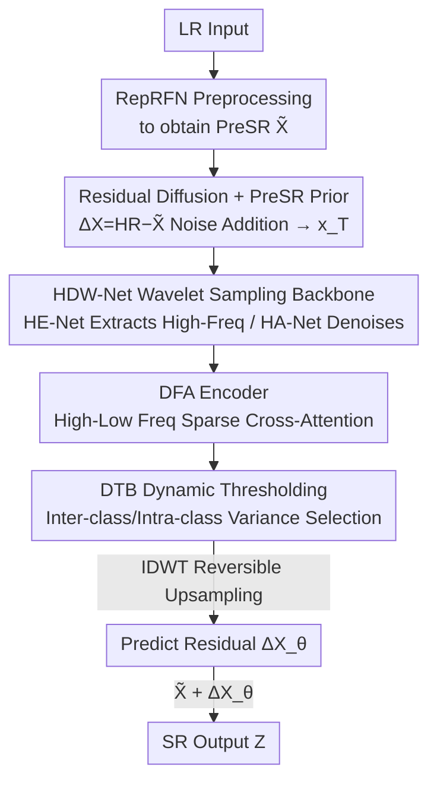

# HDW-SR: High-Frequency Guided Diffusion Model based on Wavelet Decomposition for Image Super-Resolution

**Conference**: CVPR 2026  
**Paper**: [CVF Open Access](https://openaccess.thecvf.com/content/CVPR2026/html/Yang_HDW-SR_High-Frequency_Guided_Diffusion_Model_based_on_Wavelet_Decomposition_for_CVPR_2026_paper.html)  
**Code**: https://github.com/Baty2023/HDW-SR  
**Area**: Image Restoration / Diffusion Models / Image Super-Resolution  
**Keywords**: Single Image Super-Resolution, Diffusion Models, Wavelet Decomposition, High-Frequency Guidance, Sparse Cross-Attention

## TL;DR
HDW-SR uses a combination of "residual-only diffusion + wavelet sampling replacing U-Net convolution + high/low frequency sparse cross-attention + dynamic thresholding selection" to explicitly inject the high-frequency prior of the pre-super-resolved image into the diffusion denoising process, achieving sharper and more natural detail restoration on both synthetic and real-world super-resolution datasets.

## Background & Motivation
**Background**: Single Image Super-Resolution (SISR) aims to reconstruct high-resolution (HR) images from low-resolution (LR) images. Recently, diffusion models have gradually replaced GANs as the mainstream approach. By generating images through progressive denoising, they can recover high-frequency textures better than GANs while avoiding GAN training instability and checkerboard artifacts caused by convolutional upsampling.

**Limitations of Prior Work**: Most existing diffusion-based super-resolution methods start from pure random noise and generate the entire HR image through multi-step denoising. This not only leads to slow convergence but also forces the network to distribute its attention across global structures, making it difficult to focus on fine-grained textures, which results in smoothed details. Even pre-trained diffusion prior methods (e.g., StableSR/SeeSR) and residual learning methods (e.g., ResShift) still rely on global image features and lack explicit high-frequency prior guidance, remaining deficient in local details and multi-scale features (as illustrated by the lifebuoy texture in the paper's Figure 1, where the overall structure is correct but the details are blurry).

**Key Challenge**: The diffusion denoising process is inherently a "global, low-frequency-first" process, whereas the most difficult part of super-resolution lies precisely in the high-frequency details. Meanwhile, commonly used CNN downsampling (pooling/strided convolution) inherently discards high frequencies, which is equivalent to discarding a portion of the high-frequency information in the very task that needs it most.

**Goal**: (1) Enable the network to focus its modeling capacity on high-frequency residuals instead of the entire image; (2) Avoid discarding high-frequency information during the sampling process; (3) Provide an explicit and reliable high-frequency guidance signal for the diffusion process.

**Key Insight**: Wavelet decomposition can **losslessly** decompose an image into low-frequency (structural) and high-frequency (detail) components, and is fully reversible. Therefore, using it to replace CNN sampling neither discards high-frequency details nor fails to perform multi-scale decomposition. Concurrently, a "Pre-Super-Resolution" (PreSR) image computed rapidly from the LR image naturally possesses usable high-frequency priors that can guide the diffusion process.

**Core Idea**: Perform diffusion only on the residual "HR − PreSR", and explicitly guide the diffusion network's detail restoration using the high-frequency components of PreSR obtained via wavelet decomposition through sparse cross-attention—namely, "guiding residual diffusion with wavelet high-frequency priors."

## Method

### Overall Architecture
HDW-SR is a **prior-guided residual diffusion network**. Given an LR image $X_i$ and an HR image $Y_i$: first, a lightweight CNN (RepRFN) is used to rapidly super-resolve $X_i$ into a pre-super-resolved image $\tilde{X}_i$ (PreSR); then, the residual $\Delta X_i = Y_i - \tilde{X}_i$ is computed. The diffusion process **only adds noise to this residual image**, resulting in pure noise $x_T$. In this way, the dynamic range of the target signal is narrowed, and the network's attention is forced toward high frequencies. During reverse denoising, the PreSR $\tilde{X}_i$ serves as a guidance signal and is fed into HDW-Net along with the noise sequence $x_t$ to predict the residual $\Delta X_{\theta,i}$. Finally, $\Delta X_{\theta,i}$ is added back to $\tilde{X}_i$ to obtain the super-resolution result $Z_i$.

The critical replacement occurs in the denoising backbone: HDW-Net **replaces the conventional U-Net in the diffusion framework**, using wavelet (Haar) down/up-sampling to replace CNN down/up-sampling. It consists of two collaborating sub-networks: HE-Net performs multi-level wavelet decomposition on the PreSR to extract high-frequency components at various scales as a "prior bank"; HA-Net decomposes the denoising image into wavelets, feeds its own low-frequency components (Q) and the high-frequency components (K/V) provided by HE-Net into the DFA encoder for sparse cross-attention, and reconstructs the image with low loss using the reversibility of the wavelet transform. Within DFA, the DTB dynamically selects the attention elements that truly need to be preserved.

### Key Designs

**1. Prior-Guided Residual Diffusion: Learning Only the Difference Between HR and PreSR**

To address the pain point of "slow convergence and structures diluting attention when generating the entire image from pure noise," HDW-SR does not directly diffuse the image but instead diffuses the residual. First, the lightweight RepRFN is used to pre-super-resolve the LR into $\tilde{X}_i \in \mathbb{R}^{H\times W\times 3}$, and the residual is calculated as $\Delta X_i = Y_i - \tilde{X}_i$. The forward diffusion process progresses by adding noise to $\Delta X_i$ up to $x_T$, while the reverse process predicts the residual conditioned on $\tilde{X}_i$. Since the residual contains almost exclusively the high-frequency details that PreSR failed to capture, the dynamic range of the signal is significantly compressed. Consequently, the network can concentrate its capacity on "compensating details" rather than "re-drawing structures," leading to faster convergence and a sharper focus on high frequencies. The final output is $Z_i = \tilde{X}_i + \Delta X_{\theta,i}$. The denoising objective of HA-Net is the standard noise prediction loss, conditioned on PreSR:

$$L_{HA}(\theta) = \mathbb{E}_{\Delta X,\,t,\,\epsilon}\left[\,\lVert \epsilon - \epsilon_\theta(x_t, t, \tilde{X}) \rVert^2\,\right]$$

**2. HDW-Net: Wavelet Sampling Replacing U-Net Convolution, with HE-Net and HA-Net Collaboration**

To address the pain point that "CNN downsampling discards high frequencies and U-Net lacks explicit high-frequency priors," HDW-Net replaces all down/up-sampling operations with 2D Haar Wavelet Transforms. At stage $j$, 2D-DWT splits the input into four sub-bands:

$$\text{2D-DWT}(\tilde{x}_{j-1}) = \{\tilde{x}_{j,LL},\, \tilde{x}_{j,LH},\, \tilde{x}_{j,HL},\, \tilde{x}_{j,HH}\}$$

Where $\tilde{x}_{j,LL}$ is the low-frequency component carrying the structure, which is decomposed further in the next stage after channel adjustment; $\{\tilde{x}_{j,LH},\tilde{x}_{j,HL},\tilde{x}_{j,HH}\}$ are collectively denoted as the high-frequency component $\tilde{x}_{j,H}$ to capture fine-grained details. HE-Net is a U-Net-style feature extraction network that performs multi-level wavelet downsampling on PreSR $\tilde{X}$, followed by layer-by-layer reconstruction using IDWT. It is constrained by a reconstruction loss to ensure that the extracted wavelet components are precise and reliable, providing trustworthy high-frequency guidance for HA-Net:

$$L_{HE} = \lVert \tilde{X} - \tilde{X}_\theta \rVert_2 + \lVert \tilde{X} - \tilde{X}_\theta \rVert_1$$

HA-Net applies the same wavelet decomposition to the denoised image $x_t$, feeding the low-frequency sub-band $x_t^{j,LL}$ and the high-frequency components $\tilde{x}_{j,H}$ provided by HE-Net into the encoding module $E_j$, formulated as $x_t^{j+1} = E(x_t^{j,LL}, \tilde{x}_{j,H})$. A noteworthy detail is the high-frequency source switching during the upsampling phase: while guiding with PreSR's high-frequency components $\tilde{x}_{j,H}$ is highly effective in early diffusion steps, as $t\to 0$, $x_t$ itself becomes rich in high-frequency details. Continuing to heavily rely on PreSR at this stage can amplify artificial details and distort textures. Therefore, **upsampling switches to using $x_t$'s own high-frequency components $x_t^{j,H}$** for the inverse wavelet transform: $\tilde{x}_{t,\theta}^{j-1} = \text{2D-IDWT}(x_{t,\theta}^{j,LL}, x_t^{j,H})$. The reversibility of the wavelet transform ensures a low-loss upsampling process. The total loss weights both networks: $L = \beta L_{HE} + (1-\beta) L_{HA}$, with $\beta = 0.2$ in the paper.

**3. DFA Encoder: High-Low Frequency Sparse Cross-Attention + Layer-by-Layer Attention Propagation**

To address the issue of "how to efficiently inject high-frequency priors from HE-Net into low-frequency denoising features," the authors design the DFA (Dynamic Focused Attention) encoder. The enhanced low-frequency features $x_t^{j,LL}$ (first enhanced by two Swin-Transformer layers) serve as the Query, while the high-frequency guidance $\tilde{x}_{j,H}$ from HE-Net serves as both Key and Value to perform high-low frequency cross-attention. To reduce complexity, Sparse Matrix Multiplication (SMM, denoted as $\Psi$) is introduced, and the attention indices $I_{l-1}$ from the previous layer are reused as sparse indices:

$$A_{oam}^l = \text{Softmax}\big(\Psi(Q^l, (K^l)^\top, I_{l-1})\big)$$

Indices are updated via $I_l = \text{Sign}(A_l)$. In each layer, the current filtered attention map $A_{fam}^l$ is element-wise multiplied by the previous layer's map $A_{l-1}$ and normalized: $A_l = \text{Norm}(A_{l-1} \odot A_{fam}^l)$. Consequently, high-frequency guidance information is propagated layer-by-layer through sequential multiplication; the output of the current layer is $O_l = \Psi(A_l, V_l, I_l)$. Iterating the DFA block $n$ times establishes consistent cross-layer high-frequency guidance from $\tilde{x}_{j,H}$ to $x_t^{j,LL}$, which is both computationally efficient due to sparsity and preserves key high-frequency details.

**4. DTB: Dynamic Thresholding via Inter/Intra-Class Variances, Replacing Fixed Top-k**

Regarding the question of "how many elements to retain in sparse attention," the authors observe that because low-frequency $x_t^{j,LL}$ and high-frequency $\tilde{x}_{j,H}$ differ significantly, the values in the normalized attention matrix $A_{oam}^l$ often exhibit a **bimodal distribution**. A fixed Top-k selection cannot adapt well to such distributions. The DTB (Dynamic Thresholding Block) borrows the Otsu method from image threshold segmentation: it computes a histogram of the values in $A_{oam}^l$ over $[0,1]$ with an interval of $1/512$, using a variable threshold $T(k)=k$ to partition the elements into two classes—$C_1$ within $[0,k]$ and $C_2$ otherwise. It calculates the intra-class variance $\sigma_c^2(k)$ and inter-class variance $\sigma_B^2(k)$, and selects the threshold that maximizes the inter-class variance:

$$k^* = \arg\max_k\, \sigma_B^2(k)$$

Elements greater than $k^*$ are set to 1, and the rest to 0, producing a dynamic MASK. Multiplying this mask element-wise with $A_{oam}^l$ completes the adaptive filtering. Compared with the "hard selection of a fixed number" in Top-k, DTB adaptively selects elements based on the data distribution, which is both more accurate and computationally cheaper (as shown in the ablation table, with FLOPs, latency, and single-image runtime all reduced).

### Loss & Training
The total loss is $L = \beta L_{HE} + (1-\beta) L_{HA}$ with $\beta=0.2$. $L_{HE}$ uses L1 + L2 losses to constrain the reconstruction quality of PreSR by HE-Net, and $L_{HA}$ is the standard noise prediction loss. The model is trained on LR/HR pairs from DIV2K and LSDIR using $4\times$ upsampling. The DFA module is repeated [2,4,4] times in three stages, and the Swin-T decoder has [4,6,6] layers. Training uses the Adam optimizer with an initial learning rate of $1\times10^{-4}$ for a total of 100,000 iterations on dual RTX 4090 GPUs.

## Key Experimental Results

### Main Results
Contrasting against diffusion-based SOTAs ($4\times$) on synthetic DIV2K (3000 cropped patches of $512\times 512$) and real-world RealSR / DrealSR datasets. HDW-SR overall leads in perception-based no-reference metrics while maintaining high fidelity. The following table extracts representative rows from DIV2K and RealSR ($\uparrow$ higher is better, $\downarrow$ lower is better):

| Dataset | Method | PSNR↑ | SSIM↑ | LPIPS↓ | DISTS↓ | NIQE↓ | CLIPIQA↑ | MUSIQ↑ |
|--------|------|-------|-------|--------|--------|-------|----------|--------|
| DIV2K | ResShift (NeurIPS'23) | 24.69 | 0.6175 | 0.3374 | 0.2215 | 6.82 | 0.6089 | 60.92 |
| DIV2K | OSEDiff (NeurIPS'24) | 23.72 | 0.6108 | 0.2941 | 0.1976 | 4.71 | 0.6693 | 67.97 |
| DIV2K | DiT-SR (AAAI'25) | 24.31 | 0.6074 | 0.2913 | 0.1956 | 4.55 | 0.6711 | 69.47 |
| DIV2K | **Ours** | 24.52 | 0.6162 | **0.2823** | **0.1934** | **4.43** | **0.6937** | **69.68** |
| RealSR | SeeSR (CVPR'24) | 25.33 | 0.7273 | 0.2985 | 0.2213 | 5.38 | 0.6204 | 69.37 |
| RealSR | DiT-SR (AAAI'25) | 25.31 | 0.7337 | 0.2863 | 0.2181 | 5.36 | **0.6961** | 65.83 |
| RealSR | **Ours** | **25.71** | **0.7428** | **0.2672** | **0.2044** | 5.39 | 0.6702 | **70.10** |

On DIV2K, HDW-SR achieves the best performance in five metrics: LPIPS / DISTS / NIQE / CLIPIQA / MUSIQ. On RealSR, it achieves the best in five metrics: PSNR / SSIM / LPIPS / DISTS / MUSIQ. The detail restoration (e.g., lifebuoy on boats, window frames, cavity textures) is visibly sharper and more natural. Compared to GAN-based models (RealESRGAN/BSRGAN/LDL), HDW-SR leads comprehensively in no-reference metrics such as NIQE/CLIPIQA/MUSIQ, and maintains a balance in PSNR/LPIPS.

### Ablation Study
Component ablation studies were performed on RealSR ($4\times$). The first set validates wavelet sampling (DWT) and DFA high-frequency guidance:

| Configuration | PSNR↑ | SSIM↑ | CLIPIQA↑ | Description |
|------|-------|-------|----------|------|
| CNN+DFA (HE-Net) | 25.16 | 0.7252 | 0.6631 | Replacing wavelet with CNN sampling |
| DWT+SwinT (w/o Guidance) | 22.15 | 0.6539 | 0.6127 | Removing high-frequency guidance, causing the most significant drop |
| DWT+DFA (HA-Net) | 24.39 | 0.6984 | 0.6541 | Guidance comes from within HA-Net |
| **DWT+DFA (ours)** | **25.71** | **0.7428** | **0.6702** | Full model |

The second set compares DTB with fixed Top-k (including efficiency metrics):

| Method | PSNR↑ | SSIM↑ | CLIPIQA↑ | FLOPs↓ (G) | Latency↓ (ms/step) | Time per image↓ (s) |
|------|-------|-------|----------|-----------|----------------|--------------|
| Top-k | 25.37 | 0.7370 | 0.6629 | 172 | 113 | 1.765 |
| **DTB (ours)** | **25.71** | **0.7428** | **0.6702** | **134** | **91** | **1.435** |

Sensitivity analysis for $\beta$ was also conducted (on DIV2K): $\beta=0.2$ achieves the best PSNR of 24.52; when $\beta=0.1$, the metrics degrade by about 20–30% (PSNR drops to 18.39); when $\beta\geq0.5$, performance collapses (PSNR is only 10.30), with the optimal range being around $\beta=0.2\sim0.3$.

### Key Findings
- **High-Frequency Guidance Contributes the Most**: Removing the guidance (DWT+SwinT w/o Guidance) causes PSNR to plummet from 25.71 to 22.15. This is the most severe drop across all ablations, indicating that the explicit high-frequency prior provided by HE-Net is the core component.
- **Wavelet Sampling Outperforms CNN Sampling**: CNN+DFA yields 0.55 dB lower PSNR than the full model, confirming that CNN downsampling indeed discards high frequencies.
- **Guidance Must Come from HE-Net, Not Within HA-Net**: DWT+DFA(HA-Net) only achieves 24.39, showing that extracting high frequencies using a dedicated, reconstruction-loss-constrained HE-Net is much more reliable than self-extraction within the denoising network.
- **DTB Simultaneously Improves Quality and Speed**: Compared with Top-k, PSNR increases by 0.34, FLOPs decrease from 172G to 134G, and the single-image runtime drops from 1.765s to 1.435s. Adaptive selection based on data distribution is both more precise and efficient than fixed-k selection.

## Highlights & Insights
- **"Residual-only diffusion" transforms the generation task into a residual-filling task**: Forcing the diffusion network to "fill in the high-frequency details missing in PreSR" instead of "redrawing the entire image" narrows the signal's dynamic range and achieves better convergence and focus. This paradigm is transferable to any low-level vision tasks with rapid coarse solutions (e.g., denoising, deblurring).
- **Curing sampling-induced high-frequency loss via wavelet reversibility**: Replacing convolutional down/up-sampling in U-Net with DWT/IDWT achieves multi-scale decomposition while ensuring low-loss reconstruction. This is a clean approach that avoids actively throwing away high-frequency information in tasks that crave it most.
- **Switching high-frequency sources in the upsampling phase** is a very subtle but critical observation: relying on the PreSR prior in early steps and switching to $x_t$'s own high-frequencies in later steps ($t \to 0$) prevents over-reliance on the prior from amplifying artificial textures, demonstrating a deep understanding of the relationship between diffusion timesteps and frequency content.
- **Bringing the Otsu threshold into attention sparsification**: Observing the bimodal distribution of the attention matrix and using maximum inter-class variance adaptive thresholding to replace Top-k conforms to the data distribution while saving computation. It is a clever adaptation of a classical image processing concept to solve a hyperparameter issue in neural network modules.

## Limitations & Future Work
- **Dependence on PreSR Quality**: The entire high-frequency guidance relies on the quality of the PreSR image generated by RepRFN. If PreSR quality degrades under extreme degradation conditions, both the residuals and high-frequency priors will be compromised (the paper lacks sufficient discussion on robustness under extreme degradations).
- **Efficiency of Multi-Step Diffusion**: Despite DTB reducing attention overhead, the backbone remains a multi-step diffusion framework (around 1.4s per image), which is less competitive in inference speed compared to single-step methods (e.g., OSEDiff/AdcSR). The paper lacks a direct speed comparison with one-step methods.
- **High Sensitivity to $\beta$**: Performance collapses when $\beta\geq0.5$, indicating that the balance between the two losses is fragile and the hyperparameter robustness is limited.
- **Fixed Haar Wavelet Base**: The paper mentions scalability to 4-level/5-level decomposition, but fails to explore the impact of different wavelet bases on various texture types. ⚠️ *Note: Some implementation details (e.g., the specific sparse index implementation of SMM, and the naming inconsistency between PFA/PFA Block and DFA) are subject to change; refer to the original paper and code.*

## Related Work & Insights
- **vs ResShift / SinSR (Residual/Single-Step Diffusion)**: These methods reduce steps by shortening the Markov chain but still perform diffusion on images/global features, lacking explicit high-frequency priors. HDW-SR diffuses on residuals and explicitly injects wavelet high-frequency guidance, leading to stronger detail restoration.
- **vs StableSR / SeeSR (Pre-trained Diffusion Prior)**: These leverage the semantic priors of Stable Diffusion to recover global structures but are prone to distortions and blurry edges on real-world data. HDW-SR does not rely on large model semantic priors and performs better on no-reference metrics due to PreSR high-frequency priors.
- **vs ResDiff (Frequency-Domain Guided Diffusion) / DiWa (Wavelet-Domain Diffusion)**: ResDiff guides in the frequency domain, while DiWa shifts diffusion to the wavelet domain but lacks residual learning and is limited by input quality. HDW-SR applies wavelet transforms to **residual diffusion** and provides high-frequency guidance via a dedicated HE-Net, balancing residual learning and multi-scale high-frequency injection.
- **vs PFT / PFA (Sparse Attention Super-Resolution)**: DFA is inspired by PFA to perform sparse cross-attention, but its key novelty lies in using DTB for dynamic thresholding instead of fixed Top-k, which better fits the bimodal distribution of the attention matrix.

## Rating
- Novelty: ⭐⭐⭐⭐ The combination of residual diffusion + wavelet sampling + high/low frequency sparse cross-attention + Otsu dynamic thresholding is novel, though individual components are mostly clever combinations of existing ideas.
- Experimental Thoroughness: ⭐⭐⭐⭐ Relatively complete with three datasets, comparisons against both diffusion and GAN categories, and multiple ablations covering components, $\beta$, and DTB alongside efficiency metrics. However, a head-to-head speed comparison with one-step methods is missing.
- Writing Quality: ⭐⭐⭐⭐ Clear structure with logical flow from motivation to design; some symbols and naming conventions (e.g., PFA/DFA, SMM) are slightly inconsistent.
- Value: ⭐⭐⭐⭐ The paradigm of "residual diffusion + wavelet high-frequency preservation + explicit high-frequency guidance" is a reusable low-level vision paradigm, highly practical for detail-sensitive super-resolution scenarios.

<!-- RELATED:START -->

## Related Papers

- [\[CVPR 2026\] Rethinking Diffusion Model-Based Video Super-Resolution: Leveraging Dense Guidance from Aligned Features](rethinking_diffusion_model-based_video_super-resolution_leveraging_dense_guidanc.md)
- [\[CVPR 2026\] ReasonX: MLLM-Guided Intrinsic Image Decomposition](reasonx_mllm-guided_intrinsic_image_decomposition.md)
- [\[CVPR 2026\] DreamSR: Towards Ultra-High-Resolution Image Super-Resolution via a Receptive-Field Enhanced Diffusion Transformer](dreamsr_towards_ultra-high-resolution_image_super-resolution_via_a_receptive-fie.md)
- [\[CVPR 2026\] GDPO-SR: Group Direct Preference Optimization for One-Step Generative Image Super-Resolution](gdpo-sr_group_direct_preference_optimization_for_one-step_generative_image_super.md)
- [\[CVPR 2026\] Language-Guided One-Step Diffusion Model for Nighttime Flare Removal](language-guided_one-step_diffusion_model_for_nighttime_flare_removal.md)

<!-- RELATED:END -->
