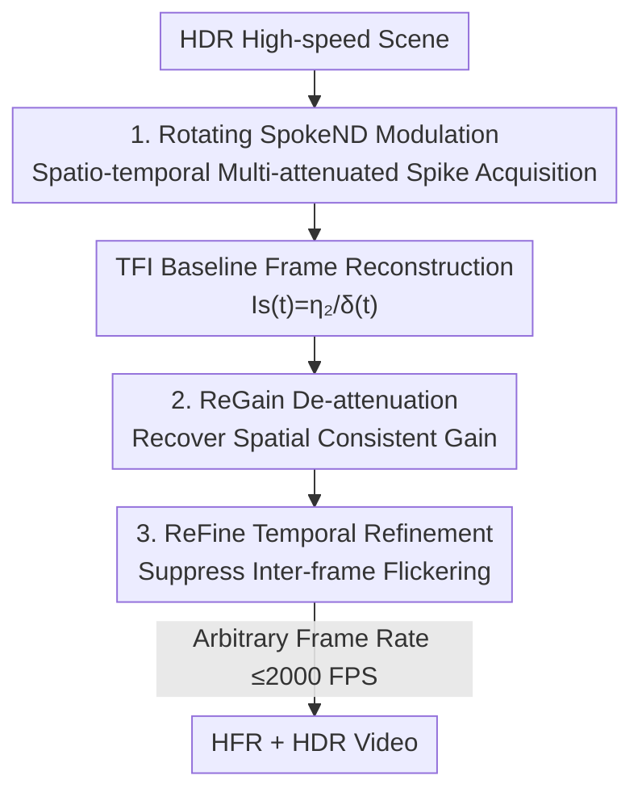

# HFR and HDR Video from Multi-Attenuated Spikes Using a Rapidly Rotating SpokeND Filter

**Conference**: CVPR 2026  
**Paper**: [CVF Open Access](https://openaccess.thecvf.com/content/CVPR2026/html/Chang_HFR_and_HDR_Video_from_Multi-Attenuated_Spikes_Using_a_Rapidly_CVPR_2026_paper.html)  
**Code**: None  
**Area**: Image Restoration / Video Reconstruction  
**Keywords**: Spike Camera, HDR Video Reconstruction, High Frame Rate, SpokeND Filter, Multi-attenuated Modulation  

## TL;DR
A rapidly rotating spoke-patterned neutral density filter (SpokeND) is placed in front of a spike camera, allowing each pixel to periodically sample light intensity at multiple attenuation levels. A two-stage ReST-Net (ReGain for spatial de-attenuation + ReFine for temporal flicker suppression) is then used to reconstruct high frame rate (HFR, up to 2000 FPS) and high dynamic range (HDR) video from these "multi-attenuated spikes."

## Background & Motivation

**Background**: Capturing scenes with both "high dynamic range" and "high-speed motion" is challenging for conventional cameras. Traditional HDR video methods rely on alternating-exposure multi-frame fusion, which sacrifices temporal resolution and leads to motion ghosting or frame rates dropping to 20–60 FPS in high-speed scenarios. Neuromorphic spike cameras offer a natural advantage: each pixel is an independent photon accumulator with a temporal resolution of up to 20,000 Hz and single-bit data, operating without a global shutter.

**Limitations of Prior Work**: To reconstruct usable images, spike cameras aggregate spikes within a temporal window—longer windows improve dynamic range but cause blur under high-speed motion. To enhance HDR in short windows, existing approaches either modify internal sensor hardware (adjusting quantization bits [2] or trigger thresholds [51]), requiring hardware redesign where thresholds cannot be switched in real-time; or perform optical modulation (fixed spatial masks) [29,32,33]. However, fixed filter positions mean **each pixel only sees one fixed attenuation level**, forcing the reconstruction of HDR to rely on spatial upsampling/interpolation, which degrades spatial resolution. Attempting to rotate filters to provide multiple attenuation levels to each pixel is hindered by the low frame rates of traditional digital cameras (LCD attenuators at 30 FPS [31], multi-sensor systems at 35 FPS [39]), which cannot capture high-speed motion.

**Key Challenge**: A small trigger threshold increases low-light sensitivity (lowering measurable $I_{min}$), but causes the pixel to saturate easily in bright regions (lowering measurable $I_{max}$). Sensitivity and saturation resistance are mutually exclusive under a single fixed configuration; single-level sampling cannot capture the full dynamic range of real-world scenes.

**Key Insight**: The ultra-high temporal resolution of spike cameras can be leveraged not just for high-speed imaging, but also to accommodate rapid optical modulation in the temporal dimension. By rapidly rotating a spatial attenuation filter, each pixel can be exposed to multiple attenuation levels in sequence within an extremely short duration. Spatial modulation is transformed into "spatio-temporal joint modulation" via the time dimension, allowing a single sensor to obtain information equivalent to multi-exposure imaging.

**Core Idea**: Use a rapidly rotating multi-level hollowed-out ND filter to encode "multi-exposure" into the temporal dimension. This allows a single spike camera to acquire multi-attenuated spikes, followed by a neural network to resolve spatial attenuation differences and temporal fluctuations simultaneously to reconstruct HFR + HDR video.

## Method

### Overall Architecture
The method addresses how a single spike camera can simultaneously achieve HDR and high frame rate in high-speed scenes. It consists of an acquisition stage and a reconstruction stage. In the acquisition stage, a rotating SpokeND filter is placed before the camera, enabling each pixel to periodically receive light at three attenuation levels (92% / 75% / 0%). Combined with the camera's high temporal resolution, a "multi-attenuated spike" stream is produced. The reconstruction stage is a two-stage network, ReST-Net: first, TFI is used for baseline frame reconstruction; then, ReGain restores multi-attenuated frames back to spatially consistent "unattenuated" frames; finally, ReFine suppresses temporal flickering between adjacent frames to output HFR + HDR video at arbitrary target frame rates (up to 2000 FPS), following a coarse-to-fine approach.

Spike generation mechanism: A pixel continuously accumulates photo-generated electrons. Once the accumulated voltage $V(t)$ reaches a threshold $V_{th}$, a spike '1' is read out and the voltage is reset; otherwise, a '0' is read out by default at a fixed interval $\tau$:

$$S(t) = \begin{cases} 1, & V(t) \ge V_{th} \\ 0, & \text{otherwise} \end{cases}$$

Aggregating spikes within a window of $N$ sampling intervals yields the reconstructed intensity $I_s(t) = \eta_1 \sum_{i\in[0,N-1]} S(t+i\tau)$, with dynamic range $DR = 20\log(I_{max}/I_{min})$. While larger $N$ increases DR, it causes blur in high-speed scenes. Thus, the authors use a small $V_{th}$ for sensitivity and rely on multi-attenuation to recover the compressed $I_{max}$.

### Key Designs

**1. Rotating SpokeND Filter: Encoding Multi-exposure into Time**

To solve the issue where fixed filters limit each pixel to a single attenuation level, the authors designed a spoke-shaped neutral density filter where each spoke corresponds to an attenuation level. It meets three requirements: (1) **Multi-level Attenuation**—referencing traditional multi-exposure HDR, three transmittance levels of 92% / 75% / 0% are set (higher percentages indicate more light attenuation ⚠️ as stated in the text; material absorption is ignored at 0%); (2) **High-frequency Periodicity**—attenuation zones are distributed symmetrically around the rotation center for spatial balance, with the pattern repeated over four cycles to achieve a 7200 CPM (cycles per minute) modulation frequency at 1800 RPM, significantly refining modulation granularity; (3) **Lightweight and Stable**—manufactured using optical resin. The hardware platform mounts the camera and filter on an optical breadboard, supported by ceramic bearings and gears driven by a high-speed motor at 1800 RPM. The key is that the 20,000 Hz sampling is much faster than the filter rotation, allowing precise capture of spikes at corresponding attenuation levels as spokes sweep over pixels—high attenuation prevents saturation in highlights while low attenuation maintains sensitivity in shadows.

**2. ReGain Module: Recovering Spatially Consistent "Unattenuated" Gain**

The rotation introduces spatial variation within a single frame where different pixels receive different attenuations. Furthermore, the relationship between multi-attenuated and unattenuated spikes is **nonlinear**—0% attenuation zones saturate under high light, causing the spike density to lose linearity with photon count, while 92% zones might not trigger any spikes. Neither can be solved via direct analytical inversion. ReGain leverages temporal redundancy: even if a pixel is saturated or silent at time $t$, there are likely spikes with appropriate intensity in its temporal neighborhood. Thus, ReGain takes $2K+1$ temporally adjacent multi-attenuated frames $\{I_s(t+k\cdot\Delta_g)\,|\,k\in[-K,K]\}$ with interval $\Delta_g$ as input to learn the mapping to a spatially consistent gain relative to unattenuated conditions. Before this, TFI (instead of TFW) is used for baseline reconstruction—TFW is sensitive to window size and prone to blur, while TFI uses the inter-spike interval $\delta(t)$ to estimate intensity $I_s(t)=\eta_2/\delta(t)$, which is more robust to motion. The architecture is a U-Net encoder-decoder with self-attention blocks to expand the receptive field and enhance spatial context modeling, outputting the unattenuated frame $I_g(t)$.

**3. ReFine Module: Suppressing Temporal Flickering and HFR Output**

While ReGain ensures spatial consistency, independent frame processing leaves inter-frame flickering. ReFine refines the video in the temporal dimension and decouples the output frame rate (up to 2000 FPS). It concatenates the current ReGain output $I_g(t)$ with the previous frame $I_g(t-\Delta_f)$ (where $\Delta_f$ is the target interval) as input. The previous frame provides "consistency-aware" guidance to stabilize the sequence and reduce flickering, yielding the refined frame $I_f(t)$. The architecture is also U-Net + self-attention. This design, using $\Delta_f$ as an adjustable interval, allows the network to output at any target frame rate, achieving HFR + HDR for high-speed motion.

### Loss & Training
The two modules are supervised separately. The ground truth $G_g(t)$ for ReGain is obtained by applying TFI reconstruction ($I_s=\eta_2/\delta$) to synthesized **unattenuated spikes**. The loss is a weighted sum of pixel-wise $\ell_1$ and $\ell_2$: $L_g = \alpha_1 L_1 + \alpha_2 L_2$. The ground truth $G_f(t)$ for ReFine is the original HDR video frame. Its loss includes $\ell_1$, $\ell_2$, and a **temporal consistency loss**: $L_f = \beta_1 L_1 + \beta_2 L_2 + \beta_3 L_{temp}$, where $L_{temp} = \ell_2\big(I_f(t)-I_f(t-\Delta_f),\; G_f(t)-G_f(t-\Delta_f)\big)$. This constrains the predicted adjacent frame difference to match the ground truth difference, directly targeting flickering. Training data is synthesized via a custom simulator: applying constant rotation to a simulated SpokeND filter, performing element-wise multiplication for light transmission, and generating spikes via an integrate-and-fire mechanism. The synthetic set comprises 285 groups (235 training / 50 testing), with HDR ground truth from Chang et al. [1] and Su et al. [37]. 100 real-world sequences (80 indoor / 20 outdoor) were captured, but since unattenuated ground truth cannot be obtained for high-speed scenes, they are used for subjective evaluation only.

## Key Experimental Results

The method is compared against TFW (temporal window aggregation, TFW-$N$ denotes window length $N$) and TFI (inter-spike interval estimation). As the first framework using multi-attenuated spikes for HFR + HDR, the authors note that baselines were designed for unattenuated spikes, making the comparison somewhat unfair but necessary.

### Main Results (Synthetic Data, Table 1)

| Method | PSNR↑ | SSIM↑ | HDR-VDP3↑ | HDR-VQM↓ |
|--------|-------|-------|-----------|----------|
| TFW-10 | 13.47 | 0.217 | 2.858 | 1.530 |
| TFW-70 | 22.16 | 0.541 | 4.508 | 0.797 |
| TFW-200| 29.05 | 0.742 | 6.313 | 0.289 |
| TFI    | 21.75 | 0.645 | 4.804 | 0.736 |
| **Ours (ReST-Net)** | **34.27** | **0.916** | **7.501** | **0.152** |

Ours leads across all four metrics: compared to the strongest baseline TFW-200, PSNR improves by ~5.2 dB (29.05→34.27) and SSIM by 0.742→0.916. Qualitatively, TFI/TFW-10 lose details in bright areas (sky, roads) due to 0% attenuation saturation and show spatial inconsistency. TFW-200 gains consistency through temporal averaging but suffers severe ghosting on moving objects (e.g., cars); Ours recovers details in saturated zones without motion blur.

### Ablation Study (Synthetic Data, Table 1)

| Configuration | PSNR↑ | SSIM↑ | HDR-VDP3↑ | HDR-VQM↓ | Description |
|---------------|-------|-------|-----------|----------|-------------|
| Full Model    | 34.27 | 0.916 | 7.501 | 0.152 | ReGain + ReFine |
| w/o ReGain    | 21.89 | 0.789 | 4.859 | 0.724 | Spatial consistency crashes |
| w/o ReFine    | 31.48 | 0.900 | 7.173 | 0.166 | Temporal noise suppression weakens |

Both modules contribute, but **ReGain is the primary driver**: removing it drops PSNR from 34.27 to 21.89 (−12.4 dB), as the lack of de-attenuation fails to correct persistent spatial variation. Removing ReFine drops PSNR to 31.48 (−2.8 dB), showing weakened noise suppression and consistency. This aligns with the "ReGain for space, ReFine for time" division.

### Key Findings
- **De-attenuation (Spatial) outweighs De-flickering (Temporal)**: The performance drop from missing ReGain is ~4x larger than for ReFine, proving that the core difficulty of multi-attenuated spikes is recovering the nonlinear spatial gain variation.
- **Decoupling Frame Rate and Dynamic Range**: ReFine outputs at arbitrary frame rates by adjusting $\Delta_f$, enabling up to 2000 FPS without being bound to acquisition settings.
- **Predictable Decay with Motion Speed**: Increasing motion speed in synthesis leads to a smooth decline (PSNR=29.91 at 2x speed, 26.35 at 3x speed), reflecting the theoretical upper bound of the method.
- **Zero-shot Synthetic-to-Real Transfer**: Although placing the filter before the lens introduces defocus and attenuation deviations, the model trained on synthetic data generalizes to real-world data to reconstruct high-quality HDR video without retraining.

## Highlights & Insights
- **Rotating Spatial Modulation into Spatio-temporal Modulation**: While fixed masks limit each pixel to one attenuation level, rotation allows a pixel to experience multiple levels over time. The key is the 20,000 Hz spike sampling being much faster than the 1800 RPM rotation, allowing precise "time-slicing" of spikes at each level. This "temporal resolution for optical modulation bandwidth" trade-off is applicable to other high-speed modulation tasks.
- **Clean Task Decomposition**: Dividing spatial inconsistency (ReGain) and temporal flicker (ReFine) is a convincing modular design, validated by ablation.
- **Target-oriented Temporal Loss**: $L_{temp}$ constrains the "difference between adjacent frames" rather than single frames, directly addressing the flickering phenomenon inherent in HFR video.
- **HW/SW Co-design System**: Complete engineering cycle including custom SpokeND filters (resin, 4-cycle, ceramic bearings, motor), a simulator, and 100 real datasets.

## Limitations & Future Work
- **Motion Speed Ceiling**: Performance drops smoothly as speed increases, as acknowledged by the authors, representing a sampling competition between rotation frequency and scene motion.
- **Lens-side Defocus**: Placing SpokeND before the lens causes focal plane deviations and imperfect attenuation levels. Placing the filter behind the lens (closer to the sensor) is suggested for future work but requires complex hardware integration.
- **Lack of Quantitative Real-world Evaluation**: Since ground truth cannot be captured for high-speed HDR scenes, real-world evaluation remains subjective.
- **Empirical Parameters**: Attenuation levels (92%/75%/0%) and the 4-cycle design are empirical; optimizing these for different scenes or dynamic ranges was not explored. ⚠️ Refer to original text for specific transmittance definitions.

## Related Work & Insights
- **vs. TFW / TFI (Spike Baselines)**: TFW suffers from the HDR-blur trade-off; TFI is robust to motion but limited by single-level sampling. Ours introduces multi-attenuation at acquisition and resolves it via nonlinear gain recovery.
- **vs. Quantization/Threshold Modulation [2,51]**: Those require sensor-level modification and lack real-time adaptability; Ours uses an external optical path, which is more flexible.
- **vs. Fixed Spatial Masks [29,32,33]**: Fixed masks sacrifice spatial resolution; rotating masks preserve it by leveraging the time dimension.
- **vs. LCD Attenuators [31] / Multi-sensor Systems [39]**: These are limited to 30/35 FPS; spike-based modulation pushes equivalent frequency to 7200 CPM and reconstruction to 2000 FPS.
- **vs. Spike-RGB Hybrid Systems [1]**: Hybrids require precise synchronization and beam splitters (increasing size); Ours is a compact single-sensor system.

## Rating
- Novelty: ⭐⭐⭐⭐⭐ First framework to encode multi-exposure into time via rotating SpokeND for a spike camera.
- Experimental Thoroughness: ⭐⭐⭐⭐ Extensive synthetic metrics and ablation, though real-world data lacks objective metrics.
- Writing Quality: ⭐⭐⭐⭐ Clear motivation and modular explanation; some hardware details are concise.
- Value: ⭐⭐⭐⭐⭐ Provides a practical single-sensor route for "High-speed + HDR" with transferable spatio-temporal modulation concepts.

<!-- RELATED:START -->

## Related Papers

- [\[CVPR 2026\] LRHDR: Learning Representation-enhanced HDR Video Reconstruction](lrhdr_learning_representation-enhanced_hdr_video_reconstruction.md)
- [\[ICLR 2026\] DeAltHDR: Learning HDR Video Reconstruction from Degraded Alternating Exposure Sequences](../../ICLR2026/image_restoration/dealthdr_learning_hdr_video_reconstruction_from_degraded_alternating_exposure_se.md)
- [\[CVPR 2026\] ExpoCM: Exposure-Aware One-Step Generative Single-Image HDR Reconstruction](expocm_exposure-aware_one-step_generative_single-image_hdr_reconstruction.md)
- [\[CVPR 2026\] Gyro-based Deep Video Deblurring](gyro-based_deep_video_deblurring.md)
- [\[CVPR 2026\] ShreddingNet: Coarse-to-Fine Restoration for Multi-Source Shredded Manuscripts](shreddingnet_coarse-to-fine_restoration_for_multi-source_shredded_manuscripts.md)

<!-- RELATED:END -->
