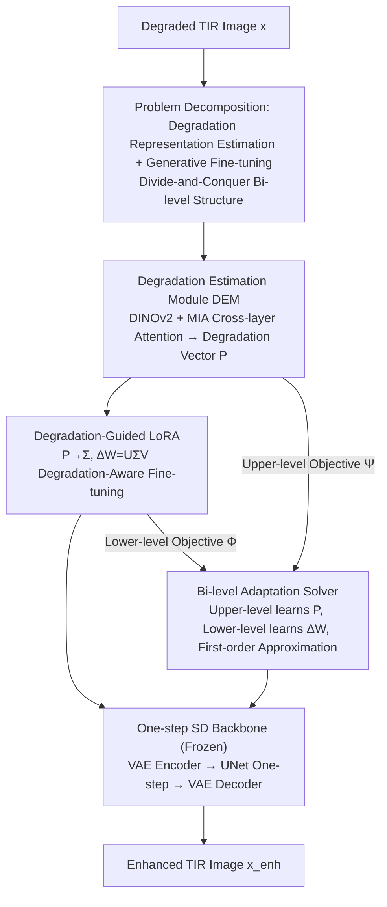

# HiDRA: Hierarchical Degradation Representation and Adaptation with Generative Priors for Enhancing Infrared Vision

**Conference**: CVPR 2026  
**Paper**: [CVF Open Access](https://openaccess.thecvf.com/content/CVPR2026/html/Chen_HiDRA_Hierarchical_Degradation_Representation_and_Adaptation_with_Generative_Priors_for_CVPR_2026_paper.html)  
**Code**: https://github.com/ZihangChen/HiDRA  
**Area**: Image Restoration / Thermal Infrared Enhancement  
**Keywords**: Thermal infrared enhancement, degradation representation, generative priors, LoRA fine-tuning, bi-level optimization  

## TL;DR
HiDRA decomposes thermal infrared (TIR) image enhancement into a bi-level task consisting of "degradation representation estimation + generative model fine-tuning". Specifically, a degradation estimation module (DEM) extracts TIR-specific degradation vectors from degraded images, which are then used to modulate the LoRA parameters of a one-step Stable Diffusion model. The system is jointly trained across multiple degradation levels using bi-level optimization, significantly outperforming existing State-of-the-Art (SOTA) methods on FPN noise correction, blind super-resolution, composite degradations, and real-world cross-device degradations.

## Background & Motivation

**Background**: Thermal infrared (TIR) imaging senses thermal radiation emitted by objects, enabling robust detection of salient targets under adverse weather and extreme lighting conditions. Thus, it serves as a crucial sensor for multi-modal perception, autonomous driving, and search-and-rescue operations. However, due to limitations in optical systems, materials, temperature, and reflection, TIR images suffer from complex and dynamic composite degradations, including fixed-pattern noise (FPN), low resolution, blurry textures, and low contrast. Traditional methods (e.g., histogram equalization, adaptive filtering, wavelet transform) require manual parameter tuning and incur high computational costs, while deep-learning-based methods are mostly designed for single degradations (e.g., denoising or super-resolution).

**Limitations of Prior Work**: To handle composite degradations, existing comprehensive frameworks (such as DEAL and PPFN) remain inherently **deterministic regression models**, making it difficult to characterize the complex, uncertain, and cross-level variations of TIR degradation distributions. On the other hand, pre-trained diffusion models (e.g., Stable Diffusion) exhibit strong detail-restoration capabilities in low-level visible-light vision due to large-scale pre-training. However, **directly applying them to TIR leads to poor performance**: TIR differs significantly from visible light in color space, intensity distribution, and texture, while naive LoRA fine-tuning easily overfits the training distribution, resulting in poor generalizability.

**Key Challenge**: Generative priors are powerful but originate from the visible-light domain, whereas TIR degradations are complex and vary drastically across different scenarios. A mechanism to **perceive specific degradations and adaptively modulate the generative model accordingly** is lacking—fixed, low-rank LoRA parameters cannot cover the entire spectrum of TIR degradations.

**Goal**: To allow the fine-tuning process to 'know' what the current image degradation looks like while preserving the pre-trained diffusion generative prior, thereby maintaining robustness across various degradation levels.

**Key Insight**: Adopting a "divide-and-conquer" approach—explicitly decomposing the enhancement problem into upper-level degradation representation estimation and lower-level degradation-conditioned fine-tuning. These two levels are coupled via bi-level optimization, enabling degradation estimation to guide (rather than replace) the update direction of LoRA.

**Core Idea**: To use the degradation vector $P$ estimated by the DEM to generate a dynamic modulation matrix $\Sigma$ inserted into LoRA, rendering $\Delta W = U\Sigma V$ "degradation-aware". Bi-level optimization is then employed to train across various degradation samples, yielding discriminative representations that distinguish degradation types and levels.

## Method

### Overall Architecture
The backbone of HiDRA is a **one-step Stable Diffusion** (SD Turbo) model: the degraded image $x$ is encoded into the latent space $z_x$ via a VAE, the UNet $\epsilon_W$ performs a single-step sampling to obtain the enhanced latent variable $z_{enh} = \frac{z_x - \sqrt{1-a}\,\epsilon_W(z_x)}{\sqrt{a}}$, and the enhanced image $x_{enh}$ is decoded by the VAE. The entire backbone is frozen, with adaptation capabilities injected solely through LoRA.

Crucially, this backbone is "wrapped" in two components: (1) a **degradation estimation module DEM** (denoted as $N_G$ with parameters $\omega$) that infers the latent degradation vector $P$ from the degraded image; (2) this vector $P$ **modulates LoRA** (denoted as increment $\Delta W$) so that the fine-tuning direction adapts to different degradations. The two levels are coupled via bi-level optimization, where the upper level learns degradation representations and the lower level learns enhancement fine-tuning. The overall objective is formulated as:

$$\min_\omega \Psi\big(u,\, N_E(x;\Delta W^*(N_G(x;\omega)));\, D_{val}\big),\quad \text{s.t.}\ \Delta W^* = \arg\min_{\Delta W}\Phi\big(u,\, N_E(x;\Delta W(P));\, D_{tr}\big)$$

where $N_E$ is the frozen generative backbone, and $\Phi/\Psi$ are training/validation objectives. Note that "training/validation" here refers to the roles of the lower/upper levels in the bi-level optimization, not data splitting—both are constructed from the training set under different degradation settings.

### Key Designs

**1. Decomposing Enhancement into a Bi-level Framework of Degradation Representation Estimation and Generative Fine-tuning: Letting the Fine-tuning "Know" the Degradation Pattern**

Existing comprehensive frameworks are built on deterministic regression, where a single network directly maps degraded images to enhanced images without explicitly modeling "what the current degradation is". Addressing this, HiDRA adopts a divide-and-conquer approach, formulating the problem as a bi-level optimization. The upper level $N_G$ (DEM) learns degradation representations under the validation objective $\Psi$, while the lower-level $\Delta W$ (LoRA) conducts degradation-conditioned fine-tuning under the training objective $\Phi$. The learned degradation latent space dynamically guides the lower-level fine-tuning, forcing LoRA parameter tuning to adapt within the degradation manifold. This suppresses overfitting to the training distribution and improves adaptability to shifting degradations. Unlike works that freeze the degradation estimator in the visible-light domain, HiDRA **jointly optimizes** the degradation estimation and the foundation model within a unified decomposition framework, enabling mutual calibration.

**2. Degradation Estimation Module (DEM) and Mutual Interaction Attention: Inferring TIR Degradation Vectors from a Single Image**

TIR degradations are composite and dynamic, making direct modeling highly challenging. DEM leverages the robust feature extraction capabilities of DINOv2 to obtain generalizable degradation representations, then employs **Mutual Interaction Attention (MIA)** to aggregate fine-grained cross-layer information. Given $L$-layer features $f_i\in\mathbb{R}^{C\times H\times W}$ from the backbone, they are stacked as $F=\text{Stack}(f_i)\in\mathbb{R}^{L\times C\times H\times W}$ and reshaped into $F\in\mathbb{R}^{(LC)\times H\times W}$ to enable dense cross-layer interactions while preserving spatial resolution. Through three sets of convolutional mappings $W_Q,W_K,W_V$, layer-wise queries, keys, and values are generated: $F_Q\in\mathbb{R}^{L\times(CHW)}$, $F_K\in\mathbb{R}^{(CHW)\times L}$, and $F_V\in\mathbb{R}^{L\times(CHW)}$. Then, **layer-wise self-attention** is computed:

$$F' = W_O\cdot \text{Softmax}(F_Q F_K)\cdot F_V + F$$

The resulting attention map has a shape of $L\times L$, which models interactions "across different layers" instead of spatial locations, capturing degradation statistics across multiple scales. Finally, an output head (global average pooling + two-layer MLP) yields the degradation vector $P=\text{Head}(F')$. This vector serves as the key to modulating LoRA, providing the conditional 'what the degradation is' information that naive LoRA lacks.

**3. Degradation-Guided LoRA: Generating Dynamic Modulation Matrix $\Sigma$ via Degradation Vectors to Redirect $\Delta W$**

Naive LoRA formulates weight updates as $W' = W + \Delta W = W + UV$, where $U\in\mathbb{R}^{d\times r}$ and $V\in\mathbb{R}^{r\times k}$ are fixed low-rank matrices. However, fixed low-rank parameters cannot adaptively cover the entire spectrum of TIR degradations. HiDRA introduces a **dynamic parameter matrix $\Sigma\in\mathbb{R}^{r\times r}$** in between, computed from the degradation vector $P$ via a two-layer MLP:

$$W' = W + \Delta W = W + U\Sigma V$$

Since $\Sigma$ encodes the degradation information estimated by the DEM, it ensures that the update direction of $\Delta W$ is degradation-aware. Under different degradations, the same set of $U,V$ is modulated by varying $\Sigma$ to yield highly customized effective updates. This essentially allows LoRA to "customize its response per degradation scenario". It establishes a seamless pipeline connecting degradation estimation and parameter adaptation: predicting degradation $\rightarrow$ modulating update direction $\rightarrow$ targeted enhancement.

**4. Bi-level Adaptation Solver and First-order Approximation: Stable Training Across Diverse Degradation Samplings**

In the bi-level formulation, the lower-level $\Delta W$ is optimized on the training set $D_{tr}$ (where clean TIR images are randomly degraded to improve generalizability), while the upper-level $N_G$ is optimized on $D_{val}$. Each sample in $D_{val}$ contains $M$ degradation pipelines with varied degradation types and intensities, forcing $N_G$ to model the degradation **distribution** rather than memorizing single-instance features. However, directly alternating optimization of equations (1) and (2) is unstable. Thus, a **first-order approximation** is introduced. In the training phase, $T$ steps of gradient descent are first performed to approximate $\Delta W^*$:

$$\Delta W^{(t)} = \Delta W^{(t-1)} - \nabla_{\Delta W}\Phi(u;\Delta W^{(t-1)}(P))$$

The upper-level gradient $G_\Psi$ contains direct and nested terms (representing the implicit coupling between the DEM and the fine-tuned network). An implicit first-order approximation simplifies higher-order computations into ratio forms depending solely on first-order gradients, which are then updated multiple times within a single loop (detailed in Alg. 1). This allows the otherwise intractable bi-level problem to be solved efficiently and stably.

### Loss & Training
The lower and upper objectives $\Phi$ and $\Psi$ share the same loss components: pixel-level $\ell_2$ loss, perceptual loss, and adversarial loss, weighted at 2, 5, and 0.5, respectively. Training is conducted on the HM-TIR dataset (1,503 TIR images) based on SD Turbo using a single A800 GPU. The Adam optimizer is used ($\beta_1{=}0.9, \beta_2{=}0.999$) with a learning rate of $2\times10^{-5}$, batch size of 2, random $512\times512$ cropping, and horizontal flipping, for a total of 30k steps. The encoder and UNet are fine-tuned using LoRA (rank 16 / 32) while the decoder is frozen and no text captions are used. The DEM employs a ViT-Base backbone. Hyperparameters are set to $T{=}4$ and $M{=}2$.

## Key Experimental Results

### Main Results
Typical TIR degradation is evaluated across two primary tasks: fixed-pattern noise (FPN) correction and blind super-resolution (Blind SR). HiDRA achieves optimal results across all 5 evaluation metrics:

| Task | Metric | Ours | Best Competitor |
|------|------|------|----------|
| FPN Correction | LPIPS↓ | **0.127** | PPFN 0.159 |
| FPN Correction | DISTS↓ | **0.097** | PPFN 0.147 |
| FPN Correction | FID↓ | **45.08** | PPFN 69.73 |
| FPN Correction | MANIQA↑ | **0.572** | DMRN 0.497 |
| Blind SR | LPIPS↓ | **0.119** | CDFormer 0.207 |
| Blind SR | FID↓ | **36.80** | CDFormer 54.56 |
| Blind SR | MANIQA↑ | **0.556** | DifIISR 0.552 |

Composite degradations are evaluated across four classes: mild, moderate, severe, and extreme. HiDRA exhibits only marginal fluctuations as severity rises, demonstrating far superior robustness compared to alternative methods:

| Degradation Level | Metric | Ours | DifIISR | PPFN |
|----------|------|------|---------|------|
| Mild | LPIPS↓ | **0.160** | 0.298 | 0.371 |
| Moderate | LPIPS↓ | **0.193** | 0.351 | 0.419 |
| Severe | LPIPS↓ | **0.187** | 0.358 | 0.511 |
| Extreme | LPIPS↓ | **0.230** | 0.428 | 0.550 |

For real-world cross-device degradations (TNO / RoadScene / MSRS), evaluated using fusion metrics MI/SCD/VIF/QAB/F, HiDRA achieves optimal or sub-optimal performance across almost all metrics. Specifically, its MI and VIF scores are the highest across all three datasets (e.g., on MSRS: MI 2.4897, SCD 1.5627, VIF 0.6123), outperforming SD-based methods such as DiffBIR, PASD, OSEDiff, and PISA, as well as DEAL and PPFN.

### Ablation Study

| Configuration | Task | LPIPS↓ | MANIQA↑ | Description |
|------|------|---------|---------|------|
| LoRA (w/o DEM) | — | Degraded | Degraded | Removing degradation estimation reduces to naive LoRA (Fig. 6 shows obvious degradation) |
| w/o MIA | — | Degraded | Degraded | Removing cross-layer interaction attention weakens degradation representation |
| Alter. (Alternating Optimization) | FPN | 0.129 | 0.556 | No first-order approximation, alternating upper/lower layers |
| Joint (w/o Upper-level Objective) | FPN | 0.128 | 0.569 | Joint training of DEM and backbone without bi-level optimization |
| Ours | FPN | **0.127** | **0.572** | Full bi-level + first-order approximation |
| Ours | Blind SR | **0.119** | **0.556** | Same as above |

Number of degradation pipelines $M$: Increasing from 2 to 3 consistently improves all metrics (FPN MANIQA 0.553 $\rightarrow$ 0.571). Further increasing to 4 yields unstable performance gains, so a smaller $M$ is chosen for the main experiments due to computational constraints.

### Key Findings
- **Degradation estimation is the core source of performance gain**: Removing the DEM (reducing to naive LoRA) or removing the MIA leads to significant performance drops, indicating that "informing the fine-tuning of the degradation pattern" is more critical than simply adding parameters.
- **Bi-level containing first-order approximation is more stable and effective than alternating/joint optimization**: The Alter. setting achieves only 0.556 on FPN MANIQA and 0.530 on blind SR, which is notably lower than Ours, validating the stability granted by the first-order approximation.
- **Degradation representations are highly discriminative**: t-SNE analysis reveals that without bi-level learning, the DEM fails to separate degradation types and levels, whereas incorporating bi-level optimization yields distinct clusters (Fig. 7), directly explaining the enhanced robustness to varying degradations.
- **Almost no Performance Drop Under Composite Degradations**: Across levels from 'mild' to 'extreme', LPIPS only rises slightly from 0.160 to 0.230, whereas competitors suffer from performance deterioration that is twice as severe.

## Highlights & Insights
- **Degradation vector modulating LoRA ($U\Sigma V$) is highly ingenious**: Without altering the low-rank structure of LoRA, only a small matrix $\Sigma$ computed from the degradation vector is inserted in the middle. This elevates "static adaptation" to "degradation-tailored dynamic adaptation" with minimal parameter overhead. This paradigm can migrate to any PEFT scenario requiring conditionality.
- **Formulating enhancement as bi-level optimization**: The upper level learns 'what the degradation is' while the lower level learns 'how to restore image quality'. Jointly optimizing rather than freezing the degradation estimator realizes the intuition that "degradation estimation and restoration should calibrate each other".
- **MIA computing attention in layer-wise rather than spatial dimensions**: With an attention map shaped as $L\times L$, it specifically consolidates multi-level degradation statistics. This represents a tailored design for the principle that "degradations conform to global statistics rather than local content".
- **Cross-domain adaptation learns the mechanism instead of altering structure**: Utilizing a one-step SD with LoRA preserves the visible-light generative prior, while the degradation-aware mechanism bridges the domain gap, avoiding the need to retrain large foundation models.

## Limitations & Future Work
- **Reliance on a single dataset and synthetic degradations**: Training relies solely on HM-TIR (1,503 images) and synthetically constructed $D_{tr}/D_{val}$ pipelines. Whether actual real-world degradation distributions are fully covered by these synthetic pipelines remains questionable.
- **$M$ is constrained by computational resources**: Ablation studies on $M$ were conducted on $256\times256$ patches, and an $M{=}4$ yielded unstable rewards, indicating limited scalability of the degradation pipeline count.
- **Bi-level optimization overhead**: Each epoch requires $T$ updates to approximate $\Delta W^*$ before updating the upper layer, which incurs higher training costs than single-level frameworks (the paper omits full training time and VRAM comparisons).
- **Performance boundary of one-step SD**: Leveraging SD Turbo's single-step sampling for efficiency may limit the reconstruction performance under extreme degradations compared to multi-step diffusion. Future work could explore trade-offs using few-step sampling.

## Related Work & Insights
- **vs DEAL / PPFN (Comprehensive TIR Enhancement Frameworks)**: These are deterministic regression models that fail to model the complex distributions of TIR composite degradations. HiDRA introduces generative priors and degradation-aware bi-level adaptation, establishing a substantial lead in robustness under composite and extreme degradations.
- **vs Naive LoRA Fine-tuning**: Naive LoRA employs a fixed low-rank update and tends to overfit the visible-light pre-training distribution. HiDRA injects degradation details into the update direction via $\Sigma$, mitigating overfitting and boosting cross-degradation adaptability.
- **vs SD-based Real Super-resolution (DiffBIR/PASD/OSEDiff/PISA)**: These approaches overfit the visible-light prior and introduce artifacts in TIR images. HiDRA adapts directly to TIR characteristics, achieving superior fusion scores under real-world cross-device degradations.
- **vs Works with Frozen Degradation Estimators**: HiDRA jointly optimizes degradation estimation and the base model, enabling them to mutually calibrate rather than operating independently.

## Rating
- Novelty: ⭐⭐⭐⭐ The combination of degradation vector-modulated LoRA + bi-level adaptation is a clean and rare design for TIR image enhancement.
- Experimental Thoroughness: ⭐⭐⭐⭐ Evaluated across typical, composite, and real-world degradations with downstream segmentation; ablation studies include t-SNE analysis and training strategy comparisons.
- Writing Quality: ⭐⭐⭐⭐ The mathematical formulations and bi-level logic are clear, although some approximate derivations are somewhat brief.
- Value: ⭐⭐⭐⭐ Provides a reusable degradation-aware adaptation paradigm for "transferring visible generative priors to infrared vision".

<!-- RELATED:START -->

## Related Papers

- [\[CVPR 2026\] EVLF: Early Vision-Language Fusion for Generative Dataset Distillation](evlf_early_vision-language_fusion_for_generative_dataset_distillation.md)
- [\[CVPR 2026\] Degradation-Consistent Test-Time Adaptation for All-in-One Image Restoration](degradation-consistent_test-time_adaptation_for_all-in-one_image_restoration.md)
- [\[NeurIPS 2025\] Enhancing Infrared Vision: Progressive Prompt Fusion Network and Benchmark](../../NeurIPS2025/image_restoration/enhancing_infrared_vision_progressive_prompt_fusion_network_and_benchmark.md)
- [\[ICLR 2026\] Learning Heterogeneous Degradation Representation for Real-World Super-Resolution](../../ICLR2026/image_restoration/learning_heterogeneous_degradation_representation_for_real-world_super-resolutio.md)
- [\[CVPR 2026\] UDAPose: Unsupervised Domain Adaptation for Low-Light Human Pose Estimation](udapose_unsupervised_domain_adaptation_for_low_light_human_pose_estimation.md)

<!-- RELATED:END -->
