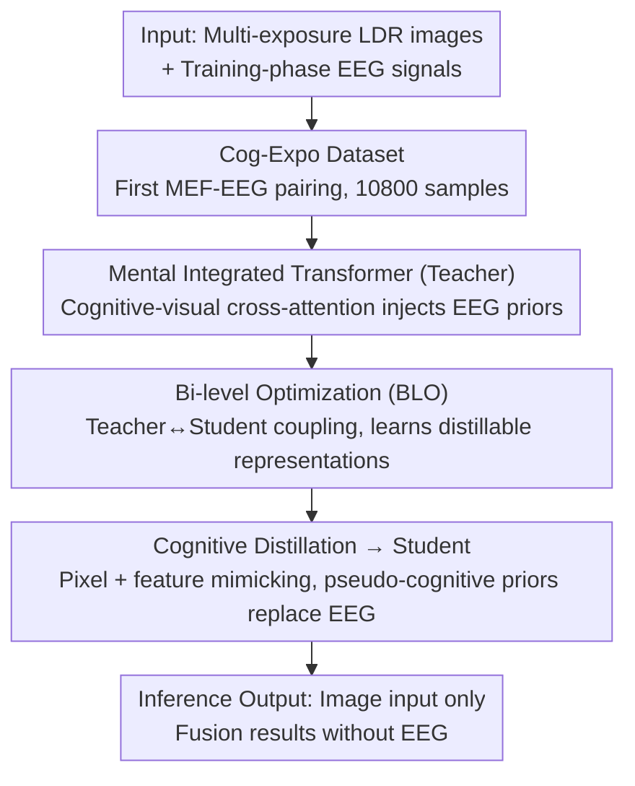

# Human-Centric Multi-Exposure Fusion: Benchmark and Bi-level Cognition Distillation Framework

**Conference**: CVPR 2026  
**Paper**: [CVF Open Access](https://openaccess.thecvf.com/content/CVPR2026/html/Shang_Human-Centric_Multi-Exposure_Fusion_Benchmark_and_Bi-level_Cognition_Distillation_Framework_CVPR_2026_paper.html)  
**Code**: https://github.com/501586528/HC-MEF  
**Area**: Image Restoration / Multi-Exposure Fusion / Low-level Vision / EEG-guided Cognition  
**Keywords**: Multi-Exposure Fusion, EEG, Bi-level Optimization, Knowledge Distillation, Human Perception

## TL;DR
This paper introduces human electroencephalogram (EEG) cognitive signals into multi-exposure fusion (MEF): first by constructing Cog-Expo, the first paired MEF-EEG dataset, and then employing "bi-level optimization" to distill cognitive knowledge from an EEG-guided Teacher to a Student that **only uses images and requires no EEG during inference**, achieving SOTA results on MEF benchmarks with fusion results more aligned with human perception.

## Background & Motivation

**Background**: Multi-exposure fusion (MEF) aims to synthesize multiple low-dynamic-range (LDR) images of the same scene with different exposures into a single high-quality image, with the final goal of being "visually consistent with human perception." Significant progress has been made from handcrafted priors to deep learning (DeepFuse, MEF-GAN, Transformer-based).

**Limitations of Prior Work**: However, the optimization objective for the vast majority of methods is based on **statistical metrics or pixel-level reconstruction loss**, which is convenient for training but fails to capture subjective factors that the human visual system (HVS) truly prioritizes: visual comfort, artifact tolerance, and saliency attention. Consequently, a systematic bias exists between "good metrics" and "what humans perceive as good."

**Key Challenge**: EEG provides an ideal signal for incorporating objective human cognitive feedback as it records brain responses to visual stimuli in milliseconds. However, applying it to low-level vision tasks like MEF faces two hurdles: (1) **Lack of data**—existing EEG-vision datasets target high-level recognition and lack pairings for "exposure variation stimuli"; (2) **Unavailable signals during inference**—EEG can be collected during training, but it is impossible to provide brainwave data for every image during deployment. The core challenge thus becomes: **how to maintain pure image input at inference while using EEG guidance during training**.

**Goal**: To address this in two sub-problems—filling the data gap and designing a "train-with-EEG, infer-without-EEG" framework.

**Key Insight**: The authors observe that ERP components of EEG (such as P300 related to attention/decision-making) carry perceptual preference information, and the brain exhibits over-activation in the occipital lobe towards extreme exposures. This implies that EEG is a **sensitive and modelable** cognitive prior for exposure.

**Core Idea**: Adopting the "privileged information distillation" paradigm—constructing an EEG-guided Teacher and using **bi-level optimization** to force the Teacher to learn "naturally distillable" representations, transferring cognitive guidance to an image-only Student to eliminate dependence on EEG during inference.

## Method

### Overall Architecture
The system consists of "data" and "method" components. The data side is the **Cog-Expo** dataset: 10 subjects viewed underexposed/normal/overexposed stimuli from SICE, with 64-channel 1kHz acquisition, resulting in 10,800 EEG-image samples. The method side formulates the problem as **bi-level optimization (BLO)**: the lower level is an EEG-guided Teacher (Mental Integrated Transformer), and the upper level is a Student using only LDR images. The Teacher injects cognitive tokens into visual features via cross-attention; the Student mimics the Teacher's pixel- and feature-level outputs through **cognitive distillation**, replacing EEG with "pseudo-cognitive priors" derived from the image itself during inference to achieve EEG-free deployment. A key aspect of BLO is explicitly defining the lower-level objective to depend on Student parameters, forcing the Teacher to learn representations that the Student can actually master.

### Key Designs

**1. Cog-Expo: The first EEG cognitive dataset for MEF**

The main challenge was that existing EEG-vision data were all for high-level recognition tasks, lacking exposure-variant stimuli, making it impossible to link EEG with multi-exposure sequences. The authors built Cog-Expo based on the SICE benchmark: each set took three images (most underexposed, most overexposed, and normal) to form a stimulus block, strengthening cognitive responses to extreme exposures. 10 subjects (standard 10-20 system, 64 channels, 1kHz, impedance <18 kΩ) were presented with each image for 1s, with a 0.5s blank screen interval. Every three blocks, a question was inserted ("Is the subject still recognizable under extreme exposure?") to drive active cognition, totaling 10,800 high-quality samples. Preprocessing was deliberately minimal—only EMG/EOG artifact removal and a 50Hz notch filter—to preserve raw neural information as a reliable foundation for data-driven cognitive guidance. Brain response analysis further revealed that extreme exposure triggers over-activation in the right occipital lobe, with activity spreading from the occipital to the parietal/frontal lobes over longer durations. This provides physiological evidence that EEG carries exposure-related perceptual preferences.

**2. Mental Integrated Transformer (Teacher): Injecting cognitive priors via cross-attention**

Raw EEG $E_{\text{raw}}$ is first projected into compact cognitive tokens $E \in \mathbb{R}^D$ via a lightweight 1D-CNN-Transformer hybrid encoder $E_{\text{EEG}}$, then passed through an MLP adapter to obtain cognitive tokens $v^{\text{low}}_{\text{cog}}$ and $v^{\text{over}}_{\text{cog}}$ for underexposure and overexposure. During the encoding stage, each block performs **cross-attention: using visual intermediate features as Query and cognitive tokens as Key/Value**. This dynamically modulates visual features based on the subjects' cognitive responses, emphasizing perceptually salient or visually demanding regions. During decoding, a target cognitive state $v^{\text{GT}}_{\text{cog}}$ (from high-quality reference states) guides reconstruction to align with human preferences. The EEG encoder is not pre-trained separately but integrated end-to-end with the Teacher. Ablations show that replacing cross-attention with simple concatenation leads to a significant performance drop, indicating that cross-attention injection is the key to integrating high-dimensional cognitive priors.

**3. Bi-level Optimization (BLO): Forcing the Teacher to learn "distillable" representations**

Standard two-stage distillation has a drawback: a fixed Teacher might learn representations the Student cannot replicate. This work formulates it as a nested bi-level optimization:

$$\min_{\theta_S}\ \mathcal{L}_{\text{Upper}}(\theta_S,\theta_T^*)\quad \text{s.t.}\quad \theta_T^*=\arg\min_{\theta_T}\mathcal{L}_{\text{Lower}}(\theta_T,\theta_S)$$

The Student (Upper) optimizes $\theta_S$ using only LDR images to approach the optimal Teacher. The Teacher (Lower) optimizes using images + EEG priors, but the **lower-level objective explicitly depends on the Student's current parameters** $\theta_S$. This coupling ensures the Teacher evolves with training, maintaining a representation space that is accessible for the Student. The system uses Alternating Gradient Descent (A-GD). Ablation comparisons show BLO significantly outperforms two-stage and joint training without nesting.

**4. Cognitive Distillation: Transferring EEG knowledge to an image-only Student**

The final step eliminates EEG from inference. Distillation loss transfers privileged knowledge at both pixel and feature levels:

$$\mathcal{L}_{\text{Distill}}=\lVert I^S_F-\text{sg}(I^{T*}_F)\rVert_1+\beta\sum_l\lVert \phi^l_S-\text{sg}(\phi^l_T)\rVert_2^2$$

Where $\text{sg}(\cdot)$ is stop-gradient and $\beta$ is the feature distillation weight. Both networks utilize an L1 reconstruction loss $\mathcal{L}_{\text{recon}}=\lVert I_F-I_{GT}\rVert_1$. To maintain architectural consistency, the Student replaces biological priors with **pseudo-cognitive priors derived directly from the input LDR images** as Key/Value, allowing approximation of cognitive-perceptual guidance using only visual cues during inference.

## Key Experimental Results

Evaluation metrics: For referenced fusion, **PSNR / SSIM / MS-SSIM / CC (↑) / MSE (↓)**; for non-referenced fusion, **BRISQUE (↓) / MUSIQ (↑) / DBCNN (↑) / EN (↑) / Qabf (↑)**. Training on SICE, testing on MEF-LUT and MEFB. Single RTX 4090, AdamW, lr 2e-4, 300K iterations.

### Main Results
Referenced benchmarks (SICE / MEF-LUT):

| Dataset | Metric | Ours | Next Best (HSDS-MEF) | Gain |
|--------|------|------|----------|------|
| SICE | PSNR↑ | 23.764 | 20.568 | +3.9% (Relative) |
| SICE | SSIM↑ | 0.6065 | 0.5593 | Best |
| SICE | MS-SSIM↑ | 0.8203 | 0.7679 | Best |
| MEF-LUT | PSNR↑ | 22.793 | 22.623 | Best |
| MEF-LUT | SSIM↑ | 0.6369 | 0.6033 | +13.8% (Relative) |

Non-referenced benchmark MEFB:

| Method | BRISQUE↓ | MUSIQ↑ | DBCNN↑ | Qabf↑ |
|------|------|------|------|------|
| HSDS-MEF | 20.112 | 66.454 | 0.5977 | 0.6317 |
| AGAL | 21.591 | 66.178 | 0.6082 | 0.6107 |
| **Ours** | **19.492** | **67.310** | **0.6208** | **0.6645** |

### Ablation Study
Stage-wise distillation ablation (SICE):

| Config | Image | Cognition (EEG) | Distillation | PSNR↑ | SSIM↑ |
|------|------|------|------|------|------|
| (1) Baseline Student | ✓ | × | × | 17.900 | 0.5094 |
| (2) Fusion-only (EEG w/o Distill) | ✓ | ✓ | × | 18.980 | 0.5128 |
| Ours (Full Distillation) | ✓ | ✓ | ✓ | 23.764 | 0.6065 |

Optimization strategy and Teacher architecture:

| Ablation Dimension | Config | PSNR↑ | SSIM↑ |
|------|------|------|------|
| Optimization Strategy | Two-stage training | 20.531 | 0.5012 |
| Optimization Strategy | Joint training (no nest) | 22.108 | 0.5539 |
| Optimization Strategy | **Ours (BLO)** | **23.764** | **0.6065** |

### Key Findings
- **Distillation is critical**: Simply injecting EEG (Config 2) only increases PSNR by ~1 dB, while full distillation adds +5.8 dB—using cognitive signals and distilling cognitive knowledge are distinct processes.
- **BLO superiority**: Dynamic coupling allows the Teacher to learn distillable representations, outperforming the static two-stage approach by 3.2 dB.
- **Cross-attention necessity**: Replacing it with concat resulted in a drop (PSNR 23.76 -> 22.89), proving high-dimensional cognitive priors require attention mechanisms for integration.
- **Downstream gains**: On MEFB, depth estimation using fused images produced sharper edges and more geometrically consistent maps, indicating fusion quality benefits structural understanding.

## Highlights & Insights
- **Neuroscience signals in low-level vision**: Using EEG as objective supervision for "human preference" bypasses the gap between statistical metrics and perception.
- **Privileged Information + BLO**: The essence of BLO is "training to be distillable," letting the Teacher proactively adapt to the Student—a logic transferable to tasks with privileged modalities during training.
- **Pseudo-cognitive priors**: This allows the Student to reuse the cross-attention structure without brainwaves, acting as a practical engineering method to replace "privileged signals" with "self-generated proxies."

## Limitations & Future Work
- **Data scale and subjects**: Only 10 subjects and SICE-derived stimuli. The age group is concentrated (mean 22.3), so consistency of cognitive preferences across diverse populations needs verification.
- **EEG noise and individual differences**: Brainwaves are noisy. Whether pseudo-cognitive priors can stably approximate real EEG guidance in complex scenarios is not fully tested.
- **Reference-dependent training**: Main training uses reference images. Robustness under extreme motion misalignment or severe exposure jumping requires further check.
- **Task generalization**: This paper only validates MEF. Transfer costs and effects on other low-level vision tasks remain to be seen.

## Related Work & Insights
- **vs. Traditional/Deep MEF**: Previous methods rely on visual priors and pixel loss, ignoring cognitive cues. Ours introduces EEG supervision, showing clear advantages in perceptual metrics (BRISQUE/MUSIQ).
- **vs. BCI cognitive methods**: Previous works often relied on raw EEG signals during deployment; this work transfers cognitive capability into a pure-vision model, enabling EEG-free inference.
- **vs. Standard Distillation**: A fixed Teacher may learn representations a Student cannot mimic. Coupling T/S via BLO forces the Teacher to learn distillable features.

## Rating
- Novelty: ⭐⭐⭐⭐⭐ 
- Experimental Thoroughness: ⭐⭐⭐⭐ 
- Writing Quality: ⭐⭐⭐⭐ 
- Value: ⭐⭐⭐⭐

<!-- RELATED:START -->

## Related Papers

- [\[CVPR 2026\] BiEvLight: Bi-level Learning of Task-Aware Event Refinement for Low-Light Image Enhancement](bievlight_bi-level_learning_of_task-aware_event_refinement_for_low-light_image_e.md)
- [\[CVPR 2026\] EVLF: Early Vision-Language Fusion for Generative Dataset Distillation](evlf_early_vision-language_fusion_for_generative_dataset_distillation.md)
- [\[CVPR 2026\] UniRain: Unified Image Deraining with RAG-based Dataset Distillation and Multi-objective Reweighted Optimization](unirain_unified_image_deraining_rag_dataset_distillation.md)
- [\[CVPR 2026\] Degradation-Robust Fusion: An Efficient Degradation-Aware Diffusion Framework for Multimodal Image Fusion in Arbitrary Degradation Scenarios](degradation-robust_fusion_an_efficient_degradation-aware_diffusion_framework_for.md)
- [\[CVPR 2026\] Toward Real-world Infrared Image Super-Resolution: A Unified Autoregressive Framework and Benchmark Dataset](real_iisr_infrared_image_super_resolution_autoregressive.md)

<!-- RELATED:END -->
