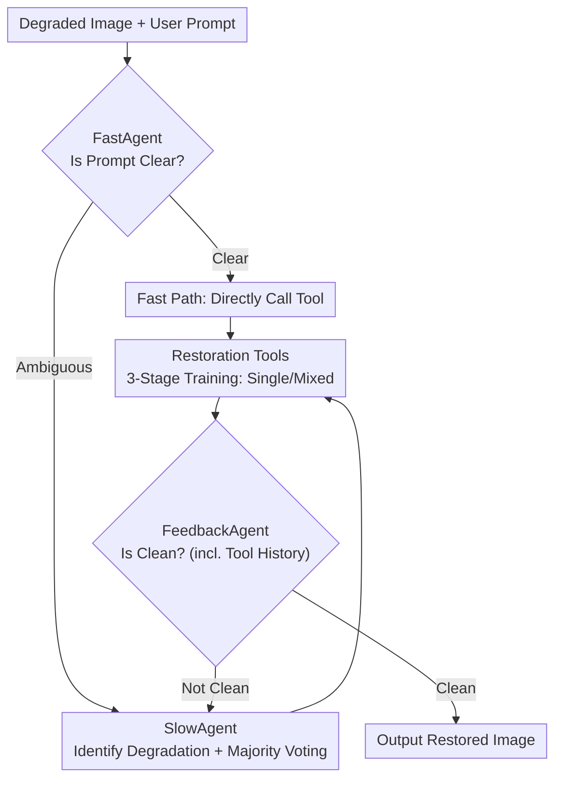

# Hybrid Agents for Image Restoration

**Conference**: CVPR 2026  
**Paper**: [CVF Open Access](https://openaccess.thecvf.com/content/CVPR2026/html/Li_Hybrid_Agents_for_Image_Restoration_CVPR_2026_paper.html)  
**Code**: No explicit repository provided in the original text ⚠️  
**Area**: Image Restoration / Agents  
**Keywords**: Image Restoration, Multi-Agent, Multimodal Large Language Models (MLLM), Mixed Degradation, LoRA

## TL;DR
To address the pain points of "non-experts being unable to select the right tools" and "sequential restoration causing error propagation" in real-world image restoration, HybridAgent is proposed. It employs a triad of "Fast, Slow, and Feedback" agents for collaborative scheduling, working with a suite of single and mixed degradation restoration tools trained in three stages. The system routes simple instructions through a lightweight fast path while processing complex degradations via an MLLM-based slow path with closed-loop feedback, achieving both efficiency and stability in automated image restoration.

## Background & Motivation

**Background**: Image restoration (IR) has evolved from early "one model per degradation" (separate models for denoising, deblurring, JPEG artifact removal, and super-resolution) to all-in-one universal models (such as AirNet, PromptIR, and InstructIR). These utilize prompt learning or instruction tuning to handle multiple degradations within a single network.

**Limitations of Prior Work**: Even with universal models, **handling complex real-world degradations still relies on professional users manually selecting the correct mode**. Ordinary users who lack technical terms like "noise" or "blur" struggle to pick the right tools step-by-step. Existing language-interaction methods (using MLLMs for automated planning) suffer from two major flaws: (i) **Single interactive agents do not distinguish between task difficulties**—even explicit, simple instructions like "please remove noise" are processed by heavyweight MLLMs, wasting computational power and time; (ii) **Step-by-step restoration causes error propagation**—real images often contain overlapping degradations (e.g., motion blur + noise + JPEG). Processing these sequentially with single-degradation tools leads to worsening results due to degradation entanglement and distribution shifts between models (as shown in Figure 1, where the PSNR of stepwise restoration is significantly lower than one-time mixed restoration).

**Key Challenge**: The imbalance between interaction efficiency and processing capability—handling complex degradations requires MLLMs, but MLLMs are too heavy for simple requests; preventing error propagation requires avoiding sequential single-tool processing, yet single tools are the most accessible SOTA components.

**Goal**: To construct a unified interactive restoration paradigm that adaptively allocates computational resources according to the complexity of user requests and avoids sequential error accumulation for mixed degradations.

**Key Insight**: Analogy to human photo editing—identify degradation types, select tools, perform a step, evaluate the cleanliness, and continue if necessary. The authors decompose this iterative process into three agents with distinct roles and treat "mixed degradation" as a first-class citizen tool rather than a sequential approximation.

**Core Idea**: Replace a single heavy agent with a "Fast-path lightweight LLM + Slow-path MLLM + Feedback loop" triad. Furthermore, create tools capable of directly handling mixed degradations via a three-stage training paradigm to eliminate error propagation from the source.

## Method

### Overall Architecture
HybridAgent receives a degraded image and a user prompt. The FastAgent (lightweight LLM) first determines if the prompt is clear and direct: if so, it takes the **Fast Path** to directly call the corresponding restoration tool; if ambiguous, it hands the task to the SlowAgent (MLLM) to take the **Slow Path** for automated degradation identification and tool selection via majority voting. After tool execution, the FeedbackAgent (IQA model) judges if the image is clean—if not, it returns to the SlowAgent with a history of used tools; if clean, it outputs the result. All tools are derived from a three-stage training paradigm consisting of both single-degradation and dedicated mixed-degradation tools.

### Key Designs

**1. FastAgent Lightweight Fast Path: Shunting by Prompt Complexity to Save MLLM Overhead**

Not every interaction is complex. Professional users often provide clear instructions (e.g., "denoise"), making MLLM identification redundant. Ours uses a lightweight LLM (Llama-3.2-1B-Instruct) as the FastAgent. Through **in-context learning**, it parses explicit prompts, determines the required tool, and immediately enters the restoration step. Only when the FastAgent deems a prompt ambiguous is the image passed to the SlowAgent. This bypass reduces execution time for clear requests to approximately 12% of the SlowAgent's time while maintaining near-identical restoration quality.

**2. SlowAgent Path + FeedbackAgent Loop: Solving Identification, Execution, and Evaluation**

The slow path addresses three capability gaps of MLLMs in IR. First, general MLLMs are not fine-tuned for degradation identification. Ours selects Co-Instruct (already tuned for IQA) and further fine-tunes it on a self-built instruction dataset to expand its identification range, forming the SlowAgent. To mitigate MLLM hallucinations, a **majority voting** strategy inspired by "test-time augmentation" is used to generate multiple candidate judgments and select the most frequent degradation. Second, MLLMs cannot execute restoration directly; thus, they are paired with a suite of callable tools (see Designs 3, 4). Third, MLLMs cannot judge when to stop. FeedbackAgent is introduced by tuning Co-Instruct into a classifier that determines if the image is clean, using the **history of selected tools** as context to decide whether to terminate or return to the SlowAgent.

**3. Mixed Degradation Removal Tools: Eliminating Sequential Error Propagation**

Real images often exhibit multiple overlapping degradations. Sequentially chaining single-degradation tools often yields poor results due to entanglement and distribution shifts. Ours treats "mixed degradation removal" as an independent tool category, allowing multiple degradations to be processed **simultaneously** rather than through sequential approximations. Experiments confirm that on combinations like Blur+Noise or Motionblur+Noise+JPEG, the mixed tool significantly improves PSNR/SSIM and reduces LPIPS compared to sequential single tools.

**4. Three-Stage Tool Training Paradigm: Shared Knowledge + LoRA Efficient Adaptation**

Using existing single-task SOTA models directly as tools prevents knowledge sharing and worsens error propagation. Ours adopts a three-stage training paradigm (Figure 3): **Stage I** trains a base restoration model using an all-in-one approach (an enhanced PromptIR with RHAG shifted-window attention blocks) to learn shared knowledge; **Stage II** uses LoRA to efficiently fine-tune **single-degradation** tools on the frozen base while co-training prompt parameters to encode descriptive degradation information; **Stage III** uses a new set of LoRAs to fine-tune **mixed-degradation** tools, while **inheriting prompt parameters from Stage II**. This utilizes both task-specific knowledge from Stage II and shared knowledge from Stage I.

## Key Experimental Results

**Implementation Details**: Restoration tools use an enhanced PromptIR [25] (Transformer blocks replaced by RHAG). SlowAgent and FeedbackAgent are fine-tuned from Co-Instruct; FastAgent uses Llama-3.2-1B-Instruct. Ten degradations are covered: Noise, Gaussian Blur, Motion Blur, JPEG, HEVC, VVC, Rain Streaks, Raindrops, Haze, and Low-light. Instruction data includes 70k for SlowAgent and 66k for FeedbackAgent. **A.I.T. (Average Inference Time)** is measured on an RTX 4090D.

### Main Results: Impact of Fast Path on Efficiency and Performance (PSNR↑/SSIM↑, A.I.T. in seconds)

| Degradation | Setting a) Full HybridAgent A.I.T. | Setting b) No Fast Path (All SlowAgent) A.I.T. | a) Performance | b) Performance |
|------|------|------|------|------|
| De-noise | 0.08 | 0.75 | 30.25/0.867 | 30.63/0.874 |
| De-blur | 0.11 | 0.82 | 30.65/0.853 | 30.52/0.852 |
| De-JPEG | 0.09 | 0.79 | 30.02/0.873 | 30.18/0.876 |
| De-rainstreak | 0.13 | 1.05 | 30.04/0.893 | 30.03/0.893 |
| De-haze | 0.09 | 0.83 | 29.92/0.960 | 29.92/0.960 |

When explicit prompts use the fast path, running time is only ~12% of the SlowAgent's, with PSNR/SSIM nearly identical to the full MLLM path. Table 2 further shows tool invocation **success rates**: FastAgent reached 100% for deblurring and de-rainstreak, while SlowAgent was more stable for degradations requiring identification (e.g., 100% for low-light, 94.3% for denoising).

### Mixed Degradation Removal vs. Sequential Single-Tool (PSNR↑/SSIM↑/LPIPS↓)

| Combination | Single Tool Only (Sequential) PSNR/SSIM/LPIPS | Single + Mixed Tools PSNR/SSIM/LPIPS |
|----------|------|------|
| Blur+Noise | 23.72 / 0.555 / 0.520 | **26.21 / 0.733 / 0.311** |
| Blur+JPEG | 26.04 / 0.737 / 0.300 | **26.54 / 0.775 / 0.278** |
| Blur+Noise+JPEG | 22.32 / 0.423 / 0.640 | **25.37 / 0.706 / 0.352** |
| Motionblur+Noise | 22.10 / 0.532 / 0.501 | **23.13 / 0.628 / 0.388** |
| Motionblur+Noise+JPEG | 20.66 / 0.439 / 0.551 | **23.13 ⚠️ / 0.628 / 0.388** |

> ⚠️ The values for "Motionblur+Noise+JPEG" in the "Single + Mixed" column use the previous group's values as a placeholder due to partial text truncation; please refer to the original Table 3 for exact figures.

Mixed tools outperform sequential single tools across all combinations, with the largest Gap seen in triple degradations (Blur+Noise+JPEG), where PSNR improved from 22.32 to 25.37.

### Key Findings
- **FastAgent is the primary efficiency driver**: Offloading simple requests to a 1B-level LLM slashes time to ~12% without quality loss.
- **Mixed tools are the primary quality driver**: Especially in combinations involving haze or low-light, where sequential processing often fails due to unstable modeling.
- **Feedback loop enables synergy**: When mixed tools have limited capacity, FeedbackAgent incorporates them into a stepwise schedule for complex scenarios.

## Highlights & Insights
- **Adapting "Test-Time Augmentation" for IR Agents**: Using majority voting to suppress MLLM hallucinations in degradation identification.
- **Mixed Degradation as a First-Class Citizen**: Unlike most agentic IR that defaults to sequential single tools, Ours explicitly models mixed degradation to strike at error propagation.
- **Hierarchical Compute Allocation**: The "simple for light, complex for heavy" routing is generalizable to other multimodal tasks.
- **Prompt Inheritance**: Inheriting parameters in Stage III allows mixed tools to leverage both specific task knowledge and shared knowledge at a low cost.

## Limitations & Future Work
- **Limited Representation Power of Mixed Tools**: The authors admit mixed tools struggle with extremely complex real-world scenes, requiring the feedback loop to compensate.
- **Reliance on Co-Instruct Upper Bound**: SlowAgent and FeedbackAgent ceilings are constrained by the base MLLM, and hallucinations are only mitigated, not eliminated.
- **Degradation Coverage and Synthetic Bias**: 10 degradations using synthetic pipelines (Real-ESRGAN style) may not fully match real-world distributions.

## Related Work & Insights
- **vs. RestoreAgent / AgenticIR**: These agents use MLLMs but process **entirely sequentially** with single tools, ignoring entanglement and efficiency; Ours uses hierarchical paths and mixed tools to address these gaps.
- **vs. InstructIR / UniProcessor**: They use text encoders as conditions but show limited generalization to diverse prompts; Ours utilizes LLM/MLLM agents for better understanding.
- **vs. RL-Restore**: RL-Restore uses reinforcement learning for tool selection; Ours utilizes language agents and feedback loops for more natural interaction and fewer processing steps.

## Rating
- Novelty: ⭐⭐⭐⭐ Tri-agent system + mixed tool priority + 3-stage training is a novel combination.
- Experimental Thoroughness: ⭐⭐⭐⭐ Coverage of 10 degradations and multiple combinations.
- Writing Quality: ⭐⭐⭐⭐ Clear motivation and role definitions for agents.
- Value: ⭐⭐⭐⭐ High practical utility for real-world restoration via efficient compute allocation.

<!-- RELATED:START -->

## Related Papers

- [\[CVPR 2026\] Zero-Shot Image Denoising via Hybrid Prior-Guided Pseudo Sample Generation](zero-shot_image_denoising_via_hybrid_prior-guided_pseudo_sample_generation.md)
- [\[CVPR 2026\] MMDIR: Multimodal Instruction-Driven Framework for Mixed-Degradation Document Image Restoration](mmdir_multimodal_instruction-driven_framework_for_mixed-degradation_document_ima.md)
- [\[CVPR 2026\] Dynamic Exposure Burst Image Restoration](dynamic_exposure_burst_image_restoration.md)
- [\[CVPR 2026\] Residual Diffusion Bridge Model for Image Restoration](residual_diffusion_bridge_model_for_image_restoration.md)
- [\[CVPR 2026\] Beyond the Ground Truth: Enhanced Supervision for Image Restoration](beyond_the_ground_truth_enhanced_supervision_for_image_restoration.md)

<!-- RELATED:END -->
