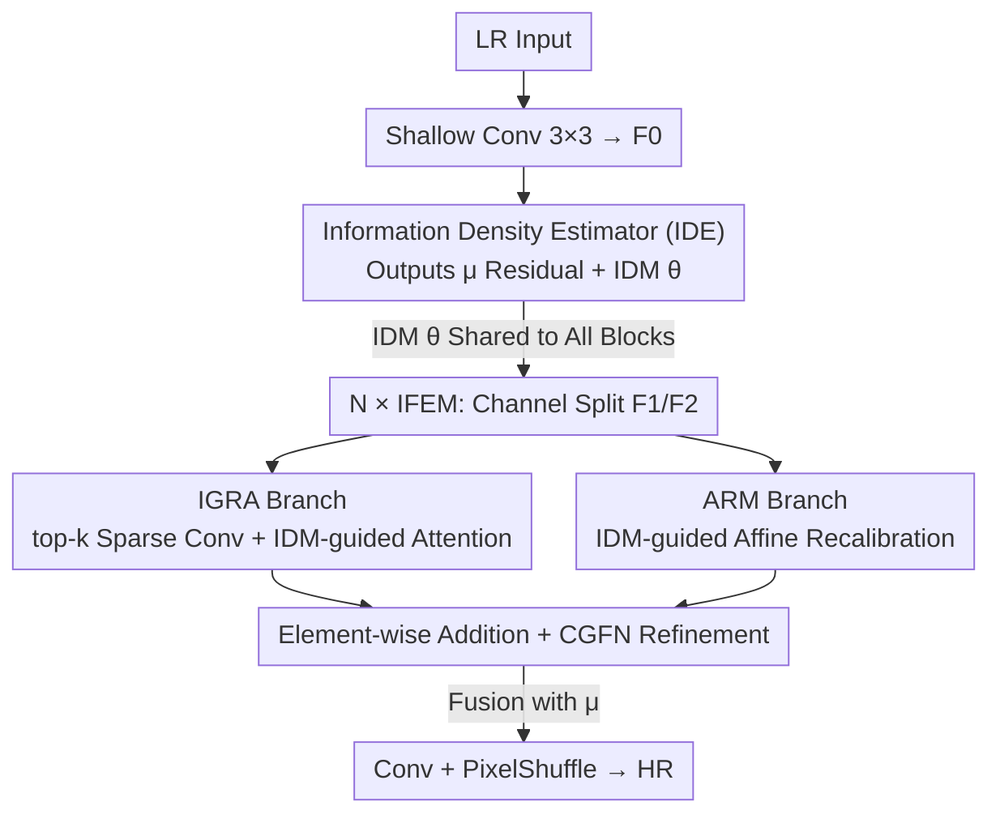

# IAFMNet: Information-Aware Feature Modulation for Efficient Super-Resolution

**Conference**: CVPR 2026  
**Paper**: [CVF Open Access](https://openaccess.thecvf.com/content/CVPR2026/html/Xu_IAFMNet_Information-Aware_Feature_Modulation_for_Efficient_Super-Resolution_CVPR_2026_paper.html)  
**Code**: None (Not provided in the original text)  
**Area**: Image Restoration / Efficient Super-Resolution  
**Keywords**: SISR, Information Density, Sparse Convolution, Adaptive Computation, Affine Modulation  

## TL;DR
IAFMNet quantifies the "uneven information distribution across image regions" into an **Information Density Map (IDM)** using information theory. This IDM drives a dual-branch network featuring sparse convolution and affine modulation, concentrating computational power on "difficult-to-reconstruct, information-dense" areas like textures and edges, achieving superior reconstruction quality with lower FLOPs compared to other efficient SR methods of similar scales.

## Background & Motivation

**Background**: Single Image Super-Resolution (SISR) must balance image quality and computational cost on real-world platforms. To achieve "efficiency," mainstream approaches—whether lightweight CNNs (efficient kernels, expert mining, feature modulation) or lightweight ViTs (window self-attention, semantic token aggregation)—generally follow a **spatially uniform** philosophy, applying identical computation and attention to every pixel or region.

**Limitations of Prior Work**: This "one-size-fits-all" approach ignores the high variance in visual complexity. Downsampling, acting as a low-pass filter, **disproportionately** weakens high-frequency details and edges, which carry the most critical information. The authors confirm using absolute difference maps between Ground Truth (GT) and baseline SR on Urban100 that reconstruction errors are significantly concentrated in complex texture areas, while flat areas have minimal error. Allocating equal computation to flat regions under limited resources is inefficient.

**Key Challenge**: Efficient SR must allocate "fixed computational budgets" to areas where "errors concentrate (difficult regions)." Existing non-uniform computation works (based on empirical PSNR gaps, local gradients, or learned spatial attention) prove the utility of non-uniformity, but their complexity estimates rely on **empirical heuristics or coarse proxy signals**, failing to characterize "reconstruction difficulty" from a principled perspective.

**Goal**: ① Identify a principled, interpretable signal to locate "hard-to-reconstruct regions"; ② Enable the network to tilt both hard hardware resources (computation) and soft modulation (attention) toward these regions.

**Key Insight**: Grounded in information theory, the information content of a signal $x$ is $I(x)=-\log_2 p(x)$—the less predictable and lower the probability, the higher the information content and coding cost. The authors interpret the "rate cost of quantized features" directly as the reconstruction difficulty metric for SISR.

**Core Idea**: An unsupervised **information entropy loss** is used to estimate a pixel-wise Information Density Map (IDM). This IDM simultaneously guides "hard resource allocation (sparse convolution)" and "soft feature modulation (affine recalibration)" to achieve a superior trade-off between performance and computation.

## Method

### Overall Architecture
IAFMNet is a super-resolution pipeline that "estimates density first, then allocates computation accordingly." Given an LR input $y$, a $3\times3$ convolution extracts shallow features $F_0$. These are fed into the **Information Density Estimator (IDE)**, which produces two outputs: a mean map $\mu$ (used as residual features) and the core guidance signal IDM $\theta$. $F_0$ and the shared $\theta$ pass through $N$ **Information-guided Feature Enhancement Blocks (IFEBs)**. Each IFEB contains an IFE Module (IFEM) and a Channel Gated Feed-Forward Network (CGFN) for progressive refinement. The final IFEB output is fused with $\mu$ and processed via lightweight convolution + PixelShuffle upsampling to produce the HR image $\hat{x}$.

The internal IFEM is where the core contribution lies: input features undergo channel expansion and are split into two paths, $F_1$ and $F_2$, which are processed by the IGRA branch (hard resource allocation) and the ARM branch (soft affine modulation), respectively, before being fused via element-wise addition.

### Key Designs

**1. Information Density Map (IDM): Quantifying "Reconstruction Difficulty" via Unsupervised Entropy Loss**

To address the limitation of heuristic proxies like gradients, this work starts from "coding cost equals reconstruction difficulty." For shallow features $F$, differentiable quantization is approximated by injecting uniform noise $\hat{F}=Q(F)=F+U(-\tfrac12,\tfrac12)$. Assuming each quantized element $\hat{F}_i$ follows an independent Gaussian $\mathcal{N}(\mu_i, \theta_i^2)$ via a fully factorized density model, the probability is the integral of the Gaussian over the quantization interval $[\hat{F}_i-\tfrac12, \hat{F}_i+\tfrac12]$, expressed using the standard Gaussian CDF $\Phi$. The coding cost is the negative log-likelihood, summed to form the **Information Entropy Loss**:

$$\mathcal{L}_{IE}=\sum_i R_{\hat{F}_i}=\sum_i -\log_2 p_{\hat{F}_i}(\hat{F}_i\mid \mu_i,\theta_i).$$

Here, $\mu$ and $\theta$ are predicted from $F$ via small modules using convolution and GDN (Generalized Divisive Normalization). Minimizing $\mathcal{L}_{IE}$ forces the network to learn an accurate density model, outputting a spatially varying scale map $\theta$—the IDM. High-frequency textures have low probability in shallow features and high coding costs, thus appearing highlighted in the IDM. Empirical tests show IDM outperforms Sobel/Laplacian operators: while traditional gradients respond only to strong edges (which are often easy to reconstruct), IDM captures low-contrast dense details (hair, cluttered backgrounds), better reflecting true reconstruction difficulty (IDM guidance yields +0.15 dB over Sobel on Urban100).

**2. Information-Guided Resource Allocation (IGRA): Focusing Hard Computation on Top-K% Information Regions**

This branch prevents wasted computation in flat areas. It selects spatial positions with the highest top-$k\%$ information from IDM $\theta$ to generate a binary mask $M=\mathcal{T}(\theta,k)$, resulting in sparse features $F_{sparse}=M\odot F_1$. These are processed using **Submanifold Sparse Convolution (SSC)**. Unlike standard sparse convolution, SSC does **not dilate** active regions; it computes only at masked positions, strictly maintaining the sparsity pattern:

$$F_{ssc}(p)=\begin{cases}\sum_{q\in N(p)}W(q-p)\cdot F_{sparse}(q)+F_1(p), & M(p)=1\\ F_1(p), & \text{otherwise}\end{cases}$$

This skips flat/redundant areas, significantly reducing FLOPs. To compensate for information loss from hard thresholding, the branch adds a **lightweight self-attention also guided by IDM**: $F_{ssc}$ and IDM are downsampled and added, then processed via $1\times1$ convolution and upsampling to generate an attention map $A=\text{Upsample}(\text{Conv}_{1\times1}(F_D+\theta_D))$. The refined output is $F_{refined}=A\odot F_{ssc}$. Ablations show SSConv provides a 0.26 dB gain on Manga109 with only 6 GFLOPs added, with a 5% threshold offering the best efficiency-performance ratio.

**3. Affine Recalibration Module (ARM): Soft Per-Channel Feature Modulation via IDM**

While IGRA handles "hard allocation," ARM provides "soft modulation" by implicitly encoding IDM guidance into features. For $F_2$, a $1\times1$ convolution expands channels before splitting: one half is concatenated with IDM $\theta$ and processed via $1\times1$ convolution to generate modulation parameters $s=\text{Conv}_{1\times1}([\mathcal{S}(\text{Conv}_{1\times1}(F_2))[0],\theta])$; the other half uses Depthwise Convolution (DWConv) to extract local structures $F_{local}$. The local features are then recalibrated: $F_{ARM}=F_{local}\odot s$. While affine recalibration is established in SR, the novelty lies in using the **principled information prior from IDM as guidance**: adding the affine structure improves performance by 0.07 dB, while IDM guidance adds another 0.06 dB with negligible computational cost.

### Loss & Training
The total loss is $L=L_1+\lambda\mathcal{L}_{IE}$, combining standard $L_1$ pixel loss with information entropy loss. Training uses the DF2K dataset (DIV2K+Flickr2K) with bicubic downsampling, $64\times64$ patches, flips/rotations for augmentation, and the Adam optimizer. The learning rate starts at $1\times10^{-3}$ and follows cosine annealing down to $1\times10^{-5}$ over 1,000,000 iterations using two RTX 4090s. $\lambda=10^{-4}$ was determined optimal through ablation.

## Key Experimental Results

### Main Results
Trained on DF2K and evaluated on Set5, Set14, BSD100, Urban100, and Manga109. Metrics are Y-channel PSNR/SSIM. FLOPs are calculated for $1280\times720$ output. Comparison on textures-heavy Urban100 against similar lightweight methods:

| Method | Params | FLOPs | Urban100 ×2 | Urban100 ×3 | Urban100 ×4 |
|--------|--------|-------|-------------|-------------|-------------|
| SAFMN | 228K | 52G | 31.84/0.9256 | 27.95/0.8474 | 25.97/0.7809 |
| SMFANet | 186K | 41G | 32.20/0.9282 | 28.22/0.8523 | 26.18/0.7862 |
| SeemoRe-T | 220K | 45G | 32.22/0.9286 | 28.27/0.8538 | 26.23/0.7883 |
| **IAFMNet (ours)** | 198–220K | 42/19/11G | **32.52/0.9312** | **28.48/0.8561** | **26.39/0.7891** |

On Urban100 ×2, Ours outperforms SeemoRe-T by ~0.30 dB with lower FLOPs. ×4 results also lead with 26.39 dB.

Comparison with lightweight ViT methods (IAFMNet-L large version, ×4):

| Method | Params | FLOPs | Set5 | Urban100 | Manga109 |
|--------|--------|-------|------|----------|----------|
| SRFormer-light | 873K | 63G | 32.51/0.8988 | 26.67/0.8032 | 31.17/0.9165 |
| CATANet | 535K | 41G | 32.58/0.8998 | 26.87/0.8081 | 31.31/0.9183 |
| **IAFMNet-L (ours)** | 519K | 28G | 32.57/0.8993 | 26.73/0.8038 | 31.39/0.9173 |

IAFMNet-L uses ~519K parameters and 28G FLOPs (less than half of SRFormer-light) to achieve competitive or superior PSNR, verifying that information-guided strategies utilize computation more effectively than uniform operators.

### Ablation Study

| Configuration | Urban100 ×2 | Manga109 ×2 | Description |
|---------------|-------------|-------------|-------------|
| IDE: C+G, $\lambda=10^{-4}$ (Full) | 32.52/0.9312 | 39.32/0.9792 | Full Model |
| IDE without GDN | 32.35/0.9287 | 39.11/0.9779 | -0.17 dB; GDN critical for density modeling |
| IDM replaced by Sobel | 32.37/0.9290 | 39.14/0.9780 | 0.15–0.18 dB lower than learned IDM |
| IGRA without SSConv | 32.31/0.9284 | 39.06/0.9793 | SSConv contributes 0.26 dB on Manga109 |
| ARM without IDM guidance | 32.45/0.9297 | 39.26/0.9787 | IDM-guided affine adds +0.06 dB |

### Key Findings
- **High sparsity threshold improves quality, but 5% is optimal**: Performance on Urban100 fluctuates slightly between 32.52 and 32.58 for thresholds of 5%/10%/20%/50%, but FLOPs rise from 42G to 50G. This confirms key information is concentrated in a small fraction of the image.
- **GDN is essential**: Removing GDN leads to a 0.17 dB drop due to inaccurate density modeling and distorted IDM.
- **Hard + Soft Complementarity**: IGRA (hard allocation) and ARM (soft modulation) provide independent gains while sharing the same IDM guidance, proving the efficiency of a unified principled prior.
- **IDM outperforms traditional gradients**: Sobel favors strong edges (easy to reconstruct), whereas IDM's entropy modeling captures low-contrast textures more aligned with actual reconstruction error distribution.

## Highlights & Insights
- **Linking Reconstruction Difficulty to Information Theory**: Using coding cost (rate cost) as a difficulty metric is more principled, unsupervised, and interpretable than heuristics like PSNR gaps or gradients.
- **Triple Reuse of IDM**: A single density map serves as a hard mask for IGRA, an attention guide, and an affine prior for ARM. This is computationally economical and avoids learning separate signals for different mechanisms.
- **Transferability**: The "computation-on-demand" paradigm via IDM and SSC can be extended to other low-level vision tasks (denoising, deblurring) or high-level tasks requiring prioritized computation. Coding cost as a difficulty proxy could also benefit active or curriculum learning.

## Limitations & Future Work
- The Gaussian + fully factorized assumption for density estimation might be imprecise for highly structured textures by ignoring spatial correlations. ⚠️ The paper lacks analysis on the boundaries of this assumption.
- The top-$k\%$ sparsity rate is a fixed hyperparameter and not adaptive to image content.
- Evaluation is limited to the classical bicubic downsampling protocol; performance under real-world complex degradation (blind SR) remains unverified.
- Future work: Upgrading density models with spatial context (conditional entropy), making sparsity rates adaptive to IDM statistics, and extending the framework to blind SR.

## Related Work & Insights
- **vs. SMFANet / SAFMN (Lightweight CNNs)**: While they use feature modulation, their application is spatially uniform. IAFMNet employs IDM to make both modulation (ARM) and computation (IGRA) non-uniform, yielding higher Urban100 scores at similar scales.
- **vs. Non-uniform Computation (PSNR gap / Gradients)**: IAFMNet replaces empirical heuristics with a principled info-theoretic density map, which consistently outperforms Sobel-based guidance in ablations.
- **vs. Lightweight ViTs (SwinIR-light / SRFormer-light)**: ViTs reduce complexity via window/group attention but remain largely uniform. IAFMNet-L achieves similar or better quality with significantly fewer parameters/FLOPs by focusing computation on information density.

## Rating
- Novelty: ⭐⭐⭐⭐⭐ First to leverage information density (coding cost) for SISR feature enhancement and principled guidance.
- Experimental Thoroughness: ⭐⭐⭐⭐ Solid results across five datasets and components; however, lacks validation on real-world/blind SR.
- Writing Quality: ⭐⭐⭐⭐ Clear logic across motivation, method, and ablation, with effective formulas and visualizations.
- Value: ⭐⭐⭐⭐ Provides an optimized performance-computation solution for efficient SR and a transferable "difficulty-priority" paradigm.

<!-- RELATED:START -->

## Related Papers

- [\[CVPR 2026\] Efficient INT8 Single-Image Super-Resolution via Deployment-Aware Quantization and Teacher-Guided Training](efficient_int8_single-image_super-resolution_via_deployment-aware_quantization_a.md)
- [\[CVPR 2026\] DNF-SR: Dual-Input and Negative-Aware Feature Fine-Tuning for Real-World Image Super-Resolution](dnf-sr_dual-input_and_negative-aware_feature_fine-tuning_for_real-world_image_su.md)
- [\[CVPR 2026\] AE2VID: Event-based Video Reconstruction via Aperture Modulation](ae2vid_event-based_video_reconstruction_via_aperture_modulation.md)
- [\[CVPR 2026\] Time-Aware One Step Diffusion Network for Real-World Image Super-Resolution](time-aware_one_step_diffusion_network_for_real-world_image_super-resolution.md)
- [\[CVPR 2026\] EMR-Diff: Edge-aware Multimodal Residual Diffusion Model for Hyperspectral Image Super-resolution](emr-diff_edge-aware_multimodal_residual_diffusion_model_for_hyperspectral_image_.md)

<!-- RELATED:END -->
