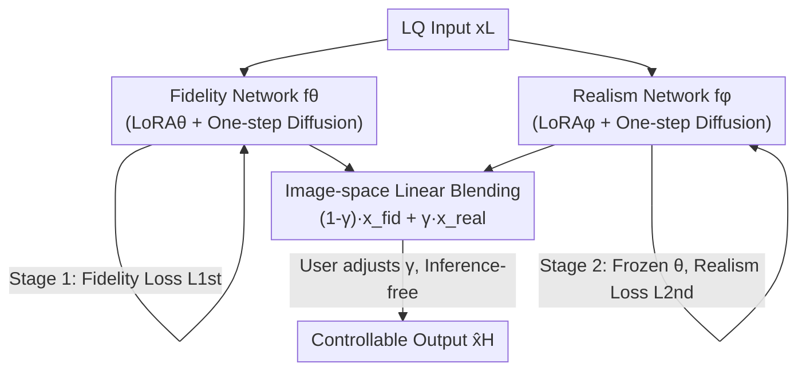

# IFCSR: Inference-Free Fidelity-Realism Control for One-Step Diffusion-based Real-World Image Super-Resolution

**Conference**: CVPR 2026  
**Paper**: [CVF Open Access](https://openaccess.thecvf.com/content/CVPR2026/html/Back_IFCSR_Inference-Free_Fidelity-Realism_Control_for_One-Step_Diffusion-based_Real-World_Image_Super-Resolution_CVPR_2026_paper.html)  
**Code**: None (Not provided in the original text)  
**Area**: Image Restoration / Real-world Image Super-Resolution / Diffusion Models  
**Keywords**: Real-world SR, One-step Diffusion, Fidelity-Realism Control, Inference-free Control, Image-space Interpolation  

## TL;DR
IFCSR shifts "fidelity vs. realism" adjustment from the **latent space** of diffusion models to the **image space**. By generating a high-fidelity image and a highly realistic image using two specialized networks, users can linearly blend the two in the image space with a single parameter $\gamma$. This allows for arbitrary sliding across the fidelity-realism spectrum **without any additional network inference**.

## Background & Motivation

**Background**: Real-world image super-resolution (ISR) requires balancing two often conflicting goals: **fidelity** (similarity to HR, improved via reconstruction losses like MSE) and **realism** (perceptual naturalness, improved via generative priors like GANs or diffusion). Recent methods use pretrained text-to-image models (e.g., Stable Diffusion) as priors and distill them into one-step or few-step diffusion for efficient, high-realism SR.

**Limitations of Prior Work**: Users exhibit varying preferences for "fidelity vs. realism," leading to the emergence of **controllable diffusion SR** (e.g., PiSA-SR, OFTSR, CTSR, RCOD). However, these methods almost exclusively perform control within the **latent space** or the diffusion process, using dual models or timestamps as control parameters. The issue is that **each parameter adjustment triggers a full forward pass** (VAE decoder, SD UNet, etc.). Users often need multiple trials to find the optimal trade-off, causing inference costs to grow **linearly** with the number of adjustments. Even if diffusion is reduced to one step, a single inference remains expensive, making "tweak-per-inference" impractical for real products.

**Key Challenge**: Control occurs in the latent space $\rightarrow$ every control point corresponds to an expensive forward pass. Interactive user experience requires "real-time, continuous slider dragging." There is a fundamental tension between latent space control and interactive tuning.

**Goal**: ① Move control from the latent space to the image space so that parameter tuning no longer triggers inference; ② Ensure the two endpoint networks are truly specialized (one for fidelity, one for realism) to cover a wide fidelity-realism spectrum.

**Key Insight**: If the fidelity-end image $\hat{x}_H^{fid}$ and the realism-end image $\hat{x}_H^{real}$ are already generated in the image space, their linear mixture is itself a valid image. This blending step is pure pixel weighting with zero network evaluation.

**Core Idea**: Train two one-step diffusion networks (one specializing in fidelity, one in realism). During inference, each produces an image, which is then linearly interpolated in the **image space** using $\gamma$. To ensure the endpoints are "specialized" enough, a dedicated two-stage training scheme with depth-weighted losses is employed.

## Method

### Overall Architecture
The skeleton of IFCSR consists of "two specialized one-step diffusion networks + image-space linear blending." Both networks $f_\theta$ (fidelity) and $f_\phi$ (realism) take the low-quality (LQ) image $x_L$ as input and follow a one-step diffusion architecture: the VAE encoder maps LQ into latent vectors, the SD UNet performs the LQ→HQ latent transformation (via residual learning), and the VAE decoder reconstructs the image. Each network utilizes a trainable LoRA ($\text{LoRA}_\theta, \text{LoRA}_\phi$) on a frozen SD UNet. The final output is defined as the linear combination of the endpoint outputs:

$$\hat{x}_H=(1-\gamma)f_\theta(x_L)+\gamma f_\phi(x_L)=(1-\gamma)\hat{x}_H^{fid}+\gamma\hat{x}_H^{real},\quad \gamma\in[0,1].$$

$\gamma\to0$ favors high fidelity and low realism, while $\gamma\to1$ favors low fidelity and high realism. Crucially, once $\hat{x}_H^{fid}$ and $\hat{x}_H^{real}$ are inferred, adjusting $\gamma$ is merely image weighting, making it **inference-free**. Training is split into two stages: first, the fidelity network $f_\theta$ is trained independently; then, it is frozen to train the realism network $f_\phi$. Each stage uses a depth-weighted specialized loss to push the endpoints toward their respective targets.

### Key Designs

**1. Image-space Controllability: Moving control from latent space to image space for inference-free adjustment**

Existing methods control in the latent space/diffusion process, necessitating a rerun of the VAE decoder and SD UNet for every adjustment, leading to linear inference growth. IFCSR's approach is straightforward yet critical: generate the **final images** for both fidelity and realism ends first, then perform linear blending in the image space: $\hat{x}_H=(1-\gamma)\hat{x}_H^{fid}+\gamma\hat{x}_H^{real}$. Since blending occurs at the pixel level without network interaction, the **inference cost remains constant** after producing the two endpoint images, regardless of how many times the user explores the spectrum. This is the core practical advantage over latent-space methods like PiSA-SR or CTSR.

**2. Two-stage Training: Ensuring endpoint specialization**

Simply using the linear formula is insufficient. Direct joint optimization $\arg\min_{\theta,\phi}\mathbb{E}_\gamma[\mathcal{L}(\hat{x}_H,x_H)]$ for $\gamma\sim U(0,1)$ lacks an explicit specialization mechanism, preventing natural divergence of the endpoints. This work adopts a **decoupled two-stage** approach: Stage 1 trains only the fidelity network $f_\theta$ (with $f_\phi$ inactive, $\gamma=0$) via $\hat{\theta}=\arg\min_\theta \mathcal{L}_{1st}(\hat{x}_H^{fid},x_H)$. Stage 2 trains the realism network $f_\phi$ while **fixing $\theta$**, sampling $\gamma\sim U(0,1)$ to supervise the blended output: $\hat{\phi}=\arg\min_\phi\mathbb{E}_{\gamma\sim U(0,1)}[\mathcal{L}_{2nd}(\hat{x}_H,x_H)]$. Pre-training for fidelity first provides a stable anchor (as reconstruction is easier to optimize), and Stage 2 aligns the controllable space to the fidelity-realism spectrum.

**3. Depth-weighted Fidelity/Realism Specialized Losses: Expanding the controllable spectrum**

If both stages use the same baseline LPIPS+MSE loss, the spectrum remains narrow. Based on the observation that **shallow layers of pretrained networks (e.g., VGG) capture low-level structures (edges, colors) while deep layers capture high-level semantics**, the authors apply **depth-dependent weighting** to layer-wise feature distances $\mathcal{D}(\hat{x}_H,x_H,l)$:

$$\mathcal{L}_s(\hat{x}_H,x_H;w)=\frac{1}{\sum_{j=0}^{L}w_j}\sum_{l=0}^{L}w_l\,\mathcal{D}(\hat{x}_H,x_H,l).$$

Fidelity training (Stage 1) uses **monotonically decreasing** weights $w_l^{dec}=k^{L-l}$ to emphasize shallow layers (structural alignment $\to$ fidelity). Realism training (Stage 2) uses **monotonically increasing** weights $w_l^{inc}=k^{l-1}$ to emphasize deep layers (semantic/perceptual $\to$ realism). $k\ge1$ controls the weighting rate. This significantly broadens the fidelity-realism spectrum at the cost of some non-monotonic behavior in feature-space metrics.

### Loss & Training
The task is 4× ISR. The training set includes FFHQ (first 10k) and LSDIR (~85k images). LQ-HQ pairs are generated using Real-ESRGAN degradation on $512\times512$ patches. Stable Diffusion v2.1-base serves as the backbone with LoRA rank=4 and empty prompts. Both stages use AdamW ($\beta_1=0.9, \beta_2=0.999$), batch size 4, and learning rate 5e-5. In the specialized loss, $k=7$ with VGG features. Each stage takes ~24 hours (48 hours total on a single H100).

## Key Experimental Results

### Main Results
Evaluation was conducted on RealSR / DRealSR (real-world) and DIV2K-val (synthetic). Metrics include fidelity (PSNR/SSIM/LPIPS/DISTS) and realism (NIQE/MUSIQ/MANIQA/CLIPIQA/FID). Below is a comparison of three $\gamma$ settings on RealSR against representative one-step methods:

| Method | Steps | PSNR ↑ | SSIM ↑ | LPIPS ↓ | NIQE ↓ | CLIPIQA ↑ |
|------|------|--------|--------|---------|--------|-----------|
| OSEDiff | 1 | 25.15 | 0.7341 | 0.2921 | 5.64 | 0.6685 |
| TSD-SR | 1 | 24.81 | 0.7172 | 0.2743 | 5.13 | 0.7158 |
| PiSA-SR | 1 | 25.50 | 0.7418 | 0.2672 | 5.50 | 0.6701 |
| **Ours ($\gamma=0.0$)** | 1 | **28.00** | **0.7975** | 0.2921 | 7.90 | 0.3337 |
| **Ours ($\gamma=0.5$)** | 1 | 25.14 | 0.7055 | 0.2866 | 5.43 | 0.6522 |
| **Ours ($\gamma=1.0$)** | 1 | 22.10 | 0.6075 | 0.3502 | **4.90** | **0.7011** |

$\gamma=0.0$ achieves the highest fidelity (PSNR/SSIM), while $\gamma=1.0$ yields the strongest realism (NIQE/CLIPIQA). $\gamma=0.5$ provides a competitive balanced result.

### Ablation Study
$\gamma$ scanning on RealSR to verify controllability:

| $\gamma$ | PSNR ↑ | SSIM ↑ | LPIPS ↓ | NIQE ↓ | MUSIQ ↑ | CLIPIQA ↑ |
|----------|--------|--------|---------|--------|---------|-----------|
| 0.0 | 28.00 | 0.7975 | 0.2921 | 7.89 | 47.64 | 0.3329 |
| 0.4 | 25.89 | 0.7297 | 0.2726 | 5.64 | 68.73 | 0.6244 |
| 0.8 | 23.13 | 0.6416 | 0.3275 | 4.98 | 70.36 | 0.6913 |
| 1.0 | 22.10 | 0.6075 | 0.3501 | 4.90 | 70.29 | 0.7008 |

Ablation of two-stage training and specialized losses:
- **Single-stage + Baseline**: Leads to misalignment with the spectrum; endpoints fail to differentiate.
- **Two-stage + Baseline**: Aligns with the spectrum but the range is narrow.
- **Two-stage + Specialized Loss (Full)**: Significantly broadens the spectrum.

### Key Findings
- **$\gamma$ Monotonic Control**: As $\gamma$ goes from 0 to 1, PSNR/SSIM decrease monotonically while NIQE/MUSIQ/CLIPIQA improve. This confirms that image-space interpolation provides a continuous and controllable transition.
- **Non-monotonic LPIPS**: LPIPS exhibits inconsistent trade-offs across different $\gamma$, which the authors attribute to the depth-weighted specialized loss amplifying this inherent characteristic.
- **Pragmatic Advantage**: Compared to latent-space control, IFCSR provides constant inference time with image quality comparable to SOTA controllable methods like PiSA-SR.

## Highlights & Insights
- **"Shifting control to image space"** is a powerful simplification. It decouples interactivity from inference cost, turning "tweak-per-inference" into a "real-time slider."
- **Layer depth as a quality knob**: The use of monotonically increasing/decreasing VGG weights to create opposite-direction specialized losses is a clever and reusable strategy for balancing conflicting objectives.
- **Generalizability**: This framework can likely be transferred to other tasks with opposing quality goals (e.g., denoising vs. detail preservation, style vs. content).

## Limitations & Future Work
- **Ghosting artifacts**: If structural differences between $\hat{x}_H^{fid}$ and $\hat{x}_H^{real}$ are significant, linear blending can cause structural misalignment or "ghosting." This assumes basic structural alignment between endpoints.
- **LPIPS Non-monotonicity**: Expanding the spectrum comes at the cost of non-monotonic behavior in certain feature-space metrics.
- **Framework constraints**: Currently restricted to two endpoints and depends on the SD v2.1 backbone. Future directions include ensuring structural consistency to eliminate ghosting and extending the method to multi-dimensional control.

## Related Work & Insights
- **vs. PiSA-SR**: Both use two LoRA models. However, PiSA-SR interpolates in the **latent space** (linear inference growth), whereas IFCSR blends in the **image space** (constant inference).
- **vs. Timestep Control (OFTSR/CTSR)**: These methods bind control points to the diffusion process. IFCSR decouples inference count from the number of control adjustments.
- **vs. One-step non-controllable (OSEDiff/TSD-SR)**: IFCSR adds continuous, inference-free controllability to the efficiency of one-step diffusion.

## Rating
- Novelty: ⭐⭐⭐⭐ 
- Experimental Thoroughness: ⭐⭐⭐⭐ 
- Writing Quality: ⭐⭐⭐⭐⭐ 
- Value: ⭐⭐⭐⭐ 

<!-- RELATED:START -->

## Related Papers

- [\[CVPR 2026\] Time-Aware One Step Diffusion Network for Real-World Image Super-Resolution](time-aware_one_step_diffusion_network_for_real-world_image_super-resolution.md)
- [\[CVPR 2026\] One-Step Diffusion Transformer for Controllable Real-World Image Super-Resolution](one-step_diffusion_transformer_for_controllable_real-world_image_super-resolutio.md)
- [\[ICLR 2026\] One-Step Flow for Image Super-Resolution with Tunable Fidelity-Realism Trade-offs](../../ICLR2026/image_restoration/one-step_flow_for_image_super-resolution_with_tunable_fidelity-realism_trade-off.md)
- [\[CVPR 2026\] Language-Guided One-Step Diffusion Model for Nighttime Flare Removal](language-guided_one-step_diffusion_model_for_nighttime_flare_removal.md)
- [\[ICLR 2026\] VARestorer: One-Step VAR Distillation for Real-World Image Super-Resolution](../../ICLR2026/image_restoration/varestorer_one-step_var_distillation_for_real-world_image_super-resolution.md)

<!-- RELATED:END -->
