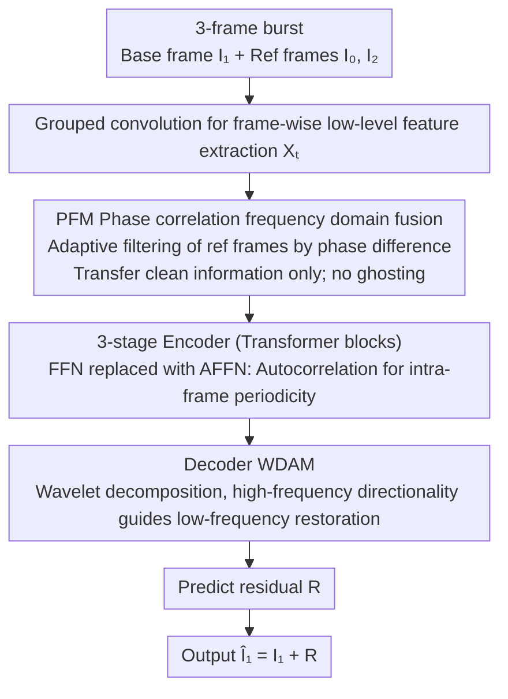

# Flickerformer: A Duet of Periodicity and Directionality for Burst Flicker Removal

**Conference**: CVPR 2026  
**arXiv**: [2603.22794](https://arxiv.org/abs/2603.22794)  
**Code**: [GitHub](https://github.com/qulishen/Flickerformer)  
**Area**: Image Restoration  
**Keywords**: Burst Flicker Removal, Phase Correlation, Autocorrelation, Wavelet Attention, Transformer

## TL;DR

This work reveals that flicker artifacts possess two inherent physical properties: periodicity and directionality. It designs the Flickerformer with three modules (PFM/AFFN/WDAM) to model inter-frame/intra-frame periodicity and directionality respectively. With only 3.92M parameters, it achieves 31.226dB PSNR on the BurstDeflicker benchmark, surpassing the runner-up AST by +0.580dB using only 19.70% of its parameters.

## Background & Motivation

**Background**: When capturing images with short exposures under artificial light sources driven by alternating current (AC), the light intensity oscillates periodically with the AC frequency. Combined with the row-by-row exposure mechanism of modern rolling shutters, this leads to strip-like brightness fluctuations known as flicker artifacts. These artifacts degrade perceptual quality and negatively impact downstream vision tasks such as HDR imaging, slow-motion video, and motion capture.

**Limitations of Prior Work**: Traditional methods rely on hardware sensors to adjust exposure (introducing motion blur) or assume known light source parameters (limited to controlled scenes). Recent deep learning methods (e.g., DeflickerCycleGAN, BurstDeflicker baseline) **treat flicker as a general image degradation**, directly applying denoising, deblurring, or HDR frameworks while completely ignoring the physical structural properties of flicker.

**Key Challenge**: Flicker is not random noise but a **structured degradation** with specific spatial-temporal patterns. General restoration frameworks fail to capture these patterns, resulting in insufficient flicker suppression and the introduction of ghosting artifacts during multi-frame fusion.

**Goal**: To embed physical priors of flicker into a deep network for the first time, designing a specialized architecture tailored to the structural characteristics of flicker to effectively remove it while avoiding ghosting.

**Key Insight**: The authors discovered that flicker artifacts possess two exploitable inherent properties: (1) **Periodicity**: Flicker stripes exhibit repetitive patterns in space and time, and swapping the phase components of two frames swaps the spatial distribution of flicker, indicating that phase encodes flicker position information; (2) **Directionality**: Due to the row-by-row scanning of rolling shutters, flicker stripes are aligned along the scanning direction (horizontal or vertical), producing directional high-frequency brightness oscillations and low-frequency dark bands.

**Core Idea**: Three complementary modules are designed—PFM and AFFN utilize periodicity (inter-frame phase correlation and intra-frame autocorrelation), while WDAM utilizes directionality (high-frequency guidance for low-frequency restoration in the wavelet domain). Together, they form the first Transformer architecture that integrates the physical priors of flicker.

## Method

### Overall Architecture

Flickerformer aims to remove strip flicker caused by AC power and rolling shutters from a burst of short-exposure frames without introducing ghosting common in multi-frame fusion. It decomposes the previously identified physical properties—periodicity and directionality—into three modules for separate modeling within an asymmetric U-shaped encoder-decoder.

Specifically, the network takes a 3-frame burst (base frame $\mathbf{I}_1$ and two reference frames $\mathbf{I}_0, \mathbf{I}_2$). First, grouped convolutions independenty extract low-level features $\mathbf{X}_t \in \mathbb{R}^{H \times W \times C}$ for each frame. PFM then performs inter-frame fusion in the frequency domain to obtain a unified feature $\mathbf{F}_0$. These merged features enter a 3-level encoder (2 Transformer blocks per level, channels [32, 64, 96], heads [1, 2, 4]), where the feed-forward branch is replaced by AFFN to reinforce intra-frame periodicity. The decoder utilizes WDAM for directional attention. The network ultimately predicts only the residual map $\mathbf{R}$, outputting $\hat{\mathbf{I}}_1 = \mathbf{I}_1 + \mathbf{R}$, allowing the model to focus on "isolating flicker" rather than reconstructing the entire image.

### Key Designs

**1. PFM: Selecting clean frames via phase correlation to avoid ghosting during fusion**

The long-standing issue in burst multi-frame fusion is that reference frames contain both clean information useful for the base frame and their own flicker and motion differences. Direct pixel alignment or attention-based fusion often brings in flicker and motion disparities, leading to ghosting. The entry point for PFM comes from an experimental observation: swapping the phase components of two frames swaps the spatial distribution of flicker, proving that **flicker position information is encoded in the phase**. Thus, PFM performs FFT on frame features to obtain frequency domain representations $\tilde{\mathbf{X}}_t = A_t(\mathbf{k})e^{i\Phi_t(\mathbf{k})}$, and then calculates phase correlation scores $\mathbf{S}_t(\mathbf{k}) = |e^{i\Phi_t(\mathbf{k})} \odot e^{-i\Phi_1(\mathbf{k})}|$ as a reliability measure for each frequency. This is converted via convolution and sigmoid into a weight map $\mathbf{W}_t$ to weighted-filter the reference frame spectrum. After applying IFFT to return to the spatial domain, the three-frame enhanced features are concatenated for convolutional fusion. Since frequency multiplication is equivalent to spatial convolution, PFM is essentially an **adaptive frequency domain filter based on phase difference**: frequency components with matching phases (smaller flicker differences) are retained more, thereby transferring only the truly useful information from reference frames.

**2. AFFN: Replacing the FFN with an autocorrelation operator to capture intra-frame spatial periodicity**

While PFM handles periodicity between frames, the regularly arranged flicker stripes within a single frame also constitute a periodic signal, which standard FFNs fail to recognize. Using the Wiener-Khinchin theorem, AFFN efficiently calculates spatial autocorrelation $\mathbf{R}_l = \mathcal{F}^{-1}(|\mathcal{F}(\mathbf{F}_l)|^2)$ via FFT. Autocorrelation naturally amplifies repetitive structures in a signal while suppressing uncorrelated noise, perfectly matching the periodicity of stripes. Based on this, dual-domain enhancement is performed: the power spectrum is added back in the frequency domain $\hat{\mathbf{F}}_k = \mathcal{F}(\mathbf{F}_l) + \alpha|\mathcal{F}(\mathbf{F}_l)|^2$, and autocorrelation is added back in the spatial domain $\hat{\mathbf{F}}_l = \mathcal{F}^{-1}(\hat{\mathbf{F}}_k) + \beta\mathbf{R}_l$ (where $\alpha, \beta$ are learnable), followed by a depthwise gated FFN. This way, PFM (inter-frame) and AFFN (intra-frame) provide comprehensive periodicity modeling. Visualizations show that autocorrelation can distinguish between "flicker changes" and "motion changes," which standard FFNs like FRFN cannot do without introducing ghosting.

**3. WDAM: Utilizing stable high-frequency directionality as a compass to guide the restoration of degraded low frequencies**

The directionality of flicker stems from the rolling shutter's row-by-row scanning—stripes align with the scanning direction, where bright bands are high-frequency oscillations and dark bands are low-frequency suppressions. The most severely damaged areas are the low-frequency dark zones, while the directional information in high frequencies remains relatively stable. WDAM leverages this: Haar wavelet decomposition is applied to features to obtain low-frequency $\mathbf{F}_{LL}$ and three high-frequency components $\mathbf{F}_{LH}, \mathbf{F}_{HL}, \mathbf{F}_{HH}$ (horizontal, vertical, diagonal). The low-frequency component undergoes window-based multi-head attention for restoration, while the horizontal and vertical high frequencies generate a directional weight map $\mathbf{M}$ via convolution and sigmoid to modulate the Value branch of the attention:

$$\text{Att} = \text{Softmax}\Big(\frac{\mathbf{QK}^\top}{\sqrt{d}} + \mathbf{B}\Big)(\mathbf{M} \odot \mathbf{V})$$

After restoration, components are reconstructed via IDWT. Using high-frequency edge changes to mask flicker position and direction for low-frequency correction leads to more precise localization than isotropic standard attention (more thorough restoration in subtle flicker areas like faces). Furthermore, as attention is only calculated on half-sized low-frequency subbands, the complexity is reduced to approximately 25% of standard window attention, with Flops dropping from 139.42G to 128.76G.

### Loss & Training

A combination of L1 loss and VGG-19 perceptual loss is used with equal weighting. Training utilizes the Adam optimizer with a learning rate of $1 \times 10^{-4}$. The input is a 3-frame burst, and the output is the deflickered base frame. The channel expansion factor $\gamma$ is 2.66.

## Key Experimental Results

### Main Results

Comparison with 16 SOTA methods on the BurstDeflicker benchmark:

| Method | Type | PSNR↑ | SSIM↑ | LPIPS↓ | Params(M) | Flops(G) |
|------|------|:-----:|:-----:|:------:|:---------:|:--------:|
| **Flickerformer (Ours)** | **Specialized** | **31.226** | **0.920** | **0.045** | **3.92** | **128.76** |
| AST | General Restoration | 30.646 | 0.918 | 0.050 | 19.90 | 156.43 |
| Restormer | General Restoration | 30.630 | 0.917 | 0.055 | 26.10 | 141.16 |
| FPro | General Restoration | 30.551 | 0.910 | 0.051 | 22.38 | 247.04 |
| Uformer | General Restoration | 30.544 | 0.910 | 0.056 | 18.12 | 145.24 |
| HINT | General Restoration | 30.336 | 0.916 | 0.046 | 24.85 | 142.30 |
| HDRTransformer | HDR | 30.031 | 0.918 | 0.054 | 1.04 | 272.12 |
| RT-XNet | Low-light Enhancement | 29.718 | 0.909 | 0.058 | 3.66 | 245.82 |
| Retinexformer | Low-light Enhancement | 29.598 | 0.899 | 0.055 | 3.74 | 184.14 |
| FFTformer | Deblurring | 29.478 | 0.895 | 0.050 | 14.88 | 131.71 |
| MambaIR | General Restoration | 29.478 | 0.904 | 0.060 | 3.59 | 186.76 |
| FBANet | Burst SR | 29.459 | 0.896 | 0.052 | 4.76 | 432.07 |
| Burstormer | Burst SR | 29.439 | 0.910 | 0.056 | 0.17 | 141.05 |
| Stripformer | Deblurring | 29.223 | 0.892 | 0.058 | 19.71 | 681.64 |
| SAFNet | HDR | 29.223 | 0.892 | 0.058 | 1.12 | 169.74 |
| AFUNet | HDR | 28.922 | 0.903 | 0.066 | 1.14 | 301.36 |

Flickerformer achieves the best performance across all three metrics. PSNR exceeds the second-best AST by +0.580dB, while parameters are only 19.70% of AST's (3.92M vs 19.90M) and computational cost is also lower (128.76G vs 156.43G).

### Ablation Study

**FFN Comparison** (Replacing AFFN with other FFN variants):

| FFN Variant | Params(M) | Flops(G) | PSNR(dB) |
|-------------|:---------:|:--------:|:--------:|
| **AFFN (Ours)** | **3.92** | **128.76** | **31.226** |
| FRFN [AST] | 4.03 | 128.76 | 30.961 |
| GDFN [Restormer] | 3.92 | 128.76 | 30.959 |
| LeFF [Uformer] | 4.60 | 146.73 | 30.954 |
| FFN [SwinIR] | 4.45 | 139.31 | 30.876 |

**Attention Mechanism Comparison** (Replacing WDAM with other forms of attention):

| Attention Module | Params(M) | Flops(G) | PSNR(dB) |
|------------------|:---------:|:--------:|:--------:|
| **WDAM (Ours)** | **3.92** | **128.76** | **31.226** |
| ASSA [AST] | 3.92 | 139.42 | 30.997 |
| Condensed SA | 3.46 | 132.29 | 30.981 |
| Swin SA | 3.92 | 139.36 | 30.896 |
| Top-k SA | 3.96 | 145.20 | 30.894 |

**Contribution of Individual Modules** (Replacing with corresponding AST modules as baseline):

| Config | Fusion | FFN | Attention | PSNR↑ | SSIM↑ |
|------|:----:|:---:|:------:|:-----:|:-----:|
| (a) AST baseline | CNN | FRFN | ASSA | 30.449 | 0.912 |
| (b) +PFM | **PFM** | FRFN | ASSA | 30.728 | 0.914 |
| (c) +AFFN | CNN | **AFFN** | ASSA | 30.831 | 0.915 |
| (d) +WDAM | CNN | FRFN | **WDAM** | 30.822 | 0.915 |
| (e) **Full Model** | **PFM** | **AFFN** | **WDAM** | **31.226** | **0.920** |

### Key Findings

- **The three modules contribute independently and are highly complementary**: PFM provides +0.279dB, AFFN +0.382dB, and WDAM +0.373dB. Their combined Gain is +0.777dB (surpassing simple summation), indicating synergistic effects.
- **Why AFFN outperforms FRFN**: Visualizations demonstrate that FRFN cannot distinguish between motion and flicker changes, introducing ghosting during fusion; AFFN focuses on periodic structures via autocorrelation, effectively separating flicker from motion.
- **WDAM provides more precise directional localization**: Compared to isotropic attention like ASSA, WDAM restores subtle flicker regions (e.g., faces) more thoroughly by using high-frequency subbands as precise "locating" signals.
- **Significant efficiency advantages**: WDAM only computes attention on half-sized low-frequency subbands, reducing complexity to ~25% of standard window attention and lowering Flops from 139.42G to 128.76G.

## Highlights & Insights

- **Physical Pryor-Driven Network Design**: Deriving periodicity and directionality from AC power causes and rolling shutter mechanisms allowed for modules with clear physical motivations—this "understand degradation → design method" paradigm is applicable to other structured degradations (moiré, banding, rolling shutter distortion).
- **Counter-intuitive "High-Frequency Guides Low-Frequency" Design**: Traditionally, low frequency is the main body and high frequency is detail. However, in flicker scenarios, low frequencies (dark bands) are most damaged, while high-frequency directional info (edges in LH/HL subbands) remains stable. WDAM uses stable high frequencies as a "compass" to guide low-frequency restoration, an ingenious cross-frequency complementary design.
- **Phase Carries Flicker Spatial Distribution Info**: Experimental verification that swapping phases swaps flicker patterns directly inspired PFM—measuring inter-frame flicker differences via phase correlation is superior to pixel-level alignment or attention fusion.
- **Extreme Parameter Efficiency**: Achieving SOTA with only 3.92M parameters—leveraging physical priors reduces the patterns the network must "discover" on its own, decreasing model capacity requirements.

## Limitations & Future Work

- **Inability to restore large blacked-out areas**: When clean information for a region is absent from all burst frames (e.g., a large long lamp turned completely off), the model can only partially restore it—essentially an information deficiency problem that may require more frames or generative priors.
- **Fixed Haar Wavelet**: The current use of fixed Haar wavelets could be improved with learnable adaptive wavelet bases to better fit different flicker patterns.
- **Fixed Burst Size ($N=3$)**: The number of input frames is manually set; adaptive burst size selection may be more flexible.
- **Limited to Short Exposures**: Restoration for other flicker types, such as LED PWM flickering in long-exposure video, remains to be explored.

## Related Work & Insights

- **vs General Restoration (Restormer/AST/Uformer)**: These frameworks do not model flicker-specific periodicity/directionality, leading to insufficient flicker suppression and high parameter counts (20-26M vs 3.92M), demonstrating that task-specific priors can enhance both performance and efficiency.
- **vs Burst SR (Burstormer/FBANet)**: Burst SR assumes spatially uniform degradation; its effectiveness on non-uniform structured degradation like flicker is limited (PSNR only 29.4-29.5dB), and FBANet has a high computational cost of 432G.
- **vs HDR Methods (HDRTransformer/SAFNet)**: HDR focuses on exposure fusion rather than stripe pattern elimination, introducing color bias and ghosting under severe flicker.
- **Inspiration for Moiré Removal**: Moiré is also a structured periodic degradation; the periodicity modeling logic of PFM/AFFN may have transfer value.

## Rating

- Novelty: ⭐⭐⭐⭐⭐ First to systematically reveal periodicity + directionality physical properties; PFM/AFFN/WDAM have clear physical motivations; discovery of phase-carrying flicker distribution is especially insightful.
- Experimental Thoroughness: ⭐⭐⭐⭐ Compared against 16 SOTA methods across 6 task types; three sets of ablations verify each module with feature visualizations; however, only evaluated on a single dataset.
- Writing Quality: ⭐⭐⭐⭐ Clear logical chain from physical properties to module design; Figure 1's phase-swapping experiment is intuitive and convincing; rigorous mathematical derivation.
- Value: ⭐⭐⭐⭐⭐ First specialized architecture for burst deflicker; 3.92M parameters outperform 20M+ general methods; the methodology of "embedding physical priors into networks" offers broad inspiration for structured degradation restoration.

<!-- RELATED:START -->

## Related Papers

- [\[CVPR 2026\] Dynamic Exposure Burst Image Restoration](dynamic_exposure_burst_image_restoration.md)
- [\[CVPR 2026\] LightRR: A Lightweight Network for Single Image Reflection Removal](lightrr_a_lightweight_network_for_single_image_reflection_removal.md)
- [\[CVPR 2026\] UniSER: A Foundation Model for Unified Soft Effects Removal](uniser_a_foundation_model_for_unified_soft_effects_removal.md)
- [\[CVPR 2026\] GFRRN: Explore the Gaps in Single Image Reflection Removal](gfrrn_explore_the_gaps_in_single_image_reflection_removal.md)
- [\[CVPR 2026\] PhaSR: Generalized Image Shadow Removal with Physically Aligned Priors](phasr_generalized_image_shadow_removal_with_physically_aligned_priors.md)

<!-- RELATED:END -->
