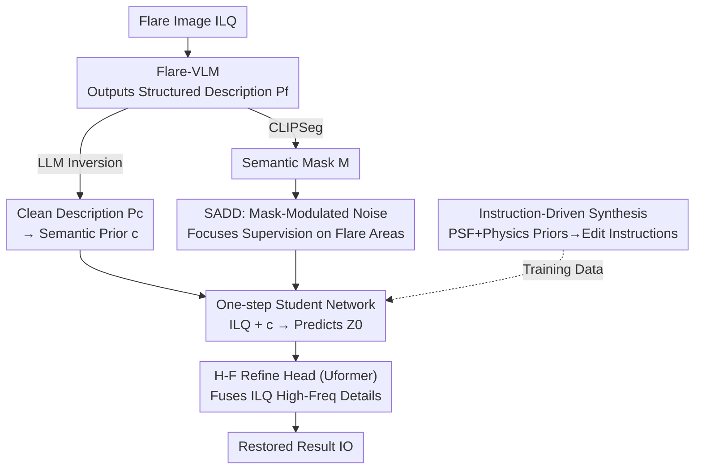

# Language-Guided One-Step Diffusion Model for Nighttime Flare Removal

**Conference**: CVPR 2026  
**Paper**: [CVF Open Access](https://openaccess.thecvf.com/content/CVPR2026/html/Ning_Language-Guided_One-Step_Diffusion_Model_for_Nighttime_Flare_Removal_CVPR_2026_paper.html)  
**Code**: To be confirmed  
**Area**: Image Restoration / Nighttime Flare Removal  
**Keywords**: Nighttime Flare Removal, One-step Diffusion, Vision-Language Model, Semantic Distillation, Data Synthesis

## TL;DR
Addressing the issue where nighttime flares from strong light sources occlude local areas and existing methods lack semantic priors for these regions—leading to artifacts or lost details—this paper introduces Flare-VLM, the first flare-specific Vision-Language Model. Flare-VLM outputs structured descriptions to guide a one-step diffusion model for reconstruction in a single forward pass. Furthermore, it proposes Semantic-Aware Distribution Distillation (SADD) to concentrate noise in flare regions and an instruction-driven data synthesis pipeline for realistic training data. This approach outperforms existing methods in both restoration quality and downstream detection.

## Background & Motivation

**Background**: High-intensity light sources at night (car lights, street lamps) undergo reflection and scattering within optical systems, producing various flare artifacts like circular halos, streaks, and diffuse glows. These degrade visual quality and interfere with downstream tasks like low-light object detection. Mainstream learning methods (CNN/Transformer) treat flare removal as a pixel/feature-level image-to-image task, which works for mild/diffuse flares on datasets like Flare7K++.

**Limitations of Prior Work**: When intense flares **completely occlude** local scene content, these models lack reliable semantic priors to infer the underlying objects or structures, resulting in artifacts, over-smoothing, or inconsistent reconstructions. The morphology of flares (number, spatial distribution, chromaticity) is also tightly coupled with scene illumination layout. Removing flares is not just about erasing visible artifacts but also about reconstructing content consistent with surrounding textures and edges while maintaining the "light-flare" spatial relationship.

**Key Challenge**: Lack of semantic priors in occluded areas. Directly applying general Vision-Language Models (e.g., CLIP or general VLMs) is ineffective—they are trained for open-domain recognition and generate coarse, scene-independent descriptions that fail to specify flare types or their spatial relationship with light sources, making them unusable as executable restoration conditions.

**Goal**: Introduce "language" as an explicit carrier of scene-level knowledge into flare removal and achieve three objectives: (1) Obtain precise, parsable linguistic descriptions of flares; (2) Enable semantic constraints on restoration while maintaining efficiency (one-step diffusion); (3) Synthesize training data that closely matches real-world flare characteristics.

**Key Insight**: Develop a flare-specific VLM to convert flare artifacts into structured conditions (light source type, position, shape, color, occluded structure). A one-step diffusion model uses these semantic priors for single-pass reconstruction. During distillation, noise is concentrated in flare regions based on semantic masks to avoid interfering with clean backgrounds.

**Core Idea**: Use flare-specific linguistic descriptions as explicit semantic priors to guide one-step diffusion, and "align" the distillation supervision to flare regions rather than spreading it uniformly across the image.

## Method

### Overall Architecture
The framework (LG-ODM) consists of two stages. **Stage 1 (Core Restoration)**: Given a flare image $I_{LQ}$, Flare-VLM produces a five-slot structured flare description $P_f$. One path uses an LLM to invert $P_f$ into a "flare-free, scene-aligned" clean description $P_c$, which is encoded into semantic prior $c$. Another path uses CLIPSeg on $I_{LQ}$ and $P_f$ to obtain a flare semantic mask $M$. Guided by $c$, the one-step diffusion student network encodes $I_{LQ}$ into $\hat{Z}$ and directly predicts the clean latent $\hat{Z}_0$, which is decoded into an initial restored image $\hat{I}$. The key to training this student is **Semantic-Aware Distribution Distillation (SADD)**, which uses $M$ to modulate the noise injected into the latent space, focusing distillation supervision on flare areas. **Stage 2 (Detail Refinement)**: Since encoding/decoding can over-smooth edges, a lightweight High-Frequency Refine Head (H-F Refine Head, implemented as a Uformer) follows to fuse $\hat{I}$ with high-frequency residuals from $I_{LQ}$ to produce the final output $I_O$. Additionally, an **offline data synthesis pipeline** extracts light source semantic/geometric priors from real flare-free night images to generate editing instructions, then uses an image editing model to synthesize realistic flare images for training.

### Key Designs

**1. Flare-VLM: Translating Flare Artifacts into Structured, Parsable Language Conditions**

This design directly addresses the lack of semantic priors in occluded areas and the coarseness of general VLMs. The authors collected night images with prominent flares and manually wrote descriptions **focused strictly on flare degradation**, forcing five elements: light source type (street lamp/car light), approximate position (top-left/center), flare shape (streaks/glow), flare color (white/yellow), and occluded structure (eaves/facade). All text was normalized into a template: `[The <type, position> generate <color, shape> flare, which occludes <object>.]`. These five slots are converted into semantic conditions using simple rules, avoiding the complexities of free-form text. The base model is Qwen-2.5 7B, fine-tuned with LoRA. During inference, Flare-VLM produces $P_f$ for $I_{LQ}$, and an LLM (Qwen3) inverts this into a clean scene description $P_c$, encoded as $c$. This $c$ provides the one-step model with the semantic basis for reconstructing areas heavily occluded by nighttime flares. The reconstruction follows the OSEDiff approach: fixing a reverse timestep $T$, directly predicting noise $\varepsilon=\epsilon_\theta(\hat{Z},c,T)$, and solving for the clean latent $\hat{Z}_0=(\hat{Z}-\sqrt{1-\bar\alpha_T}\,\varepsilon)/\sqrt{\bar\alpha_T}$ for efficient, high-quality restoration.

**2. SADD (Semantic-Aware Distribution Distillation): Aligning Noise and Supervision to Flare Regions**

Standard Variational Score Distillation (VSD) suffers from two issues: using only low-quality conditional teacher outputs for supervision and injecting **spatially uniform** Gaussian noise into the latent space. Since nighttime flares are local, uniform noise unnecessarily perturbs clean backgrounds, forcing the teacher to "denoise" already clean areas and misaligning supervision with actual degradation. SADD fixes this by gating noise with semantics. A flare mask $M=\mathrm{CLIPSeg}(I_{LQ},P_f)\in[0,1]$ is generated using $P_f$ as a prompt. Mask-aligned noise is then injected: $\hat{Z}_t=\sqrt{\bar\alpha_t}\hat{Z}_0+\sqrt{1-\bar\alpha_t}\,(\sigma(M)\odot\varepsilon)$, where $\sigma(M)=(1+\gamma_f)M+(1+\gamma_b)(1-M)$, with $\gamma_f\ge0$ enhancing perturbations in flare regions and $\gamma_b\le0$ attenuating them in background regions. Supervision also includes a **Ground Truth (GT) conditional teacher path**, allowing the teacher to provide guidance based on high-quality content. The final gradient aggregates across a sequence of timesteps, aligning the student with both the low-quality conditional teacher and the GT conditional teacher. This provides **spatially precise, degradation-consistent** gradient signals that suppress background drift and stabilize distillation.

**3. Instruction-Driven Data Synthesis: Using Physics Priors for Scene-Aligned Realism**

Existing synthesis methods often use **additive blending** of pre-generated flare layers onto clean backgrounds, ignoring the semantics and geometry of real light sources, which leads to a large domain gap. This paper reverses the process: starting from ~1400 manually screened clean night images, it extracts actual light source types and positions as anchors. Geometric priors are introduced—using thin lens and wave optics models, the Point Spread Function $\mathrm{PSF}_\lambda(s,t;z)=|\mathcal{F}\{A(u,v)\exp(i\phi_\lambda(u,v;z))\}|^2$ describes the intensity of a point source at depth $z$. Incident energy follows the inverse-square law $E\propto 1/z^2$, so flare intensity per channel is $I_c(s,t)=M(s,t)\,k_c/(\epsilon+D(s,t))^2\cdot p_c(D(s,t))$ (where $D$ is per-pixel depth and $M$ is the light source mask). Intensities are discretized into five levels (very weak to very intense). Flare-VLM uses the clean image $I_c$, its depth map $D$, and base instructions to generate constrained, detailed edit prompts $P_{edit}$, which are then used by an image editing model (Step1X-Edit) to synthesize flare images. Radial RGB intensity curves show that this spatial decay is much closer to real flare than additive methods (reflective flares like iris ghosts are not covered).

### Loss & Training
Global reconstruction uses LPIPS: $L_{rec}=\mathrm{LPIPS}(\hat{I},I_{GT})$. To emphasize light sources, a light-aware loss is added: $L_{light}=\mathrm{LPIPS}(M_{Light}\odot\hat{I},\,M_{Light}\odot I_{GT})$. The recognizer $\epsilon_\phi$ is also trained with $L_{diff}=\mathbb{E}\,L_{MSE}(\epsilon_\phi(\alpha_t\hat{Z}_0+\beta_t\varepsilon;t,c),\varepsilon)$. Implementation: Stage 1 uses AdamW ($LR=5\times10^{-5}$), all LoRAs (rank 8) initialized from the teacher (SD 2.1-base), SADD initial $t=4$, $\gamma_f=0.1$, $\gamma_b=-0.3$. Stage 2 uses a lightweight Uformer ($LR=1\times10^{-4}$). Text inversion uses Qwen3. Training performed on two RTX 3090s.

## Key Experimental Results

### Main Results
Quantitative comparison on paired test sets (Self-synthesized + Flare7K++). Diagnostic metrics: `PSNRflare` (PSNR in flare regions) and `PSNRback` (PSNR in background regions). Diffusion methods are labeled with inference steps ("s"). Inference time measured on RTX 3090 excluding pre-processing.

| Method | Steps | Syn. PSNR↑ | Syn. SSIM↑ | Syn. LPIPS↓ | Syn. FID↓ | Flare7K++ FID↓ | Infer.(s)↓ |
|------|------|-----------|-----------|------------|----------|----------------|----------|
| Uformer | — | 31.357 | 0.925 | 0.0602 | 28.015 | 37.979 | 0.172 |
| Difflare | 200s | 29.154 | 0.823 | 0.0821 | 39.783 | 42.158 | 12.415 |
| CycleRDM | 10s | 29.825 | 0.903 | 0.0946 | 27.774 | 39.580 | 0.560 |
| OSEDiff | 1s | 27.012 | 0.845 | 0.1790 | 28.000 | 47.896 | 0.138 |
| **Ours** | 1s | **31.844** | **0.936** | **0.0527** | **21.636** | **34.206** | **0.126** |

Ours achieves the best results across all four metrics on both paired datasets. The synthesized FID dropped from 27.774 to 21.636 (significant realism improvement) while using **only one step**. At 0.126s, it is faster than all diffusion competitors (Difflare 200 steps takes 12.4s). This demonstrates that language-guided flare modeling better locates and constrains flare structures compared to treating flares as generic degradation. Qualitative results on unpaired real data (DarkZurich/ExDark) with NIQE/MUSIQ show robustness.

Downstream low-light detection (YOLOv11) results:

| Training Dataset | Precision↑ | Recall↑ | mAP50↑ |
|--------------|-----------|---------|--------|
| No Enhancement | 0.756 | 0.699 | 0.742 |
| Wu et al. | 0.756 | 0.681 | 0.730 |
| Flare7K++ | 0.753 | 0.689 | 0.737 |
| **Ours (Data)** | **0.764** | **0.714** | **0.774** |

Detectors trained on images enhanced by our model achieved the highest mAP50 (0.774), whereas models trained on Wu et al. or Flare7K++ often distorted light sources, leading to false positives and lower recall.

### Ablation Study
Ablation of components on the self-synthesized test set, focusing on regional PSNR:

| Configuration | PSNRflare↑ | PSNRback↑ | Description |
|------|-----------|-----------|------|
| Baseline | 22.340 | 27.041 | One-step diffusion baseline |
| +Flare-VLM | 24.722 | 27.990 | Precise descriptions improve flare-area reconstruction |
| +SADD (Bright mask) | 22.702 | 28.315 | Brightness mask shows limited background improvement |
| +SADD (Semantic mask) | 23.085 | 31.164 | Semantic mask significantly suppresses background drift |
| +H-F Refine | 22.657 | 27.826 | Minimal gain when used alone |
| Full | **24.728** | **31.197** | Full model is optimal |

### Key Findings
- **Flare-VLM is the major contributor**: Providing the diffusion model with precise flare descriptions improved flare-area PSNR from 22.340 to 24.722.
- **Semantic masks outperform brightness masks**: With SADD using semantic masks, background PSNR reached 31.164 (vs 28.315 for brightness masks), proving that gating noise/supervision by semantics effectively inhibits background drift.
- **H-F Refine Head is supplementary**: The small gain suggests most improvements come from the one-step diffusion stage itself, not post-processing.

## Highlights & Insights
- The "First flare-specific VLM + fixed 5-slot schema" compresses vague flare semantics into conditions parsable by rules. This bypasses the limitations of coarse general VLMs and unconstrained text—this paradigm of "customized structural language conditions for sub-tasks" can be extended to rain, fog, or low-light restoration.
- SADD replaces VSD's uniform noise with semantic mask-gated noise. This simple weighted implementation of "supervise only where degradation exists" is a clever way to embed the physical fact of "local degradation" into distillation targets.
- The synthesis pipeline (PSF + inverse-square law $\rightarrow$ discrete intensity $\rightarrow$ instructions $\rightarrow$ Step1X-Edit) embeds physical imaging priors into generative editing, resulting in spatial distributions closer to real flares than additive blending.

## Limitations & Future Work
- The encoding-decoding path still loses high-frequency details, necessitating the Stage 2 Uformer refinement. The authors intend to investigate mitigating this directly within the generative backbone.
- Data synthesis **excludes reflective flares** (iris ghosts), limiting applicability mainly to scattering/refractive flares.
- Training Flare-VLM relies on manually written 5-slot descriptions and ~1400 screened clean images, incurring labeling costs. Semantic gating in SADD might mislead supervision if Flare-VLM descriptions or CLIPSeg masks are inaccurate.

## Related Work & Insights
- **vs. Transformer-based (Uformer/BracketFlare)**: These lack structured flare semantics and fail under heavy occlusion. Ours uses explicit semantic guidance to outperform them in regional PSNR and FID.
- **vs. Multi-step Diffusion (Difflare)**: These require hundreds of steps (12.4s). Ours achieves better quality in one step (0.126s).
- **vs. General One-step Models (OSEDiff)**: Ours adapts the one-step framework to local intense degradation via flare-specific language conditions and SADD semantic distillation.
- **vs. Additive Synthesis (Wu et al. / Flare7K++)**: Our instruction-driven synthesis with physical priors significantly reduces the domain gap, as evidenced by higher downstream detection mAP.

## Rating
- Novelty: ⭐⭐⭐⭐⭐ First flare-specific VLM + Semantic-gated distillation + Physics-prior synthesis; all three creatively integrate "language semantics" into flare removal.
- Experimental Thoroughness: ⭐⭐⭐⭐ Comprehensive paired/unpaired/downstream testing, though failure mode analysis for Flare-VLM/mask errors is lacking.
- Writing Quality: ⭐⭐⭐⭐ Clear motivation (lack of priors in occluded areas) and logical architecture descriptions.
- Value: ⭐⭐⭐⭐ High-quality one-step inference results and benefit to downstream night detection; the paradigm of language-prior integration has high portability.

<!-- RELATED:START -->

## Related Papers

- [\[CVPR 2026\] Bridging Fidelity-Reality with Controllable One-Step Diffusion for Image Super-Resolution](bridging_fidelity-reality_with_controllable_one-step_diffusion_for_image_super-r.md)
- [\[CVPR 2026\] One-Step Diffusion Transformer for Controllable Real-World Image Super-Resolution](one-step_diffusion_transformer_for_controllable_real-world_image_super-resolutio.md)
- [\[CVPR 2026\] IFCSR: Inference-Free Fidelity-Realism Control for One-Step Diffusion-based Real-World Image Super-Resolution](ifcsr_inference-free_fidelity-realism_control_for_one-step_diffusion-based_real-.md)
- [\[CVPR 2026\] FiDeSR: High-Fidelity and Detail-Preserving One-Step Diffusion Super-Resolution](fidesr_high-fidelity_and_detail-preserving_one-step_diffusion_super-resolution.md)
- [\[CVPR 2026\] Time-Aware One Step Diffusion Network for Real-World Image Super-Resolution](time-aware_one_step_diffusion_network_for_real-world_image_super-resolution.md)

<!-- RELATED:END -->
