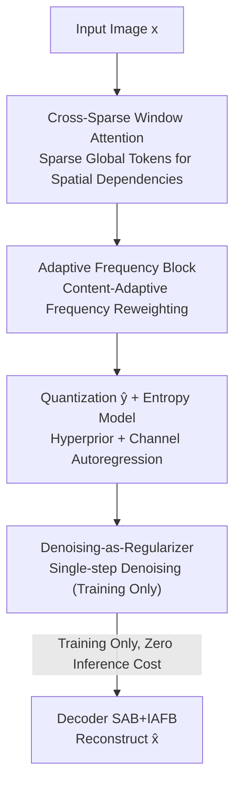

# Learned Image Compression via Sparse Attention and Adaptive Frequency

**Conference**: CVPR 2026  
**Paper**: [CVF Open Access](https://openaccess.thecvf.com/content/CVPR2026/html/Ma_Learned_Image_Compression_via_Sparse_Attention_and_Adaptive_Frequency_CVPR_2026_paper.html)  
**Code**: https://github.com/ (The paper claims "SAAF" is open-sourced; refer to the original text for the specific address ⚠️)  
**Area**: Image Restoration / Learned Image Compression  
**Keywords**: Learned Image Compression, Sparse Attention, Adaptive Frequency Transform, Denoising Regularization, Rate-Distortion

## TL;DR
SAAF utilizes a "spatial-frequency dual-path" transform network for learned image compression. The spatial path employs Cross-Sparse Window Attention (CSWA) to efficiently model long-range dependencies with minimal global tokens, while the frequency path replaces fixed wavelet transforms with content-adaptive frequency reweighting (AFB). A Denoising-as-Regularizer (DaR), active only during training, smoothens the latent space. SAAF achieves SOTA BD-rate on Kodak/CLIC/Tecnick benchmarks with the lowest latency (67 ms).

## Background & Motivation
**Background**: Learned Image Compression (LIC) has outperformed traditional codecs like JPEG and VVC in rate-distortion (RD) performance. Standard frameworks follow Ballé’s autoencoder + hyperprior structure: a transform network $g_a/g_s$ compresses images into compact latent variables $y$, and an entropy model estimates the distribution of quantized $\hat{y}$ to control the bitrate. Both are jointly optimized end-to-end using the RD objective $L_{RD}=E[R+\lambda D(x,\hat{x})]$. Recent improvements focus on transform networks (introducing CNN-Transformers, State Space Models) and entropy models (hyperpriors, channel autoregression, Gaussian mixtures).

**Limitations of Prior Work**: The authors identify two specific shortcomings. First, spatial modeling attention faces a dilemma between efficiency and effectiveness—standard Window Multi-Head Self-Attention (WMSA) has a limited receptive field, while Swin's shifted windows require stacking many layers for long-range communication, increasing complexity. Second, although natural images have multi-scale frequency structures, most LIC methods ignore frequency domain information; the few that introduce frequency transforms (e.g., fixed wavelets) rely on handcrafted parameters, failing to adapt to varying image content.

**Key Challenge**: The trade-off between RD performance and inference speed—stronger long-range or frequency modeling usually incurs higher latency and computational costs, which is problematic for real-world deployment. Fixed frequency transforms also lack the flexibility to adapt to content.

**Goal**: ① Enable spatial attention to balance local and global modeling without increasing complexity; ② Upgrade frequency decomposition from fixed transforms to content-adaptive ones; ③ Improve reconstruction quality without adding inference overhead.

**Key Insight**: Long-range dependencies do not necessarily require dense attention—a few "window-conditioned" learnable global tokens can act as hubs for cross-window information. Similarly, frequency responses do not need to be hard-coded into fixed bands; the network can dynamically generate band weights based on content.

**Core Idea**: A combination of "Local-Global Attention with Sparse Global Tokens + Content-Adaptive Frequency Reweighting + Training-time Denoising Regularization" simultaneously optimizes RD performance and latency.

## Method

### Overall Architecture
SAAF maintains the standard LIC backbone of "Transform Network + Hyperprior/Autoregressive Entropy Model" but structures the transform network as a dual-path spatial-frequency system. The encoder downsamples the image $x$ into latents $y$ stage-by-stage. Each stage contains a **Sparse Attention Block (SAB)** with CSWA for spatial long-range relationships and an **Adaptive Frequency Block (AFB)** for frequency reweighting. After quantization, $\hat{y}$ is encoded using a Gaussian entropy model conditioned on a hyperprior $\Phi=(\mu,\sigma)$ and channel-autoregressive context. The decoder reconstructs $\hat{x}$ using symmetric SAB and Inverse AFB (IAFB). A **Denoising-as-Regularizer (DaR)** is used only during training to impose structural constraints on the latent space.

### Key Designs

**1. Cross-Sparse Window Attention (CSWA): Replacing Expensive Cross-Window Attention with Sparse Global Tokens**

CSWA addresses the limited receptive field of WMSA and the high cost of shifted windows by splitting attention into: Local Window Attention (LWA), Global Sparse Attention (GSA), and Local-Global Mixture (LGM). LWA is standard intra-window self-attention $\text{Softmax}(Q_i K_i^\top/\sqrt{d_h}+B)V_i$, with an engineering optimization: the relative position bias $B$ is precomputed and cached as a static lookup table (replacing Swin’s MLP generation) to save computation (validated in Tab. 3). GSA introduces $N_g$ learnable global tokens $G_i=G_{learn}+\bar{X}_i$, where $G_{learn}$ is shared across windows and $\bar{X}_i$ is the window's mean feature. Local queries perform cross-attention only with these $N_g$ tokens, reducing the attention matrix from $M^2\times M^2$ to $M^2\times N_g$. Finally, LGM fuses them with a fixed weight $\alpha=0.25$: $H_i=(1-\alpha)H_{local,i}+\alpha H_{global,i}$. Ablations show $N_g=2$ is sufficient, proving ultra-sparse global tokens can fulfill long-range modeling requirements.

**2. Adaptive Frequency Block (AFB): Dynamically Content-Driven Frequency Decomposition**

Unlike fixed wavelets, AFB uses a lightweight Differentiable Weight Generator (DWG) to create 4 weight maps $A_{freq}\in\mathbb{R}^{H\times W\times 4}$ based on input content, simulating responses for LL/LH/HL/HH frequency bands. Instead of hard decomposition, it performs "content-adaptive reweighting" by incorporating learnable global weights $w_{freq}\in\mathbb{R}^4$. The reweighted feature is calculated as:

$$X_{freq}=X\odot\Big(\sum_{i=1}^{4}A_{freq,i}\cdot\exp(w_{freq,i})\Big)$$

where $\exp(\cdot)$ ensures positive weights. This modulates frequency response at both local ($A_{freq}$) and global ($w_{freq}$) scales. An Orthogonal Linear Projection (OLP) with orthogonal constraints is used for channel transformation to ensure training stability and information preservation.

**3. Denoising-as-Regularizer (DaR): Latent Space Regularization via Diffusion Principles (Zero Inference Cost)**

Standard RD objectives typically lack constraints on the latent variables, leading to artifacts at low bitrates. DaR is a regularizer used **only during training**. It adds time-step-scaled Gaussian noise to the latent $y$ to get $y_{noise}=y+t\cdot\epsilon$. A lightweight noise predictor $f_{denoise}$ predicts the injected noise $\epsilon$, conditioned on the time-step $t$ and hyper-latents $\hat{z}$:

$$L_{DaR}=E\big[\|f_{denoise}(y_{noise},t_{emb},\hat{z}_{cond})-\epsilon\|_2^2\big]$$

Based on denoising score matching, minimizing $L_{DaR}$ maximizes the conditional log-likelihood $\log p(y|c)$, acting as a learnable prior. The $\hat{z}$ condition provides spatial adaptivity: smooth regions are strongly regularized while textures are preserved. Crucially, DaR is disabled during inference, meaning it improves quality by guiding the encoder toward a smoother latent space with zero extra inference cost.

### Loss & Training
The total training objective sums the RD loss, OLP orthogonal loss, and DaR loss:

$$L=E\big[L_{RD}+\lambda_{OLP}L_{OLP}+\lambda_{DaR}L_{DaR}\big]$$

with $\lambda_{OLP}=0.1$ and $\lambda_{DaR}=0.01$. The model is trained on the first 300k images of OpenImages (short side ≥ 256) cropped to $256\times256$, with a batch size of 16 for 100 epochs. The learning rate starts at $10^{-4}$ and decays to $10^{-5}$ at epoch 80. MSE is used as the distortion term, and 6 models are trained with different $\lambda$ values (0.05 to 0.0018).

## Key Experimental Results

### Main Results
Compared against VTM-9.1 as the anchor on Kodak, CLIC, and Tecnick datasets, reporting BD-rate (lower is better) and efficiency metrics on Kodak.

| Method | Conference | BD-rate (Kodak)↓ | BD-rate (CLIC)↓ | BD-rate (Tecnick)↓ | Latency (ms)↓ | Params (M) |
|------|------|------|------|------|------|------|
| MLIC++ | ICML'23 NCW | -15.07 | -14.46 | -17.19 | 211 | 116 |
| AuxT | ICLR'25 | -10.17 | -9.38 | -9.98 | 82 | 46 |
| DCAE | CVPR'25 | -17.00 | -16.98 | -20.11 | 74 | 119 |
| LALIC | CVPR'25 | -15.32 | -15.42 | -17.61 | - | - |
| **SAAF (Ours)** | - | **-17.40** | **-17.35** | **-20.57** | **67** | 123 |

SAAF achieves the best BD-rate across all datasets while maintaining the lowest latency (67 ms), with parameters and FLOPs comparable to the strong baseline DCAE.

### Ablation Study
Using BASE (WMSA, no extra modules) as the baseline on Kodak/CLIC/Tecnick (results relative to VTM-9.1).

| Configuration | BD-rate (Kodak)↓ | BD-rate (CLIC)↓ | BD-rate (Tecnick)↓ | Latency (ms)↓ |
|------|------|------|------|------|
| BASE | -0.64 | -1.86 | -3.52 | 61 |
| BASE + SAB ($N_g{=}2$) | -1.86 | -2.53 | -4.16 | 52 |
| BASE + AFB | -3.42 | -4.35 | -5.81 | 65 |
| BASE + DaR | -1.56 | -2.63 | -4.29 | 61 |
| SAAF (ALL) | **-3.99** | **-4.59** | **-6.04** | 56 |

SAB (CSWA) reduces latency compared to the BASE WMSA (0.33 ms vs 0.44 ms per block) while improving BD-rate.

### Key Findings
- **AFB provides the largest RD gain** (improving Kodak BD-rate from -0.64 to -3.42) with a slight latency increase. SAB improves both RD and latency, making them complementary modules.
- **DaR provides truly zero-latency gains**: adding it improves the Kodak BD-rate from -0.64 to -1.56 without changing the 61ms latency.
- **Extremely sparse global tokens suffice**: $N_g=2$ outperformed $N_g=1$ and $N_g=3$, suggesting long-range modeling does not require dense attention.
- CSWA helps concentrate energy in fewer channels and preserves clearer contours in latent visualizations, making it more friendly to entropy models.

## Highlights & Insights
- **Sparse Global Tokens as a reusable attention speed-up**: Using a tiny amount of window-conditioned learnable tokens for cross-window communication compresses $M^2\times M^2$ attention to $M^2\times N_g$ without losing long-range information—highly applicable to other dense prediction tasks.
- **Denoising as a Regularizer, not a Generator**: Using diffusion denoising score matching to structure latent space only during training allows for "free" quality gains from diffusion priors without paying any inference cost.
- **Lookup Table for Position Bias**: Precomputing the relative position bias $B$ into a static table is a practical and effective engineering optimization for speeding up Transformer-based models.
- **Adaptive Frequency Reweighting**: Suggests the next step for frequency-domain methods is letting the network dynamically decide frequency band responses rather than relying on fixed wavelets.

## Limitations & Future Work
- DaR uses single-step denoising and relies on $\hat{z}$ as a condition; the potential for multi-step denoising or stronger conditions is not fully explored.
- Evaluation is primarily based on PSNR/BD-rate; perceptual metrics like LPIPS/MS-SSIM were not extensively reported.
- CSWA hyperparameters (fusion weight $\alpha=0.25$, $N_g=2$) are empirical; their sensitivity to resolution or bitrate is not discussed.
- The number of frequency bands is fixed at 4; whether this is optimal for all content remains to be verified.

## Related Work & Insights
- **Comparison with WMSA / Swin**: Standard WMSA is localized, and Swin requires deeper stacks to propagate far-range information. CSWA builds long-range dependencies in a single step with lower latency.
- **Comparison with Fixed Frequency Transforms (WeConvene / AuxT)**: These use handcrafted wavelets that cannot adapt to content. AFB uses dynamic weight generation, resulting in significantly better BD-rates.
- **Comparison with DCAE (CVPR'25)**: While DCAE achieves high RD performance through dictionary-based entropy models with 74ms latency, SAAF provides a better RD/latency trade-off (67ms latency).

## Rating
- Novelty: ⭐⭐⭐⭐ Sparse global tokens and training-time denoising regularization are creative and well-integrated.
- Experimental Thoroughness: ⭐⭐⭐⭐ Solid multi-dataset evaluation and ablation studies, though lacking perceptual metrics.
- Writing Quality: ⭐⭐⭐⭐ Clear structure and complete formulas.
- Value: ⭐⭐⭐⭐ Simultaneously achieving SOTA RD and lowest latency provides high practical value for LIC deployment.

<!-- RELATED:START -->

## Related Papers

- [\[CVPR 2026\] Variational Garrote for Sparse Inverse Problems](variational_garrote_for_sparse_inverse_problems.md)
- [\[CVPR 2026\] FAPE-IR: Frequency-Aware Planning and Execution Framework for All-in-One Image Restoration](fape-ir_frequency-aware_planning_and_execution_framework_for_all-in-one_image_re.md)
- [\[CVPR 2026\] VLIC: Vision-Language Models As Perceptual Judges for Human-Aligned Image Compression](vlic_vision-language_models_as_perceptual_judges_for_human-aligned_image_compres.md)
- [\[CVPR 2026\] Perceptual Neural Video Compression with Color Separation and Rank Chain](perceptual_neural_video_compression_with_color_separation_and_rank_chain.md)
- [\[CVPR 2026\] Real-Time Neural Video Compression with Unified Intra and Inter Coding](real-time_neural_video_compression_with_unified_intra_and_inter_coding.md)

<!-- RELATED:END -->
