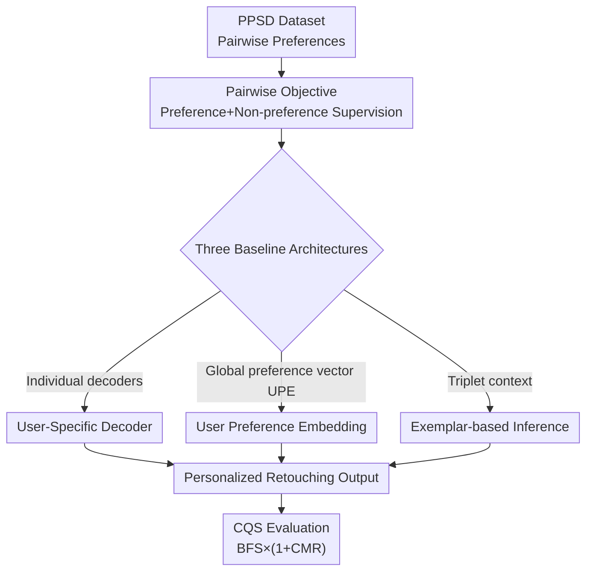

# Learning Personalized Photographic Style from Pairwise User Preferences

**Conference**: CVPR 2026  
**Paper**: [CVF Open Access](https://openaccess.thecvf.com/content/CVPR2026/html/Kim_Learning_Personalized_Photographic_Style_from_Pairwise_User_Preferences_CVPR_2026_paper.html)  
**Area**: Image Restoration / Personalized Retouching  
**Keywords**: Personalized Photographic Style, Pairwise Preferences, Image Retouching, Implicit Style Learning, Preference Evaluation

## TL;DR
This paper defines a new task called PPS (Personalized Photographic Style), which involves learning personalized aesthetic preferences from pairwise user judgments and applying them to new photos. The authors provide the PPSD dataset (approximately 60,000 preference judgments from 767 users), three baseline models, and a specialized evaluation metric, CQS, which balances "fidelity" and "preference alignment." The study demonstrates that it is feasible to learn individual aesthetics from purely comparative signals.

## Background & Motivation
**Background**: Making photos "look better" is a consistent demand, but manual tools like Adobe Lightroom have a high barrier to entry. Research has primarily followed two paths for automated stylistic toning: "Photo-Realistic Style Transfer" (PST), where users pick a reference image to transfer colors/tones to a target image; and "Personalized Image Enhancement" (PIE), which learns enhancement mappings from a specific photographer's edits (e.g., Expert A/B in Adobe-MIT 5K) or synthetic degradation-restoration pairs.

**Limitations of Prior Work**: Both paths rely on **clearly defined source-target pairs**. PST requires a reference image for every target, yet a single reference cannot capture a person's entire aesthetic profile. PIE requires explicit photographer identities or paired data as supervision signals. In reality, average users lack both reference images and "correct answers"—they can only indicate which of two options they prefer.

**Key Challenge**: Personal aesthetics **exist only implicitly in the user's mind** without a single ground truth, particularly in subtle and subjective dimensions like color and tone. Existing paradigms require either explicit references or explicit degradations, making them unable to directly utilize the fuzzy supervision of "relative preferences."

**Goal**: To address three bottlenecks hindering this direction: the lack of large-scale pairwise preference data, the lack of understanding of effective "fuzzy preference learning" methods, and the lack of a suitable evaluation framework.

**Key Insight**: Drawing from successful pairwise preference learning in NLP (HH-RLHF, UltraFeedback) and Text-to-Image models (Pick-a-Pic, HPDv3), the authors argue that **pairwise comparisons are more natural and reliable than absolute scoring** when objective answers are unavailable. This approach is systematically applied to the nuanced perceptual domain of "color and tone" for the first time.

**Core Idea**: Infer implicit user aesthetics using purely comparative signals—identifying which tone rendition a user prefers among variants of the same scene—and generalize this preference to entirely different image content.

## Method

### Overall Architecture
The authors state that **the goal is not to build the strongest model, but to establish the foundation for the PPS task**. This involves crowdsourcing the large-scale PPSD dataset, designing a training paradigm that utilizes "preference pairs" instead of "source-target pairs," implementing and comparing three representative baseline architectures, and fairly evaluating them using the specialized CQS metric. The entire pipeline forms a self-consistent loop from data to method to evaluation.

A common protocol is used for all methods: given a preference pair $(I_p, I_n)$ of the same scene (where the user prefers $I_p$ over $I_n$), one image is randomly selected as input to generate an output $\hat{I}$. This output is then supervised by **both the preferred and non-preferred images simultaneously**. The three methods differ only in "how the user preference context is injected into the generation process."

### Key Designs

**1. PPSD Dataset: Quantifying "subjective aesthetics" into learnable pairwise signals**

Whether the task is learnable depends fundamentally on data availability. The authors developed a web application for crowdsourcing: 858 participants answered 90 pairwise comparison questions each (80 main tasks + 10 consistency checks). After filtering for response time and consistency (re-checking flipped pairs), 767 valid users remained, providing approximately 60,000 valid preference judgments across 1,192 scenes and 7,972 unique image pairs. A "user" is defined as a unique "person + device" combination, as display conditions affect preference.

The core ingenuity of the dataset lies in **using five types of sources to create diverse tone variants**, allowing the model to see a broad stylistic space. Type A uses multiple professional photographer edits from 188 scenes in Adobe-MIT 5K; Type B uses different ISP processing of the same scene across 12 camera devices; Type C uses FLUX-krea/Qwen-Images followed by Llava-written "photo-realistic" retouching instructions executed via FLUX-kontext; Type D applies controlled edits (saturation, brightness, professional LUTs) for **isolated** preference analysis; Type E ensures content diversity (animals, nature, architecture, etc.). Pairwise comparison was chosen because users find it easier to articulate preferences when options are presented side-by-side.

**2. Three Baseline Architectures: Three ways to inject preference from "per-user decoders" to "training-free context inference"**

The authors compared three paths for injecting fuzzy preferences into models, covering varying costs:

*(a) User-Specific Decoder*—A shared encoder $E$ extracts features, while **each user is assigned an individual decoder** $D_u$. The decoder uses implicit neural representation (LIIF) to predict RGB for any normalized coordinate $c\in[0,1]^2$: $\hat{I}_u(c)=D_u(F(c),c)$, where $F=E(I)$. During inference, the encoder is frozen while a new decoder is initialized and trained on the user's $N$ reference preferences (inference-time training).

*(b) User Preference Embedding (UPE)*—Uses a **single global decoder**, with personalization provided by a compact user preference embedding $e_u$. For each preference pair $(I_p^{(i)}, I_n^{(i)})$, DINOv2 features $f(\cdot)$ are used to calculate "content embeddings" (via summation) and "style embeddings" (via subtraction to capture preference direction): $e_{content}^{(i)}=f(I_p^{(i)})+f(I_n^{(i)})$ and $e_{style}^{(i)}=f(I_p^{(i)})-f(I_n^{(i)})$. These are aggregated by a shallow Transformer $g(\cdot)$ into $e_u$. **The key benefit is no training for new users**, as $e_u$ is extracted directly from $N$ samples. "Subtraction to capture direction" is the essence of this path.

*(c) Exemplar-based Inference*—Adapts PIE-MSM's "contextual style prediction" for a training-free approach. Since preference pairs lack explicit input-output mappings, the authors feed $N$ **triplets** $\{(s^{(i)}, p^{(i)}, n^{(i)})\}$ (scene, preferred, non-preferred) as context. Each triplet encodes content $z_{content}^{(i)}=\phi_c(s^{(i)})$, preferred direction $z_{prefer}^{(i)}=\psi_s(p^{(i)})-\psi_s(s^{(i)})$, and non-preferred direction $z_{non\text{-}prefer}^{(i)}=\psi_s(n^{(i)})-\psi_s(s^{(i)})$. The Transformer directly predicts the preference style for the query image.

**3. Loss & Training: Dual supervision with a curriculum for $w$**

PPS lacks a ground truth—a preference pair only shows that $I_p$ is better than $I_n$, but **neither is necessarily the "correct" or "incorrect" answer**. To prevent the model from overshooting and damaging image quality, the authors calculate losses against both preferred and non-preferred images:

$$L = w\cdot L_{prefer} + (1-w)\cdot L_{non\text{-}prefer}$$

$w$ follows a **curriculum**: it increases linearly from $0.5$ (equal weight) to $1.5$. Starting with equal weights allows the model to learn stylistic differences without overfitting early on; as $w$ increases, the model leans increasingly toward the preferred target.

**4. CQS Evaluation: Combining "fidelity" and "preference alignment" using geometric mean**

PPS evaluation is difficult: the model must faithfully match the target (fidelity) while aligning with the preferred choice. The authors generate $\hat{I}_p$ and $\hat{I}_n$ for a pair and calculate four cross-distances $d_{pp},d_{pn},d_{np},d_{nn}$ using a metric $M$, then aggregate them into average performance against preferred ($\bar{d}_p$) and non-preferred ($\bar{d}_n$) targets.

Simply using the difference $\Delta=\bar{d}_p-\bar{d}_n$ ignores absolute quality. Thus, they define:

$$\text{CQS} = \text{BFS}\times(1+\text{CMR})$$

Where the Basic Fidelity Score (BFS) is the **geometric mean** of performance (inverse for metrics like ∆E/LPIPS): $\text{BFS}_{\uparrow}=\sqrt{\bar{d}_p\times\bar{d}_n}$; and the Comparison Margin Ratio (CMR) normalizes the preference margin: $\text{CMR}_{\uparrow}=\frac{\bar{d}_p-\bar{d}_n}{\bar{d}_p+\bar{d}_n}$. **Using the geometric mean is critical**—it heavily penalizes models that perform poorly on either target, forcing reasonable fidelity across both aesthetics.

## Key Experimental Results

### Main Results
After filtering users for consistency, 521 remained (471 training / 50 validation). For each validation user, $N=16$ references were used with $M=16$ evaluations. The table below decomposes the three baselines on the ∆E00 metric:

| Model (∆E00↓) | vs. Pref. | vs. Non-Pref. | BFS↑ | CMR↑ | CQS↑ |
|--------------|---------|-----------|------|------|------|
| (a) User-Specific Decoder | 6.50 | 7.18 | 0.146 | 0.050 | 0.154 |
| (b) User Preference Embedding | 4.88 | 5.71 | 0.189 | 0.078 | **0.204** |
| (c) Exemplar-based Inference | 5.06 | 5.17 | 0.196 | 0.011 | 0.197 |

Final CQS comparison across metrics (Model (b) leads in all four, particularly in PSNR):

| CQS↑ | ∆E00 | LPIPS | PSNR | SSIM |
|------|------|-------|------|------|
| (a) | 0.154 | 7.24 | 25.72 | 0.855 |
| (b) | **0.204** | **9.99** | **36.63** | **0.879** |
| (c) | 0.197 | 7.00 | 25.52 | 0.867 |

The key takeaway is that **CMR is positive for all three baselines**, proving they successfully learned the preference direction. CQS correctly penalizes Model (a) for poor absolute fidelity despite its preference margin.

### Ablation Study

| Dimension | Config | ∆E00 CQS | PSNR CQS | Insight |
|---------|------|---------|---------|------|
| Training Users | N=50 | 0.185 | 30.39 | More users yield better results. |
| Training Users | N=471 (full) | 0.204 | 36.66 | Performance has not yet saturated. |
| Ref. Samples | N=4 | 0.195 | 34.7 | Underfitting due to too few references. |
| Ref. Samples | N=16 | 0.204 | 36.66 | Optimal. |
| Ref. Samples | N=32 | 0.195 | 33.0 | Performance drops due to noise/conflicts. |

### Key Findings
- **Training user diversity is the primary performance driver**: CQS increases monotonically with the number of training users, suggesting that seeing more individual preferences helps learn generalizable personalized patterns.
- **Reference sample count has a "sweet spot"**: Performance peaks at $N=16$; exceeding this introduces noise or conflicting preference signals.
- **Model (b) (UPE) is overall the best**: It requires no training for new users and significantly outperforms other paths in PSNR.

## Highlights & Insights
- **Turning vague subjective aesthetics into an engineering problem**: The core insight is that "preference direction can be encoded by feature subtraction" ($f(I_p)-f(I_n)$).
- **CQS design is highly reusable**: Using the geometric mean to prevent "cheating" by ignoring one goal is a universal concept for multi-objective tasks.
- **Generative models as "style variant factories"**: Using Llava to write retouching scripts and FLUX-kontext to execute them allows for low-cost acquisition of realistic tone variants.
- **Refined definition of a "user"**: Defining identity as "person × device" accounts for varying display conditions.

## Limitations & Future Work
- **Foundation vs. SOTA**: The three methods are starting points; absolute CQS scores remain low, and a specifically optimized strong model for PPS is still needed.
- **Crowdsourcing fatigue**: The 90-question-per-person session is taxing; future work could look into incremental preference accumulation via mobile devices.
- **Automation vs. Agency**: Whether full automation is the optimal experience remains an open question; balancing automation with user control is a future HCI research direction.
- **Unexplored potential**: Advanced preference optimization methods like DPO/Diffusion-DPO have not yet been applied.

## Related Work & Insights
- **vs. PST**: PST relies on single references; PPS learns from multiple comparisons across contexts for true automated personalization.
- **vs. PIE**: PIE relies on ground truth pairs or photographer IDs; PPS works with implicit mental models through comparative judgments.
- **vs. NLP/T2I Preference Learning**: PPSD brings the pairwise comparison framework to the subtle perceptual domain of "color and tone" for the first time.

## Rating
- Novelty: ⭐⭐⭐⭐ Defined PPS task and provided complete data/methods/metrics.
- Experimental Thoroughness: ⭐⭐⭐⭐ Diverse baselines and ablations, though absolute performance is still at baseline levels.
- Writing Quality: ⭐⭐⭐⭐ Logic flow is clear; the necessity of CQS is well-argued.
- Value: ⭐⭐⭐⭐ High value as a foundational benchmark; PPSD and CQS are directly reusable.

<!-- RELATED:START -->

## Related Papers

- [\[CVPR 2026\] Towards Universal Computational Aberration Correction in Photographic Cameras: A Comprehensive Benchmark Analysis](unicac_universal_computational_aberration_correction_benchmark.md)
- [\[CVPR 2025\] OptiFusion: Towards Universal Computational Aberration Correction in Photographic Cameras](../../CVPR2025/image_restoration/towards_universal_computational_aberration_correction_in_photographic_cameras_a_.md)
- [\[CVPR 2026\] LRHDR: Learning Representation-enhanced HDR Video Reconstruction](lrhdr_learning_representation-enhanced_hdr_video_reconstruction.md)
- [\[CVPR 2026\] Coordinate Denoising for Non-Equilibrium Molecular Representation Learning](coordinate_denoising_for_non-equilibrium_molecular_representation_learning.md)
- [\[ECCV 2024\] Pairwise Distance Distillation for Unsupervised Real-World Image Super-Resolution](../../ECCV2024/image_restoration/pairwise_distance_distillation_for_unsupervised_real-world_image_super-resolutio.md)

<!-- RELATED:END -->
